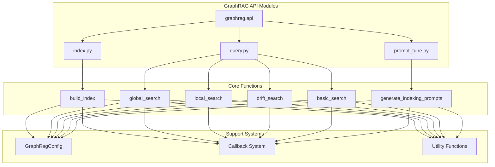
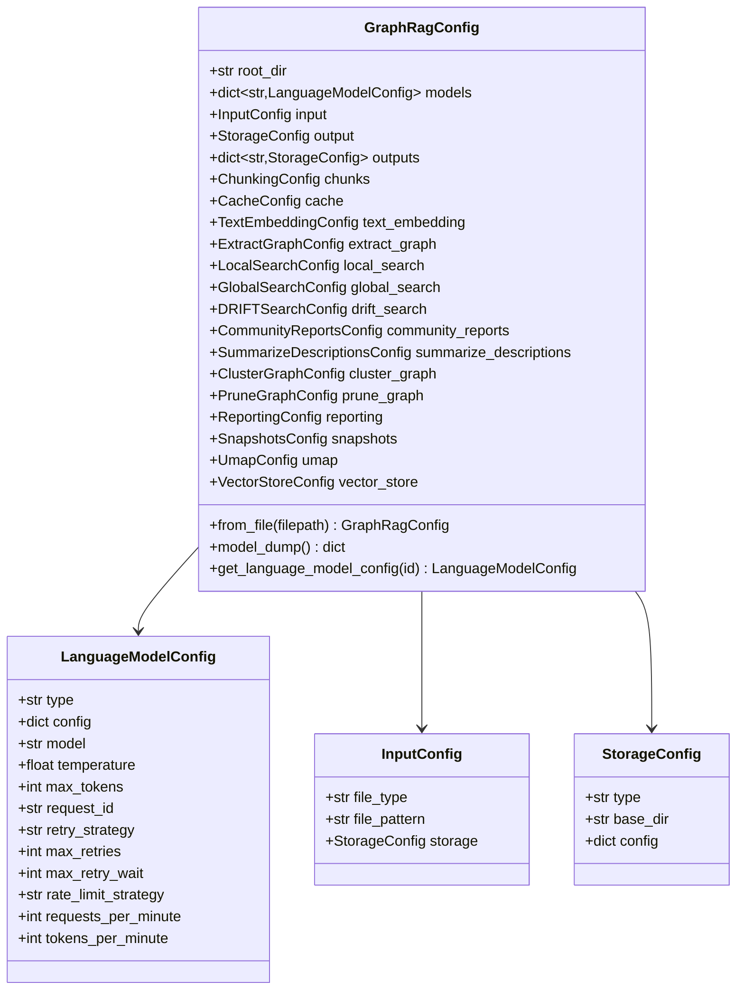

# API Reference

<cite>
**Referenced Files in This Document**
- [graphrag/api/__init__.py](file://graphrag/api/__init__.py)
- [graphrag/api/index.py](file://graphrag/api/index.py)
- [graphrag/api/query.py](file://graphrag/api/query.py)
- [graphrag/api/prompt_tune.py](file://graphrag/api/prompt_tune.py)
- [graphrag/config/models/graph_rag_config.py](file://graphrag/config/models/graph_rag_config.py)
- [graphrag/callbacks/workflow_callbacks.py](file://graphrag/callbacks/workflow_callbacks.py)
- [graphrag/callbacks/query_callbacks.py](file://graphrag/callbacks/query_callbacks.py)
- [graphrag/utils/api.py](file://graphrag/utils/api.py)
- [graphrag/cli/main.py](file://graphrag/cli/main.py)
- [graphrag/cli/index.py](file://graphrag/cli/index.py)
- [graphrag/cli/query.py](file://graphrag/cli/query.py)
- [graphrag/prompt_tune/types.py](file://graphrag/prompt_tune/types.py)
</cite>

## Table of Contents
1. [Introduction](#introduction)
2. [API Overview](#api-overview)
3. [Core Functions](#core-functions)
4. [Configuration Management](#configuration-management)
5. [Callback System](#callback-system)
6. [Result Handling](#result-handling)
7. [Integration Patterns](#integration-patterns)
8. [CLI vs Programmatic Usage](#cli-vs-programmatic-usage)
9. [Advanced Features](#advanced-features)
10. [Best Practices](#best-practices)

## Introduction

The GraphRAG Programmatic API provides a comprehensive interface for integrating knowledge graph capabilities into custom applications. This API enables developers to programmatically build indexes, execute queries, and tune prompts while maintaining full control over the workflow execution and result processing.

The API is designed for scenarios where CLI tools are insufficient, requiring custom orchestration, automated pipelines, or integration with existing application architectures. It offers fine-grained control over indexing workflows, query execution, and prompt generation while preserving the full power and flexibility of the GraphRAG system.

**Section sources**
- [graphrag/api/__init__.py](file://graphrag/api/__init__.py#L1-L48)

## API Overview

The GraphRAG API consists of three primary modules that expose different aspects of the system's functionality:



**Diagram sources**
- [graphrag/api/__init__.py](file://graphrag/api/__init__.py#L10-L47)

### Available Functions

The API exposes the following public functions organized by module:

| Module | Function | Purpose | Return Type |
|--------|----------|---------|-------------|
| **index** | `build_index` | Execute indexing pipeline | `list[PipelineRunResult]` |
| **query** | `global_search` | Global knowledge graph search | `tuple[str, Any]` |
| **query** | `global_search_streaming` | Stream global search results | `AsyncGenerator` |
| **query** | `local_search` | Local entity-centric search | `tuple[str, Any]` |
| **query** | `local_search_streaming` | Stream local search results | `AsyncGenerator` |
| **query** | `drift_search` | DRIFT algorithm search | `tuple[str, Any]` |
| **query** | `drift_search_streaming` | Stream DRIFT search results | `AsyncGenerator` |
| **query** | `basic_search` | Basic vector search | `tuple[str, Any]` |
| **query** | `basic_search_streaming` | Stream basic search results | `AsyncGenerator` |
| **query** | `multi_index_*` | Multi-index search variants | `tuple[str, Any]` |
| **prompt_tune** | `generate_indexing_prompts` | Auto-generate prompts | `tuple[str, str, str]` |

**Section sources**
- [graphrag/api/__init__.py](file://graphrag/api/__init__.py#L28-L47)

## Core Functions

### build_index Function

The `build_index` function serves as the primary entry point for executing the GraphRAG indexing pipeline programmatically.

#### Function Signature
```python
async def build_index(
    config: GraphRagConfig,
    method: IndexingMethod | str = IndexingMethod.Standard,
    is_update_run: bool = False,
    memory_profile: bool = False,
    callbacks: list[WorkflowCallbacks] | None = None,
    additional_context: dict[str, Any] | None = None,
    verbose: bool = False,
    input_documents: pd.DataFrame | None = None,
) -> list[PipelineRunResult]
```

#### Parameters

| Parameter | Type | Default | Description |
|-----------|------|---------|-------------|
| `config` | `GraphRagConfig` | Required | Configuration object containing all pipeline settings |
| `method` | `IndexingMethod \| str` | `IndexingMethod.Standard` | Indexing workflow method (Standard, Fast, StandardUpdate, FastUpdate) |
| `is_update_run` | `bool` | `False` | Whether this is an incremental update run |
| `memory_profile` | `bool` | `False` | Enable memory profiling (currently unsupported) |
| `callbacks` | `list[WorkflowCallbacks] \| None` | `None` | List of callback handlers for monitoring |
| `additional_context` | `dict[str, Any] \| None` | `None` | Additional context data accessible in pipeline state |
| `verbose` | `bool` | `False` | Enable verbose logging |
| `input_documents` | `pd.DataFrame \| None` | `None` | Override default document loading with custom DataFrame |

#### Return Type
Returns a list of `PipelineRunResult` objects containing execution results for each workflow.

#### Usage Examples

**Basic Indexing:**
```python
import asyncio
from graphrag.api import build_index
from graphrag.config.models import GraphRagConfig
from graphrag.callbacks.console_workflow_callbacks import ConsoleWorkflowCallbacks

# Load configuration
config = GraphRagConfig.from_file("settings.yaml")

# Execute indexing with console callbacks
results = await build_index(
    config=config,
    method="standard",
    callbacks=[ConsoleWorkflowCallbacks()],
    verbose=True
)

# Process results
for result in results:
    if result.errors:
        print(f"Workflow {result.workflow} failed with errors: {result.errors}")
    else:
        print(f"Workflow {result.workflow} completed successfully")
```

**Incremental Update:**
```python
# Perform incremental update
results = await build_index(
    config=config,
    method="standard-update",
    is_update_run=True,
    input_documents=new_documents_df,
    verbose=True
)
```

**Custom Callback Registration:**
```python
class CustomCallback:
    def pipeline_start(self, names: list[str]) -> None:
        print(f"Starting pipeline with workflows: {names}")
    
    def workflow_start(self, name: str, instance: object) -> None:
        print(f"Starting workflow: {name}")
    
    def workflow_end(self, name: str, instance: object) -> None:
        print(f"Completed workflow: {name}")

custom_callbacks = [CustomCallback()]
results = await build_index(
    config=config,
    callbacks=custom_callbacks
)
```

**Section sources**
- [graphrag/api/index.py](file://graphrag/api/index.py#L29-L102)

### Query Functions

The query API provides multiple search algorithms optimized for different use cases and data access patterns.

#### Global Search

Global search performs comprehensive knowledge graph traversal across all communities and entities.

```python
async def global_search(
    config: GraphRagConfig,
    entities: pd.DataFrame,
    communities: pd.DataFrame,
    community_reports: pd.DataFrame,
    community_level: int | None,
    dynamic_community_selection: bool,
    response_type: str,
    query: str,
    callbacks: list[QueryCallbacks] | None = None,
    verbose: bool = False,
) -> tuple[str | dict[str, Any] | list[dict[str, Any]], str | list[pd.DataFrame] | dict[str, pd.DataFrame]]
```

#### Local Search

Local search focuses on entity-centric exploration within specific community boundaries.

```python
async def local_search(
    config: GraphRagConfig,
    entities: pd.DataFrame,
    communities: pd.DataFrame,
    community_reports: pd.DataFrame,
    text_units: pd.DataFrame,
    relationships: pd.DataFrame,
    covariates: pd.DataFrame | None,
    community_level: int,
    response_type: str,
    query: str,
    callbacks: list[QueryCallbacks] | None = None,
    verbose: bool = False,
) -> tuple[str | dict[str, Any] | list[dict[str, Any]], str | list[pd.DataFrame] | dict[str, pd.DataFrame]]
```

#### Streaming Variants

All search functions have streaming counterparts that return `AsyncGenerator` for real-time result processing:

```python
async def global_search_streaming(...)
async def local_search_streaming(...)
async def drift_search_streaming(...)
async def basic_search_streaming(...)
```

#### Multi-Index Search

Multi-index variants enable cross-index queries across multiple knowledge graphs:

```python
async def multi_index_global_search(...)
async def multi_index_local_search(...)
async def multi_index_drift_search(...)
async def multi_index_basic_search(...)
```

#### Search Algorithm Comparison

| Algorithm | Scope | Use Case | Performance | Context Quality |
|-----------|-------|----------|-------------|-----------------|
| **Global Search** | Full graph | Comprehensive queries | Medium | High |
| **Local Search** | Entity-focused | Specific entity queries | High | Very High |
| **Drift Search** | Adaptive | Exploratory queries | Medium | High |
| **Basic Search** | Vector-only | Simple similarity | High | Low |

**Section sources**
- [graphrag/api/query.py](file://graphrag/api/query.py#L63-L800)

### generate_indexing_prompts Function

The prompt tuning API automatically generates optimized prompts for indexing based on input documents.

#### Function Signature
```python
async def generate_indexing_prompts(
    config: GraphRagConfig,
    chunk_size: PositiveInt = 1024,
    overlap: int = 0,
    limit: PositiveInt = 15,
    selection_method: DocSelectionType = DocSelectionType.RANDOM,
    domain: str | None = None,
    language: str | None = None,
    max_tokens: int = 4000,
    discover_entity_types: bool = True,
    min_examples_required: PositiveInt = 2,
    n_subset_max: PositiveInt = 300,
    k: PositiveInt = 15,
    verbose: bool = False,
) -> tuple[str, str, str]
```

#### Parameters

| Parameter | Type | Default | Description |
|-----------|------|---------|-------------|
| `config` | `GraphRagConfig` | Required | Configuration object |
| `chunk_size` | `PositiveInt` | `1024` | Token size for document chunking |
| `overlap` | `int` | `0` | Overlap between chunks |
| `limit` | `PositiveInt` | `15` | Maximum chunks to process |
| `selection_method` | `DocSelectionType` | `DocSelectionType.RANDOM` | Document selection strategy |
| `domain` | `str \| None` | `None` | Target domain specification |
| `language` | `str \| None` | `None` | Target language |
| `max_tokens` | `int` | `4000` | Maximum tokens for prompts |
| `discover_entity_types` | `bool` | `True` | Enable automatic entity type detection |
| `min_examples_required` | `PositiveInt` | `2` | Minimum examples for prompt generation |
| `n_subset_max` | `PositiveInt` | `300` | Maximum subset size for auto-selection |
| `k` | `PositiveInt` | `15` | Number of documents for auto-selection |
| `verbose` | `bool` | `False` | Enable verbose logging |

#### Return Type
Returns a tuple of three strings containing:
1. Entity extraction prompt
2. Entity summarization prompt  
3. Community summarization prompt

#### Usage Example
```python
from graphrag.api import generate_indexing_prompts
from graphrag.prompt_tune.types import DocSelectionType

# Generate optimized prompts
entity_prompt, entity_summarize_prompt, community_summarize_prompt = await generate_indexing_prompts(
    config=config,
    chunk_size=512,
    selection_method=DocSelectionType.AUTO,
    discover_entity_types=True,
    verbose=True
)

print("Entity Extraction Prompt:")
print(entity_prompt[:200] + "...")  # First 200 chars

print("\nEntity Summarization Prompt:")
print(entity_summarize_prompt[:200] + "...")

print("\nCommunity Summarization Prompt:")
print(community_summarize_prompt[:200] + "...")
```

**Section sources**
- [graphrag/api/prompt_tune.py](file://graphrag/api/prompt_tune.py#L56-L203)

## Configuration Management

### GraphRagConfig Class

The `GraphRagConfig` class serves as the central configuration object for all GraphRAG operations.

#### Configuration Loading

```python
from graphrag.config.models import GraphRagConfig

# Load from YAML file
config = GraphRagConfig.from_file("settings.yaml")

# Load from JSON file  
config = GraphRagConfig.from_file("settings.json")

# Create from dictionary
config_data = {
    "root_dir": "./my_project",
    "input": {
        "file_type": "text",
        "file_pattern": "*.txt"
    },
    "output": {
        "base_dir": "./output"
    }
}
config = GraphRagConfig(**config_data)
```

#### Configuration Structure

The configuration object contains multiple nested configuration sections:



**Diagram sources**
- [graphrag/config/models/graph_rag_config.py](file://graphrag/config/models/graph_rag_config.py#L48-L200)

#### Configuration Validation

The API automatically validates configuration during loading:

```python
try:
    config = GraphRagConfig.from_file("settings.yaml")
except Exception as e:
    print(f"Configuration error: {e}")
    # Handle invalid configuration
```

**Section sources**
- [graphrag/config/models/graph_rag_config.py](file://graphrag/config/models/graph_rag_config.py#L48-L200)

## Callback System

### Workflow Callbacks

Workflow callbacks enable monitoring and customization of the indexing pipeline execution.

#### Callback Interface

```python
from graphrag.callbacks.workflow_callbacks import WorkflowCallbacks

class CustomWorkflowCallback(WorkflowCallbacks):
    def pipeline_start(self, names: list[str]) -> None:
        """Called when the entire pipeline starts."""
        print(f"Pipeline starting with workflows: {names}")
    
    def pipeline_end(self, results: list[PipelineRunResult]) -> None:
        """Called when the pipeline completes."""
        print(f"Pipeline completed with {len(results)} workflows")
    
    def workflow_start(self, name: str, instance: object) -> None:
        """Called when a workflow starts."""
        print(f"Starting workflow: {name}")
    
    def workflow_end(self, name: str, instance: object) -> None:
        """Called when a workflow completes."""
        print(f"Completed workflow: {name}")
    
    def progress(self, progress: Progress) -> None:
        """Called when progress updates occur."""
        print(f"Progress: {progress.percentage}%")
```

#### Query Callbacks

Query callbacks monitor search execution and provide context data access:

```python
from graphrag.callbacks.query_callbacks import QueryCallbacks

class CustomQueryCallback(QueryCallbacks):
    def on_context(self, context: Any) -> None:
        """Called when context data is constructed."""
        print(f"Context built: {len(context)} items")
    
    def on_map_response_start(self, map_response_contexts: list[str]) -> None:
        """Called at the start of map operation."""
        print(f"Map operation starting with {len(map_response_contexts)} contexts")
    
    def on_map_response_end(self, map_response_outputs: list[SearchResult]) -> None:
        """Called at the end of map operation."""
        print(f"Map operation completed with {len(map_response_outputs)} results")
    
    def on_reduce_response_start(self, reduce_response_context: str | dict[str, Any]) -> None:
        """Called at the start of reduce operation."""
        print("Reduce operation starting")
    
    def on_reduce_response_end(self, reduce_response_output: str) -> None:
        """Called at the end of reduce operation."""
        print("Reduce operation completed")
    
    def on_llm_new_token(self, token) -> None:
        """Called when a new token is generated."""
        print(token, end="", flush=True)
```

#### Callback Registration

```python
# Register multiple callbacks
callbacks = [
    CustomWorkflowCallback(),
    CustomQueryCallback(),
    ConsoleWorkflowCallbacks()
]

# Pass to API functions
await build_index(
    config=config,
    callbacks=callbacks
)

await global_search(
    config=config,
    entities=entities_df,
    communities=communities_df,
    community_reports=community_reports_df,
    callbacks=[CustomQueryCallback()]
)
```

**Section sources**
- [graphrag/callbacks/workflow_callbacks.py](file://graphrag/callbacks/workflow_callbacks.py#L12-L38)
- [graphrag/callbacks/query_callbacks.py](file://graphrag/callbacks/query_callbacks.py#L12-L34)

## Result Handling

### Pipeline Run Results

The `build_index` function returns `PipelineRunResult` objects containing execution metadata:

```python
from graphrag.index.typing.pipeline_run_result import PipelineRunResult

# Process results
for result in results:
    print(f"Workflow: {result.workflow}")
    print(f"Success: {result.success}")
    print(f"Duration: {result.duration}")
    print(f"Errors: {result.errors}")
    print(f"Result: {result.result}")
```

### Query Response Formats

Query functions return tuples containing both response content and context data:

```python
# Standard query response
response, context_data = await global_search(
    config=config,
    entities=entities_df,
    communities=communities_df,
    community_reports=community_reports_df,
    query="What is the company's revenue?"
)

print(f"Response: {response}")
print(f"Context sources: {len(context_data['sources'])} documents")
print(f"Related entities: {len(context_data['entities'])}")
```

### Context Data Structure

Context data is standardized across all query functions:

```python
context_structure = {
    "reports": [],           # Community reports
    "entities": [],          # Related entities
    "relationships": [],     # Entity relationships
    "claims": [],           # Covariates/claims
    "sources": []           # Source documents
}
```

### Streaming Response Processing

For streaming functions, process results incrementally:

```python
async def process_streaming_search():
    full_response = ""
    context_data = {}
    
    def on_context(context: Any) -> None:
        nonlocal context_data
        context_data = context
    
    callbacks = [CustomQueryCallback()]
    callbacks[0].on_context = on_context
    
    async for chunk in global_search_streaming(
        config=config,
        entities=entities_df,
        communities=communities_df,
        community_reports=community_reports_df,
        query="What is the company's revenue?",
        callbacks=callbacks
    ):
        full_response += chunk
        print(chunk, end="", flush=True)
    
    print(f"\nFull response length: {len(full_response)}")
    return full_response, context_data
```

**Section sources**
- [graphrag/utils/api.py](file://graphrag/utils/api.py#L144-L200)

## Integration Patterns

### Application Integration

#### Web Application Integration

```python
import asyncio
from fastapi import FastAPI, HTTPException
from graphrag.api import build_index, global_search
from graphrag.config.models import GraphRagConfig

app = FastAPI()

@app.post("/index")
async def index_documents(config_path: str, documents: list[dict]):
    """Index documents programmatically."""
    try:
        config = GraphRagConfig.from_file(config_path)
        
        # Convert documents to DataFrame
        import pandas as pd
        documents_df = pd.DataFrame(documents)
        
        # Execute indexing
        results = await build_index(
            config=config,
            input_documents=documents_df,
            callbacks=[LoggingCallback()]
        )
        
        return {"status": "success", "results": len(results)}
    except Exception as e:
        raise HTTPException(status_code=500, detail=str(e))

@app.get("/search")
async def search(query: str, config_path: str):
    """Search the indexed knowledge graph."""
    try:
        config = GraphRagConfig.from_file(config_path)
        
        # Load index data (typically cached or stored)
        entities_df = load_entities()
        communities_df = load_communities()
        community_reports_df = load_community_reports()
        
        # Execute search
        response, context = await global_search(
            config=config,
            entities=entities_df,
            communities=communities_df,
            community_reports=community_reports_df,
            query=query,
            community_level=2,
            dynamic_community_selection=True,
            response_type="text"
        )
        
        return {
            "response": response,
            "context": context,
            "sources_count": len(context["sources"])
        }
    except Exception as e:
        raise HTTPException(status_code=500, detail=str(e))
```

#### Batch Processing Pipeline

```python
import asyncio
from pathlib import Path
from graphrag.api import build_index, global_search
from graphrag.config.models import GraphRagConfig

async def batch_processing_pipeline(
    config_path: str,
    input_directory: str,
    output_directory: str
):
    """Process multiple document batches."""
    config = GraphRagConfig.from_file(config_path)
    
    # Set output directories
    config.output.base_dir = output_directory
    
    # Process each batch
    input_path = Path(input_directory)
    batch_files = list(input_path.glob("*.txt"))
    
    for batch_file in batch_files:
        print(f"Processing batch: {batch_file.name}")
        
        # Load batch documents
        import pandas as pd
        documents_df = pd.DataFrame([
            {"id": str(i), "text": doc.read_text()}
            for i, doc in enumerate(batch_files)
        ])
        
        # Execute indexing
        results = await build_index(
            config=config,
            input_documents=documents_df,
            callbacks=[ConsoleWorkflowCallbacks()]
        )
        
        # Verify successful completion
        if all(result.success for result in results):
            print(f"Batch {batch_file.name} processed successfully")
        else:
            print(f"Batch {batch_file.name} failed")
    
    print("Batch processing completed")
```

#### Real-time Search Application

```python
import asyncio
from typing import Dict, Any
from graphrag.api import global_search, local_search
from graphrag.config.models import GraphRagConfig

class SearchService:
    def __init__(self, config_path: str):
        self.config = GraphRagConfig.from_file(config_path)
        self.entities_df = None
        self.communities_df = None
        self.community_reports_df = None
        
        # Load index data
        self._load_index_data()
    
    def _load_index_data(self):
        """Load index data from storage."""
        # Implementation depends on storage backend
        self.entities_df = load_dataframe("entities.parquet")
        self.communities_df = load_dataframe("communities.parquet")
        self.community_reports_df = load_dataframe("community_reports.parquet")
    
    async def search(self, query: str, search_type: str = "global") -> Dict[str, Any]:
        """Execute search with appropriate algorithm."""
        if search_type == "global":
            response, context = await global_search(
                config=self.config,
                entities=self.entities_df,
                communities=self.communities_df,
                community_reports=self.community_reports_df,
                query=query,
                community_level=2,
                dynamic_community_selection=True,
                response_type="text"
            )
        elif search_type == "local":
            response, context = await local_search(
                config=self.config,
                entities=self.entities_df,
                communities=self.communities_df,
                community_reports=self.community_reports_df,
                text_units=load_dataframe("text_units.parquet"),
                relationships=load_dataframe("relationships.parquet"),
                query=query,
                community_level=2,
                response_type="text"
            )
        else:
            raise ValueError(f"Unknown search type: {search_type}")
        
        return {
            "response": response,
            "context": context,
            "metadata": {
                "search_type": search_type,
                "timestamp": datetime.now().isoformat(),
                "sources_count": len(context["sources"]),
                "entities_count": len(context["entities"])
            }
        }

# Usage
search_service = SearchService("settings.yaml")

async def demo_search():
    result = await search_service.search(
        query="What are the main challenges faced by the company?",
        search_type="global"
    )
    print(f"Response: {result['response'][:200]}...")
    print(f"Sources: {len(result['context']['sources'])}")
```

### Automation Scenarios

#### Scheduled Index Updates

```python
import asyncio
from datetime import datetime, timedelta
from graphrag.api import build_index
from graphrag.config.models import GraphRagConfig

async def scheduled_index_update(config_path: str, interval_hours: float = 24):
    """Automatically update index at regular intervals."""
    config = GraphRagConfig.from_file(config_path)
    
    while True:
        print(f"Starting scheduled index update at {datetime.now()}")
        
        try:
            # Load new documents
            new_documents = load_new_documents_since_last_update()
            
            if new_documents:
                results = await build_index(
                    config=config,
                    method="standard-update",
                    input_documents=new_documents,
                    callbacks=[LoggingCallback()]
                )
                
                print(f"Updated {len(new_documents)} documents")
            else:
                print("No new documents to process")
                
        except Exception as e:
            print(f"Index update failed: {e}")
        
        # Wait for next interval
        await asyncio.sleep(interval_hours * 3600)

# Start scheduler
asyncio.run(scheduled_index_update("settings.yaml"))
```

#### Multi-tenant Processing

```python
import asyncio
from typing import Dict, List
from graphrag.api import build_index, global_search
from graphrag.config.models import GraphRagConfig

class MultiTenantService:
    def __init__(self, base_config_path: str):
        self.base_config = GraphRagConfig.from_file(base_config_path)
        self.tenant_configs: Dict[str, GraphRagConfig] = {}
        self.tenant_data: Dict[str, Dict[str, Any]] = {}
    
    async def setup_tenant(self, tenant_id: str, tenant_config: Dict[str, Any]):
        """Set up configuration for a new tenant."""
        # Merge tenant config with base config
        tenant_config_merged = {**self.base_config.model_dump(), **tenant_config}
        self.tenant_configs[tenant_id] = GraphRagConfig(**tenant_config_merged)
        
        # Initialize tenant data storage
        self.tenant_data[tenant_id] = {
            "entities": None,
            "communities": None,
            "community_reports": None
        }
    
    async def index_tenant_data(self, tenant_id: str, documents: List[Dict[str, Any]]):
        """Index data for a specific tenant."""
        config = self.tenant_configs[tenant_id]
        
        # Convert to DataFrame
        import pandas as pd
        documents_df = pd.DataFrame(documents)
        
        results = await build_index(
            config=config,
            input_documents=documents_df,
            callbacks=[TenantLoggingCallback(tenant_id)]
        )
        
        # Store index data for this tenant
        self.tenant_data[tenant_id]["entities"] = load_dataframe("entities.parquet")
        self.tenant_data[tenant_id]["communities"] = load_dataframe("communities.parquet")
        self.tenant_data[tenant_id]["community_reports"] = load_dataframe("community_reports.parquet")
        
        return results
    
    async def tenant_search(self, tenant_id: str, query: str) -> Dict[str, Any]:
        """Perform search for a specific tenant."""
        if tenant_id not in self.tenant_data:
            raise ValueError(f"Tenant {tenant_id} not configured")
        
        tenant_data = self.tenant_data[tenant_id]
        
        response, context = await global_search(
            config=self.tenant_configs[tenant_id],
            entities=tenant_data["entities"],
            communities=tenant_data["communities"],
            community_reports=tenant_data["community_reports"],
            query=query,
            community_level=2,
            dynamic_community_selection=True,
            response_type="text"
        )
        
        return {
            "response": response,
            "context": context,
            "tenant_id": tenant_id
        }

# Usage
async def multi_tenant_demo():
    service = MultiTenantService("base_settings.yaml")
    
    # Setup tenants
    await service.setup_tenant("tenant_a", {"output": {"base_dir": "./tenant_a"}})
    await service.setup_tenant("tenant_b", {"output": {"base_dir": "./tenant_b"}})
    
    # Index tenant data
    await service.index_tenant_data("tenant_a", [{"id": "1", "text": "Company A data..."}])
    await service.index_tenant_data("tenant_b", [{"id": "1", "text": "Company B data..."}])
    
    # Tenant-specific searches
    result_a = await service.tenant_search("tenant_a", "What does Company A do?")
    result_b = await service.tenant_search("tenant_b", "What does Company B do?")
```

## CLI vs Programmatic Usage

### Feature Comparison

| Feature | CLI | Programmatic API | Benefits |
|---------|-----|------------------|----------|
| **Configuration** | File-based only | Code + file-based | Dynamic config generation |
| **Error Handling** | Exit codes only | Full exception handling | Graceful error recovery |
| **Monitoring** | Verbose logging | Callback system | Custom monitoring |
| **Automation** | Script-based | Native async support | Better concurrency |
| **Integration** | Shell/process | Direct library calls | Lower overhead |
| **Customization** | Limited | Full control | Custom workflows |

### Migration Examples

#### CLI to API Migration

**CLI Command:**
```bash
graphrag index --config settings.yaml --method standard --verbose
```

**Programmatic Equivalent:**
```python
import asyncio
from graphrag.api import build_index
from graphrag.config.models import GraphRagConfig
from graphrag.callbacks.console_workflow_callbacks import ConsoleWorkflowCallbacks

async def run_indexing():
    config = GraphRagConfig.from_file("settings.yaml")
    
    results = await build_index(
        config=config,
        method="standard",
        verbose=True,
        callbacks=[ConsoleWorkflowCallbacks()]
    )
    
    # Process results programmatically
    for result in results:
        if result.success:
            print(f"Workflow {result.workflow} succeeded")
        else:
            print(f"Workflow {result.workflow} failed: {result.errors}")

asyncio.run(run_indexing())
```

#### CLI Query to API Migration

**CLI Command:**
```bash
graphrag query global --root ./project --query "What is the company's revenue?"
```

**Programmatic Equivalent:**
```python
import asyncio
from graphrag.api import global_search
from graphrag.config.models import GraphRagConfig

async def run_query():
    config = GraphRagConfig.from_file("./project/settings.yaml")
    
    # Load index data
    import pandas as pd
    entities_df = pd.read_parquet("./project/output/entities.parquet")
    communities_df = pd.read_parquet("./project/output/communities.parquet")
    community_reports_df = pd.read_parquet("./project/output/community_reports.parquet")
    
    response, context = await global_search(
        config=config,
        entities=entities_df,
        communities=communities_df,
        community_reports=community_reports_df,
        query="What is the company's revenue?",
        community_level=2,
        dynamic_community_selection=True,
        response_type="text"
    )
    
    print(f"Response: {response}")
    print(f"Sources: {len(context['sources'])}")

asyncio.run(run_query())
```

### When to Choose Programmatic API

Choose the programmatic API when:

1. **Custom Orchestration Needed**: Complex workflows requiring custom logic
2. **Real-time Processing**: Need immediate response to user queries
3. **Integration Requirements**: Must integrate with existing applications
4. **Automation Pipelines**: Require scheduled or event-driven processing
5. **Multi-tenant Support**: Need separate configurations per tenant
6. **Custom Monitoring**: Require detailed execution monitoring
7. **Error Recovery**: Need sophisticated error handling and retry logic

### When to Stick with CLI

Choose the CLI when:

1. **Simple Workflows**: Standard indexing and querying without customization
2. **Development**: Quick prototyping and testing
3. **Batch Processing**: Large-scale batch operations
4. **Script Integration**: Simple shell script integration
5. **Documentation**: Clear separation of concerns

**Section sources**
- [graphrag/cli/main.py](file://graphrag/cli/main.py#L1-L200)
- [graphrag/cli/index.py](file://graphrag/cli/index.py#L42-L162)
- [graphrag/cli/query.py](file://graphrag/cli/query.py#L24-L200)

## Advanced Features

### Multi-Index Capabilities

The API supports cross-index queries enabling knowledge sharing across multiple domains:

```python
# Load multiple index configurations
configs = [
    GraphRagConfig.from_file("healthcare/settings.yaml"),
    GraphRagConfig.from_file("finance/settings.yaml"),
    GraphRagConfig.from_file("technology/settings.yaml")
]

# Load corresponding index data
index_data = []
for config in configs:
    entities = pd.read_parquet(f"{config.output.base_dir}/entities.parquet")
    communities = pd.read_parquet(f"{config.output.base_dir}/communities.parquet")
    reports = pd.read_parquet(f"{config.output.base_dir}/community_reports.parquet")
    index_data.append({
        "entities": entities,
        "communities": communities,
        "reports": reports
    })

# Execute cross-domain search
response, context = await multi_index_global_search(
    config=configs[0],  # Use first config as base
    entities_list=[data["entities"] for data in index_data],
    communities_list=[data["communities"] for data in index_data],
    community_reports_list=[data["reports"] for data in index_data],
    index_names=["healthcare", "finance", "technology"],
    query="Compare healthcare and financial technology trends",
    community_level=2,
    dynamic_community_selection=True,
    response_type="text",
    streaming=False
)
```

### Custom Embedding Stores

The API supports custom vector stores for specialized deployments:

```python
from graphrag.utils.api import get_embedding_store
from graphrag.vector_stores.base import BaseVectorStore

class CustomVectorStore(BaseVectorStore):
    def __init__(self, connection_string: str):
        self.connection_string = connection_string
    
    def connect(self, **kwargs):
        # Custom connection logic
        pass
    
    def similarity_search_by_vector(self, query_embedding, k=10):
        # Custom similarity search
        pass

# Use custom vector store
embedding_store = get_embedding_store(
    config_args={
        "custom": {
            "type": "custom",
            "connection_string": "your_connection_string"
        }
    },
    embedding_name="text-unit-text"
)
```

### Streaming with Custom Processing

Implement custom streaming processors:

```python
import asyncio
from typing import AsyncGenerator

class StreamingProcessor:
    def __init__(self):
        self.buffer = ""
        self.context_data = {}
    
    async def process_streaming_search(
        self,
        search_func,
        config,
        **kwargs
    ) -> AsyncGenerator[str, None]:
        """Process streaming search with custom logic."""
        
        def on_context(context: Any) -> None:
            self.context_data = context
        
        callbacks = [CustomQueryCallback()]
        callbacks[0].on_context = on_context
        
        async for chunk in search_func(
            config=config,
            callbacks=callbacks,
            **kwargs
        ):
            self.buffer += chunk
            
            # Process complete sentences
            if "." in self.buffer or "?" in self.buffer or "!" in self.buffer:
                sentences = self.buffer.split(".", 1)
                sentence = sentences[0] + "."
                self.buffer = sentences[1] if len(sentences) > 1 else ""
                
                # Custom processing logic
                processed_sentence = self._preprocess(sentence)
                yield processed_sentence
    
    def _preprocess(self, text: str) -> str:
        # Custom text preprocessing
        return text.strip().capitalize()

# Usage
processor = StreamingProcessor()
async for processed_chunk in processor.process_streaming_search(
    global_search_streaming,
    config=config,
    entities=entities_df,
    communities=communities_df,
    community_reports=community_reports_df,
    query="What is the company's revenue?"
):
    print(processed_chunk)
```

### Performance Optimization

#### Parallel Processing

```python
import asyncio
from concurrent.futures import ThreadPoolExecutor

async def parallel_queries(queries: List[str], config: GraphRagConfig):
    """Execute multiple queries in parallel."""
    
    async def execute_single_query(query: str):
        response, context = await global_search(
            config=config,
            entities=entities_df,
            communities=communities_df,
            community_reports=community_reports_df,
            query=query,
            community_level=2,
            dynamic_community_selection=True,
            response_type="text"
        )
        return {"query": query, "response": response, "context": context}
    
    # Limit concurrent executions
    semaphore = asyncio.Semaphore(5)
    
    async def bounded_execute(query: str):
        async with semaphore:
            return await execute_single_query(query)
    
    tasks = [bounded_execute(query) for query in queries]
    results = await asyncio.gather(*tasks)
    
    return results
```

#### Caching Strategies

```python
from functools import lru_cache
import hashlib

class QueryCache:
    def __init__(self, max_size: int = 1000):
        self.cache = {}
        self.max_size = max_size
    
    def _generate_key(self, query: str, config_hash: str) -> str:
        """Generate cache key from query and config."""
        combined = f"{query}:{config_hash}"
        return hashlib.md5(combined.encode()).hexdigest()
    
    def get(self, query: str, config: GraphRagConfig):
        """Get cached result."""
        config_hash = hashlib.md5(str(config.model_dump()).encode()).hexdigest()
        key = self._generate_key(query, config_hash)
        
        return self.cache.get(key)
    
    def set(self, query: str, config: GraphRagConfig, result):
        """Set cache result."""
        if len(self.cache) >= self.max_size:
            # Simple LRU eviction
            oldest_key = next(iter(self.cache))
            del self.cache[oldest_key]
        
        config_hash = hashlib.md5(str(config.model_dump()).encode()).hexdigest()
        key = self._generate_key(query, config_hash)
        self.cache[key] = result

# Usage
query_cache = QueryCache()

async def cached_search(query: str, config: GraphRagConfig):
    """Search with caching."""
    cached_result = query_cache.get(query, config)
    
    if cached_result:
        print("Returning cached result")
        return cached_result
    
    print("Executing new search")
    response, context = await global_search(
        config=config,
        entities=entities_df,
        communities=communities_df,
        community_reports=community_reports_df,
        query=query,
        community_level=2,
        dynamic_community_selection=True,
        response_type="text"
    )
    
    query_cache.set(query, config, (response, context))
    return response, context
```

**Section sources**
- [graphrag/utils/api.py](file://graphrag/utils/api.py#L26-L142)

## Best Practices

### Configuration Management

1. **Environment-Specific Configs**: Use different configurations for development, staging, and production
2. **Secret Management**: Store API keys and sensitive data in environment variables
3. **Validation**: Always validate configurations before use
4. **Version Control**: Track configuration changes with version control

```python
import os
from graphrag.config.models import GraphRagConfig

def load_config_with_env_vars(config_path: str) -> GraphRagConfig:
    """Load configuration with environment variable substitution."""
    config = GraphRagConfig.from_file(config_path)
    
    # Substitute environment variables
    for model_id, model_config in config.models.items():
        for key, value in model_config.config.items():
            if isinstance(value, str) and value.startswith("${") and value.endswith("}"):
                env_var = value[2:-1]
                model_config.config[key] = os.environ.get(env_var, "")
    
    return config
```

### Error Handling

```python
import asyncio
from typing import Any, Dict
from graphrag.api import build_index, global_search
from graphrag.config.models import GraphRagConfig

class GraphRAGClient:
    def __init__(self, config_path: str):
        self.config = GraphRagConfig.from_file(config_path)
        self.max_retries = 3
        self.retry_delay = 1
    
    async def safe_build_index(self, **kwargs) -> Dict[str, Any]:
        """Build index with robust error handling."""
        for attempt in range(self.max_retries):
            try:
                results = await build_index(
                    config=self.config,
                    **kwargs
                )
                
                # Validate results
                failed_workflows = [r for r in results if not r.success]
                if failed_workflows:
                    raise Exception(f"Failed workflows: {[r.workflow for r in failed_workflows]}")
                
                return {"status": "success", "results": results}
                
            except Exception as e:
                if attempt == self.max_retries - 1:
                    return {"status": "failed", "error": str(e)}
                
                await asyncio.sleep(self.retry_delay * (attempt + 1))
    
    async def safe_search(self, query: str, **kwargs) -> Dict[str, Any]:
        """Search with robust error handling."""
        for attempt in range(self.max_retries):
            try:
                response, context = await global_search(
                    config=self.config,
                    query=query,
                    **kwargs
                )
                
                return {
                    "status": "success",
                    "response": response,
                    "context": context
                }
                
            except Exception as e:
                if attempt == self.max_retries - 1:
                    return {"status": "failed", "error": str(e)}
                
                await asyncio.sleep(self.retry_delay * (attempt + 1))
```

### Resource Management

```python
import gc
import psutil
from contextlib import asynccontextmanager

@asynccontextmanager
async def managed_graphrag_session():
    """Context manager for managing GraphRAG resources."""
    try:
        # Pre-warm resources
        config = GraphRagConfig.from_file("settings.yaml")
        
        # Monitor memory usage
        initial_memory = psutil.Process().memory_info().rss
        
        yield config
        
    finally:
        # Cleanup
        gc.collect()
        
        # Log memory usage
        final_memory = psutil.Process().memory_info().rss
        print(f"Memory delta: {(final_memory - initial_memory) / 1024 / 1024:.2f} MB")

# Usage
async def process_large_dataset():
    async with managed_graphrag_session() as config:
        # Process large dataset
        results = await build_index(config=config, method="standard")
        
        # Automatic cleanup happens here
```

### Performance Monitoring

```python
import time
from typing import Callable, Any
from functools import wraps

def monitor_performance(func: Callable) -> Callable:
    """Decorator for monitoring function performance."""
    @wraps(func)
    async def wrapper(*args, **kwargs) -> Any:
        start_time = time.time()
        start_memory = psutil.Process().memory_info().rss
        
        try:
            result = await func(*args, **kwargs)
            
            end_time = time.time()
            end_memory = psutil.Process().memory_info().rss
            
            duration = end_time - start_time
            memory_delta = (end_memory - start_memory) / 1024 / 1024  # MB
            
            print(f"{func.__name__}: {duration:.2f}s, {memory_delta:.2f}MB")
            return result
            
        except Exception as e:
            end_time = time.time()
            print(f"{func.__name__} failed after {end_time - start_time:.2f}s: {e}")
            raise
    
    return wrapper

# Usage
@monitor_performance
async def search_with_monitoring():
    response, context = await global_search(
        config=config,
        entities=entities_df,
        communities=communities_df,
        community_reports=community_reports_df,
        query="What is the company's revenue?"
    )
    return response, context
```

### Security Considerations

1. **Input Validation**: Sanitize all user inputs before processing
2. **Access Control**: Implement proper authentication and authorization
3. **Resource Limits**: Set limits on query complexity and resource usage
4. **Audit Logging**: Log all API operations for security monitoring

```python
import re
from typing import Optional

class SecureGraphRAG:
    def __init__(self, config_path: str):
        self.config = GraphRagConfig.from_file(config_path)
        self.max_query_length = 1000
        self.allowed_domains = {"company.com", "partner.org"}
    
    def sanitize_query(self, query: str) -> str:
        """Sanitize user query."""
        # Remove potentially dangerous characters
        sanitized = re.sub(r'[<>"\']', '', query)
        
        # Limit length
        return sanitized[:self.max_query_length]
    
    def validate_domain(self, query: str) -> bool:
        """Validate query against allowed domains."""
        # Simple domain validation
        return any(domain in query.lower() for domain in self.allowed_domains)
    
    async def secure_search(self, query: str) -> Dict[str, Any]:
        """Secure search implementation."""
        # Input sanitization
        sanitized_query = self.sanitize_query(query)
        
        # Domain validation
        if not self.validate_domain(sanitized_query):
            raise ValueError("Query contains unauthorized domain references")
        
        # Execute search
        response, context = await global_search(
            config=self.config,
            entities=entities_df,
            communities=communities_df,
            community_reports=community_reports_df,
            query=sanitized_query,
            community_level=2,
            dynamic_community_selection=True,
            response_type="text"
        )
        
        return {
            "response": response,
            "context": context,
            "sanitized_query": sanitized_query
        }
```

### Testing Strategies

```python
import pytest
from unittest.mock import AsyncMock, patch
from graphrag.api import build_index, global_search
from graphrag.config.models import GraphRagConfig

@pytest.fixture
def mock_config():
    """Mock GraphRAG configuration for testing."""
    config = AsyncMock(spec=GraphRagConfig)
    config.root_dir = "./test_data"
    return config

@pytest.fixture
def mock_dataframes():
    """Mock DataFrames for testing."""
    import pandas as pd
    return {
        "entities": pd.DataFrame([{"id": "1", "name": "Test Entity"}]),
        "communities": pd.DataFrame([{"id": "1", "name": "Test Community"}]),
        "community_reports": pd.DataFrame([{"id": "1", "summary": "Test Report"}])
    }

class TestGraphRAGAPI:
    @pytest.mark.asyncio
    async def test_build_index_success(self, mock_config):
        """Test successful indexing."""
        with patch('graphrag.api.index.run_pipeline') as mock_run:
            mock_run.return_value = AsyncMock()
            
            results = await build_index(mock_config)
            
            assert len(results) > 0
            assert all(hasattr(r, 'success') for r in results)
    
    @pytest.mark.asyncio
    async def test_global_search_success(self, mock_config, mock_dataframes):
        """Test successful global search."""
        response, context = await global_search(
            config=mock_config,
            entities=mock_dataframes["entities"],
            communities=mock_dataframes["communities"],
            community_reports=mock_dataframes["community_reports"],
            query="Test query",
            community_level=2,
            dynamic_community_selection=True,
            response_type="text"
        )
        
        assert isinstance(response, str)
        assert isinstance(context, dict)
        assert "sources" in context
    
    @pytest.mark.asyncio
    async def test_error_handling(self, mock_config):
        """Test error handling in API calls."""
        with patch('graphrag.api.index.run_pipeline') as mock_run:
            mock_run.side_effect = Exception("Test error")
            
            with pytest.raises(Exception):
                await build_index(mock_config)
```

This comprehensive API reference provides developers with everything needed to effectively integrate GraphRAG functionality into their applications, from basic usage to advanced customization scenarios.