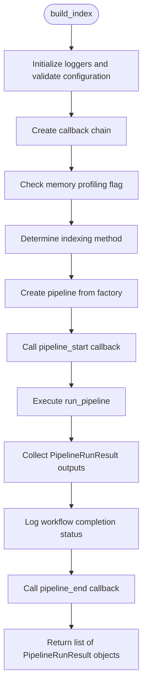
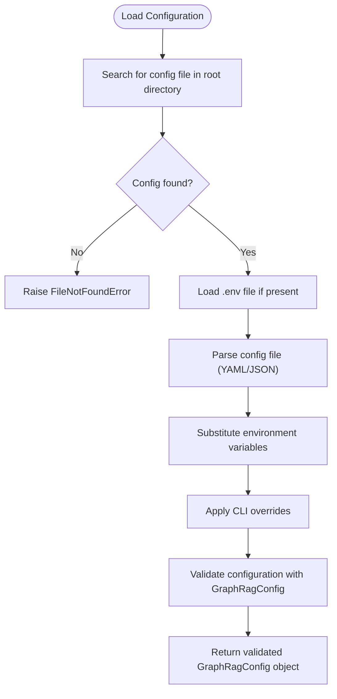
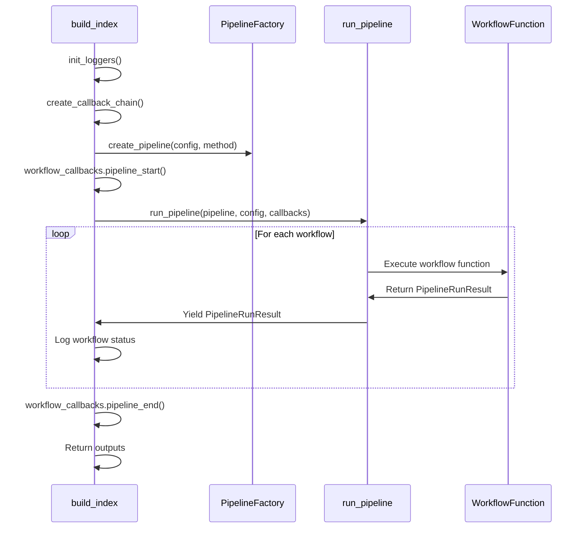
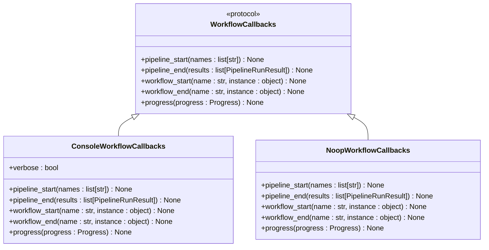
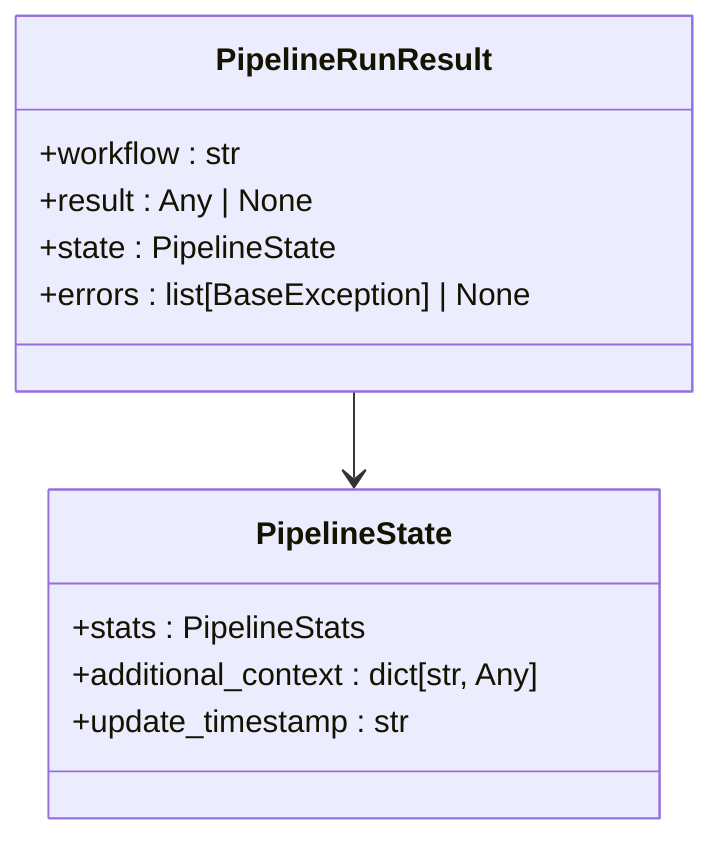
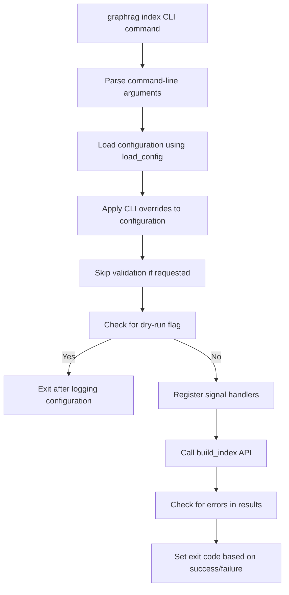

# Indexing API

<cite>
**Referenced Files in This Document**   
- [index.py](file://graphrag/api/index.py)
- [run_pipeline.py](file://graphrag/index/run/run_pipeline.py)
- [load_config.py](file://graphrag/config/load_config.py)
- [factory.py](file://graphrag/index/workflows/factory.py)
- [workflow_callbacks.py](file://graphrag/callbacks/workflow_callbacks.py)
- [GraphRagConfig.py](file://graphrag/config/models/graph_rag_config.py)
- [pipeline_run_result.py](file://graphrag/index/typing/pipeline_run_result.py)
- [index.py](file://graphrag/cli/index.py)
</cite>

## Table of Contents
1. [Introduction](#introduction)
2. [Core Function: build_index](#core-function-build_index)
3. [Configuration Loading and Validation](#configuration-loading-and-validation)
4. [Pipeline Execution Flow](#pipeline-execution-flow)
5. [Callback System](#callback-system)
6. [Return Types and Error Handling](#return-types-and-error-handling)
7. [Synchronous and Asynchronous Usage](#synchronous-and-asynchronous-usage)
8. [Integration with CLI](#integration-with-cli)
9. [Performance and Resumable Runs](#performance-and-resumable-runs)
10. [Common Issues and Troubleshooting](#common-issues-and-troubleshooting)

## Introduction
The `graphrag.api.index` module provides a programmatic interface for building knowledge graph indexes from unstructured text data. This API serves as the core indexing engine for GraphRAG, orchestrating a complex pipeline of document processing, entity extraction, community detection, and embedding generation. The primary entry point is the `build_index` function, which coordinates the entire indexing workflow based on configuration parameters.

This documentation details the `build_index` function, its parameters, return types, error handling mechanisms, and integration patterns. The API is designed to be flexible enough for both programmatic integration and as the foundation for the command-line interface.

**Section sources**
- [index.py](file://graphrag/api/index.py#L29-L95)

## Core Function: build_index
The `build_index` function is the main entry point for the indexing API, responsible for orchestrating the complete knowledge graph construction pipeline.



**Diagram sources**
- [index.py](file://graphrag/api/index.py#L29-L95)

### Parameters
The `build_index` function accepts the following parameters:

- **config**: GraphRagConfig - The complete configuration object that defines all aspects of the indexing process, including input sources, LLM settings, storage locations, and algorithm parameters.
- **method**: IndexingMethod | str - Specifies the indexing approach to use. Default is IndexingMethod.Standard, with alternatives including IndexingMethod.Fast for NLP-assisted extraction.
- **is_update_run**: bool - Indicates whether this is an incremental update to an existing index rather than a full rebuild.
- **memory_profile**: bool - Enables memory profiling during execution (currently not supported in the new pipeline).
- **callbacks**: list[WorkflowCallbacks] | None - A list of callback objects to receive notifications about pipeline progress and events.
- **additional_context**: dict[str, Any] | None - Additional context data that can be accessed within the pipeline state.
- **verbose**: bool - Enables verbose logging output.
- **input_documents**: pd.DataFrame | None - Allows bypassing document loading by providing a pre-processed DataFrame of documents to index.

### Return Type
The function returns a list of `PipelineRunResult` objects, each representing the outcome of a workflow step in the indexing pipeline.

**Section sources**
- [index.py](file://graphrag/api/index.py#L29-L95)

## Configuration Loading and Validation
The indexing process begins with configuration loading and validation, ensuring all required parameters are present and correctly formatted.



**Diagram sources**
- [load_config.py](file://graphrag/config/load_config.py#L146-L191)
- [GraphRagConfig.py](file://graphrag/config/models/graph_rag_config.py#L47-L415)

The configuration loading process follows these steps:
1. Searches for configuration files (settings.yaml, settings.yml, or settings.json) in the specified root directory
2. Loads environment variables from a .env file if present in the same directory
3. Parses the configuration file content based on its extension
4. Substitutes environment variables in the configuration using Python's Template class
5. Applies any CLI overrides to the configuration
6. Validates the configuration using the GraphRagConfig Pydantic model

The `GraphRagConfig` class performs comprehensive validation of all configuration parameters, raising appropriate exceptions for missing or invalid values. This includes validation of required directories, model configurations, and vector store settings.

**Section sources**
- [load_config.py](file://graphrag/config/load_config.py#L146-L191)
- [GraphRagConfig.py](file://graphrag/config/models/graph_rag_config.py#L47-L415)

## Pipeline Execution Flow
The indexing pipeline execution follows a well-defined flow that coordinates multiple processing stages.



**Diagram sources**
- [index.py](file://graphrag/api/index.py#L29-L95)
- [run_pipeline.py](file://graphrag/index/run/run_pipeline.py#L29-L168)

The pipeline execution process:
1. Initializes loggers based on the configuration and verbose setting
2. Creates a callback chain from the provided callbacks list, defaulting to NoopWorkflowCallbacks if none provided
3. Determines the appropriate indexing method, potentially modifying it for update runs
4. Creates the pipeline using PipelineFactory based on the method and configuration
5. Notifies callbacks that the pipeline has started
6. Iterates through each workflow in the pipeline, executing them sequentially
7. Collects results from each workflow execution
8. Logs the completion status of each workflow
9. Notifies callbacks that the pipeline has ended
10. Returns the complete list of workflow results

The `PipelineFactory` class manages the registration and creation of different pipeline configurations based on the indexing method. It maintains a registry of available workflows and constructs pipelines by combining workflow names according to the selected method.

**Section sources**
- [index.py](file://graphrag/api/index.py#L29-L95)
- [run_pipeline.py](file://graphrag/index/run/run_pipeline.py#L29-L168)
- [factory.py](file://graphrag/index/workflows/factory.py#L17-L98)

## Callback System
The callback system provides a mechanism for monitoring and responding to pipeline events without modifying the core indexing logic.



**Diagram sources**
- [workflow_callbacks.py](file://graphrag/callbacks/workflow_callbacks.py#L12-L37)
- [console_workflow_callbacks.py](file://graphrag/callbacks/console_workflow_callbacks.py)

The `WorkflowCallbacks` protocol defines five callback methods:
- `pipeline_start`: Called when the entire pipeline begins execution
- `pipeline_end`: Called when the pipeline completes
- `workflow_start`: Called when an individual workflow begins
- `workflow_end`: Called when an individual workflow completes
- `progress`: Called to report progress updates

The system includes two concrete implementations:
- `ConsoleWorkflowCallbacks`: Outputs progress information to the console, used by the CLI
- `NoopWorkflowCallbacks`: A no-operation implementation that does nothing, used when no callbacks are provided

Custom callback implementations can be created by inheriting from the `WorkflowCallbacks` protocol and implementing the desired methods. Multiple callbacks can be chained together using the `create_callback_chain` utility function.

**Section sources**
- [workflow_callbacks.py](file://graphrag/callbacks/workflow_callbacks.py#L12-L37)
- [console_workflow_callbacks.py](file://graphrag/callbacks/console_workflow_callbacks.py)

## Return Types and Error Handling
The indexing API uses well-defined return types and comprehensive error handling to provide clear feedback about pipeline execution.



**Diagram sources**
- [pipeline_run_result.py](file://graphrag/index/typing/pipeline_run_result.py#L12-L22)

### PipelineRunResult
The primary return type is `PipelineRunResult`, a dataclass containing:
- `workflow`: The name of the workflow that was executed
- `result`: The result of the workflow function (can be any type)
- `state`: The ongoing pipeline context state object
- `errors`: A list of exceptions that occurred during execution, or None if no errors

Each workflow in the pipeline yields a `PipelineRunResult`, allowing for incremental processing and real-time monitoring of progress.

### Error Handling
The API raises several specific exceptions during configuration validation:
- `FileNotFoundError`: When configuration files or required directories are not found
- `ValueError`: For invalid configuration values or conflicting settings
- `TypeError`: When attempting to override non-dictionary configuration values
- `KeyError`: When environment variables referenced in the configuration are not defined
- `LanguageModelConfigMissingError`: When required language model configurations are missing

During pipeline execution, any unhandled exceptions are captured and included in the `errors` field of the corresponding `PipelineRunResult`, allowing the pipeline to continue processing subsequent workflows even if individual steps fail.

**Section sources**
- [pipeline_run_result.py](file://graphrag/index/typing/pipeline_run_result.py#L12-L22)
- [errors.py](file://graphrag/config/errors.py#L6-L50)

## Synchronous and Asynchronous Usage
The `build_index` function is defined as asynchronous, but can be used in both synchronous and asynchronous contexts.

### Asynchronous Usage
```python
import asyncio
from graphrag.api.index import build_index
from graphrag.config.models.graph_rag_config import GraphRagConfig

async def async_indexing():
    config = GraphRagConfig(root_dir="./data")
    results = await build_index(config)
    return results

# Run the async function
results = asyncio.run(async_indexing())
```

### Synchronous Usage
```python
import asyncio
from graphrag.api.index import build_index
from graphrag.config.models.graph_rag_config import GraphRagConfig

def sync_indexing():
    config = GraphRagConfig(root_dir="./data")
    results = asyncio.run(build_index(config))
    return results

# Call the synchronous wrapper
results = sync_indexing()
```

### Custom Callbacks Integration
```python
from graphrag.api.index import build_index
from graphrag.callbacks.workflow_callbacks import WorkflowCallbacks
from graphrag.config.models.graph_rag_config import GraphRagConfig

class CustomCallback(WorkflowCallbacks):
    def pipeline_start(self, names):
        print(f"Pipeline starting with {len(names)} workflows")
    
    def workflow_end(self, name, instance):
        print(f"Workflow {name} completed")
    
    def pipeline_end(self, results):
        successful = sum(1 for r in results if not r.errors)
        print(f"Pipeline completed: {successful}/{len(results)} workflows succeeded")

# Use custom callback
config = GraphRagConfig(root_dir="./data")
results = asyncio.run(
    build_index(
        config=config,
        callbacks=[CustomCallback()]
    )
)
```

The asynchronous nature of the API allows for non-blocking execution and better resource utilization, particularly important when making multiple LLM calls during the indexing process.

**Section sources**
- [index.py](file://graphrag/api/index.py#L29-L95)

## Integration with CLI
The `build_index` function serves as the foundation for the command-line interface, with the CLI acting as a wrapper around the API.



**Diagram sources**
- [index.py](file://graphrag/cli/index.py#L42-L162)

The CLI implementation:
1. Parses command-line arguments using Typer
2. Loads the configuration using the same `load_config` function as the API
3. Applies CLI-specific overrides to the configuration (e.g., output directory)
4. Handles dry-run mode by logging the configuration without executing the pipeline
5. Registers signal handlers for graceful shutdown
6. Calls the `build_index` API function with appropriate parameters
7. Sets the process exit code based on whether errors occurred

Key differences between the CLI and direct API usage:
- The CLI automatically adds `ConsoleWorkflowCallbacks` for progress reporting
- The CLI handles configuration loading and validation automatically
- The CLI provides convenient command-line options for common parameters
- The CLI manages the asyncio event loop, allowing synchronous command execution

**Section sources**
- [index.py](file://graphrag/cli/index.py#L42-L162)

## Performance and Resumable Runs
The indexing API includes features to optimize performance and support resumable executions.

### Memory Profiling
The `memory_profile` parameter is designed to enable memory usage monitoring during pipeline execution. However, as noted in the code comments, this feature is not yet supported in the new pipeline implementation. When enabled, it currently only logs a warning message.

### Resumable Runs
The API supports incremental indexing through the `is_update_run` parameter and related configuration:
- When `is_update_run=True`, the pipeline uses a different workflow sequence that includes update-specific steps
- The `update_index_output` configuration section specifies where to store incremental updates
- During an update run, the previous index is copied to a backup location before processing begins
- The `update_timestamp` is stored in the pipeline state for reference

### Performance Tips
1. **Disable caching for development**: Set `cache=False` or configure `cache.type=none` to avoid cache-related issues during development
2. **Use Fast indexing method**: For rapid prototyping, use `IndexingMethod.Fast` which uses NLP techniques instead of full LLM calls for entity extraction
3. **Limit output directories**: Configure specific output locations to avoid cluttering the file system
4. **Monitor individual workflows**: Use callbacks to identify performance bottlenecks in specific pipeline stages
5. **Pre-process documents**: When possible, provide pre-processed documents via the `input_documents` parameter to skip the document loading phase

**Section sources**
- [index.py](file://graphrag/api/index.py#L32-L33)
- [run_pipeline.py](file://graphrag/index/run/run_pipeline.py#L51-L64)
- [factory.py](file://graphrag/index/workflows/factory.py#L84-L97)

## Common Issues and Troubleshooting
This section addresses common issues encountered when using the indexing API and provides troubleshooting guidance.

### Configuration Loading Failures
**Issue**: "Config file not found in root directory"
**Solution**: Ensure a configuration file (settings.yaml, settings.yml, or settings.json) exists in the specified root directory. Use `graphrag init` to generate a default configuration.

**Issue**: "API Key is required for openai"
**Solution**: Configure the API key in your settings.yaml file or environment variables. For OpenAI, ensure the `models.llm.api_key` field is set.

### Cache Conflicts
**Issue**: Unexpected behavior due to stale cache entries
**Solution**: 
1. Clear the cache directory specified in the configuration
2. Temporarily disable caching by setting `cache.type=none` in the configuration
3. Use the `--no-cache` flag when using the CLI

### Incremental Indexing Problems
**Issue**: Update runs failing to merge with existing index
**Solution**:
1. Verify the `update_index_output` configuration is correctly set
2. Check that the previous index exists in the expected location
3. Ensure sufficient disk space for maintaining both previous and updated indexes during the merge process

### Error Handling Patterns
When encountering errors, follow this diagnostic approach:
1. Check the logging output for specific error messages
2. Examine the `errors` field in the `PipelineRunResult` objects to identify which workflow failed
3. Review the configuration parameters relevant to the failing workflow
4. Enable verbose logging to get more detailed information
5. Test with a smaller dataset to isolate the issue

The API's modular design allows for targeted troubleshooting by examining the specific workflow that encountered an error, rather than treating the indexing process as a monolithic operation.

**Section sources**
- [load_config.py](file://graphrag/config/load_config.py#L146-L191)
- [errors.py](file://graphrag/config/errors.py#L6-L50)
- [run_pipeline.py](file://graphrag/index/run/run_pipeline.py#L135-L139)