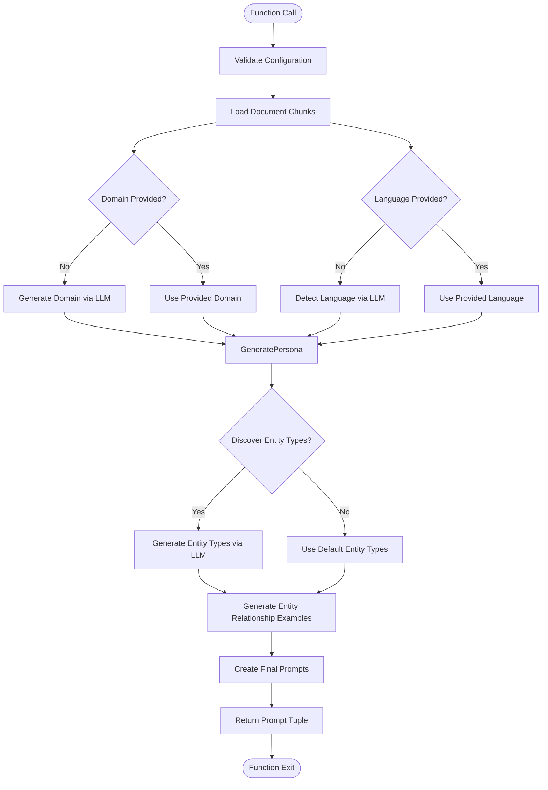

# Prompt Tuning API

<cite>
**Referenced Files in This Document**   
- [prompt_tune.py](file://graphrag/api/prompt_tune.py)
- [generate_indexing_prompts](file://graphrag/api/prompt_tune.py#L56-L203)
- [domain.py](file://graphrag/prompt_tune/generator/domain.py#L10-L28)
- [persona.py](file://graphrag/prompt_tune/generator/persona.py#L11-L28)
- [entity_types.py](file://graphrag/prompt_tune/generator/entity_types.py#L22-L60)
- [extract_graph_prompt.py](file://graphrag/prompt_tune/generator/extract_graph_prompt.py#L21-L110)
- [language.py](file://graphrag/prompt_tune/generator/language.py#L10-L28)
- [input.py](file://graphrag/prompt_tune/loader/input.py#L41-L109)
- [defaults.py](file://graphrag/prompt_tune/defaults.py)
- [types.py](file://graphrag/prompt_tune/types.py)
- [template/extract_graph.py](file://graphrag/prompt_tune/template/extract_graph.py)
- [template/entity_summarization.py](file://graphrag/prompt_tune/template/entity_summarization.py)
- [template/community_report_summarization.py](file://graphrag/prompt_tune/template/community_report_summarization.py)
- [cli/prompt_tune.py](file://graphrag/cli/prompt_tune.py#L25-L118)
</cite>

## Table of Contents
1. [Introduction](#introduction)
2. [Core Function: prompt_tune](#core-function-prompt_tune)
3. [Parameter Details](#parameter-details)
4. [Return Types and Output Format](#return-types-and-output-format)
5. [Integration with LLM Provider System](#integration-with-llm-provider-system)
6. [Prompt Template System](#prompt-template-system)
7. [Generator Submodules](#generator-submodules)
8. [CLI Comparison](#cli-comparison)
9. [Use Cases for Programmatic Optimization](#use-cases-for-programmatic-optimization)
10. [Common Issues and Troubleshooting](#common-issues-and-troubleshooting)

## Introduction

The `graphrag.api.prompt_tune` module provides a programmatic interface for automated prompt optimization in GraphRAG systems. This API enables dynamic generation of domain-specific prompts for entity extraction, entity summarization, and community summarization based on input data characteristics. The system leverages large language models (LLMs) to analyze input documents and generate optimized prompts that improve the quality of knowledge graph construction and analysis.

The prompt tuning functionality is designed to adapt to different domains, languages, and data characteristics without requiring manual prompt engineering. By analyzing sample documents, the system can automatically determine appropriate entity types, generate domain-specific personas, detect input language, and create optimized prompt templates for various stages of the GraphRAG pipeline.

**Section sources**
- [prompt_tune.py](file://graphrag/api/prompt_tune.py#L1-L203)
- [defaults.py](file://graphrag/prompt_tune/defaults.py)

## Core Function: prompt_tune

The primary function in the `graphrag.api.prompt_tune` module is `generate_indexing_prompts`, which orchestrates the entire prompt tuning process. This asynchronous function analyzes input documents and generates three optimized prompts for different stages of the GraphRAG pipeline.

The function follows a systematic workflow:
1. Loads and chunks input documents according to specified parameters
2. Initializes the language model manager with appropriate configuration
3. Automatically detects or uses provided domain and language information
4. Generates a domain-specific persona to guide prompt creation
5. Creates specialized prompts for community report rating, community reporter role, and entity relationship examples
6. Generates entity types if requested
7. Constructs the final three prompts for entity extraction, entity summarization, and community summarization

The function is designed to be robust and handles various input scenarios, providing sensible defaults when specific parameters are not provided.


**Diagram sources**
- [prompt_tune.py](file://graphrag/api/prompt_tune.py#L56-L203)
- [input.py](file://graphrag/prompt_tune/loader/input.py#L41-L109)

**Section sources**
- [prompt_tune.py](file://graphrag/api/prompt_tune.py#L56-L203)

## Parameter Details

The `generate_indexing_prompts` function accepts several parameters that control the prompt tuning process:

**config**: The GraphRag configuration object that contains all necessary settings for the indexing pipeline, including input sources, chunking parameters, and language model configurations.

**chunk_size**: The token size for text chunks used in processing. Defaults to the value specified in the configuration's chunking defaults. Larger chunks provide more context but may exceed token limits.

**overlap**: The number of overlapping tokens between consecutive chunks. This helps preserve context across chunk boundaries. Must be non-negative.

**limit**: The maximum number of document chunks to load for prompt tuning. A higher limit provides more data for analysis but increases processing time.

**selection_method**: The method for selecting document chunks, defined by the `DocSelectionType` enum. Options include:
- `ALL`: Use all available chunks
- `RANDOM`: Randomly sample chunks
- `TOP`: Use the first N chunks
- `AUTO`: Use embedding-based similarity to select representative chunks

**domain**: The domain to which the input documents belong (e.g., "scientific research", "financial analysis"). If not provided, the system will automatically generate a domain description.

**language**: The language of the input documents. If not provided, the system will automatically detect the language.

**max_tokens**: The maximum number of tokens to use in entity extraction prompts. This prevents prompts from exceeding model token limits.

**discover_entity_types**: A boolean flag indicating whether to automatically discover entity types from the input documents. When enabled, the system will analyze sample documents to identify relevant entity categories.

**min_examples_required**: The minimum number of examples to include in the entity extraction prompt, even if adding more would exceed the token limit.

**n_subset_max**: The maximum number of text chunks to embed when using the AUTO selection method.

**k**: The number of documents to select when using the AUTO selection method.

**verbose**: A boolean flag to enable detailed logging during the prompt tuning process.



**Diagram sources**
- [prompt_tune.py](file://graphrag/api/prompt_tune.py#L56-L203)
- [types.py](file://graphrag/prompt_tune/types.py)

**Section sources**
- [prompt_tune.py](file://graphrag/api/prompt_tune.py#L56-L203)
- [types.py](file://graphrag/prompt_tune/types.py)

## Return Types and Output Format

The `generate_indexing_prompts` function returns a tuple of three strings, each representing a different prompt for the GraphRAG pipeline:

1. **Entity Extraction Prompt**: A comprehensive prompt for extracting entities and relationships from text documents. This prompt includes:
   - Specified entity types (if discovered)
   - Example extractions with input-output pairs
   - Language-specific instructions
   - Formatting requirements for consistent output

2. **Entity Summarization Prompt**: A prompt for summarizing entity descriptions. This prompt includes:
   - The generated persona for consistent tone and style
   - Language-specific instructions
   - Formatting requirements for summaries

3. **Community Summarization Prompt**: A prompt for summarizing community reports. This prompt includes:
   - The generated persona
   - The community reporter role
   - The community report rating description
   - Language-specific instructions

Each prompt is returned as a formatted string that can be directly used in the GraphRAG indexing pipeline. The prompts are designed to be self-contained and include all necessary context, examples, and instructions for the LLM to produce consistent, high-quality outputs.

The output format ensures that the prompts can be easily integrated into automated pipelines and configuration files without requiring additional processing.

**Section sources**
- [prompt_tune.py](file://graphrag/api/prompt_tune.py#L92-L93)
- [extract_graph_prompt.py](file://graphrag/prompt_tune/generator/extract_graph_prompt.py#L21-L110)
- [entity_summarization_prompt.py](file://graphrag/prompt_tune/generator/entity_summarization_prompt.py#L15-L40)
- [community_report_summarization.py](file://graphrag/prompt_tune/generator/community_report_summarization.py#L15-L51)

## Integration with LLM Provider System

The prompt tuning API integrates seamlessly with GraphRAG's language model provider system through the `ModelManager` class. The integration follows a consistent pattern across all generator functions:

1. **Configuration Retrieval**: The system retrieves language model configuration from the GraphRagConfig object using the `get_language_model_config` method. The default model ID for prompt tuning is "default_chat_model" as defined in `PROMPT_TUNING_MODEL_ID`.

2. **Model Registration**: The `ModelManager` registers a chat model with the name "prompt_tuning" using the retrieved configuration. This creates a dedicated LLM instance for prompt generation tasks.

3. **Asynchronous Operations**: All LLM interactions use asynchronous methods (e.g., `achat`) to ensure non-blocking operations and efficient resource utilization.

4. **Callback System**: The system uses `NoopWorkflowCallbacks` for prompt tuning operations, as these are typically automated processes that don't require real-time feedback.

5. **Error Handling**: The integration includes robust error handling for LLM response parsing, with appropriate logging and fallback mechanisms.

The API is designed to work with any LLM provider supported by GraphRAG, including but not limited to OpenAI, Azure AI, and other providers through the LiteLLM interface. This ensures flexibility in choosing the most appropriate LLM for prompt generation based on cost, performance, and availability considerations.

```mermaid
classDiagram
class ModelManager {
+register_chat(name, model_type, config, callbacks, cache)
+register_embedding(name, model_type, config, callbacks, cache)
}
class GraphRagConfig {
+get_language_model_config(model_id)
+get_embedding_model_config(model_id)
}
class ChatModel {
+achat(message, history, json, json_model)
}
class NoopWorkflowCallbacks {
+on_start()
+on_success()
+on_error()
}
ModelManager --> ChatModel : "creates"
GraphRagConfig --> ModelManager : "provides config"
generate_indexing_prompts --> ModelManager : "uses"
generate_indexing_prompts --> GraphRagConfig : "uses"
generate_indexing_prompts --> NoopWorkflowCallbacks : "uses"
note right of ModelManager
Manages LLM instances for prompt tuning
Uses configuration from GraphRagConfig
Returns ChatModel instances
end
note right of ChatModel
Base protocol for LLM interactions
Supports chat completions with history
Supports JSON mode for structured output
end
```

**Diagram sources**
- [prompt_tune.py](file://graphrag/api/prompt_tune.py#L115-L121)
- [language.py](file://graphrag/prompt_tune/generator/language.py#L10-L28)
- [domain.py](file://graphrag/prompt_tune/generator/domain.py#L10-L28)

**Section sources**
- [prompt_tune.py](file://graphrag/api/prompt_tune.py#L110-L121)
- [language.py](file://graphrag/prompt_tune/generator/language.py#L10-L28)
- [domain.py](file://graphrag/prompt_tune/generator/domain.py#L10-L28)

## Prompt Template System

The prompt tuning system leverages a comprehensive template system located in `graphrag/prompt_tune/template/`. These templates provide the foundational structure for all generated prompts, with placeholders that are filled during the prompt generation process.

The template system includes three main prompt templates:

**extract_graph.py**: Contains templates for entity extraction prompts with different configurations:
- `GRAPH_EXTRACTION_PROMPT`: Standard entity extraction prompt with specified entity types
- `GRAPH_EXTRACTION_JSON_PROMPT`: JSON-mode version of the entity extraction prompt
- `UNTYPED_GRAPH_EXTRACTION_PROMPT`: Version for when entity types are not specified
- Example templates for formatting input-output pairs

**entity_summarization.py**: Contains the template for entity summarization prompts, which includes placeholders for the persona and language.

**community_report_summarization.py**: Contains the template for community summarization prompts, which includes placeholders for the persona, role, report rating description, and language.

The template system follows a consistent design pattern with clear goals, step-by-step instructions, examples, and formatting requirements. This ensures that generated prompts are comprehensive and guide the LLM toward producing consistent, high-quality outputs.

The templates are designed to be flexible and adaptable, allowing the prompt tuning system to generate domain-specific prompts while maintaining a consistent structure and output format.

```mermaid
erDiagram
TEMPLATE ||--o{ PROMPT_GENERATOR : "used by"
TEMPLATE ||--o{ FINAL_PROMPT : "instantiated as"
class TEMPLATE {
+str GRAPH_EXTRACTION_PROMPT
+str GRAPH_EXTRACTION_JSON_PROMPT
+str UNTYPED_GRAPH_EXTRACTION_PROMPT
+str EXAMPLE_EXTRACTION_TEMPLATE
+str ENTITY_SUMMARIZATION_PROMPT
+str COMMUNITY_REPORT_SUMMARIZATION_PROMPT
}
class PROMPT_GENERATOR {
+create_extract_graph_prompt()
+create_entity_summarization_prompt()
+create_community_summarization_prompt()
}
class FINAL_PROMPT {
+str entity_extraction_prompt
+str entity_summarization_prompt
+str community_summarization_prompt
}
note right of TEMPLATE
Foundational templates with placeholders
Located in graphrag/prompt_tune/template/
Provide structure for all generated prompts
end
note right of PROMPT_GENERATOR
Functions that instantiate templates
Fill placeholders with generated content
Apply token counting and truncation
end
note right of FINAL_PROMPT
Complete, ready-to-use prompts
Returned by generate_indexing_prompts
Used in GraphRAG indexing pipeline
end
```

**Diagram sources**
- [template/extract_graph.py](file://graphrag/prompt_tune/template/extract_graph.py)
- [template/entity_summarization.py](file://graphrag/prompt_tune/template/entity_summarization.py)
- [template/community_report_summarization.py](file://graphrag/prompt_tune/template/community_report_summarization.py)
- [extract_graph_prompt.py](file://graphrag/prompt_tune/generator/extract_graph_prompt.py#L21-L110)

**Section sources**
- [template/extract_graph.py](file://graphrag/prompt_tune/template/extract_graph.py)
- [template/entity_summarization.py](file://graphrag/prompt_tune/template/entity_summarization.py)
- [template/community_report_summarization.py](file://graphrag/prompt_tune/template/community_report_summarization.py)

## Generator Submodules

The prompt tuning system is implemented as a collection of specialized generator submodules in the `graphrag/prompt_tune/generator/` directory. Each submodule handles a specific aspect of prompt generation, following a consistent design pattern.

**domain.py**: Generates a domain description from input documents using an LLM. This provides context for subsequent prompt generation steps.

**persona.py**: Generates a domain-specific persona that guides the tone and style of all generated prompts. The persona is based on the domain and a default task description.

**entity_types.py**: Discovers relevant entity types from input documents. This can operate in JSON mode for structured output or regular mode for free-form text.

**entity_relationship.py**: Generates examples of entity relationships from input documents. These examples are used to guide the entity extraction process.

**language.py**: Detects the language of input documents using an LLM. This ensures that prompts are generated in the appropriate language.

**community_reporter_role.py**: Generates a specialized role for community reporters, providing guidance on how to approach community summarization.

**community_report_rating.py**: Generates criteria for rating community reports, which is used to guide the quality of community summaries.

**extract_graph_prompt.py**: Constructs the final entity extraction prompt by combining templates, entity types, examples, and other components.

**entity_summarization_prompt.py**: Constructs the entity summarization prompt using the generated persona and language.

**community_report_summarization.py**: Constructs the community summarization prompt using the persona, role, rating description, and language.

Each generator follows a consistent pattern: accept inputs (including an LLM instance and relevant data), call the LLM with an appropriate prompt template, process the response, and return the generated content. This modular design allows for easy extension and customization of the prompt tuning process.

```mermaid
graph TD
A[Input Documents] --> B[domain.py]
A --> C[language.py]
B --> D[persona.py]
C --> D
D --> E[entity_types.py]
D --> F[entity_relationship.py]
D --> G[community_reporter_role.py]
D --> H[community_report_rating.py]
E --> I[extract_graph_prompt.py]
F --> I
C --> I
C --> J[entity_summarization_prompt.py]
D --> J
D --> K[community_report_summarization.py]
G --> K
H --> K
C --> K
I --> L[Entity Extraction Prompt]
J --> M[Entity Summarization Prompt]
K --> N[Community Summarization Prompt]
style A fill:#f9f,stroke:#333
style L fill:#bbf,stroke:#333
style M fill:#bbf,stroke:#333
style N fill:#bbf,stroke:#333
note right of B
Generates domain description
Uses LLM to analyze documents
Provides context for other generators
end
note right of D
Creates domain-specific persona
Guides tone and style of prompts
Based on domain and default task
end
note right of E
Discovers relevant entity types
Can use JSON mode for structure
Improves entity extraction quality
end
note right of F
Generates relationship examples
Provides concrete examples
Helps LLM understand format
end
```

**Diagram sources**
- [domain.py](file://graphrag/prompt_tune/generator/domain.py#L10-L28)
- [persona.py](file://graphrag/prompt_tune/generator/persona.py#L11-L28)
- [entity_types.py](file://graphrag/prompt_tune/generator/entity_types.py#L22-L60)
- [entity_relationship.py](file://graphrag/prompt_tune/generator/entity_relationship.py#L18-L66)
- [language.py](file://graphrag/prompt_tune/generator/language.py#L10-L28)
- [community_reporter_role.py](file://graphrag/prompt_tune/generator/community_reporter_role.py#L12-L36)
- [community_report_rating.py](file://graphrag/prompt_tune/generator/community_report_rating.py)
- [extract_graph_prompt.py](file://graphrag/prompt_tune/generator/extract_graph_prompt.py#L21-L110)
- [entity_summarization_prompt.py](file://graphrag/prompt_tune/generator/entity_summarization_prompt.py#L15-L40)
- [community_report_summarization.py](file://graphrag/prompt_tune/generator/community_report_summarization.py#L15-L51)

**Section sources**
- [domain.py](file://graphrag/prompt_tune/generator/domain.py#L10-L28)
- [persona.py](file://graphrag/prompt_tune/generator/persona.py#L11-L28)
- [entity_types.py](file://graphrag/prompt_tune/generator/entity_types.py#L22-L60)
- [entity_relationship.py](file://graphrag/prompt_tune/generator/entity_relationship.py#L18-L66)
- [language.py](file://graphrag/prompt_tune/generator/language.py#L10-L28)

## CLI Comparison

The `graphrag.api.prompt_tune` module provides the programmatic foundation for the `graphrag prompt-tune` CLI command. While both interfaces perform the same core function of generating optimized prompts, they differ in their usage patterns and capabilities.

The CLI command (`graphrag/cli/prompt_tune.py`) provides a user-friendly interface for prompt tuning with the following characteristics:
- Accepts command-line arguments for all parameters
- Automatically loads configuration from files
- Writes generated prompts directly to files
- Provides progress feedback through logging
- Designed for interactive use and experimentation

The API function (`generate_indexing_prompts`) provides a programmatic interface with the following characteristics:
- Accepts parameters through function arguments
- Requires explicit configuration management
- Returns prompts as strings for further processing
- Designed for integration into automated pipelines
- Enables dynamic configuration and conditional logic

Key differences include:
- The CLI handles file I/O operations automatically, while the API returns prompts for the caller to handle
- The CLI provides default values and argument parsing, while the API requires explicit parameter specification
- The API allows for more complex integration scenarios, such as conditional prompt generation based on data characteristics

Both interfaces share the same underlying generator modules and template system, ensuring consistent behavior and output regardless of the interface used.

```mermaid
graph TB
subgraph "Shared Core"
A[Generator Modules]
B[Template System]
C[LLM Integration]
end
subgraph "API Interface"
D[generate_indexing_prompts]
E[Return prompts as strings]
F[Integration with pipelines]
end
subgraph "CLI Interface"
G[prompt_tune command]
H[Write prompts to files]
I[Command-line arguments]
end
A --> D
B --> D
C --> D
A --> G
B --> G
C --> G
D --> E
D --> F
G --> H
G --> I
style D fill:#f96,stroke:#333
style G fill:#69f,stroke:#333
note right of D
Programmatic interface
Returns prompts for processing
Designed for automation
end
note right of G
Command-line interface
Writes prompts to files
Designed for interactive use
end
```

**Diagram sources**
- [prompt_tune.py](file://graphrag/api/prompt_tune.py#L56-L203)
- [cli/prompt_tune.py](file://graphrag/cli/prompt_tune.py#L25-L118)

**Section sources**
- [prompt_tune.py](file://graphrag/api/prompt_tune.py#L56-L203)
- [cli/prompt_tune.py](file://graphrag/cli/prompt_tune.py#L25-L118)

## Use Cases for Programmatic Optimization

The `graphrag.api.prompt_tune` module enables several powerful use cases for automated prompt optimization in data processing pipelines:

### Domain Adaptation Automation
The API can be integrated into data ingestion pipelines to automatically adapt prompts to new domains. When new data sources are added, the system can analyze sample documents and generate domain-specific prompts without manual intervention.

```python
# Example: Automated domain adaptation
from graphrag.api import generate_indexing_prompts
from graphrag.config import load_config

async def adapt_to_new_domain(config_path, data_source):
    # Load configuration
    config = load_config(config_path)
    
    # Update input source
    config.input.dir = data_source
    
    # Generate domain-adapted prompts
    prompts = await generate_indexing_prompts(
        config=config,
        selection_method="auto",
        discover_entity_types=True,
        verbose=True
    )
    
    # Use optimized prompts for indexing
    entity_extraction_prompt, entity_summarization_prompt, community_summarization_prompt = prompts
    return prompts
```

### Entity Type Detection Pipeline
The API can be used to automatically discover entity types from domain-specific data, improving the accuracy of knowledge graph construction.

```python
# Example: Entity type detection
async def detect_entity_types(config, sample_data_dir):
    # Temporarily update config for sampling
    config.input.dir = sample_data_dir
    
    # Generate prompts with entity type discovery
    _, _, _ = await generate_indexing_prompts(
        config=config,
        discover_entity_types=True,
        limit=10,
        selection_method="random"
    )
    
    # The system automatically discovers relevant entity types
    # These can be used to configure the main indexing pipeline
```

### Persona Generation for Specialized Analysis
The API can generate specialized personas for different analytical tasks, ensuring consistent tone and focus in generated content.

```python
# Example: Multi-persona analysis
async def generate_specialized_personas(config):
    # Business analysis persona
    business_prompts = await generate_indexing_prompts(
        config=config,
        domain="business analysis",
        verbose=False
    )
    
    # Technical analysis persona  
    technical_prompts = await generate_indexing_prompts(
        config=config,
        domain="technical documentation",
        verbose=False
    )
    
    # Return multiple specialized prompt sets
    return {
        "business": business_prompts,
        "technical": technical_prompts
    }
```

### Continuous Prompt Optimization
The API can be integrated into monitoring systems to periodically re-optimize prompts as new data becomes available.

```python
# Example: Continuous optimization
async def continuous_prompt_optimization(config, data_stream):
    async for new_data_batch in data_stream:
        # Periodically re-tune prompts with new data
        if should_optimize():
            optimized_prompts = await generate_indexing_prompts(
                config=config,
                selection_method="auto",
                limit=20
            )
            # Update active prompts
            update_active_prompts(optimized_prompts)
```

These use cases demonstrate how the programmatic API enables sophisticated automation scenarios that would be difficult or impossible to achieve with the CLI alone.

**Section sources**
- [prompt_tune.py](file://graphrag/api/prompt_tune.py#L56-L203)
- [domain.py](file://graphrag/prompt_tune/generator/domain.py#L10-L28)
- [persona.py](file://graphrag/prompt_tune/generator/persona.py#L11-L28)
- [entity_types.py](file://graphrag/prompt_tune/generator/entity_types.py#L22-L60)

## Common Issues and Troubleshooting

When using the `graphrag.api.prompt_tune` module, several common issues may arise. Understanding these issues and their solutions is crucial for successful implementation.

### Insufficient Input Data
When the input data is too limited, the prompt tuning process may produce suboptimal results.

**Symptoms**:
- Generic or irrelevant domain descriptions
- Incomplete entity type discovery
- Poor quality relationship examples

**Solutions**:
- Increase the `limit` parameter to include more document chunks
- Use `selection_method="all"` to utilize all available data
- Ensure the input data is representative of the target domain
- Consider preprocessing steps to enrich sparse data

### LLM Response Parsing Errors
Errors may occur when parsing responses from the language model, particularly in JSON mode.

**Symptoms**:
- Failed JSON parsing
- Empty or incomplete responses
- Type validation errors

**Solutions**:
- Implement retry logic for failed LLM calls
- Add response validation and fallback mechanisms
- Use non-JSON mode for models that don't reliably support JSON output
- Implement response sanitization to handle malformed output

### Token Limit Exceeding
The generated prompts may exceed token limits, particularly for entity extraction prompts with many examples.

**Symptoms**:
- Truncated prompts
- Missing examples in output
- LLM errors during prompt usage

**Solutions**:
- Adjust the `max_tokens` parameter to stay within limits
- Reduce the number of examples included
- Use smaller chunk sizes to reduce context requirements
- Implement dynamic token counting and truncation

### Language Detection Failures
The automatic language detection may fail for multilingual or noisy text.

**Symptoms**:
- Incorrect language detection
- Mixed language prompts
- Encoding issues

**Solutions**:
- Provide the `language` parameter explicitly when known
- Preprocess text to normalize encoding
- Use language-specific preprocessing for multilingual data
- Implement language validation and correction

### Domain Misidentification
The automatically generated domain description may not accurately reflect the input data.

**Symptoms**:
- Generic or inaccurate domain descriptions
- Inappropriate persona generation
- Poorly focused prompts

**Solutions**:
- Provide the `domain` parameter explicitly
- Curate high-quality sample documents for prompt tuning
- Post-process and refine generated domain descriptions
- Implement domain validation against known categories

The system includes logging at various levels (INFO, DEBUG) to help diagnose these issues. Enabling verbose logging can provide valuable insights into the prompt tuning process and help identify the root cause of problems.

**Section sources**
- [prompt_tune.py](file://graphrag/api/prompt_tune.py#L56-L203)
- [language.py](file://graphrag/prompt_tune/generator/language.py#L10-L28)
- [domain.py](file://graphrag/prompt_tune/generator/domain.py#L10-L28)
- [extract_graph_prompt.py](file://graphrag/prompt_tune/generator/extract_graph_prompt.py#L21-L110)
- [input.py](file://graphrag/prompt_tune/loader/input.py#L41-L109)