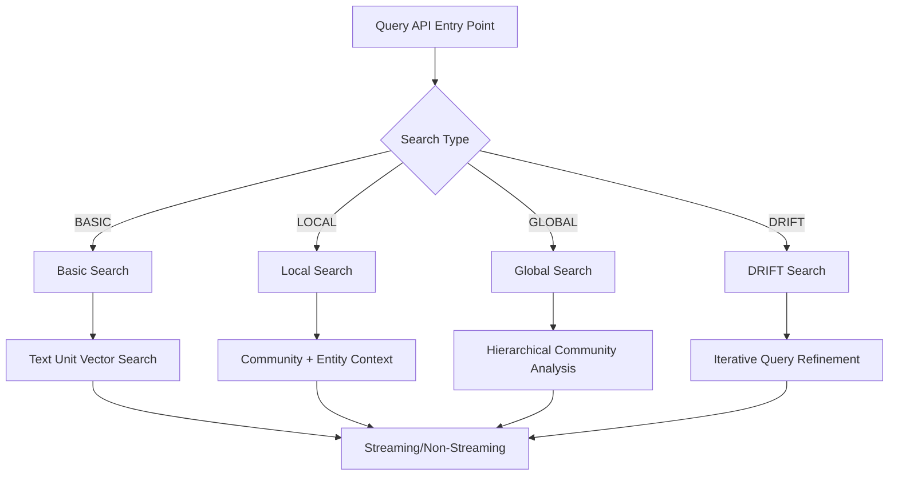
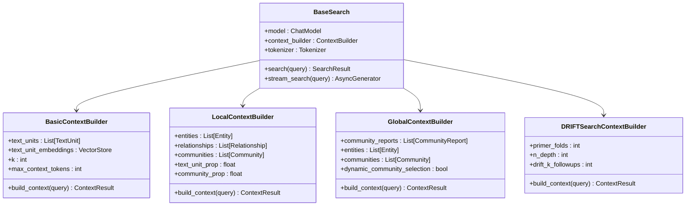
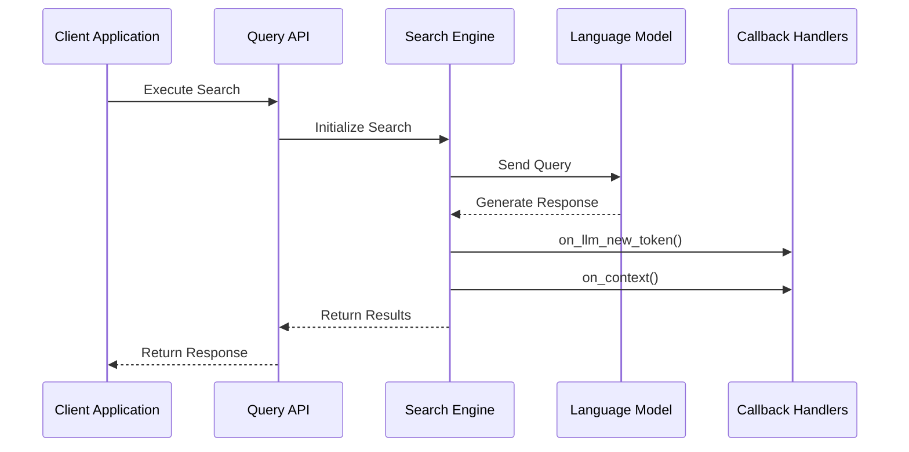
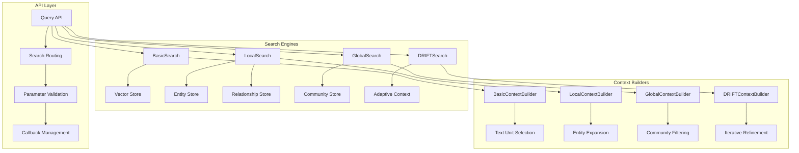
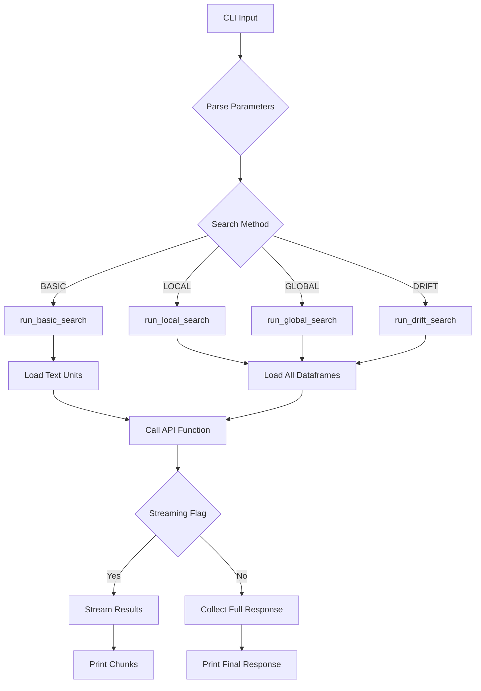

# Query API

<cite>
**Referenced Files in This Document**
- [graphrag/api/query.py](file://graphrag/api/query.py)
- [graphrag/query/structured_search/basic_search/search.py](file://graphrag/query/structured_search/basic_search/search.py)
- [graphrag/query/structured_search/local_search/search.py](file://graphrag/query/structured_search/local_search/search.py)
- [graphrag/query/structured_search/global_search/search.py](file://graphrag/query/structured_search/global_search/search.py)
- [graphrag/query/structured_search/drift_search/search.py](file://graphrag/query/structured_search/drift_search/search.py)
- [graphrag/config/enums.py](file://graphrag/config/enums.py)
- [graphrag/cli/query.py](file://graphrag/cli/query.py)
- [graphrag/cli/main.py](file://graphrag/cli/main.py)
- [graphrag/query/factory.py](file://graphrag/query/factory.py)
</cite>

## Table of Contents
1. [Introduction](#introduction)
2. [API Overview](#api-overview)
3. [Core Search Functions](#core-search-functions)
4. [QueryType and Search Methods](#querytype-and-search-methods)
5. [Configuration Dependencies](#configuration-dependencies)
6. [Usage Examples](#usage-examples)
7. [Context Builder Integration](#context-builder-integration)
8. [LLM Response Handling](#llm-response-handling)
9. [Structured Search Architecture](#structured-search-architecture)
10. [CLI Command Comparison](#cli-command-comparison)
11. [Error Handling and Validation](#error-handling-and-validation)
12. [Performance Optimization](#performance-optimization)

## Introduction

The GraphRAG Query API provides a comprehensive interface for performing various types of searches over knowledge graphs generated by GraphRAG. This API enables programmatic access to four distinct search strategies: Basic Search, Local Search, Global Search, and DRIFT Search, each optimized for different query patterns and use cases.

The API is designed to work seamlessly with GraphRAG's structured search implementations while maintaining flexibility for custom integrations. It supports both synchronous and streaming responses, enabling real-time query processing and result generation.

## API Overview

The Query API consists of six primary functions organized into three categories:

### Core Search Functions
- **`query()`**: Main entry point for executing searches
- **`basic_search()`**: Generic RAG-style vector search on text chunks
- **`local_search()`**: Community-aware search with entity and relationship context
- **`global_search()`**: Hierarchical community-based search with map-reduce pattern
- **`drift_search()`**: Iterative exploration with adaptive query refinement

### Streaming Variants
- **`basic_search_streaming()`**: Stream responses for real-time processing
- **`local_search_streaming()`**: Real-time local search results
- **`global_search_streaming()`**: Streaming global search with progress callbacks

### Multi-Index Support
- **`multi_index_*_search()`**: Functions for searching across multiple indexed datasets



**Diagram sources**
- [graphrag/api/query.py](file://graphrag/api/query.py#L63-L1227)
- [graphrag/config/enums.py](file://graphrag/config/enums.py#L130-L137)

## Core Search Functions

### basic_search()

Performs a generic Retrieval-Augmented Generation (RAG) search using vector similarity on text units.

**Parameters:**
- `config` (GraphRagConfig): Configuration from settings.yaml
- `text_units` (pd.DataFrame): Final text units from text_units.parquet
- `query` (str): User query to search for
- `callbacks` (list[QueryCallbacks] | None): Optional callback handlers
- `verbose` (bool): Enable verbose logging

**Returns:**
- Tuple containing response text and context data

**Implementation Details:**
The function initializes logging, sets up callback mechanisms, and orchestrates the search process through the streaming variant. It captures context data using a local callback and aggregates streaming responses into a complete result.

**Section sources**
- [graphrag/api/query.py](file://graphrag/api/query.py#L1056-L1102)

### local_search()

Executes community-aware search leveraging entity relationships and community hierarchies.

**Parameters:**
- `config` (GraphRagConfig): GraphRAG configuration
- `entities` (pd.DataFrame): Final entities from entities.parquet
- `communities` (pd.DataFrame): Final communities from communities.parquet
- `community_reports` (pd.DataFrame): Final community reports from community_reports.parquet
- `text_units` (pd.DataFrame): Final text units from text_units.parquet
- `relationships` (pd.DataFrame): Final relationships from relationships.parquet
- `covariates` (pd.DataFrame | None): Final covariates from covariates.parquet
- `community_level` (int): Community level for search granularity
- `response_type` (str): Desired response format
- `query` (str): User query
- `callbacks` (list[QueryCallbacks] | None): Optional callbacks
- `verbose` (bool): Verbose logging flag

**Returns:**
- Tuple of response text and context data

**Key Features:**
- Leverages community hierarchies for targeted search
- Integrates entity and relationship context
- Supports covariate data for temporal/situational queries
- Configurable community level for granularity control

**Section sources**
- [graphrag/api/query.py](file://graphrag/api/query.py#L342-L406)

### global_search()

Implements hierarchical community-based search using map-reduce pattern.

**Parameters:**
- `config` (GraphRagConfig): Configuration object
- `entities` (pd.DataFrame): Entities DataFrame
- `communities` (pd.DataFrame): Communities DataFrame
- `community_reports` (pd.DataFrame): Community reports DataFrame
- `community_level` (int | None): Community level specification
- `dynamic_community_selection` (bool): Enable dynamic community selection
- `response_type` (str): Response format specification
- `query` (str): Search query
- `callbacks` (list[QueryCallbacks] | None): Callback handlers
- `verbose` (bool): Logging verbosity

**Returns:**
- Tuple of response text and context data

**Architecture:**
Uses parallel LLM calls on community summaries followed by response synthesis, enabling scalable processing of large knowledge graphs.

**Section sources**
- [graphrag/api/query.py](file://graphrag/api/query.py#L63-L124)

### drift_search()

Performs iterative query refinement through adaptive search exploration.

**Parameters:**
- `config` (GraphRagConfig): Configuration object
- `entities` (pd.DataFrame): Entities DataFrame
- `communities` (pd.DataFrame): Communities DataFrame
- `community_reports` (pd.DataFrame): Community reports DataFrame
- `text_units` (pd.DataFrame): Text units DataFrame
- `relationships` (pd.DataFrame): Relationships DataFrame
- `community_level` (int): Community level for search
- `response_type` (str): Response format
- `query` (str): Search query
- `callbacks` (list[QueryCallbacks] | None): Callback handlers
- `verbose` (bool): Verbose logging

**Returns:**
- Tuple of response text and context data

**Algorithm:**
- Initial primer query to identify relevant communities
- Iterative refinement through follow-up queries
- Adaptive depth control based on relevance scoring

**Section sources**
- [graphrag/api/query.py](file://graphrag/api/query.py#L708-L769)

## QueryType and Search Methods

The API integrates with GraphRAG's enumeration system through the `SearchMethod` enum, which defines the available search strategies.

### SearchMethod Enum

```python
class SearchMethod(Enum):
    LOCAL = "local"
    GLOBAL = "global"
    DRIFT = "drift"
    BASIC = "basic"
```

**Usage in API:**
The enum values correspond directly to the search functions:
- `LOCAL`: Maps to `local_search()` and `local_search_streaming()`
- `GLOBAL`: Maps to `global_search()` and `global_search_streaming()`
- `DRIFT`: Maps to `drift_search()` and `drift_search_streaming()`
- `BASIC`: Maps to `basic_search()` and `basic_search_streaming()`

**Integration with CLI:**
The CLI commands use this enum to route queries to appropriate API functions, ensuring consistent behavior across interfaces.

**Section sources**
- [graphrag/config/enums.py](file://graphrag/config/enums.py#L130-L137)

## Configuration Dependencies

### GraphRagConfig Requirements

Each search function requires a properly configured `GraphRagConfig` object containing:

**Core Configuration:**
- Language model settings for LLM interactions
- Vector store configurations for embeddings
- Search-specific parameters (timeout, tokens, etc.)
- Prompt templates for different search modes

**Search-Specific Settings:**

| Parameter Category | Basic Search | Local Search | Global Search | DRIFT Search |
|-------------------|--------------|--------------|---------------|--------------|
| Embedding Model | ✓ | ✓ | ✓ | ✓ |
| Text Units | ✓ | ✓ | ✓ | ✓ |
| Community Reports | ✗ | ✓ | ✓ | ✓ |
| Entities | ✗ | ✓ | ✓ | ✓ |
| Relationships | ✗ | ✓ | ✗ | ✓ |
| Covariates | ✗ | ✓ | ✗ | ✗ |
| Community Level | ✗ | ✓ | ✓ | ✓ |

**Vector Store Configuration:**
- Embedding dimensions and similarity metrics
- Storage backend selection (LanceDB, Azure AI Search, etc.)
- Connection parameters and authentication

**LLM Configuration:**
- Model provider and endpoint settings
- Temperature and token limits
- Response format specifications (JSON vs. text)

**Section sources**
- [graphrag/api/query.py](file://graphrag/api/query.py#L29-L56)
- [graphrag/query/factory.py](file://graphrag/query/factory.py#L269-L303)

## Usage Examples

### Basic Search Example

```python
import pandas as pd
import graphrag.api as api
from graphrag.config.models.graph_rag_config import GraphRagConfig

# Load configuration and data
config = GraphRagConfig.from_file("settings.yaml")
text_units = pd.read_parquet("text_units.parquet")

# Execute basic search
response, context = await api.basic_search(
    config=config,
    text_units=text_units,
    query="What are the key findings about climate change?",
    verbose=True
)

print(f"Response: {response}")
print(f"Context: {context}")
```

### Local Search Example

```python
# Load all required dataframes
entities = pd.read_parquet("entities.parquet")
communities = pd.read_parquet("communities.parquet")
community_reports = pd.read_parquet("community_reports.parquet")
text_units = pd.read_parquet("text_units.parquet")
relationships = pd.read_parquet("relationships.parquet")

# Execute local search
response, context = await api.local_search(
    config=config,
    entities=entities,
    communities=communities,
    community_reports=community_reports,
    text_units=text_units,
    relationships=relationships,
    community_level=2,
    response_type="Multiple Paragraphs",
    query="Explain the relationship between technology and society"
)
```

### Streaming Global Search Example

```python
# Streaming global search for real-time feedback
async def stream_global_search():
    async for chunk in api.global_search_streaming(
        config=config,
        entities=entities,
        communities=communities,
        community_reports=community_reports,
        community_level=2,
        dynamic_community_selection=True,
        response_type="Multiple Paragraphs",
        query="Summarize the main themes across all communities"
    ):
        print(chunk, end="", flush=True)

await stream_global_search()
```

### DRIFT Search Example

```python
# Advanced iterative search for complex queries
response, context = await api.drift_search(
    config=config,
    entities=entities,
    communities=communities,
    community_reports=community_reports,
    text_units=text_units,
    relationships=relationships,
    community_level=2,
    response_type="Multiple Paragraphs",
    query="Analyze the evolution of artificial intelligence research"
)
```

## Context Builder Integration

The Query API integrates deeply with GraphRAG's context builder system to construct optimal search contexts for each query type.

### Context Builder Architecture



**Diagram sources**
- [graphrag/query/structured_search/basic_search/search.py](file://graphrag/query/structured_search/basic_search/search.py#L27-L61)
- [graphrag/query/structured_search/local_search/search.py](file://graphrag/query/structured_search/local_search/search.py#L26-L61)
- [graphrag/query/structured_search/global_search/search.py](file://graphrag/query/structured_search/global_search/search.py#L48-L98)
- [graphrag/query/structured_search/drift_search/search.py](file://graphrag/query/structured_search/drift_search/search.py#L34-L68)

### Context Construction Process

Each search type employs specialized context builders:

**Basic Search Context:**
- Vector similarity search on text unit embeddings
- Token limit enforcement
- Relevance scoring and ranking

**Local Search Context:**
- Community membership filtering
- Entity relationship expansion
- Temporal and situational context inclusion

**Global Search Context:**
- Hierarchical community selection
- Dynamic community selection capability
- Parallel context construction for map phase

**DRIFT Search Context:**
- Initial primer query construction
- Iterative context refinement
- Adaptive depth control

**Section sources**
- [graphrag/query/structured_search/basic_search/search.py](file://graphrag/query/structured_search/basic_search/search.py#L52-L161)
- [graphrag/query/structured_search/local_search/search.py](file://graphrag/query/structured_search/local_search/search.py#L51-L164)
- [graphrag/query/structured_search/global_search/search.py](file://graphrag/query/structured_search/global_search/search.py#L135-L200)
- [graphrag/query/structured_search/drift_search/search.py](file://graphrag/query/structured_search/drift_search/search.py#L158-L253)

## LLM Response Handling

The API provides sophisticated LLM response handling through callback mechanisms and streaming support.

### Callback System



**Diagram sources**
- [graphrag/api/query.py](file://graphrag/api/query.py#L98-L108)
- [graphrag/query/structured_search/basic_search/search.py](file://graphrag/query/structured_search/basic_search/search.py#L85-L92)

### Response Types and Formats

**Standard Response Format:**
- String responses for simple queries
- Dictionary responses for structured data
- List responses for multi-document results

**Context Data Structure:**
- DataFrame collections for entity relationships
- Metadata dictionaries for provenance tracking
- Nested structures for hierarchical data

**Streaming Response Handling:**
- Async generators for real-time processing
- Token-by-token callbacks for progress tracking
- Error handling for interrupted streams

**Section sources**
- [graphrag/api/query.py](file://graphrag/api/query.py#L98-L108)
- [graphrag/query/structured_search/basic_search/search.py](file://graphrag/query/structured_search/basic_search/search.py#L129-L161)

## Structured Search Architecture

The Query API builds upon GraphRAG's structured search implementations, providing a unified interface while preserving the specialized capabilities of each search type.

### Search Type Comparison

| Aspect | Basic Search | Local Search | Global Search | DRIFT Search |
|--------|--------------|--------------|---------------|--------------|
| **Scope** | Text units only | Community + entities | Hierarchical communities | Iterative exploration |
| **Context** | Vector similarity | Entity relationships | Community reports | Adaptive refinement |
| **Scalability** | Linear | Sub-linear | Logarithmic | Adaptive |
| **Latency** | Low | Medium | High | Variable |
| **Accuracy** | Good | Very good | Excellent | Excellent |
| **Use Case** | General RAG | Domain-specific | Large-scale analysis | Complex queries |

### Implementation Architecture



**Diagram sources**
- [graphrag/api/query.py](file://graphrag/api/query.py#L63-L1227)
- [graphrag/query/structured_search/basic_search/search.py](file://graphrag/query/structured_search/basic_search/search.py#L27-L61)
- [graphrag/query/structured_search/local_search/search.py](file://graphrag/query/structured_search/local_search/search.py#L26-L61)
- [graphrag/query/structured_search/global_search/search.py](file://graphrag/query/structured_search/global_search/search.py#L48-L98)
- [graphrag/query/structured_search/drift_search/search.py](file://graphrag/query/structured_search/drift_search/search.py#L34-L68)

**Section sources**
- [graphrag/api/query.py](file://graphrag/api/query.py#L63-L1227)
- [graphrag/query/structured_search/basic_search/search.py](file://graphrag/query/structured_search/basic_search/search.py#L27-L161)
- [graphrag/query/structured_search/local_search/search.py](file://graphrag/query/structured_search/local_search/search.py#L26-L164)
- [graphrag/query/structured_search/global_search/search.py](file://graphrag/query/structured_search/global_search/search.py#L48-L496)
- [graphrag/query/structured_search/drift_search/search.py](file://graphrag/query/structured_search/drift_search/search.py#L34-L253)

## CLI Command Comparison

The Query API mirrors the functionality of GraphRAG's CLI commands, providing equivalent programmatic access to all search capabilities.

### CLI to API Mapping

| CLI Command | API Function | Parameters | Streaming Support |
|-------------|--------------|------------|-------------------|
| `graphrag query --method basic` | `basic_search()` | config, text_units, query | Yes |
| `graphrag query --method local` | `local_search()` | config, all dataframes, community_level | Yes |
| `graphrag query --method global` | `global_search()` | config, community data, community_level | Yes |
| `graphrag query --method drift` | `drift_search()` | config, all dataframes, community_level | Yes |

### CLI Implementation Flow



**Diagram sources**
- [graphrag/cli/main.py](file://graphrag/cli/main.py#L413-L545)
- [graphrag/cli/query.py](file://graphrag/cli/query.py#L246-L297)

**Section sources**
- [graphrag/cli/main.py](file://graphrag/cli/main.py#L413-L545)
- [graphrag/cli/query.py](file://graphrag/cli/query.py#L246-L535)

## Error Handling and Validation

The Query API implements comprehensive error handling and validation mechanisms to ensure robust operation.

### Validation Framework

**Pydantic Validation:**
All API functions use Pydantic's `@validate_call` decorator for automatic parameter validation:
- Type checking for all parameters
- Default value enforcement
- Runtime validation of complex objects

**Common Error Scenarios:**

| Error Type | Cause | Handling Strategy |
|------------|-------|-------------------|
| **Invalid Query** | Empty or malformed query | Early validation with descriptive error messages |
| **Missing Data** | Required DataFrames not loaded | Graceful degradation with partial results |
| **Configuration Errors** | Invalid GraphRagConfig | Configuration validation before search initiation |
| **Resource Exhaustion** | Memory or token limits exceeded | Progressive context reduction strategies |
| **Network Issues** | LLM service unavailability | Retry mechanisms with exponential backoff |

### Error Recovery Mechanisms

**Graceful Degradation:**
- Partial result returns when full computation fails
- Fallback to simpler search strategies
- Context preservation during error conditions

**Retry Logic:**
- Automatic retry for transient failures
- Exponential backoff for rate limiting
- Circuit breaker patterns for persistent failures

**Section sources**
- [graphrag/api/query.py](file://graphrag/api/query.py#L63-L1227)

## Performance Optimization

### Latency Optimization Strategies

**Caching Mechanisms:**
- Vector store caching for frequently accessed embeddings
- Context result caching for repeated queries
- LLM response caching for identical requests

**Parallel Processing:**
- Concurrent community processing in global search
- Parallel LLM calls with semaphore controls
- Asynchronous streaming for real-time responses

**Memory Management:**
- Streaming responses for large datasets
- Progressive context loading
- Garbage collection optimization

### Throughput Optimization

**Batch Processing:**
- Bulk text unit processing
- Community-level batching
- Adaptive batch sizing based on available resources

**Resource Pooling:**
- Connection pooling for vector stores
- Model parameter reuse
- Shared tokenizer instances

**Monitoring and Metrics:**
- Response time tracking
- Resource utilization monitoring
- Performance bottleneck identification

### Optimization Guidelines

**Query Optimization:**
- Preprocessing queries for better matching
- Context size optimization
- Token limit management

**System Optimization:**
- Vector store tuning
- LLM parameter optimization
- Hardware resource allocation

**Section sources**
- [graphrag/api/query.py](file://graphrag/api/query.py#L63-L1227)
- [graphrag/query/structured_search/global_search/search.py](file://graphrag/query/structured_search/global_search/search.py#L97-L98)