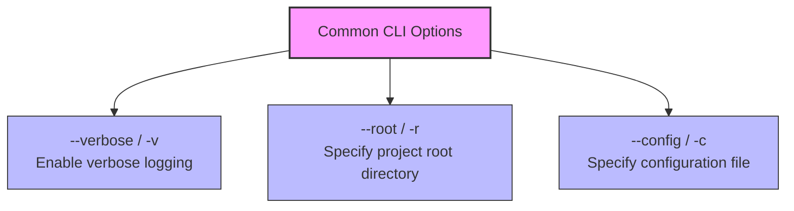
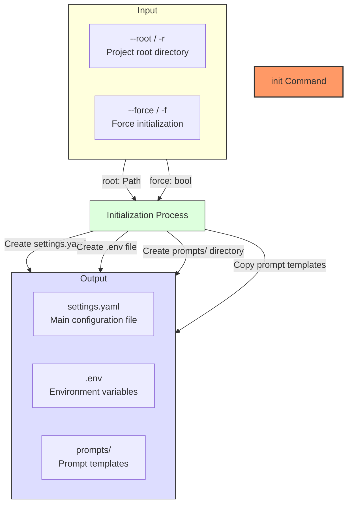
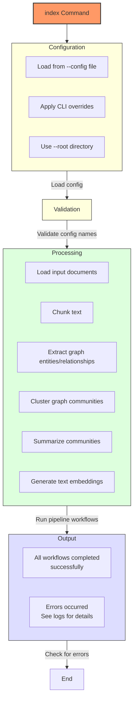
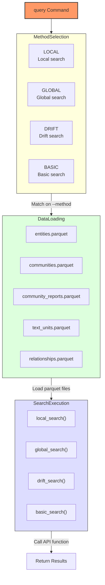
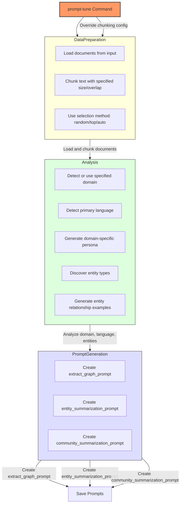
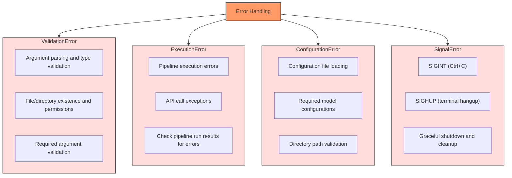
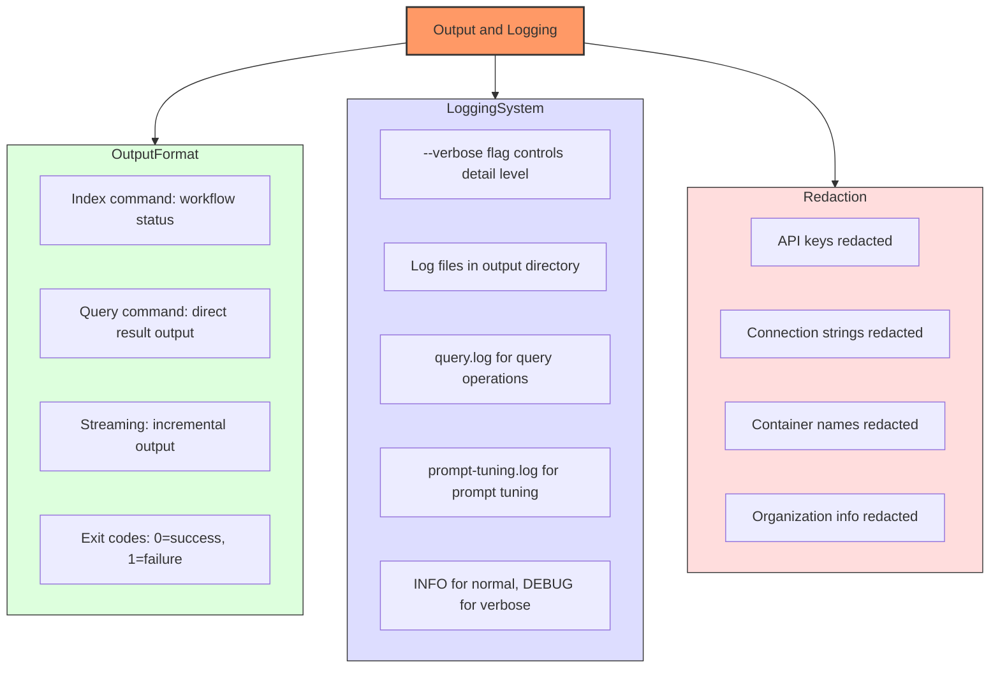

# Command-Line Interface (CLI)

<cite>
**Referenced Files in This Document**   
- [main.py](file://graphrag/cli/main.py)
- [initialize.py](file://graphrag/cli/initialize.py)
- [index.py](file://graphrag/cli/index.py)
- [query.py](file://graphrag/cli/query.py)
- [prompt_tune.py](file://graphrag/cli/prompt_tune.py)
- [api/index.py](file://graphrag/api/index.py)
- [api/query.py](file://graphrag/api/query.py)
- [api/prompt_tune.py](file://graphrag/api/prompt_tune.py)
- [enums.py](file://graphrag/config/enums.py)
- [defaults.py](file://graphrag/config/defaults.py)
- [graph_rag_config.py](file://graphrag/config/models/graph_rag_config.py)
- [utils/cli.py](file://graphrag/utils/cli.py)
</cite>

## Table of Contents
1. [Introduction](#introduction)
2. [Common CLI Options](#common-cli-options)
3. [Command: init](#command-init)
4. [Command: index](#command-index)
5. [Command: query](#command-query)
6. [Command: prompt-tune](#command-prompt-tune)
7. [Typer Framework Integration](#typer-framework-integration)
8. [Error Handling](#error-handling)
9. [Output Formats and Logging](#output-formats-and-logging)

## Introduction
The GraphRAG Command-Line Interface (CLI) provides a comprehensive set of tools for building and querying knowledge graph indices using a graph-based retrieval-augmented generation (RAG) system. The CLI is built using the Typer framework and exposes four primary commands: `init`, `index`, `query`, and `prompt-tune`. These commands enable users to initialize projects, build knowledge graph indices from input data, query the generated knowledge graphs, and generate custom prompts tailored to specific domains and data.

The CLI serves as the primary interface for interacting with the GraphRAG system, abstracting away the complexity of the underlying API and configuration management. Each command triggers specific workflows that process input data, generate knowledge graphs, and enable sophisticated querying capabilities. The CLI integrates with the underlying API to handle configuration loading, data processing, and result generation, providing a user-friendly interface for both beginners and advanced users.

**Section sources**
- [main.py](file://graphrag/cli/main.py#L20-L23)
- [initialize.py](file://graphrag/cli/initialize.py#L37-L62)

## Common CLI Options
The GraphRAG CLI provides several common options that are available across multiple commands, ensuring consistency in usage and configuration. These options include `--verbose`, `--root`, and `--config`, which control logging verbosity, project root directory, and configuration file location respectively.

The `--verbose` flag enables detailed logging output, which is particularly useful for debugging and monitoring the progress of long-running operations. When enabled, the CLI outputs detailed information about each step in the workflow, including configuration settings and processing status. This flag is available for all commands that involve processing operations.

The `--root` option specifies the project root directory, which serves as the base path for all relative paths in the configuration. By default, this is set to the current directory, but users can specify a different directory using either the `-r` short form or `--root` long form. The CLI provides autocompletion for directory paths to enhance usability.

The `--config` option allows users to specify a configuration file (typically `settings.yaml`) that contains detailed settings for the operation. This file can override default values and provide custom configurations for various aspects of the pipeline. The CLI supports autocompletion for YAML files, making it easier to specify configuration files.



**Diagram sources**
- [main.py](file://graphrag/cli/main.py#L96-L105)
- [main.py](file://graphrag/cli/main.py#L121-L130)
- [main.py](file://graphrag/cli/main.py#L148-L153)

**Section sources**
- [main.py](file://graphrag/cli/main.py#L96-L153)

## Command: init
The `init` command generates a default configuration file and initializes a new GraphRAG project. This command creates the necessary configuration files and directory structure to get started with the system. It is typically the first command users run when setting up a new project.

The command has two primary arguments: `--root` which specifies the project root directory (defaulting to the current directory), and `--force` which allows initialization even if a project already exists at the specified location. When executed, the command creates a `settings.yaml` file containing default configuration values, a `.env` file for environment variables, and a `prompts` directory containing default prompt templates.

The initialization process uses predefined content stored in the `INIT_YAML` and `INIT_DOTENV` constants, along with various prompt templates from the `prompts` module. These templates include system prompts for graph extraction, community report generation, claim extraction, and various search methods. The command ensures that the project structure is properly set up before any indexing or querying operations can be performed.



**Diagram sources**
- [main.py](file://graphrag/cli/main.py#L94-L117)
- [initialize.py](file://graphrag/cli/initialize.py#L37-L96)

**Section sources**
- [main.py](file://graphrag/cli/main.py#L94-L117)
- [initialize.py](file://graphrag/cli/initialize.py#L37-L96)

## Command: index
The `index` command builds a knowledge graph index from input data according to the specified configuration. This is the core command for processing raw data into a structured knowledge graph that can later be queried. The command orchestrates a complex pipeline of operations including data loading, text chunking, entity and relationship extraction, community detection, and report generation.

The command accepts several arguments that control the indexing process:
- `--method` specifies the indexing method to use (standard or fast)
- `--output` allows overriding the output directory specified in the configuration
- `--dry-run` enables inspection of the configuration without executing any processing steps
- `--skip-validation` skips preflight validation, useful when running without LLM steps
- `--memprofile` enables memory profiling during execution
- `--cache/--no-cache` controls whether to use LLM caching

The indexing workflow begins by loading the configuration from the specified file or using defaults, then validates the configuration names. It initializes loggers with the specified verbosity level and registers signal handlers for graceful shutdown. The actual indexing is performed by the `build_index` function in the API module, which runs the pipeline asynchronously and returns results.



**Diagram sources**
- [main.py](file://graphrag/cli/main.py#L119-L204)
- [index.py](file://graphrag/cli/index.py#L42-L162)
- [api/index.py](file://graphrag/api/index.py#L29-L96)

**Section sources**
- [main.py](file://graphrag/cli/main.py#L119-L204)
- [index.py](file://graphrag/cli/index.py#L42-L162)

## Command: query
The `query` command enables users to query a knowledge graph index using various search algorithms. It supports four different search methods: local, global, drift, and basic search, each designed for different querying scenarios and use cases. The command loads the necessary index files and executes the specified search algorithm against the knowledge graph.

The command requires the `--method` parameter to specify which search algorithm to use, and the `--query` parameter to provide the actual query string. Additional parameters include `--community-level` to specify the hierarchy level for community reports, `--response-type` to define the desired response format, and `--streaming` to enable streaming output.

For local search, the command loads entities, communities, community reports, text units, and relationships to provide contextually rich responses based on local graph neighborhoods. Global search uses community reports as summaries of larger graph regions, enabling broader queries across the entire knowledge graph. Drift search combines elements of both approaches, while basic search operates directly on text units without graph context.



**Diagram sources**
- [main.py](file://graphrag/cli/main.py#L413-L545)
- [query.py](file://graphrag/cli/query.py#L24-L475)
- [api/query.py](file://graphrag/api/query.py#L64-L469)

**Section sources**
- [main.py](file://graphrag/cli/main.py#L413-L545)
- [query.py](file://graphrag/cli/query.py#L24-L475)

## Command: prompt-tune
The `prompt-tune` command generates custom GraphRAG prompts using the user's own data, enabling auto-templating for specific domains and use cases. This command analyzes input data to create optimized prompts for entity extraction, entity summarization, and community summarization, tailored to the specific characteristics of the data.

The command accepts several parameters that control the prompt generation process:
- `--domain` specifies the domain of the input data (e.g., "space science", "microbiology")
- `--selection-method` determines how text chunks are selected for analysis (random, top, or auto)
- `--limit` sets the number of documents to load when using random or top selection methods
- `--chunk-size` and `--overlap` control text chunking parameters
- `--language` specifies the primary language of the inputs and outputs
- `--discover-entity-types` enables discovery of unspecified entity types in the data
- `--output` specifies the directory to save generated prompts

The prompt tuning workflow begins by loading and chunking documents according to the specified parameters. It then uses language models to analyze the data and generate domain-specific prompts. The process includes domain inference, language detection, persona generation, entity type discovery, and example generation for entity relationships. The resulting prompts are saved to the specified output directory.



**Diagram sources**
- [main.py](file://graphrag/cli/main.py#L288-L411)
- [prompt_tune.py](file://graphrag/cli/prompt_tune.py#L25-L118)
- [api/prompt_tune.py](file://graphrag/api/prompt_tune.py#L56-L203)

**Section sources**
- [main.py](file://graphrag/cli/main.py#L288-L411)
- [prompt_tune.py](file://graphrag/cli/prompt_tune.py#L25-L118)

## Typer Framework Integration
The GraphRAG CLI is built using the Typer framework, which provides a simple and intuitive way to create command-line interfaces in Python. Typer is used to define commands, parse arguments, generate help text, and handle command dispatch. The framework enables type-safe argument parsing and automatic generation of command-line interfaces from function signatures.

The CLI uses a single Typer application instance defined in `main.py` with the name `app`. Each command is added to this application using the `@app.command()` decorator, which registers the function as a CLI command. Function parameters are automatically converted to command-line arguments, with type hints used to determine argument types and validation rules.

The CLI implements several advanced Typer features:
- Custom argument types using Pydantic models for complex validation
- Autocompletion for file and directory paths using custom completer functions
- Default values and help text for all arguments
- Support for both short and long argument forms (e.g., `-r` and `--root`)
- Proper handling of boolean flags with `--option/--no-option` syntax

The integration with Typer also enables automatic generation of help text and usage information. When users run the CLI with the `--help` flag, Typer generates comprehensive documentation for each command, including all available options, their types, default values, and help text. This makes the CLI self-documenting and easy to use.

```mermaid
classDiagram
class TyperApp {
+help : str
+no_args_is_help : bool
+add_command()
+command()
}
class CommandFunction {
+root : Path
+config : Path | None
+verbose : bool
}
class Argument {
+name : str
+type : Type
+default : Any
+help : str
+exists : bool
+file_okay : bool
+dir_okay : bool
+readable : bool
+writable : bool
+resolve_path : bool
+autocompletion : Callable
}
class Autocompleter {
+file_okay : bool
+dir_okay : bool
+readable : bool
+writable : bool
+match_wildcard : str | None
+completer(incomplete : str) : list[str]
}
TyperApp "1" *-- "0..*" CommandFunction : contains
CommandFunction "1" *-- "0..*" Argument : has
Autocompleter "1" -- "0..*" Argument : used by
TyperApp --> Autocompleter : uses
note right of TyperApp
Main application instance
created with typer.Typer()
end note
note right of CommandFunction
Functions decorated with
@app.command() become CLI
commands
end note
note left of Argument
Parameters are automatically
converted to command-line
arguments with appropriate
validation
end note
```

**Diagram sources**
- [main.py](file://graphrag/cli/main.py#L20-L23)
- [main.py](file://graphrag/cli/main.py#L94-L117)
- [main.py](file://graphrag/cli/main.py#L30-L76)

**Section sources**
- [main.py](file://graphrag/cli/main.py#L20-L23)
- [main.py](file://graphrag/cli/main.py#L30-L76)

## Error Handling
The GraphRAG CLI implements comprehensive error handling to provide users with clear feedback when issues occur during execution. Errors are handled at multiple levels, from argument validation to pipeline execution, ensuring that users receive meaningful error messages that help diagnose and resolve problems.

For argument validation, the CLI uses Typer's built-in validation capabilities along with custom validation logic. When invalid arguments are provided, the CLI displays clear error messages and usage information. For example, when a non-existent file is specified with the `--config` option, the CLI validates the file's existence and readable status before proceeding.

During execution, the CLI catches and handles exceptions that may occur in the underlying API calls. The indexing command, for instance, checks for errors in the pipeline run results and exits with a non-zero status code if any errors are encountered. The CLI also implements signal handlers for graceful shutdown when interrupted by signals like SIGINT (Ctrl+C).

Configuration-related errors are handled through dedicated validation functions that check for required settings and proper formatting. The `initialize_project_at` function, for example, raises a `ValueError` if a project is already initialized at the specified location without the `--force` flag. Similarly, the configuration loading process validates that required model configurations are present.



**Diagram sources**
- [initialize.py](file://graphrag/cli/initialize.py#L59-L61)
- [index.py](file://graphrag/cli/index.py#L150-L157)
- [index.py](file://graphrag/cli/index.py#L25-L39)
- [main.py](file://graphrag/cli/main.py#L544-L545)

**Section sources**
- [initialize.py](file://graphrag/cli/initialize.py#L59-L61)
- [index.py](file://graphrag/cli/index.py#L150-L157)

## Output Formats and Logging
The GraphRAG CLI provides structured output and comprehensive logging to help users monitor and understand the execution of commands. The output format varies by command but generally includes progress information, results, and error messages. Logging is configurable through the `--verbose` flag, which controls the level of detail in the output.

For the `index` command, the CLI outputs progress information for each workflow in the pipeline, indicating whether each step completed successfully or encountered errors. When verbose mode is enabled, additional debug information is displayed, including configuration settings and processing details. The command exits with a status code of 0 for success and 1 for failure, making it suitable for use in scripts and automation.

The `query` command outputs the search result directly to stdout, making it easy to capture and process the response. When streaming is enabled with the `--streaming` flag, results are printed incrementally as they become available, providing immediate feedback. The command also returns context data that can be used for debugging or further analysis.

Logging is implemented using Python's standard logging module, with loggers initialized based on the configuration and verbosity level. Log messages are written to files in the output directory, with separate log files for different operations (e.g., `query.log`, `prompt-tuning.log`). Sensitive information such as API keys is redacted from log output using the `redact` function in the `utils.cli` module.



**Diagram sources**
- [index.py](file://graphrag/cli/index.py#L128-L132)
- [query.py](file://graphrag/cli/query.py#L77-L78)
- [utils/cli.py](file://graphrag/utils/cli.py#L27-L54)
- [prompt_tune.py](file://graphrag/cli/prompt_tune.py#L75-L76)

**Section sources**
- [index.py](file://graphrag/cli/index.py#L128-L132)
- [query.py](file://graphrag/cli/query.py#L77-L78)
- [utils/cli.py](file://graphrag/utils/cli.py#L27-L54)