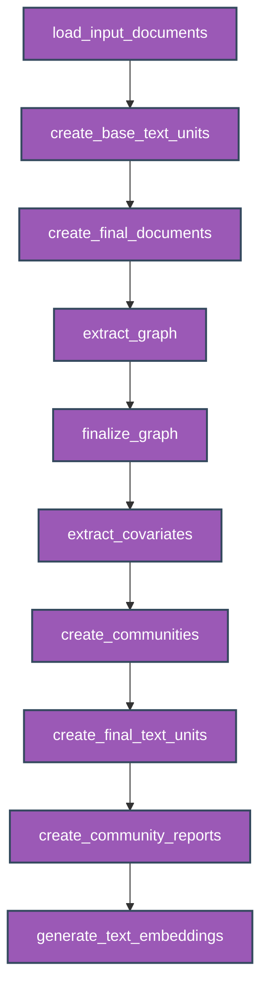
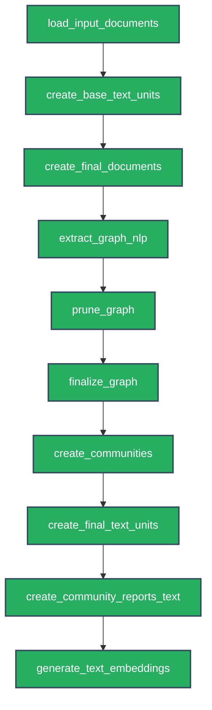
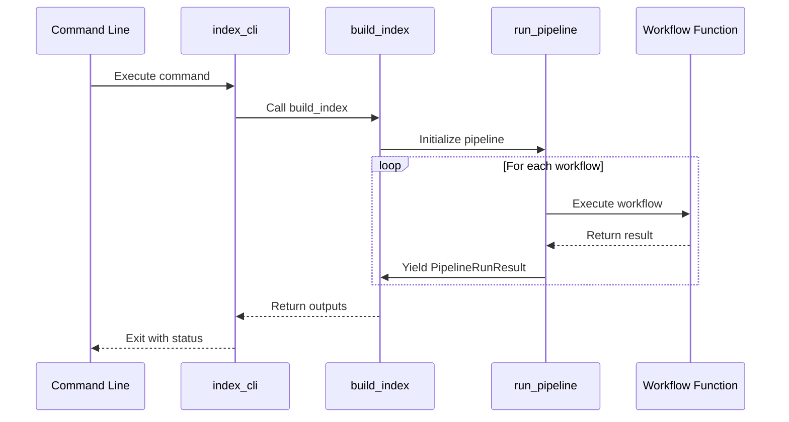
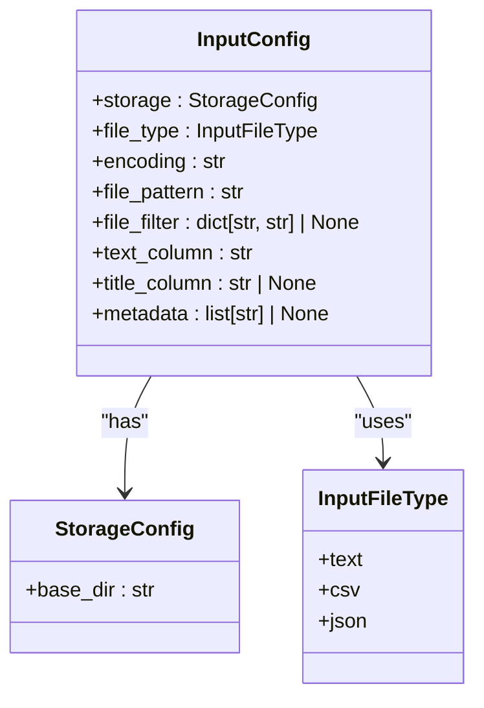
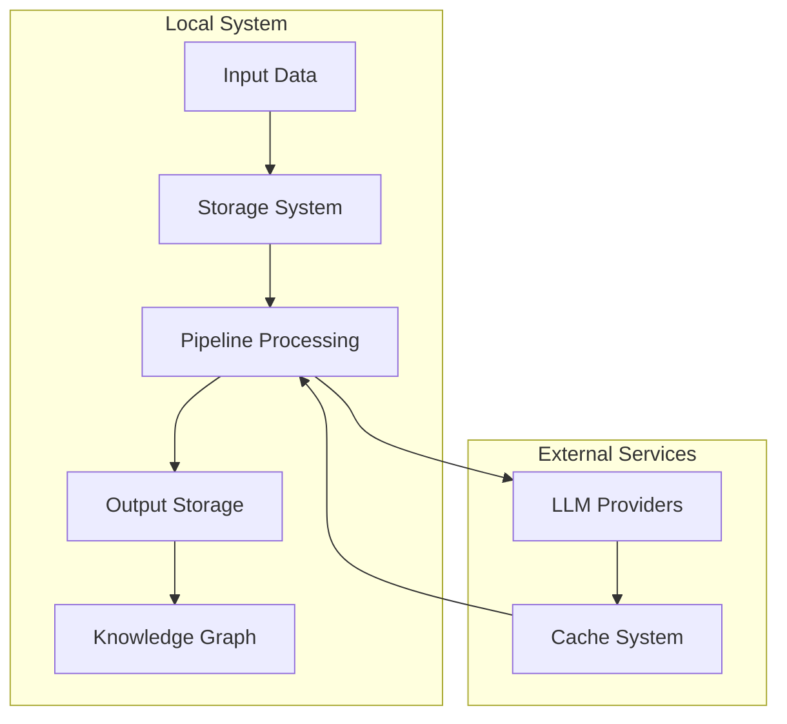
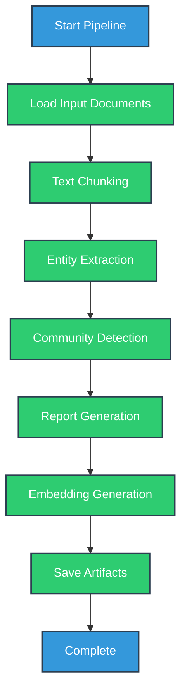
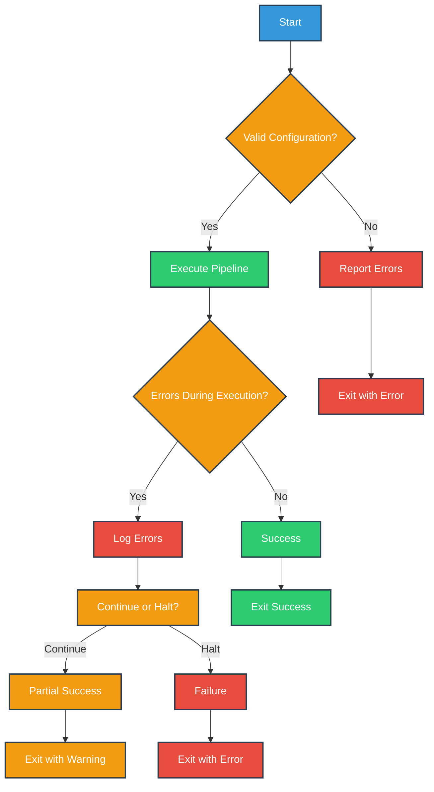

# Indexing Command

<cite>
**Referenced Files in This Document**   
- [index.py](file://graphrag/cli/index.py)
- [main.py](file://graphrag/cli/main.py)
- [load_input_documents.py](file://graphrag/index/workflows/load_input_documents.py)
- [create_base_text_units.py](file://graphrag/index/workflows/create_base_text_units.py)
- [extract_graph.py](file://graphrag/index/workflows/extract_graph.py)
- [create_communities.py](file://graphrag/index/workflows/create_communities.py)
- [create_community_reports.py](file://graphrag/index/workflows/create_community_reports.py)
- [factory.py](file://graphrag/index/workflows/factory.py)
- [input_config.py](file://graphrag/config/models/input_config.py)
- [api/index.py](file://graphrag/api/index.py)
- [run_pipeline.py](file://graphrag/index/run/run_pipeline.py)
</cite>

## Table of Contents
1. [Introduction](#introduction)
2. [Command Syntax and Flags](#command-syntax-and-flags)
3. [Pipeline Workflow Stages](#pipeline-workflow-stages)
4. [Input Loading and Data Formats](#input-loading-and-data-formats)
5. [Storage, Cache, and LLM Integration](#storage-cache-and-llm-integration)
6. [Usage Examples](#usage-examples)
7. [Output Artifacts and Logging](#output-artifacts-and-logging)
8. [Error Handling](#error-handling)
9. [Performance Considerations](#performance-considerations)

## Introduction
The `graphrag index` command executes the full indexing pipeline that transforms raw documents into a structured knowledge graph. This pipeline performs document ingestion, text processing, entity extraction, community detection, and report generation to create a rich knowledge base for retrieval-augmented generation (RAG) applications. The command orchestrates a sequence of workflows that process input data through various stages, leveraging language models for entity and relationship extraction, community detection algorithms for graph clustering, and summarization techniques for generating community reports.

**Section sources**
- [index.py](file://graphrag/cli/index.py#L42-L162)
- [main.py](file://graphrag/cli/main.py#L119-L204)

## Command Syntax and Flags
The `graphrag index` command provides several flags to control pipeline execution and configuration:

- `--config` or `-c`: Specifies the configuration file path (YAML format)
- `--root` or `-r`: Sets the project root directory (default: current directory)
- `--method`: Specifies the indexing method (Standard or Fast)
- `--verbose` or `-v`: Enables verbose logging output
- `--memprofile`: Enables memory profiling during execution
- `--dry-run`: Validates configuration without executing pipeline steps
- `--cache/--no-cache`: Enables or disables LLM response caching
- `--skip-validation`: Skips preflight validation checks
- `--output` or `-o`: Overrides the output directory specified in configuration

The command integrates with the Typer CLI framework, providing autocompletion for file and directory paths. Configuration parameters can be overridden via CLI flags, with CLI values taking precedence over configuration file settings.

```mermaid
flowchart TD
Start["graphrag index"] --> Config["--config <path>"]
Start --> Root["--root <path>"]
Start --> Method["--method <Standard|Fast>"]
Start --> Verbose["--verbose"]
Start --> Memprofile["--memprofile"]
Start --> DryRun["--dry-run"]
Start --> Cache["--cache/--no-cache"]
Start --> SkipValidation["--skip-validation"]
Start --> Output["--output <path>"]
style Start fill:#4B9CD3,stroke:#34495E,stroke-width:2px,color:white
style Config fill:#E67E22,stroke:#34495E,stroke-width:2px,color:white
style Root fill:#E67E22,stroke:#34495E,stroke-width:2px,color:white
style Method fill:#E67E22,stroke:#34495E,stroke-width:2px,color:white
style Verbose fill:#E67E22,stroke:#34495E,stroke-width:2px,color:white
style Memprofile fill:#E67E22,stroke:#34495E,stroke-width:2px,color:white
style DryRun fill:#E67E22,stroke:#34495E,stroke-width:2px,color:white
style Cache fill:#E67E22,stroke:#34495E,stroke-width:2px,color:white
style SkipValidation fill:#E67E22,stroke:#34495E,stroke-width:2px,color:white
style Output fill:#E67E22,stroke:#34495E,stroke-width:2px,color:white
```



**Diagram sources**
- [main.py](file://graphrag/cli/main.py#L119-L204)
- [index.py](file://graphrag/cli/index.py#L42-L69)

**Section sources**
- [main.py](file://graphrag/cli/main.py#L119-L204)
- [index.py](file://graphrag/cli/index.py#L42-L69)

## Pipeline Workflow Stages
The indexing pipeline consists of multiple sequential stages that transform raw documents into a structured knowledge graph. The pipeline execution is managed by the `PipelineFactory` which orchestrates the workflow based on the selected indexing method.

### Standard Indexing Method
The Standard indexing method performs comprehensive LLM-based processing and includes the following stages:



**Diagram sources**
- [factory.py](file://graphrag/index/workflows/factory.py#L52-L62)
- [load_input_documents.py](file://graphrag/index/workflows/load_input_documents.py)
- [create_base_text_units.py](file://graphrag/index/workflows/create_base_text_units.py)
- [extract_graph.py](file://graphrag/index/workflows/extract_graph.py)
- [create_communities.py](file://graphrag/index/workflows/create_communities.py)
- [create_community_reports.py](file://graphrag/index/workflows/create_community_reports.py)

### Fast Indexing Method
The Fast indexing method uses NLP-based entity extraction for improved performance:



**Diagram sources**
- [factory.py](file://graphrag/index/workflows/factory.py#L63-L73)
- [extract_graph_nlp.py](file://graphrag/index/workflows/extract_graph_nlp.py)
- [prune_graph.py](file://graphrag/index/workflows/prune_graph.py)

### Workflow Execution
The pipeline execution is managed by the `run_pipeline` function which processes each workflow sequentially, capturing results and errors. Each workflow receives the pipeline configuration and execution context, allowing for state sharing between stages.



**Diagram sources**
- [api/index.py](file://graphrag/api/index.py#L29-L97)
- [run_pipeline.py](file://graphrag/index/run/run_pipeline.py#L104-L139)

**Section sources**
- [factory.py](file://graphrag/index/workflows/factory.py#L17-L97)
- [api/index.py](file://graphrag/api/index.py#L29-L97)
- [run_pipeline.py](file://graphrag/index/run/run_pipeline.py#L104-L139)

## Input Loading and Data Formats
The indexing pipeline supports multiple input data formats through a pluggable loader system. The input configuration is defined in the `input_config.py` file and includes parameters for specifying the data source, format, and processing options.

### Supported Input Types
The system supports three primary input types:

- **Text files** (.txt): Plain text documents
- **CSV files**: Comma-separated values with structured data
- **JSON files**: JavaScript Object Notation format

The input type is specified in the configuration file using the `file_type` parameter, which maps to the `InputFileType` enum.

### Input Configuration
Key configuration parameters include:

- `storage.base_dir`: Root directory for input files
- `file_type`: Input file format (text, csv, json)
- `encoding`: File encoding (default: utf-8)
- `file_pattern`: Regular expression pattern to match input files
- `file_filter`: Optional filter for file attributes
- `text_column`: Column name containing the main text content
- `title_column`: Column name for document titles (optional)
- `metadata`: List of columns to include as metadata

When processing CSV and JSON files, multiple columns can be designated as metadata, which are then collapsed into a JSON object column in the output.



**Diagram sources**
- [input_config.py](file://graphrag/config/models/input_config.py#L14-L51)
- [factory.py](file://graphrag/index/input/factory.py)
- [csv.py](file://graphrag/index/input/csv.py)
- [json.py](file://graphrag/index/input/json.py)
- [text.py](file://graphrag/index/input/text.py)

**Section sources**
- [input_config.py](file://graphrag/config/models/input_config.py#L14-L51)
- [factory.py](file://graphrag/index/input/factory.py#L20-L24)

## Storage, Cache, and LLM Integration
The indexing pipeline integrates with various storage systems, caching mechanisms, and language model providers to support scalable and efficient processing.

### Storage Architecture
The system uses a modular storage architecture with different storage providers for input, output, and update operations:

- **Input storage**: Reads raw documents from the source directory
- **Output storage**: Writes processed artifacts and intermediate results
- **Update storage**: Manages incremental updates with timestamped backups

The storage system supports multiple backends including local file system, blob storage, and in-memory storage, configured through the `StorageConfig` class.

### Caching System
The caching system optimizes LLM usage by storing responses and avoiding redundant calls:

- **Cache types**: File-based, in-memory, or disabled
- **Cache key generation**: Based on input parameters and LLM configuration
- **Cache invalidation**: Controlled by configuration and CLI flags

The `--cache/--no-cache` flag allows users to enable or disable caching during pipeline execution, with caching enabled by default.

### LLM Provider Integration
The system integrates with language model providers through the LiteLLM framework, supporting multiple LLM services:

- Configuration of LLM endpoints, API keys, and model parameters
- Rate limiting and retry mechanisms for API calls
- Concurrent request handling with configurable thread counts
- Async execution modes for improved performance

LLM settings are configured in the `language_model_config.py` file and can be overridden via the pipeline configuration.



**Diagram sources**
- [run_pipeline.py](file://graphrag/index/run/run_pipeline.py#L40-L43)
- [cache](file://graphrag/cache/)
- [language_model](file://graphrag/language_model/)

**Section sources**
- [run_pipeline.py](file://graphrag/index/run/run_pipeline.py#L40-L43)
- [cache](file://graphrag/cache/)
- [language_model](file://graphrag/language_model/)

## Usage Examples
The `graphrag index` command can be used with various data sources and configuration options.

### Basic Usage
```bash
graphrag index --root ./data --verbose
```

This command executes the indexing pipeline on the data in the ./data directory with verbose logging.

### Custom Configuration
```bash
graphrag index --config ./config/settings.yaml --output ./output
```

This command uses a custom configuration file and specifies a different output directory.

### Processing Different Data Formats

**CSV Input:**
```bash
graphrag index --root ./csv_data --config ./config/csv_config.yaml
```

**JSON Input:**
```bash
graphrag index --root ./json_data --method Fast
```

**Text Files:**
```bash
graphrag index --root ./text_documents --dry-run
```

The dry run option validates the configuration without executing the pipeline, useful for testing setup.

**Section sources**
- [main.py](file://graphrag/cli/main.py#L119-L204)
- [index.py](file://graphrag/cli/index.py#L42-L69)

## Output Artifacts and Logging
The indexing pipeline generates multiple output artifacts and provides comprehensive logging for monitoring and debugging.

### Output Artifacts
The pipeline produces the following output files in Parquet format:

- **documents.parquet**: Processed input documents with metadata
- **text_units.parquet**: Text chunks after splitting and preprocessing
- **entities.parquet**: Extracted entities with descriptions and attributes
- **relationships.parquet**: Relationships between entities
- **communities.parquet**: Detected communities and their hierarchy
- **community_reports.parquet**: Summarized reports for each community
- **text_embeddings.parquet**: Text unit embeddings for retrieval
- **context.json**: Pipeline execution context and state

Additional artifacts may be generated based on configuration, such as raw extraction results when `snapshots.raw_graph` is enabled.

### Logging Behavior
The system provides detailed logging at multiple levels:

- **Info level**: Pipeline progress, workflow completion, and summary statistics
- **Verbose level**: Detailed information about each processing step
- **Error level**: Issues encountered during pipeline execution
- **Debug level**: Detailed diagnostic information for troubleshooting

The `--verbose` flag enables verbose logging, providing insights into the processing of individual documents and workflow execution times.



**Diagram sources**
- [run_pipeline.py](file://graphrag/index/run/run_pipeline.py#L116-L132)
- [workflows](file://graphrag/index/workflows/)

**Section sources**
- [run_pipeline.py](file://graphrag/index/run/run_pipeline.py#L116-L132)
- [workflows](file://graphrag/index/workflows/)

## Error Handling
The indexing pipeline implements comprehensive error handling to manage various failure scenarios.

### Error Types and Handling
The system handles several types of errors:

- **Configuration errors**: Invalid or missing configuration parameters
- **Input errors**: Malformed input files or unsupported formats
- **LLM errors**: Failures in language model calls, rate limiting, or timeouts
- **Processing errors**: Issues during text chunking, entity extraction, or community detection

When errors occur, the pipeline captures them in the `PipelineRunResult` objects and continues processing when possible. The final exit code indicates success (0) or failure (1) based on whether any errors were encountered.

### Validation and Safeguards
The pipeline includes several validation steps:

- **Preflight validation**: Checks configuration validity before execution
- **Data validation**: Ensures extracted entities and relationships contain data
- **Dry run mode**: Validates configuration without executing workflows
- **Skip validation flag**: Allows bypassing validation when running without LLM steps

The `--skip-validation` flag can be used to bypass preflight validation, which is useful when running the pipeline without LLM steps or when validation is not required.



**Diagram sources**
- [index.py](file://graphrag/cli/index.py#L150-L158)
- [run_pipeline.py](file://graphrag/index/run/run_pipeline.py#L135-L139)
- [extract_graph.py](file://graphrag/index/workflows/extract_graph.py#L107-L117)

**Section sources**
- [index.py](file://graphrag/cli/index.py#L150-L158)
- [run_pipeline.py](file://graphrag/index/run/run_pipeline.py#L135-L139)

## Performance Considerations
The indexing pipeline includes several features to optimize performance for large datasets.

### Parallel Processing
The system leverages asynchronous execution and parallel processing:

- **Async workflows**: Non-blocking execution of pipeline stages
- **Concurrent LLM requests**: Configurable number of concurrent requests
- **Multi-threaded processing**: Parallel execution of independent tasks

The performance can be tuned by adjusting the `concurrent_requests` parameter in the LLM configuration.

### Memory Management
For large datasets, memory usage can be monitored using the `--memprofile` flag, which enables memory profiling (though currently not fully supported in the new pipeline). The system uses efficient data structures and streaming processing where possible to minimize memory footprint.

### Incremental Indexing
The `update` command supports incremental indexing, allowing new documents to be added to an existing knowledge graph without reprocessing the entire dataset. This significantly improves performance when adding new content to an established knowledge base.

### Optimization Strategies
- Use the Fast indexing method for quicker processing with NLP-based extraction
- Adjust chunk size and overlap parameters to balance context preservation and processing efficiency
- Configure appropriate LLM concurrency settings based on API rate limits
- Use caching to avoid redundant LLM calls during development and testing

**Section sources**
- [index.py](file://graphrag/cli/index.py#L46-L47)
- [api/index.py](file://graphrag/api/index.py#L70-L71)
- [run_pipeline.py](file://graphrag/index/run/run_pipeline.py)