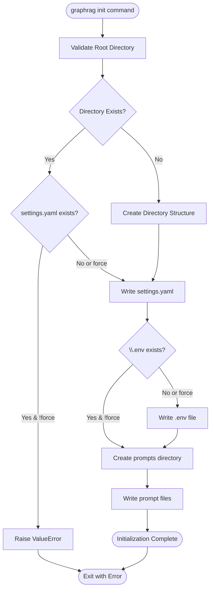
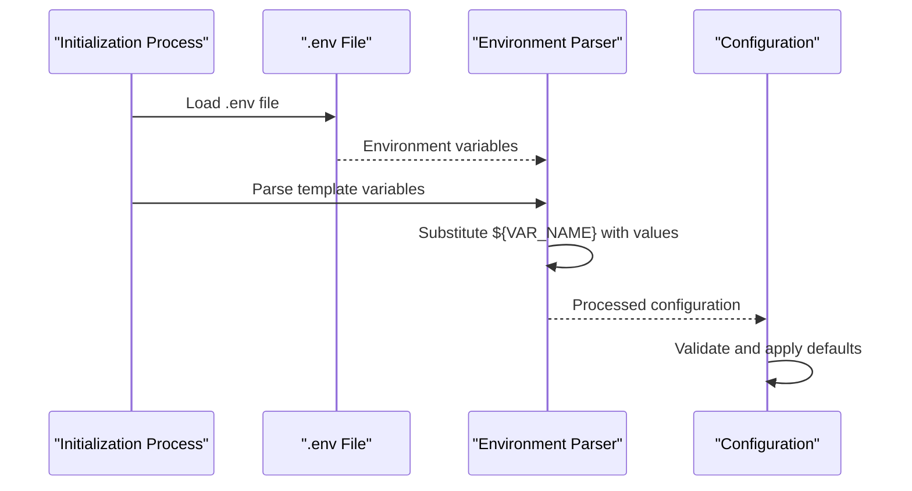
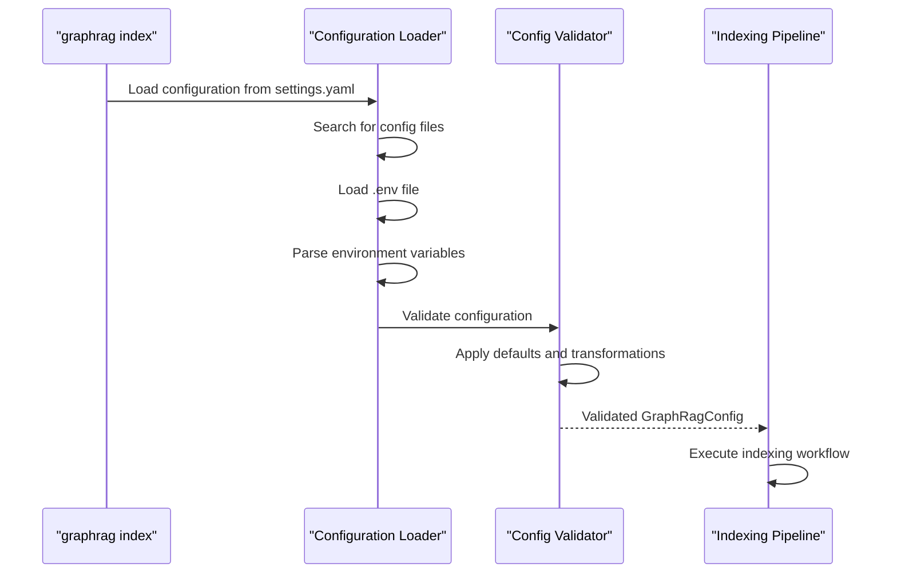

# Initialization Command

<cite>
**Referenced Files in This Document**
- [graphrag/cli/initialize.py](file://graphrag/cli/initialize.py)
- [graphrag/config/init_content.py](file://graphrag/config/init_content.py)
- [graphrag/cli/main.py](file://graphrag/cli/main.py)
- [graphrag/config/load_config.py](file://graphrag/config/load_config.py)
- [graphrag/config/defaults.py](file://graphrag/config/defaults.py)
- [tests/unit/indexing/test_init_content.py](file://tests/unit/indexing/test_init_content.py)
- [tests/fixtures/text/settings.yml](file://tests/fixtures/text/settings.yml)
- [README.md](file://README.md)
</cite>

## Table of Contents
1. [Introduction](#introduction)
2. [Command Overview](#command-overview)
3. [Syntax and Parameters](#syntax-and-parameters)
4. [Generated Configuration Structure](#generated-configuration-structure)
5. [Environment Variables Setup](#environment-variables-setup)
6. [Directory Structure](#directory-structure)
7. [Integration with Indexing Pipeline](#integration-with-indexing-pipeline)
8. [Post-Initialization Customization](#post-initialization-customization)
9. [Common Issues and Troubleshooting](#common-issues-and-troubleshooting)
10. [Best Practices](#best-practices)
11. [Conclusion](#conclusion)

## Introduction

The `graphrag init` command is the foundational entry point for setting up a new GraphRAG project. It creates a comprehensive configuration directory structure with default settings, environment variable configuration, and prompt templates that enable subsequent GraphRAG operations. This command establishes the framework for knowledge graph construction by generating essential files that define how the system interacts with LLM providers, manages data storage, and executes the indexing pipeline.

The initialization process generates a standardized project structure that ensures consistency across GraphRAG deployments while providing flexibility for customization. By scaffolding the configuration early in the workflow, users establish a solid foundation for data processing, knowledge extraction, and query operations.

## Command Overview

The `graphrag init` command serves as the primary setup mechanism for GraphRAG projects, creating a complete configuration environment with sensible defaults. The command orchestrates the creation of multiple configuration files and directories, establishing the infrastructure needed for subsequent GraphRAG operations.



**Diagram sources**
- [graphrag/cli/initialize.py](file://graphrag/cli/initialize.py#L37-L96)

**Section sources**
- [graphrag/cli/initialize.py](file://graphrag/cli/initialize.py#L37-L96)
- [graphrag/cli/main.py](file://graphrag/cli/main.py#L94-L116)

## Syntax and Parameters

The `graphrag init` command follows a straightforward syntax pattern designed for ease of use while providing essential configuration options:

```bash
graphrag init [--root PATH] [--force]
```

### Parameter Details

| Parameter | Short Form | Type | Description | Default |
|-----------|------------|------|-------------|---------|
| `--root` | `-r` | Path | The project root directory where configuration will be generated | Current directory |
| `--force` | `-f` | Boolean | Force initialization even if project already exists | `False` |

### Command Behavior

- **Root Directory Resolution**: The `--root` parameter accepts relative or absolute paths, with automatic resolution to canonical form
- **Directory Creation**: If the specified directory doesn't exist, it will be created with parent directories
- **Force Mode**: When `--force` is specified, existing configurations are overwritten; otherwise, initialization fails if project already exists
- **Validation**: The command validates directory permissions and existence before proceeding

**Section sources**
- [graphrag/cli/main.py](file://graphrag/cli/main.py#L94-L116)
- [graphrag/cli/initialize.py](file://graphrag/cli/initialize.py#L37-L73)

## Generated Configuration Structure

The `graphrag init` command generates a comprehensive configuration structure that forms the backbone of GraphRAG operations. This structure includes YAML configuration files, environment variable files, and prompt templates.

### settings.yaml Structure

The primary configuration file contains hierarchical settings organized into logical sections:

```mermaid
graph TD
SettingsYAML["settings.yaml"] --> Models["models:<br/>- Chat Model<br/>- Embedding Model"]
SettingsYAML --> Input["input:<br/>- Storage Configuration<br/>- File Type"]
SettingsYAML --> Chunks["chunks:<br/>- Size<br/>- Overlap<br/>- Group Columns"]
SettingsYAML --> Output["output:<br/>- Type<br/>- Base Directory"]
SettingsYAML --> Cache["cache:<br/>- Type<br/>- Base Directory"]
SettingsYAML --> Reporting["reporting:<br/>- Type<br/>- Base Directory"]
SettingsYAML --> VectorStore["vector_store:<br/>- Type<br/>- Database URI<br/>- Container Name"]
SettingsYAML --> Workflows["workflows:<br/>- embed_text<br/>- extract_graph<br/>- summarize_descriptions<br/>- cluster_graph<br/>- community_reports<br/>- embed_graph<br/>- umap<br/>- snapshots"]
SettingsYAML --> Queries["queries:<br/>- local_search<br/>- global_search<br/>- drift_search<br/>- basic_search"]
Models --> ChatModel["Chat Model Configuration"]
Models --> EmbedModel["Embedding Model Configuration"]
Workflows --> EmbedText["Text Embedding Workflow"]
Workflows --> ExtractGraph["Graph Extraction Workflow"]
Workflows --> SummarizeDesc["Description Summarization"]
Workflows --> CommunityReports["Community Report Generation"]
Queries --> LocalSearch["Local Search Configuration"]
Queries --> GlobalSearch["Global Search Configuration"]
Queries --> DriftSearch["Drift Search Configuration"]
Queries --> BasicSearch["Basic Search Configuration"]
```



**Diagram sources**
- [graphrag/config/init_content.py](file://graphrag/config/init_content.py#L13-L165)

### Configuration Sections

The generated `settings.yaml` includes several critical sections:

#### LLM Provider Configuration
- **Chat Models**: OpenAI GPT-4 Turbo with JSON support
- **Embedding Models**: OpenAI text-embedding-3-small
- **Authentication**: API key-based with environment variable templating
- **Rate Limiting**: Configurable concurrent requests and retry strategies

#### Data Processing Configuration
- **Chunking Strategy**: Token-based with configurable size and overlap
- **Input Formats**: Support for CSV, text, and JSON data formats
- **Storage Backends**: File, blob, and Cosmos DB storage options

#### Workflow Configuration
- **Graph Extraction**: Entity and relationship identification
- **Community Detection**: Hierarchical clustering algorithms
- **Report Generation**: Automated summarization workflows
- **Vector Storage**: LanceDB and Azure AI Search integration

**Section sources**
- [graphrag/config/init_content.py](file://graphrag/config/init_content.py#L13-L165)
- [graphrag/config/defaults.py](file://graphrag/config/defaults.py#L47-L58)

## Environment Variables Setup

The initialization process creates a `.env` file that manages sensitive configuration values and environment-specific settings. This approach separates security-sensitive data from the main configuration while maintaining easy access for the application.

### Generated .env Content

The default `.env` file includes:

```bash
GRAPHRAG_API_KEY=<API_KEY>
```

### Environment Variable Processing

The GraphRAG configuration system processes environment variables through a sophisticated templating mechanism:



**Diagram sources**
- [graphrag/config/load_config.py](file://graphrag/config/load_config.py#L70-L82)
- [graphrag/config/load_config.py](file://graphrag/config/load_config.py#L49-L67)

### Security Considerations

- **Template Syntax**: Uses `${VARIABLE_NAME}` syntax for safe substitution
- **Fallback Values**: Supports default values for missing environment variables
- **Validation**: Ensures required variables are present during configuration loading
- **Separation of Concerns**: Keeps secrets separate from configuration files

**Section sources**
- [graphrag/config/init_content.py](file://graphrag/config/init_content.py#L162-L165)
- [graphrag/config/load_config.py](file://graphrag/config/load_config.py#L49-L82)

## Directory Structure

The `graphrag init` command creates a standardized directory structure that organizes project assets and facilitates clean separation of concerns:

```mermaid
graph TD
ProjectRoot["Project Root Directory"] --> SettingsFile["settings.yaml"]
ProjectRoot --> EnvFile[".env"]
ProjectRoot --> PromptsDir["prompts/"]
ProjectRoot --> OutputDir["output/"]
ProjectRoot --> CacheDir["cache/"]
ProjectRoot --> ReportsDir["reports/"]
PromptsDir --> ExtractGraph["extract_graph.txt"]
PromptsDir --> SummarizeDesc["summarize_descriptions.txt"]
PromptsDir --> ExtractClaims["extract_claims.txt"]
PromptsDir --> CommunityReportGraph["community_report_graph.txt"]
PromptsDir --> CommunityReportText["community_report_text.txt"]
PromptsDir --> LocalSearch["local_search_system_prompt.txt"]
PromptsDir --> GlobalSearch["global_search_map_system_prompt.txt"]
PromptsDir --> GlobalSearchReduce["global_search_reduce_system_prompt.txt"]
PromptsDir --> DriftSearch["drift_search_system_prompt.txt"]
PromptsDir --> DriftSearchReduce["drift_search_reduce_prompt.txt"]
PromptsDir --> BasicSearch["basic_search_system_prompt.txt"]
PromptsDir --> QuestionGen["question_gen_system_prompt.txt"]
OutputDir --> FinalOutput["Final processed data"]
CacheDir --> LLMCache["LLM response cache"]
ReportsDir --> ProgressReports["Processing progress reports"]
```



**Diagram sources**
- [graphrag/cli/initialize.py](file://graphrag/cli/initialize.py#L71-L96)

### Directory Purposes

- **Root Directory**: Contains core configuration files (`settings.yaml`, `.env`)
- **prompts/**: Stores reusable prompt templates for different operations
- **output/**: Default location for processed knowledge graph data
- **cache/**: Temporary storage for LLM responses and intermediate results
- **reports/**: Logging and progress tracking information

**Section sources**
- [graphrag/cli/initialize.py](file://graphrag/cli/initialize.py#L71-L96)

## Integration with Indexing Pipeline

The initialization-generated configuration seamlessly integrates with the GraphRAG indexing pipeline, providing the foundation for knowledge graph construction. The configuration system supports multiple integration patterns and customization approaches.

### Configuration Loading Process



**Diagram sources**
- [graphrag/config/load_config.py](file://graphrag/config/load_config.py#L146-L192)

### Pipeline Integration Points

The configuration system provides numerous integration points for the indexing pipeline:

#### Model Configuration
- **LLM Providers**: Automatic detection and configuration of chat and embedding models
- **Authentication**: Seamless API key and credential management
- **Rate Limiting**: Built-in throttling and retry mechanisms

#### Storage Integration
- **Input Sources**: Flexible data ingestion from various formats and locations
- **Intermediate Storage**: Efficient caching of processing results
- **Output Management**: Structured export of knowledge graph artifacts

#### Workflow Customization
- **Processing Steps**: Configurable pipeline stages with parameter tuning
- **Quality Control**: Validation and filtering mechanisms
- **Monitoring**: Comprehensive logging and progress tracking

**Section sources**
- [graphrag/config/load_config.py](file://graphrag/config/load_config.py#L146-L192)

## Post-Initialization Customization

After running `graphrag init`, users can customize their GraphRAG project through various configuration modification approaches. The modular design allows for targeted adjustments without disrupting the overall structure.

### Configuration Modification Strategies

#### Direct YAML Editing
- **Structure Preservation**: Maintains YAML formatting and comments
- **Incremental Changes**: Allows selective updates to specific sections
- **Version Control**: Easy tracking of configuration changes

#### Environment Variable Updates
- **Security**: Moves sensitive data to environment-specific files
- **Deployment Flexibility**: Different configurations for development/staging/production
- **Secret Management**: Integration with external secret management systems

#### Prompt Customization
- **Template Modification**: Edit prompt files in the `prompts/` directory
- **Context Enhancement**: Add domain-specific context to prompts
- **Response Quality**: Fine-tune prompts for better LLM performance

### Common Customization Scenarios

#### LLM Provider Configuration
```yaml
models:
  default_chat_model:
    model_provider: "azure"
    api_base: "https://your-instance.openai.azure.com"
    api_version: "2024-05-01-preview"
    deployment_name: "gpt-4"
```

#### Storage Backend Selection
```yaml
input:
  storage:
    type: "blob"
    connection_string: "${BLOB_CONNECTION_STRING}"
    container_name: "graphrag-input"
```

#### Workflow Parameter Tuning
```yaml
chunks:
  size: 2000
  overlap: 200
  
community_reports:
  max_length: 3000
  max_input_length: 12000
```

**Section sources**
- [tests/fixtures/text/settings.yml](file://tests/fixtures/text/settings.yml#L1-L48)

## Common Issues and Troubleshooting

Understanding potential issues during initialization helps users diagnose problems and implement effective solutions. The initialization process includes several safeguard mechanisms and error handling patterns.

### Permission-Related Issues

#### Directory Access Problems
- **Symptom**: "Permission denied" errors during directory creation
- **Cause**: Insufficient write permissions in target directory
- **Solution**: Verify write permissions or choose a different location
- **Prevention**: Use directories with appropriate ownership and permissions

#### File Creation Conflicts
- **Symptom**: "File already exists" errors despite `--force` flag
- **Cause**: File system permissions preventing deletion or replacement
- **Solution**: Manually remove conflicting files or use different directory
- **Prevention**: Ensure exclusive access to the target directory

### Configuration Conflicts

#### Existing Project Detection
- **Behavior**: Command fails when project already exists without `--force`
- **Message**: "Project already initialized at [path]"
- **Resolution**: Use `--force` flag or choose a different directory
- **Best Practice**: Backup existing configurations before forcing reinitialization

#### Environment Variable Issues
- **Symptom**: "Environment variable not found" errors
- **Cause**: Missing required environment variables in `.env` file
- **Solution**: Update `.env` file with required values or modify configuration
- **Prevention**: Review generated `.env` file and populate all placeholders

### Validation Failures

#### YAML Syntax Errors
- **Detection**: Configuration loading fails with parsing errors
- **Resolution**: Validate YAML syntax and fix indentation/formatting
- **Tools**: Use YAML validators or IDE syntax highlighting

#### Schema Validation Errors
- **Cause**: Configuration values violate expected types or ranges
- **Solution**: Review configuration against documented schema
- **Prevention**: Use configuration validation tools before deployment

**Section sources**
- [graphrag/cli/initialize.py](file://graphrag/cli/initialize.py#L58-L61)
- [graphrag/config/load_config.py](file://graphrag/config/load_config.py#L170-L180)

## Best Practices

Following established best practices ensures optimal GraphRAG project setup and long-term maintenance. These recommendations address common pitfalls and promote efficient development workflows.

### Project Organization

#### Directory Structure Planning
- **Logical Separation**: Keep configuration, data, and output directories distinct
- **Naming Conventions**: Use descriptive names for configuration files and directories
- **Version Control**: Include configuration files in version control while excluding sensitive data
- **Documentation**: Maintain README files explaining project structure and setup

#### Environment Management
- **Development vs Production**: Use separate `.env` files for different environments
- **Secret Rotation**: Regularly update API keys and credentials
- **Access Control**: Restrict access to sensitive configuration files
- **Backup Strategy**: Maintain backups of working configurations

### Configuration Management

#### Version Control Integration
- **Selective Tracking**: Track configuration files but exclude sensitive data
- **Branch Strategies**: Use feature branches for configuration experimentation
- **Review Processes**: Implement code review for configuration changes
- **Automated Testing**: Validate configuration changes before deployment

#### Monitoring and Maintenance
- **Regular Audits**: Periodically review and update configuration settings
- **Performance Monitoring**: Track resource usage and optimize accordingly
- **Documentation Updates**: Keep configuration documentation synchronized with changes
- **Migration Planning**: Plan for configuration schema updates between versions

### Security Considerations

#### Sensitive Data Protection
- **Environment Variables**: Store API keys and credentials in environment variables
- **File Permissions**: Restrict file access to authorized users only
- **Encryption**: Consider encrypting sensitive configuration data
- **Audit Trails**: Maintain logs of configuration changes and access

#### Deployment Security
- **Principle of Least Privilege**: Grant minimal necessary permissions
- **Network Security**: Secure communication channels for external services
- **Regular Updates**: Keep GraphRAG and dependencies updated
- **Incident Response**: Establish procedures for security incidents

**Section sources**
- [README.md](file://README.md#L52-L53)

## Conclusion

The `graphrag init` command serves as the cornerstone of GraphRAG project setup, providing a robust foundation for knowledge graph construction and analysis. By generating comprehensive configuration files, establishing secure environment variable management, and creating a standardized directory structure, this command enables users to quickly transition from initial setup to productive knowledge extraction workflows.

The initialization process demonstrates GraphRAG's commitment to developer experience through sensible defaults, comprehensive documentation, and flexible customization options. The generated configuration structure supports complex knowledge graph operations while remaining accessible to users with varying levels of expertise.

Success with GraphRAG begins with proper initialization. Following the guidelines and best practices outlined in this documentation ensures that users establish strong foundations for their knowledge graph projects. As the GraphRAG ecosystem continues to evolve, the initialization command remains a reliable entry point that adapts to changing requirements while maintaining backward compatibility and ease of use.

The modular design of the generated configuration allows for iterative improvement and specialization, enabling users to refine their knowledge graph construction processes over time. Whether building simple prototypes or complex production systems, the `graphrag init` command provides the essential scaffolding needed for successful GraphRAG deployments.