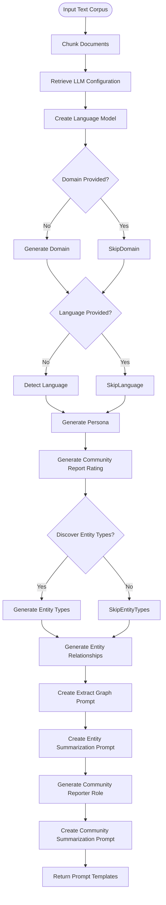
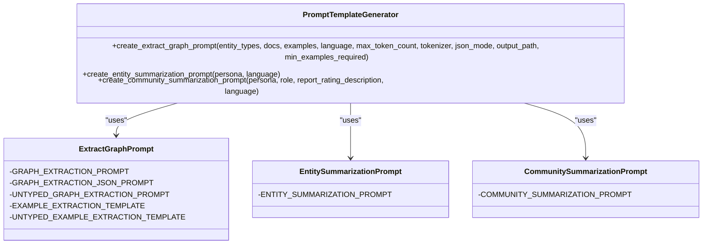

# Prompt Tuning Command

<cite>
**Referenced Files in This Document**   
- [prompt_tune.py](file://graphrag/cli/prompt_tune.py)
- [api/prompt_tune.py](file://graphrag/api/prompt_tune.py)
- [prompt_tune/generator/domain.py](file://graphrag/prompt_tune/generator/domain.py)
- [prompt_tune/generator/language.py](file://graphrag/prompt_tune/generator/language.py)
- [prompt_tune/generator/persona.py](file://graphrag/prompt_tune/generator/persona.py)
- [prompt_tune/generator/entity_types.py](file://graphrag/prompt_tune/generator/entity_types.py)
- [prompt_tune/generator/entity_relationship.py](file://graphrag/prompt_tune/generator/entity_relationship.py)
- [prompt_tune/generator/extract_graph_prompt.py](file://graphrag/prompt_tune/generator/extract_graph_prompt.py)
- [prompt_tune/loader/input.py](file://graphrag/prompt_tune/loader/input.py)
- [prompt_tune/types.py](file://graphrag/prompt_tune/types.py)
- [prompt_tune/defaults.py](file://graphrag/prompt_tune/defaults.py)
- [prompt_tune/template/extract_graph.py](file://graphrag/prompt_tune/template/extract_graph.py)
</cite>

## Table of Contents
1. [Introduction](#introduction)
2. [Command Syntax and Parameters](#command-syntax-and-parameters)
3. [Input Requirements](#input-requirements)
4. [Output Configuration](#output-configuration)
5. [Underlying Process](#underlying-process)
6. [Domain Detection](#domain-detection)
7. [Language Identification](#language-identification)
8. [Entity Type Extraction](#entity-type-extraction)
9. [Persona Generation](#persona-generation)
10. [Prompt Template Generation](#prompt-template-generation)
11. [Integration with Configuration System](#integration-with-configuration-system)
12. [Usage Examples](#usage-examples)
13. [Limitations](#limitations)
14. [Best Practices](#best-practices)

## Introduction
The `graphrag prompt-tune` command is a powerful tool for optimizing Large Language Model (LLM) prompts through domain-specific customization. This command analyzes input text corpora to generate tailored prompt configurations that enhance downstream indexing and querying accuracy. By automatically detecting domain characteristics, language patterns, entity types, and contextual relationships, the prompt tuning process creates optimized templates that are specifically adapted to the input data's unique characteristics.

The command operates by processing text documents through a series of LLM-powered analyses that extract domain-specific knowledge and generate appropriate prompt structures. This automated approach eliminates the need for manual prompt engineering, ensuring that the generated prompts are both contextually relevant and technically optimized for the specific use case.

**Section sources**
- [prompt_tune.py](file://graphrag/cli/prompt_tune.py#L4-L118)
- [api/prompt_tune.py](file://graphrag/api/prompt_tune.py#L4-L203)

## Command Syntax and Parameters
The `graphrag prompt-tune` command provides a comprehensive set of parameters for controlling the prompt tuning process. The command syntax follows the standard CLI pattern with various options for customization.

Key parameters include:
- `root`: The root directory containing the input documents
- `config`: Path to the configuration file (optional)
- `domain`: Pre-specified domain for the input documents (optional override)
- `verbose`: Enable detailed logging output
- `selection_method`: Method for selecting text chunks (all, random, top, auto)
- `limit`: Maximum number of chunks to process
- `max_tokens`: Maximum token count for entity extraction prompts
- `chunk_size`: Token size for text chunking
- `overlap`: Token overlap between chunks
- `language`: Pre-specified language (optional override)
- `discover_entity_types`: Flag to enable automatic entity type discovery
- `output`: Output directory for generated prompt templates
- `n_subset_max`: Maximum number of text chunks to embed for auto selection
- `k`: Number of documents to select for auto selection method
- `min_examples_required`: Minimum examples required for entity extraction prompts

The command uses sensible defaults for most parameters, allowing users to start with minimal configuration while providing extensive customization options for advanced use cases.

**Section sources**
- [prompt_tune.py](file://graphrag/cli/prompt_tune.py#L25-L60)
- [api/prompt_tune.py](file://graphrag/api/prompt_tune.py#L56-L93)
- [types.py](file://graphrag/prompt_tune/types.py#L9-L15)
- [defaults.py](file://graphrag/prompt_tune/defaults.py#L10-L21)

## Input Requirements
The `graphrag prompt-tune` command accepts text files or directories containing text corpora as input. The input can be provided through the root directory parameter, which should contain the documents to be analyzed for prompt tuning.

The command supports various document selection methods through the `DocSelectionType` enum:
- **ALL**: Process all available text chunks
- **RANDOM**: Select a random subset of text chunks
- **TOP**: Select the first N text chunks
- **AUTO**: Use embedding-based similarity to select representative chunks

When using the AUTO selection method, the command first creates embeddings for a subset of text chunks (limited by `n_subset_max`) and then selects the k most central chunks based on their proximity to the centroid of the embedding space. This approach ensures that the selected chunks are representative of the overall corpus.

The input documents are processed through the standard text chunking pipeline with configurable chunk size and overlap parameters. This ensures that the prompt tuning process works with appropriately sized text segments that balance context preservation with processing efficiency.

**Section sources**
- [loader/input.py](file://graphrag/prompt_tune/loader/input.py#L41-L109)
- [types.py](file://graphrag/prompt_tune/types.py#L9-L15)
- [defaults.py](file://graphrag/prompt_tune/defaults.py#L14-L15)

## Output Configuration
The `graphrag prompt-tune` command generates three optimized prompt template files and writes them to the specified output directory. The output directory is created if it does not exist, and existing files are overwritten.

The generated prompt templates include:
- **extract_graph.txt**: Entity extraction prompt template
- **entity_summarization.txt**: Entity summarization prompt template  
- **community_summarization.txt**: Community summarization prompt template

Each template is generated based on the analysis of the input corpus and contains domain-specific configurations that optimize LLM performance for the particular dataset. The templates incorporate detected language, identified entity types, generated personas, and other contextual information extracted during the tuning process.

The command ensures proper encoding (UTF-8) when writing the prompt files and provides logging information about the output process, including the destination path and success status.

**Section sources**
- [prompt_tune.py](file://graphrag/cli/prompt_tune.py#L99-L115)
- [generator/extract_graph_prompt.py](file://graphrag/prompt_tune/generator/extract_graph_prompt.py#L18)
- [generator/entity_summarization_prompt.py](file://graphrag/prompt_tune/generator/entity_summarization_prompt.py#L18)
- [generator/community_report_summarization.py](file://graphrag/prompt_tune/generator/community_report_summarization.py#L18)

## Underlying Process
The prompt tuning process follows a systematic workflow that transforms raw text input into optimized prompt templates through multiple stages of LLM-powered analysis.



**Diagram sources**
- [api/prompt_tune.py](file://graphrag/api/prompt_tune.py#L97-L202)

**Section sources**
- [api/prompt_tune.py](file://graphrag/api/prompt_tune.py#L56-L203)

## Domain Detection
The domain detection process automatically identifies the primary subject area or domain of the input text corpus when no domain is explicitly provided. This functionality uses a dedicated prompt template that instructs the LLM to analyze sample text and assign a descriptive domain.

The domain generation prompt asks the LLM to determine what the text is about and provide a concise domain description. Example domains include "Social studies", "Algorithmic analysis", "Medical science", and similar categorical descriptions that capture the essence of the content.

The process works by:
1. Combining the input documents into a single text string
2. Formatting this text with the domain generation prompt template
3. Submitting the prompt to the LLM for analysis
4. Extracting and returning the LLM's response as the detected domain

This automated domain detection ensures that the subsequent prompt generation steps are contextually appropriate to the specific subject matter of the input data, leading to more effective and relevant prompt templates.

**Section sources**
- [generator/domain.py](file://graphrag/prompt_tune/generator/domain.py#L10-L28)
- [prompt/domain.py](file://graphrag/prompt_tune/prompt/domain.py#L6-L12)

## Language Identification
The language identification process automatically detects the primary language of the input text corpus when no language is explicitly specified. This functionality uses a specialized prompt template designed to identify language characteristics from text samples.

The language detection prompt instructs the LLM to analyze the provided text and determine its primary language, with responses limited to language names such as "English", "Spanish", "Japanese", "Portuguese", etc. The prompt emphasizes that only the language name should be returned, ensuring clean and consistent output.

The process follows these steps:
1. Combines input documents into a single text string
2. Formats the text with the language detection prompt template
3. Submits the prompt to the LLM for analysis
4. Extracts and returns the detected language name

Accurate language identification is crucial for generating properly localized prompt templates, as it ensures that all generated content uses the appropriate language for instructions, formatting, and output, which significantly improves the effectiveness of downstream indexing and querying operations.

**Section sources**
- [generator/language.py](file://graphrag/prompt_tune/generator/language.py#L10-L28)
- [prompt/language.py](file://graphrag/prompt_tune/prompt/language.py#L6-L12)

## Entity Type Extraction
The entity type extraction process identifies and categorizes the types of entities present in the input text corpus. This functionality is controlled by the `discover_entity_types` parameter and is particularly important for creating effective entity extraction prompts.

When enabled, the process uses the LLM to analyze the text and generate a list of relevant entity types such as "military unit", "organization", "person", "location", "event", "date", and "equipment". The extraction can operate in two modes:
- **Standard mode**: Returns entity types as a formatted string
- **JSON mode**: Returns entity types as a structured JSON response using the EntityTypesResponse model

The process incorporates the detected domain and generated persona to provide contextual guidance to the LLM, ensuring that the identified entity types are relevant to the specific subject matter. The resulting entity types are then used to customize the entity extraction prompt template, making it more precise and effective for the particular dataset.

**Section sources**
- [generator/entity_types.py](file://graphrag/prompt_tune/generator/entity_types.py#L22-L60)
- [types.py](file://graphrag/prompt_tune/types.py#L6-L20)

## Persona Generation
The persona generation process creates a specialized expert persona that guides the LLM's behavior during knowledge graph construction and analysis. This persona provides contextual framing that helps the LLM understand its role and responsibilities when processing the input data.

The generation process uses a template that creates a 3-4 sentence description of an expert capable of analyzing the specific domain. The persona follows a consistent format:
- "You are an expert {{role}}."
- "You are skilled at {{relevant skills}}."
- "You are adept at helping people with {{specific task}}."

The persona is generated based on the detected or provided domain, using the DEFAULT_TASK template which describes the goal of identifying relations and structure within the specified domain. This generated persona is then used as a system message in subsequent LLM calls, providing consistent contextual guidance throughout the prompt tuning and indexing processes.

**Section sources**
- [generator/persona.py](file://graphrag/prompt_tune/generator/persona.py#L11-L28)
- [prompt/persona.py](file://graphrag/prompt_tune/prompt/persona.py#L6-L14)
- [defaults.py](file://graphrag/prompt_tune/defaults.py#L10-L12)

## Prompt Template Generation
The prompt template generation process creates three specialized prompt templates based on the analysis of the input corpus. Each template is customized with domain-specific information and optimized for its particular function in the GraphRAG pipeline.

The three generated templates are:

### Extract Graph Prompt
This template guides the LLM in identifying entities and relationships from text. It includes:
- Configurable entity types (if discovered)
- Example extraction patterns
- Language-specific formatting
- Token count limitations
- Relationship strength scoring

The template supports both standard and JSON output formats and includes mechanisms to ensure the prompt stays within the specified token limit by selectively including examples.

### Entity Summarization Prompt
This template guides the LLM in summarizing entity descriptions. It incorporates the generated persona to ensure summaries are created from the perspective of a domain expert, resulting in more insightful and contextually relevant entity descriptions.

### Community Summarization Prompt
This template guides the LLM in summarizing communities of related entities. It combines the generated persona with a specifically crafted community reporter role and community report rating description to produce high-quality community summaries that capture the essential characteristics and importance of each community.



**Diagram sources**
- [generator/extract_graph_prompt.py](file://graphrag/prompt_tune/generator/extract_graph_prompt.py#L21-L110)
- [template/extract_graph.py](file://graphrag/prompt_tune/template/extract_graph.py#L6-L142)

**Section sources**
- [generator/extract_graph_prompt.py](file://graphrag/prompt_tune/generator/extract_graph_prompt.py#L21-L110)
- [generator/entity_summarization_prompt.py](file://graphrag/prompt_tune/generator/entity_summarization_prompt.py#L21-L40)
- [generator/community_report_summarization.py](file://graphrag/prompt_tune/generator/community_report_summarization.py#L21-L40)

## Integration with Configuration System
The `graphrag prompt-tune` command integrates seamlessly with the GraphRAG configuration system, allowing for both default operation and extensive customization. The command can operate with or without a specified configuration file, falling back to default settings when necessary.

The integration works through the following mechanisms:
- Loading configuration from the specified file or default location
- Overriding chunking parameters (size and overlap) based on command-line arguments
- Using the configuration to retrieve appropriate LLM settings for prompt tuning
- Initializing loggers with configuration-specified settings
- Resolving file paths relative to the project root

The command uses the `load_config` function to parse the configuration and create a `GraphRagConfig` object that provides access to all configuration parameters. This object is then used throughout the prompt tuning process to ensure consistency with the overall system configuration.

**Section sources**
- [prompt_tune.py](file://graphrag/cli/prompt_tune.py#L62-L69)
- [api/prompt_tune.py](file://graphrag/api/prompt_tune.py#L22-L25)
- [config/load_config.py](file://graphrag/config/load_config.py)

## Usage Examples
The `graphrag prompt-tune` command can be used in various scenarios with different text corpora. Here are several example use cases:

### Basic Usage
```bash
graphrag prompt-tune --root ./data --output ./prompts
```
This command analyzes all text files in the ./data directory and generates optimized prompt templates in the ./prompts directory, using default parameters for all other settings.

### Domain-Specific Tuning
```bash
graphrag prompt-tune --root ./medical_data --domain "Medical science" --output ./medical_prompts --chunk_size 500
```
This command processes medical text data with a pre-specified domain, generating specialized prompts for medical content analysis with larger chunk sizes to preserve clinical context.

### Multilingual Corpus
```bash
graphrag prompt-tune --root ./multilingual_data --language "Spanish" --output ./spanish_prompts --selection_method random --limit 20
```
This command processes a multilingual corpus with Spanish as the target language, using random selection of 20 text chunks to generate optimized Spanish-language prompts.

### Automated Entity Discovery
```bash
graphrag prompt-tune --root ./research_papers --output ./research_prompts --discover_entity_types --max_tokens 3000
```
This command enables automatic entity type discovery for academic research papers, creating highly specialized prompts with an increased token limit to accommodate complex academic terminology.

**Section sources**
- [prompt_tune.py](file://graphrag/cli/prompt_tune.py#L25-L60)
- [main.py](file://graphrag/cli/main.py#L20-L200)

## Limitations
The `graphrag prompt-tune` command has several limitations that users should be aware of:

### Insufficient Input Data
When the input corpus is too small or lacks sufficient diversity, the prompt tuning process may produce suboptimal results. The system requires a minimum amount of text to reliably detect domain characteristics, language patterns, and entity relationships. With insufficient data, the generated prompts may be overly generic or fail to capture important domain-specific nuances.

### Ambiguous Domains
Text corpora that span multiple domains or contain highly specialized jargon may present challenges for accurate domain detection. In such cases, the automatically detected domain may not fully represent the content, leading to less effective prompt templates. Users should consider providing explicit domain specifications for complex or mixed-domain content.

### Language Detection Errors
While the language detection process is generally accurate, it may struggle with multilingual texts, code-switching, or texts containing significant amounts of proper nouns and technical terms. In such cases, explicitly specifying the language parameter is recommended.

### Entity Type Discovery Constraints
The entity type discovery process depends on the LLM's ability to recognize and categorize entities from the text. For highly specialized domains with unique entity types not well-represented in the LLM's training data, the discovery process may miss important entity categories or generate inappropriate types.

**Section sources**
- [api/prompt_tune.py](file://graphrag/api/prompt_tune.py#L123-L130)
- [generator/domain.py](file://graphrag/prompt_tune/generator/domain.py#L10-L28)
- [generator/language.py](file://graphrag/prompt_tune/generator/language.py#L10-L28)

## Best Practices
To achieve optimal results with the `graphrag prompt-tune` command, consider the following best practices:

### Input Data Quality
Ensure that the input text corpus is representative of the content you plan to index and query. The quality and relevance of the generated prompts are directly dependent on the quality of the input data. Use clean, well-formatted text that reflects the actual content you will be working with.

### Sufficient Data Volume
Provide enough text data for the prompt tuning process to work effectively. As a general guideline, include multiple documents or a substantial amount of text (several thousand words) to ensure reliable domain detection, language identification, and entity type discovery.

### Domain Specification
When working with specialized domains, consider explicitly specifying the domain parameter rather than relying on automatic detection. This ensures that the generated prompts are optimized for the specific subject matter and reduces the risk of misclassification.

### Chunk Size Optimization
Adjust the chunk size parameter based on your content characteristics. For technical or academic content with complex terminology, use larger chunk sizes (500-1000 tokens) to preserve context. For more general content, the default size may be sufficient.

### Validation of Results
Always review the generated prompt templates to ensure they meet your requirements. Test the tuned prompts with sample queries to evaluate their effectiveness before deploying them in production environments.

### Iterative Refinement
Consider using the prompt tuning process iteratively. Start with an initial tuning run, evaluate the results, and then refine your input data or parameters for subsequent runs to progressively improve prompt quality.

**Section sources**
- [api/prompt_tune.py](file://graphrag/api/prompt_tune.py#L56-L203)
- [prompt_tune.py](file://graphrag/cli/prompt_tune.py#L25-L118)
- [defaults.py](file://graphrag/prompt_tune/defaults.py#L10-L21)