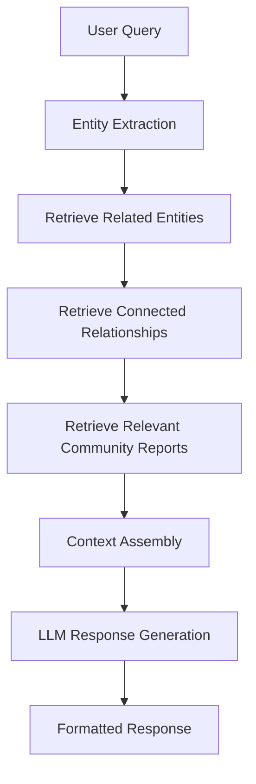
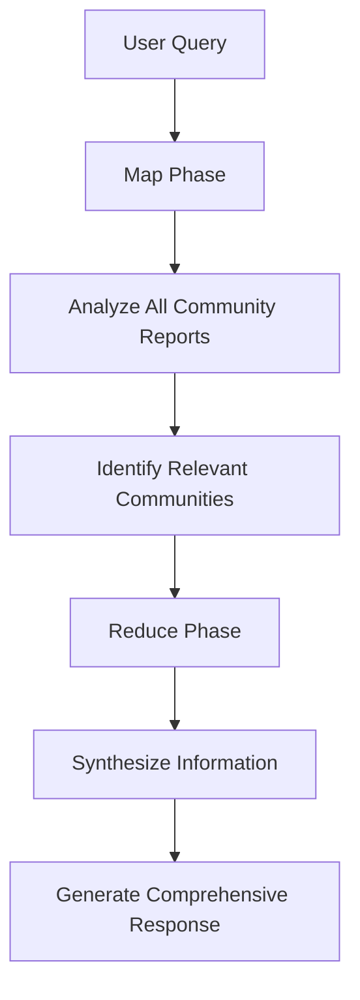
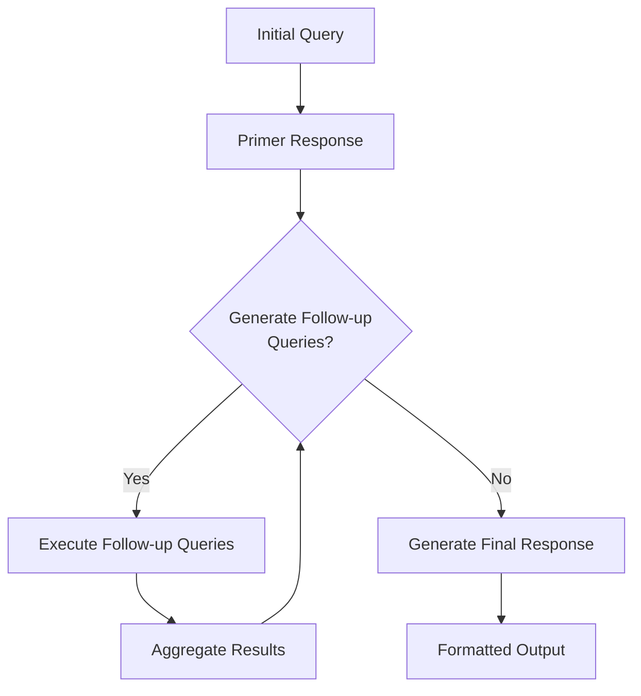
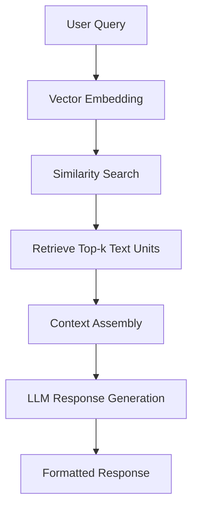
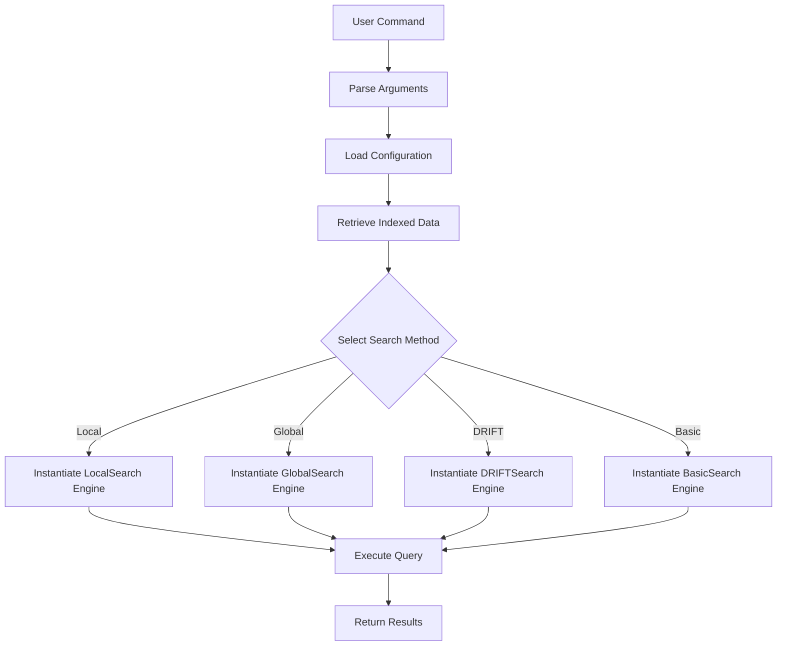
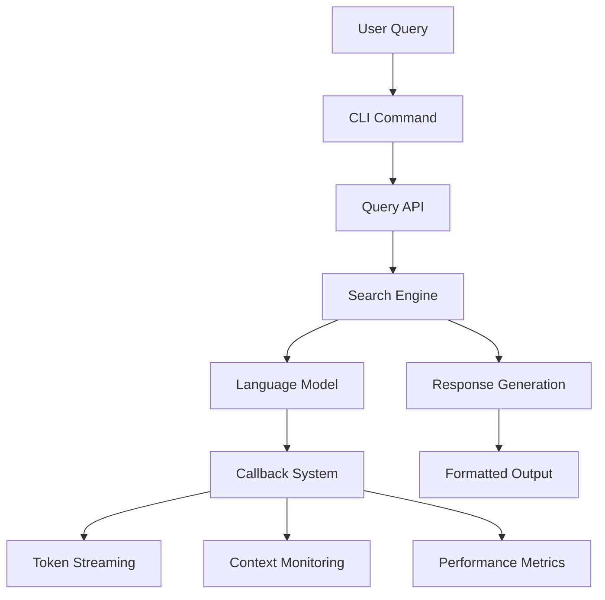

# Query Command

<cite>
**Referenced Files in This Document**   
- [query.py](file://graphrag/cli/query.py)
- [query.py](file://graphrag/api/query.py)
- [factory.py](file://graphrag/query/factory.py)
- [indexer_adapters.py](file://graphrag/query/indexer_adapters.py)
- [main.py](file://graphrag/cli/main.py)
- [enums.py](file://graphrag/config/enums.py)
- [local_search_config.py](file://graphrag/config/models/local_search_config.py)
- [global_search_config.py](file://graphrag/config/models/global_search_config.py)
- [drift_search_config.py](file://graphrag/config/models/drift_search_config.py)
- [basic_search_config.py](file://graphrag/config/models/basic_search_config.py)
- [local_search_system_prompt.py](file://graphrag/prompts/query/local_search_system_prompt.py)
- [global_search_knowledge_system_prompt.py](file://graphrag/prompts/query/global_search_knowledge_system_prompt.py)
- [basic_search_system_prompt.py](file://graphrag/prompts/query/basic_search_system_prompt.py)
</cite>

## Table of Contents
1. [Introduction](#introduction)
2. [Command Syntax and Arguments](#command-syntax-and-arguments)
3. [Search Methods](#search-methods)
4. [Query Engine Initialization](#query-engine-initialization)
5. [Response Format](#response-format)
6. [Usage Examples](#usage-examples)
7. [Common Issues](#common-issues)
8. [Integration with Query API and Callbacks](#integration-with-query-api-and-callbacks)

## Introduction
The `graphrag query` command enables users to ask questions against an indexed knowledge graph using various search strategies. This command provides access to the query engine of GraphRAG, allowing users to retrieve information from knowledge graphs generated by the system. The command supports multiple search methods including local, global, basic, and DRIFT (Dynamic Recursive Iterative Filtering over Time) searches, each designed for different query scenarios and data retrieval patterns.

The query command initializes the query engine, selects the appropriate search method via the factory pattern, and retrieves results using vector stores and language models. It integrates with the underlying query API and callbacks system to provide a comprehensive interface for knowledge graph querying.

**Section sources**
- [query.py](file://graphrag/cli/query.py#L1-L535)
- [main.py](file://graphrag/cli/main.py#L413-L546)

## Command Syntax and Arguments
The `graphrag query` command follows a structured syntax with required and optional parameters that control the query behavior and output format.

### Required Arguments
- `--method` or `-m`: Specifies the search algorithm to use. Valid values are `local`, `global`, `basic`, and `drift`. This parameter is required and determines the search strategy employed.
- `--query` or `-q`: The user query to execute against the knowledge graph. This parameter is required and contains the question or search term.

### Optional Parameters
- `--config` or `-c`: Path to the configuration file (YAML format) to use for the query. If not specified, default configuration values are used.
- `--data` or `-d`: Path to the index output directory containing the parquet files. This overrides the output directory specified in the configuration file.
- `--root` or `-r`: The project root directory. Defaults to the current directory if not specified.
- `--community-level`: The Leiden hierarchy level from which to load community reports (default: 2). Higher values represent smaller communities.
- `--dynamic-community-selection`: Enables global search with dynamic community selection, which intelligently selects relevant communities based on query relevance rather than using all community reports at a fixed level.
- `--response-type`: Specifies the desired response format (default: "Multiple Paragraphs"). Examples include "Single Sentence", "List of 3-7 Points", or "Table".
- `--streaming`: Prints the response in a streaming manner, showing results as they are generated rather than waiting for completion.
- `--verbose`: Runs the query with verbose logging, providing detailed information about the query execution process.

**Section sources**
- [main.py](file://graphrag/cli/main.py#L413-L546)
- [enums.py](file://graphrag/config/enums.py#L130-L137)

## Search Methods
GraphRAG provides four distinct search methods, each optimized for different query patterns and information retrieval scenarios.

### Local Search
Local search focuses on retrieving information from entities, relationships, and communities that are directly connected to the query. This method is ideal for detailed, context-rich responses about specific entities or relationships within the knowledge graph. It uses a mixed context approach that combines community reports, text units, entities, relationships, and covariates to generate comprehensive responses.



**Diagram sources**
- [factory.py](file://graphrag/query/factory.py#L39-L108)
- [local_search_config.py](file://graphrag/config/models/local_search_config.py#L11-L50)

### Global Search
Global search employs a map-reduce strategy to analyze the entire knowledge graph and generate comprehensive responses. This method first "maps" across all community reports to identify relevant information, then "reduces" the results into a coherent response. It is particularly effective for broad queries that require synthesizing information from multiple communities.



**Diagram sources**
- [factory.py](file://graphrag/query/factory.py#L111-L192)
- [global_search_config.py](file://graphrag/config/models/global_search_config.py#L11-L68)

### DRIFT Search
DRIFT (Dynamic Recursive Iterative Filtering over Time) search is an iterative approach that progressively refines the search by generating follow-up queries based on initial results. This method is particularly effective for complex, multi-faceted queries that require exploring multiple angles or dimensions of a topic.



**Diagram sources**
- [factory.py](file://graphrag/query/factory.py#L195-L247)
- [drift_search_config.py](file://graphrag/config/models/drift_search_config.py#L11-L124)

### Basic Search
Basic search performs a simple vector similarity search against text units without leveraging the graph structure. This method is the most straightforward and fastest, making it suitable for simple keyword-based queries or when graph context is not required.



**Diagram sources**
- [factory.py](file://graphrag/query/factory.py#L250-L303)
- [basic_search_config.py](file://graphrag/config/models/basic_search_config.py#L11-L34)

## Query Engine Initialization
The query command initializes the query engine through a systematic process that loads configuration, retrieves indexed data, and instantiates the appropriate search engine based on the selected method.

### Configuration Loading
The process begins by loading the GraphRAG configuration from the specified configuration file or using default values. The configuration contains settings for language models, vector stores, and search parameters that guide the query execution.

### Data Retrieval
The command retrieves indexed data from parquet files in the output directory. The `_resolve_output_files` function in the CLI module handles this process, loading the necessary data tables based on the selected search method:

- **Global search**: Loads entities, communities, and community reports
- **Local search**: Loads communities, community reports, text units, relationships, entities, and optionally covariates
- **DRIFT search**: Loads the same datasets as local search
- **Basic search**: Loads only text units

### Search Engine Selection
The factory pattern is implemented in the `graphrag/query/factory.py` module to instantiate the appropriate search engine. The factory functions (`get_local_search_engine`, `get_global_search_engine`, `get_drift_search_engine`, and `get_basic_search_engine`) create search engine instances configured with the appropriate language models, vector stores, and search parameters.



**Diagram sources**
- [query.py](file://graphrag/cli/query.py#L477-L534)
- [factory.py](file://graphrag/query/factory.py#L39-L303)
- [api/query.py](file://graphrag/api/query.py#L63-L800)

**Section sources**
- [query.py](file://graphrag/cli/query.py#L477-L534)
- [factory.py](file://graphrag/query/factory.py#L39-L303)
- [api/query.py](file://graphrag/api/query.py#L63-L800)

## Response Format
The response format is controlled by the `--response-type` parameter and can be customized to suit different use cases. The system supports various response formats including:

- **Multiple Paragraphs**: Detailed, narrative responses that provide comprehensive information about the query topic
- **Single Sentence**: Concise responses that directly answer the query in one sentence
- **List of 3-7 Points**: Bulleted or numbered lists that highlight key information
- **Table**: Structured tabular data for queries that require organized presentation of information

All responses include data references that indicate the source of information. These references follow the format `[Data: <dataset name> (record ids)]` and list up to five record IDs, with "+more" indicating additional sources when relevant. For example: "Person X is the owner of Company Y [Data: Sources (15, 16), Reports (1), Entities (5, 7); Relationships (23); Claims (2, 7, 34, 46, 64, +more)]."

The response also incorporates general knowledge when relevant, marked with the verification tag `[LLM: verify]` to distinguish between information from the knowledge graph and external knowledge.

**Section sources**
- [basic_search_system_prompt.py](file://graphrag/prompts/query/basic_search_system_prompt.py#L6-L74)
- [local_search_system_prompt.py](file://graphrag/prompts/query/local_search_system_prompt.py#L6-L70)
- [global_search_knowledge_system_prompt.py](file://graphrag/prompts/query/global_search_knowledge_system_prompt.py#L6-L10)

## Usage Examples
The following examples demonstrate the use of the `graphrag query` command with different search methods and parameters.

### Local Search Example
```bash
graphrag query --method local --query "What are the key relationships between Microsoft and Google?" --community-level 2 --response-type "List of 5-7 points"
```
This command performs a local search to identify relationships between Microsoft and Google, returning a list of 5-7 key points with supporting evidence from the knowledge graph.

### Global Search Example
```bash
graphrag query --method global --query "Summarize the impact of artificial intelligence on healthcare" --dynamic-community-selection --response-type "Multiple Paragraphs"
```
This command uses global search with dynamic community selection to generate a comprehensive summary about AI in healthcare, automatically identifying the most relevant communities across the knowledge graph.

### DRIFT Search Example
```bash
graphrag query --method drift --query "Analyze the competitive landscape of cloud computing providers" --community-level 3 --response-type "Table"
```
This command employs DRIFT search to iteratively explore the competitive landscape of cloud providers, generating a structured table that compares different aspects of major cloud platforms.

### Basic Search Example
```bash
graphrag query --method basic --query "Find all mentions of 'machine learning'" --response-type "List of 10 points"
```
This command performs a basic vector search to find text units containing references to "machine learning," returning a list of 10 relevant mentions.

**Section sources**
- [main.py](file://graphrag/cli/main.py#L413-L546)
- [query.py](file://graphrag/cli/query.py#L24-L386)

## Common Issues
Users may encounter several common issues when using the `graphrag query` command, along with their solutions.

### No Results Returned
When a query returns no results, consider the following:
- Verify that the index has been properly created and the data directory contains the expected parquet files
- Check that the community level is appropriate for the query (lower levels for broader topics, higher levels for specific details)
- Ensure the query terms match the terminology used in the source documents
- Try using a different search method (e.g., switch from local to global search for broader queries)

### Slow Performance
To address slow query performance:
- For local and DRIFT searches, reduce the community level to limit the scope of the search
- Use basic search for simple keyword queries instead of more complex methods
- Ensure the vector store is properly configured and indexed
- Consider increasing hardware resources, particularly memory for handling large context windows

### Configuration Errors
Common configuration issues include:
- Missing or incorrect paths to configuration files or data directories
- Language model settings that don't match available services
- Vector store configurations that don't align with the deployed infrastructure

**Section sources**
- [query.py](file://graphrag/cli/query.py#L1-L535)
- [api/query.py](file://graphrag/api/query.py#L1-L800)

## Integration with Query API and Callbacks
The `graphrag query` command integrates with the underlying query API and callbacks system to provide extensibility and monitoring capabilities.

### Query API
The command leverages the GraphRAG Query API, which provides a programmatic interface for executing queries. The API exposes functions like `global_search`, `local_search`, `drift_search`, and `basic_search` that can be called directly from external applications. These functions handle the core search logic and return structured responses with both the answer and context data.

### Callbacks System
The callbacks system allows for monitoring and extending query execution. The `QueryCallbacks` interface defines methods that are called at various stages of the query process, including:
- `on_llm_new_token`: Called when a new token is generated by the language model
- `on_context`: Called when context data is available
- Other lifecycle events that enable real-time monitoring and integration with external systems

The system uses `NoopQueryCallbacks` as a default implementation that can be extended or replaced with custom callback handlers for specific use cases.



**Diagram sources**
- [api/query.py](file://graphrag/api/query.py#L27-L58)
- [callbacks.py](file://graphrag/callbacks/query_callbacks.py)
- [factory.py](file://graphrag/query/factory.py#L39-L303)

**Section sources**
- [api/query.py](file://graphrag/api/query.py#L27-L58)
- [callbacks.py](file://graphrag/callbacks/query_callbacks.py)
- [factory.py](file://graphrag/query/factory.py#L39-L303)