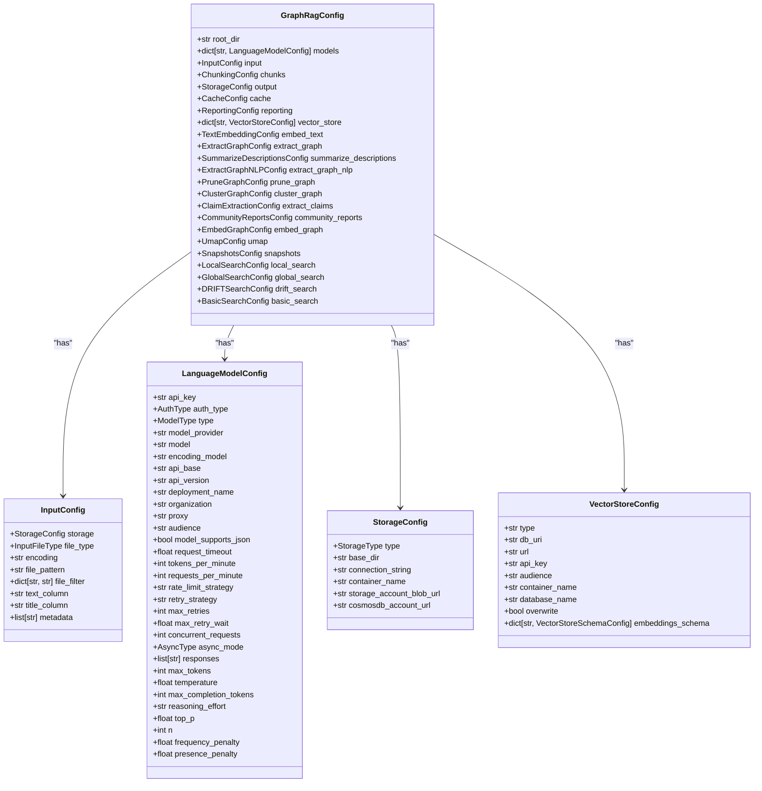
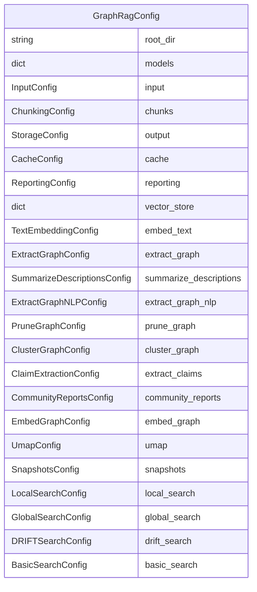
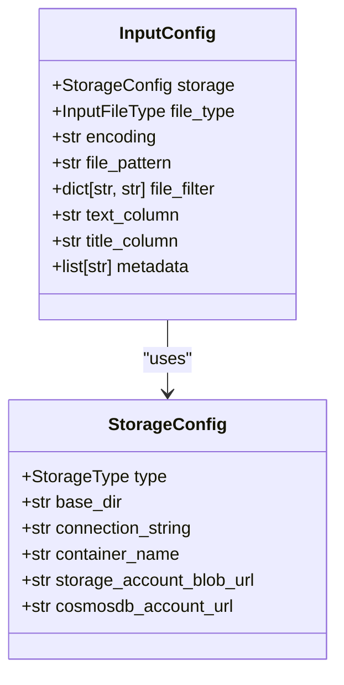
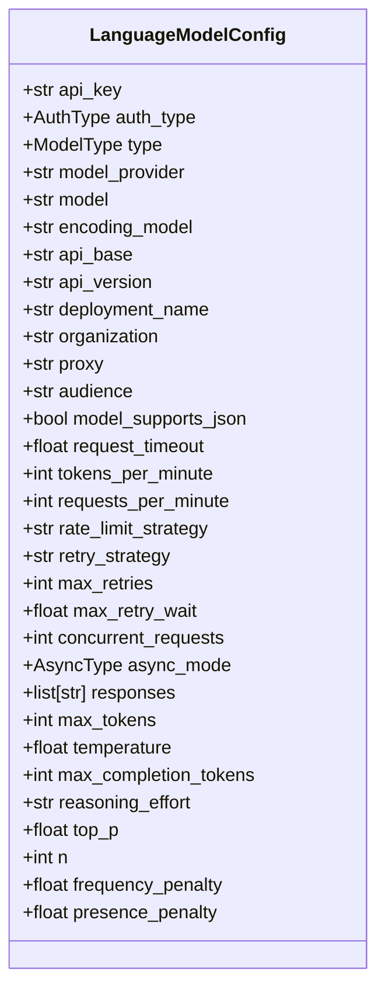
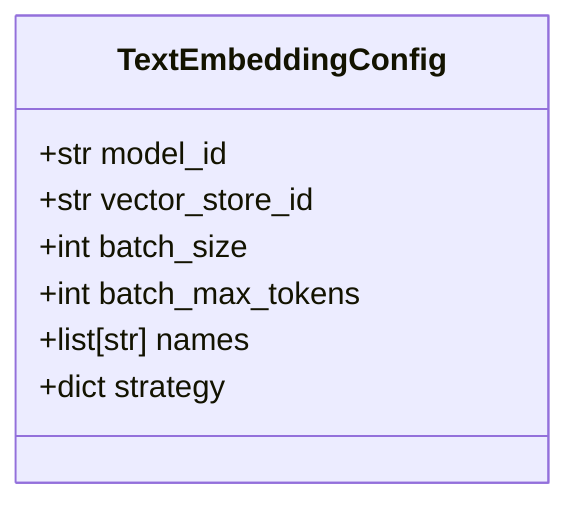
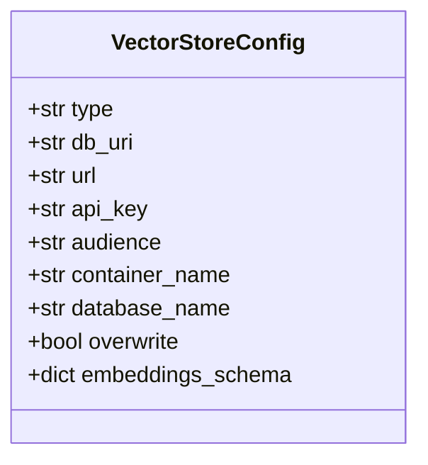
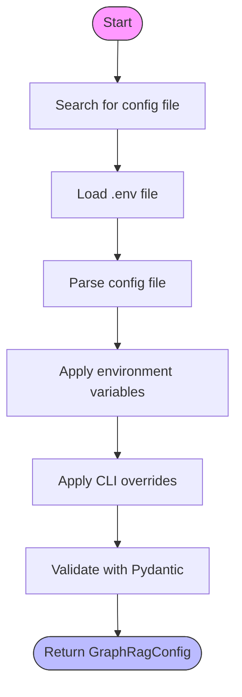

# Configuration Reference

<cite>
**Referenced Files in This Document**   
- [graph_rag_config.py](file://graphrag/config/models/graph_rag_config.py)
- [defaults.py](file://graphrag/config/defaults.py)
- [load_config.py](file://graphrag/config/load_config.py)
- [input_config.py](file://graphrag/config/models/input_config.py)
- [language_model_config.py](file://graphrag/config/models/language_model_config.py)
- [text_embedding_config.py](file://graphrag/config/models/text_embedding_config.py)
- [vector_store_config.py](file://graphrag/config/models/vector_store_config.py)
- [storage_config.py](file://graphrag/config/models/storage_config.py)
- [cache_config.py](file://graphrag/config/models/cache_config.py)
- [enums.py](file://graphrag/config/enums.py)
- [environment_reader.py](file://graphrag/config/environment_reader.py)
- [create_graphrag_config.py](file://graphrag/config/create_graphrag_config.py)
</cite>

## Table of Contents
1. [Introduction](#introduction)
2. [Configuration Structure](#configuration-structure)
3. [Top-Level Configuration Fields](#top-level-configuration-fields)
4. [Input Configuration](#input-configuration)
5. [LLM Configuration](#llm-configuration)
6. [Embeddings Configuration](#embeddings-configuration)
7. [Vector Store Configuration](#vector-store-configuration)
8. [Chunks Configuration](#chunks-configuration)
9. [Graph Configuration](#graph-configuration)
10. [Communities Configuration](#communities-configuration)
11. [Reports Configuration](#reports-configuration)
12. [Configuration Loading and Validation](#configuration-loading-and-validation)
13. [Defaults System](#defaults-system)
14. [Environment Variables](#environment-variables)
15. [Configuration Examples](#configuration-examples)
16. [Error Handling](#error-handling)
17. [LLM Providers Configuration](#llm-providers-configuration)
18. [Storage Backends Configuration](#storage-backends-configuration)

## Introduction

The GraphRAG configuration system provides a comprehensive framework for customizing the behavior of the GraphRAG pipeline. This document serves as a complete reference for users configuring their deployment, detailing the structure of the configuration, field definitions, default values, and their impact on pipeline behavior.

The configuration system is built on Pydantic models that provide strong typing, validation, and documentation for all configuration options. Configuration can be loaded from YAML/JSON files and environment variables, with a well-defined hierarchy for value resolution. The system includes extensive validation to ensure configurations are correct before execution.

**Section sources**
- [graph_rag_config.py](file://graphrag/config/models/graph_rag_config.py#L48-L417)
- [defaults.py](file://graphrag/config/defaults.py#L6-L481)

## Configuration Structure

The GraphRAG configuration is structured as a hierarchical object model with the `GraphRagConfig` class as the root. This top-level configuration contains nested configuration objects for different aspects of the pipeline, such as input, LLM, embeddings, vector store, chunks, graph, communities, and reports.

The configuration system follows a modular design where each component has its own configuration class that inherits from Pydantic's `BaseModel`. This provides type safety, validation, and automatic documentation. The configuration is loaded from YAML or JSON files and can be overridden via environment variables or command-line arguments.



**Diagram sources**
- [graph_rag_config.py](file://graphrag/config/models/graph_rag_config.py#L48-L417)
- [input_config.py](file://graphrag/config/models/input_config.py#L14-L51)
- [language_model_config.py](file://graphrag/config/models/language_model_config.py#L25-L404)
- [storage_config.py](file://graphrag/config/models/storage_config.py#L14-L53)
- [vector_store_config.py](file://graphrag/config/models/vector_store_config.py#L14-L112)

**Section sources**
- [graph_rag_config.py](file://graphrag/config/models/graph_rag_config.py#L48-L417)
- [input_config.py](file://graphrag/config/models/input_config.py#L14-L51)
- [language_model_config.py](file://graphrag/config/models/language_model_config.py#L25-L404)
- [storage_config.py](file://graphrag/config/models/storage_config.py#L14-L53)
- [vector_store_config.py](file://graphrag/config/models/vector_store_config.py#L14-L112)

## Top-Level Configuration Fields

The `GraphRagConfig` class serves as the root configuration object and contains all top-level fields that control the pipeline behavior. Each field corresponds to a specific aspect of the system and has a default value defined in the `defaults.py` file.

The configuration includes fields for input processing, LLM configuration, embeddings, vector store, chunking, graph construction, community detection, report generation, and search functionality. The configuration also includes settings for caching, reporting, and storage.



**Diagram sources**
- [graph_rag_config.py](file://graphrag/config/models/graph_rag_config.py#L59-L339)

**Section sources**
- [graph_rag_config.py](file://graphrag/config/models/graph_rag_config.py#L59-L339)

## Input Configuration

The input configuration controls how source documents are loaded and processed. It includes settings for the storage type, file type, encoding, file pattern, and column mappings.

The `InputConfig` class defines the following fields:

- **storage**: Configuration for the storage backend used to read input documents (file, blob, cosmosdb)
- **file_type**: The type of input files (text, csv, json)
- **encoding**: The character encoding of the input files (utf-8 by default)
- **file_pattern**: Regular expression pattern to match input files
- **file_filter**: Optional filter to select specific files based on metadata
- **text_column**: The column name containing the text content (default: "text")
- **title_column**: The column name containing the document title (optional)
- **metadata**: List of column names to include as document metadata

The input configuration supports various storage backends including local file system, Azure Blob Storage, and Cosmos DB. The file pattern can be customized to match specific file types or naming conventions.



**Diagram sources**
- [input_config.py](file://graphrag/config/models/input_config.py#L14-L51)
- [storage_config.py](file://graphrag/config/models/storage_config.py#L14-L53)

**Section sources**
- [input_config.py](file://graphrag/config/models/input_config.py#L14-L51)

## LLM Configuration

The LLM configuration controls the language model settings used throughout the pipeline. It includes settings for authentication, model selection, rate limiting, and request parameters.

The `LanguageModelConfig` class defines the following fields:

- **api_key**: API key for authenticating with the LLM service
- **auth_type**: Authentication type (APIKey or AzureManagedIdentity)
- **type**: Type of LLM model to use (Chat, Embedding, etc.)
- **model_provider**: Provider of the LLM service (openai, azure, etc.)
- **model**: Specific model name to use
- **encoding_model**: Token encoding model to use
- **api_base**: Base URL for the LLM API
- **api_version**: Version of the LLM API to use
- **deployment_name**: Deployment name for Azure-hosted models
- **organization**: Organization identifier for the LLM service
- **proxy**: Proxy server to use for LLM requests
- **audience**: Azure resource URI for managed identity
- **model_supports_json**: Whether the model supports JSON output mode
- **request_timeout**: Timeout for LLM requests
- **tokens_per_minute**: Rate limit for tokens per minute
- **requests_per_minute**: Rate limit for requests per minute
- **rate_limit_strategy**: Strategy for rate limiting (static, etc.)
- **retry_strategy**: Strategy for retrying failed requests
- **max_retries**: Maximum number of retries for failed requests
- **max_retry_wait**: Maximum wait time between retries
- **concurrent_requests**: Number of concurrent requests to allow
- **async_mode**: Asynchronous execution mode (threaded, asyncio)
- **responses**: Static responses for mock mode
- **max_tokens**: Maximum number of tokens to generate
- **temperature**: Temperature parameter for token generation
- **max_completion_tokens**: Maximum number of tokens to consume
- **reasoning_effort**: Level of effort for reasoning models
- **top_p**: Top-p sampling parameter
- **n**: Number of completions to generate
- **frequency_penalty**: Frequency penalty parameter
- **presence_penalty**: Presence penalty parameter

The LLM configuration supports multiple providers including OpenAI and Azure OpenAI, with different authentication methods and rate limiting strategies.



**Diagram sources**
- [language_model_config.py](file://graphrag/config/models/language_model_config.py#L25-L404)

**Section sources**
- [language_model_config.py](file://graphrag/config/models/language_model_config.py#L25-L404)

## Embeddings Configuration

The embeddings configuration controls how text embeddings are generated and stored. It includes settings for the embedding model, batch processing, and vector store integration.

The `TextEmbeddingConfig` class defines the following fields:

- **model_id**: ID of the language model to use for embeddings
- **vector_store_id**: ID of the vector store to use for embeddings
- **batch_size**: Number of documents to process in each batch
- **batch_max_tokens**: Maximum number of tokens in each batch
- **names**: Specific embeddings to perform
- **strategy**: Override strategy for text embedding

The embeddings configuration allows for customization of batch processing parameters to optimize performance based on available resources. The strategy field can be used to override the default embedding strategy with a custom implementation.



**Diagram sources**
- [text_embedding_config.py](file://graphrag/config/models/text_embedding_config.py#L12-L53)

**Section sources**
- [text_embedding_config.py](file://graphrag/config/models/text_embedding_config.py#L12-L53)

## Vector Store Configuration

The vector store configuration controls how embeddings are stored and retrieved. It supports multiple vector store backends including LanceDB, Azure AI Search, and Cosmos DB.

The `VectorStoreConfig` class defines the following fields:

- **type**: Type of vector store to use (lancedb, azure_ai_search, cosmosdb)
- **db_uri**: Database URI for LanceDB
- **url**: Database URL for Azure AI Search or Cosmos DB
- **api_key**: API key for Azure AI Search
- **audience**: Audience for Azure AI Search
- **container_name**: Container name for the vector store
- **database_name**: Database name for Cosmos DB
- **overwrite**: Whether to overwrite existing data
- **embeddings_schema**: Schema configuration for embeddings

The vector store configuration includes validation rules to ensure that the correct parameters are provided for each vector store type. For example, the db_uri is only used with LanceDB, while the url is required for Azure AI Search and Cosmos DB.



**Diagram sources**
- [vector_store_config.py](file://graphrag/config/models/vector_store_config.py#L14-L112)

**Section sources**
- [vector_store_config.py](file://graphrag/config/models/vector_store_config.py#L14-L112)

## Chunks Configuration

The chunks configuration controls how input text is divided into smaller segments for processing. It includes settings for chunk size, overlap, and grouping.

The `ChunkingConfig` class defines the following fields:

- **size**: Size of each chunk in tokens
- **overlap**: Number of tokens to overlap between chunks
- **group_by_columns**: Columns to use for grouping chunks
- **strategy**: Strategy for chunking (tokens, sentence)
- **encoding_model**: Token encoding model to use
- **prepend_metadata**: Whether to prepend metadata to chunks
- **chunk_size_includes_metadata**: Whether chunk size includes metadata

The chunking configuration allows for fine-tuning of the text segmentation process to optimize for different types of content and processing requirements.

**Section sources**
- [defaults.py](file://graphrag/config/defaults.py#L98-L109)

## Graph Configuration

The graph configuration controls how the knowledge graph is constructed from the input text. It includes settings for entity extraction, relationship detection, and graph pruning.

Key configuration classes include:

- **ExtractGraphConfig**: Controls entity extraction parameters
- **ExtractGraphNLPConfig**: Controls NLP-based graph extraction
- **PruneGraphConfig**: Controls graph pruning parameters
- **ClusterGraphConfig**: Controls graph clustering parameters
- **EmbedGraphConfig**: Controls graph embedding parameters

These configurations allow for customization of the graph construction process, including entity types to detect, maximum gleanings, pruning thresholds, and clustering parameters.

**Section sources**
- [graph_rag_config.py](file://graphrag/config/models/graph_rag_config.py#L260-L282)

## Communities Configuration

The communities configuration controls how communities are detected and analyzed within the knowledge graph. It includes settings for community detection algorithms and parameters.

The `ClusterGraphConfig` class defines the following fields:

- **max_cluster_size**: Maximum size of each cluster
- **use_lcc**: Whether to use largest connected component
- **seed**: Random seed for reproducibility

These settings control the community detection process, allowing for adjustment of cluster size and algorithm behavior.

**Section sources**
- [defaults.py](file://graphrag/config/defaults.py#L111-L118)

## Reports Configuration

The reports configuration controls how community reports are generated from the knowledge graph. It includes settings for report generation parameters and prompts.

The `CommunityReportsConfig` class defines the following fields:

- **graph_prompt**: Prompt template for graph-based reports
- **text_prompt**: Prompt template for text-based reports
- **max_length**: Maximum length of generated reports
- **max_input_length**: Maximum length of input for report generation
- **strategy**: Strategy for report generation
- **model_id**: ID of the language model to use for report generation

These settings allow for customization of the report generation process, including length limits, prompt templates, and model selection.

**Section sources**
- [defaults.py](file://graphrag/config/defaults.py#L120-L131)

## Configuration Loading and Validation

The configuration system provides a robust mechanism for loading and validating configuration from multiple sources. Configuration can be loaded from YAML or JSON files, environment variables, and command-line overrides.

The loading process follows these steps:

1. Search for configuration files in the root directory (settings.yaml, settings.yml, settings.json)
2. Load environment variables from a .env file in the same directory
3. Parse the configuration file content
4. Apply environment variable substitutions
5. Apply command-line overrides
6. Validate the configuration using Pydantic models

The `load_config` function in `load_config.py` implements this process, providing comprehensive error handling and validation.



**Diagram sources**
- [load_config.py](file://graphrag/config/load_config.py#L21-L192)

**Section sources**
- [load_config.py](file://graphrag/config/load_config.py#L21-L192)

## Defaults System

The configuration system includes a comprehensive defaults system that provides sensible default values for all configuration options. These defaults are defined in the `defaults.py` file using dataclasses.

The defaults system provides:

- Fallback values for optional configuration fields
- Sensible defaults for required fields
- Consistent behavior across different deployments
- Easy customization through configuration files

The defaults are organized into dataclasses for each configuration section, making it easy to understand and modify the default behavior.

**Section sources**
- [defaults.py](file://graphrag/config/defaults.py#L6-L481)

## Environment Variables

The configuration system supports environment variable substitution, allowing sensitive information and deployment-specific settings to be managed externally.

Environment variables can be used in configuration files using the ${VARIABLE_NAME} syntax. The system automatically loads environment variables from a .env file in the same directory as the configuration file.

This allows for secure management of API keys, connection strings, and other sensitive information without including them in version control.

**Section sources**
- [load_config.py](file://graphrag/config/load_config.py#L49-L68)
- [environment_reader.py](file://graphrag/config/environment_reader.py#L19-L156)

## Configuration Examples

Here are examples of valid configuration files in both YAML and JSON formats:

**YAML Example:**
```yaml
root_dir: "."
input:
  file_type: text
  encoding: utf-8
  file_pattern: ".*\\.txt$"
  text_column: text
  title_column: title
models:
  default_chat_model:
    type: chat
    model: gpt-4-turbo-preview
    api_key: ${OPENAI_API_KEY}
    max_tokens: 4000
    temperature: 0
  default_embedding_model:
    type: embedding
    model: text-embedding-3-small
    api_key: ${OPENAI_API_KEY}
output:
  type: file
  base_dir: output
vector_store:
  default_vector_store:
    type: lancedb
    db_uri: ./output/lancedb
```

**JSON Example:**
```json
{
  "root_dir": ".",
  "input": {
    "file_type": "text",
    "encoding": "utf-8",
    "file_pattern": ".*\\.txt$",
    "text_column": "text",
    "title_column": "title"
  },
  "models": {
    "default_chat_model": {
      "type": "chat",
      "model": "gpt-4-turbo-preview",
      "api_key": "${OPENAI_API_KEY}",
      "max_tokens": 4000,
      "temperature": 0
    },
    "default_embedding_model": {
      "type": "embedding",
      "model": "text-embedding-3-small",
      "api_key": "${OPENAI_API_KEY}"
    }
  },
  "output": {
    "type": "file",
    "base_dir": "output"
  },
  "vector_store": {
    "default_vector_store": {
      "type": "lancedb",
      "db_uri": "./output/lancedb"
    }
  }
}
```

**Section sources**
- [graph_rag_config.py](file://graphrag/config/models/graph_rag_config.py#L59-L339)

## Error Handling

The configuration system includes comprehensive error handling to ensure that invalid configurations are caught early and provide clear guidance for resolution.

Validation errors include:

- Missing required fields
- Invalid field values
- Type mismatches
- Conflicting settings
- Missing API keys
- Invalid connection parameters

Error messages are designed to be informative and include suggestions for resolving the issue, such as rerunning the `graphrag init` command to generate a proper configuration.

**Section sources**
- [errors.py](file://graphrag/config/errors.py#L6-L51)
- [language_model_config.py](file://graphrag/config/models/language_model_config.py#L33-L403)

## LLM Providers Configuration

The configuration system supports multiple LLM providers with specific settings for each. The main providers are OpenAI and Azure OpenAI, with support for other providers through the LiteLLM interface.

For **OpenAI**:
- Set `type` to "chat" or "embedding"
- Set `model_provider` to "openai"
- Provide `api_key` with your OpenAI API key
- Set `model` to the desired model name (e.g., "gpt-4-turbo-preview")

For **Azure OpenAI**:
- Set `type` to "chat" or "embedding"
- Set `model_provider` to "azure"
- Provide `api_key` or use managed identity authentication
- Set `api_base` to your Azure endpoint
- Set `api_version` to the API version
- Set `deployment_name` to your deployment name

The configuration includes validation to ensure that all required parameters are provided for each provider.

**Section sources**
- [language_model_config.py](file://graphrag/config/models/language_model_config.py#L25-L404)
- [enums.py](file://graphrag/config/enums.py#L83-L103)

## Storage Backends Configuration

The configuration system supports multiple storage backends for input, output, caching, and reporting. Each backend has specific configuration requirements.

**File Storage:**
- Set `type` to "file"
- Set `base_dir` to the directory path
- Supported for input, output, cache, and reporting

**Azure Blob Storage:**
- Set `type` to "blob"
- Set `connection_string` or use managed identity
- Set `container_name`
- Set `storage_account_blob_url`

**Cosmos DB:**
- Set `type` to "cosmosdb"
- Set `connection_string` or use managed identity
- Set `container_name`
- Set `cosmosdb_account_url`

The configuration includes validation to ensure that the required parameters are provided for each storage type.

**Section sources**
- [storage_config.py](file://graphrag/config/models/storage_config.py#L14-L53)
- [cache_config.py](file://graphrag/config/models/cache_config.py#L12-L39)
- [enums.py](file://graphrag/config/enums.py#L45-L56)