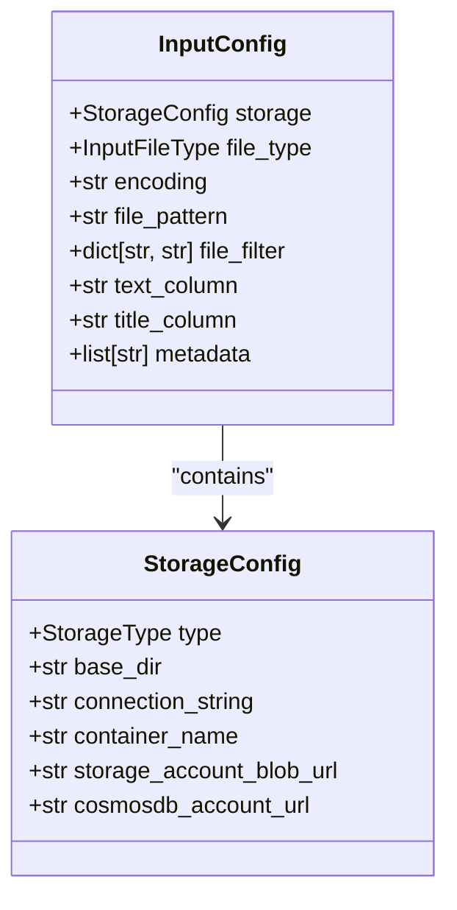
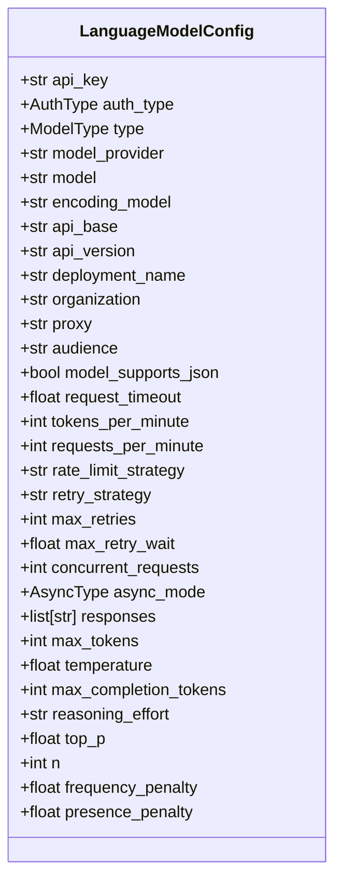
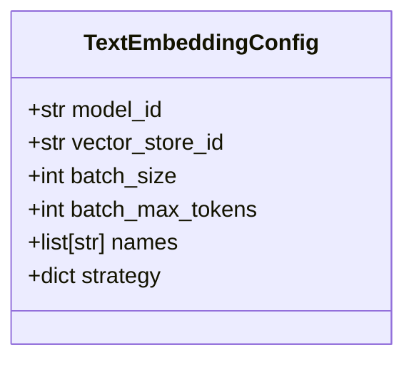
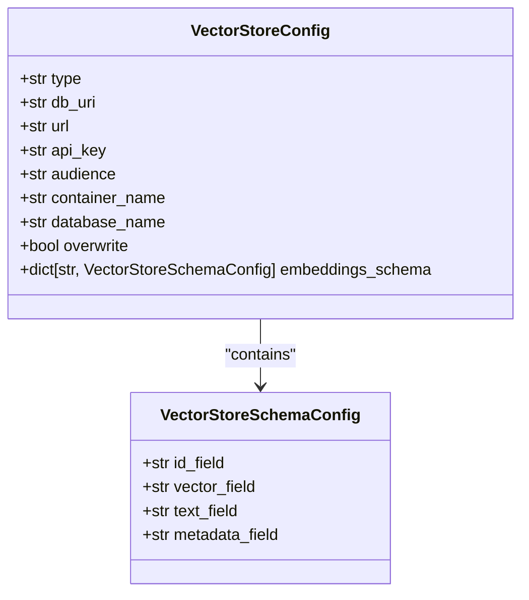
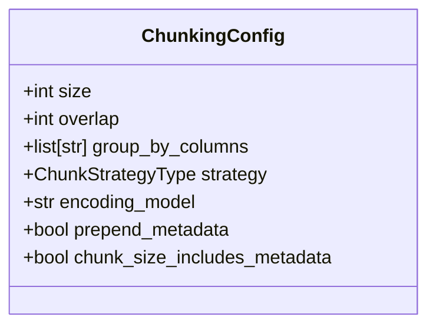
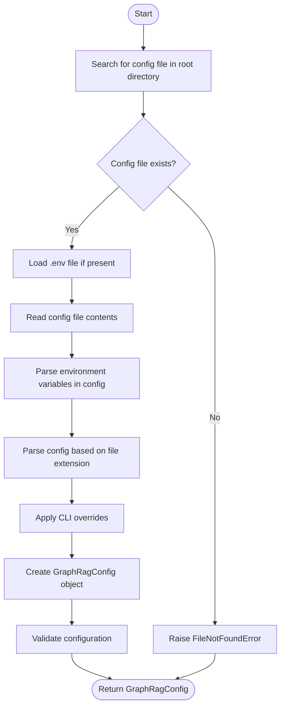
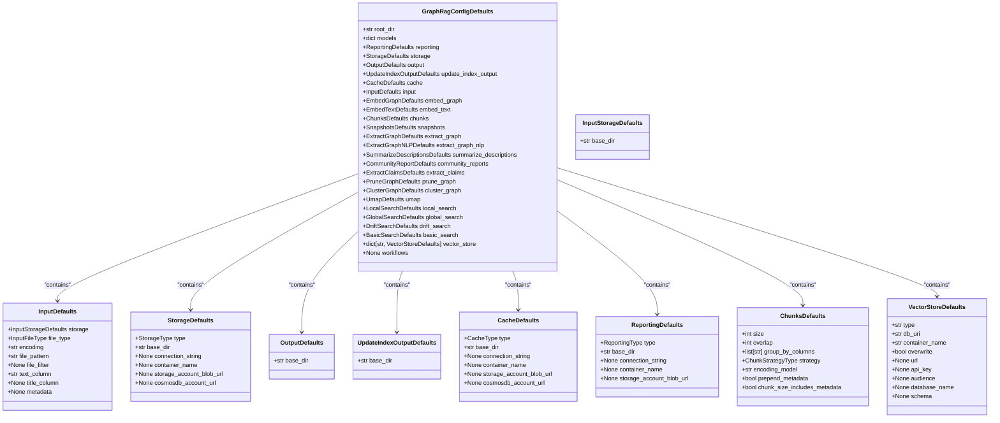
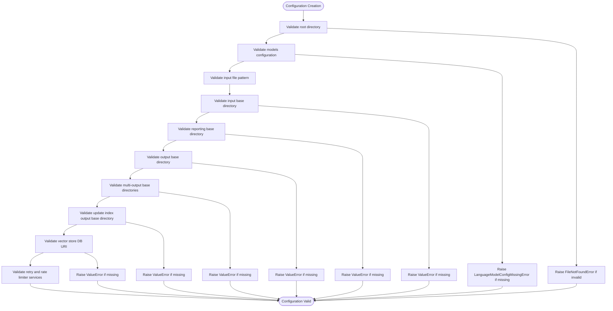

# Core Configuration

<cite>
**Referenced Files in This Document**   
- [graph_rag_config.py](file://graphrag/config/models/graph_rag_config.py)
- [load_config.py](file://graphrag/config/load_config.py)
- [defaults.py](file://graphrag/config/defaults.py)
- [settings.yaml](file://tests/unit/config/fixtures/minimal_config/settings.yaml)
- [create_graphrag_config.py](file://graphrag/config/create_graphrag_config.py)
- [input_config.py](file://graphrag/config/models/input_config.py)
- [language_model_config.py](file://graphrag/config/models/language_model_config.py)
- [text_embedding_config.py](file://graphrag/config/models/text_embedding_config.py)
- [vector_store_config.py](file://graphrag/config/models/vector_store_config.py)
- [chunking_config.py](file://graphrag/config/models/chunking_config.py)
- [storage_config.py](file://graphrag/config/models/storage_config.py)
- [environment_reader.py](file://graphrag/config/environment_reader.py)
- [enums.py](file://graphrag/config/enums.py)
</cite>

## Table of Contents
1. [Introduction](#introduction)
2. [Configuration Schema Overview](#configuration-schema-overview)
3. [Configuration Loading Process](#configuration-loading-process)
4. [Default Values and Fallback Mechanism](#default-values-and-fallback-mechanism)
5. [Minimal Configuration Example](#minimal-configuration-example)
6. [Configuration Validation and Error Handling](#configuration-validation-and-error-handling)
7. [Environment Variable Integration](#environment-variable-integration)

## Introduction

The GraphRAG configuration system provides a comprehensive framework for defining and managing the parameters that control the behavior of the GraphRAG pipeline. This document details the core configuration model defined in `graph_rag_config.py`, which serves as the foundation for all GraphRAG operations. The configuration system is designed to be flexible, allowing users to customize various aspects of the pipeline including input processing, language model usage, embedding generation, graph construction, and output management.

The configuration is structured as a hierarchical model with multiple interconnected components that work together to form a complete pipeline configuration. The system supports multiple configuration sources including YAML, JSON, and environment variables, providing flexibility in how configuration values are specified and managed. This document will explore the structure of the configuration schema, the process of loading and resolving configuration values, the default values provided by the system, and the validation mechanisms that ensure configuration integrity.

**Section sources**
- [graph_rag_config.py](file://graphrag/config/models/graph_rag_config.py#L1-L417)
- [load_config.py](file://graphrag/config/load_config.py#L1-L192)

## Configuration Schema Overview

The GraphRAG configuration schema is defined by the `GraphRagConfig` class, which serves as the root configuration object containing all configuration sections. The schema is organized into several key components that correspond to different stages and aspects of the GraphRAG pipeline.

### Top-Level Configuration Structure

The top-level configuration consists of the following main sections:

- **input**: Configuration for input data sources and processing
- **llm**: Language model configurations (referred to as "models" in the schema)
- **embeddings**: Text embedding configurations
- **vector_store**: Vector store configurations for storing and retrieving embeddings
- **chunks**: Text chunking configurations for processing input documents
- **graph**: Graph construction and processing configurations
- **communities**: Community detection and reporting configurations
- **reports**: Report generation configurations

```mermaid
classDiagram
class GraphRagConfig {
+str root_dir
+dict[str, LanguageModelConfig] models
+InputConfig input
+ChunkingConfig chunks
+StorageConfig output
+StorageConfig update_index_output
+CacheConfig cache
+ReportingConfig reporting
+dict[str, VectorStoreConfig] vector_store
+TextEmbeddingConfig embed_text
+ExtractGraphConfig extract_graph
+SummarizeDescriptionsConfig summarize_descriptions
+ExtractGraphNLPConfig extract_graph_nlp
+PruneGraphConfig prune_graph
+ClusterGraphConfig cluster_graph
+ClaimExtractionConfig extract_claims
+CommunityReportsConfig community_reports
+EmbedGraphConfig embed_graph
+UmapConfig umap
+SnapshotsConfig snapshots
+LocalSearchConfig local_search
+GlobalSearchConfig global_search
+DRIFTSearchConfig drift_search
+BasicSearchConfig basic_search
}
GraphRagConfig --> InputConfig : "contains"
GraphRagConfig --> ChunkingConfig : "contains"
GraphRagConfig --> StorageConfig : "contains"
GraphRagConfig --> CacheConfig : "contains"
GraphRagConfig --> ReportingConfig : "contains"
GraphRagConfig --> VectorStoreConfig : "contains"
GraphRagConfig --> TextEmbeddingConfig : "contains"
GraphRagConfig --> ExtractGraphConfig : "contains"
GraphRagConfig --> SummarizeDescriptionsConfig : "contains"
GraphRagConfig --> ExtractGraphNLPConfig : "contains"
GraphRagConfig --> PruneGraphConfig : "contains"
GraphRagConfig --> ClusterGraphConfig : "contains"
GraphRagConfig --> ClaimExtractionConfig : "contains"
GraphRagConfig --> CommunityReportsConfig : "contains"
GraphRagConfig --> EmbedGraphConfig : "contains"
GraphRagConfig --> UmapConfig : "contains"
GraphRagConfig --> SnapshotsConfig : "contains"
GraphRagConfig --> LocalSearchConfig : "contains"
GraphRagConfig --> GlobalSearchConfig : "contains"
GraphRagConfig --> DRIFTSearchConfig : "contains"
GraphRagConfig --> BasicSearchConfig : "contains"
```



**Diagram sources**
- [graph_rag_config.py](file://graphrag/config/models/graph_rag_config.py#L48-L417)

### Input Configuration

The input configuration section controls how input data is read and processed. It includes settings for:

- **storage**: Storage configuration for input files, including type (file, blob, cosmosdb) and base directory
- **file_type**: Input file type (text, csv, json)
- **encoding**: File encoding (default: utf-8)
- **file_pattern**: Regular expression pattern for matching input files
- **file_filter**: Optional filter for input files
- **text_column**: Column name containing text content
- **title_column**: Column name containing document titles
- **metadata**: List of columns to include as document metadata



**Diagram sources**
- [input_config.py](file://graphrag/config/models/input_config.py#L14-L51)
- [storage_config.py](file://graphrag/config/models/storage_config.py#L14-L53)

### Language Model Configuration

The language model configuration (referred to as "models" in the schema) defines the settings for LLMs used throughout the pipeline. Each model configuration includes:

- **api_key**: API key for authentication
- **auth_type**: Authentication type (APIKey, AzureManagedIdentity)
- **type**: Model type (Chat, Embedding, AzureOpenAIChat, etc.)
- **model_provider**: Provider (openai, azure, etc.)
- **model**: Specific model name
- **encoding_model**: Token encoding model
- **api_base**: API base URL (for Azure)
- **api_version**: API version (for Azure)
- **deployment_name**: Deployment name (for Azure)
- **organization**: Organization identifier
- **proxy**: Proxy server
- **audience**: Azure resource URI for managed identity
- **model_supports_json**: Whether the model supports JSON output
- **request_timeout**: Request timeout in seconds
- **tokens_per_minute**: Rate limiting for tokens per minute
- **requests_per_minute**: Rate limiting for requests per minute
- **rate_limit_strategy**: Rate limiting strategy
- **retry_strategy**: Retry strategy
- **max_retries**: Maximum number of retries
- **max_retry_wait**: Maximum wait time between retries
- **concurrent_requests**: Number of concurrent requests
- **async_mode**: Asynchronous mode (asyncio, threaded)
- **responses**: Static responses for mock mode
- **max_tokens**: Maximum tokens to generate
- **temperature**: Generation temperature
- **max_completion_tokens**: Maximum completion tokens
- **reasoning_effort**: Reasoning effort level
- **top_p**: Top-p sampling value
- **n**: Number of completions to generate
- **frequency_penalty**: Frequency penalty
- **presence_penalty**: Presence penalty



**Diagram sources**
- [language_model_config.py](file://graphrag/config/models/language_model_config.py#L25-L404)

### Text Embedding Configuration

The text embedding configuration controls how text embeddings are generated and stored:

- **model_id**: ID of the language model to use for embeddings
- **vector_store_id**: ID of the vector store to use for embeddings
- **batch_size**: Batch size for embedding generation
- **batch_max_tokens**: Maximum tokens per batch
- **names**: List of specific embeddings to perform
- **strategy**: Override strategy for embedding generation



**Diagram sources**
- [text_embedding_config.py](file://graphrag/config/models/text_embedding_config.py#L12-L53)

### Vector Store Configuration

The vector store configuration defines the settings for vector databases used to store embeddings:

- **type**: Vector store type (lancedb, azure_ai_search, cosmosdb)
- **db_uri**: Database URI (for LanceDB)
- **url**: Database URL (for Azure AI Search or CosmosDB)
- **api_key**: Database API key (for Azure AI Search)
- **audience**: Database audience (for Azure AI Search)
- **container_name**: Container name
- **database_name**: Database name (for CosmosDB)
- **overwrite**: Whether to overwrite existing data
- **embeddings_schema**: Schema configuration for embeddings



**Diagram sources**
- [vector_store_config.py](file://graphrag/config/models/vector_store_config.py#L14-L112)

### Chunking Configuration

The chunking configuration controls how input text is divided into smaller segments:

- **size**: Chunk size in tokens
- **overlap**: Overlap between chunks in tokens
- **group_by_columns**: Columns to group chunks by
- **strategy**: Chunking strategy (tokens, sentence)
- **encoding_model**: Token encoding model
- **prepend_metadata**: Whether to prepend metadata to chunks
- **chunk_size_includes_metadata**: Whether metadata is counted in chunk size



**Diagram sources**
- [chunking_config.py](file://graphrag/config/models/chunking_config.py#L12-L43)

## Configuration Loading Process

The configuration loading process is handled by the `load_config` function in `load_config.py`, which orchestrates the resolution of configuration values from multiple sources. The process follows a specific sequence to ensure that configuration values are properly resolved and validated.

### Configuration Loading Workflow



**Diagram sources**
- [load_config.py](file://graphrag/config/load_config.py#L146-L191)

### Configuration Source Resolution

The configuration system supports multiple sources for configuration values, which are resolved in a specific order of precedence:

1. **CLI Overrides**: Highest precedence, applied last
2. **Configuration File**: YAML, JSON, or other supported formats
3. **Environment Variables**: Referenced in configuration files using ${VAR_NAME} syntax
4. **Default Values**: Provided by the system when no other value is specified

The `load_config` function follows these steps to resolve configuration values:

1. **Locate Configuration File**: Searches for a configuration file in the root directory using the default names `settings.yaml`, `settings.yml`, or `settings.json`
2. **Load Environment Variables**: Loads environment variables from a `.env` file in the same directory as the configuration file
3. **Read Configuration Contents**: Reads the raw contents of the configuration file
4. **Parse Environment Variables**: Substitutes environment variable references in the configuration text using Python's `Template` class
5. **Parse Configuration Format**: Parses the configuration based on its file extension (YAML, JSON)
6. **Apply CLI Overrides**: Applies any command-line interface overrides to the configuration
7. **Create Configuration Object**: Creates a `GraphRagConfig` object from the resolved configuration values

### Configuration File Search

The system searches for configuration files in the root directory using the following default file names in order:

- `settings.yaml`
- `settings.yml`
- `settings.json`

If a specific configuration file path is provided, that file is used instead. If no configuration file is found, a `FileNotFoundError` is raised.

### Environment Variable Processing

Environment variables in the configuration file are specified using the syntax `${VARIABLE_NAME}`. When the configuration file is read, these references are replaced with the actual values from the environment. If an environment variable is not found, a `KeyError` is raised.

The system also supports loading environment variables from a `.env` file located in the same directory as the configuration file. This allows sensitive values like API keys to be kept separate from the main configuration file.

**Section sources**
- [load_config.py](file://graphrag/config/load_config.py#L146-L191)
- [environment_reader.py](file://graphrag/config/environment_reader.py#L1-L156)

## Default Values and Fallback Mechanism

The GraphRAG configuration system provides a comprehensive set of default values through the `defaults.py` module. These defaults serve as fallback values when specific configuration options are not explicitly set by the user.

### Default Values Structure

The default values are organized into dataclasses that mirror the structure of the configuration schema. The main default values container is `GraphRagConfigDefaults`, which contains default values for all configuration sections.



**Diagram sources**
- [defaults.py](file://graphrag/config/defaults.py#L376-L480)

### Key Default Values

The system defines several key default values that are used throughout the configuration:

- **DEFAULT_OUTPUT_BASE_DIR**: "output" - Default base directory for output
- **DEFAULT_CHAT_MODEL_ID**: "default_chat_model" - ID for the default chat model
- **DEFAULT_CHAT_MODEL**: "gpt-4-turbo-preview" - Default chat model name
- **DEFAULT_EMBEDDING_MODEL_ID**: "default_embedding_model" - ID for the default embedding model
- **DEFAULT_EMBEDDING_MODEL**: "text-embedding-3-small" - Default embedding model name
- **DEFAULT_MODEL_PROVIDER**: "openai" - Default model provider
- **DEFAULT_VECTOR_STORE_ID**: "default_vector_store" - ID for the default vector store
- **ENCODING_MODEL**: "cl100k_base" - Default token encoding model

### Fallback Mechanism

The fallback mechanism works by providing default values at multiple levels:

1. **Field Level**: Each configuration field has a default value specified in its definition
2. **Section Level**: Each configuration section has a default instance with predefined values
3. **Root Level**: The `GraphRagConfig` class has default values for all sections

When a configuration value is not explicitly set, the system falls back to these default values in the following order:

1. If a value is not provided in the configuration file, the field's default value is used
2. If a section is not provided in the configuration file, the default section instance is used
3. If the entire configuration is empty, the default values from `GraphRagConfigDefaults` are applied

This hierarchical fallback mechanism ensures that the system can operate with minimal configuration while still allowing for extensive customization when needed.

**Section sources**
- [defaults.py](file://graphrag/config/defaults.py#L1-L481)
- [graph_rag_config.py](file://graphrag/config/models/graph_rag_config.py#L436-L480)

## Minimal Configuration Example

A minimal configuration file demonstrates the essential components needed to run the GraphRAG pipeline. The following example shows a basic `settings.yaml` file that configures the system with the minimum required settings.

### Minimal Configuration File

```yaml
models:
  default_chat_model:
    api_key: ${CUSTOM_API_KEY}
    type: chat
    model_provider: openai
    model: gpt-4-turbo-preview
  default_embedding_model:
    api_key: ${CUSTOM_API_KEY}
    type: embedding
    model_provider: openai
    model: text-embedding-3-small
```

**Section sources**
- [settings.yaml](file://tests/unit/config/fixtures/minimal_config/settings.yaml#L1-L11)

### Field Purpose Explanation

- **models**: Root section containing all language model configurations
  - **default_chat_model**: Configuration for the default chat model used for text generation
    - **api_key**: Reference to an environment variable containing the API key for authentication
    - **type**: Specifies that this is a chat model (as opposed to an embedding model)
    - **model_provider**: Indicates that OpenAI is the provider for this model
    - **model**: Specifies the specific model to use (gpt-4-turbo-preview)
  - **default_embedding_model**: Configuration for the default embedding model used for text embeddings
    - **api_key**: Reference to an environment variable containing the API key for authentication
    - **type**: Specifies that this is an embedding model (as opposed to a chat model)
    - **model_provider**: Indicates that OpenAI is the provider for this model
    - **model**: Specifies the specific model to use (text-embedding-3-small)

This minimal configuration relies heavily on default values for other sections like input, output, and vector store. The system will use the default values defined in `defaults.py` for these sections, which are sufficient for basic operation.

The use of environment variables (referenced with ${VAR_NAME} syntax) for API keys is a security best practice, keeping sensitive credentials out of the configuration file itself.

## Configuration Validation and Error Handling

The GraphRAG configuration system includes comprehensive validation to ensure that configuration values are correct and complete. Validation occurs at multiple levels and catches various types of configuration errors.

### Validation Process

The validation process is implemented through Pydantic's model validator system and custom validation methods. When a `GraphRagConfig` object is created, the `@model_validator(mode="after")` decorator triggers a series of validation methods that check the configuration for correctness.



**Diagram sources**
- [graph_rag_config.py](file://graphrag/config/models/graph_rag_config.py#L403-L416)

### Common Configuration Errors

The system detects and reports several common configuration errors:

1. **Missing Root Directory**: The root directory must be a valid directory path
2. **Missing Required Models**: Both `default_chat_model` and `default_embedding_model` must be defined
3. **Invalid Retry Strategy**: The retry strategy must be one of the registered strategies
4. **Invalid Rate Limiter Strategy**: The rate limiter strategy must be one of the registered strategies
5. **Missing Input Storage Base Directory**: Required for file input storage
6. **Missing Output Base Directory**: Required for file output
7. **Missing Reporting Base Directory**: Required for file reporting
8. **Missing Update Index Output Base Directory**: Required for file output
9. **Missing Vector Store URI**: Required for LanceDB
10. **Conflicting Settings**: Such as providing an API key when using Azure Managed Identity
11. **Missing Azure Settings**: API base, API version, or deployment name when using Azure
12. **Invalid Model Type**: Model type must be one of the supported types
13. **Missing Model Provider**: Required when using certain model types
14. **Invalid Tokens Per Minute**: Must be a positive number
15. **Invalid Requests Per Minute**: Must be a positive number
16. **Invalid Maximum Retries**: Must be greater than or equal to 1

### Error Handling

When a validation error is detected, the system raises an appropriate exception with a descriptive error message. The error messages are designed to be helpful, often including suggestions for how to fix the issue.

For example:
- If the root directory is not a valid directory, a `FileNotFoundError` is raised with a message indicating the invalid path
- If a required model is missing, a `LanguageModelConfigMissingError` is raised with the missing model ID
- If an input storage base directory is missing, a `ValueError` is raised with instructions to rerun `graphrag init`

The system also includes specific error types for different categories of errors:
- `LanguageModelConfigMissingError`: When a required language model configuration is missing
- `ApiKeyMissingError`: When an API key is required but not provided
- `AzureApiBaseMissingError`: When the Azure API base is required but not provided
- `AzureApiVersionMissingError`: When the Azure API version is required but not provided
- `ConflictingSettingsError`: When settings conflict with each other

These specific error types allow for more precise error handling and better user feedback.

**Section sources**
- [graph_rag_config.py](file://graphrag/config/models/graph_rag_config.py#L64-L416)
- [language_model_config.py](file://graphrag/config/models/language_model_config.py#L33-L403)
- [errors.py](file://graphrag/config/errors.py)

## Environment Variable Integration

The GraphRAG configuration system provides robust integration with environment variables, allowing sensitive values and deployment-specific settings to be managed externally from the configuration files.

### Environment Variable Syntax

Environment variables are referenced in configuration files using the syntax `${VARIABLE_NAME}`. This follows Python's `string.Template` syntax, which is processed during the configuration loading process.

For example:
```yaml
models:
  default_chat_model:
    api_key: ${OPENAI_API_KEY}
    type: chat
    model_provider: openai
    model: gpt-4-turbo-preview
```

### Environment Variable Processing

The environment variable processing occurs in the `_parse_env_variables` function in `load_config.py`:

```python
def _parse_env_variables(text: str) -> str:
    """Parse environment variables in the configuration text."""
    return Template(text).substitute(os.environ)
```

This function takes the raw configuration text and substitutes any environment variable references with their actual values from the `os.environ` dictionary.

### .env File Support

The system also supports loading environment variables from a `.env` file located in the same directory as the configuration file. This is handled by the `_load_dotenv` function:

```python
def _load_dotenv(config_path: Path | str) -> None:
    """Load the .env file if it exists in the same directory as the config file."""
    config_path = Path(config_path)
    dotenv_path = config_path.parent / ".env"
    if dotenv_path.exists():
        load_dotenv(dotenv_path)
```

This allows users to keep environment variables in a separate file that can be excluded from version control.

### Error Handling for Missing Variables

If an environment variable referenced in the configuration file does not exist, a `KeyError` is raised with a message indicating the missing variable. This prevents the system from running with incomplete or incorrect configuration.

For example, if the configuration references `${SOME_NON_EXISTENT_ENV_VAR}` but this variable is not defined in the environment, the configuration loading will fail with a `KeyError`.

### Environment Reader Utility

The system includes an `EnvironmentReader` class in `environment_reader.py` that provides additional utilities for reading configuration values from environment variables. This class supports:
- Reading string, integer, boolean, float, and list values
- Using multiple environment variable names as fallbacks
- Applying prefixes to environment variable names
- Reading values from the current configuration section as higher precedence than environment variables

This utility class is used internally by the configuration system to provide flexible and robust environment variable integration.

**Section sources**
- [load_config.py](file://graphrag/config/load_config.py#L49-L67)
- [environment_reader.py](file://graphrag/config/environment_reader.py#L1-L156)
- [settings.yaml](file://tests/unit/config/fixtures/minimal_config_missing_env_var/settings.yaml#L1-L11)