# Indexing Configuration

<cite>
**Referenced Files in This Document**   
- [chunking_config.py](file://graphrag/config/models/chunking_config.py)
- [extract_graph_config.py](file://graphrag/config/models/extract_graph_config.py)
- [cluster_graph_config.py](file://graphrag/config/models/cluster_graph_config.py)
- [community_reports_config.py](file://graphrag/config/models/community_reports_config.py)
- [text_embedding_config.py](file://graphrag/config/models/text_embedding_config.py)
- [prune_graph_config.py](file://graphrag/config/models/prune_graph_config.py)
- [umap_config.py](file://graphrag/config/models/umap_config.py)
- [snapshots_config.py](file://graphrag/config/models/snapshots_config.py)
- [language_model_config.py](file://graphrag/config/models/language_model_config.py)
- [defaults.py](file://graphrag/config/defaults.py)
- [graph_rag_config.py](file://graphrag/config/models/graph_rag_config.py)
- [create_base_text_units.py](file://graphrag/index/workflows/create_base_text_units.py)
- [extract_graph.py](file://graphrag/index/workflows/extract_graph.py)
- [create_communities.py](file://graphrag/index/workflows/create_communities.py)
</cite>

## Table of Contents
1. [Introduction](#introduction)
2. [Chunking Configuration](#chunking-configuration)
3. [Entity Extraction Configuration](#entity-extraction-configuration)
4. [Community Detection Configuration](#community-detection-configuration)
5. [Community Report Generation Configuration](#community-report-generation-configuration)
6. [Text Embedding Configuration](#text-embedding-configuration)
7. [Graph Pruning Configuration](#graph-pruning-configuration)
8. [Graph Layout Configuration](#graph-layout-configuration)
9. [Output Snapshots Configuration](#output-snapshots-configuration)
10. [Language Model Configuration](#language-model-configuration)
11. [Configuration Interplay and Workflow](#configuration-interplay-and-workflow)
12. [Troubleshooting Common Issues](#troubleshooting-common-issues)
13. [Conclusion](#conclusion)

## Introduction

The GraphRAG indexing pipeline is a sophisticated system for transforming raw text documents into structured knowledge graphs. This documentation provides comprehensive coverage of the configuration models that control this indexing process. Each configuration model plays a critical role in shaping the quality, structure, and usability of the final knowledge graph.

The indexing pipeline follows a sequential workflow where documents are first chunked into manageable pieces, then entities and relationships are extracted, the graph is pruned and clustered into communities, community reports are generated, and finally embeddings are created for retrieval. Each step is controlled by specific configuration parameters that allow fine-tuning of the process to meet specific requirements.

This document covers all major configuration models: `ChunkingConfig` for text splitting strategies, `ExtractGraphConfig` for entity/relationship extraction parameters, `ClusterGraphConfig` for community detection settings, `CommunityReportsConfig` for report generation prompts and LLM settings, `TextEmbeddingConfig` for embedding generation parameters, `PruneGraphConfig` for graph pruning thresholds, `UmapConfig` for graph layout dimensions, and `SnapshotsConfig` for output format options. Understanding these configurations is essential for optimizing the indexing process and achieving high-quality knowledge graphs.

**Section sources**
- [graph_rag_config.py](file://graphrag/config/models/graph_rag_config.py#L48-L417)

## Chunking Configuration

The `ChunkingConfig` controls how input documents are split into smaller text units for processing. This is a critical first step in the indexing pipeline as it determines the context window available for entity extraction and affects both the quality of the knowledge graph and processing efficiency.

The configuration includes several key parameters:
- `size`: The number of tokens per chunk (default: 1200)
- `overlap`: The number of overlapping tokens between adjacent chunks (default: 100)
- `strategy`: The chunking strategy to use (tokens or sentence)
- `encoding_model`: The tokenizer model to use for token counting
- `prepend_metadata`: Whether to include document metadata in each chunk
- `chunk_size_includes_metadata`: Whether metadata tokens count toward the chunk size limit

The chunk size parameter is particularly important as it balances context availability with processing constraints. Larger chunks provide more context for entity extraction but may exceed LLM token limits. The overlap parameter helps preserve context across chunk boundaries, ensuring that entities near chunk edges are not fragmented.

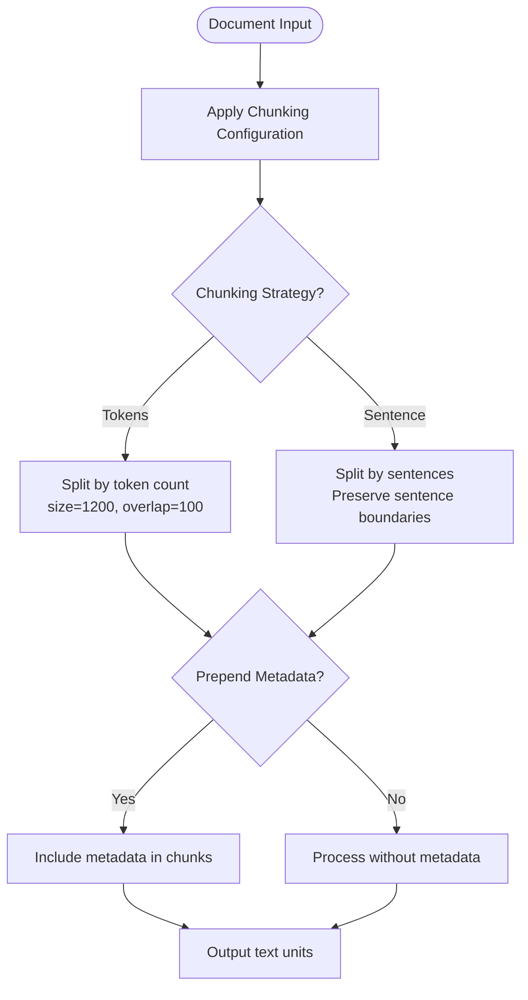

**Diagram sources**
- [chunking_config.py](file://graphrag/config/models/chunking_config.py#L12-L43)
- [create_base_text_units.py](file://graphrag/index/workflows/create_base_text_units.py#L25-L164)

**Section sources**
- [chunking_config.py](file://graphrag/config/models/chunking_config.py#L12-L43)
- [create_base_text_units.py](file://graphrag/index/workflows/create_base_text_units.py#L25-L164)
- [defaults.py](file://graphrag/config/defaults.py#L99-L109)

## Entity Extraction Configuration

The `ExtractGraphConfig` governs the entity and relationship extraction process, which is fundamental to building the knowledge graph. This configuration determines how the system identifies and extracts entities such as organizations, people, locations, and events from the text.

Key parameters include:
- `model_id`: The LLM model to use for extraction
- `prompt`: The extraction prompt template (optional, defaults to built-in prompt)
- `entity_types`: The types of entities to extract (default: organization, person, geo, event)
- `max_gleanings`: The maximum number of refinement iterations for extraction
- `strategy`: Override for the default extraction strategy

The entity extraction process uses a graph intelligence strategy by default, which leverages the specified LLM to identify entities and relationships in the text chunks. The `entity_types` parameter allows customization of what kinds of entities are extracted, enabling domain-specific knowledge graph construction. For example, in a medical domain, entity types might include "disease", "symptom", "treatment", while in a financial domain they might include "company", "stock", "financial instrument".

The `max_gleanings` parameter controls how many times the system will revisit the text to extract additional entities, allowing for progressive refinement of the knowledge graph. Higher values can improve recall but increase processing time and cost.

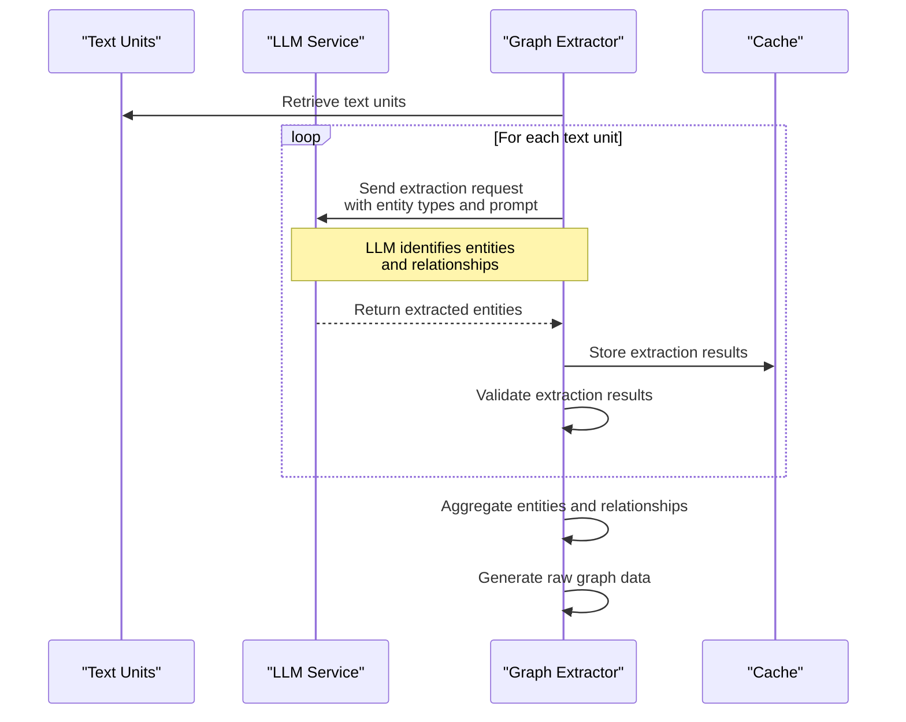

**Diagram sources**
- [extract_graph_config.py](file://graphrag/config/models/extract_graph_config.py#L14-L56)
- [extract_graph.py](file://graphrag/index/workflows/extract_graph.py#L28-L165)

**Section sources**
- [extract_graph_config.py](file://graphrag/config/models/extract_graph_config.py#L14-L56)
- [extract_graph.py](file://graphrag/index/workflows/extract_graph.py#L28-L165)
- [defaults.py](file://graphrag/config/defaults.py#L203-L213)

## Community Detection Configuration

The `ClusterGraphConfig` controls the community detection process, which groups related entities into meaningful clusters or communities. This hierarchical clustering is essential for organizing the knowledge graph into coherent topics and enabling multi-level analysis.

The configuration includes:
- `max_cluster_size`: The maximum number of nodes per cluster (default: 10)
- `use_lcc`: Whether to use only the largest connected component (default: True)
- `seed`: Random seed for reproducible clustering (default: 0xDEADBEEF)

Community detection works by analyzing the graph structure to identify densely connected subgraphs. The `max_cluster_size` parameter prevents communities from becoming too large and unwieldy, ensuring that each community represents a focused topic. The algorithm creates a hierarchy of communities at different levels of granularity.

The `use_lcc` parameter ensures that only the largest connected component of the graph is used for clustering, which helps eliminate isolated nodes and small disconnected components that might represent noise or irrelevant information. This results in a more coherent and meaningful community structure.

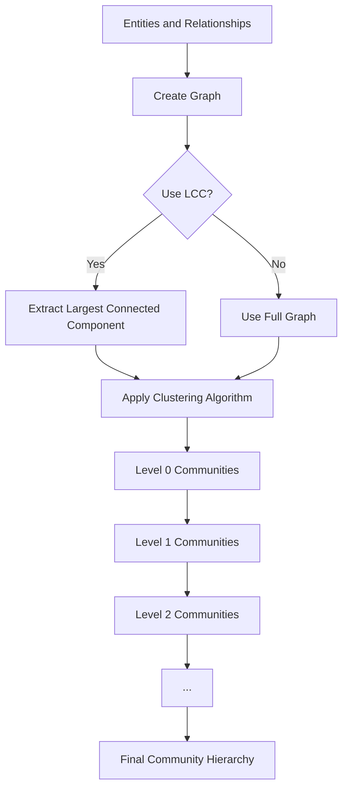

**Diagram sources**
- [cluster_graph_config.py](file://graphrag/config/models/cluster_graph_config.py#L11-L26)
- [create_communities.py](file://graphrag/index/workflows/create_communities.py#L25-L157)

**Section sources**
- [cluster_graph_config.py](file://graphrag/config/models/cluster_graph_config.py#L11-L26)
- [create_communities.py](file://graphrag/index/workflows/create_communities.py#L25-L157)
- [defaults.py](file://graphrag/config/defaults.py#L112-L118)

## Community Report Generation Configuration

The `CommunityReportsConfig` controls the generation of natural language summaries for each detected community. These reports transform the structural graph data into human-readable narratives that capture the essence of each community.

Key parameters include:
- `model_id`: The LLM model to use for report generation
- `graph_prompt`: The prompt template for graph-based summarization
- `text_prompt`: The prompt template for text-based summarization
- `max_length`: Maximum length of reports in tokens (default: 2000)
- `max_input_length`: Maximum input length for report generation (default: 8000)

The report generation process uses both graph structure and source text to create comprehensive summaries. The system can use either graph-based prompts that focus on entity relationships or text-based prompts that emphasize content from the original documents. The `max_length` parameter ensures reports are concise while still informative, while `max_input_length` prevents excessive context from being sent to the LLM.

These community reports serve as high-level overviews that enable users to quickly understand the content of each community without examining individual entities and relationships. They are particularly valuable for downstream querying, as they provide a natural language interface to the structured knowledge graph.

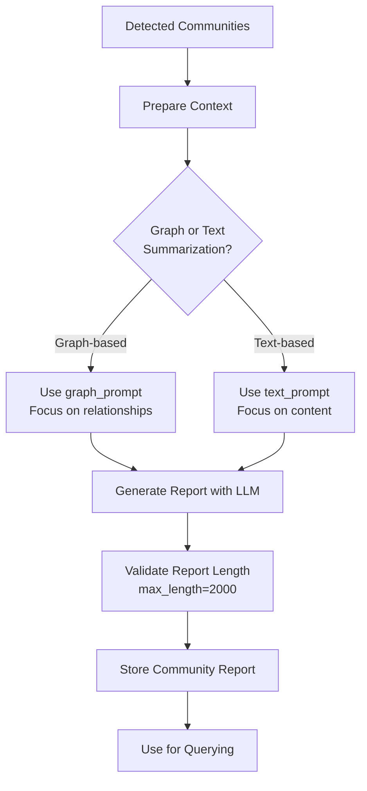

**Diagram sources**
- [community_reports_config.py](file://graphrag/config/models/community_reports_config.py#L14-L66)
- [create_communities.py](file://graphrag/index/workflows/create_communities.py#L25-L157)

**Section sources**
- [community_reports_config.py](file://graphrag/config/models/community_reports_config.py#L14-L66)
- [defaults.py](file://graphrag/config/defaults.py#L121-L130)

## Text Embedding Configuration

The `TextEmbeddingConfig` controls the generation of vector embeddings for text units, which enables semantic search and retrieval capabilities. These embeddings transform text into numerical representations that capture semantic meaning.

The configuration includes:
- `model_id`: The embedding model to use (default: text-embedding-3-small)
- `vector_store_id`: The vector store to use for storage
- `batch_size`: Number of texts to process in each batch (default: 16)
- `batch_max_tokens`: Maximum tokens per batch (default: 8191)
- `names`: Specific embeddings to perform
- `strategy`: Override for the default embedding strategy

The embedding process converts text units into high-dimensional vectors that can be used for similarity search. The `batch_size` and `batch_max_tokens` parameters optimize processing efficiency by controlling how many texts are sent to the embedding model simultaneously. Larger batches improve throughput but require more memory.

The choice of embedding model significantly impacts retrieval quality. Modern models like text-embedding-3-small provide high-quality embeddings with good performance characteristics. The vector store configuration determines where these embeddings are stored and how they are accessed during querying.

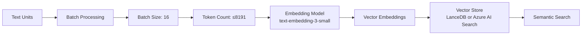

**Diagram sources**
- [text_embedding_config.py](file://graphrag/config/models/text_embedding_config.py#L12-L53)
- [create_base_text_units.py](file://graphrag/index/workflows/create_base_text_units.py#L25-L164)

**Section sources**
- [text_embedding_config.py](file://graphrag/config/models/text_embedding_config.py#L12-L53)
- [defaults.py](file://graphrag/config/defaults.py#L176-L186)

## Graph Pruning Configuration

The `PruneGraphConfig` controls the graph pruning process, which removes low-quality or irrelevant elements from the knowledge graph to improve its signal-to-noise ratio. This step is crucial for maintaining a high-quality, focused knowledge graph.

The configuration includes several filtering thresholds:
- `min_node_freq`: Minimum frequency for nodes to be retained (default: 2)
- `max_node_freq_std`: Maximum standard deviation of node frequency
- `min_node_degree`: Minimum degree (connections) for nodes (default: 1)
- `max_node_degree_std`: Maximum standard deviation of node degree
- `min_edge_weight_pct`: Minimum edge weight percentile (default: 40%)
- `remove_ego_nodes`: Whether to remove ego nodes (default: True)
- `lcc_only`: Whether to keep only the largest connected component (default: False)

These parameters work together to eliminate noise and focus on the most significant entities and relationships. For example, nodes that appear only once (`min_node_freq=2`) are likely to be noise and are removed. Similarly, edges below the 40th percentile of weight are considered weak connections and are pruned.

The pruning process helps prevent the knowledge graph from becoming overly dense and difficult to navigate, while preserving the most important structural relationships. This results in a cleaner, more interpretable graph that performs better in downstream querying tasks.

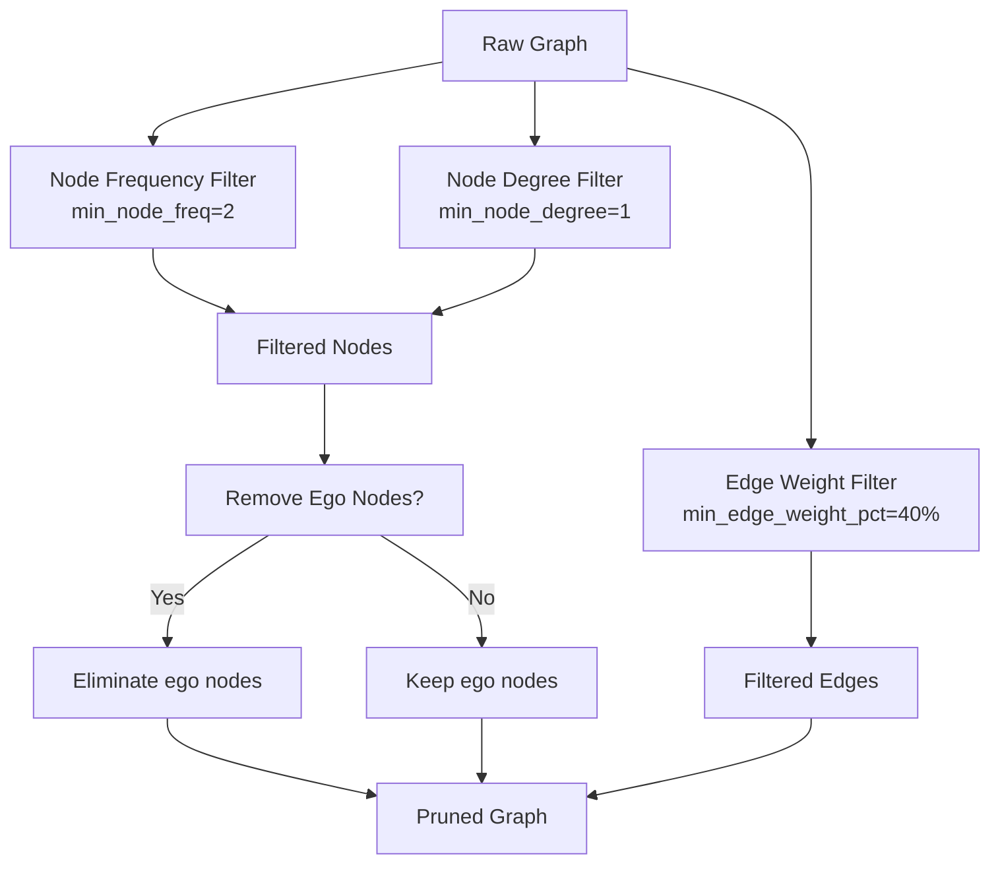

**Diagram sources**
- [prune_graph_config.py](file://graphrag/config/models/prune_graph_config.py#L11-L42)

**Section sources**
- [prune_graph_config.py](file://graphrag/config/models/prune_graph_config.py#L11-L42)
- [defaults.py](file://graphrag/config/defaults.py#L363-L373)

## Graph Layout Configuration

The `UmapConfig` controls the UMAP (Uniform Manifold Approximation and Projection) dimensionality reduction for graph layout visualization. This configuration determines whether UMAP is used to create 2D or 3D representations of the knowledge graph for visualization purposes.

The configuration has a single parameter:
- `enabled`: Boolean flag indicating whether UMAP should be enabled (default: False)

When enabled, UMAP creates a low-dimensional representation of the graph that preserves the topological structure, allowing for meaningful visualizations where similar communities appear close together. This is particularly useful for exploratory analysis and presenting the knowledge graph structure to stakeholders.

UMAP works by reducing the high-dimensional embedding space to 2D or 3D coordinates that can be plotted. The algorithm preserves both local and global structure, meaning that closely related entities remain close in the visualization while maintaining the overall shape of the data manifold.

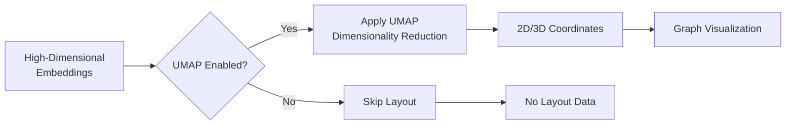

**Diagram sources**
- [umap_config.py](file://graphrag/config/models/umap_config.py#L11-L18)

**Section sources**
- [umap_config.py](file://graphrag/config/models/umap_config.py#L11-L18)
- [defaults.py](file://graphrag/config/defaults.py#L407-L411)

## Output Snapshots Configuration

The `SnapshotsConfig` controls the generation of intermediate output files during the indexing process. These snapshots provide visibility into the pipeline's progress and enable debugging and analysis of specific stages.

The configuration includes three boolean flags:
- `embeddings`: Whether to save snapshots of generated embeddings (default: False)
- `graphml`: Whether to save snapshots in GraphML format (default: False)
- `raw_graph`: Whether to save snapshots of the raw extracted graph before merging (default: False)

These snapshots are valuable for troubleshooting and quality assurance. The raw graph snapshot allows inspection of entity and relationship extraction results before any merging or deduplication. The GraphML format provides a standard interchange format that can be loaded into various graph visualization tools. Embedding snapshots enable analysis of the vector representations without reprocessing the entire pipeline.

Enabling snapshots increases storage requirements but provides valuable artifacts for monitoring and improving the indexing process. They are particularly useful when tuning configuration parameters or diagnosing issues with specific pipeline stages.

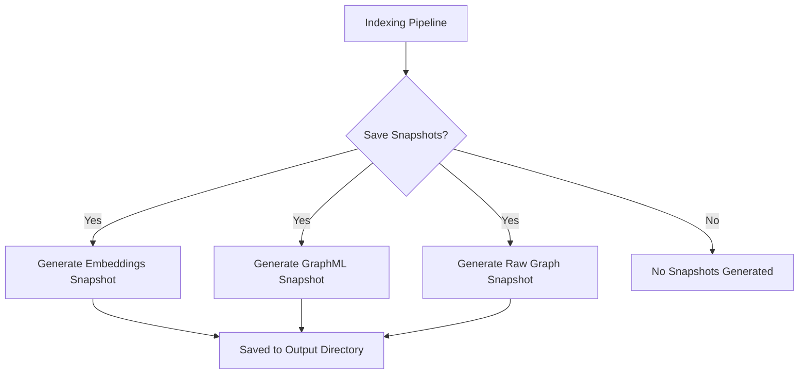

**Diagram sources**
- [snapshots_config.py](file://graphrag/config/models/snapshots_config.py#L11-L26)

**Section sources**
- [snapshots_config.py](file://graphrag/config/models/snapshots_config.py#L11-L26)
- [defaults.py](file://graphrag/config/defaults.py#L386-L393)

## Language Model Configuration

The `LanguageModelConfig` provides comprehensive control over LLM interactions throughout the indexing pipeline. This configuration is used by multiple components including entity extraction, community report generation, and description summarization.

Key parameters include:
- `api_key`: Authentication key for the LLM service
- `auth_type`: Authentication method (APIKey or AzureManagedIdentity)
- `type`: LLM model type (Chat, Embedding, etc.)
- `model_provider`: Provider (e.g., openai, azure)
- `model`: Specific model name (e.g., gpt-4-turbo-preview)
- `temperature`: Sampling temperature (default: 0)
- `max_tokens`: Maximum tokens to generate
- `concurrent_requests`: Number of concurrent requests (default: 25)
- `rate_limit_strategy`: Rate limiting approach
- `retry_strategy`: Retry strategy for failed requests

The `temperature` parameter is particularly important for controlling the creativity vs. consistency of LLM outputs. A temperature of 0 (default) produces deterministic, consistent outputs ideal for structured extraction tasks. Higher temperatures introduce more randomness and creativity, which might be desirable for report generation but problematic for entity extraction.

The configuration also includes robust error handling with retry strategies (exponential_backoff by default) and rate limiting to ensure reliable operation when interacting with external LLM services. These features help maintain pipeline stability even when facing transient network issues or API rate limits.

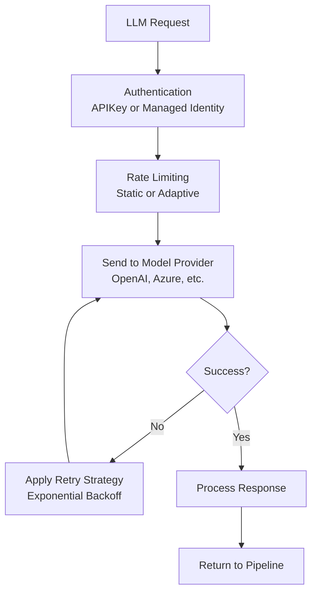

**Section sources**
- [language_model_config.py](file://graphrag/config/models/language_model_config.py#L25-L404)
- [defaults.py](file://graphrag/config/defaults.py#L306-L338)

## Configuration Interplay and Workflow

The various configuration models work together in a coordinated workflow to transform raw documents into a structured knowledge graph. Understanding how these configurations interact is essential for optimizing the entire pipeline.

The indexing workflow follows this sequence:
1. Documents are chunked according to `ChunkingConfig`
2. Entities and relationships are extracted using `ExtractGraphConfig`
3. The graph is pruned based on `PruneGraphConfig` thresholds
4. Communities are detected using `ClusterGraphConfig`
5. Community reports are generated with `CommunityReportsConfig`
6. Text embeddings are created via `TextEmbeddingConfig`
7. Optional UMAP layout is applied if `UmapConfig.enabled=True`
8. Snapshots are saved according to `SnapshotsConfig`

These configurations are interdependent. For example, the chunk size in `ChunkingConfig` affects the context available for entity extraction in `ExtractGraphConfig`. Similarly, the quality of community detection in `ClusterGraphConfig` depends on the completeness of the graph structure, which is influenced by pruning thresholds in `PruneGraphConfig`.

The `LanguageModelConfig` is used across multiple stages, with different instances potentially configured for extraction versus summarization tasks. This allows optimization of LLM parameters for specific use cases—for example, using a lower temperature for entity extraction (to ensure consistency) and a higher temperature for report generation (to allow more creative summarization).

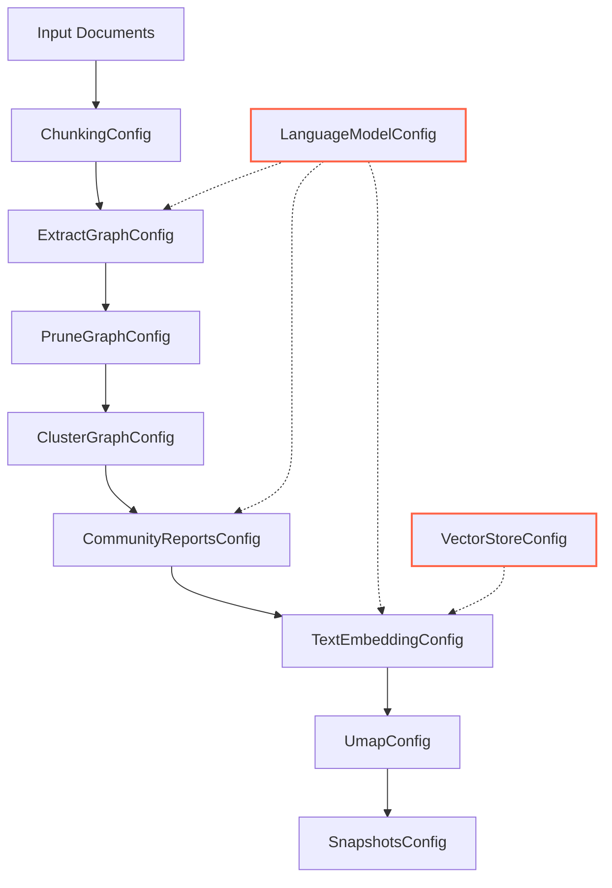

**Diagram sources**
- [graph_rag_config.py](file://graphrag/config/models/graph_rag_config.py#L48-L417)
- [create_base_text_units.py](file://graphrag/index/workflows/create_base_text_units.py#L25-L164)
- [extract_graph.py](file://graphrag/index/workflows/extract_graph.py#L28-L165)
- [create_communities.py](file://graphrag/index/workflows/create_communities.py#L25-L157)

**Section sources**
- [graph_rag_config.py](file://graphrag/config/models/graph_rag_config.py#L48-L417)

## Troubleshooting Common Issues

Several common issues can arise during the indexing process, often related to configuration settings. Understanding these issues and their solutions is crucial for maintaining a reliable pipeline.

**Memory Exhaustion**: This typically occurs when chunk sizes are too large or batch sizes are too high. Solutions include:
- Reduce `chunks.size` in `ChunkingConfig`
- Decrease `batch_size` in `TextEmbeddingConfig`
- Lower `concurrent_requests` in `LanguageModelConfig`
- Process documents in smaller batches

**Poor Community Detection**: This may result from overly aggressive pruning or inappropriate clustering parameters. Solutions include:
- Adjust `min_edge_weight_pct` in `PruneGraphConfig` to preserve more connections
- Modify `max_cluster_size` in `ClusterGraphConfig` to create more granular communities
- Ensure sufficient entity extraction by reviewing `ExtractGraphConfig` settings
- Verify that `use_lcc=True` is not eliminating important components

**Low Entity Recall**: When too few entities are extracted, consider:
- Increasing `max_gleanings` in `ExtractGraphConfig`
- Expanding `entity_types` to include relevant domain-specific types
- Reducing chunk size to improve context focus
- Verifying LLM configuration and API connectivity

**Slow Performance**: To improve indexing speed:
- Increase `batch_size` and `batch_max_tokens` in `TextEmbeddingConfig`
- Adjust `concurrent_requests` in `LanguageModelConfig`
- Disable unnecessary snapshots in `SnapshotsConfig`
- Use faster LLM models for extraction tasks

**LLM API Errors**: Common issues include:
- Validate API keys and authentication settings in `LanguageModelConfig`
- Check rate limits and adjust `tokens_per_minute` and `requests_per_minute`
- Verify model availability and deployment names
- Ensure proper network connectivity and proxy settings

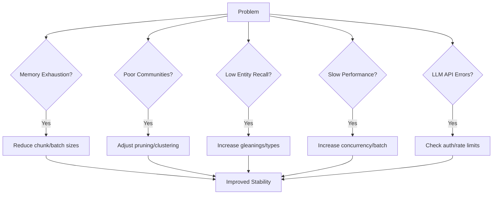

**Section sources**
- [language_model_config.py](file://graphrag/config/models/language_model_config.py#L25-L404)
- [chunking_config.py](file://graphrag/config/models/chunking_config.py#L12-L43)
- [prune_graph_config.py](file://graphrag/config/models/prune_graph_config.py#L11-L42)
- [text_embedding_config.py](file://graphrag/config/models/text_embedding_config.py#L12-L53)

## Conclusion

The GraphRAG indexing pipeline offers a comprehensive set of configuration options that provide fine-grained control over the knowledge graph construction process. Each configuration model plays a distinct role in transforming raw text into structured, queryable knowledge.

Understanding the interplay between these configurations is essential for optimizing the pipeline for specific use cases. The chunking strategy affects context availability for entity extraction, which in turn influences community detection quality. Pruning thresholds determine graph density, while embedding configurations impact retrieval performance. The language model settings affect the quality and consistency of all LLM-driven processes.

Effective configuration requires balancing competing concerns: larger chunks provide more context but increase processing costs; aggressive pruning removes noise but may eliminate valuable connections; detailed community reports improve queryability but require more LLM resources. The default values provide a solid starting point, but tuning these parameters based on domain requirements and performance characteristics is key to achieving optimal results.

By carefully configuring these parameters and understanding their interactions, users can create high-quality knowledge graphs tailored to their specific needs, enabling powerful semantic search and insight discovery capabilities.