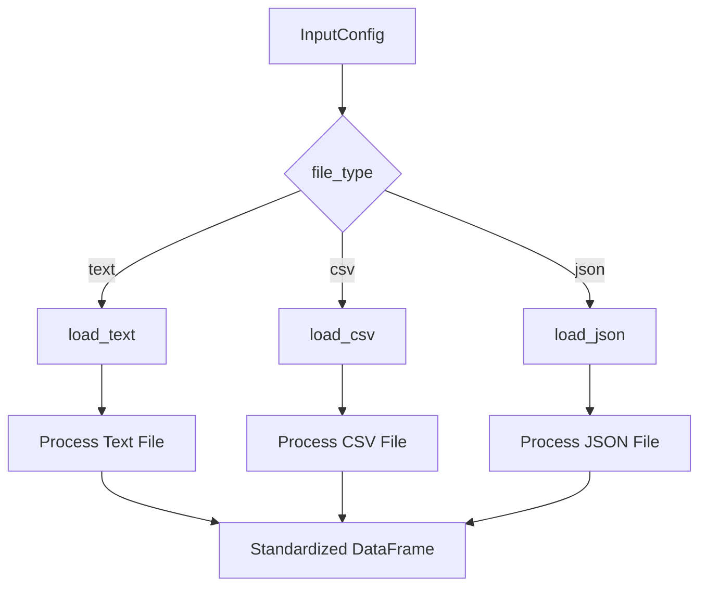
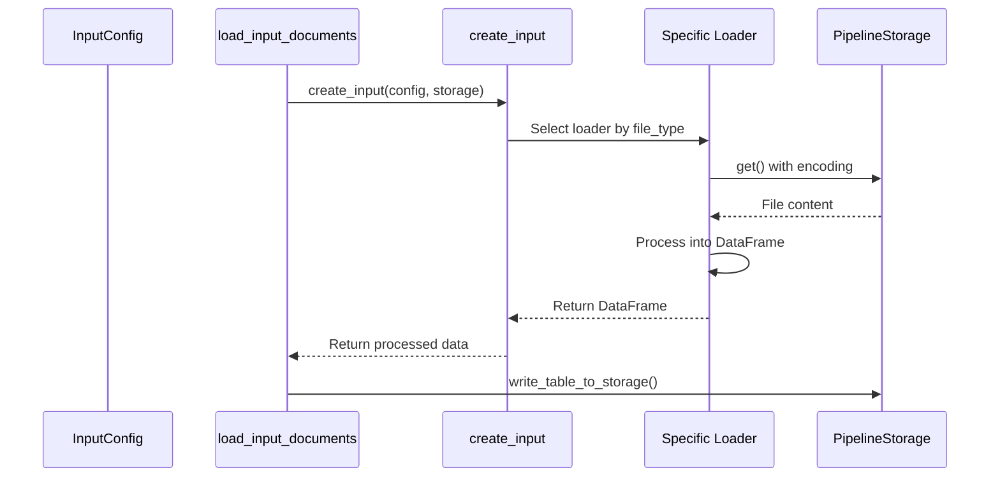

# Input Configuration

<cite>
**Referenced Files in This Document**   
- [input_config.py](file://graphrag/config/models/input_config.py)
- [factory.py](file://graphrag/index/input/factory.py)
- [csv.py](file://graphrag/index/input/csv.py)
- [json.py](file://graphrag/index/input/json.py)
- [text.py](file://graphrag/index/input/text.py)
- [util.py](file://graphrag/index/input/util.py)
- [enums.py](file://graphrag/config/enums.py)
- [defaults.py](file://graphrag/config/defaults.py)
- [load_input_documents.py](file://graphrag/index/workflows/load_input_documents.py)
</cite>

## Table of Contents
1. [Introduction](#introduction)
2. [InputConfig Model Fields](#inputconfig-model-fields)
3. [Input Type Handling](#input-type-handling)
4. [File Pattern and Batch Processing](#file-pattern-and-batch-processing)
5. [Source Column in Structured Data](#source-column-in-structured-data)
6. [Encoding Settings](#encoding-settings)
7. [Practical Configuration Examples](#practical-configuration-examples)
8. [Integration with Indexing Pipeline](#integration-with-indexing-pipeline)
9. [Common Issues and Troubleshooting](#common-issues-and-troubleshooting)
10. [Conclusion](#conclusion)

## Introduction
The GraphRAG input configuration system provides a flexible framework for loading and processing various types of input data. This document details the `InputConfig` model and its integration with the indexing pipeline, focusing on how different input types are handled, the significance of configuration parameters, and practical usage patterns.

**Section sources**
- [input_config.py](file://graphrag/config/models/input_config.py#L14-L50)

## InputConfig Model Fields
The `InputConfig` model defines the configuration for input data processing in GraphRAG. It contains several key fields that control how input files are read and processed:

- **storage**: Configuration for the storage system used to read input documents, including the base directory path
- **file_type**: Specifies the input file format (csv, text, or json) 
- **encoding**: Defines the character encoding used when reading text files
- **file_pattern**: Regular expression pattern used to identify input files
- **file_filter**: Optional dictionary for filtering files based on metadata
- **text_column**: Name of the column containing the main text content in structured files
- **title_column**: Optional name of the column containing document titles
- **metadata**: List of column names to be treated as metadata attributes

These fields work together to provide a comprehensive configuration system for input data processing.

**Section sources**
- [input_config.py](file://graphrag/config/models/input_config.py#L14-L50)

## Input Type Handling
GraphRAG supports three primary input types: text, CSV, and JSON. Each type is handled by a specific loader function that processes the data into a standardized format.

For **text files**, each file is loaded as a single document with the filename used as the title. The entire file content becomes the text field.

For **CSV files**, the data is loaded using pandas and processed according to the configured text and title columns. Multiple rows in a CSV file become multiple documents.

For **JSON files**, the system handles both single JSON objects and arrays of objects. Each object in the JSON structure becomes a separate document in the output.

The factory pattern in `create_input` function routes the processing to the appropriate loader based on the `file_type` configuration.



**Diagram sources**
- [factory.py](file://graphrag/index/input/factory.py#L27-L57)
- [text.py](file://graphrag/index/input/text.py#L19-L36)
- [csv.py](file://graphrag/index/input/csv.py#L18-L44)
- [json.py](file://graphrag/index/input/json.py#L18-L48)

**Section sources**
- [factory.py](file://graphrag/index/input/factory.py#L27-L57)
- [enums.py](file://graphrag/config/enums.py#L30-L38)

## File Pattern and Batch Processing
The `file_pattern` field uses regular expression syntax to identify which files should be processed. This enables flexible batch processing of multiple files that match a specific pattern.

For example, a pattern of `.*\\.txt$` would match all files with a .txt extension, while `document_\\d+\\.csv$` would match CSV files with names like "document_1.csv", "document_2.csv", etc.

The pattern is used by the `load_files` function in the input utilities to find all matching files in the input directory. This function applies the pattern to all files in the storage location and processes only those that match.

When multiple files match the pattern, they are processed sequentially and their contents are concatenated into a single DataFrame. This enables batch processing of large document collections while maintaining a consistent data structure.

**Section sources**
- [util.py](file://graphrag/index/input/util.py#L19-L53)
- [defaults.py](file://graphrag/config/defaults.py#L298)

## Source Column in Structured Data
In structured data inputs like CSV and JSON, the `text_column` parameter specifies which field contains the primary text content to be processed. This is crucial for ensuring that the correct data is used for graph construction and analysis.

For CSV files, if the specified `text_column` does not exist, a warning is logged and the field is not populated. The same applies to the optional `title_column`.

In JSON files, the structure of the data determines how the text column is accessed. For array-based JSON files, each object in the array is treated as a separate record, and the text column value is extracted from each object.

The system also supports metadata extraction, where specified columns are combined into a single metadata JSON object for each document, preserving additional context and attributes.

**Section sources**
- [util.py](file://graphrag/index/input/util.py#L56-L87)
- [csv.py](file://graphrag/index/input/csv.py#L18-L44)

## Encoding Settings
The `encoding` parameter specifies the character encoding used when reading text files. The default value is "utf-8", which supports most international characters and is the standard encoding for web content.

Proper encoding configuration is essential for correctly processing text with special characters, diacritics, or non-Latin scripts. Using an incorrect encoding can result in garbled text or decoding errors.

When processing CSV and JSON files, the encoding setting is passed to the respective pandas and JSON parsing functions to ensure proper character interpretation. For text files, it's used directly when reading the file content.

The system uses the configured encoding through the storage layer's get method, which accepts an encoding parameter for text retrieval operations.

**Section sources**
- [input_config.py](file://graphrag/config/models/input_config.py#L27-L30)
- [defaults.py](file://graphrag/config/defaults.py#L297)
- [file_pipeline_storage.py](file://graphrag/storage/file_pipeline_storage.py#L87-L117)

## Practical Configuration Examples
### Single Text File Configuration
To process a single text file, configure the input with text file type and a pattern matching the specific file:

```python
config = InputConfig(
    storage=StorageConfig(base_dir="input/documents"),
    file_type=InputFileType.text,
    file_pattern="report.txt",
    encoding="utf-8"
)
```

### CSV Dataset with Specific Columns
For a CSV file with specific text and title columns:

```python
config = InputConfig(
    storage=StorageConfig(base_dir="input/data"),
    file_type=InputFileType.csv,
    file_pattern=".*\\.csv$",
    text_column="content",
    title_column="headline",
    metadata=["author", "date", "category"]
)
```

### JSON Collection Processing
To process multiple JSON files containing article collections:

```python
config = InputConfig(
    storage=StorageConfig(base_dir="input/articles"),
    file_type=InputFileType.json,
    file_pattern="article_.*\\.json$",
    text_column="body",
    title_column="title",
    encoding="utf-8"
)
```

**Section sources**
- [test_txt_loader.py](file://tests/unit/indexing/input/test_txt_loader.py#L11-L51)
- [test_csv_loader.py](file://tests/unit/indexing/input/test_csv_loader.py#L11-L67)
- [test_json_loader.py](file://tests/unit/indexing/input/test_json_loader.py#L11-L82)

## Integration with Indexing Pipeline
The input configuration system integrates with the GraphRAG indexing pipeline through the `load_input_documents` workflow. This workflow uses the `create_input` factory function to instantiate the appropriate loader based on the configuration.

The process begins with the `run_workflow` function in the load_input_documents module, which calls `load_input_documents` with the configuration and storage objects. This function then delegates to `create_input`, which routes to the specific loader based on file type.

After loading, the data is standardized with consistent column names (id, text, title, creation_date, metadata) regardless of the source format. This standardized DataFrame is then passed to subsequent pipeline stages for chunking, entity extraction, and graph construction.



**Diagram sources**
- [load_input_documents.py](file://graphrag/index/workflows/load_input_documents.py#L21-L44)
- [factory.py](file://graphrag/index/input/factory.py#L27-L57)

**Section sources**
- [load_input_documents.py](file://graphrag/index/workflows/load_input_documents.py#L21-L44)

## Common Issues and Troubleshooting
### Incorrect File Patterns
When the file pattern doesn't match any files, the system raises a ValueError with "No {file_type} files found" message. To resolve:
- Verify the pattern syntax and escaping
- Check that files exist in the specified base directory
- Use tools to test the regular expression pattern

### Encoding Mismatches
Encoding issues manifest as UnicodeDecodeError or garbled text. Solutions include:
- Verify the actual file encoding using file inspection tools
- Update the encoding parameter to match the file's encoding
- Convert files to UTF-8 when possible

### Missing Source Columns
When configured text or title columns don't exist in structured files:
- The system logs a warning but continues processing
- Verify column names match exactly (case-sensitive)
- Check for whitespace or special characters in column headers
- Use pandas to inspect the actual DataFrame structure

### Metadata Column Errors
When specified metadata columns are not found:
- Verify all metadata columns exist in the source data
- Check for typos in column names
- Ensure the data structure matches expectations

**Section sources**
- [util.py](file://graphrag/index/input/util.py#L32-L35)
- [util.py](file://graphrag/index/input/util.py#L66-L70)
- [factory.py](file://graphrag/index/input/factory.py#L46-L49)

## Conclusion
The GraphRAG input configuration system provides a robust and flexible framework for processing various data formats. By understanding the `InputConfig` model fields and their interactions, users can effectively configure the system to handle diverse input scenarios. The integration with the indexing pipeline ensures that data is properly standardized before further processing, enabling consistent analysis across different input types.