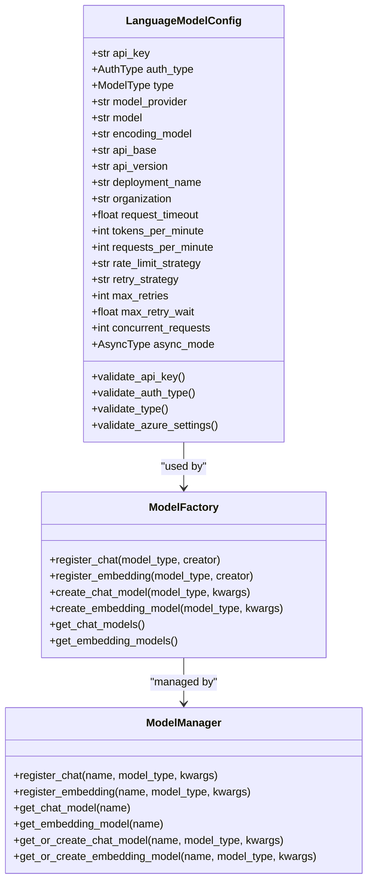
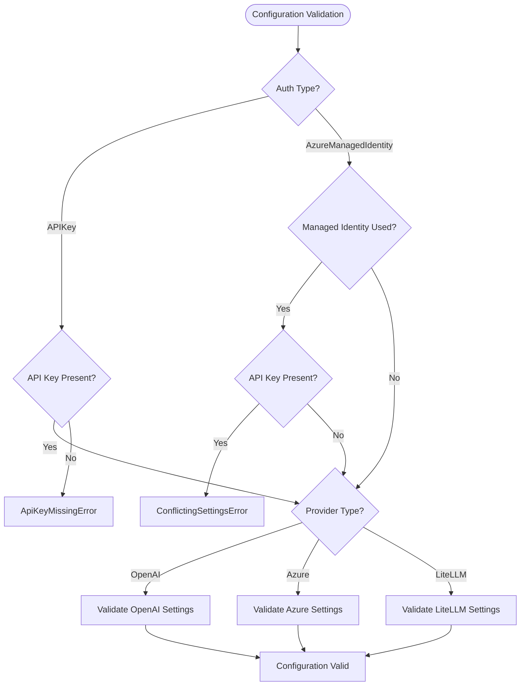
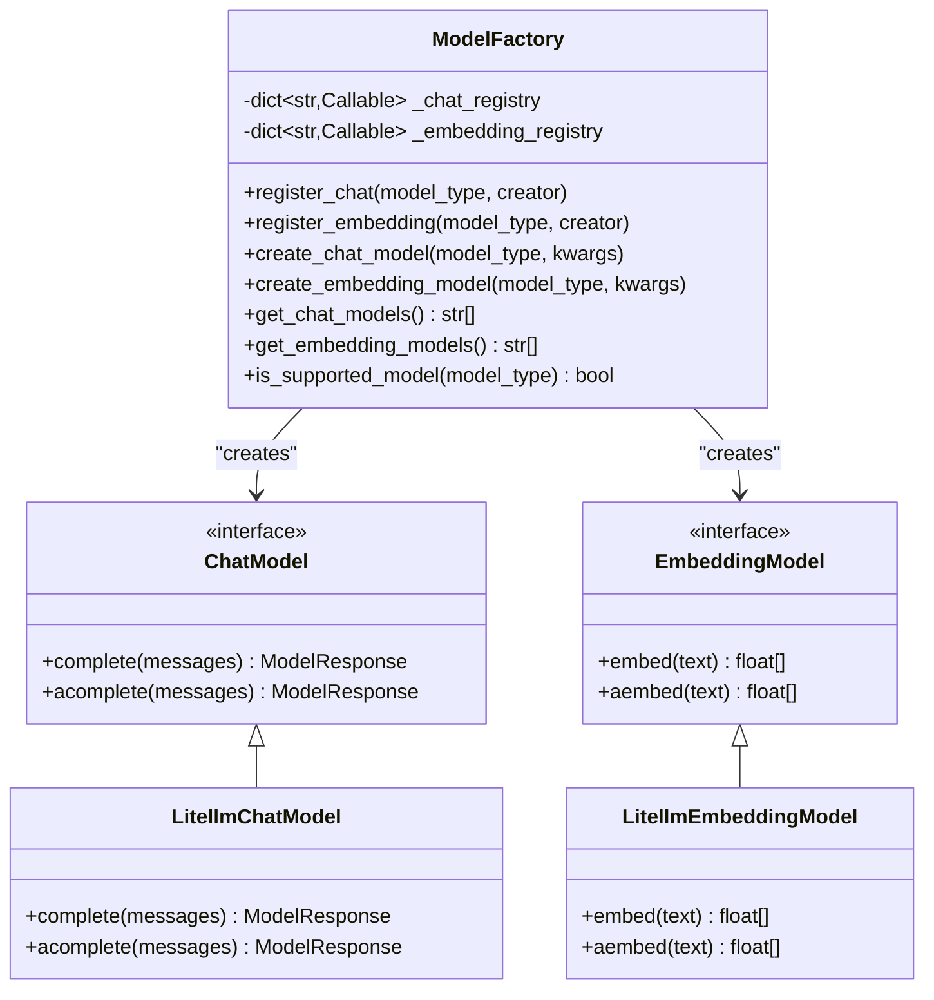
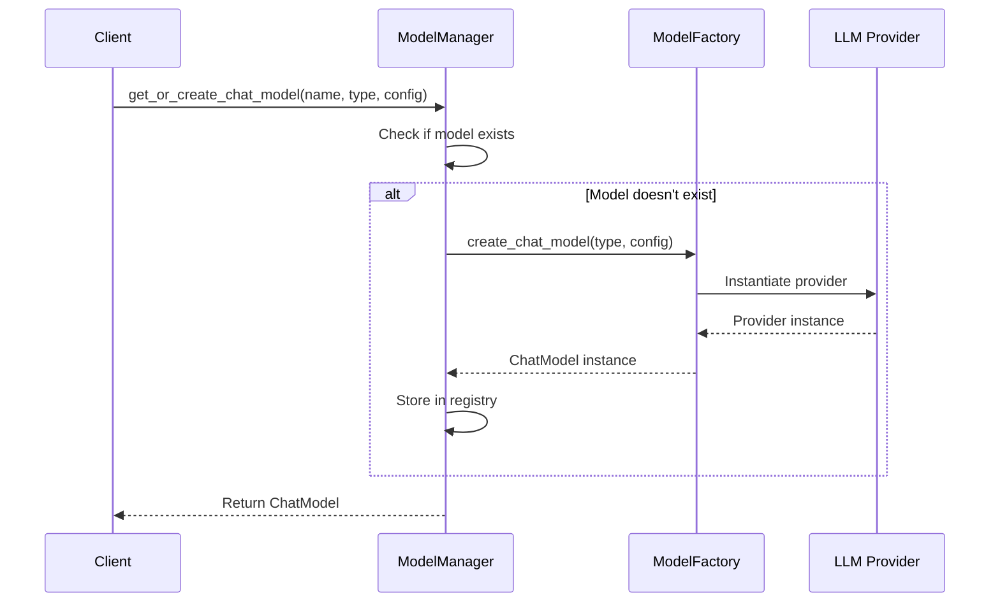

# Language Model Configuration

<cite>
**Referenced Files in This Document**
- [language_model_config.py](file://graphrag/config/models/language_model_config.py)
- [factory.py](file://graphrag/language_model/factory.py)
- [manager.py](file://graphrag/language_model/manager.py)
- [enums.py](file://graphrag/config/enums.py)
- [defaults.py](file://graphrag/config/defaults.py)
- [chat_model.py](file://graphrag/language_model/providers/litellm/chat_model.py)
- [embedding_model.py](file://graphrag/language_model/providers/litellm/embedding_model.py)
- [exponential_retry.py](file://graphrag/language_model/providers/litellm/services/retry/exponential_retry.py)
- [static_rate_limiter.py](file://graphrag/language_model/providers/litellm/services/rate_limiter/static_rate_limiter.py)
- [errors.py](file://graphrag/config/errors.py)
- [settings.yaml](file://tests/unit/config/fixtures/minimal_config/settings.yaml)
- [test_config.py](file://tests/unit/config/test_config.py)
</cite>

## Table of Contents
1. [Introduction](#introduction)
2. [LanguageModelConfig Overview](#languagemodelconfig-overview)
3. [Core Configuration Fields](#core-configuration-fields)
4. [LLM Provider Configuration](#llm-provider-configuration)
5. [Authentication Management](#authentication-management)
6. [Advanced Settings](#advanced-settings)
7. [Provider System Architecture](#provider-system-architecture)
8. [Configuration Examples](#configuration-examples)
9. [Security Considerations](#security-considerations)
10. [Troubleshooting Guide](#troubleshooting-guide)
11. [Best Practices](#best-practices)

## Introduction

GraphRAG's language model configuration system provides a flexible and robust framework for integrating various Large Language Model (LLM) providers. The system supports multiple LLM providers including OpenAI, Azure OpenAI, and LiteLLM-compatible services through a unified configuration interface. This documentation covers the complete language model configuration process, from basic setup to advanced customization and troubleshooting.

The configuration system is built around the `LanguageModelConfig` class, which validates and manages all aspects of LLM connectivity, authentication, and operational parameters. It integrates seamlessly with GraphRAG's factory pattern and provider architecture to enable dynamic model selection and instantiation.

## LanguageModelConfig Overview

The `LanguageModelConfig` class serves as the central configuration hub for all language model interactions in GraphRAG. It inherits from Pydantic's `BaseModel` and provides comprehensive validation, type safety, and configuration management.



**Diagram sources**
- [language_model_config.py](file://graphrag/config/models/language_model_config.py#L25-L404)
- [factory.py](file://graphrag/language_model/factory.py#L23-L124)
- [manager.py](file://graphrag/language_model/manager.py#L22-L154)

**Section sources**
- [language_model_config.py](file://graphrag/config/models/language_model_config.py#L25-L404)
- [factory.py](file://graphrag/language_model/factory.py#L23-L124)
- [manager.py](file://graphrag/language_model/manager.py#L22-L154)

## Core Configuration Fields

### Essential Configuration Parameters

The LanguageModelConfig requires several essential fields to establish LLM connectivity:

| Field | Type | Description | Required |
|-------|------|-------------|----------|
| `type` | `ModelType \| str` | Specifies the LLM type (OpenAI, Azure OpenAI, or LiteLLM) | Yes |
| `model` | `str` | The specific model name to use | Yes |
| `api_key` | `str \| None` | Authentication key for the LLM service | Conditional |
| `model_provider` | `str \| None` | Provider name for LiteLLM configurations | Conditional |

### Authentication Configuration

Authentication is managed through the `auth_type` field with two primary modes:

- **APIKey**: Standard API key authentication
- **AzureManagedIdentity**: Azure Active Directory authentication



**Diagram sources**
- [language_model_config.py](file://graphrag/config/models/language_model_config.py#L33-L60)
- [language_model_config.py](file://graphrag/config/models/language_model_config.py#L67-L85)

**Section sources**
- [language_model_config.py](file://graphrag/config/models/language_model_config.py#L28-L65)
- [enums.py](file://graphrag/config/enums.py#L105-L110)

## LLM Provider Configuration

### OpenAI Configuration

OpenAI models are configured using the `ModelType.OpenAIChat` and `ModelType.OpenAIEmbedding` types:

```yaml
models:
  default_chat_model:
    type: openai_chat
    model: gpt-4-turbo-preview
    api_key: ${OPENAI_API_KEY}
    temperature: 0.7
    max_tokens: 2000
    
  default_embedding_model:
    type: openai_embedding
    model: text-embedding-3-small
    api_key: ${OPENAI_API_KEY}
```

### Azure OpenAI Configuration

Azure OpenAI requires additional Azure-specific parameters:

```yaml
models:
  azure_chat_model:
    type: azure_openai_chat
    auth_type: api_key
    model: gpt-4
    api_key: ${AZURE_OPENAI_API_KEY}
    api_base: https://your-resource.openai.azure.com/
    api_version: "2024-02-15-preview"
    deployment_name: gpt-4-deployment
    
  azure_embedding_model:
    type: azure_openai_embedding
    auth_type: api_key
    model: text-embedding-ada-002
    api_key: ${AZURE_OPENAI_API_KEY}
    api_base: https://your-resource.openai.azure.com/
    api_version: "2024-02-15-preview"
    deployment_name: text-embedding-ada-002-deployment
```

### LiteLLM-Compatible Services

LiteLLM provides universal compatibility with various LLM providers:

```yaml
models:
  litellm_chat_model:
    type: chat
    model_provider: openai
    model: gpt-4
    api_key: ${OPENAI_API_KEY}
    api_base: https://api.openai.com/v1
    
  litellm_embedding_model:
    type: embedding
    model_provider: openai
    model: text-embedding-3-small
    api_key: ${OPENAI_API_KEY}
    api_base: https://api.openai.com/v1
```

**Section sources**
- [language_model_config.py](file://graphrag/config/models/language_model_config.py#L89-L108)
- [defaults.py](file://graphrag/config/defaults.py#L48-L56)

## Authentication Management

### API Key Authentication

API key authentication is the most common method for accessing LLM services. The system supports environment variable substitution for secure key management:

```yaml
models:
  chat_model:
    type: chat
    model_provider: openai
    model: gpt-4
    api_key: ${OPENAI_API_KEY}  # Environment variable
```

### Azure Managed Identity

For Azure environments, Managed Identity provides secure authentication without explicit API keys:

```yaml
models:
  azure_model:
    type: azure_openai_chat
    auth_type: azure_managed_identity
    model: gpt-4
    api_base: https://your-resource.openai.azure.com/
    api_version: "2024-02-15-preview"
    deployment_name: gpt-4-deployment
    audience: https://cognitiveservices.azure.com/
```

### Environment Variable Management

GraphRAG supports environment variable substitution in configuration files:

```yaml
# settings.yaml
models:
  production_model:
    type: chat
    model_provider: openai
    model: gpt-4
    api_key: ${PRODUCTION_API_KEY}
    organization: ${ORGANIZATION_ID}
```

The system automatically loads `.env` files from the configuration directory and supports environment variable overrides.

**Section sources**
- [language_model_config.py](file://graphrag/config/models/language_model_config.py#L33-L60)
- [language_model_config.py](file://graphrag/config/models/language_model_config.py#L67-L85)
- [test_config.py](file://tests/unit/config/test_config.py#L142-L148)

## Advanced Settings

### Request Timeout Configuration

Configure request timeouts to handle network latency and model response times:

```yaml
models:
  chat_model:
    request_timeout: 180.0  # 3 minutes
    max_retry_wait: 10.0    # Maximum wait between retries
    concurrent_requests: 25 # Maximum concurrent requests
```

### Rate Limiting Parameters

Implement sophisticated rate limiting to prevent API quota exhaustion:

```yaml
models:
  chat_model:
    rate_limit_strategy: static
    requests_per_minute: 1000
    tokens_per_minute: 100000
    max_retries: 10
    retry_strategy: exponential_backoff
```

### Model-Specific Parameters

Configure model-specific parameters for optimal performance:

| Parameter | Description | Default | Range |
|-----------|-------------|---------|-------|
| `temperature` | Controls randomness in generation | 0.0 | 0.0-2.0 |
| `max_tokens` | Maximum tokens to generate | None | 1-inf |
| `top_p` | Nucleus sampling parameter | 1.0 | 0.0-1.0 |
| `frequency_penalty` | Reduces repetition | 0.0 | -2.0-2.0 |
| `presence_penalty` | Encourages topic diversity | 0.0 | -2.0-2.0 |

### Reasoning Models Configuration

For OpenAI reasoning models, configure reasoning effort levels:

```yaml
models:
  reasoning_model:
    type: chat
    model_provider: openai
    model: o1-preview
    reasoning_effort: medium  # low, medium, high
    max_completion_tokens: 32000
```

**Section sources**
- [language_model_config.py](file://graphrag/config/models/language_model_config.py#L246-L375)
- [defaults.py](file://graphrag/config/defaults.py#L306-L338)

## Provider System Architecture

### Factory Pattern Implementation

GraphRAG uses a factory pattern to manage LLM provider registration and instantiation:



**Diagram sources**
- [factory.py](file://graphrag/language_model/factory.py#L23-L124)
- [chat_model.py](file://graphrag/language_model/providers/litellm/chat_model.py#L189-L200)
- [embedding_model.py](file://graphrag/language_model/providers/litellm/embedding_model.py#L175-L190)

### Provider Registration

The factory automatically registers default providers during initialization:

```python
# Automatic registration in factory.py
ModelFactory.register_chat(ModelType.Chat, lambda **kwargs: LitellmChatModel(**kwargs))
ModelFactory.register_embedding(ModelType.Embedding, lambda **kwargs: LitellmEmbeddingModel(**kwargs))
```

### Manager Pattern

The ModelManager provides singleton access to registered models:



**Diagram sources**
- [manager.py](file://graphrag/language_model/manager.py#L105-L137)
- [factory.py](file://graphrag/language_model/factory.py#L42-L75)

**Section sources**
- [factory.py](file://graphrag/language_model/factory.py#L23-L124)
- [manager.py](file://graphrag/language_model/manager.py#L22-L154)

## Configuration Examples

### Minimal OpenAI Configuration

```yaml
models:
  default_chat_model:
    type: chat
    model_provider: openai
    model: gpt-4-turbo-preview
    api_key: ${OPENAI_API_KEY}
    
  default_embedding_model:
    type: embedding
    model_provider: openai
    model: text-embedding-3-small
    api_key: ${OPENAI_API_KEY}
```

### Production Azure OpenAI Configuration

```yaml
models:
  production_chat_model:
    type: azure_openai_chat
    auth_type: azure_managed_identity
    model: gpt-4
    api_base: https://your-production.openai.azure.com/
    api_version: "2024-02-15-preview"
    deployment_name: gpt-4-production
    
  production_embedding_model:
    type: azure_openai_embedding
    auth_type: azure_managed_identity
    model: text-embedding-ada-002
    api_base: https://your-production.openai.azure.com/
    api_version: "2024-02-15-preview"
    deployment_name: text-embedding-ada-002-production
```

### High-Throughput Configuration

```yaml
models:
  high_throughput_model:
    type: chat
    model_provider: openai
    model: gpt-4
    api_key: ${OPENAI_API_KEY}
    requests_per_minute: 1000
    tokens_per_minute: 1000000
    rate_limit_strategy: static
    max_retries: 5
    retry_strategy: exponential_backoff
    request_timeout: 30.0
    concurrent_requests: 50
```

### Development Configuration with Mock Responses

```yaml
models:
  development_model:
    type: chat
    model_provider: openai
    model: gpt-3.5-turbo
    api_key: ${OPENAI_API_KEY}
    responses:
      - "This is a mock response for development."
      - "Another mock response for testing."
```

**Section sources**
- [settings.yaml](file://tests/unit/config/fixtures/minimal_config/settings.yaml#L1-L11)
- [test_config.py](file://tests/unit/config/test_config.py#L100-L108)

## Security Considerations

### API Key Management

1. **Environment Variables**: Always use environment variables for API keys
2. **.env Files**: Store sensitive configuration in `.env` files (not committed to version control)
3. **Secret Management**: Use Azure Key Vault or similar secret management systems in production
4. **Access Control**: Restrict API key access to authorized personnel only

### Configuration Security Best Practices

```yaml
# Secure configuration example
models:
  secure_model:
    type: chat
    model_provider: openai
    model: gpt-4
    api_key: ${SECURE_API_KEY}  # Environment variable
    organization: ${ORGANIZATION_ID}
    proxy: ${PROXY_URL}         # Optional proxy for traffic filtering
```

### Network Security

1. **TLS Encryption**: Ensure all API communications use TLS encryption
2. **Network Policies**: Implement network policies to restrict LLM API access
3. **Proxy Configuration**: Use corporate proxies for traffic monitoring and filtering
4. **VPN Access**: Require VPN access for LLM API connections in sensitive environments

### Authentication Security

1. **Managed Identity**: Prefer Managed Identity over API keys in Azure environments
2. **Token Rotation**: Implement automatic token rotation for long-running applications
3. **Audit Logging**: Enable audit logging for all LLM API access
4. **Principle of Least Privilege**: Grant minimal required permissions to service accounts

**Section sources**
- [language_model_config.py](file://graphrag/config/models/language_model_config.py#L33-L60)
- [test_config.py](file://tests/unit/config/test_config.py#L142-L148)

## Troubleshooting Guide

### Common Configuration Issues

#### API Key Missing Errors

**Problem**: `ApiKeyMissingError` when using OpenAI or Azure API Key authentication

**Solution**:
```yaml
# Correct configuration
models:
  chat_model:
    type: chat
    model_provider: openai
    model: gpt-4
    api_key: ${OPENAI_API_KEY}  # Ensure environment variable is set
```

#### Azure Configuration Errors

**Problem**: `AzureApiBaseMissingError` or `AzureApiVersionMissingError`

**Solution**:
```yaml
# Complete Azure configuration
models:
  azure_model:
    type: azure_openai_chat
    auth_type: api_key
    model: gpt-4
    api_key: ${AZURE_OPENAI_API_KEY}
    api_base: https://your-resource.openai.azure.com/  # Required
    api_version: "2024-02-15-preview"                  # Required
    deployment_name: gpt-4-deployment                 # Required
```

#### Authentication Type Conflicts

**Problem**: `ConflictingSettingsError` when using incorrect auth types

**Solution**:
```yaml
# For OpenAI models
models:
  openai_model:
    type: openai_chat  # Not azure_openai_chat
    auth_type: api_key  # Required for OpenAI
    model: gpt-4
    api_key: ${OPENAI_API_KEY}

# For Azure Managed Identity
models:
  azure_managed_model:
    type: azure_openai_chat
    auth_type: azure_managed_identity  # Not api_key
    model: gpt-4
    api_base: https://your-resource.openai.azure.com/
    api_version: "2024-02-15-preview"
    deployment_name: gpt-4-deployment
```

### Connectivity Issues

#### Timeout Problems

**Problem**: Requests timing out during LLM calls

**Diagnostic Steps**:
1. Check network connectivity to LLM API endpoints
2. Verify firewall rules and proxy configurations
3. Increase timeout values if necessary

**Solution**:
```yaml
models:
  resilient_model:
    type: chat
    model_provider: openai
    model: gpt-4
    api_key: ${OPENAI_API_KEY}
    request_timeout: 300.0  # 5 minutes
    max_retry_wait: 30.0    # Longer wait between retries
```

#### Rate Limiting Issues

**Problem**: Too many requests causing rate limiting errors

**Solution**:
```yaml
models:
  rate_limited_model:
    type: chat
    model_provider: openai
    model: gpt-4
    api_key: ${OPENAI_API_KEY}
    requests_per_minute: 100  # Adjust based on API limits
    tokens_per_minute: 100000
    rate_limit_strategy: static
    max_retries: 5
```

### Model-Specific Issues

#### Token Limit Exceeded

**Problem**: `context_length_exceeded` errors

**Solution**:
```yaml
models:
  token_safe_model:
    type: chat
    model_provider: openai
    model: gpt-4
    api_key: ${OPENAI_API_KEY}
    max_tokens: 4000  # Reduce token limit
    max_completion_tokens: 2000  # For reasoning models
```

#### Unsupported Model Parameters

**Problem**: Model parameter validation errors

**Solution**: Review model capabilities and adjust parameters:
```yaml
# For models without reasoning support
models:
  compatible_model:
    type: chat
    model_provider: openai
    model: gpt-3.5-turbo
    api_key: ${OPENAI_API_KEY}
    temperature: 0.7
    max_tokens: 2000
    # Remove reasoning_effort parameter
```

### Debugging Configuration

Enable debug logging to diagnose configuration issues:

```python
import logging
logging.basicConfig(level=logging.DEBUG)
# Run your GraphRAG application
```

Monitor the logs for validation errors and configuration warnings.

**Section sources**
- [errors.py](file://graphrag/config/errors.py#L1-L50)
- [language_model_config.py](file://graphrag/config/models/language_model_config.py#L376-L403)

## Best Practices

### Configuration Organization

1. **Separate Environments**: Use different configuration files for development, staging, and production
2. **Environment Variables**: Store sensitive data in environment variables
3. **Documentation**: Document custom model configurations and their purposes
4. **Version Control**: Track configuration changes with meaningful commit messages

### Performance Optimization

1. **Rate Limiting**: Configure appropriate rate limits based on your API quotas
2. **Caching**: Enable caching for frequently used model responses
3. **Batch Processing**: Use batch operations when possible to reduce API calls
4. **Model Selection**: Choose appropriate models for different tasks (e.g., cheaper models for preprocessing)

### Monitoring and Maintenance

1. **Health Checks**: Implement health checks for LLM connectivity
2. **Error Tracking**: Monitor and log LLM-related errors
3. **Cost Tracking**: Monitor API usage costs and optimize accordingly
4. **Regular Updates**: Keep model configurations updated with new model releases

### Testing Strategies

1. **Unit Tests**: Test configuration validation separately
2. **Integration Tests**: Test complete workflows with mocked LLM responses
3. **Environment Testing**: Test configurations across different environments
4. **Load Testing**: Test performance under high load conditions

### Migration Guidelines

When migrating between LLM providers:

1. **Configuration Mapping**: Map existing parameters to new provider equivalents
2. **Testing**: Thoroughly test with representative data samples
3. **Gradual Rollout**: Migrate incrementally to minimize risk
4. **Fallback Plans**: Maintain fallback configurations during migration

**Section sources**
- [defaults.py](file://graphrag/config/defaults.py#L306-L338)
- [factory.py](file://graphrag/language_model/factory.py#L105-L124)