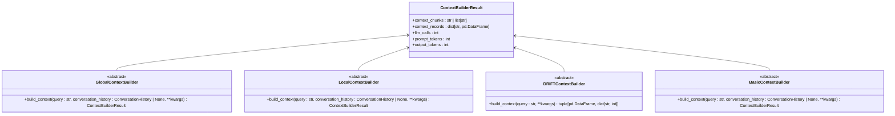

# Search Configuration

<cite>
**Referenced Files in This Document**   
- [local_search_config.py](file://graphrag/config/models/local_search_config.py)
- [global_search_config.py](file://graphrag/config/models/global_search_config.py)
- [basic_search_config.py](file://graphrag/config/models/basic_search_config.py)
- [drift_search_config.py](file://graphrag/config/models/drift_search_config.py)
- [defaults.py](file://graphrag/config/defaults.py)
- [graph_rag_config.py](file://graphrag/config/models/graph_rag_config.py)
- [local_search_system_prompt.py](file://graphrag/prompts/query/local_search_system_prompt.py)
- [basic_search_system_prompt.py](file://graphrag/prompts/query/basic_search_system_prompt.py)
- [drift_search_system_prompt.py](file://graphrag/prompts/query/drift_search_system_prompt.py)
- [global_search_knowledge_system_prompt.py](file://graphrag/prompts/query/global_search_knowledge_system_prompt.py)
- [builders.py](file://graphrag/query/context_builder/builders.py)
- [search.py](file://graphrag/query/structured_search/local_search/search.py)
- [search.py](file://graphrag/query/structured_search/basic_search/search.py)
- [search.py](file://graphrag/query/structured_search/drift_search/search.py)
</cite>

## Table of Contents
1. [Introduction](#introduction)
2. [Search Configuration Models](#search-configuration-models)
3. [Local Search Configuration](#local-search-configuration)
4. [Global Search Configuration](#global-search-configuration)
5. [Basic Search Configuration](#basic-search-configuration)
6. [Drift Search Configuration](#drift-search-configuration)
7. [Search Configuration and Context Builders](#search-configuration-and-context-builders)
8. [Prompt Templates and System Prompts](#prompt-templates-and-system-prompts)
9. [Performance Considerations](#performance-considerations)
10. [Search Method Selection Guidance](#search-method-selection-guidance)
11. [Configuration Tuning Examples](#configuration-tuning-examples)
12. [Conclusion](#conclusion)

## Introduction

GraphRAG provides multiple search methods to accommodate different query patterns, data sizes, and performance requirements. Each search method has a corresponding configuration model that controls various aspects of the search process, including context size, LLM settings, community selection, and response generation. This document details the configuration models for all search methods: `LocalSearchConfig`, `GlobalSearchConfig`, `BasicSearchConfig`, and `DriftSearchConfig`. It explains how these configurations interact with the query system's context builders and prompt templates, and provides guidance on tuning parameters for different use cases.

**Section sources**
- [local_search_config.py](file://graphrag/config/models/local_search_config.py)
- [global_search_config.py](file://graphrag/config/models/global_search_config.py)
- [basic_search_config.py](file://graphrag/config/models/basic_search_config.py)
- [drift_search_config.py](file://graphrag/config/models/drift_search_config.py)

## Search Configuration Models

GraphRAG implements a modular configuration system where each search method has its own configuration class that inherits from Pydantic's BaseModel. These configuration models are defined in the `graphrag.config.models` module and are used to parameterize the behavior of different search algorithms. The main search configuration models include:

- `LocalSearchConfig`: Controls local search behavior with focused context from relevant entities and relationships
- `GlobalSearchConfig`: Manages global search with map-reduce strategy across the entire knowledge graph
- `BasicSearchConfig`: Configures basic vector search on raw text chunks without graph context
- `DRIFTSearchConfig`: Governs the DRIFT (Dynamic Retrieval with Iterative Feedback and Traversal) search method

These configurations are integrated into the main `GraphRAGConfig` class, which serves as the central configuration point for the entire system. Each search configuration model contains parameters that control context size, LLM settings, community selection, and response generation.

**Section sources**
- [graph_rag_config.py](file://graphrag/config/models/graph_rag_config.py)
- [local_search_config.py](file://graphrag/config/models/local_search_config.py)
- [global_search_config.py](file://graphrag/config/models/global_search_config.py)
- [basic_search_config.py](file://graphrag/config/models/basic_search_config.py)
- [drift_search_config.py](file://graphrag/config/models/drift_search_config.py)

## Local Search Configuration

The `LocalSearchConfig` model controls the behavior of local search, which focuses on retrieving context from entities and relationships directly connected to the query. This search method is ideal for queries that require detailed information about specific entities and their immediate context.

### Context Size Parameters
- `max_context_tokens` (default: 12,000): Maximum number of tokens allowed in the search context
- `text_unit_prop` (default: 0.5): Proportion of context dedicated to text units
- `community_prop` (default: 0.5): Proportion of context dedicated to community properties

### LLM Settings
- `chat_model_id` (default: "default_chat_model"): Model ID for the chat LLM
- `embedding_model_id` (default: "default_embedding_model"): Model ID for text embeddings

### Community Selection
- `top_k_entities` (default: 10): Number of top mapped entities to include
- `top_k_relationships` (default: 10): Number of top mapped relationships to include

### Response Generation
- `prompt`: Custom prompt for local search (defaults to system prompt)
- `conversation_history_max_turns` (default: 10): Maximum number of conversation turns to include in context

Local search balances between text unit context and community context, allowing for fine-tuning based on whether the use case requires more granular text details or broader community insights.


**Diagram sources **
- [local_search_config.py](file://graphrag/config/models/local_search_config.py)

**Section sources**
- [local_search_config.py](file://graphrag/config/models/local_search_config.py)
- [defaults.py](file://graphrag/config/defaults.py)

## Global Search Configuration

The `GlobalSearchConfig` model manages the global search method, which uses a map-reduce strategy to process the entire knowledge graph. This approach is suitable for complex queries that require synthesizing information across multiple communities and entities.

### Context Size Parameters
- `max_context_tokens` (default: 12,000): Maximum tokens in the final context
- `data_max_tokens` (default: 12,000): Maximum tokens for data processing
- `map_max_length` (default: 1000): Maximum response length in words for the map phase
- `reduce_max_length` (default: 2000): Maximum response length in words for the reduce phase

### LLM Settings
- `chat_model_id` (default: "default_chat_model"): Model ID for global search operations

### Community Selection
The global search configuration includes sophisticated dynamic community selection parameters:
- `dynamic_search_threshold` (default: 5): Rating threshold to include a community report
- `dynamic_search_keep_parent` (default: True): Whether to keep parent communities when child communities are relevant
- `dynamic_search_num_repeats` (default: 1): Number of times to rate the same community report
- `dynamic_search_use_summary` (default: False): Whether to use community summary instead of full context
- `dynamic_search_max_level` (default: 2): Maximum level of community hierarchy to consider

### Response Generation
- `map_prompt`: Custom prompt for the mapping phase
- `reduce_prompt`: Custom prompt for the reduction phase
- `knowledge_prompt`: General prompt for knowledge integration
- `allow_general_knowledge` (default: False): Whether to include real-world knowledge in responses

Global search is particularly effective for broad, exploratory queries that require synthesizing information across the entire knowledge graph.


**Diagram sources **
- [global_search_config.py](file://graphrag/config/models/global_search_config.py)

**Section sources**
- [global_search_config.py](file://graphrag/config/models/global_search_config.py)
- [defaults.py](file://graphrag/config/defaults.py)

## Basic Search Configuration

The `BasicSearchConfig` model controls the basic search method, which performs vector search on raw text chunks without leveraging the knowledge graph structure. This approach is similar to traditional RAG systems and is useful for straightforward information retrieval.

### Context Size Parameters
- `max_context_tokens` (default: 12,000): Maximum tokens allowed in the search context
- `k` (default: 10): Number of text units to include in the search context

### LLM Settings
- `chat_model_id` (default: "default_chat_model"): Model ID for the chat LLM
- `embedding_model_id` (default: "default_embedding_model"): Model ID for text embeddings

### Response Generation
- `prompt`: Custom prompt for basic search (defaults to system prompt)

Basic search is the simplest search method, focusing solely on text similarity without considering entity relationships or community structures. It's particularly useful when the knowledge graph structure is not relevant to the query or when working with smaller datasets where graph traversal overhead is not justified.


**Diagram sources **
- [basic_search_config.py](file://graphrag/config/models/basic_search_config.py)

**Section sources**
- [basic_search_config.py](file://graphrag/config/models/basic_search_config.py)
- [defaults.py](file://graphrag/config/defaults.py)

## Drift Search Configuration

The `DRIFTSearchConfig` model governs the DRIFT (Dynamic Retrieval with Iterative Feedback and Traversal) search method, which combines iterative query refinement with local search to explore the knowledge graph progressively.

### Context Size Parameters
- `data_max_tokens` (default: 12,000): Maximum tokens for data processing
- `reduce_max_tokens`: Maximum tokens for the reduce phase response
- `primer_llm_max_tokens` (default: 12,000): Maximum tokens for the LLM in the primer phase
- `local_search_max_data_tokens` (default: 12,000): Maximum context size in tokens for local search

### LLM Settings
- `chat_model_id` (default: "default_chat_model"): Model ID for DRIFT search operations
- `embedding_model_id` (default: "default_embedding_model"): Model ID for embeddings
- `reduce_temperature` (default: 0): Temperature for token generation in reduce phase
- `reduce_max_completion_tokens`: Maximum completion tokens for the reduce phase
- `local_search_temperature` (default: 0): Temperature for local search
- `local_search_top_p` (default: 1): Top-p value for local search
- `local_search_n` (default: 1): Number of completions to generate in local search
- `local_search_llm_max_gen_tokens`: Maximum generated tokens for the LLM in local search
- `local_search_llm_max_gen_completion_tokens`: Maximum generated completion tokens for the LLM in local search

### Search Process Parameters
- `concurrency` (default: 32): Number of concurrent requests
- `drift_k_followups` (default: 20): Number of top global results to retrieve
- `primer_folds` (default: 5): Number of folds for search priming
- `n_depth` (default: 3): Number of drift search steps to take

### Local Search Integration
DRIFT search incorporates local search parameters for its iterative exploration:
- `local_search_text_unit_prop` (default: 0.9): Proportion of search dedicated to text units
- `local_search_community_prop` (default: 0.1): Proportion of search dedicated to community properties
- `local_search_top_k_mapped_entities` (default: 10): Number of top K entities to map during local search
- `local_search_top_k_relationships` (default: 10): Number of top K relationships to map during local search

DRIFT search is particularly effective for complex, exploratory queries where the initial query might not capture all relevant aspects of the information need.


**Diagram sources **
- [drift_search_config.py](file://graphrag/config/models/drift_search_config.py)

**Section sources**
- [drift_search_config.py](file://graphrag/config/models/drift_search_config.py)
- [defaults.py](file://graphrag/config/defaults.py)

## Search Configuration and Context Builders

Search configurations interact closely with context builders, which are responsible for constructing the context used in the search process. The context builder system in GraphRAG is designed to be modular and extensible, with different builders for different search methods.

### Context Builder Architecture
The context builder system follows an abstract base class pattern with specific implementations for each search method:
- `GlobalContextBuilder`: Base class for global search context builders
- `LocalContextBuilder`: Base class for local search context builders
- `DRIFTContextBuilder`: Base class for DRIFT search context builders
- `BasicContextBuilder`: Base class for basic search context builders

Each context builder uses the corresponding search configuration to determine how to construct the search context, including which entities, relationships, and text units to include, and how to balance different types of context.

### Configuration Integration
Search configurations are passed to context builders through the `context_builder_params` parameter, which allows for fine-grained control over the context building process. For example, the `LocalSearchConfig` parameters like `text_unit_prop`, `community_prop`, `top_k_entities`, and `top_k_relationships` directly influence how the `LocalContextBuilder` constructs the search context.

The context builder system also handles conversation history, which can be included in the search context based on the `conversation_history_max_turns` parameter in the `LocalSearchConfig`.



**Diagram sources **
- [builders.py](file://graphrag/query/context_builder/builders.py)

**Section sources**
- [builders.py](file://graphrag/query/context_builder/builders.py)
- [local_search_config.py](file://graphrag/config/models/local_search_config.py)
- [global_search_config.py](file://graphrag/config/models/global_search_config.py)
- [basic_search_config.py](file://graphrag/config/models/basic_search_config.py)
- [drift_search_config.py](file://graphrag/config/models/drift_search_config.py)

## Prompt Templates and System Prompts

Search configurations interact with prompt templates and system prompts to customize the behavior of the LLM during the search process. The prompt system in GraphRAG is designed to be flexible and configurable, allowing users to customize the prompts used in different search methods.

### Prompt Template Structure
Each search method has its own system prompt template that defines the role, goal, and format for the LLM response. The templates follow a consistent structure with placeholders for dynamic content:

- `{response_type}`: Specifies the desired response format and length
- `{context_data}`: Placeholder for the search context data
- Additional method-specific placeholders (e.g., `{global_query}` for DRIFT search)

### System Prompt Customization
Search configurations allow for prompt customization through the `prompt` parameter, which can override the default system prompt. This enables users to fine-tune the LLM behavior for specific use cases.

For example, the `LocalSearchConfig` uses the `LOCAL_SEARCH_SYSTEM_PROMPT` by default, but this can be overridden with a custom prompt through the `prompt` parameter. The same pattern applies to other search methods.

### Prompt Template Examples
- `local_search_system_prompt.py`: Defines the system prompt for local search with detailed data referencing
- `basic_search_system_prompt.py`: Defines the system prompt for basic search with simpler data referencing
- `drift_search_system_prompt.py`: Defines the system prompt for DRIFT search with JSON output format for intermediate results
- `global_search_knowledge_system_prompt.py`: Defines the instruction for including general knowledge in global search

The prompt templates are designed to ensure consistent data referencing, with specific formatting for citing data sources and handling cases where supporting evidence is not provided.


**Diagram sources **
- [base.py](file://graphrag/query/structured_search/base.py)
- [local_search_system_prompt.py](file://graphrag/prompts/query/local_search_system_prompt.py)
- [basic_search_system_prompt.py](file://graphrag/prompts/query/basic_search_system_prompt.py)
- [drift_search_system_prompt.py](file://graphrag/prompts/query/drift_search_system_prompt.py)
- [global_search_knowledge_system_prompt.py](file://graphrag/prompts/query/global_search_knowledge_system_prompt.py)

**Section sources**
- [local_search_system_prompt.py](file://graphrag/prompts/query/local_search_system_prompt.py)
- [basic_search_system_prompt.py](file://graphrag/prompts/query/basic_search_system_prompt.py)
- [drift_search_system_prompt.py](file://graphrag/prompts/query/drift_search_system_prompt.py)
- [global_search_knowledge_system_prompt.py](file://graphrag/prompts/query/global_search_knowledge_system_prompt.py)
- [base.py](file://graphrag/query/structured_search/base.py)

## Performance Considerations

Search configuration parameters have significant implications for performance, including token usage, response latency, and computational resources. Understanding these trade-offs is essential for optimizing search performance.

### Token Usage
The maximum context token parameters (`max_context_tokens`, `data_max_tokens`, etc.) directly impact token usage and associated costs:
- Larger context windows allow for more comprehensive responses but increase token consumption
- The `response_type` parameter also affects output token usage, with longer responses consuming more tokens
- For DRIFT search, the `n_depth` parameter exponentially increases token usage as it controls the number of iterative search steps

### Response Latency
Several configuration parameters affect response latency:
- `concurrency` in DRIFT search controls the number of concurrent requests, balancing speed and resource usage
- The `dynamic_search_num_repeats` parameter in global search increases latency by repeating the community rating process
- Larger context windows require more time for the LLM to process and generate responses

### Computational Resources
- The `primer_folds` parameter in DRIFT search affects memory usage during the priming phase
- Higher values for `top_k_entities` and `top_k_relationships` increase memory usage for storing and processing entity data
- The `k` parameter in basic search affects the amount of vector search results that need to be processed

### Optimization Strategies
- For low-latency requirements, use basic search with smaller context windows
- For cost-sensitive applications, limit context sizes and avoid iterative search methods
- For high-precision requirements, use local search with appropriate entity and relationship limits
- For exploratory queries, DRIFT search with moderate depth provides a good balance of comprehensiveness and performance

**Section sources**
- [local_search_config.py](file://graphrag/config/models/local_search_config.py)
- [global_search_config.py](file://graphrag/config/models/global_search_config.py)
- [basic_search_config.py](file://graphrag/config/models/basic_search_config.py)
- [drift_search_config.py](file://graphrag/config/models/drift_search_config.py)

## Search Method Selection Guidance

Selecting the appropriate search method configuration depends on several factors, including data size, query complexity, and performance requirements.

### Data Size Considerations
- **Small datasets (< 10K entities)**: Basic search or local search are typically sufficient
- **Medium datasets (10K-100K entities)**: Local search provides the best balance of precision and performance
- **Large datasets (> 100K entities)**: Global search or DRIFT search may be necessary to handle the complexity

### Query Complexity
- **Simple fact retrieval**: Basic search with a small `k` value
- **Entity-centric queries**: Local search with appropriate `top_k_entities` and `top_k_relationships` values
- **Broad exploratory queries**: Global search with dynamic community selection
- **Complex multi-hop queries**: DRIFT search with sufficient `n_depth` value

### Performance Requirements
- **Low latency**: Basic search or local search with small context windows
- **High precision**: Local search with conservative entity and relationship limits
- **High recall**: Global search or DRIFT search with broader community selection
- **Cost efficiency**: Basic search with minimal context size

### Use Case Recommendations
- **Customer support**: Local search for handling specific product or account queries
- **Market research**: DRIFT search for exploring trends and relationships across multiple domains
- **Technical documentation**: Basic search for finding specific information in documentation
- **Strategic analysis**: Global search for synthesizing information across the entire knowledge graph

**Section sources**
- [local_search_config.py](file://graphrag/config/models/local_search_config.py)
- [global_search_config.py](file://graphrag/config/models/global_search_config.py)
- [basic_search_config.py](file://graphrag/config/models/basic_search_config.py)
- [drift_search_config.py](file://graphrag/config/models/drift_search_config.py)

## Configuration Tuning Examples

This section provides examples of tuning search parameters for different use cases, balancing precision and recall.

### High Precision Configuration
For use cases requiring high precision (e.g., legal or medical applications):

```python
LocalSearchConfig(
    max_context_tokens=8000,
    text_unit_prop=0.7,
    community_prop=0.3,
    top_k_entities=5,
    top_k_relationships=5,
    conversation_history_max_turns=5
)
```

This configuration prioritizes text unit context over community context and limits the number of entities and relationships to reduce the risk of including irrelevant information.

### High Recall Configuration
For use cases requiring high recall (e.g., research or investigation):

```python
GlobalSearchConfig(
    max_context_tokens=16000,
    data_max_tokens=16000,
    dynamic_search_threshold=3,
    dynamic_search_keep_parent=True,
    dynamic_search_num_repeats=2,
    dynamic_search_use_summary=True,
    dynamic_search_max_level=3
)
```

This configuration lowers the relevance threshold, keeps parent communities, and increases the number of community levels to consider, maximizing the chances of finding relevant information.

### Balanced Configuration
For general-purpose use cases requiring a balance of precision and recall:

```python
LocalSearchConfig(
    max_context_tokens=12000,
    text_unit_prop=0.5,
    community_prop=0.5,
    top_k_entities=10,
    top_k_relationships=10,
    conversation_history_max_turns=10
)
```

This configuration maintains the default balance between text unit and community context with moderate limits on entities and relationships.

### Exploratory Search Configuration
For exploratory queries that may require iterative refinement:

```python
DRIFTSearchConfig(
    data_max_tokens=12000,
    primer_folds=5,
    n_depth=3,
    local_search_text_unit_prop=0.8,
    local_search_community_prop=0.2,
    local_search_top_k_mapped_entities=15,
    local_search_top_k_relationships=15,
    local_search_max_data_tokens=12000
)
```

This configuration enables iterative exploration with sufficient depth and breadth to discover relevant information that may not be immediately apparent from the initial query.

**Section sources**
- [local_search_config.py](file://graphrag/config/models/local_search_config.py)
- [global_search_config.py](file://graphrag/config/models/global_search_config.py)
- [basic_search_config.py](file://graphrag/config/models/basic_search_config.py)
- [drift_search_config.py](file://graphrag/config/models/drift_search_config.py)

## Conclusion

GraphRAG's search configuration system provides a comprehensive set of parameters to control the behavior of different search methods. By understanding the parameters that control context size, LLM settings, community selection, and response generation, users can optimize their search configurations for specific use cases and performance requirements.

The interaction between search configurations and context builders enables fine-grained control over the search process, while the customizable prompt templates allow for tailoring the LLM behavior to specific needs. When selecting a search method, consider the data size, query complexity, and performance requirements to choose the most appropriate configuration.

By carefully tuning the search parameters, users can achieve the right balance between precision and recall, optimize performance, and ensure that the search results meet the requirements of their specific use case.