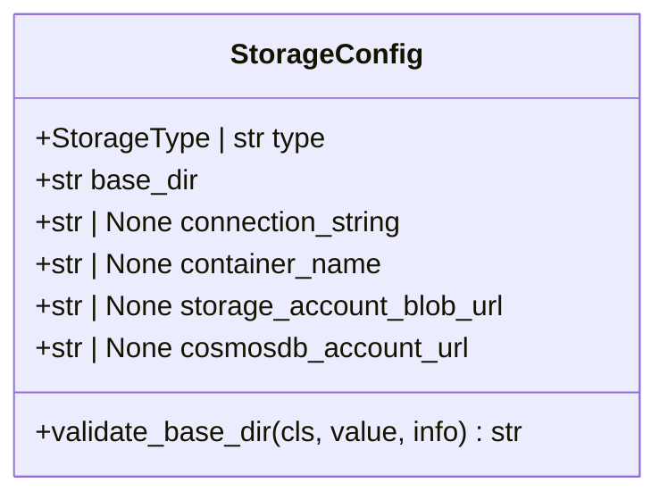
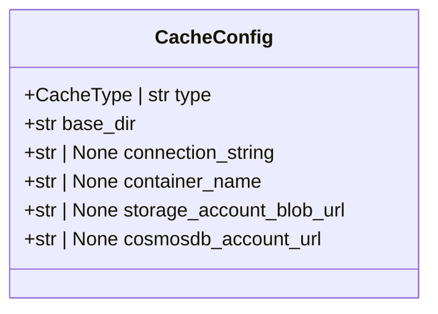
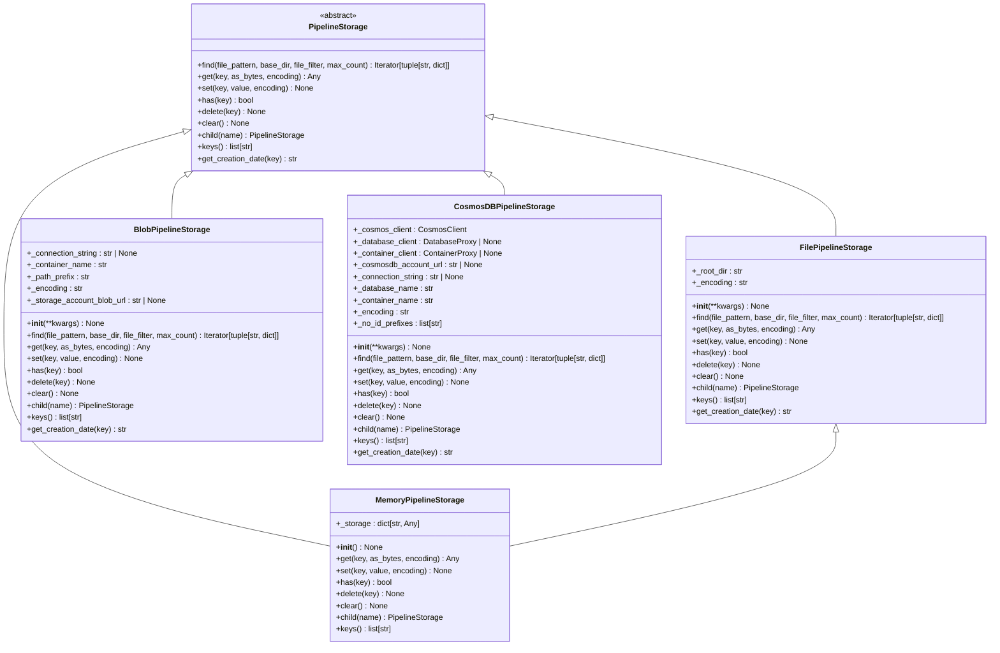
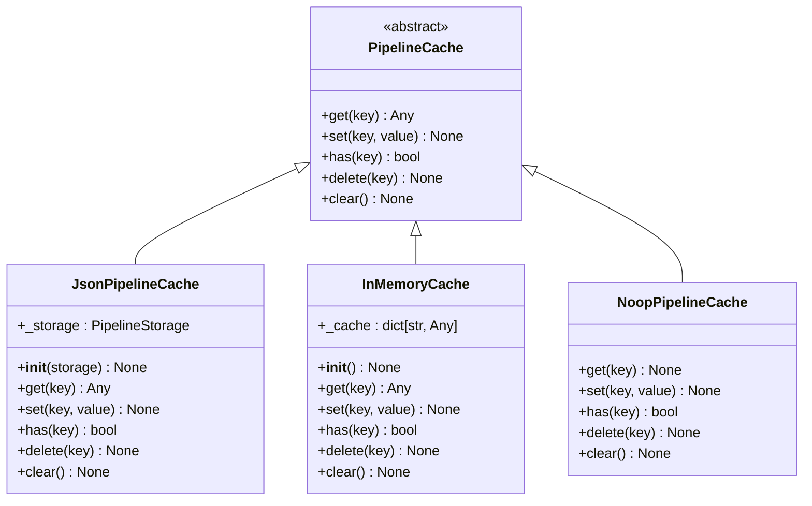
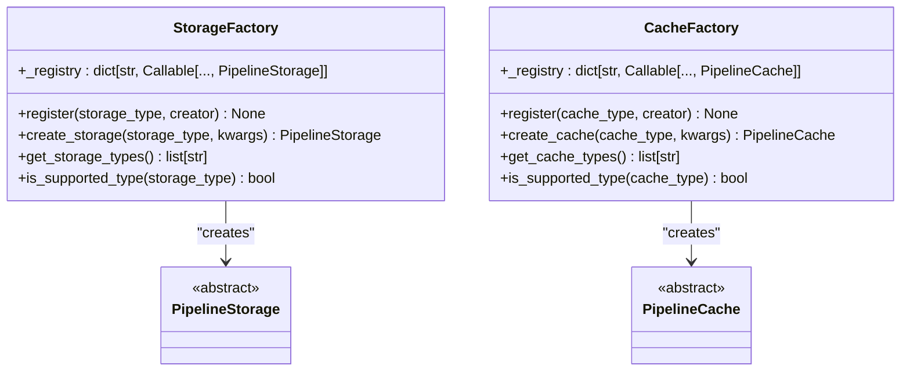
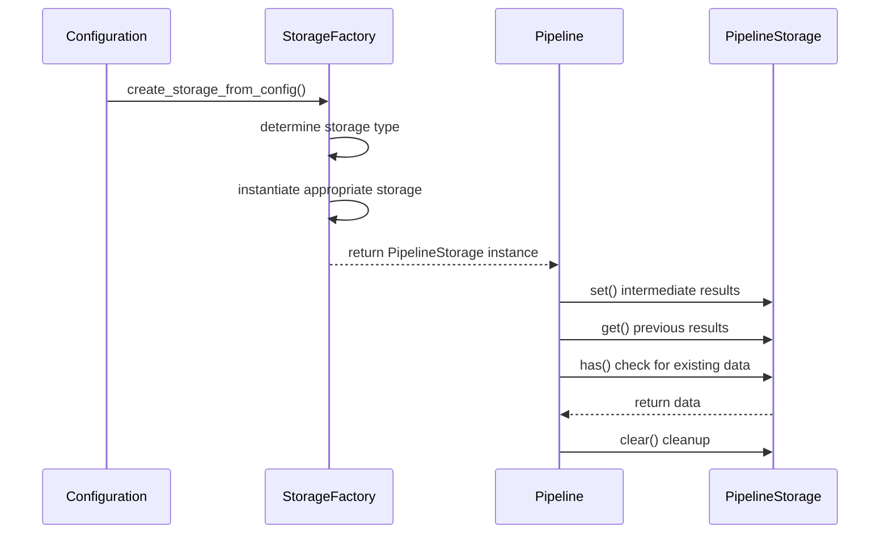

# Storage Configuration

<cite>
**Referenced Files in This Document**   
- [storage_config.py](file://graphrag/config/models/storage_config.py)
- [cache_config.py](file://graphrag/config/models/cache_config.py)
- [factory.py](file://graphrag/storage/factory.py)
- [cache/factory.py](file://graphrag/cache/factory.py)
- [file_pipeline_storage.py](file://graphrag/storage/file_pipeline_storage.py)
- [blob_pipeline_storage.py](file://graphrag/storage/blob_pipeline_storage.py)
- [cosmosdb_pipeline_storage.py](file://graphrag/storage/cosmosdb_pipeline_storage.py)
- [memory_pipeline_storage.py](file://graphrag/storage/memory_pipeline_storage.py)
- [pipeline_storage.py](file://graphrag/storage/pipeline_storage.py)
- [defaults.py](file://graphrag/config/defaults.py)
- [enums.py](file://graphrag/config/enums.py)
</cite>

## Table of Contents
1. [Introduction](#introduction)
2. [Storage Configuration Model](#storage-configuration-model)
3. [Cache Configuration Model](#cache-configuration-model)
4. [Storage Backends](#storage-backends)
5. [Caching Strategies](#caching-strategies)
6. [Factory Pattern Implementation](#factory-pattern-implementation)
7. [Configuration Examples](#configuration-examples)
8. [Pipeline Execution and Intermediate Results](#pipeline-execution-and-intermediate-results)
9. [Incremental Indexing and Storage](#incremental-indexing-and-storage)
10. [Performance Implications](#performance-implications)
11. [Best Practices for Production](#best-practices-for-production)
12. [Conclusion](#conclusion)

## Introduction
GraphRAG provides a flexible storage and caching system that supports multiple backends for both persistent storage and caching of intermediate results. This documentation details the configuration options, implementation patterns, and best practices for configuring storage and cache in GraphRAG. The system is designed to support various deployment scenarios from local development to cloud-based production environments, with configurable options for file-based, blob storage, CosmosDB, and in-memory storage.

**Section sources**
- [storage_config.py](file://graphrag/config/models/storage_config.py)
- [cache_config.py](file://graphrag/config/models/cache_config.py)

## Storage Configuration Model

The `StorageConfig` model in GraphRAG defines the configuration for storage backends used throughout the pipeline. It provides a consistent interface for different storage types while allowing specific configuration options for each backend.

The model includes the following key fields:

- **type**: Specifies the storage type to use, with supported values including "file", "blob", "cosmosdb", and "memory"
- **base_dir**: The base directory or container for the output, with a default value of "output"
- **connection_string**: Connection string for cloud storage services like Azure Blob Storage or CosmosDB
- **container_name**: Name of the storage container to use
- **storage_account_blob_url**: URL for the storage account blob service
- **cosmosdb_account_url**: URL for the CosmosDB account

The configuration model uses Pydantic for validation and includes a validator for the `base_dir` field that ensures it's a valid filesystem path when using local file storage. The default storage type is "file", making local file system storage the default option for ease of use in development environments.



**Diagram sources **
- [storage_config.py](file://graphrag/config/models/storage_config.py#L14-L53)

**Section sources**
- [storage_config.py](file://graphrag/config/models/storage_config.py#L1-L53)
- [enums.py](file://graphrag/config/enums.py#L45-L59)

## Cache Configuration Model

The `CacheConfig` model defines the configuration for caching strategies in GraphRAG. Similar to the storage configuration, it supports multiple cache backends and provides a consistent interface for cache operations.

Key fields in the `CacheConfig` model include:

- **type**: Specifies the cache type to use, with supported values including "file", "memory", "none", "blob", and "cosmosdb"
- **base_dir**: The base directory for the cache, with a default value of "cache"
- **connection_string**: Connection string for cloud-based cache storage
- **container_name**: Name of the container for cloud-based cache storage
- **storage_account_blob_url**: URL for the storage account blob service used for caching
- **cosmosdb_account_url**: URL for the CosmosDB account used for caching

The default cache type is "file", which stores cached results in the local file system under the "cache" directory. This provides a balance between performance and persistence, allowing intermediate results to be reused across pipeline runs without requiring cloud infrastructure.



**Diagram sources **
- [cache_config.py](file://graphrag/config/models/cache_config.py#L12-L39)

**Section sources**
- [cache_config.py](file://graphrag/config/models/cache_config.py#L1-L39)
- [enums.py](file://graphrag/config/enums.py#L11-L23)

## Storage Backends

GraphRAG supports multiple storage backends through a pluggable architecture. Each backend implements the `PipelineStorage` interface, ensuring consistent behavior across different storage types.

### File Storage
The file-based storage backend (`FilePipelineStorage`) stores data in the local file system. It creates directories as needed and supports asynchronous file operations through aiofiles. This backend is ideal for development and testing, as well as production environments where data locality is preferred.

Key characteristics:
- Stores files in the directory specified by `base_dir`
- Uses OS-independent path handling
- Supports file pattern matching for finding files
- Provides creation date information for stored items

### Azure Blob Storage
The blob storage backend (`BlobPipelineStorage`) integrates with Azure Blob Storage for cloud-based persistence. It requires either a connection string or a storage account blob URL for authentication, supporting both key-based and managed identity authentication.

Key requirements:
- `container_name` must be provided
- Either `connection_string` or `storage_account_blob_url` must be provided
- Container names must follow Azure naming rules (3-63 characters, lowercase letters, numbers, hyphens, no consecutive hyphens)

### CosmosDB Storage
The CosmosDB backend (`CosmosDBPipelineStorage`) uses Azure CosmosDB for storage, providing a NoSQL document database option. It stores data as JSON documents with the filename as the document ID.

Key characteristics:
- Uses `base_dir` as the database name
- Requires `container_name` for the container within the database
- Supports both connection string and URL-based authentication
- Automatically creates databases and containers if they don't exist

### Memory Storage
The in-memory storage backend (`MemoryPipelineStorage`) stores data in memory, extending the file storage implementation but using a dictionary instead of the file system. This backend is primarily used for testing and scenarios where ephemeral storage is sufficient.



**Diagram sources **
- [pipeline_storage.py](file://graphrag/storage/pipeline_storage.py#L13-L100)
- [file_pipeline_storage.py](file://graphrag/storage/file_pipeline_storage.py#L27-L172)
- [blob_pipeline_storage.py](file://graphrag/storage/blob_pipeline_storage.py#L23-L366)
- [cosmosdb_pipeline_storage.py](file://graphrag/storage/cosmosdb_pipeline_storage.py#L29-L364)
- [memory_pipeline_storage.py](file://graphrag/storage/memory_pipeline_storage.py#L14-L79)

**Section sources**
- [file_pipeline_storage.py](file://graphrag/storage/file_pipeline_storage.py#L1-L172)
- [blob_pipeline_storage.py](file://graphrag/storage/blob_pipeline_storage.py#L1-L366)
- [cosmosdb_pipeline_storage.py](file://graphrag/storage/cosmosdb_pipeline_storage.py#L1-L364)
- [memory_pipeline_storage.py](file://graphrag/storage/memory_pipeline_storage.py#L1-L79)

## Caching Strategies

GraphRAG provides multiple caching strategies to optimize pipeline performance by avoiding redundant computations. The cache system is configured through the `CacheConfig` model and implemented through the `CacheFactory`.

### File-Based Caching
File-based caching stores intermediate results in the local file system, typically in the "cache" directory. This strategy provides persistence across pipeline runs and is the default option. Each cached result is stored as a JSON file, allowing for easy inspection and debugging.

### Memory Caching
Memory caching stores results in RAM, providing the fastest access but with no persistence between pipeline runs. This strategy is useful for testing or when running multiple pipeline iterations in a single session.

### Blob and CosmosDB Caching
For cloud deployments, GraphRAG supports caching to Azure Blob Storage and CosmosDB. These options provide shared caching across multiple instances and persistence, making them suitable for distributed environments.

### No-Op Caching
The "none" cache type disables caching entirely, forcing all operations to recompute results. This can be useful for debugging or when storage space is limited.



**Diagram sources **
- [cache/pipeline_cache.py](file://graphrag/cache/pipeline_cache.py)
- [cache/json_pipeline_cache.py](file://graphrag/cache/json_pipeline_cache.py)
- [cache/memory_pipeline_cache.py](file://graphrag/cache/memory_pipeline_cache.py)
- [cache/noop_pipeline_cache.py](file://graphrag/cache/noop_pipeline_cache.py)

**Section sources**
- [cache/factory.py](file://graphrag/cache/factory.py#L24-L116)
- [cache/json_pipeline_cache.py](file://graphrag/cache/json_pipeline_cache.py)
- [cache/memory_pipeline_cache.py](file://graphrag/cache/memory_pipeline_cache.py)
- [cache/noop_pipeline_cache.py](file://graphrag/cache/noop_pipeline_cache.py)

## Factory Pattern Implementation

GraphRAG uses the factory pattern extensively to create storage and cache instances based on configuration. The `StorageFactory` and `CacheFactory` classes provide a clean interface for instantiating the appropriate backend without requiring the calling code to know the specific implementation details.

### Storage Factory
The `StorageFactory` class maintains a registry of storage implementations and provides a `create_storage` method that returns the appropriate `PipelineStorage` instance based on the configuration type. The factory registers built-in storage types during initialization:

- "file" → `FilePipelineStorage`
- "blob" → `BlobPipelineStorage`
- "cosmosdb" → `CosmosDBPipelineStorage`
- "memory" → `MemoryPipelineStorage`

The factory pattern allows for easy extension with custom storage implementations through the `register` method, enabling users to add support for additional storage backends without modifying the core code.

### Cache Factory
The `CacheFactory` works similarly but includes additional logic for creating cache instances. For file, blob, and CosmosDB caches, it creates a `JsonPipelineCache` wrapper around the corresponding storage backend. This design separates the caching logic from the storage mechanism, allowing any storage backend to be used for caching.

The cache factory also provides specialized creation functions:
- `create_file_cache`: Creates a file-based cache with a specified root directory
- `create_blob_cache`: Creates a blob storage-based cache
- `create_cosmosdb_cache`: Creates a CosmosDB-based cache
- `create_memory_cache`: Creates an in-memory cache
- `create_noop_cache`: Creates a no-op cache that disables caching



**Diagram sources **
- [factory.py](file://graphrag/storage/factory.py#L22-L84)
- [cache/factory.py](file://graphrag/cache/factory.py#L24-L116)

**Section sources**
- [factory.py](file://graphrag/storage/factory.py#L1-L84)
- [cache/factory.py](file://graphrag/cache/factory.py#L1-L116)

## Configuration Examples

### Local File Storage
For local development and testing, the default file-based storage configuration requires minimal setup:

```yaml
storage:
  type: file
  base_dir: "output"
  
cache:
  type: file
  base_dir: "cache"
```

This configuration stores all pipeline outputs in the "output" directory and caches intermediate results in the "cache" directory, both relative to the working directory.

### Azure Blob Storage
For cloud deployments using Azure Blob Storage:

```yaml
storage:
  type: blob
  container_name: "graphrag-output"
  storage_account_blob_url: "https://mystorageaccount.blob.core.windows.net"
  base_dir: "artifacts"
  
cache:
  type: blob
  container_name: "graphrag-cache"
  storage_account_blob_url: "https://mystorageaccount.blob.core.windows.net"
```

This configuration requires Azure authentication to be set up, either through environment variables or managed identities. The `storage_account_blob_url` should point to your Azure Storage account.

### CosmosDB Configuration
For using CosmosDB as the storage backend:

```yaml
storage:
  type: cosmosdb
  base_dir: "graphrag-database"
  container_name: "artifacts"
  cosmosdb_account_url: "https://mycosmosdb.documents.azure.com:443/"
  
cache:
  type: cosmosdb
  base_dir: "graphrag-cache-db"
  container_name: "cache"
  cosmosdb_account_url: "https://mycosmosdb.documents.azure.com:443/"
```

This configuration creates separate databases for storage and caching, each with their own containers. Authentication is handled through Azure managed identities.

**Section sources**
- [storage_config.py](file://graphrag/config/models/storage_config.py)
- [cache_config.py](file://graphrag/config/models/cache_config.py)
- [breaking-changes.md](file://breaking-changes.md#L83-L99)

## Pipeline Execution and Intermediate Results

Storage configuration directly impacts how intermediate results are handled during pipeline execution. The GraphRAG pipeline uses storage for several key purposes:

1. **Input Storage**: Loading source documents and configuration
2. **Output Storage**: Saving final artifacts like community reports, entity graphs, and embeddings
3. **Intermediate Storage**: Temporarily storing results between pipeline stages
4. **State Storage**: Maintaining pipeline state for resumable operations

During pipeline execution, the system creates a `PipelineRunContext` that includes input, output, and previous storage instances, along with a cache. The choice of storage backend affects performance, with in-memory storage providing the fastest access but file and cloud storage offering persistence.

The pipeline also uses storage for logging and reporting, with the `reporting` configuration section specifying where logs and progress information should be stored. This separation allows different storage strategies for different types of data.



**Diagram sources **
- [run_pipeline.py](file://graphrag/index/run/run_pipeline.py#L40-L139)
- [utils.py](file://graphrag/index/run/utils.py#L20-L61)

**Section sources**
- [run_pipeline.py](file://graphrag/index/run/run_pipeline.py#L1-L139)
- [utils.py](file://graphrag/index/run/utils.py#L1-L61)

## Incremental Indexing and Storage

GraphRAG supports incremental indexing, which requires careful storage management to handle updates to existing knowledge graphs. The storage system plays a crucial role in this process by maintaining both the current index and delta changes.

When performing an incremental update, the system:

1. Creates a timestamped storage location for the update
2. Stores delta changes in a "delta" subdirectory
3. Preserves the previous state in a "previous" subdirectory
4. Merges changes with the existing index

This approach allows for rollback capabilities and comparison between versions. The `get_update_storages` function in `run/utils.py` handles the creation of these storage hierarchies, using the `child` method to create nested storage instances.

The storage backend must support the operations needed for incremental indexing, including:
- Atomic writes to prevent corruption
- Consistent reads during updates
- Efficient storage of partial updates
- Versioning or timestamping capabilities

File-based storage handles this through directory structure, while cloud storage backends leverage their native versioning and container features.

**Section sources**
- [run_pipeline.py](file://graphrag/index/run/run_pipeline.py#L51-L63)
- [utils.py](file://graphrag/index/run/utils.py#L51-L61)

## Performance Implications

The choice of storage backend has significant performance implications for GraphRAG pipelines:

### File Storage
- **Pros**: Simple setup, good performance for local access, persistent storage
- **Cons**: Limited scalability, potential I/O bottlenecks with large datasets
- **Best for**: Development, small to medium datasets, single-machine deployments

### Blob Storage
- **Pros**: High scalability, global accessibility, integrated with Azure services
- **Cons**: Network latency, potential costs for frequent access
- **Best for**: Cloud deployments, distributed processing, large datasets

### CosmosDB
- **Pros**: High performance, global distribution, automatic indexing
- **Cons**: Higher cost, complexity in management
- **Best for**: High-throughput scenarios, real-time applications, global deployments

### Memory Storage
- **Pros**: Fastest access, low latency
- **Cons**: No persistence, limited by available RAM
- **Best for**: Testing, short-lived processes, performance-critical sections

Caching strategies also impact performance significantly. File-based caching provides a good balance, while memory caching offers the best performance for repeated operations. Cloud-based caching enables shared caches across multiple instances but introduces network latency.

**Section sources**
- [storage_config.py](file://graphrag/config/models/storage_config.py)
- [cache_config.py](file://graphrag/config/models/cache_config.py)
- [defaults.py](file://graphrag/config/defaults.py)

## Best Practices for Production

### Backup Strategies
For production deployments, implement regular backups of storage directories:
- For file storage: Use standard backup tools to archive the output and cache directories
- For blob storage: Enable blob versioning and configure lifecycle management
- For CosmosDB: Use built-in backup and restore capabilities

### Access Control
Implement appropriate access controls:
- Use managed identities for cloud storage instead of connection strings
- Limit permissions to the minimum required for the application
- Rotate credentials regularly
- Use private endpoints for cloud storage when possible

### Monitoring and Maintenance
- Monitor storage usage and set up alerts for capacity thresholds
- Implement cleanup policies for old cache entries
- Regularly validate data integrity
- Monitor performance metrics to identify bottlenecks

### Configuration Management
- Store configuration files in version control (excluding secrets)
- Use environment variables for sensitive information like connection strings
- Implement configuration validation before pipeline execution
- Document configuration changes and their rationale

**Section sources**
- [storage_config.py](file://graphrag/config/models/storage_config.py)
- [cache_config.py](file://graphrag/config/models/cache_config.py)
- [factory.py](file://graphrag/storage/factory.py)

## Conclusion
GraphRAG's storage and caching system provides a flexible foundation for knowledge graph construction and querying. By supporting multiple backends and a clean factory pattern implementation, it accommodates various deployment scenarios from local development to cloud-scale production. The separation of storage and caching concerns allows for optimized configurations that balance performance, cost, and reliability. When configuring storage for production use, consider the specific requirements of your use case, including data volume, access patterns, and availability needs, to select the most appropriate backend and caching strategy.