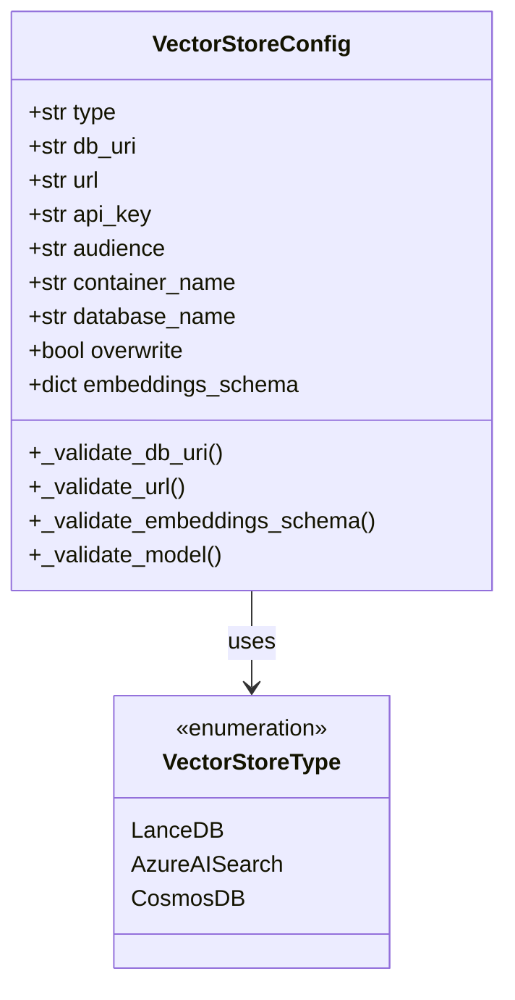
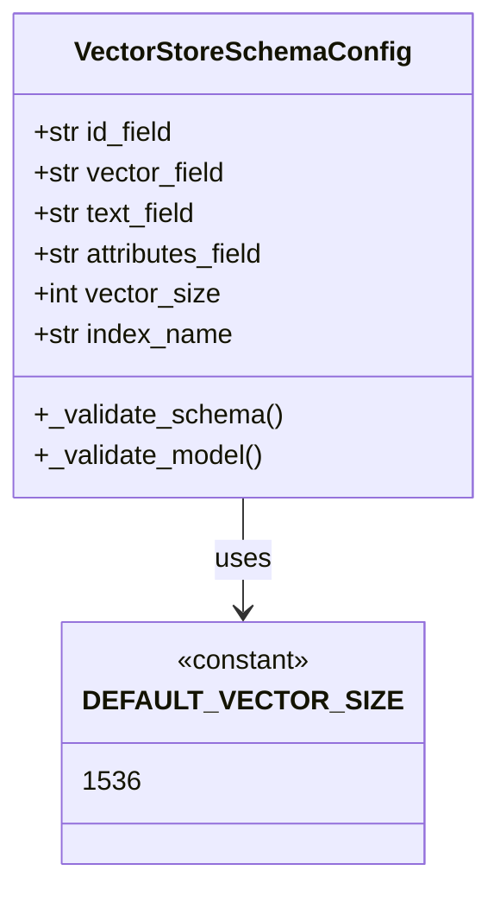
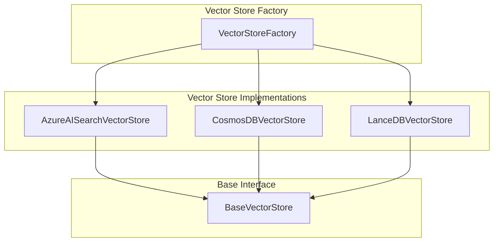
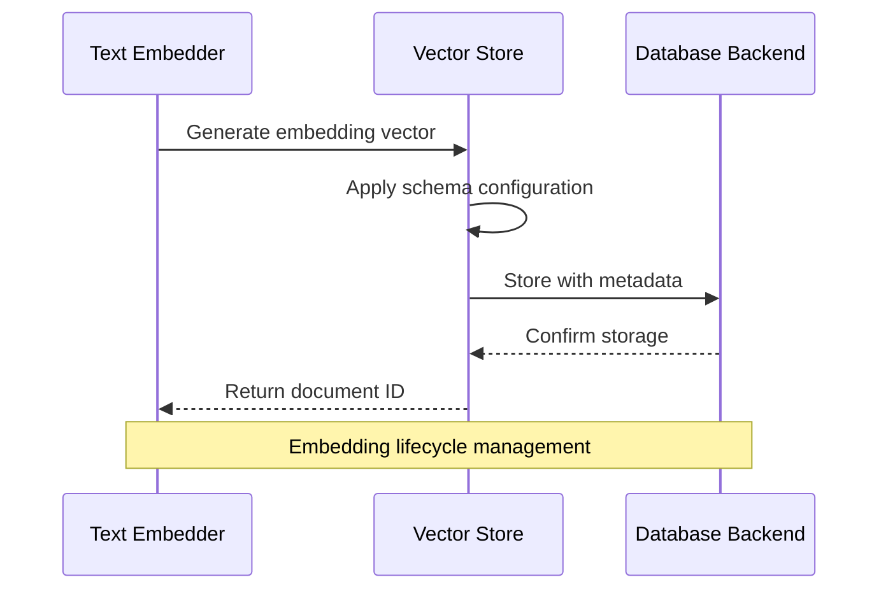

# Vector Store Configuration

<cite>
**Referenced Files in This Document**
- [vector_store_config.py](file://graphrag/config/models/vector_store_config.py)
- [vector_store_schema_config.py](file://graphrag/config/models/vector_store_schema_config.py)
- [azure_ai_search.py](file://graphrag/vector_stores/azure_ai_search.py)
- [cosmosdb.py](file://graphrag/vector_stores/cosmosdb.py)
- [lancedb.py](file://graphrag/vector_stores/lancedb.py)
- [factory.py](file://graphrag/vector_stores/factory.py)
- [base.py](file://graphrag/vector_stores/base.py)
- [enums.py](file://graphrag/config/enums.py)
- [defaults.py](file://graphrag/config/defaults.py)
- [embed_text.py](file://graphrag/index/operations/embed_text/embed_text.py)
- [test_azure_ai_search.py](file://tests/integration/vector_stores/test_azure_ai_search.py)
- [test_cosmosdb.py](file://tests/integration/vector_stores/test_cosmosdb.py)
</cite>

## Table of Contents
1. [Introduction](#introduction)
2. [VectorStoreConfig Model](#vectorstoreconfig-model)
3. [VectorStoreSchemaConfig Model](#vectorstoreschemacomfig-model)
4. [Supported Vector Stores](#supported-vector-stores)
5. [Configuration Examples](#configuration-examples)
6. [Relationship Between Embeddings and Vector Stores](#relationship-between-embeddings-and-vector-stores)
7. [Common Configuration Errors](#common-configuration-errors)
8. [Performance Tuning and Best Practices](#performance-tuning-and-best-practices)
9. [Production Deployment Guidelines](#production-deployment-guidelines)
10. [Troubleshooting Guide](#troubleshooting-guide)

## Introduction

GraphRAG's vector store configuration system provides flexible and robust storage solutions for text embeddings and vector-based search operations. The system supports multiple vector database backends including Azure AI Search, CosmosDB, and LanceDB, each optimized for different deployment scenarios and performance requirements.

The configuration architecture consists of two primary models: `VectorStoreConfig` for connection and operational settings, and `VectorStoreSchemaConfig` for defining index fields, vector dimensions, and search configurations. This separation allows for fine-grained control over both connectivity and schema design while maintaining flexibility across different vector store implementations.

## VectorStoreConfig Model

The `VectorStoreConfig` class serves as the primary configuration interface for vector store connections and operational parameters. It encapsulates all necessary settings for establishing connections and managing data persistence across different vector store backends.

### Core Configuration Fields



**Diagram sources**
- [vector_store_config.py](file://graphrag/config/models/vector_store_config.py#L14-L112)
- [enums.py](file://graphrag/config/enums.py#L62-L68)

### Field Descriptions

| Field | Type | Description | Default |
|-------|------|-------------|---------|
| `type` | `str` | Vector store backend type | `"lancedb"` |
| `db_uri` | `str \| None` | Database URI for LanceDB connections | `None` |
| `url` | `str \| None` | Database URL for Azure AI Search/CosmosDB | `None` |
| `api_key` | `str \| None` | Authentication key for Azure AI Search | `None` |
| `audience` | `str \| None` | Audience for Azure AI Search authentication | `None` |
| `container_name` | `str` | Container name for CosmosDB | `"default"` |
| `database_name` | `str \| None` | Database name for CosmosDB | `None` |
| `overwrite` | `bool` | Whether to overwrite existing data | `True` |
| `embeddings_schema` | `dict[str, VectorStoreSchemaConfig]` | Schema configurations for different embeddings | `{}` |

### Validation Logic

The configuration model implements comprehensive validation to ensure proper setup:

- **URI Validation**: Ensures `db_uri` is provided for LanceDB and excluded for other types
- **URL Validation**: Requires `url` for Azure AI Search and CosmosDB, excludes for LanceDB
- **Schema Validation**: Validates embedding schema names and CosmosDB-specific constraints

**Section sources**
- [vector_store_config.py](file://graphrag/config/models/vector_store_config.py#L14-L112)

## VectorStoreSchemaConfig Model

The `VectorStoreSchemaConfig` class defines the logical schema for vector store indexes, specifying field mappings, vector dimensions, and search parameters. This model enables customization of how data is stored and retrieved across different vector store implementations.

### Schema Configuration Fields



**Diagram sources**
- [vector_store_schema_config.py](file://graphrag/config/models/vector_store_schema_config.py#L20-L67)

### Field Specifications

| Field | Type | Default | Purpose |
|-------|------|---------|---------|
| `id_field` | `str` | `"id"` | Unique identifier field |
| `vector_field` | `str` | `"vector"` | Vector data field |
| `text_field` | `str` | `"text"` | Text content field |
| `attributes_field` | `str` | `"attributes"` | Metadata storage field |
| `vector_size` | `int` | `1536` | Vector dimension size |
| `index_name` | `str \| None` | `None` | Index/table name |

### Field Naming Validation

The schema configuration includes strict field naming validation to prevent security issues:

- **Regex Pattern**: `^[A-Za-z_][A-Za-z0-9_]*$`
- **Purpose**: Prevents SQL injection and ensures compatibility across vector store backends
- **Validation Function**: `is_valid_field_name()` validates CosmosDB field names

**Section sources**
- [vector_store_schema_config.py](file://graphrag/config/models/vector_store_schema_config.py#L15-L67)

## Supported Vector Stores

GraphRAG supports three primary vector store backends, each with distinct characteristics and optimal use cases.

### Architecture Overview



**Diagram sources**
- [factory.py](file://graphrag/vector_stores/factory.py#L24-L97)
- [base.py](file://graphrag/vector_stores/base.py#L39-L91)

### Azure AI Search

Azure AI Search provides enterprise-grade vector search capabilities with hybrid search functionality combining semantic and keyword matching.

#### Connection Parameters
- **URL**: Search service endpoint
- **API Key**: Authentication key
- **Audience**: Optional audience specification for managed identity
- **Index Name**: Search index configuration

#### Features
- **Hybrid Search**: Combines vector and keyword search
- **Scalability**: Automatic scaling and high availability
- **Security**: Built-in authentication and encryption
- **Analytics**: Built-in search analytics and monitoring

#### Implementation Details
- Uses HNSW (Hierarchical Navigable Small World) algorithm
- Supports cosine similarity scoring
- Configurable vector search profiles
- Automatic index creation and management

**Section sources**
- [azure_ai_search.py](file://graphrag/vector_stores/azure_ai_search.py#L36-L215)

### CosmosDB

Azure Cosmos DB offers globally distributed, multi-model database with native vector search capabilities.

#### Connection Options
- **Connection String**: Full connection string with credentials
- **URL + Managed Identity**: Service principal authentication
- **Database Name**: Target database specification

#### Vector Search Features
- **DiskANN Algorithm**: Optimized for large-scale vector search
- **Cosine Distance**: Native cosine similarity calculation
- **Partition Keys**: Automatic partitioning for scalability
- **Cross-Partition Queries**: Flexible query capabilities

#### Limitations and Workarounds
- **Emulator Support**: Falls back to manual similarity calculation in emulator
- **Field Constraints**: Enforces `id_field` must be `"id"`
- **Index Management**: Automatic vector indexing policy creation

**Section sources**
- [cosmosdb.py](file://graphrag/vector_stores/cosmosdb.py#L23-L286)

### LanceDB

LanceDB provides embedded vector database with local deployment capabilities.

#### Connection Parameters
- **DB URI**: File system path or remote storage URI
- **Table Names**: Dynamic table creation and management
- **File Format**: Arrow-based columnar storage

#### Advantages
- **Embedded**: No external dependencies required
- **Lightweight**: Minimal resource requirements
- **Portable**: Easy deployment and migration
- **Performance**: Optimized for local access patterns

#### Implementation Features
- **IVF_FLAT Indexing**: Efficient approximate nearest neighbor search
- **PyArrow Integration**: Native Arrow format support
- **Dynamic Schema**: Automatic schema inference
- **Batch Operations**: Optimized bulk loading

**Section sources**
- [lancedb.py](file://graphrag/vector_stores/lancedb.py#L21-L177)

## Configuration Examples

### Azure AI Search Configuration

```yaml
vector_store:
  type: "azure_ai_search"
  url: "https://your-search-service.search.windows.net"
  api_key: "${AZURE_AI_SEARCH_API_KEY}"
  audience: "https://search.azure.com"
  container_name: "graphrag-container"
  overwrite: true
  
  embeddings_schema:
    default:
      index_name: "documents"
      vector_size: 1536
      id_field: "id"
      vector_field: "vector"
      text_field: "content"
      attributes_field: "metadata"
```

### CosmosDB Configuration

```yaml
vector_store:
  type: "cosmosdb"
  url: "https://your-cosmosdb-account.documents.azure.com:443/"
  database_name: "graphrag-db"
  container_name: "documents"
  overwrite: false
  
  embeddings_schema:
    default:
      index_name: "embeddings"
      vector_size: 1536
      id_field: "id"
      vector_field: "vector"
      text_field: "text"
      attributes_field: "attributes"
```

### LanceDB Configuration

```yaml
vector_store:
  type: "lancedb"
  db_uri: "./vector_store/lancedb"
  container_name: "default"
  overwrite: true
  
  embeddings_schema:
    default:
      index_name: "documents"
      vector_size: 1536
      id_field: "id"
      vector_field: "vector"
      text_field: "text"
      attributes_field: "metadata"
```

### Multi-Embedding Configuration

```yaml
vector_store:
  type: "azure_ai_search"
  url: "${AZURE_AI_SEARCH_ENDPOINT}"
  api_key: "${AZURE_AI_SEARCH_KEY}"
  
  embeddings_schema:
    text-embeddings:
      index_name: "text-embeddings"
      vector_size: 1536
      id_field: "id"
      vector_field: "vector"
      text_field: "text"
      attributes_field: "metadata"
    
    image-embeddings:
      index_name: "image-embeddings"
      vector_size: 768
      id_field: "id"
      vector_field: "image_vector"
      text_field: "caption"
      attributes_field: "image_metadata"
```

## Relationship Between Embeddings and Vector Stores

The vector store configuration establishes the critical link between text embeddings and persistent storage, enabling efficient retrieval and search operations.

### Embedding-to-Vector Store Mapping



**Diagram sources**
- [embed_text.py](file://graphrag/index/operations/embed_text/embed_text.py#L186-L217)

### Schema Configuration Impact

The `embeddings_schema` dictionary enables multiple embedding configurations within a single vector store:

- **Multiple Indexes**: Different embedding types can use separate indexes
- **Custom Fields**: Each embedding type can define custom field mappings
- **Dimension Flexibility**: Different vector sizes for different embedding models
- **Index Isolation**: Logical separation of embedding types

### Vector Size Consistency

Consistent vector sizing is crucial for search performance:

- **Validation**: Vector store validates that all embeddings use compatible dimensions
- **Compatibility**: Embedding models must produce vectors matching configured size
- **Performance**: Homogeneous vector sizes optimize search algorithms

**Section sources**
- [embed_text.py](file://graphrag/index/operations/embed_text/embed_text.py#L186-L217)

## Common Configuration Errors

Understanding and resolving common configuration issues is essential for successful vector store deployment.

### Authentication Failures

#### Azure AI Search Authentication Issues

```python
# Incorrect: Missing URL
vector_store_config = {
    "type": "azure_ai_search",
    # Missing "url" field
    "api_key": "valid_key"
}

# Correct: Complete authentication setup
vector_store_config = {
    "type": "azure_ai_search",
    "url": "https://search-service.search.windows.net",
    "api_key": "valid_key",
    "audience": "https://search.azure.com"
}
```

#### CosmosDB Authentication Problems

```python
# Incorrect: Both connection string and URL provided
vector_store_config = {
    "type": "cosmosdb",
    "url": "https://account.documents.azure.com:443/",
    "connection_string": "full_connection_string",
    "database_name": "db"
}

# Correct: Choose one authentication method
vector_store_config = {
    "type": "cosmosdb",
    "url": "https://account.documents.azure.com:443/",
    "database_name": "db"
}
```

### Vector Size Mismatches

#### Inconsistent Embedding Dimensions

```python
# Configuration with mismatched vector sizes
embeddings_schema = {
    "text_embeddings": {
        "vector_size": 1536  # OpenAI embeddings
    },
    "custom_embeddings": {
        "vector_size": 768  # Custom model
    }
}

# Resolution: Use compatible embedding models
embeddings_schema = {
    "text_embeddings": {
        "vector_size": 1536
    },
    "image_embeddings": {
        "vector_size": 1536  # Match text embeddings
    }
}
```

### Index Naming Conflicts

#### CosmosDB Field Constraints

```python
# Incorrect: Invalid field name for CosmosDB
schema_config = {
    "id_field": "document_id",  # Not allowed in CosmosDB
    "vector_field": "embedding_vector",
    "text_field": "content",
    "attributes_field": "metadata"
}

# Correct: Use allowed field names
schema_config = {
    "id_field": "id",  # Must be 'id' for CosmosDB
    "vector_field": "vector",
    "text_field": "text",
    "attributes_field": "attributes"
}
```

### Connection Parameter Validation

The configuration system performs comprehensive validation:

- **Required Fields**: Ensures mandatory parameters are provided
- **Type Checking**: Validates parameter types and formats
- **Constraint Enforcement**: Applies backend-specific constraints
- **Cross-Validation**: Checks relationships between parameters

**Section sources**
- [vector_store_config.py](file://graphrag/config/models/vector_store_config.py#L27-L111)

## Performance Tuning and Best Practices

Optimizing vector store performance requires careful consideration of both configuration parameters and operational patterns.

### Vector Store Selection Criteria

| Store Type | Best For | Performance Characteristics |
|------------|----------|---------------------------|
| **Azure AI Search** | Enterprise scale, hybrid search | High throughput, automatic scaling |
| **CosmosDB** | Global distribution, multi-region | Low latency, strong consistency |
| **LanceDB** | Local deployment, offline use | Minimal overhead, fast local access |

### Index Optimization Strategies

#### Azure AI Search Performance

```yaml
vector_store:
  type: "azure_ai_search"
  embeddings_schema:
    default:
      index_name: "optimized-index"
      vector_size: 1536
      
      # Optimize for search performance
      vector_search_profile: "high-performance-profile"
```

#### CosmosDB Vector Indexing

```yaml
vector_store:
  type: "cosmosdb"
  embeddings_schema:
    default:
      index_name: "cosmic-index"
      vector_size: 1536
      
      # Enable vector indexing
      vector_indexing_policy: "diskANN"
```

### Memory and Storage Considerations

#### Vector Dimension Impact

- **1536 dimensions**: Standard OpenAI embeddings, good balance
- **768 dimensions**: Smaller models, reduced storage requirements
- **3072+ dimensions**: High-quality models, increased computational cost

#### Batch Operation Optimization

```python
# Efficient batch loading
vector_store.load_documents(documents, overwrite=True)

# Incremental updates
vector_store.load_documents(new_documents, overwrite=False)
```

### Monitoring and Metrics

Key performance indicators to monitor:

- **Query Latency**: Average response time for similarity searches
- **Throughput**: Documents processed per second
- **Memory Usage**: Vector store memory consumption
- **Index Size**: Storage requirements for vector indices

## Production Deployment Guidelines

Successful production deployment requires attention to reliability, scalability, and maintenance considerations.

### Environment Configuration

#### Development vs Production

```yaml
# Development environment
vector_store:
  type: "lancedb"
  db_uri: "./dev-data/vector_store"
  overwrite: true

# Production environment  
vector_store:
  type: "azure_ai_search"
  url: "${PROD_AZURE_SEARCH_URL}"
  api_key: "${PROD_AZURE_SEARCH_KEY}"
  overwrite: false
```

#### Security Best Practices

- **Secret Management**: Use environment variables or secret management systems
- **Network Security**: Implement proper firewall and network isolation
- **Access Control**: Use least-privilege authentication
- **Encryption**: Enable encryption at rest and in transit

### Scalability Planning

#### Horizontal Scaling Considerations

```yaml
vector_store:
  type: "cosmosdb"
  url: "${COSMOSDB_ENDPOINT}"
  database_name: "graphrag-prod"
  container_name: "documents"
  
  # Configure for high throughput
  throughput: "40000"  # RU/s capacity
```

#### Capacity Planning

- **Storage Growth**: Plan for 10-20% annual growth rate
- **Query Volume**: Monitor and provision for peak loads
- **Index Maintenance**: Schedule regular index optimization
- **Backup Strategy**: Implement automated backup and recovery

### Operational Procedures

#### Health Monitoring

```python
# Health check implementation
def check_vector_store_health():
    try:
        vector_store.connect(**config)
        # Test basic operations
        vector_store.similarity_search_by_vector([0.1] * 1536, k=1)
        return True
    except Exception as e:
        logger.error(f"Vector store health check failed: {e}")
        return False
```

#### Maintenance Tasks

- **Index Rebuilding**: Periodic index optimization
- **Data Archiving**: Move old data to cold storage
- **Performance Tuning**: Adjust parameters based on usage patterns
- **Capacity Planning**: Monitor growth and plan expansions

## Troubleshooting Guide

Common issues and their resolutions help maintain system reliability and performance.

### Connection Issues

#### Diagnostic Steps

1. **Verify Credentials**: Check API keys and connection strings
2. **Network Connectivity**: Test endpoint accessibility
3. **Firewall Rules**: Ensure proper port access
4. **Rate Limits**: Monitor for throttling

#### Common Solutions

```python
# Connection troubleshooting
try:
    vector_store.connect(**config)
except ConnectionError as e:
    logger.error(f"Connection failed: {e}")
    # Implement retry logic with exponential backoff
```

### Performance Issues

#### Slow Query Performance

- **Index Verification**: Ensure vector indexes are properly created
- **Query Optimization**: Reduce K-nearest neighbors when appropriate
- **Batch Size**: Optimize document batch sizes
- **Resource Allocation**: Check CPU and memory usage

#### Memory Exhaustion

```python
# Memory monitoring
import psutil

def monitor_memory_usage():
    memory = psutil.virtual_memory()
    if memory.percent > 80:
        logger.warning(f"High memory usage: {memory.percent}%")
        # Trigger cleanup or scaling
```

### Data Integrity Issues

#### Vector Corruption Detection

```python
# Vector validation
def validate_vector_dimension(vector, expected_size):
    if len(vector) != expected_size:
        raise ValueError(f"Vector dimension mismatch: {len(vector)} != {expected_size}")
```

#### Schema Migration

When upgrading vector store schemas:

1. **Backup Existing Data**: Create full backup before migration
2. **Test Migration**: Validate on staging environment first
3. **Gradual Rollout**: Migrate incrementally to minimize downtime
4. **Rollback Plan**: Prepare rollback procedures

### Error Recovery Patterns

#### Automatic Retry Logic

```python
import time
from functools import wraps

def retry_on_failure(max_attempts=3, delay=1):
    def decorator(func):
        @wraps(func)
        def wrapper(*args, **kwargs):
            for attempt in range(max_attempts):
                try:
                    return func(*args, **kwargs)
                except Exception as e:
                    if attempt == max_attempts - 1:
                        raise
                    time.sleep(delay * (2 ** attempt))
            return None
        return wrapper
    return decorator
```

**Section sources**
- [test_azure_ai_search.py](file://tests/integration/vector_stores/test_azure_ai_search.py#L1-L244)
- [test_cosmosdb.py](file://tests/integration/vector_stores/test_cosmosdb.py#L1-L167)