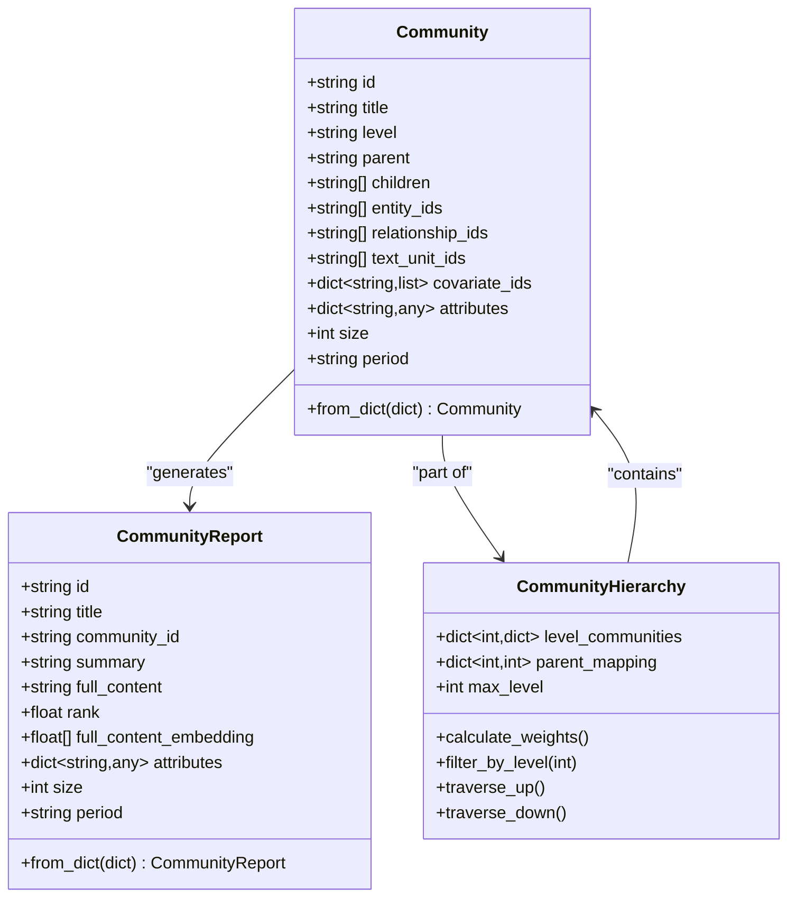
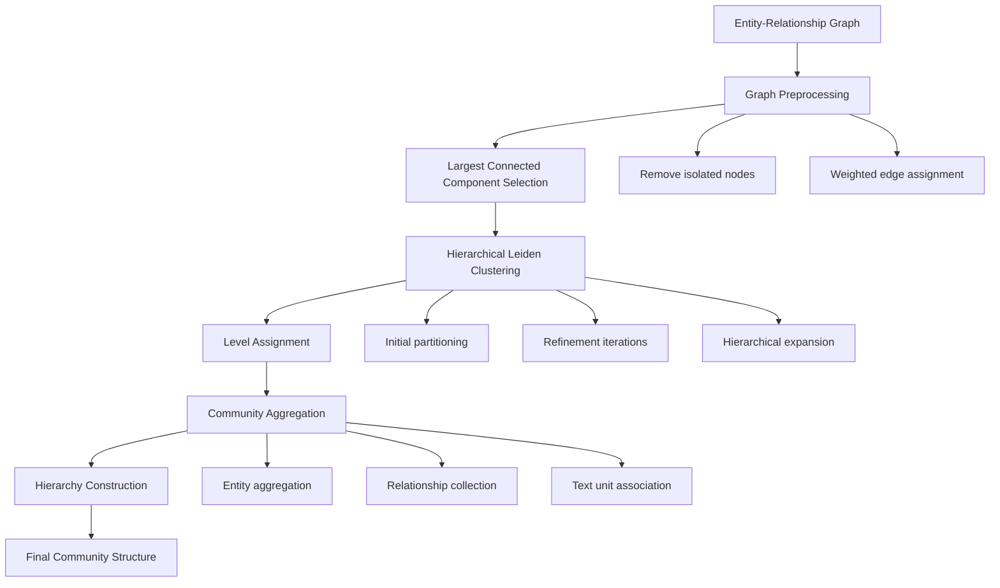
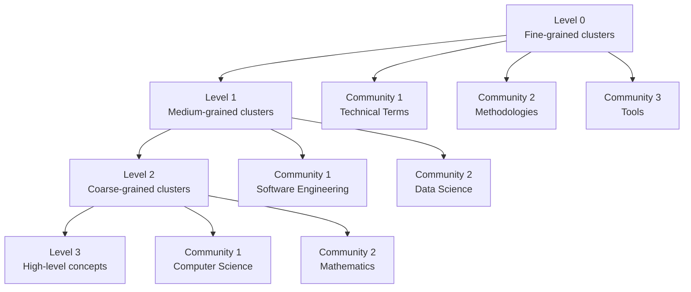
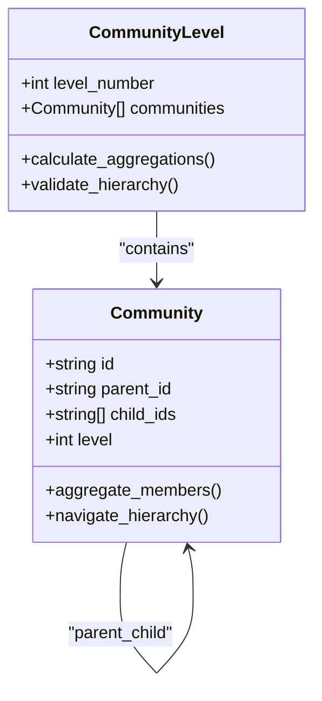
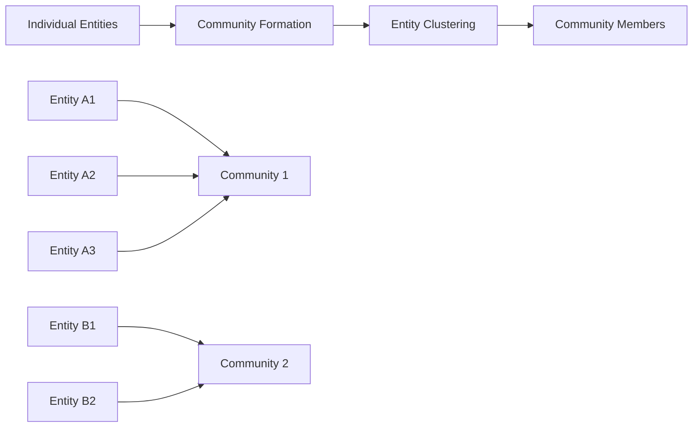
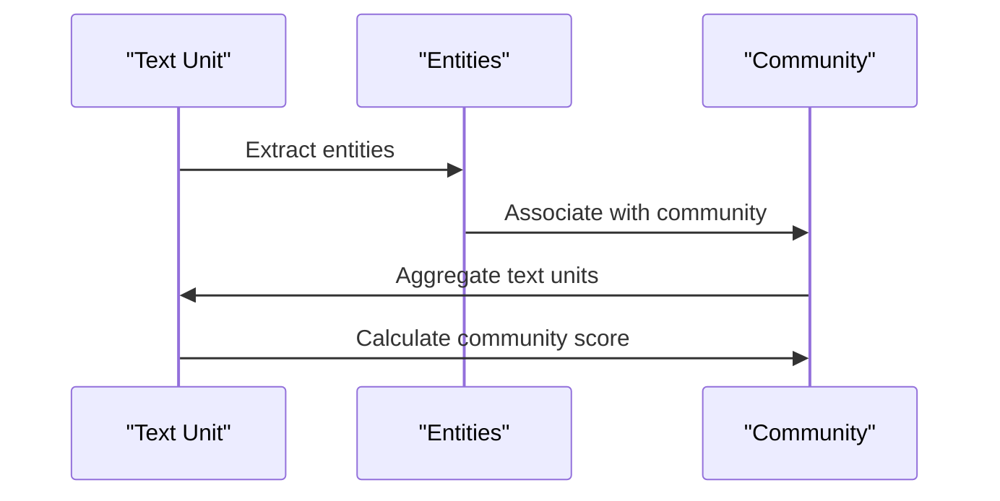
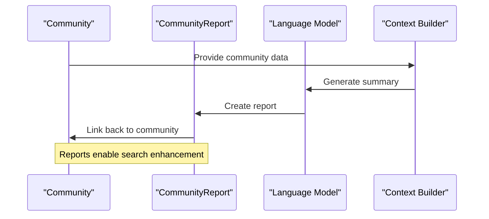
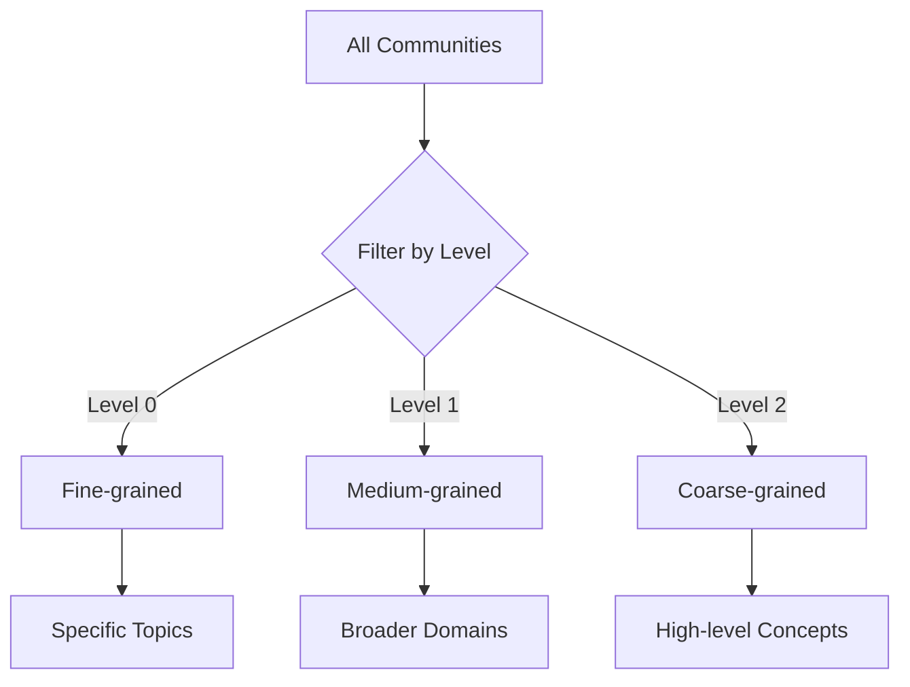
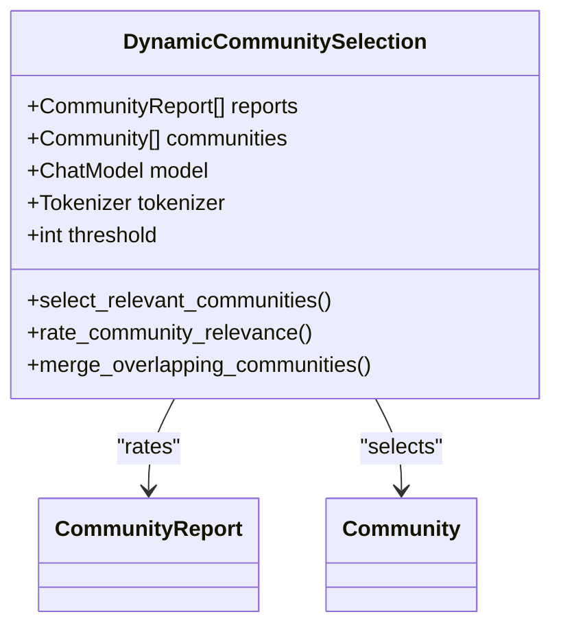

# Community Model

<cite>
**Referenced Files in This Document**
- [community.py](file://graphrag/data_model/community.py)
- [community_report.py](file://graphrag/data_model/community_report.py)
- [schemas.py](file://graphrag/data_model/schemas.py)
- [create_communities.py](file://graphrag/index/workflows/create_communities.py)
- [cluster_graph.py](file://graphrag/index/operations/cluster_graph.py)
- [community_context.py](file://graphrag/query/context_builder/community_context.py)
- [dynamic_community_selection.py](file://graphrag/query/context_builder/dynamic_community_selection.py)
- [indexer_adapters.py](file://graphrag/query/indexer_adapters.py)
- [cluster_graph_config.py](file://graphrag/config/models/cluster_graph_config.py)
- [create_community_reports.py](file://graphrag/index/workflows/create_community_reports.py)
- [create_community_reports_text.py](file://graphrag/index/workflows/create_community_reports_text.py)
- [update_communities.py](file://graphrag/index/workflows/update_communities.py)
- [communities.py](file://graphrag/index/update/communities.py)
</cite>

## Table of Contents
1. [Introduction](#introduction)
2. [Community Model Architecture](#community-model-architecture)
3. [Core Fields and Structure](#core-fields-and-structure)
4. [Hierarchical Clustering Formation](#hierarchical-clustering-formation)
5. [Multi-Level Community Hierarchy](#multi-level-community-hierarchy)
6. [Community Aggregation and Relationships](#community-aggregation-and-relationships)
7. [Integration with Community Reports](#integration-with-community-reports)
8. [Community Traversal and Filtering](#community-traversal-and-filtering)
9. [Performance and Scalability](#performance-and-scalability)
10. [Common Challenges and Solutions](#common-challenges-and-solutions)
11. [Practical Usage Examples](#practical-usage-examples)
12. [Configuration and Tuning](#configuration-and-tuning)

## Introduction

The Community model in GraphRAG represents clusters of semantically related entities and relationships that form the backbone of the system's hierarchical knowledge organization. Communities enable scalable global search by organizing entities into meaningful groups while maintaining the ability to traverse between different levels of abstraction.

Communities are formed through sophisticated hierarchical clustering algorithms, primarily using the Leiden algorithm, which creates multi-level hierarchies that capture both fine-grained and coarse-grained relationships within the knowledge graph. This hierarchical structure allows users to navigate from specific entities to broader conceptual groupings, enhancing both search precision and recall.

## Community Model Architecture

The Community model is built around a hierarchical tree structure that enables efficient navigation and aggregation of related entities. The architecture supports multiple levels of granularity, allowing for both detailed local searches and broad global overviews.



**Diagram sources**
- [community.py](file://graphrag/data_model/community.py#L12-L80)
- [community_report.py](file://graphrag/data_model/community_report.py#L12-L68)

**Section sources**
- [community.py](file://graphrag/data_model/community.py#L12-L80)
- [community_report.py](file://graphrag/data_model/community_report.py#L12-L68)

## Core Fields and Structure

### Essential Community Fields

The Community model contains several key fields that define its structure and capabilities:

| Field | Type | Description | Purpose |
|-------|------|-------------|---------|
| `id` | string | Unique identifier | Primary key for community identification |
| `title` | string | Human-readable name | Display name for community representation |
| `level` | string | Hierarchical level | Indicates position in community hierarchy |
| `parent` | string | Parent community ID | References higher-level community |
| `children` | list[string] | Child community IDs | References lower-level communities |

### Relationship and Content Fields

Communities aggregate various types of content and relationships:

| Field | Type | Description | Usage |
|-------|------|-------------|-------|
| `entity_ids` | list[string] | Related entity identifiers | Links to constituent entities |
| `relationship_ids` | list[string] | Related relationship identifiers | Links to connecting relationships |
| `text_unit_ids` | list[string] | Related text unit identifiers | Links to source text chunks |
| `covariate_ids` | dict[string,list] | Covariate type mappings | Links to temporal/categorical data |

### Metadata and Attributes

Additional fields provide contextual information and customization capabilities:

| Field | Type | Description | Application |
|-------|------|-------------|-------------|
| `attributes` | dict[string,any] | Additional metadata | Custom properties and search hints |
| `size` | int | Number of text units | Size-based ranking and filtering |
| `period` | string | Creation timestamp | Temporal organization and updates |

**Section sources**
- [community.py](file://graphrag/data_model/community.py#L16-L45)
- [schemas.py](file://graphrag/data_model/schemas.py#L96-L108)

## Hierarchical Clustering Formation

Communities are formed through sophisticated hierarchical clustering algorithms that organize entities into semantically coherent groups. The primary algorithm used is the Leiden algorithm, enhanced with hierarchical capabilities.

### Leiden Algorithm Implementation

The clustering process begins with graph construction from relationships between entities, followed by hierarchical community detection:



**Diagram sources**
- [cluster_graph.py](file://graphrag/index/operations/cluster_graph.py#L19-L80)
- [create_communities.py](file://graphrag/index/workflows/create_communities.py#L61-L70)

### Clustering Configuration

The clustering process is configurable through several key parameters:

| Parameter | Type | Default | Description |
|-----------|------|---------|-------------|
| `max_cluster_size` | int | Configurable | Maximum size for individual communities |
| `use_lcc` | bool | True | Whether to use largest connected component |
| `seed` | int | Random | Random seed for reproducible clustering |

### Community Formation Process

The formation process follows these steps:

1. **Graph Construction**: Entities become nodes, relationships become weighted edges
2. **Preprocessing**: Isolated nodes removed, LCC selected if enabled
3. **Hierarchical Clustering**: Leiden algorithm applied iteratively
4. **Level Assignment**: Communities assigned to appropriate hierarchy levels
5. **Aggregation**: Entities, relationships, and text units collected per community

**Section sources**
- [cluster_graph.py](file://graphrag/index/operations/cluster_graph.py#L19-L80)
- [create_communities.py](file://graphrag/index/workflows/create_communities.py#L61-L70)
- [cluster_graph_config.py](file://graphrag/config/models/cluster_graph_config.py#L14-L25)

## Multi-Level Community Hierarchy

The community system implements a sophisticated multi-level hierarchy that enables navigation between different granularities of knowledge organization.

### Level-Based Organization

Communities are organized into discrete levels, with each level representing a different degree of abstraction:



### Parent-Child Relationships

Each community maintains explicit parent-child relationships that define the hierarchical structure:



**Diagram sources**
- [create_communities.py](file://graphrag/index/workflows/create_communities.py#L135-L148)

### Dynamic Level Navigation

The system supports dynamic navigation between levels, enabling users to zoom in or out of the knowledge hierarchy:

- **Downward Navigation**: Move from high-level concepts to specific instances
- **Upward Navigation**: Aggregate detailed information into broader categories  
- **Cross-Level Queries**: Compare information across different abstraction levels

**Section sources**
- [create_communities.py](file://graphrag/index/workflows/create_communities.py#L84-L117)
- [indexer_adapters.py](file://graphrag/query/indexer_adapters.py#L89-L103)

## Community Aggregation and Relationships

Communities serve as aggregators that collect and organize various types of knowledge artifacts, creating cohesive units of meaning.

### Entity Aggregation

Communities collect related entities based on semantic similarity and connectivity:



### Relationship Collection

Within each community, relationships are categorized based on source-target entity membership:

- **Internal Relationships**: Both source and target entities belong to the same community
- **External Relationships**: Source or target belongs to another community
- **Boundary Relationships**: Connect different communities

### Text Unit Association

Communities maintain associations with the text units that contain relevant information:



**Diagram sources**
- [create_communities.py](file://graphrag/index/workflows/create_communities.py#L76-L124)

**Section sources**
- [create_communities.py](file://graphrag/index/workflows/create_communities.py#L76-L124)

## Integration with Community Reports

Community Reports provide LLM-generated summaries that enhance the utility of communities for search and navigation.

### Report Generation Workflow

Community Reports are generated through a sophisticated workflow that combines community structure with LLM capabilities:



**Diagram sources**
- [create_community_reports.py](file://graphrag/index/workflows/create_community_reports.py#L66-L76)
- [create_community_reports_text.py](file://graphrag/index/workflows/create_community_reports_text.py#L57-L66)

### Report Structure and Content

Community Reports contain several key components:

| Component | Type | Purpose |
|-----------|------|---------|
| `community_id` | string | Reference to source community |
| `summary` | string | Concise community overview |
| `full_content` | string | Detailed report content |
| `rank` | float | Importance scoring |
| `attributes` | dict | Additional metadata |

### Context Building Integration

Community Reports integrate seamlessly with context building for search operations:

- **Weight Calculation**: Reports receive weights based on community importance
- **Ranking**: Higher-ranked reports receive priority in search contexts
- **Content Selection**: Reports are selected based on relevance thresholds

**Section sources**
- [community_report.py](file://graphrag/data_model/community_report.py#L12-L68)
- [community_context.py](file://graphrag/query/context_builder/community_context.py#L45-L103)

## Community Traversal and Filtering

The system provides powerful mechanisms for navigating and filtering communities based on various criteria.

### Level-Based Filtering

Communities can be filtered by hierarchical level to focus on specific granularities:



### Domain-Specific Filtering

Communities can be filtered based on domain characteristics:

- **Entity Type Filtering**: Focus on specific entity categories
- **Temporal Filtering**: Restrict to specific time periods
- **Size-Based Filtering**: Control community granularity
- **Quality Filtering**: Filter by community report quality scores

### Dynamic Community Selection

The system supports dynamic selection of relevant communities based on query context:



**Diagram sources**
- [dynamic_community_selection.py](file://graphrag/query/context_builder/dynamic_community_selection.py#L26-L59)

**Section sources**
- [indexer_adapters.py](file://graphrag/query/indexer_adapters.py#L89-L103)
- [dynamic_community_selection.py](file://graphrag/query/context_builder/dynamic_community_selection.py#L26-L59)

## Performance and Scalability

The community system is designed to handle large-scale knowledge graphs efficiently while maintaining responsive performance.

### Memory Management

Efficient memory usage is achieved through several strategies:

- **Lazy Loading**: Communities loaded on-demand
- **Streaming Processing**: Large datasets processed in chunks
- **Compression**: Efficient serialization of community structures
- **Caching**: Frequently accessed communities cached in memory

### Computational Efficiency

The hierarchical structure provides significant computational benefits:

- **Reduced Search Space**: Communities limit search scope
- **Parallel Processing**: Independent communities can be processed concurrently
- **Incremental Updates**: Changes propagate efficiently through hierarchy
- **Index Optimization**: Hierarchical indices improve query performance

### Scalability Considerations

The system scales effectively with knowledge graph size:

- **Linear Growth**: Community operations scale linearly with entities
- **Hierarchical Complexity**: O(log n) traversal complexity
- **Memory Scaling**: Memory usage proportional to community count
- **Processing Parallelism**: Operations parallelizable across communities

**Section sources**
- [create_communities.py](file://graphrag/index/workflows/create_communities.py#L150-L156)

## Common Challenges and Solutions

### Overlapping Communities

One of the primary challenges in community detection is handling overlapping memberships, where entities belong to multiple communities.

**Solution Approaches:**
- **Hierarchical Resolution**: Use parent-child relationships to resolve conflicts
- **Weighted Assignments**: Allow partial membership with confidence scores
- **Community Merging**: Combine small, similar communities
- **Dynamic Boundaries**: Adjust boundaries based on query context

### Resolution Tuning

Finding optimal community granularity requires careful parameter tuning:

**Tuning Strategies:**
- **Cluster Size Analysis**: Monitor distribution of community sizes
- **Quality Metrics**: Evaluate community coherence and coverage
- **User Feedback**: Incorporate user interaction patterns
- **Domain Adaptation**: Adjust parameters for different domains

### Performance Implications of Deep Hierarchies

Deep hierarchies can impact performance in several ways:

**Mitigation Strategies:**
- **Level Limiting**: Cap maximum hierarchy depth
- **Selective Expansion**: Expand only relevant branches
- **Caching Strategies**: Cache frequently accessed hierarchy levels
- **Lazy Evaluation**: Compute hierarchy levels on demand

**Section sources**
- [cluster_graph.py](file://graphrag/index/operations/cluster_graph.py#L67-L80)
- [create_communities.py](file://graphrag/index/workflows/create_communities.py#L84-L117)

## Practical Usage Examples

### Loading and Inspecting Community Structures

Here's how to load and examine community data programmatically:

```python
# Example: Loading community data
communities_df = load_communities(datasource)
community_reports_df = load_community_reports(datasource)

# Inspect community structure
print(f"Total communities: {len(communities_df)}")
print(f"Community levels: {communities_df['level'].unique()}")
print(f"Average community size: {communities_df['size'].mean():.1f}")

# Examine specific community
sample_community = communities_df.iloc[0]
print(f"Community ID: {sample_community['id']}")
print(f"Title: {sample_community['title']}")
print(f"Level: {sample_community['level']}")
print(f"Parent: {sample_community['parent']}")
print(f"Children: {sample_community['children']}")
print(f"Entity count: {len(sample_community['entity_ids'])}")
```

### Community Traversal Examples

```python
# Traverse up the hierarchy
def traverse_up(community, communities_df):
    """Navigate from community to parent communities."""
    path = [community]
    current_id = community['parent']
    
    while current_id != -1:  # Root marker
        parent = communities_df[communities_df['id'] == current_id].iloc[0]
        path.insert(0, parent)
        current_id = parent['parent']
    
    return path

# Traverse down the hierarchy  
def traverse_down(community, communities_df):
    """Navigate from community to child communities."""
    descendants = []
    current_level = [community]
    
    while current_level:
        next_level = []
        for c in current_level:
            children = communities_df[communities_df['parent'] == c['id']]
            descendants.extend(children.to_dict('records'))
            next_level.extend(children.to_dict('records'))
        
        current_level = next_level
    
    return descendants
```

### Filtering by Level and Domain

```python
# Filter communities by level
def filter_by_level(communities_df, target_level):
    """Filter communities at specific level."""
    return communities_df[communities_df['level'] == target_level]

# Filter by domain (using attributes)
def filter_by_domain(communities_df, domain_attribute, domain_value):
    """Filter communities by domain-specific attribute."""
    filtered = []
    for _, community in communities_df.iterrows():
        if (community['attributes'] and 
            domain_attribute in community['attributes'] and
            community['attributes'][domain_attribute] == domain_value):
            filtered.append(community)
    return filtered
```

### Integration with Search Systems

```python
# Community-aware search context
def build_community_context(community_reports, entities, level_filter=None):
    """Build search context incorporating community information."""
    # Filter reports by level if specified
    if level_filter:
        community_reports = [
            r for r in community_reports 
            if r.attributes.get('level') == level_filter
        ]
    
    # Build context with community weights
    context_builder = build_community_context(
        community_reports=community_reports,
        entities=entities,
        use_community_summary=True,
        include_community_weight=True,
        max_context_tokens=8000
    )
    
    return context_builder
```

**Section sources**
- [community.py](file://graphrag/data_model/community.py#L46-L79)
- [community_context.py](file://graphrag/query/context_builder/community_context.py#L45-L103)

## Configuration and Tuning

### Cluster Graph Configuration

The clustering process is controlled through the ClusterGraphConfig:

```python
# Example configuration
cluster_config = ClusterGraphConfig(
    max_cluster_size=100,      # Maximum community size
    use_lcc=True,              # Use largest connected component
    seed=42                    # Reproducible clustering
)
```

### Resolution Parameters

Key parameters affecting community resolution:

| Parameter | Impact | Recommended Range |
|-----------|--------|-------------------|
| `max_cluster_size` | Controls community granularity | 50-200 for most domains |
| `use_lcc` | Affects completeness vs. fragmentation | True for complete coverage |
| `seed` | Ensures reproducibility | Fixed value for consistency |

### Performance Tuning Guidelines

**For Large Knowledge Graphs:**
- Increase `max_cluster_size` to reduce hierarchy depth
- Enable LCC filtering to focus on main components
- Use sampling for initial clustering experiments

**For Interactive Applications:**
- Optimize for fast loading times
- Implement caching for frequently accessed communities
- Use streaming for large community sets

**For Research and Analysis:**
- Use smaller cluster sizes for detailed analysis
- Experiment with different seeds for robustness
- Monitor community stability across runs

**Section sources**
- [cluster_graph_config.py](file://graphrag/config/models/cluster_graph_config.py#L14-L25)
- [create_communities.py](file://graphrag/index/workflows/create_communities.py#L36-L38)