# Community Report Model

<cite>
**Referenced Files in This Document**
- [community_report.py](file://graphrag/data_model/community_report.py)
- [community_reports_extractor.py](file://graphrag/index/operations/summarize_communities/community_reports_extractor.py)
- [create_community_reports.py](file://graphrag/index/workflows/create_community_reports.py)
- [create_community_reports_text.py](file://graphrag/index/workflows/create_community_reports_text.py)
- [strategies.py](file://graphrag/index/operations/summarize_communities/strategies.py)
- [community_report.py](file://graphrag/prompts/index/community_report.py)
- [community_report_text_units.py](file://graphrag/prompts/index/community_report_text_units.py)
- [community_reports_config.py](file://graphrag/config/models/community_reports_config.py)
- [query.py](file://graphrag/api/query.py)
- [cli/query.py](file://graphrag/cli/query.py)
- [community_context.py](file://graphrag/query/context_builder/community_context.py)
- [dynamic_community_selection.py](file://graphrag/query/context_builder/dynamic_community_selection.py)
</cite>

## Table of Contents
1. [Introduction](#introduction)
2. [Model Architecture](#model-architecture)
3. [Field Specifications](#field-specifications)
4. [Generation Pipeline](#generation-pipeline)
5. [Prompt Templates and Language Models](#prompt-templates-and-language-models)
6. [Findings Structure](#findings-structure)
7. [Integration with Query System](#integration-with-query-system)
8. [Report Customization](#report-customization)
9. [Issues and Mitigation Strategies](#issues-and-mitigation-strategies)
10. [Practical Usage Examples](#practical-usage-examples)
11. [Advanced Features](#advanced-features)
12. [Conclusion](#conclusion)

## Introduction

The CommunityReport model is a cornerstone component of GraphRAG's knowledge extraction pipeline, representing LLM-generated summaries that capture high-level insights about communities within a knowledge graph. These reports serve as intelligent abstractions that enable efficient global search by providing contextual understanding without requiring traversal of raw graph data.

Community reports are automatically generated during the indexing pipeline through sophisticated prompt engineering and language model orchestration. They encapsulate key findings, impact assessments, and structured insights about community-level relationships and patterns, making them invaluable for both interactive querying and automated analysis workflows.

## Model Architecture

The CommunityReport model inherits from the Named dataclass, establishing a hierarchical relationship with other core data models in the GraphRAG ecosystem.

```mermaid
classDiagram
class Named {
+string id
+string title
+string short_id
}
class CommunityReport {
+string community_id
+string summary
+string full_content
+float rank
+float[] full_content_embedding
+dict~str,Any~ attributes
+int size
+string period
+from_dict(dict) CommunityReport
}
class Finding {
+string summary
+string explanation
}
class CommunityReportsExtractor {
-ChatModel _model
-string _extraction_prompt
-ErrorHandlerFn _on_error
-int _max_report_length
+__call__(string) CommunityReportsResult
+_get_text_output(CommunityReportResponse) string
}
class CommunityReportResponse {
+string title
+string summary
+FindingModel[] findings
+float rating
+string rating_explanation
}
Named <|-- CommunityReport
CommunityReport --> Finding : contains
CommunityReportsExtractor --> CommunityReportResponse : generates
CommunityReportResponse --> Finding : creates
```



**Diagram sources**
- [community_report.py](file://graphrag/data_model/community_report.py#L12-L68)
- [community_reports_extractor.py](file://graphrag/index/operations/summarize_communities/community_reports_extractor.py#L23-L40)

**Section sources**
- [community_report.py](file://graphrag/data_model/community_report.py#L12-L68)
- [community_reports_extractor.py](file://graphrag/index/operations/summarize_communities/community_reports_extractor.py#L50-L103)

## Field Specifications

The CommunityReport model defines several key fields that collectively provide comprehensive metadata and content for community-level insights:

### Core Identification Fields

| Field | Type | Description | Purpose |
|-------|------|-------------|---------|
| `id` | string | Unique identifier for the report | Enables cross-referencing and linking |
| `title` | string | Descriptive title summarizing the community | Provides immediate context and searchability |
| `community_id` | string | Reference to the associated community | Establishes relationship with graph structure |

### Content and Analysis Fields

| Field | Type | Description | Use Case |
|-------|------|-------------|----------|
| `summary` | string | Executive summary of community insights | Quick overview for decision-making |
| `full_content` | string | Complete report content with detailed findings | Comprehensive analysis and documentation |
| `rank` | float \| None | Impact/importance rating (0-10 scale) | Enables prioritization and filtering |
| `full_content_embedding` | list[float] \| None | Semantic embedding of report content | Vector similarity search and clustering |

### Metadata and Context Fields

| Field | Type | Description | Application |
|-------|------|-------------|-------------|
| `attributes` | dict[str, Any] \| None | Additional metadata and properties | Custom extensions and domain-specific information |
| `size` | int \| None | Number of text units in community | Size-based filtering and analysis |
| `period` | string \| None | Temporal context or date range | Time-aware queries and trend analysis |

**Section sources**
- [community_report.py](file://graphrag/data_model/community_report.py#L16-L38)

## Generation Pipeline

Community reports are generated through a sophisticated multi-stage pipeline that transforms raw graph data into structured, LLM-generated insights.


**Diagram sources**
- [create_community_reports.py](file://graphrag/index/workflows/create_community_reports.py#L42-L137)
- [create_community_reports_text.py](file://graphrag/index/workflows/create_community_reports_text.py#L37-L114)

### Pipeline Stages

#### 1. Data Preparation
The pipeline begins by exploding communities into individual entities and relationships, creating a comprehensive context for each community. This process ensures that all relevant information is available for LLM analysis.

#### 2. Context Construction
Two distinct context building strategies are employed:
- **Graph Intelligence Strategy**: Focuses on entity-relationship patterns and structural insights
- **Text Unit Strategy**: Emphasizes document-level context and temporal information

#### 3. Prompt Engineering
The system applies carefully crafted prompt templates that guide the LLM toward generating reports with specific structures and quality standards.

#### 4. LLM Processing
Language models process the prepared context and generate structured reports using JSON mode to ensure consistent parsing and validation.

#### 5. Report Finalization
Generated reports undergo post-processing to assign ranks, create embeddings, and enhance metadata for optimal query performance.

**Section sources**
- [create_community_reports.py](file://graphrag/index/workflows/create_community_reports.py#L84-L137)
- [create_community_reports_text.py](file://graphrag/index/workflows/create_community_reports_text.py#L74-L114)

## Prompt Templates and Language Models

The generation of high-quality community reports relies on sophisticated prompt engineering and strategic language model utilization.

### Template Structure

Community reports follow a standardized structure defined in multiple prompt templates:


**Diagram sources**
- [community_report.py](file://graphrag/prompts/index/community_report.py#L11-L153)
- [community_report_text_units.py](file://graphrag/prompts/index/community_report_text_units.py#L16-L48)

### Key Template Elements

#### Report Structure Requirements
- **Title**: Must represent key entities and be specific and concise
- **Summary**: Executive overview of community structure and relationships
- **Impact Rating**: Float score between 0-10 indicating community importance
- **Rating Explanation**: Single-sentence justification for the rating
- **Detailed Findings**: 5-10 key insights with supporting evidence

#### Grounding Rules
The templates enforce rigorous evidence-based reporting through:
- Data reference citations using record IDs
- Maximum 5 record IDs per reference with "+more" notation
- Mandatory support for all factual claims
- Structured attribution of information sources

### Language Model Configuration

The system supports flexible language model configurations through the CommunityReportsConfig class, enabling customization of:
- Model selection and parameters
- Prompt templates and strategies
- Output formatting and validation
- Rate limiting and concurrency controls

**Section sources**
- [community_report.py](file://graphrag/prompts/index/community_report.py#L11-L153)
- [community_report_text_units.py](file://graphrag/prompts/index/community_report_text_units.py#L16-L48)
- [community_reports_config.py](file://graphrag/config/models/community_reports_config.py#L14-L66)

## Findings Structure

The findings component represents the core analytical output of community reports, encapsulating key insights with supporting evidence and contextual information.

### Finding Model Architecture


**Diagram sources**
- [community_reports_extractor.py](file://graphrag/index/operations/summarize_communities/community_reports_extractor.py#L23-L40)

### Finding Characteristics

#### Summary Component
Each finding begins with a concise summary that captures the essence of the insight. These summaries serve as:
- Quick reference points for report navigation
- Searchable keywords for query systems
- Foundation for dynamic community selection

#### Explanation Component
The explanation provides comprehensive analysis with:
- Detailed reasoning and context
- Supporting evidence and citations
- Implications and significance assessment
- Cross-references to related findings

#### Evidence Integration
Findings incorporate rigorous evidence through:
- Data reference citations with record IDs
- Source attribution for all claims
- Confidence scoring for reliability assessment
- Cross-validation of multiple evidence sources

### Finding Quality Standards

The system enforces quality standards through:
- Minimum 5-10 findings per report
- Comprehensive coverage of community aspects
- Balanced representation of positive and negative insights
- Evidence-based assertions only
- Clear causal relationships and patterns

**Section sources**
- [community_reports_extractor.py](file://graphrag/index/operations/summarize_communities/community_reports_extractor.py#L23-L40)
- [community_report.py](file://graphrag/prompts/index/community_report.py#L11-L153)

## Integration with Query System

Community reports integrate seamlessly with GraphRAG's query system, enabling efficient global search and context-aware responses.

### Query System Architecture


**Diagram sources**
- [query.py](file://graphrag/api/query.py#L243-L948)
- [dynamic_community_selection.py](file://graphrag/query/context_builder/dynamic_community_selection.py#L26-L171)

### Dynamic Community Selection

The query system employs sophisticated algorithms to select relevant community reports:

#### Ranking-Based Selection
- Reports are filtered based on their rank scores
- Minimum threshold configuration allows fine-tuning relevance
- Higher-ranked reports receive priority in context inclusion

#### Hierarchical Selection
- Parent-child relationships guide report selection
- Relevant child communities inherit parent context
- Hierarchical filtering prevents redundancy while maintaining completeness

#### Weighted Selection
- Entity density within communities influences selection weight
- Normalized weights ensure fair representation across community sizes
- Community importance balanced against relevance to query

### Context Enhancement

Community reports enhance query responses through:

#### Global Search Integration
- Reports provide high-level context for global search operations
- Eliminates need to traverse raw graph data for broad queries
- Enables rapid response generation for knowledge-intensive questions

#### Local Search Augmentation
- Reports supplement entity and relationship data in local searches
- Provides broader context for entity-focused queries
- Enhances relationship interpretation with community-level insights

#### Streaming Response Support
- Reports integrate with streaming query responses
- Progressive context inclusion maintains response flow
- Dynamic report selection adapts to evolving query context

**Section sources**
- [query.py](file://graphrag/api/query.py#L243-L948)
- [dynamic_community_selection.py](file://graphrag/query/context_builder/dynamic_community_selection.py#L26-L171)
- [community_context.py](file://graphrag/query/context_builder/community_context.py#L45-L103)

## Report Customization

The CommunityReport system offers extensive customization capabilities through prompt tuning, configuration options, and strategy selection.

### Prompt Tuning Capabilities

#### Domain-Specific Customization
The system supports domain-specific prompt customization through:
- Custom extraction prompts for specialized domains
- Persona-based approaches for different user types
- Language-specific adaptations for multilingual scenarios
- Industry-specific terminology incorporation

#### Template Variations
Multiple template variations accommodate different use cases:
- **Graph Intelligence Template**: Focuses on structural and relational insights
- **Text Unit Template**: Emphasizes temporal and document-level context
- **Custom Templates**: User-defined structures for specific requirements

### Configuration Options

#### Strategy Selection
The system supports multiple summarization strategies:
- **Graph Intelligence**: Optimized for structural analysis and relationship patterns
- **Text Unit**: Focused on document-level context and temporal information
- **Hybrid Approaches**: Combined strategies for comprehensive coverage

#### Parameter Tuning
Key parameters can be customized:
- Maximum report length and input length limits
- LLM model selection and configuration
- Concurrency and rate limiting settings
- Cache and persistence options

### Advanced Customization Features

#### Embedding Customization
- Custom embedding models for specialized domains
- Dimensionality adjustments for performance optimization
- Pre-trained embeddings for domain-specific vocabulary

#### Ranking Algorithms
- Custom ranking functions for specific use cases
- Weighted scoring based on community characteristics
- Dynamic threshold adjustment for relevance filtering

**Section sources**
- [community_reports_config.py](file://graphrag/config/models/community_reports_config.py#L42-L66)
- [strategies.py](file://graphrag/index/operations/summarize_communities/strategies.py#L46-L85)

## Issues and Mitigation Strategies

The CommunityReport system addresses several challenges inherent in LLM-generated content through robust mitigation strategies.

### Hallucination Mitigation

#### Evidence-Based Generation
The system implements multiple layers of evidence verification:
- **Grounding Rules**: Mandatory citation of supporting data sources
- **Record ID Attribution**: Specific identification of evidence sources
- **Cross-Reference Validation**: Multiple evidence sources for critical claims
- **Confidence Scoring**: Built-in reliability assessment for findings

#### Prompt Engineering Solutions
- **Structured Output**: JSON mode ensures predictable parsing
- **Constraint Implementation**: Explicit rules prevent unsupported claims
- **Example Integration**: Demonstrations of proper evidence citation
- **Iterative Refinement**: Continuous improvement of prompt effectiveness

### Report Freshness Management

#### Version Control Integration
- **Timestamp Tracking**: Period field captures temporal context
- **Update Detection**: Changes trigger report regeneration
- **Incremental Updates**: Partial updates for efficiency
- **Version Comparison**: Historical tracking and comparison

#### Quality Assurance
- **Automated Validation**: Schema compliance checking
- **Consistency Verification**: Cross-report validation
- **Temporal Alignment**: Date range synchronization
- **Content Freshness**: Regular refresh triggers

### Performance Optimization

#### Caching Strategies
- **Pipeline Caching**: Prevents redundant processing
- **Embedding Caching**: Reuses computed embeddings
- **Result Caching**: Stores processed reports
- **Incremental Caching**: Partial cache updates

#### Resource Management
- **Concurrent Processing**: Parallel report generation
- **Rate Limiting**: Controlled LLM API usage
- **Memory Optimization**: Efficient data structures
- **Storage Optimization**: Compressed storage formats

### Scalability Considerations

#### Distributed Processing
- **Parallel Execution**: Multi-threaded report generation
- **Batch Processing**: Efficient bulk operations
- **Load Balancing**: Even distribution across resources
- **Fault Tolerance**: Graceful failure handling

#### Storage Optimization
- **Compression**: Reduced storage requirements
- **Indexing**: Fast retrieval mechanisms
- **Partitioning**: Logical data organization
- **Archival**: Long-term storage strategies

**Section sources**
- [community_reports_extractor.py](file://graphrag/index/operations/summarize_communities/community_reports_extractor.py#L72-L102)
- [strategies.py](file://graphrag/index/operations/summarize_communities/strategies.py#L46-L85)

## Practical Usage Examples

The CommunityReport system provides comprehensive functionality through both CLI and API interfaces, enabling flexible integration across various use cases.

### CLI Usage Examples

#### Basic Query Operations
```bash
# Perform global search using community reports
graphrag query --query "What are the key trends in customer satisfaction?" \
  --community-level 1 \
  --response-type "paragraph"

# Execute local search with community context
graphrag query --query "Analyze recent developments in AI research" \
  --community-level 2 \
  --response-type "json"
```

#### Multi-Index Operations
```bash
# Search across multiple indexed datasets
graphrag query --query "Compare healthcare outcomes across regions" \
  --multi-index \
  --community-level 0 \
  --response-type "streaming"
```

### API Usage Patterns

#### Programmatic Report Retrieval
The API provides programmatic access to community reports for integration into applications:

```python
# Load community reports programmatically
community_reports = load_community_reports(
    dataset="healthcare_data",
    datasource=local_source
)

# Filter reports by relevance and rank
relevant_reports = [
    report for report in community_reports 
    if report.rank > 7.0 and report.size > 100
]
```

#### Streaming Response Implementation
```python
# Stream responses with real-time community context
async def stream_search(query: str):
    async for chunk in api.global_search_streaming(
        config=config,
        entities=entities,
        communities=communities,
        community_reports=reports,
        query=query,
        streaming=True
    ):
        yield chunk
```

### Integration Patterns

#### Web Application Integration
Community reports integrate naturally with web applications through:
- **Real-time Search**: Dynamic report selection based on user queries
- **Progressive Loading**: Incremental report loading for performance
- **Context-Aware Responses**: Enhanced responses with community insights
- **Interactive Exploration**: Drill-down capabilities through report hierarchy

#### Batch Processing Workflows
For large-scale analysis:
- **Bulk Report Generation**: Concurrent processing of multiple communities
- **Scheduled Updates**: Automated report refresh cycles
- **Quality Monitoring**: Continuous validation and improvement
- **Performance Analytics**: Usage tracking and optimization

### Advanced Query Patterns

#### Multi-Domain Analysis
```python
# Cross-domain insights leveraging community reports
cross_domain_queries = [
    "Compare innovation patterns across industries",
    "Identify emerging technologies in healthcare",
    "Analyze regulatory impacts on financial services"
]
```

#### Temporal Analysis
```python
# Time-aware queries using report periods
temporal_queries = [
    "Track changes in cybersecurity threats (2022-2024)",
    "Analyze evolution of AI adoption patterns",
    "Monitor shifts in consumer behavior trends"
]
```

**Section sources**
- [cli/query.py](file://graphrag/cli/query.py#L24-L200)
- [query.py](file://graphrag/api/query.py#L243-L948)

## Advanced Features

The CommunityReport system incorporates sophisticated features that enhance its capabilities for complex analytical scenarios.

### Dynamic Community Selection

The system implements intelligent community selection algorithms that adapt to query requirements:

#### Hierarchical Filtering
- **Level-Based Selection**: Community level filtering for granularity control
- **Parent-Child Relationships**: Hierarchical context preservation
- **Relevance Scoring**: Dynamic relevance assessment based on query context
- **Threshold Adaptation**: Configurable relevance thresholds

#### Weighted Selection Algorithms
- **Entity Density Calculation**: Community importance based on entity count
- **Normalization Techniques**: Fair comparison across community sizes
- **Priority Assignment**: Dynamic priority based on relevance and importance
- **Conflict Resolution**: Handling of overlapping community interests

### Embedding and Similarity

#### Semantic Embeddings
- **Content Embeddings**: Vector representations of report content
- **Similarity Search**: Efficient retrieval of semantically similar reports
- **Clustering Capabilities**: Grouping of related community reports
- **Dimensionality Reduction**: Efficient storage and computation

#### Vector Store Integration
- **Azure AI Search**: Enterprise-grade vector search capabilities
- **Cosmos DB**: NoSQL vector storage with automatic indexing
- **LanceDB**: Open-source vector database for cost-effective solutions
- **Custom Implementations**: Pluggable vector store architecture

### Multi-Modal Support

#### Text Unit Integration
- **Document-Level Context**: Incorporation of text unit information
- **Temporal Granularity**: Date range and temporal context
- **Source Attribution**: Original source identification and citation
- **Content Enrichment**: Enhanced context from document-level analysis

#### Hybrid Approaches
- **Graph + Text Combination**: Integrated structural and textual analysis
- **Multi-Source Fusion**: Consolidation of diverse information sources
- **Cross-Modal Validation**: Consistency checks across different data types
- **Enhanced Accuracy**: Improved reliability through multiple perspectives

### Performance Optimization

#### Caching Strategies
- **Pipeline Caching**: Persistent caching of processed results
- **Memory Optimization**: Efficient in-memory storage and retrieval
- **Distributed Caching**: Scalable caching across multiple nodes
- **Intelligent Prefetching**: Proactive loading of anticipated results

#### Concurrency Management
- **Async Processing**: Non-blocking report generation
- **Thread Pool Management**: Optimal thread utilization
- **Resource Allocation**: Dynamic resource scaling
- **Load Balancing**: Even distribution of computational load

**Section sources**
- [dynamic_community_selection.py](file://graphrag/query/context_builder/dynamic_community_selection.py#L26-L171)
- [community_context.py](file://graphrag/query/context_builder/community_context.py#L45-L103)

## Conclusion

The CommunityReport model represents a sophisticated approach to knowledge extraction and organization within GraphRAG's ecosystem. Through its comprehensive field structure, robust generation pipeline, and seamless integration with query systems, it enables efficient and insightful exploration of complex knowledge graphs.

Key strengths of the CommunityReport system include:

- **Structured Analysis**: Rigorous evidence-based reporting with clear findings
- **Scalable Generation**: Efficient batch processing and parallel execution
- **Flexible Integration**: Seamless API and CLI interfaces for diverse use cases
- **Quality Assurance**: Multiple layers of validation and hallucination mitigation
- **Performance Optimization**: Advanced caching and vector store integration

The system's ability to generate high-quality, contextually rich reports makes it invaluable for both interactive querying and automated analysis workflows. Its support for customization through prompt tuning and configuration options ensures adaptability to diverse domains and use cases.

As GraphRAG continues to evolve, the CommunityReport model serves as a foundation for increasingly sophisticated knowledge discovery and analysis capabilities, enabling organizations to unlock the full potential of their narrative private data through the power of Large Language Models and knowledge graphs.