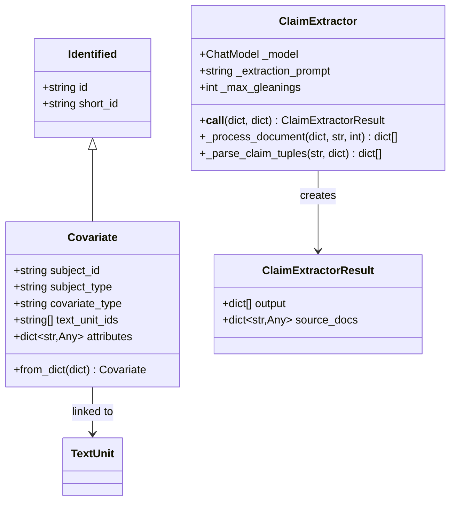
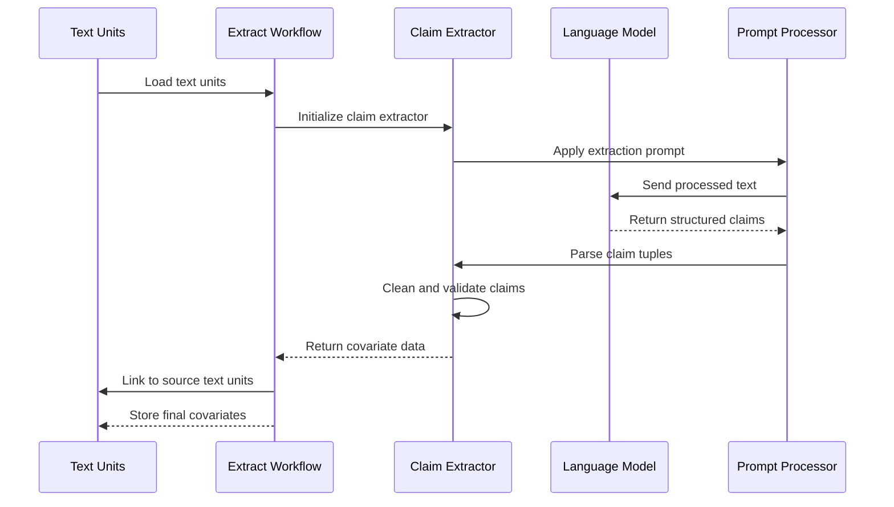
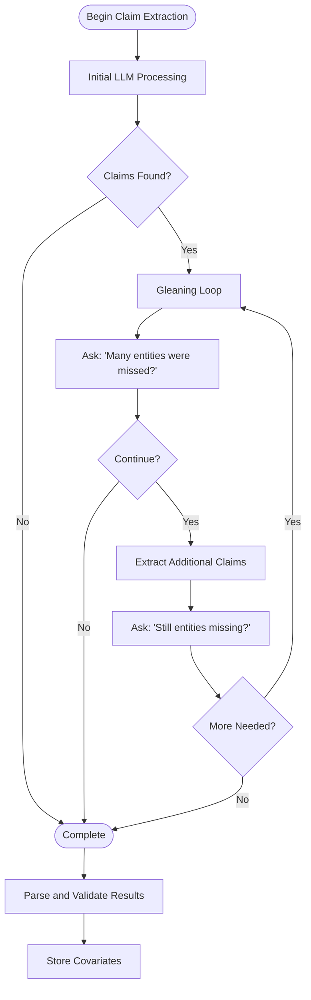
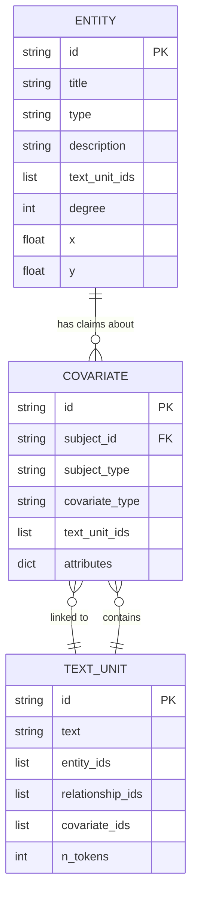
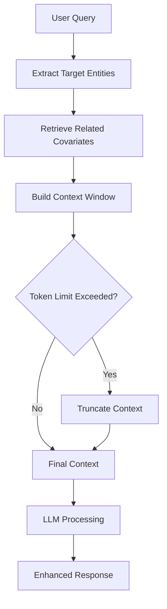
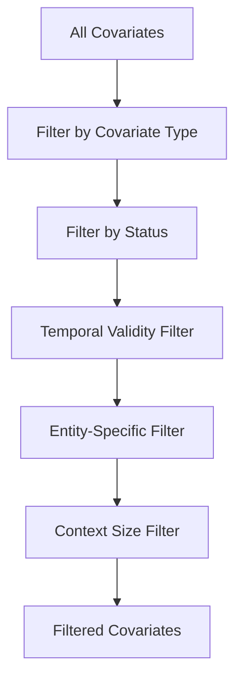

# Covariate Model

<cite>
**Referenced Files in This Document**
- [covariate.py](file://graphrag/data_model/covariate.py)
- [extract_covariates.py](file://graphrag/index/operations/extract_covariates/extract_covariates.py)
- [extract_covariates_workflow.py](file://graphrag/index/workflows/extract_covariates.py)
- [claim_extractor.py](file://graphrag/index/operations/extract_covariates/claim_extractor.py)
- [covariates.py](file://graphrag/query/input/retrieval/covariates.py)
- [schemas.py](file://graphrag/data_model/schemas.py)
- [extract_claims.py](file://graphrag/prompts/index/extract_claims.py)
- [extract_claims_config.py](file://graphrag/config/models/extract_claims_config.py)
- [local_context.py](file://graphrag/query/context_builder/local_context.py)
- [indexer_adapters.py](file://graphrag/query/indexer_adapters.py)
- [test_extract_covariates.py](file://tests/verbs/test_extract_covariates.py)
</cite>

## Table of Contents
1. [Introduction](#introduction)
2. [Covariate Model Architecture](#covariate-model-architecture)
3. [Core Fields and Structure](#core-fields-and-structure)
4. [Extraction Workflow](#extraction-workflow)
5. [LLM Prompt System](#llm-prompt-system)
6. [Integration with Entity Profiles](#integration-with-entity-profiles)
7. [Query Enhancement Mechanisms](#query-enhancement-mechanisms)
8. [Filtering and Linking](#filtering-and-linking)
9. [Challenges and Solutions](#challenges-and-solutions)
10. [API and CLI Usage](#api-and-cli-usage)
11. [Performance Considerations](#performance-considerations)
12. [Troubleshooting Guide](#troubleshooting-guide)

## Introduction

The Covariate model in GraphRAG represents additional contextual claims extracted from text documents, providing attitudinal and behavioral information about entities beyond factual relationships. These claims capture subjective assertions, beliefs, and contextual information that enrich entity profiles with deeper semantic understanding.

Covariates serve as metadata annotations that describe relationships, opinions, and contextual information associated with specific subjects (typically entities). They enable the system to understand not just what happened, but what people believe happened, how entities are perceived, and what attitudes exist within the data.

## Covariate Model Architecture

The Covariate model is built around the core `Covariate` dataclass that inherits from the `Identified` base class, providing a structured representation of extracted claims and contextual information.



**Diagram sources**
- [covariate.py](file://graphrag/data_model/covariate.py#L12-L55)
- [claim_extractor.py](file://graphrag/index/operations/extract_covariates/claim_extractor.py#L34-L237)

**Section sources**
- [covariate.py](file://graphrag/data_model/covariate.py#L12-L55)
- [claim_extractor.py](file://graphrag/index/operations/extract_covariates/claim_extractor.py#L34-L237)

## Core Fields and Structure

The Covariate model consists of several key fields that capture different aspects of extracted claims:

### Essential Fields

| Field | Type | Description | Purpose |
|-------|------|-------------|---------|
| `id` | string | Unique identifier for the covariate | Enables cross-referencing and deduplication |
| `subject_id` | string | Identifier of the subject entity | Links covariate to specific entity |
| `subject_type` | string | Type/category of the subject | Supports entity classification and filtering |
| `covariate_type` | string | Type of covariate (default: "claim") | Classifies the nature of the extracted information |
| `text_unit_ids` | list[string] | Source text units containing the covariate | Enables provenance tracking and source attribution |

### Additional Attributes

The `attributes` field contains structured information extracted from text:

| Attribute | Type | Description | Example Values |
|-----------|------|-------------|----------------|
| `object_id` | string | Entity/object involved in the claim | "GOVERNMENT AGENCY B", "NONE" |
| `type` | string | Category/type of the claim | "ANTI-COMPETITIVE PRACTICES", "CORRUPTION" |
| `status` | string | Verification status of the claim | "TRUE", "FALSE", "SUSPECTED" |
| `start_date` | string | ISO-8601 formatted start date | "2022-01-10T00:00:00" |
| `end_date` | string | ISO-8601 formatted end date | "2022-01-10T00:00:00" |
| `description` | string | Detailed claim description | Free-form textual description |
| `source_text` | string | Original text excerpt containing the claim | Quoted source material |
| `record_id` | string | Internal record identifier | Generated internal tracking ID |

**Section sources**
- [covariate.py](file://graphrag/data_model/covariate.py#L21-L34)
- [schemas.py](file://graphrag/data_model/schemas.py#L129-L142)

## Extraction Workflow

The covariate extraction process follows a sophisticated workflow that combines text analysis, LLM processing, and structured output generation.



**Diagram sources**
- [extract_covariates_workflow.py](file://graphrag/index/workflows/extract_covariates.py#L27-L61)
- [extract_covariates.py](file://graphrag/index/operations/extract_covariates/extract_covariates.py#L32-L76)

### Workflow Stages

1. **Text Unit Preparation**: Text units are loaded and prepared for processing
2. **Claim Extraction**: Specialized LLM prompts extract claims from text
3. **Gleaning Process**: Multiple iterations extract additional claims
4. **Validation and Cleaning**: Claims are validated and cleaned
5. **Linking**: Covariates are linked to source text units
6. **Storage**: Final covariate data is stored for query processing

**Section sources**
- [extract_covariates_workflow.py](file://graphrag/index/workflows/extract_covariates.py#L27-L94)
- [extract_covariates.py](file://graphrag/index/operations/extract_covariates/extract_covariates.py#L32-L154)

## LLM Prompt System

The covariate extraction relies on specialized prompts that guide the LLM to extract structured claims with specific attributes.

### Extraction Prompt Structure

The primary extraction prompt follows a structured format:

```
-Target activity-
You are an intelligent assistant that helps a human analyst to analyze claims against certain entities...

-Goal-
Given a text document... extract all entities that match the entity specification and all claims against those entities.

-Steps-
1. Extract all named entities...
2. For each entity identified... extract all claims associated with the entity...
3. Format each claim as (<subject>{tuple_delimiter}<object>{tuple_delimiter}<type>{tuple_delimiter}<status>{tuple_delimiter}<start_date>{tuple_delimiter}<end_date>{tuple_delimiter}<description>{tuple_delimiter}<source>)
4. Return output in English as a single list of all the claims identified...
```

### Gleaning and Iterative Processing

The system employs a gleaning mechanism to extract additional claims:



**Diagram sources**
- [claim_extractor.py](file://graphrag/index/operations/extract_covariates/claim_extractor.py#L149-L196)
- [extract_claims.py](file://graphrag/prompts/index/extract_claims.py#L60-L61)

**Section sources**
- [extract_claims.py](file://graphrag/prompts/index/extract_claims.py#L6-L62)
- [claim_extractor.py](file://graphrag/index/operations/extract_covariates/claim_extractor.py#L149-L196)

## Integration with Entity Profiles

Covariates enhance entity profiles by providing attitudinal and behavioral context that complements factual relationships.

### Entity-Covariate Relationship



**Diagram sources**
- [covariate.py](file://graphrag/data_model/covariate.py#L12-L55)
- [schemas.py](file://graphrag/data_model/schemas.py#L72-L164)

### Enrichment Benefits

1. **Attitudinal Context**: Captures perceptions and beliefs about entities
2. **Behavioral Patterns**: Documents observed behaviors and actions
3. **Temporal Validity**: Tracks when claims were made and their validity periods
4. **Source Attribution**: Links claims to specific text units for verification
5. **Confidence Levels**: Provides status indicators for claim reliability

**Section sources**
- [covariate.py](file://graphrag/data_model/covariate.py#L12-L55)
- [local_context.py](file://graphrag/query/context_builder/local_context.py#L93-L154)

## Query Enhancement Mechanisms

Covariates significantly enhance query responses by providing richer semantic context beyond simple factual relationships.

### Context Building Process

The system builds query context by incorporating covariates alongside entities and relationships:



**Diagram sources**
- [local_context.py](file://graphrag/query/context_builder/local_context.py#L93-L154)

### Semantic Enrichment Features

1. **Claim-Based Reasoning**: Queries can leverage extracted claims for inferential reasoning
2. **Temporal Filtering**: Responses can incorporate temporal validity of claims
3. **Source Attribution**: Answers can cite original sources for claims
4. **Confidence Scoring**: Responses can reflect claim reliability
5. **Multi-Perspective Views**: Different types of claims provide varied perspectives

**Section sources**
- [local_context.py](file://graphrag/query/context_builder/local_context.py#L93-L154)
- [covariates.py](file://graphrag/query/input/retrieval/covariates.py#L14-L54)

## Filtering and Linking

The system provides sophisticated mechanisms for filtering and linking covariates to support efficient query processing and data management.

### Covariate Filtering Strategies



**Diagram sources**
- [covariates.py](file://graphrag/query/input/retrieval/covariates.py#L14-L25)

### Linking Mechanisms

1. **Entity Linking**: Covariates link to specific entities via `subject_id`
2. **Text Unit Linking**: Direct linkage to source text units for provenance
3. **Cross-Reference**: Ability to link related covariates for correlation
4. **Hierarchical Organization**: Support for nested or grouped covariates

**Section sources**
- [covariates.py](file://graphrag/query/input/retrieval/covariates.py#L14-L54)
- [local_context.py](file://graphrag/query/context_builder/local_context.py#L122-L125)

## Challenges and Solutions

### Claim Verification Challenges

**Challenge**: Ensuring the reliability and accuracy of extracted claims
**Solution**: Multi-stage validation with confidence scoring and source attribution

### Temporal Validity Management

**Challenge**: Managing claims with varying temporal validity periods
**Solution**: Structured date fields with start/end date tracking and temporal filtering

### Subjective Statement Handling

**Challenge**: Processing and integrating subjective, opinion-based statements
**Solution**: Status classification (TRUE/FALSE/SUSPECTED) with confidence indicators

### Scalability Concerns

**Challenge**: Processing large volumes of text efficiently
**Solution**: Parallel processing with configurable thread counts and async modes

### Integration Complexity

**Challenge**: Seamlessly integrating covariates with existing entity-relationship models
**Solution**: Unified schema design with consistent field naming and data types

**Section sources**
- [claim_extractor.py](file://graphrag/index/operations/extract_covariates/claim_extractor.py#L135-L147)
- [extract_claims_config.py](file://graphrag/config/models/extract_claims_config.py#L14-L56)

## API and CLI Usage

### API Usage Examples

#### Retrieving Covariates

```python
# Basic covariate retrieval
from graphrag.query.input.retrieval.covariates import get_candidate_covariates

candidate_covariates = get_candidate_covariates(
    selected_entities=entity_list,
    covariates=covariate_collection
)
```

#### Converting to DataFrame

```python
# Convert covariates to pandas DataFrame
from graphrag.query.input.retrieval.covariates import to_covariate_dataframe

covariate_df = to_covariate_dataframe(candidate_covariates)
```

### CLI Usage Examples

#### Running Covariate Extraction

```bash
# Extract covariates from text units
python -m graphrag.cli extract-covariates \
    --input ./data/text_units.parquet \
    --output ./data/covariates.parquet \
    --config ./config/graphrag.yml
```

#### Querying with Covariates

```bash
# Perform query with covariate enrichment
python -m graphrag.cli query \
    --method local \
    --query "What are the claims about Company A?" \
    --data ./data/output \
    --config ./config/graphrag.yml
```

**Section sources**
- [covariates.py](file://graphrag/query/input/retrieval/covariates.py#L14-L54)
- [indexer_adapters.py](file://graphrag/query/indexer_adapters.py#L45-L60)

## Performance Considerations

### Processing Efficiency

1. **Parallel Processing**: Configurable thread counts for concurrent claim extraction
2. **Async Operations**: Support for asynchronous LLM calls to improve throughput
3. **Batch Processing**: Efficient batch processing of text units
4. **Caching**: Pipeline caching reduces redundant LLM calls

### Memory Management

1. **Streaming Processing**: Process large datasets in chunks
2. **Token Limiting**: Context window management prevents memory overflow
3. **Selective Loading**: Load only necessary covariates for specific queries

### Scalability Factors

1. **Thread Configuration**: Optimize thread counts based on LLM provider limits
2. **Batch Size Tuning**: Balance batch size with available memory
3. **Caching Strategy**: Implement appropriate caching for frequently accessed data

**Section sources**
- [extract_covariates.py](file://graphrag/index/operations/extract_covariates/extract_covariates.py#L32-L76)
- [claim_extractor.py](file://graphrag/index/operations/extract_covariates/claim_extractor.py#L87-L133)

## Troubleshooting Guide

### Common Issues and Solutions

#### Issue: Missing Covariates in Output
**Symptoms**: Expected claims not appearing in extracted covariates
**Causes**: 
- Insufficient training data for the LLM
- Poor prompt formulation
- Text unit preprocessing issues

**Solutions**:
1. Verify LLM configuration and model capabilities
2. Review and refine extraction prompts
3. Check text unit quality and preprocessing steps

#### Issue: High Processing Times
**Symptoms**: Slow covariate extraction performance
**Causes**:
- Large text units requiring multiple LLM calls
- Insufficient parallel processing
- Network latency with LLM provider

**Solutions**:
1. Optimize text unit splitting strategies
2. Increase thread count for parallel processing
3. Implement local caching for repeated requests

#### Issue: Inconsistent Claim Formats
**Symptoms**: Variability in extracted claim structures
**Causes**:
- LLM output parsing errors
- Inconsistent prompt adherence
- Complex text structures

**Solutions**:
1. Implement robust parsing with fallback mechanisms
2. Enhance prompt specificity and examples
3. Add post-processing validation steps

### Debugging Techniques

1. **Enable Verbose Logging**: Use detailed logging to trace extraction steps
2. **Sample Processing**: Test with small text samples to isolate issues
3. **Prompt Testing**: Validate prompts independently before full processing
4. **Output Validation**: Implement automated checks for extracted structures

**Section sources**
- [claim_extractor.py](file://graphrag/index/operations/extract_covariates/claim_extractor.py#L114-L133)
- [test_extract_covariates.py](file://tests/verbs/test_extract_covariates.py#L20-L80)