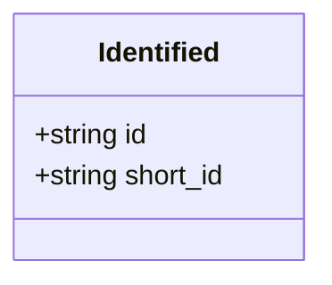
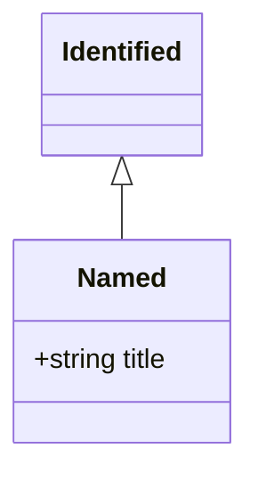
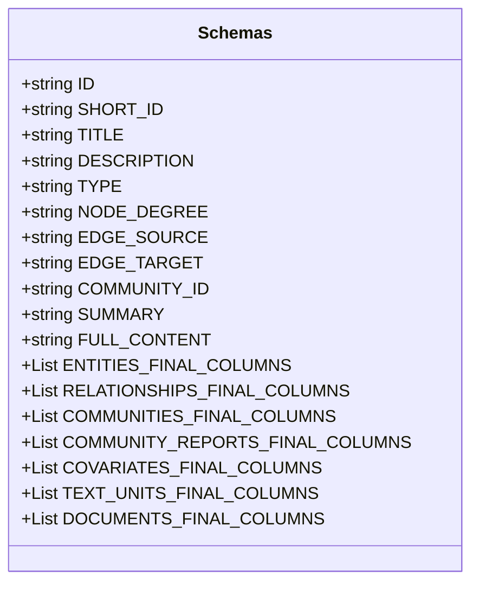
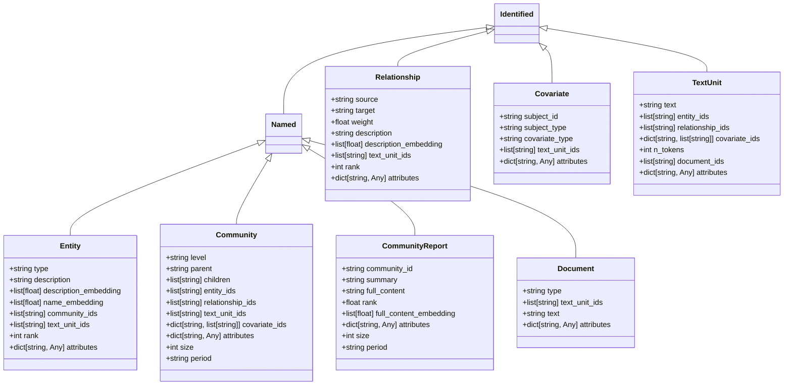
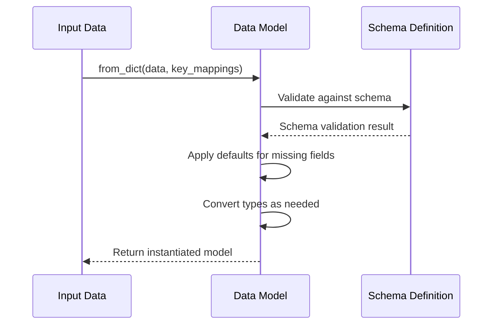

# Data Schemas and Validation

<cite>
**Referenced Files in This Document**   
- [identified.py](file://graphrag/data_model/identified.py)
- [named.py](file://graphrag/data_model/named.py)
- [schemas.py](file://graphrag/data_model/schemas.py)
- [types.py](file://graphrag/data_model/types.py)
- [entity.py](file://graphrag/data_model/entity.py)
- [relationship.py](file://graphrag/data_model/relationship.py)
- [community.py](file://graphrag/data_model/community.py)
- [community_report.py](file://graphrag/data_model/community_report.py)
- [covariate.py](file://graphrag/data_model/covariate.py)
- [text_unit.py](file://graphrag/data_model/text_unit.py)
- [document.py](file://graphrag/data_model/document.py)
- [vector_store_config.py](file://graphrag/config/models/vector_store_config.py)
- [vector_store_schema_config.py](file://graphrag/config/models/vector_store_schema_config.py)
</cite>

## Table of Contents
1. [Introduction](#introduction)
2. [Core Base Classes](#core-base-classes)
3. [Shared Schema Definitions](#shared-schema-definitions)
4. [Data Model Inheritance Hierarchy](#data-model-inheritance-hierarchy)
5. [Field Constraints and Default Values](#field-constraints-and-default-values)
6. [Schema Generation and Serialization](#schema-generation-and-serialization)
7. [Validation Mechanisms](#validation-mechanisms)
8. [Custom Type Definitions](#custom-type-definitions)
9. [Integration with External Systems](#integration-with-external-systems)
10. [Extension Guidelines](#extension-guidelines)
11. [Common Issues and Migration](#common-issues-and-migration)

## Introduction
The GraphRAG system implements a comprehensive data modeling framework that standardizes the representation of knowledge graph components across the entire pipeline. This documentation details the shared schema components and base classes that form the foundation of all data models within the system. The architecture leverages inheritance patterns and standardized field definitions to ensure consistency in data representation, validation, and serialization across entities, relationships, communities, and other knowledge graph elements.

## Core Base Classes

The data model architecture is built upon two fundamental base classes that provide essential attributes and behaviors for all domain objects: `Identified` and `Named`. These classes establish a consistent interface for object identification and naming across the system.

### Identified Class
The `Identified` class serves as the foundational protocol for all objects requiring unique identification within the system. It provides standardized ID fields that enable consistent referencing and lookup operations across different components.



**Diagram sources**
- [identified.py](file://graphrag/data_model/identified.py#L9-L18)

**Section sources**
- [identified.py](file://graphrag/data_model/identified.py#L1-L18)

### Named Class
The `Named` class extends `Identified` to include a title attribute, forming the base for all objects that require both identification and human-readable naming. This inheritance pattern ensures that all named entities maintain consistent ID handling while adding title functionality.



**Diagram sources**
- [named.py](file://graphrag/data_model/named.py#L11-L17)
- [identified.py](file://graphrag/data_model/identified.py#L9-L18)

**Section sources**
- [named.py](file://graphrag/data_model/named.py#L1-L17)

## Shared Schema Definitions

The `schemas.py` module defines a comprehensive set of standardized field names and column ordering for all data models. These constants ensure consistency in data representation across different components and storage formats.



**Diagram sources**
- [schemas.py](file://graphrag/data_model/schemas.py#L5-L164)

**Section sources**
- [schemas.py](file://graphrag/data_model/schemas.py#L1-L164)

## Data Model Inheritance Hierarchy

The system implements a hierarchical inheritance structure where specialized data models extend the base `Identified` and `Named` classes. This approach ensures consistent attribute handling while allowing domain-specific extensions.



**Diagram sources**
- [entity.py](file://graphrag/data_model/entity.py#L12-L70)
- [relationship.py](file://graphrag/data_model/relationship.py#L12-L66)
- [community.py](file://graphrag/data_model/community.py#L12-L80)
- [community_report.py](file://graphrag/data_model/community_report.py#L12-L68)
- [covariate.py](file://graphrag/data_model/covariate.py#L12-L55)
- [text_unit.py](file://graphrag/data_model/text_unit.py#L12-L63)
- [document.py](file://graphrag/data_model/document.py#L12-L50)

**Section sources**
- [entity.py](file://graphrag/data_model/entity.py#L1-L70)
- [relationship.py](file://graphrag/data_model/relationship.py#L1-L66)
- [community.py](file://graphrag/data_model/community.py#L1-L80)
- [community_report.py](file://graphrag/data_model/community_report.py#L1-L68)
- [covariate.py](file://graphrag/data_model/covariate.py#L1-L55)
- [text_unit.py](file://graphrag/data_model/text_unit.py#L1-L63)
- [document.py](file://graphrag/data_model/document.py#L1-L50)

## Field Constraints and Default Values

The data models implement consistent field constraints and default values to ensure data integrity and provide sensible defaults for optional attributes. These patterns are applied uniformly across all model classes.

### Required Fields
All models inherit required fields from their base classes:
- `id`: Unique identifier (required, no default)
- `title`: Human-readable name (required for `Named` derivatives)

### Optional Fields with Defaults
The system defines consistent default values for common optional fields:
- `short_id`: None (optional human-readable ID)
- `rank`: 1 (importance ranking, higher = more important)
- `weight`: 1.0 (relationship strength)
- `text_unit_ids`: None (list of associated text units)
- `attributes`: None (dictionary for additional metadata)

### Type-Specific Constraints
Each model class adds domain-specific constraints:
- `Entity`: Optional type, description, and embedding fields
- `Relationship`: Source and target entity names (required)
- `Community`: Hierarchical structure with parent/children relationships
- `TextUnit`: Token count and document association

**Section sources**
- [entity.py](file://graphrag/data_model/entity.py#L16-L38)
- [relationship.py](file://graphrag/data_model/relationship.py#L22-L38)
- [community.py](file://graphrag/data_model/community.py#L16-L44)
- [text_unit.py](file://graphrag/data_model/text_unit.py#L19-L35)

## Schema Generation and Serialization

The system implements standardized schema generation for both storage and API exposure through the `schemas.py` module and consistent serialization patterns across all data models.

### Column Ordering
The `FINAL_COLUMNS` lists in `schemas.py` define the exact column ordering for parquet output, ensuring consistent data layout across different runs and environments:
- `ENTITIES_FINAL_COLUMNS`: Standardized entity output schema
- `RELATIONSHIPS_FINAL_COLUMNS`: Standardized relationship output schema
- `COMMUNITIES_FINAL_COLUMNS`: Standardized community output schema
- `COMMUNITY_REPORTS_FINAL_COLUMNS`: Standardized report output schema

### Serialization Patterns
All models implement `from_dict` class methods that handle deserialization from dictionaries, with flexible key mapping to support different input formats:
- Configurable key names for each field
- Graceful handling of missing optional fields
- Type conversion and validation during deserialization



**Diagram sources**
- [schemas.py](file://graphrag/data_model/schemas.py#L72-L164)
- [entity.py](file://graphrag/data_model/entity.py#L40-L70)

**Section sources**
- [schemas.py](file://graphrag/data_model/schemas.py#L72-L164)
- [entity.py](file://graphrag/data_model/entity.py#L40-L70)

## Validation Mechanisms

While the core data models use dataclasses rather than Pydantic models, the system implements validation through Pydantic in configuration models and custom validation functions.

### Configuration Model Validation
Pydantic is used extensively in configuration models for robust validation:
- `vector_store_config.py`: Implements model validation with `@model_validator`
- `vector_store_schema_config.py`: Validates schema field names for safety

```python
@model_validator(mode="after")
def _validate_model(self):
    """Validate the model."""
    self._validate_db_uri()
    self._validate_url()
    self._validate_embeddings_schema()
    return self
```

### Data Validation Utilities
The system provides utility functions for data type validation:
- `to_int()`, `to_float()`: Type conversion with validation
- `to_dict()`, `to_optional_dict()`: Dictionary validation with optional key/value type checking
- Custom validation for field names and schema integrity

**Section sources**
- [vector_store_config.py](file://graphrag/config/models/vector_store_config.py#L92-L111)
- [vector_store_schema_config.py](file://graphrag/config/models/vector_store_schema_config.py#L50-L66)
- [utils.py](file://graphrag/query/input/loaders/utils.py#L91-L187)

## Custom Type Definitions

The `types.py` module defines shared type aliases that promote consistency across the codebase.

### TextEmbedder Type
The `TextEmbedder` type defines a callable interface for text embedding functions:
```python
TextEmbedder = Callable[[str], list[float]]
```

This type is used throughout the system to ensure consistent typing for embedding functions, particularly in vector store operations and similarity search methods.

**Section sources**
- [types.py](file://graphrag/data_model/types.py#L8)

## Integration with External Systems

The standardized schema definitions facilitate integration with external systems through consistent data representation and export formats.

### Storage Integration
The column ordering defined in `schemas.py` ensures compatibility with various storage backends:
- Parquet file output with consistent column ordering
- Vector store integration with standardized field mappings
- Database storage with predictable schema structure

### API Exposure
The consistent data model structure enables predictable API responses:
- Uniform field naming across different entity types
- Standardized ID and naming patterns
- Consistent handling of optional fields and defaults

**Section sources**
- [schemas.py](file://graphrag/data_model/schemas.py#L72-L164)
- [vector_store_config.py](file://graphrag/config/models/vector_store_config.py)

## Extension Guidelines

When extending the base models for custom use cases, follow these guidelines to maintain compatibility:

### Inheritance Pattern
Always extend existing models rather than creating independent classes:
```python
class CustomEntity(Entity):
    custom_field: str | None = None
```

### Field Naming
Follow existing naming conventions:
- Use snake_case for field names
- Prefix optional fields with clear indicators
- Use consistent type names (e.g., "embedding", "ids", "attributes")

### Default Values
Maintain consistency with existing default values:
- Use None for optional list/dict fields
- Use 1 or 1.0 for rank/weight defaults
- Provide clear documentation for custom defaults

### Schema Compatibility
Ensure extensions don't conflict with existing schemas:
- Avoid field name collisions
- Maintain backward compatibility
- Document any schema changes clearly

**Section sources**
- [entity.py](file://graphrag/data_model/entity.py)
- [named.py](file://graphrag/data_model/named.py)
- [identified.py](file://graphrag/data_model/identified.py)

## Common Issues and Migration

### Version Compatibility
When upgrading between versions:
- Check for changes in `schemas.py` field definitions
- Verify compatibility with existing data exports
- Test custom extensions against new base model changes

### Migration Strategies
For schema migrations:
- Use the `from_dict` methods with appropriate key mappings
- Implement data transformation pipelines for legacy formats
- Validate migrated data against the new schema definitions

### Handling Optional Fields
Best practices for optional fields:
- Always check for None values before use
- Provide sensible defaults in consuming code
- Document expected behavior when fields are missing

**Section sources**
- [schemas.py](file://graphrag/data_model/schemas.py)
- [vector_store_config.py](file://graphrag/config/models/vector_store_config.py)
- [utils.py](file://graphrag/query/input/loaders/utils.py)