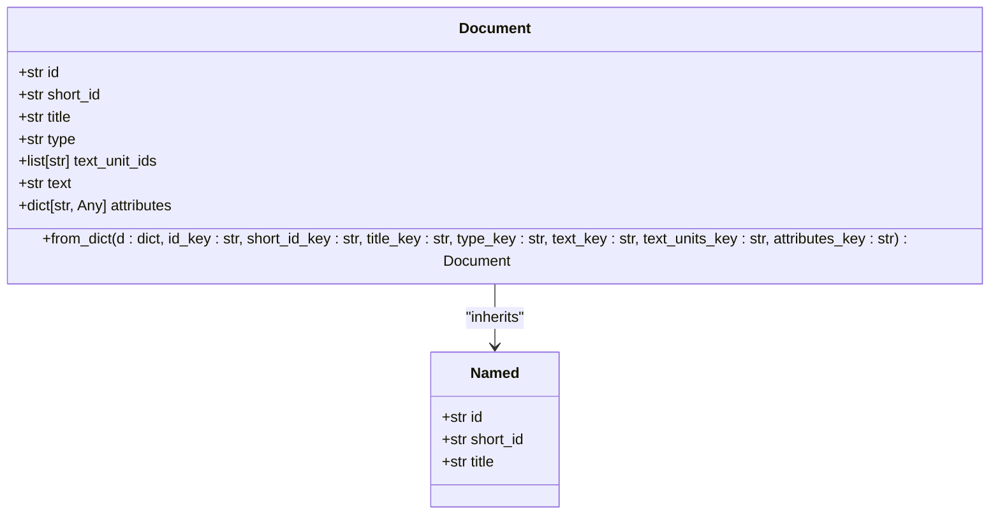
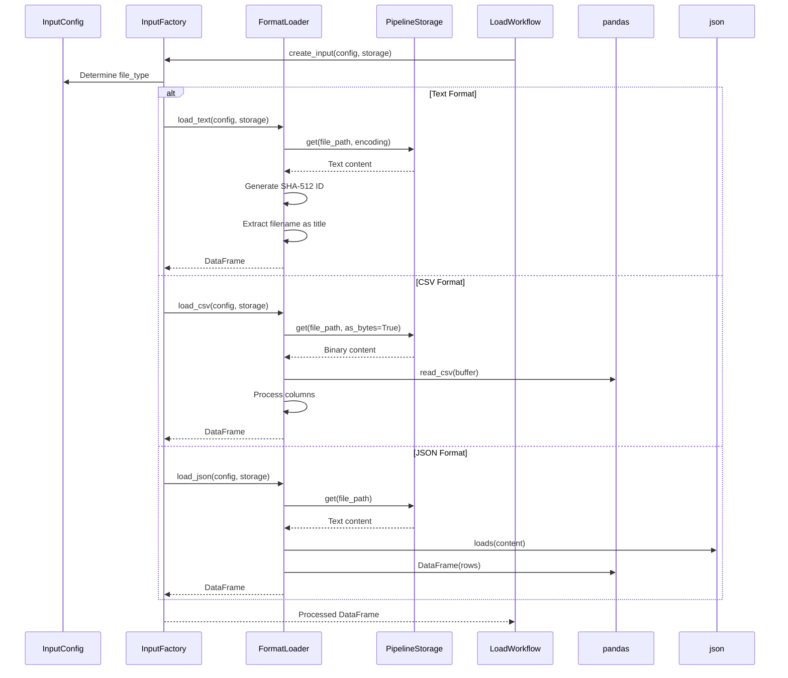
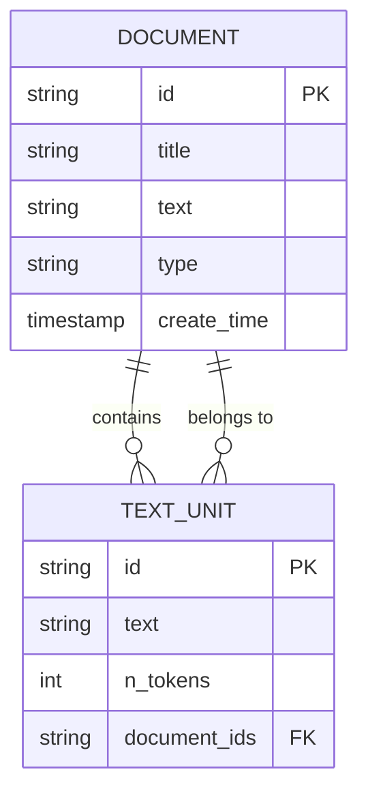
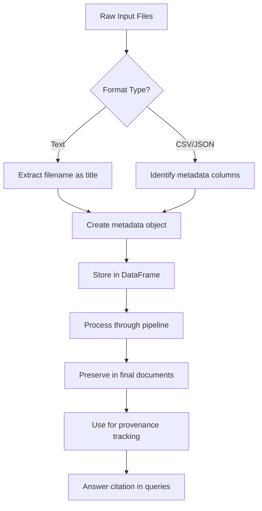
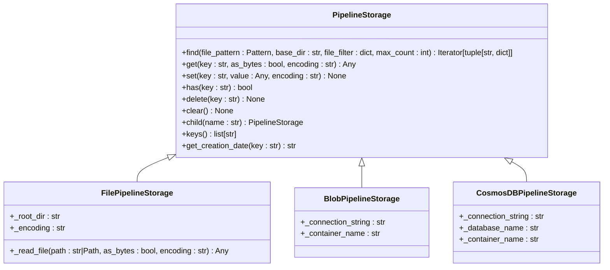
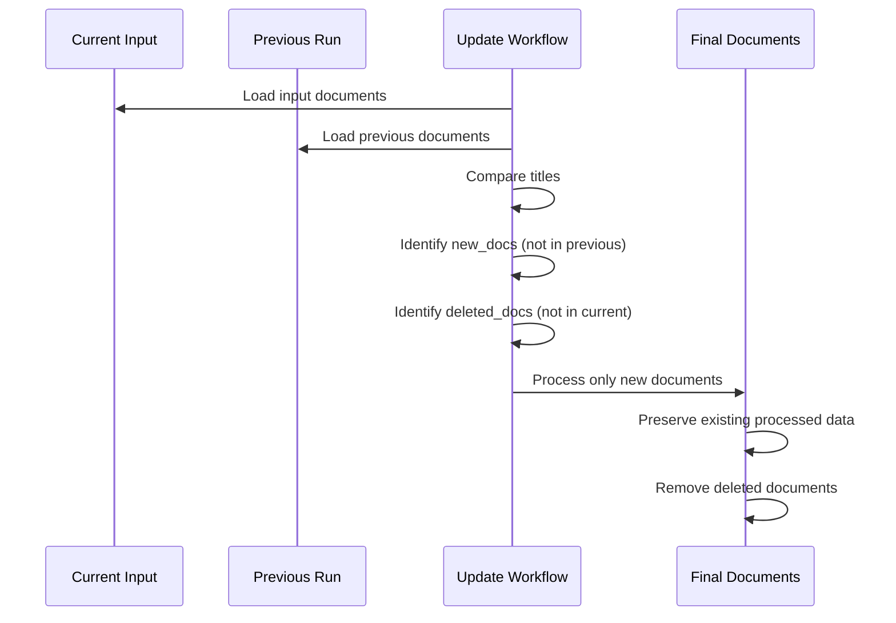

# Document Model

<cite>
**Referenced Files in This Document**   
- [document.py](file://graphrag/data_model/document.py)
- [text_unit.py](file://graphrag/data_model/text_unit.py)
- [load_input_documents.py](file://graphrag/index/workflows/load_input_documents.py)
- [factory.py](file://graphrag/index/input/factory.py)
- [text.py](file://graphrag/index/input/text.py)
- [csv.py](file://graphrag/index/input/csv.py)
- [json.py](file://graphrag/index/input/json.py)
- [util.py](file://graphrag/index/input/util.py)
- [create_final_documents.py](file://graphrag/index/workflows/create_final_documents.py)
- [create_base_text_units.py](file://graphrag/index/workflows/create_base_text_units.py)
- [pipeline_storage.py](file://graphrag/storage/pipeline_storage.py)
- [file_pipeline_storage.py](file://graphrag/storage/file_pipeline_storage.py)
- [hashing.py](file://graphrag/index/utils/hashing.py)
- [incremental_index.py](file://graphrag/index/update/incremental_index.py)
</cite>

## Table of Contents
1. [Introduction](#introduction)
2. [Document Model Structure](#document-model-structure)
3. [Document Loading and Processing](#document-loading-and-processing)
4. [Relationship with TextUnits](#relationship-with-textunits)
5. [Metadata Handling and Provenance](#metadata-handling-and-provenance)
6. [Storage and Backend Integration](#storage-and-backend-integration)
7. [Incremental Updates and Deduplication](#incremental-updates-and-deduplication)
8. [Encoding and Binary Content Handling](#encoding-and-binary-content-handling)
9. [Code Examples and Access Patterns](#code-examples-and-access-patterns)
10. [Conclusion](#conclusion)

## Introduction
The Document model serves as the foundational data structure in the GraphRAG system, representing original source files ingested into the knowledge graph pipeline. This document provides a comprehensive analysis of the Document model, its fields, loading mechanisms, relationships with other entities, and its role in downstream processing. The Document model acts as the primary container for raw content and metadata, enabling the system to process diverse file formats while preserving provenance information throughout the pipeline.

## Document Model Structure

The Document model is implemented as a dataclass that extends the Named base class, providing a structured representation of ingested source files. Each document contains essential fields that capture both content and metadata:

- **id**: Unique identifier for the document, typically generated using SHA-512 hashing of document content and properties
- **title**: Human-readable title of the document, often derived from the filename for text files
- **text**: Raw text content extracted from the source file
- **type**: Document type indicator (default: "text") that specifies the content format
- **text_unit_ids**: List of associated TextUnit identifiers that reference chunks derived from this document
- **attributes**: Optional dictionary containing structured metadata such as author, creation date, or custom properties

The model includes a factory method `from_dict()` that enables instantiation from dictionary data, supporting flexible document creation from various input sources. Field names can be customized through parameters, allowing the model to adapt to different data schemas.

**Diagram sources**
- [document.py](file://graphrag/data_model/document.py#L12-L50)

**Section sources**
- [document.py](file://graphrag/data_model/document.py#L6-L50)

## Document Loading and Processing

The system supports loading documents from multiple formats including plain text, CSV, and JSON through a unified input processing pipeline. The loading process is orchestrated through the `load_input_documents.py` workflow, which coordinates format-specific loaders based on configuration.

For text files, the system reads content directly from storage, generating document IDs using SHA-512 hashes of the content. The filename becomes the document title, and creation dates are preserved from the storage system. CSV files are processed using pandas, with configurable text and title columns. JSON files can contain either single objects or arrays of objects, both of which are converted to DataFrames for uniform processing.

**Diagram sources**
- [load_input_documents.py](file://graphrag/index/workflows/load_input_documents.py#L21-L37)
- [factory.py](file://graphrag/index/input/factory.py#L27-L57)
- [text.py](file://graphrag/index/input/text.py#L19-L36)
- [csv.py](file://graphrag/index/input/csv.py#L18-L44)
- [json.py](file://graphrag/index/input/json.py#L18-L48)

**Section sources**
- [load_input_documents.py](file://graphrag/index/workflows/load_input_documents.py#L21-L44)
- [factory.py](file://graphrag/index/input/factory.py#L27-L57)

## Relationship with TextUnits

Documents establish a one-to-many relationship with TextUnits, which represent processed chunks of document content. This relationship is fundamental to the system's ability to perform granular analysis and retrieval. During the text unit creation workflow, documents are split into smaller segments according to configurable chunking strategies, with each resulting text unit maintaining a reference back to its parent document.

The relationship is bidirectional: documents contain a list of their associated text unit IDs, while text units maintain a list of their source document IDs. This design enables efficient traversal in both directions - from documents to their constituent chunks, and from text units back to their source documents for provenance tracking.

**Diagram sources**
- [document.py](file://graphrag/data_model/document.py#L19-L20)
- [text_unit.py](file://graphrag/data_model/text_unit.py#L31-L32)
- [create_base_text_units.py](file://graphrag/index/workflows/create_base_text_units.py#L35-L45)
- [create_final_documents.py](file://graphrag/index/workflows/create_final_documents.py#L36-L78)

**Section sources**
- [create_base_text_units.py](file://graphrag/index/workflows/create_base_text_units.py#L25-L164)
- [create_final_documents.py](file://graphrag/index/workflows/create_final_documents.py#L19-L78)

## Metadata Handling and Provenance

The system preserves metadata throughout the processing pipeline, supporting both automatic extraction and custom injection. For text files, metadata includes the filename as title and creation date from the storage system. For structured formats like CSV and JSON, users can specify which columns should be treated as metadata through the `metadata` configuration parameter.

Custom metadata injection occurs during the input loading phase, where specified columns are collapsed into a JSON object stored in a "metadata" column. This approach allows users to preserve important contextual information such as author, source URL, publication date, or domain-specific attributes. The metadata is maintained through subsequent processing stages and can be accessed for filtering, analysis, or citation purposes.

Provenance tracking is implemented through the document-to-text-unit relationship, enabling the system to trace any analysis result back to its original source. This capability is critical for answer citation, allowing the system to provide references to specific documents when generating responses.

**Diagram sources**
- [util.py](file://graphrag/index/input/util.py#L39-L53)
- [factory.py](file://graphrag/index/input/factory.py#L38-L49)
- [create_final_documents.py](file://graphrag/index/workflows/create_final_documents.py#L74-L77)
- [prompts/query/basic_search_system_prompt.py](file://graphrag/prompts/query/basic_search_system_prompt.py#L53-L63)

**Section sources**
- [util.py](file://graphrag/index/input/util.py#L19-L87)
- [factory.py](file://graphrag/index/input/factory.py#L38-L49)

## Storage and Backend Integration

Document storage is abstracted through the PipelineStorage interface, which provides a consistent API for interacting with different storage backends. The system supports file-based storage, blob storage, CosmosDB, and in-memory storage through concrete implementations that adhere to the PipelineStorage contract.

The storage interface includes methods for basic CRUD operations (get, set, has, delete), file pattern matching (find), and metadata retrieval (get_creation_date). This abstraction enables the system to work with various storage systems without requiring changes to the core processing logic. File-based storage handles encoding detection automatically, supporting configurable text encodings with UTF-8 as the default.

**Diagram sources**
- [pipeline_storage.py](file://graphrag/storage/pipeline_storage.py#L13-L94)
- [file_pipeline_storage.py](file://graphrag/storage/file_pipeline_storage.py#L87-L117)
- [blob_pipeline_storage.py](file://graphrag/storage/blob_pipeline_storage.py)
- [cosmosdb_pipeline_storage.py](file://graphrag/storage/cosmosdb_pipeline_storage.py)

**Section sources**
- [pipeline_storage.py](file://graphrag/storage/pipeline_storage.py#L6-L100)
- [file_pipeline_storage.py](file://graphrag/storage/file_pipeline_storage.py#L87-L117)

## Incremental Updates and Deduplication

The system supports incremental updates through the `load_update_documents.py` workflow, which identifies new and deleted documents by comparing the current input against previous runs. This capability enables efficient processing of updated document collections without reprocessing unchanged content.

Document deduplication is implemented through deterministic ID generation using SHA-512 hashing of document content and properties. The `gen_sha512_hash` function creates unique identifiers that remain consistent across runs, allowing the system to detect duplicate documents even when filenames or storage locations change. This approach ensures that identical content is not processed multiple times, conserving computational resources and maintaining data consistency.

**Diagram sources**
- [incremental_index.py](file://graphrag/index/update/incremental_index.py#L57-L63)
- [load_update_documents.py](file://graphrag/index/workflows/load_update_documents.py#L45-L55)
- [hashing.py](file://graphrag/index/utils/hashing.py#L11-L15)

**Section sources**
- [incremental_index.py](file://graphrag/index/update/incremental_index.py#L57-L83)
- [load_update_documents.py](file://graphrag/index/workflows/load_update_documents.py#L45-L55)

## Encoding and Binary Content Handling

The system handles encoding detection and conversion through configurable parameters in the InputConfig. For text-based formats, the encoding parameter specifies how files should be decoded, with UTF-8 as the default. The storage layer automatically handles encoding conversion when reading and writing text content.

Binary content is supported through the `as_bytes` parameter in the get() method, allowing the system to handle non-text files when necessary. For CSV files, binary reading is used to ensure proper parsing regardless of encoding, with pandas handling the conversion to text. This approach provides flexibility in handling files with unknown or mixed encodings while maintaining data integrity.

The system also handles edge cases such as non-string input by converting values to strings before processing, ensuring robustness when dealing with heterogeneous data sources. Error handling is implemented to gracefully skip files that cannot be read, with warnings logged for troubleshooting.

**Section sources**
- [file_pipeline_storage.py](file://graphrag/storage/file_pipeline_storage.py#L102-L117)
- [csv.py](file://graphrag/index/input/csv.py#L28-L29)
- [text.py](file://graphrag/index/input/text.py#L28-L29)
- [util.py](file://graphrag/index/input/util.py#L25-L30)

## Code Examples and Access Patterns

The system provides several patterns for accessing and working with documents. The primary access point is through the workflow system, where documents are loaded, processed, and transformed through a series of coordinated steps. Direct access to documents is available through the storage interface, allowing applications to retrieve specific documents by ID.

Common access patterns include:
- Loading all documents for batch processing
- Retrieving documents by ID for detailed analysis
- Querying documents based on metadata attributes
- Accessing text units associated with specific documents
- Traversing the document-to-text-unit relationship for provenance

Integration with storage backends follows a factory pattern, where the appropriate storage implementation is instantiated based on configuration. This design allows applications to switch between storage systems with minimal code changes, promoting flexibility and maintainability.

**Section sources**
- [load_input_documents.py](file://graphrag/index/workflows/load_input_documents.py#L21-L37)
- [pipeline_storage.py](file://graphrag/storage/pipeline_storage.py#L27-L43)
- [create_base_text_units.py](file://graphrag/index/workflows/create_base_text_units.py#L31-L32)
- [create_final_documents.py](file://graphrag/index/workflows/create_final_documents.py#L25-L26)

## Conclusion
The Document model serves as the cornerstone of the GraphRAG system, providing a flexible and robust foundation for ingesting, processing, and analyzing diverse source materials. Its design emphasizes preservation of provenance, support for multiple formats, and efficient handling of large document collections. The model's integration with TextUnits enables granular analysis while maintaining connections to original sources, supporting accurate answer citation and transparent reasoning. Through its extensible storage interface and support for incremental updates, the system can scale to handle evolving document collections while maintaining performance and data consistency.