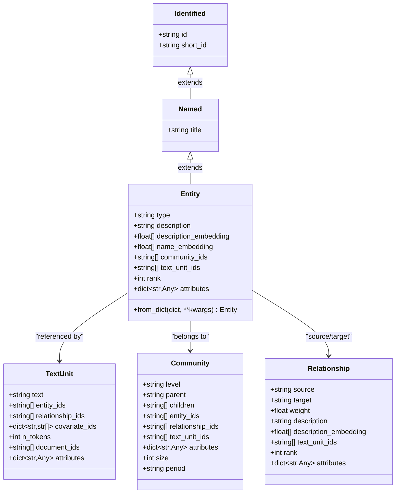
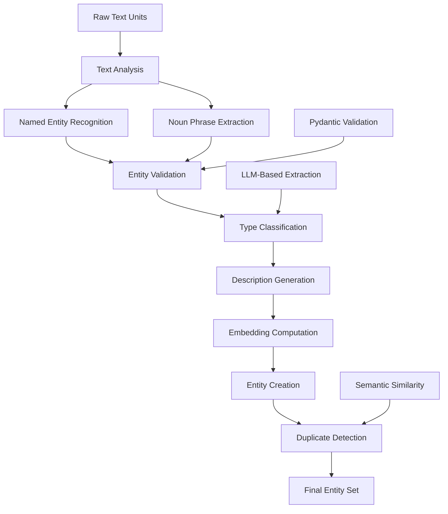
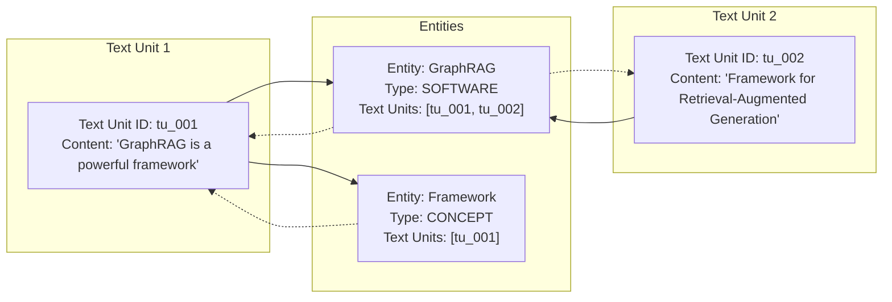
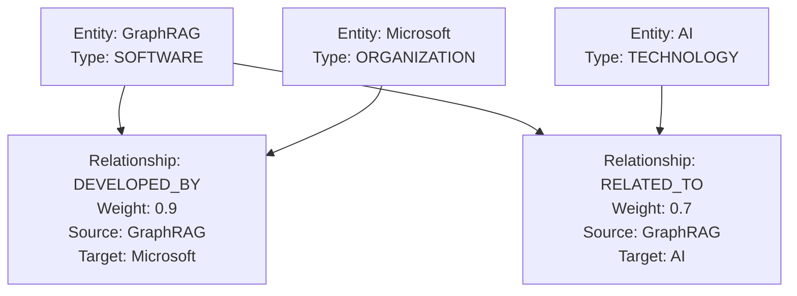
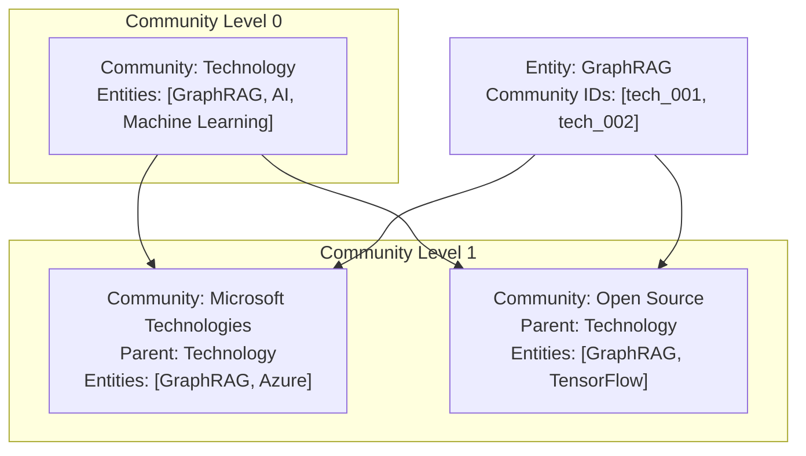
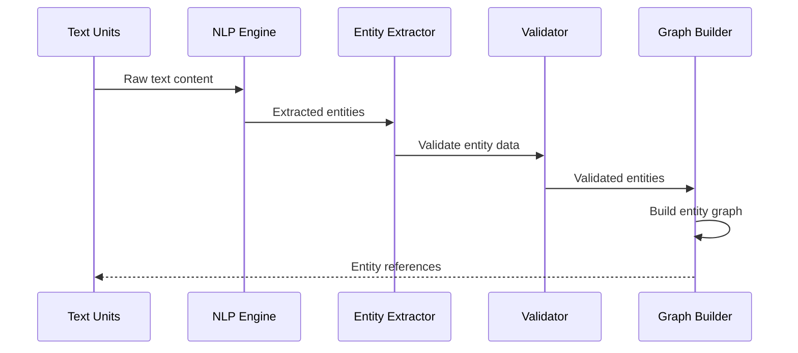
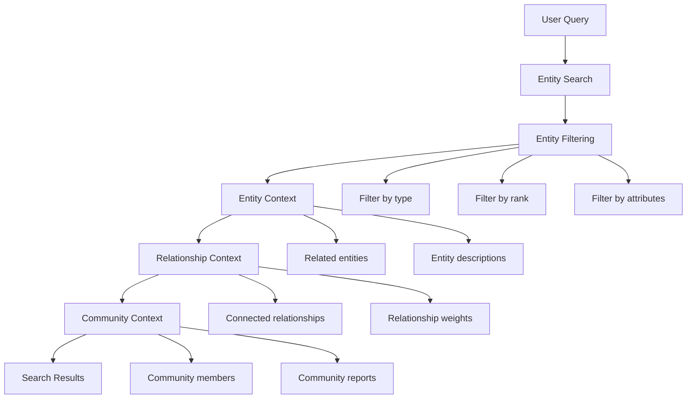

# Entity Model

<cite>
**Referenced Files in This Document**
- [entity.py](file://graphrag/data_model/entity.py)
- [text_unit.py](file://graphrag/data_model/text_unit.py)
- [relationship.py](file://graphrag/data_model/relationship.py)
- [community.py](file://graphrag/data_model/community.py)
- [named.py](file://graphrag/data_model/named.py)
- [identified.py](file://graphrag/data_model/identified.py)
- [schemas.py](file://graphrag/data_model/schemas.py)
- [entities.py](file://graphrag/query/input/retrieval/entities.py)
- [extract_graph_nlp.py](file://graphrag/index/workflows/extract_graph_nlp.py)
- [graph_extractor.py](file://graphrag/index/operations/extract_graph/graph_extractor.py)
- [local_context.py](file://graphrag/query/context_builder/local_context.py)
- [api.py](file://graphrag/utils/api.py)
</cite>

## Table of Contents
1. [Introduction](#introduction)
2. [Entity Model Architecture](#entity-model-architecture)
3. [Core Fields and Properties](#core-fields-and-properties)
4. [Entity Extraction and Validation](#entity-extraction-and-validation)
5. [Entity Relationships](#entity-relationships)
6. [Entity Usage in Workflows](#entity-usage-in-workflows)
7. [Serialization and Data Access](#serialization-and-data-access)
8. [Common Issues and Solutions](#common-issues-and-solutions)
9. [Programming Examples](#programming-examples)
10. [Performance Considerations](#performance-considerations)
11. [Troubleshooting Guide](#troubleshooting-guide)
12. [Conclusion](#conclusion)

## Introduction

The Entity model represents a fundamental node in the GraphRAG knowledge graph, serving as the cornerstone for knowledge extraction, organization, and retrieval. Entities encapsulate discrete concepts, people, organizations, locations, or any identifiable subject extracted from text units through Natural Language Processing (NLP) pipelines. Each Entity instance contains rich metadata that enables sophisticated graph operations, community detection, and semantic search capabilities.

Entities form the backbone of the knowledge graph, connecting to other entities through relationships, belonging to communities, and being referenced by text units. The model is designed with extensibility in mind, supporting various types of entities with customizable attributes while maintaining strict typing through Pydantic validation.

## Entity Model Architecture

The Entity model follows a hierarchical inheritance structure that promotes code reuse and maintains consistency across the GraphRAG data model ecosystem.



**Diagram sources**
- [entity.py](file://graphrag/data_model/entity.py#L12-L70)
- [text_unit.py](file://graphrag/data_model/text_unit.py#L12-L63)
- [relationship.py](file://graphrag/data_model/relationship.py#L12-L66)
- [community.py](file://graphrag/data_model/community.py#L12-L80)

**Section sources**
- [entity.py](file://graphrag/data_model/entity.py#L12-L70)
- [named.py](file://graphrag/data_model/named.py#L11-L17)
- [identified.py](file://graphrag/data_model/identified.py#L9-L18)

## Core Fields and Properties

The Entity model contains several essential fields that define its identity, semantics, and relationships within the knowledge graph.

### Identity Fields

| Field | Type | Description | Purpose |
|-------|------|-------------|---------|
| `id` | `str` | Unique identifier for the entity | Primary key for entity lookup and graph operations |
| `short_id` | `str \| None` | Human-readable identifier | Used in prompts, reports, and user-facing displays |
| `title` | `str` | Entity name/title | Primary display name and search key |

### Semantic Information

| Field | Type | Description | Purpose |
|-------|------|-------------|---------|
| `type` | `str \| None` | Entity classification | Type-based filtering and categorization |
| `description` | `str \| None` | Comprehensive entity description | Semantic understanding and search relevance |
| `description_embedding` | `list[float] \| None` | Semantic embedding of description | Vector similarity search and clustering |
| `name_embedding` | `list[float] \| None` | Semantic embedding of name | Name-based entity matching and disambiguation |

### Graph Connectivity

| Field | Type | Description | Purpose |
|-------|------|-------------|---------|
| `community_ids` | `list[str] \| None` | Associated community identifiers | Community membership and hierarchical organization |
| `text_unit_ids` | `list[str] \| None` | Source text unit references | Provenance tracking and context retrieval |
| `rank` | `int \| None` | Entity importance ranking | Centrality measures and relevance scoring |

### Extensible Attributes

| Field | Type | Description | Purpose |
|-------|------|-------------|---------|
| `attributes` | `dict[str, Any] \| None` | Additional metadata | Custom properties for domain-specific extensions |

**Section sources**
- [entity.py](file://graphrag/data_model/entity.py#L16-L38)

## Entity Extraction and Validation

Entities are extracted from text units through sophisticated NLP processing pipelines that leverage both rule-based and machine learning approaches. The extraction process involves multiple stages of validation and refinement.

### NLP Processing Pipeline



**Diagram sources**
- [extract_graph_nlp.py](file://graphrag/index/workflows/extract_graph_nlp.py#L56-L73)
- [graph_extractor.py](file://graphrag/index/operations/extract_graph/graph_extractor.py#L115-L206)

### Entity Creation Process

The Entity model provides a flexible factory method for creating instances from various data sources:

```python
# Example entity creation from dictionary
entity_data = {
    "id": "entity_001",
    "title": "GraphRAG",
    "type": "SOFTWARE",
    "description": "A framework for Retrieval-Augmented Generation",
    "text_unit_ids": ["text_001", "text_002"],
    "attributes": {"version": "1.0", "license": "MIT"}
}

entity = Entity.from_dict(entity_data)
```

### Validation Mechanisms

The Entity model employs several validation strategies:

1. **Type Validation**: Ensures field types match expected schemas
2. **Required Field Checking**: Validates presence of mandatory fields
3. **Reference Integrity**: Verifies existence of referenced entities and text units
4. **Semantic Consistency**: Checks embedding dimensions and content coherence

**Section sources**
- [entity.py](file://graphrag/data_model/entity.py#L41-L69)
- [graph_extractor.py](file://graphrag/index/operations/extract_graph/graph_extractor.py#L115-L206)

## Entity Relationships

Entities serve as the fundamental building blocks connecting disparate pieces of knowledge through various relationship types and organizational structures.

### Text Unit Relationships

Entities maintain bidirectional relationships with text units, enabling provenance tracking and context retrieval:



**Diagram sources**
- [text_unit.py](file://graphrag/data_model/text_unit.py#L19-L26)
- [entity.py](file://graphrag/data_model/entity.py#L31-L32)

### Relationship Connections

Entities participate in relationships as either source or target nodes, forming the edge structure of the knowledge graph:



**Diagram sources**
- [relationship.py](file://graphrag/data_model/relationship.py#L16-L20)

### Community Membership

Entities belong to communities that provide hierarchical organization and enable community-based search and analysis:



**Diagram sources**
- [community.py](file://graphrag/data_model/community.py#L16-L23)

**Section sources**
- [text_unit.py](file://graphrag/data_model/text_unit.py#L19-L26)
- [relationship.py](file://graphrag/data_model/relationship.py#L16-L20)
- [community.py](file://graphrag/data_model/community.py#L25-L32)

## Entity Usage in Workflows

Entities play crucial roles throughout GraphRAG workflows, from initial extraction to final search and retrieval operations.

### Indexing Workflows

During the indexing phase, entities are extracted from text units and prepared for graph construction:



**Diagram sources**
- [extract_graph_nlp.py](file://graphrag/index/workflows/extract_graph_nlp.py#L56-L73)

### Search and Retrieval

Entities serve as primary search targets and context providers in query processing:



**Diagram sources**
- [local_context.py](file://graphrag/query/context_builder/local_context.py#L42-L90)

### Community Detection

Entities contribute to community detection algorithms by providing connectivity information and semantic similarity:

| Algorithm Component | Entity Role | Purpose |
|-------------------|-------------|---------|
| **Centrality Calculation** | `rank` field | Identifies important entities |
| **Similarity Computation** | `name_embedding`, `description_embedding` | Measures entity similarity |
| **Connectivity Analysis** | `text_unit_ids` | Tracks entity coverage |
| **Hierarchical Organization** | `community_ids` | Supports multi-level grouping |

**Section sources**
- [extract_graph_nlp.py](file://graphrag/index/workflows/extract_graph_nlp.py#L56-L73)
- [local_context.py](file://graphrag/query/context_builder/local_context.py#L42-L90)

## Serialization and Data Access

The Entity model provides comprehensive serialization capabilities and efficient data access patterns for various use cases.

### Dictionary Serialization

Entities can be easily converted to and from dictionary format for storage and transmission:

```python
# Convert Entity to dictionary
entity_dict = {
    "id": entity.id,
    "title": entity.title,
    "type": entity.type,
    "description": entity.description,
    "text_unit_ids": entity.text_unit_ids,
    "attributes": entity.attributes
}

# Create Entity from dictionary
new_entity = Entity.from_dict(entity_dict)
```

### DataFrame Integration

Entities integrate seamlessly with Pandas DataFrames for batch operations and analysis:

```python
# Convert list of entities to DataFrame
df = to_entity_dataframe(entities, include_entity_rank=True)

# Filter entities by attributes
filtered_entities = get_entity_by_attribute(entities, "domain", "technology")
```

### JSON Export Capabilities

Entities support JSON serialization for API responses and external system integration:

```python
# JSON representation for API
entity_json = {
    "id": entity.id,
    "name": entity.title,
    "type": entity.type,
    "description": entity.description,
    "rank": entity.rank,
    "text_units": entity.text_unit_ids,
    "community_ids": entity.community_ids
}
```

**Section sources**
- [entity.py](file://graphrag/data_model/entity.py#L41-L69)
- [entities.py](file://graphrag/query/input/retrieval/entities.py#L58-L102)

## Common Issues and Solutions

Understanding common challenges in entity management helps optimize GraphRAG deployments and troubleshoot issues effectively.

### Entity Disambiguation

**Problem**: Multiple entities with similar names or descriptions
**Solution**: Use semantic embeddings and contextual information for disambiguation

```python
# Compare entity similarities using embeddings
def compare_entities(entity1, entity2):
    name_sim = cosine_similarity(entity1.name_embedding, entity2.name_embedding)
    desc_sim = cosine_similarity(entity1.description_embedding, entity2.description_embedding)
    return (name_sim + desc_sim) / 2
```

### Duplicate Entity Handling

**Problem**: Identical or near-identical entities appearing multiple times
**Solution**: Implement deduplication algorithms based on similarity thresholds

```python
# Entity deduplication strategy
def merge_duplicate_entities(entities):
    merged = []
    seen = set()
    
    for entity in entities:
        if entity.id not in seen:
            # Find similar entities
            similar = find_similar_entities(entity, entities)
            if similar:
                merged_entity = merge_entities(entity, similar)
                merged.append(merged_entity)
                seen.update(e.id for e in similar)
            else:
                merged.append(entity)
    
    return merged
```

### Incomplete Extractions

**Problem**: Entities missing critical information like descriptions or types
**Solution**: Implement fallback mechanisms and validation checks

```python
# Entity validation and enhancement
def validate_entity(entity):
    if not entity.description:
        entity.description = generate_default_description(entity.title)
    
    if not entity.type:
        entity.type = classify_entity_type(entity.title, entity.description)
    
    return entity
```

### Performance Optimization

**Problem**: Slow entity lookups in large datasets
**Solution**: Implement indexing and caching strategies

```python
# Efficient entity lookup
class EntityCache:
    def __init__(self):
        self.by_id = {}
        self.by_name = {}
        self.by_type = {}
    
    def add_entity(self, entity):
        self.by_id[entity.id] = entity
        self.by_name[entity.title] = entity
        if entity.type:
            self.by_type.setdefault(entity.type, []).append(entity)
    
    def get_by_id(self, entity_id):
        return self.by_id.get(entity_id)
    
    def get_by_name(self, name):
        return self.by_name.get(name)
```

## Programming Examples

Practical examples demonstrate how to work with Entity instances programmatically across different scenarios.

### Basic Entity Operations

```python
# Create a new entity
from graphrag.data_model.entity import Entity

# Method 1: Direct instantiation
entity = Entity(
    id="ent_001",
    title="GraphRAG Framework",
    type="SOFTWARE",
    description="A framework for Retrieval-Augmented Generation",
    rank=10,
    attributes={"version": "1.0", "license": "MIT"}
)

# Method 2: From dictionary
entity_data = {
    "id": "ent_002",
    "title": "Knowledge Graph",
    "type": "CONCEPT",
    "description": "Structured representation of knowledge"
}
knowledge_entity = Entity.from_dict(entity_data)
```

### Entity Collection Management

```python
# Working with entity collections
from typing import List, Dict
from graphrag.data_model.entity import Entity

class EntityCollection:
    def __init__(self):
        self.entities: Dict[str, Entity] = {}
        self.by_name: Dict[str, List[Entity]] = {}
    
    def add_entity(self, entity: Entity):
        self.entities[entity.id] = entity
        
        # Index by name for quick lookups
        if entity.title not in self.by_name:
            self.by_name[entity.title] = []
        self.by_name[entity.title].append(entity)
    
    def get_entity_by_id(self, entity_id: str) -> Entity | None:
        return self.entities.get(entity_id)
    
    def get_entities_by_name(self, name: str) -> List[Entity]:
        return self.by_name.get(name, [])
    
    def find_similar_entities(self, target: Entity, threshold: float = 0.8) -> List[Entity]:
        similar = []
        for entity in self.entities.values():
            if entity.id != target.id:
                similarity = self.calculate_similarity(target, entity)
                if similarity >= threshold:
                    similar.append(entity)
        return similar
```

### Entity Query and Filtering

```python
# Advanced entity querying
def query_entities(
    entities: List[Entity],
    filters: Dict[str, Any] = None,
    sort_by: str = "rank",
    limit: int = 100
) -> List[Entity]:
    """Query and filter entities with multiple criteria."""
    
    if filters is None:
        filters = {}
    
    # Apply filters
    filtered = entities
    for key, value in filters.items():
        if key == "type":
            filtered = [e for e in filtered if e.type == value]
        elif key == "min_rank":
            filtered = [e for e in filtered if e.rank and e.rank >= value]
        elif key == "has_attribute":
            filtered = [e for e in filtered if hasattr(e.attributes, value)]
    
    # Sort results
    if sort_by == "rank":
        filtered.sort(key=lambda x: x.rank or 0, reverse=True)
    elif sort_by == "name":
        filtered.sort(key=lambda x: x.title.lower())
    
    # Apply limit
    return filtered[:limit]
```

### Entity Context Building

```python
# Building entity context for search
def build_entity_context(
    entity: Entity,
    entities: List[Entity],
    max_tokens: int = 1000
) -> str:
    """Build context string for entity with related information."""
    
    context_parts = [
        f"Entity: {entity.title}",
        f"Type: {entity.type}",
        f"Description: {entity.description}",
        f"Rank: {entity.rank or 'N/A'}"
    ]
    
    # Add related entities
    related = [e for e in entities if e.id in entity.text_unit_ids]
    if related:
        context_parts.append("\nRelated Entities:")
        for rel in related[:5]:  # Limit to 5 related entities
            context_parts.append(f"- {rel.title} ({rel.type})")
    
    # Add attributes
    if entity.attributes:
        context_parts.append("\nAttributes:")
        for key, value in entity.attributes.items():
            context_parts.append(f"- {key}: {value}")
    
    return "\n".join(context_parts)
```

**Section sources**
- [entity.py](file://graphrag/data_model/entity.py#L41-L69)
- [entities.py](file://graphrag/query/input/retrieval/entities.py#L15-L102)

## Performance Considerations

Optimizing Entity model performance is crucial for large-scale GraphRAG deployments with millions of entities.

### Memory Optimization

- **Lazy Loading**: Load entity attributes only when needed
- **Embedding Caching**: Cache frequently accessed embeddings
- **Reference Optimization**: Use string interning for entity titles

### Query Performance

- **Indexing Strategy**: Maintain multiple indexes (by ID, name, type)
- **Batch Operations**: Process entities in batches for bulk operations
- **Caching Layers**: Implement multi-level caching for hot entities

### Scalability Patterns

- **Partitioning**: Distribute entities across multiple storage partitions
- **Sharding**: Shard entities by type or community for parallel processing
- **Compression**: Compress entity embeddings and descriptions for storage

## Troubleshooting Guide

Common issues and their solutions when working with Entity models.

### Entity Lookup Failures

**Symptom**: Cannot find entities by ID or name
**Diagnosis**: Check entity indexing and ensure proper loading
**Solution**: Verify entity collection initialization and indexing

### Embedding Mismatch

**Symptom**: Semantic similarity calculations fail
**Diagnosis**: Check embedding dimensions and data types
**Solution**: Validate embedding computation and storage formats

### Memory Issues

**Symptom**: Out of memory errors with large entity collections
**Diagnosis**: Monitor entity collection size and memory usage
**Solution**: Implement pagination and lazy loading strategies

**Section sources**
- [entities.py](file://graphrag/query/input/retrieval/entities.py#L15-L102)

## Conclusion

The Entity model serves as the foundational element of the GraphRAG knowledge graph, providing robust structure for knowledge representation, extraction, and retrieval. Its comprehensive field set, flexible serialization capabilities, and strong relationships with other models enable sophisticated graph operations while maintaining simplicity for developers.

Key strengths of the Entity model include:

- **Extensible Design**: Support for custom attributes and domain-specific extensions
- **Rich Semantics**: Multiple embedding types and descriptive fields
- **Strong Typing**: Pydantic validation ensures data integrity
- **Integration Ready**: Seamless integration with workflows and APIs
- **Performance Optimized**: Efficient storage and retrieval patterns

The model's design facilitates both simple use cases and complex graph analytics, making it suitable for applications ranging from basic knowledge retrieval to advanced community detection and relationship analysis. As GraphRAG continues to evolve, the Entity model provides a solid foundation for future enhancements and extensions.