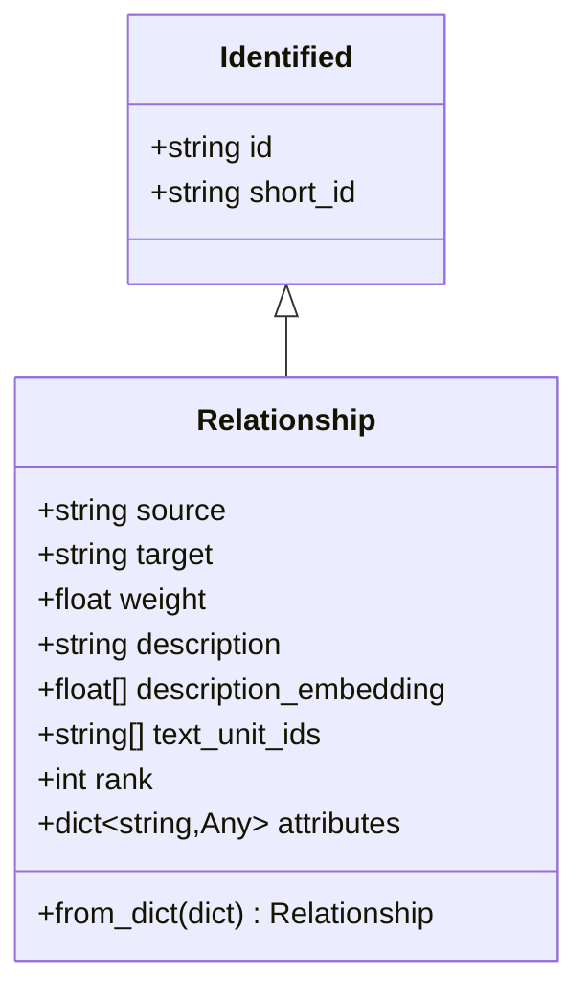
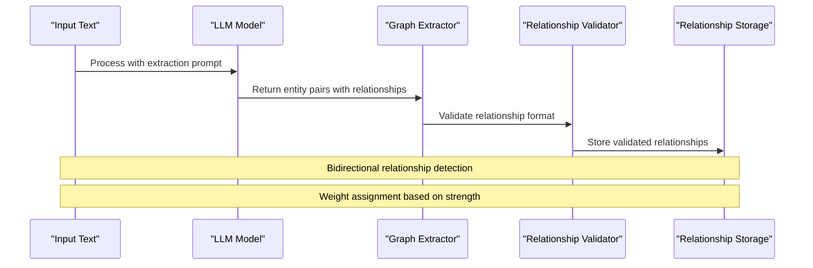
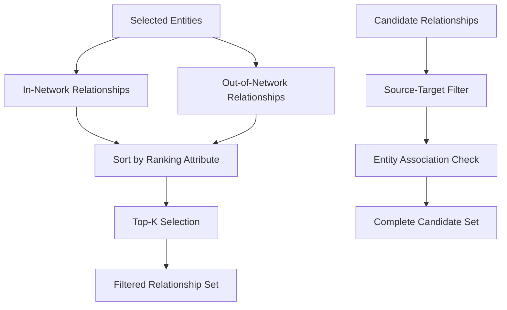
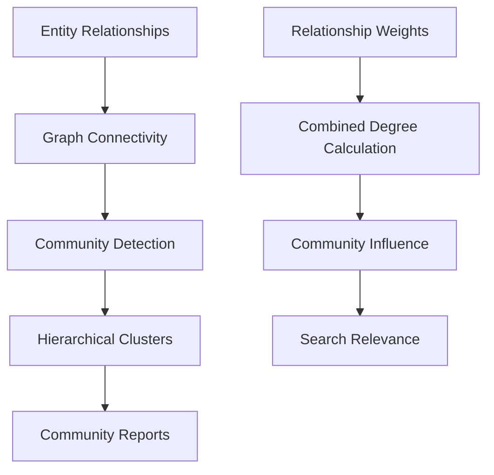
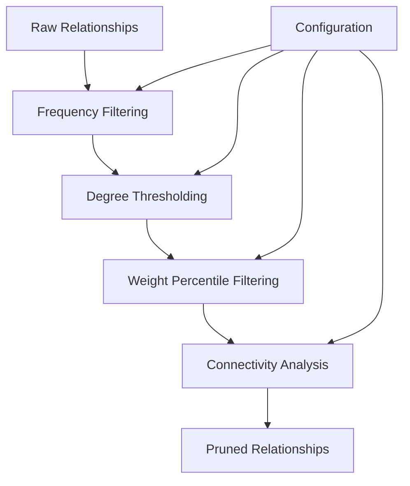

# Relationship Model

<cite>
**Referenced Files in This Document**
- [relationship.py](file://graphrag/data_model/relationship.py)
- [schemas.py](file://graphrag/data_model/schemas.py)
- [relationships.py](file://graphrag/query/input/retrieval/relationships.py)
- [finalize_relationships.py](file://graphrag/index/operations/finalize_relationships.py)
- [create_graph.py](file://graphrag/index/operations/create_graph.py)
- [prune_graph.py](file://graphrag/index/workflows/prune_graph.py)
- [local_context.py](file://graphrag/query/context_builder/local_context.py)
- [mixed_context.py](file://graphrag/query/structured_search/local_search/mixed_context.py)
- [community_context.py](file://graphrag/query/context_builder/community_context.py)
- [extract_graph_config.py](file://graphrag/config/models/extract_graph_config.py)
- [prune_graph_config.py](file://graphrag/config/models/prune_graph_config.py)
- [graph-visualization.ipynb](file://examples_notebooks/community_contrib/yfiles-jupyter-graphs/graph-visualization.ipynb)
- [full_graph.py](file://unified-search-app/app/ui/full_graph.py)
</cite>

## Table of Contents
1. [Introduction](#introduction)
2. [Core Relationship Model](#core-relationship-model)
3. [Graph Construction and Extraction](#graph-construction-and-extraction)
4. [Relationship Filtering and Traversal](#relationship-filtering-and-traversal)
5. [Semantic Significance and Weighted Edges](#semantic-significance-and-weighted-edges)
6. [Community Formation and Influence](#community-formation-and-influence)
7. [Performance Considerations](#performance-considerations)
8. [Visualization and Integration](#visualization-and-integration)
9. [Practical Usage Examples](#practical-usage-examples)
10. [Configuration and Best Practices](#configuration-and-best-practices)

## Introduction

The Relationship model in GraphRAG represents directed connections between entities in a knowledge graph, serving as the fundamental building blocks for understanding entity interactions and relationships. This model captures semantic connections with rich metadata, enabling sophisticated graph analytics, community detection, and intelligent search capabilities.

Relationships are extracted during the graph construction phase using Large Language Models (LLMs) and Natural Language Processing (NLP) strategies, forming the backbone of the knowledge graph's connectivity. Each relationship carries semantic significance through weights, rankings, and contextual descriptions that influence search relevance and community formation.

## Core Relationship Model

### Data Structure and Fields

The Relationship model is implemented as a dataclass inheriting from the Identified base class, providing a comprehensive representation of entity connections:



**Diagram sources**
- [relationship.py](file://graphrag/data_model/relationship.py#L12-L66)

#### Core Fields Analysis

| Field | Type | Purpose | Default Value |
|-------|------|---------|---------------|
| `source` | `str` | Source entity identifier | Required |
| `target` | `str` | Target entity identifier | Required |
| `weight` | `float \| None` | Edge weight for ranking and traversal | `1.0` |
| `description` | `str \| None` | Relationship description and context | `None` |
| `description_embedding` | `list[float] \| None` | Semantic embedding for similarity search | `None` |
| `text_unit_ids` | `list[str] \| None` | Associated text units containing this relationship | `None` |
| `rank` | `int \| None` | Importance ranking for sorting | `1` |
| `attributes` | `dict[str, Any] \| None` | Additional metadata for search prompts | `None` |

**Section sources**
- [relationship.py](file://graphrag/data_model/relationship.py#L16-L38)

### Relationship Instantiation and Validation

The Relationship model provides flexible instantiation through multiple pathways:

#### Dictionary-Based Creation
The `from_dict()` class method enables seamless conversion from serialized data:

```python
# Example instantiation pattern
relationship = Relationship.from_dict({
    "id": "rel_001",
    "human_readable_id": "rel_001",
    "source": "Company_A",
    "target": "Company_B",
    "description": "Ownership relationship with 100% stake",
    "weight": 2.5,
    "rank": 5,
    "text_unit_ids": ["doc_001", "doc_002"],
    "attributes": {"strength": "high", "type": "ownership"}
})
```

#### Schema Validation
The relationship schema ensures data integrity through predefined column mappings:

**Section sources**
- [schemas.py](file://graphrag/data_model/schemas.py#L85-L94)

## Graph Construction and Extraction

### LLM-Driven Relationship Extraction

Relationships are extracted during the graph construction phase using sophisticated LLM prompting strategies. The extraction process involves identifying entity pairs and determining their relationships with semantic strength assessment.



**Diagram sources**
- [graph_extractor.py](file://graphrag/index/operations/extract_graph/graph_extractor.py#L144-L177)
- [extract_graph.py](file://graphrag/index/operations/extract_graph/extract_graph.py#L93-L123)

### NLP Strategies for Relationship Detection

The extraction process employs multiple NLP strategies to identify and validate relationships:

#### Entity Pair Identification
- **Syntactic Parsing**: Identifies subject-verb-object patterns
- **Named Entity Recognition**: Locates entity mentions in text
- **Dependency Parsing**: Analyzes grammatical relationships

#### Relationship Strength Assessment
- **Contextual Analysis**: Evaluates relationship importance
- **Frequency Analysis**: Considers relationship occurrence patterns
- **Semantic Similarity**: Measures relationship concept overlap

**Section sources**
- [extract_graph_config.py](file://graphrag/config/models/extract_graph_config.py#L14-L56)

## Relationship Filtering and Traversal

### Filtering Strategies

The system provides sophisticated relationship filtering mechanisms for efficient graph navigation and context building:



**Diagram sources**
- [relationships.py](file://graphrag/query/input/retrieval/relationships.py#L14-L87)
- [local_context.py](file://graphrag/query/context_builder/local_context.py#L232-L254)

#### In-Network vs Out-of-Network Relationships

| Relationship Type | Description | Priority | Use Case |
|-------------------|-------------|----------|----------|
| **In-Network** | Relationships between selected entities | Highest | Local context building |
| **Out-of-Network** | Relationships involving selected entities | Medium | Extended context exploration |
| **Candidate** | All relationships associated with selected entities | Lowest | Comprehensive analysis |

#### Ranking and Sorting Mechanisms

Relationships are sorted using configurable ranking attributes:

```python
# Priority-based sorting logic
def sort_relationships_by_rank(relationships, ranking_attribute="rank"):
    """Sort relationships by specified ranking attribute."""
    if ranking_attribute == "rank":
        relationships.sort(key=lambda x: x.rank or 0, reverse=True)
    elif ranking_attribute == "weight":
        relationships.sort(key=lambda x: x.weight or 0.0, reverse=True)
    elif ranking_attribute in (relationships[0].attributes or {}):
        relationships.sort(
            key=lambda x: int(x.attributes[ranking_attribute]) if x.attributes else 0,
            reverse=True
        )
    return relationships
```

**Section sources**
- [relationships.py](file://graphrag/query/input/retrieval/relationships.py#L81-L102)

### Traversal Patterns in Queries

The relationship model supports various traversal patterns for intelligent search:

#### Breadth-First Traversal
Explores relationships within a specified depth, prioritizing high-weight connections.

#### Centrality-Based Traversal
Follows relationships with higher combined degrees for influential pathfinding.

#### Semantic Traversal
Uses relationship embeddings for conceptually similar path exploration.

**Section sources**
- [local_context.py](file://graphrag/query/context_builder/local_context.py#L158-L254)

## Semantic Significance and Weighted Edges

### Bidirectional Relationships

While primarily designed for directed relationships, the system accommodates bidirectional semantics through:

#### Symmetric Relationship Handling
- **Implicit Bidirectionality**: Source-target relationships imply inverse direction
- **Weight Aggregation**: Combined weights for mutual connections
- **Contextual Relevance**: Both directions contribute to search relevance

#### Weighted Edge Significance

Relationship weights serve multiple purposes in context retrieval:

| Weight Range | Semantic Meaning | Impact on Search |
|--------------|------------------|------------------|
| 0.1-1.0 | Weak/Informal connection | Low relevance boost |
| 1.1-3.0 | Moderate relationship | Standard relevance |
| 3.1-5.0 | Strong relationship | High relevance boost |
| 5.0+ | Critical relationship | Maximum relevance impact |

### Semantic Embeddings

Relationship descriptions can be embedded for semantic similarity search:

```python
# Embedding generation for semantic similarity
relationship_embedding = text_embedder.embed(relationship.description)
relationship.description_embedding = relationship_embedding.tolist()
```

These embeddings enable:
- **Conceptual Similarity**: Finding relationships with similar semantic meaning
- **Context Expansion**: Discovering related relationships beyond literal matches
- **Intelligent Filtering**: Removing semantically redundant relationships

**Section sources**
- [generate_text_embeddings.py](file://graphrag/index/workflows/generate_text_embeddings.py#L113-L130)

## Community Formation and Influence

### Relationship Contribution to Communities

Relationships play a crucial role in community detection and formation:



**Diagram sources**
- [create_communities.py](file://graphrag/index/workflows/create_communities.py#L54-L156)
- [community_context.py](file://graphrag/query/context_builder/community_context.py#L199-L225)

### Influence on Search Relevance

Relationships influence search relevance through multiple mechanisms:

#### Combined Degree Metrics
- **Edge Combined Degree**: Sum of source and target degrees
- **Weighted Influence**: Higher weights amplify community impact
- **Text Unit Correlation**: Frequency of relationships across documents

#### Community Weight Normalization
The system normalizes relationship weights by community size:

```python
# Community weight calculation
community_weight = len(set(community_text_units.get(community_id, [])))
normalized_weight = community_weight / max_weight
```

**Section sources**
- [community_context.py](file://graphrag/query/context_builder/community_context.py#L199-L225)

## Performance Considerations

### High-Density Graph Optimization

Working with high-density graphs requires careful optimization strategies:

#### Memory Management
- **Lazy Loading**: Load relationships on-demand during traversal
- **Streaming Processing**: Process relationships in batches
- **Index Optimization**: Maintain efficient relationship indices

#### Computational Efficiency
- **Parallel Processing**: Distribute relationship computation across cores
- **Caching Strategies**: Cache frequently accessed relationship patterns
- **Incremental Updates**: Minimize recomputation during graph updates

### Pruning Strategies for Low-Value Relationships

The pruning system removes low-value relationships to optimize performance:



**Diagram sources**
- [prune_graph.py](file://graphrag/index/workflows/prune_graph.py#L53-L82)
- [prune_graph_config.py](file://graphrag/config/models/prune_graph_config.py#L11-L42)

#### Pruning Criteria

| Criterion | Purpose | Configuration Parameter |
|-----------|---------|------------------------|
| **Min Node Frequency** | Remove rarely occurring relationships | `min_node_freq` |
| **Min Edge Weight** | Eliminate weak relationships | `min_edge_weight_pct` |
| **Connectivity** | Preserve connected components | `lcc_only` |
| **Standard Deviation** | Remove outlier relationships | `max_node_freq_std` |

**Section sources**
- [prune_graph_config.py](file://graphrag/config/models/prune_graph_config.py#L14-L42)

## Visualization and Integration

### Integration with Visualization Tools

The relationship model integrates seamlessly with various visualization frameworks:

#### NetworkX Integration
```python
# Graph creation for visualization
graph = create_graph(relationships, edge_attr=["weight"])
```

#### Interactive Visualization Support
- **yFiles Integration**: Rich interactive graph visualization
- **Streamlit Dashboard**: Web-based graph exploration interface
- **Altair Charts**: Statistical graph visualizations

**Section sources**
- [create_graph.py](file://graphrag/index/operations/create_graph.py#L10-L24)
- [full_graph.py](file://unified-search-app/app/ui/full_graph.py#L12-L56)

### DataFrame Conversion for Analysis

Relationships can be converted to pandas DataFrames for analysis:

```python
# Convert relationships to DataFrame
df = to_relationship_dataframe(relationships, include_relationship_weight=True)
```

This enables:
- **Statistical Analysis**: Relationship distribution and patterns
- **Export Capabilities**: Save relationships for external analysis
- **Integration**: Compatibility with data science workflows

**Section sources**
- [relationships.py](file://graphrag/query/input/retrieval/relationships.py#L105-L140)

## Practical Usage Examples

### Relationship Instantiation Patterns

#### Basic Relationship Creation
```python
# Simple relationship with core fields
basic_rel = Relationship(
    id="rel_001",
    source="Organization_X",
    target="Person_Y",
    description="CEO of Organization_X",
    weight=2.0,
    rank=3
)
```

#### Advanced Relationship with Metadata
```python
# Relationship with comprehensive metadata
advanced_rel = Relationship(
    id="rel_002",
    source="Technology_A",
    target="Market_B",
    description="Disruptive innovation in Market_B",
    weight=4.5,
    rank=8,
    text_unit_ids=["doc_001", "doc_003"],
    attributes={
        "impact": "high",
        "timeframe": "short_term",
        "sector": "technology"
    }
)
```

### Context Building Examples

#### Local Context Construction
```python
# Build relationship context for search
relationship_context, context_data = build_relationship_context(
    selected_entities=selected_entities,
    relationships=all_relationships,
    tokenizer=tokenizer,
    max_context_tokens=8000,
    top_k_relationships=10,
    include_relationship_weight=True
)
```

#### Mixed Context Integration
```python
# Combine relationships with other context types
final_context = mixed_context_builder.build_context(
    selected_entities=entities,
    max_context_tokens=16000,
    include_entity_rank=True,
    include_relationship_weight=True
)
```

**Section sources**
- [local_context.py](file://graphrag/query/context_builder/local_context.py#L158-L254)
- [mixed_context.py](file://graphrag/query/structured_search/local_search/mixed_context.py#L190-L493)

## Configuration and Best Practices

### Optimal Relationship Configuration

#### Extraction Strategy Selection
Choose appropriate extraction strategies based on content characteristics:

| Content Type | Recommended Strategy | Rationale |
|--------------|---------------------|-----------|
| **Technical Documents** | Graph Intelligence | Structured relationship extraction |
| **Narrative Text** | Regex-based | Pattern-based relationship discovery |
| **Mixed Content** | Hybrid Approach | Combine multiple extraction methods |

#### Pruning Configuration Guidelines

```python
# Conservative pruning for research applications
pruning_config = PruneGraphConfig(
    min_node_freq=5,
    min_node_degree=2,
    min_edge_weight_pct=20,
    lcc_only=True
)

# Aggressive pruning for performance
pruning_config = PruneGraphConfig(
    min_node_freq=10,
    min_node_degree=3,
    min_edge_weight_pct=40,
    lcc_only=False
)
```

### Performance Optimization Best Practices

#### Memory-Efficient Processing
- **Batch Processing**: Process relationships in manageable chunks
- **Streaming Operations**: Avoid loading entire relationship sets into memory
- **Garbage Collection**: Regular cleanup of unused relationship objects

#### Indexing Strategies
- **Entity-Based Indexing**: Index relationships by source and target entities
- **Weight-Based Indexing**: Maintain separate indices for different weight ranges
- **Temporal Indexing**: Organize relationships by creation date or relevance

#### Caching Implementation
```python
# Relationship caching for frequently accessed patterns
cache_key = f"relationships_{','.join(sorted(entity_ids))}"
cached_relationships = cache.get(cache_key)
if cached_relationships is None:
    cached_relationships = compute_relationships(entity_ids)
    cache.set(cache_key, cached_relationships)
```

### Quality Assurance Guidelines

#### Relationship Validation
- **Format Validation**: Ensure required fields are present
- **Semantic Consistency**: Verify relationship descriptions align with entity types
- **Weight Reasonableness**: Check weight values fall within expected ranges

#### Data Integrity Checks
- **Duplicate Detection**: Prevent duplicate relationships between same entities
- **Reference Integrity**: Ensure source and target entities exist
- **Embedding Validation**: Verify semantic embeddings are properly computed

**Section sources**
- [extract_graph_config.py](file://graphrag/config/models/extract_graph_config.py#L14-L56)
- [prune_graph_config.py](file://graphrag/config/models/prune_graph_config.py#L11-L42)