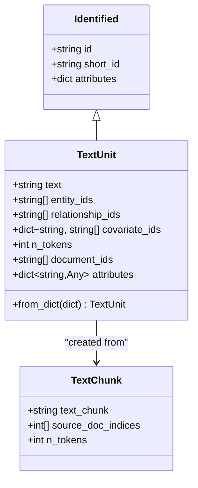
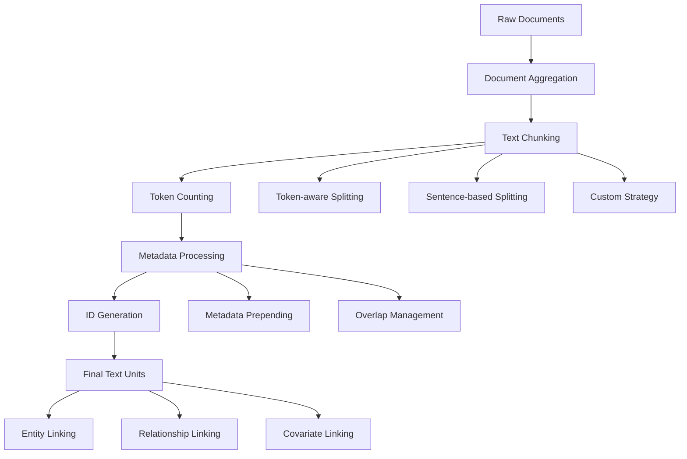
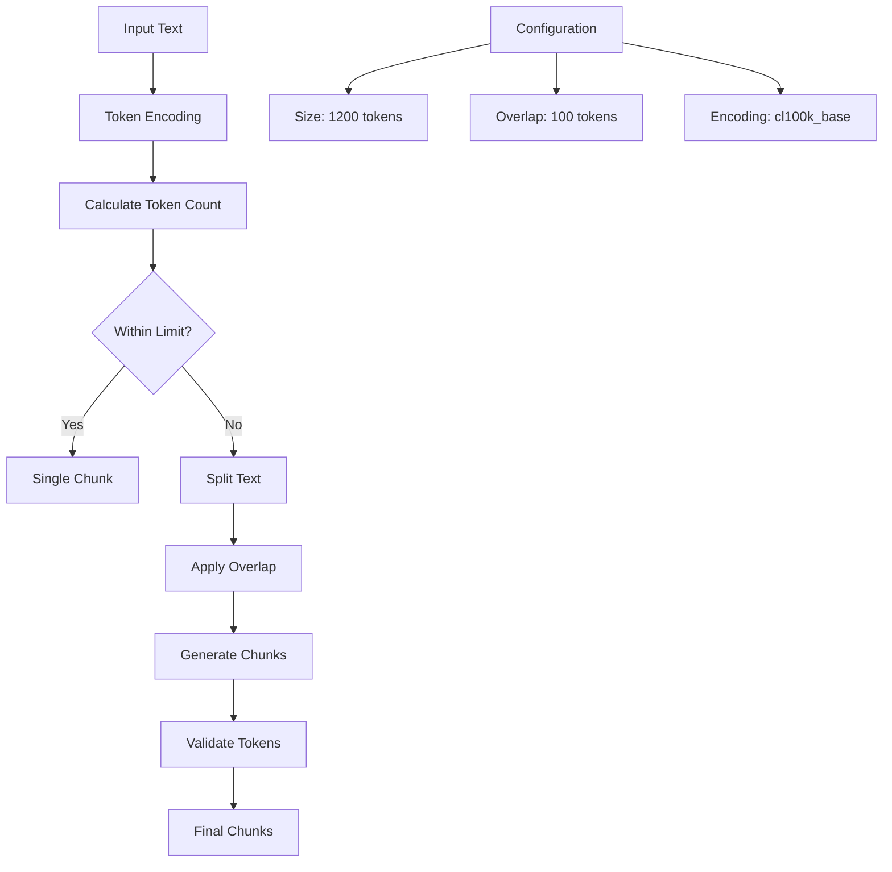
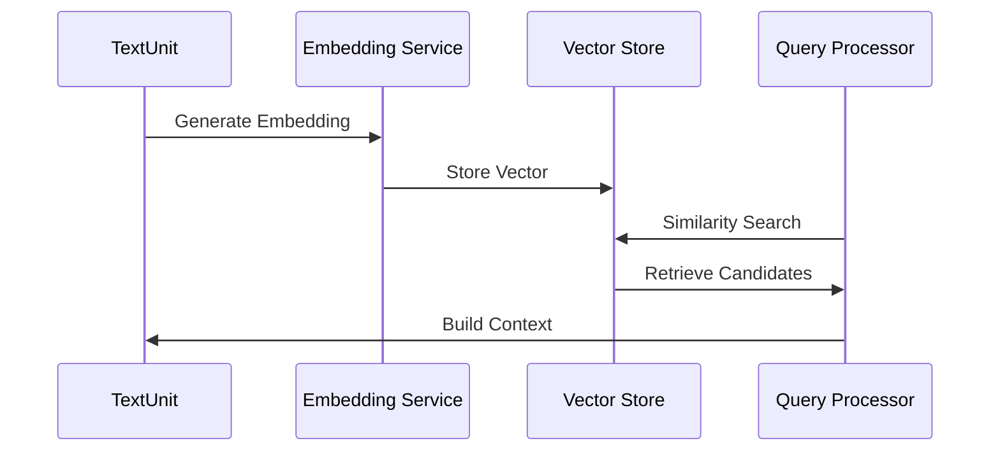
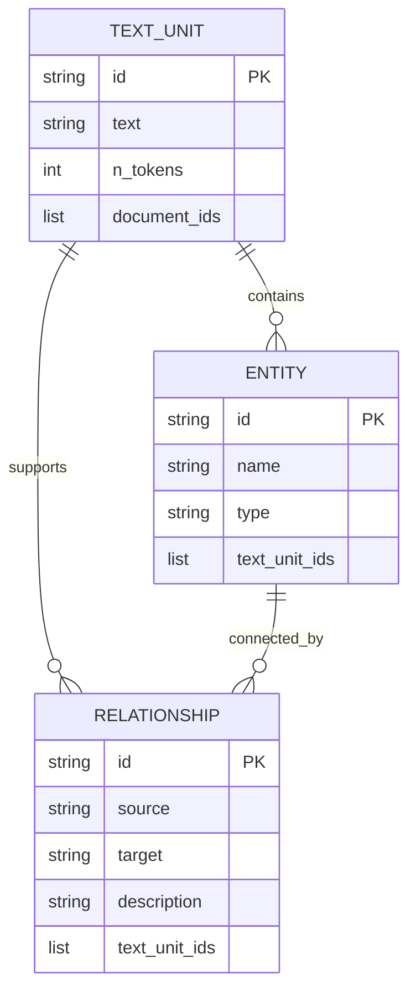
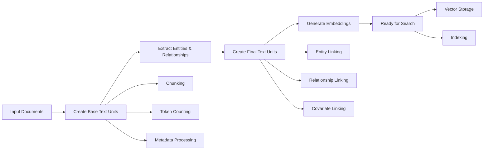

# Text Unit Model

<cite>
**Referenced Files in This Document**
- [text_unit.py](file://graphrag/data_model/text_unit.py)
- [create_base_text_units.py](file://graphrag/index/workflows/create_base_text_units.py)
- [create_final_text_units.py](file://graphrag/index/workflows/create_final_text_units.py)
- [chunk_text.py](file://graphrag/index/operations/chunk_text/chunk_text.py)
- [strategies.py](file://graphrag/index/operations/chunk_text/strategies.py)
- [text_splitting.py](file://graphrag/index/text_splitting/text_splitting.py)
- [embed_text.py](file://graphrag/index/operations/embed_text/embed_text.py)
- [schemas.py](file://graphrag/data_model/schemas.py)
- [types.py](file://graphrag/data_model/types.py)
- [basic_context.py](file://graphrag/query/structured_search/basic_search/basic_context.py)
- [mixed_context.py](file://graphrag/query/structured_search/local_search/mixed_context.py)
- [factory.py](file://graphrag/query/factory.py)
</cite>

## Table of Contents
1. [Introduction](#introduction)
2. [TextUnit Model Architecture](#textunit-model-architecture)
3. [Text Unit Creation Process](#text-unit-creation-process)
4. [Chunking Strategies](#chunking-strategies)
5. [Text Unit Embedding and Search](#text-unit-embedding-and-search)
6. [Knowledge Extraction Grounding](#knowledge-extraction-grounding)
7. [Text Unit Processing Pipeline](#text-unit-processing-pipeline)
8. [Common Issues and Solutions](#common-issues-and-solutions)
9. [Code Examples and Usage Patterns](#code-examples-and-usage-patterns)
10. [Performance Optimization](#performance-optimization)

## Introduction

The TextUnit model serves as the fundamental building block in GraphRAG's knowledge extraction pipeline, representing discrete chunks of source text that form the basis for entity and relationship extraction. Each text unit encapsulates a meaningful segment of content with contextual metadata, enabling precise knowledge grounding and efficient retrieval during the graph construction process.

Text units bridge the gap between raw document content and structured knowledge by providing granular, token-aware segments that maintain semantic coherence while optimizing for computational efficiency. They serve as the primary reference points for extracted entities, relationships, and covariates, ensuring that all knowledge claims can be traced back to their original source contexts.

## TextUnit Model Architecture

The TextUnit model extends the Identified base class to provide a comprehensive representation of text chunks with rich contextual information.



**Diagram sources**
- [text_unit.py](file://graphrag/data_model/text_unit.py#L12-L63)
- [chunk_text.py](file://graphrag/index/operations/chunk_text/chunk_text.py#L88-L90)

### Core Fields

The TextUnit model contains several essential fields that define its structure and capabilities:

| Field | Type | Description | Purpose |
|-------|------|-------------|---------|
| `id` | string | Unique identifier | Primary key for text unit identification |
| `text` | string | Content of the text unit | The actual text content being processed |
| `entity_ids` | list[string] | Related entities | Links to extracted entities in the unit |
| `relationship_ids` | list[string] | Related relationships | Links to extracted relationships in the unit |
| `covariate_ids` | dict[string, list[string]] | Related covariates | Links to temporal/spatial covariates |
| `n_tokens` | int | Token count | Number of tokens for embedding optimization |
| `document_ids` | list[string] | Source documents | References to original source documents |
| `attributes` | dict[Any, Any] | Additional metadata | Custom attributes and properties |

**Section sources**
- [text_unit.py](file://graphrag/data_model/text_unit.py#L12-L63)
- [schemas.py](file://graphrag/data_model/schemas.py#L62-L72)

## Text Unit Creation Process

Text units are created during the chunking phase of the indexing pipeline, transforming raw documents into manageable, semantically coherent segments.



**Diagram sources**
- [create_base_text_units.py](file://graphrag/index/workflows/create_base_text_units.py#L53-L163)
- [chunk_text.py](file://graphrag/index/operations/chunk_text/chunk_text.py#L41-L90)

### Chunking Phase Implementation

The chunking process involves several sophisticated strategies for optimal text segmentation:

#### Document Preparation
Documents are first aggregated and sorted by ID to ensure consistent processing order. Metadata is optionally prepended to chunks to preserve contextual information.

#### Strategy Selection
Multiple chunking strategies are available:
- **Token-based chunking**: Uses token-aware splitting with configurable overlap
- **Sentence-based chunking**: Preserves sentence boundaries for semantic coherence
- **Custom strategies**: Pluggable chunking approaches for specialized requirements

#### Token-Aware Processing
The system calculates token counts using the specified encoding model to ensure chunks fit within embedding model constraints while maintaining semantic integrity.

**Section sources**
- [create_base_text_units.py](file://graphrag/index/workflows/create_base_text_units.py#L53-L163)
- [strategies.py](file://graphrag/index/operations/chunk_text/strategies.py#L35-L55)

## Chunking Strategies

GraphRAG implements multiple chunking strategies to accommodate different content types and processing requirements.

### Token-Aware Splitting

The primary chunking mechanism uses token-aware splitting to ensure optimal embedding compatibility:



**Diagram sources**
- [text_splitting.py](file://graphrag/index/text_splitting/text_splitting.py#L119-L174)
- [strategies.py](file://graphrag/index/operations/chunk_text/strategies.py#L35-L55)

### Sentence-Based Chunking

For content requiring semantic preservation, sentence-based chunking maintains natural language boundaries:

- **Boundary Detection**: Identifies sentence boundaries using NLTK
- **Coherence Preservation**: Ensures chunks contain complete thoughts
- **Flexibility**: Adapts to varying sentence lengths

### Metadata Integration

Text units support rich metadata integration for enhanced context preservation:

- **Prepending**: Metadata is prepended to chunks for context
- **Token Accounting**: Metadata tokens are accounted for in chunk sizing
- **Flexible Formatting**: Supports various metadata structures

**Section sources**
- [text_splitting.py](file://graphrag/index/text_splitting/text_splitting.py#L119-L174)
- [create_base_text_units.py](file://graphrag/index/workflows/create_base_text_units.py#L86-L126)

## Text Unit Embedding and Search

Text units are embedded into vector space for efficient similarity search and context retrieval during query processing.



**Diagram sources**
- [embed_text.py](file://graphrag/index/operations/embed_text/embed_text.py#L39-L247)
- [basic_context.py](file://graphrag/query/structured_search/basic_search/basic_context.py#L43-L74)

### Embedding Generation

Text units undergo embedding generation through configurable strategies:

#### OpenAI Embeddings
- **Model Support**: Compatible with OpenAI embedding models
- **Batch Processing**: Efficient batch embedding generation
- **Vector Storage**: Integration with vector stores for fast retrieval

#### Memory vs. Vector Store
The system supports both in-memory and persistent vector storage:
- **Memory Storage**: Fast access for small datasets
- **Vector Stores**: Scalable solutions for large-scale deployments

### Similarity Search

Text units enable efficient similarity search through vector embeddings:

#### Basic Search Context
Simple similarity search using text embeddings for direct content matching.

#### Local Search Context
Advanced context building combining text units with entities, relationships, and communities for comprehensive knowledge retrieval.

**Section sources**
- [embed_text.py](file://graphrag/index/operations/embed_text/embed_text.py#L39-L247)
- [basic_context.py](file://graphrag/query/structured_search/basic_search/basic_context.py#L43-L74)
- [mixed_context.py](file://graphrag/query/structured_search/local_search/mixed_context.py#L87-L217)

## Knowledge Extraction Grounding

Text units serve as the foundational reference points for all knowledge extraction activities, ensuring traceability and verifiability of extracted information.

### Entity Linking

Entities are linked to text units to establish extraction provenance:



**Diagram sources**
- [create_final_text_units.py](file://graphrag/index/workflows/create_final_text_units.py#L55-L128)
- [schemas.py](file://graphrag/data_model/schemas.py#L53-L58)

### Relationship Grounding

Relationship extraction is anchored to specific text units, enabling precise attribution of extracted connections.

### Covariate Association

Temporal and spatial covariates are associated with text units to provide contextual enrichment.

**Section sources**
- [create_final_text_units.py](file://graphrag/index/workflows/create_final_text_units.py#L55-L128)
- [schemas.py](file://graphrag/data_model/schemas.py#L53-L58)

## Text Unit Processing Pipeline

The text unit processing pipeline orchestrates the transformation from raw documents to enriched knowledge units through multiple workflow stages.



**Diagram sources**
- [create_base_text_units.py](file://graphrag/index/workflows/create_base_text_units.py#L25-L50)
- [create_final_text_units.py](file://graphrag/index/workflows/create_final_text_units.py#L23-L52)

### Base Text Unit Creation

The initial stage creates raw text units from documents with basic metadata and token counts.

### Final Text Unit Processing

The refinement stage enriches text units with extracted knowledge relationships.

### Incremental Updates

Support for incremental updates ensures efficient processing of changing document sets.

**Section sources**
- [create_base_text_units.py](file://graphrag/index/workflows/create_base_text_units.py#L25-L164)
- [create_final_text_units.py](file://graphrag/index/workflows/create_final_text_units.py#L23-L128)

## Common Issues and Solutions

### Over-Chunking

**Problem**: Excessive fragmentation reduces semantic coherence and increases processing overhead.

**Solutions**:
- Increase chunk size within token limits
- Use sentence-aware chunking strategies
- Implement semantic boundary detection

### Under-Chunking

**Problem**: Large chunks lose granularity and may exceed embedding model limits.

**Solutions**:
- Reduce chunk size incrementally
- Implement hierarchical chunking
- Use adaptive chunking based on content structure

### Context Preservation

**Problem**: Loss of contextual information during chunking.

**Solutions**:
- Configure appropriate overlap settings
- Preserve metadata in chunk headers
- Use sliding window approaches

### Token Limit Management

**Problem**: Text units exceeding embedding model token limits.

**Solutions**:
- Implement token-aware chunking
- Use truncation with context preservation
- Apply summarization for very long texts

**Section sources**
- [text_splitting.py](file://graphrag/index/text_splitting/text_splitting.py#L119-L174)
- [create_base_text_units.py](file://graphrag/index/workflows/create_base_text_units.py#L101-L107)

## Code Examples and Usage Patterns

### Basic Text Unit Creation

Creating text units from documents with token-aware chunking:

```python
# Example workflow execution
workflow_output = await run_workflow(config, context)
text_units_df = workflow_output.result
```

### Custom Chunking Configuration

Implementing specialized chunking strategies:

```python
# Token-aware chunking with metadata
config = {
    "strategy": "tokens",
    "size": 1200,
    "overlap": 100,
    "encoding_model": "cl100k_base",
    "prepend_metadata": True
}
```

### Text Unit Retrieval

Accessing text units for knowledge extraction:

```python
# Load text units from storage
text_units = await load_table_from_storage("text_units", storage)
```

### Embedding Generation

Generating embeddings for text units:

```python
# Embed text units for similarity search
embeddings = await embed_text(
    input=text_units_df,
    callbacks=callbacks,
    cache=cache,
    embed_column="text",
    strategy=embedding_config
)
```

**Section sources**
- [create_base_text_units.py](file://graphrag/index/workflows/create_base_text_units.py#L25-L50)
- [embed_text.py](file://graphrag/index/operations/embed_text/embed_text.py#L39-L247)

## Performance Optimization

### Token Count Optimization

Efficient token management ensures optimal embedding utilization:

- **Dynamic Sizing**: Adaptive chunk sizes based on content characteristics
- **Overlap Optimization**: Balanced overlap-to-content ratio
- **Encoding Efficiency**: Optimal encoding model selection

### Memory Management

Large-scale text unit processing requires careful memory management:

- **Batch Processing**: Configurable batch sizes for embedding generation
- **Streaming Operations**: Memory-efficient processing of large datasets
- **Garbage Collection**: Proper cleanup of intermediate data structures

### Parallel Processing

Multi-threaded chunking and embedding generation:

- **Concurrent Chunking**: Parallel processing of document batches
- **Async Operations**: Non-blocking embedding generation
- **Resource Pooling**: Efficient resource utilization across operations

**Section sources**
- [embed_text.py](file://graphrag/index/operations/embed_text/embed_text.py#L133-L181)
- [text_splitting.py](file://graphrag/index/text_splitting/text_splitting.py#L140-L174)