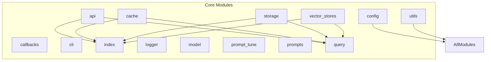
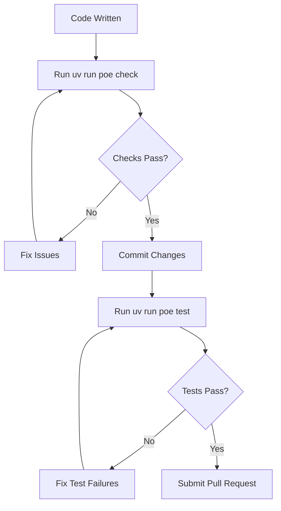
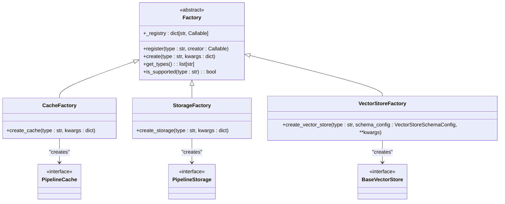

# Development Guide

<cite>
**Referenced Files in This Document**   
- [CONTRIBUTING.md](file://CONTRIBUTING.md)
- [DEVELOPING.md](file://DEVELOPING.md)
- [pyproject.toml](file://pyproject.toml)
- [graphrag/factory/factory.py](file://graphrag/factory/factory.py)
- [graphrag/cache/factory.py](file://graphrag/cache/factory.py)
- [graphrag/storage/factory.py](file://graphrag/storage/factory.py)
- [graphrag/vector_stores/factory.py](file://graphrag/vector_stores/factory.py)
- [tests/mock_provider.py](file://tests/mock_provider.py)
- [tests/conftest.py](file://tests/conftest.py)
</cite>

## Table of Contents
1. [Introduction](#introduction)
2. [Development Environment Setup](#development-environment-setup)
3. [Repository Structure](#repository-structure)
4. [Lifecycle Scripts and Commands](#lifecycle-scripts-and-commands)
5. [Coding Standards and Testing Practices](#coding-standards-and-testing-practices)
6. [Extending the System](#extending-the-system)
7. [Contribution Guidelines](#contribution-guidelines)
8. [Debugging and Performance Profiling](#debugging-and-performance-profiling)
9. [Conclusion](#conclusion)

## Introduction
This Development Guide provides comprehensive information for contributing to and extending the GraphRAG codebase. It covers the setup of the development environment, repository structure, coding standards, testing practices, and contribution guidelines. The guide is designed to onboard new contributors and empower advanced users to modify the system for their specific needs. GraphRAG is a graph-based retrieval-augmented generation (RAG) system that leverages knowledge graph memory structures to enhance LLM outputs, and this document serves as the primary resource for developers looking to contribute to its evolution.

## Development Environment Setup

To set up the development environment for GraphRAG, you need Python 3.10 or 3.11 and the uv package manager. The uv tool is used for package management and virtual environment management in the Python codebase. After installing Python and uv, you can install the project dependencies by running `uv sync` in the project root directory. This command installs all the required packages specified in the pyproject.toml file. For contributors who encounter compilation issues, two common troubleshooting steps are required: installing llvm-9 and llvm-9-dev packages, and setting the LLVM_CONFIG environment variable to point to llvm-config-9, as well as installing python3.10-dev to resolve Python.h header file issues during package compilation.

**Section sources**
- [DEVELOPING.md](file://DEVELOPING.md#L3-L118)
- [pyproject.toml](file://pyproject.toml#L26-L70)

## Repository Structure

The GraphRAG repository follows a modular structure with clearly defined components. The core modules include api for library API definitions, cache for caching functionality, callbacks for commonly used callback functions, cli for the command-line interface, config for configuration management, index for the indexing engine, logger for logging capabilities, model for data model definitions, prompt_tune for prompt tuning, prompts for system prompts, query for the query engine, storage for storage options, utils for helper functions, and vector_stores for vector store implementations. The architecture leverages a factory design pattern throughout, enabling multiple implementations for each core component and allowing users to register custom implementations. This design promotes extensibility and modularity, making it easier to add new features and modify existing functionality.

**Diagram sources**
- [DEVELOPING.md](file://DEVELOPING.md#L33-L58)
- [graphrag/factory/factory.py](file://graphrag/factory/factory.py#L1-L69)

**Section sources**
- [DEVELOPING.md](file://DEVELOPING.md#L33-L58)
- [graphrag/factory/factory.py](file://graphrag/factory/factory.py#L1-L69)

## Lifecycle Scripts and Commands

GraphRAG utilizes uv and poethepoet to manage dependencies and custom build scripts. The lifecycle scripts provide a comprehensive set of commands for development tasks. Key commands include `uv run poe index` to run the indexing CLI, `uv run poe query` to execute queries, `uv run poe test` to run all tests, and `uv run poe check` to perform static analysis including formatting, linting, and type checking. Additional commands like `uv run poe fix` apply auto-fixes to code formatting issues, while `uv run poe format` explicitly runs the formatter. The test suite is divided into unit, integration, and smoke tests, accessible through `uv run poe test_unit`, `uv run poe test_integration`, and `uv run poe test_smoke` respectively. For testing components that rely on Azure resources, the Azurite emulator can be started using the script `./scripts/start-azurite.sh`.

**Section sources**
- [DEVELOPING.md](file://DEVELOPING.md#L79-L100)
- [pyproject.toml](file://pyproject.toml#L110-L164)

## Coding Standards and Testing Practices

The GraphRAG codebase adheres to strict coding standards enforced through automated tools. The project uses ruff for code formatting and linting, pyright for type checking, and pytest for testing. The configuration in pyproject.toml specifies the rules and conventions that must be followed, including the numpy docstring convention. Unit tests are organized in the tests/unit directory and focus on testing individual components in isolation. Integration tests in tests/integration verify the interaction between components, while smoke tests in tests/smoke provide basic validation of the system's functionality. The test suite includes a mock provider in tests/mock_provider.py that simulates LLM responses for testing purposes without making actual API calls. The conftest.py file contains pytest configuration, including the option to run slow tests with the --run_slow flag.

**Diagram sources**
- [pyproject.toml](file://pyproject.toml#L166-L266)
- [tests/mock_provider.py](file://tests/mock_provider.py#L1-L126)
- [tests/conftest.py](file://tests/conftest.py#L1-L9)

**Section sources**
- [pyproject.toml](file://pyproject.toml#L166-L266)
- [tests/mock_provider.py](file://tests/mock_provider.py#L1-L126)
- [tests/conftest.py](file://tests/conftest.py#L1-L9)

## Extending the System

GraphRAG is designed to be extensible through its factory pattern implementation. Developers can add new features by creating custom implementations of core components such as storage backends, cache systems, and vector stores. The factory classes in cache/factory.py, storage/factory.py, and vector_stores/factory.py provide register methods that allow users to add their own implementations. For example, to implement a custom storage backend, a developer would create a class that inherits from PipelineStorage and register it with the StorageFactory using the register method. Similarly, custom cache implementations can be registered with CacheFactory, and custom vector stores with VectorStoreFactory. This extensibility enables integration with various infrastructure components and allows the system to be adapted to specific deployment requirements and performance characteristics.

**Diagram sources**
- [graphrag/factory/factory.py](file://graphrag/factory/factory.py#L1-L69)
- [graphrag/cache/factory.py](file://graphrag/cache/factory.py#L1-L116)
- [graphrag/storage/factory.py](file://graphrag/storage/factory.py#L1-L84)
- [graphrag/vector_stores/factory.py](file://graphrag/vector_stores/factory.py#L1-L97)

**Section sources**
- [graphrag/factory/factory.py](file://graphrag/factory/factory.py#L1-L69)
- [graphrag/cache/factory.py](file://graphrag/cache/factory.py#L1-L116)
- [graphrag/storage/factory.py](file://graphrag/storage/factory.py#L1-L84)
- [graphrag/vector_stores/factory.py](file://graphrag/vector_stores/factory.py#L1-L97)

## Contribution Guidelines

Contributors to GraphRAG should follow a standardized workflow outlined in CONTRIBUTING.md. The process begins with forking the repository and creating a new branch for the contribution. After making changes and ensuring all tests pass, contributors must create a semver impact document using the command `uv run semversioner add-change -t <major|minor|patch> -d <description>`. This tool helps maintain semantic versioning by documenting the impact of changes. Before submitting a pull request, contributors are encouraged to file an issue to discuss their proposed changes and avoid unnecessary work. Security vulnerabilities should not be reported through public GitHub issues but rather through the Microsoft Security Response Center. The project follows Microsoft's Open Source Code of Conduct and requires contributors to agree to a Contributor License Agreement (CLA) before their contributions can be accepted.

**Section sources**
- [CONTRIBUTING.md](file://CONTRIBUTING.md#L1-L80)
- [DEVELOPING.md](file://DEVELOPING.md#L62-L68)
- [scripts/semver-check.sh](file://scripts/semver-check.sh#L1-L11)

## Debugging and Performance Profiling

Effective debugging in GraphRAG involves leveraging the comprehensive logging system and understanding the execution flow of the indexing and query pipelines. Developers can use the callback system to monitor pipeline execution and identify bottlenecks. For performance profiling, the structured nature of the codebase allows for targeted analysis of specific components such as the graph extraction, community detection, and embedding generation processes. When debugging issues related to external dependencies, the mock provider in tests/mock_provider.py can be adapted for development purposes to simulate LLM responses without incurring costs or network latency. For memory and performance issues, Python's built-in profiling tools can be integrated with the existing codebase to identify hotspots. The factory pattern also facilitates testing alternative implementations of components to compare performance characteristics.

**Section sources**
- [graphrag/callbacks/workflow_callbacks_manager.py](file://graphrag/callbacks/workflow_callbacks_manager.py)
- [tests/mock_provider.py](file://tests/mock_provider.py#L1-L126)

## Conclusion

This Development Guide provides a comprehensive overview of the GraphRAG codebase, covering setup, structure, coding standards, testing practices, and contribution guidelines. By following the patterns and practices outlined in this document, developers can effectively contribute to the project and extend its capabilities to meet their specific needs. The factory-based architecture enables significant extensibility, allowing for custom implementations of storage, caching, and vector store components. The robust testing framework and clear contribution workflow ensure that the codebase maintains high quality as it evolves. As GraphRAG continues to develop, this guide will serve as the foundation for onboarding new contributors and maintaining consistency across the project.