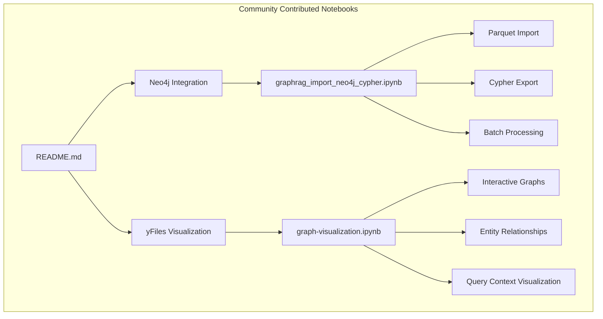
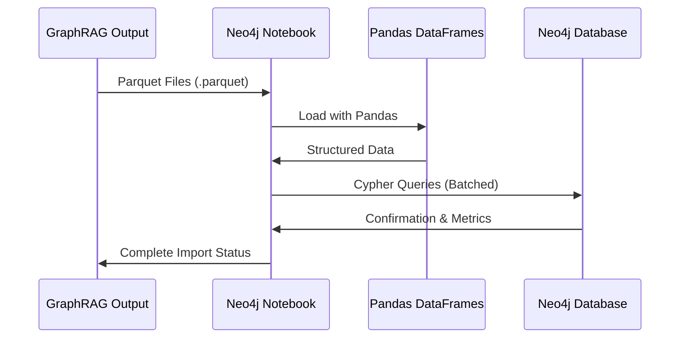
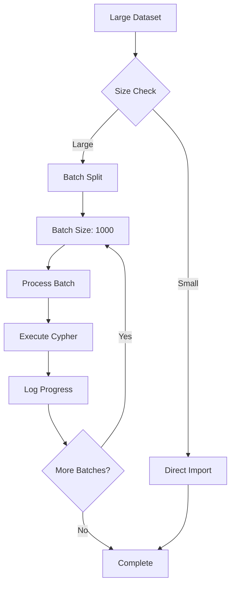
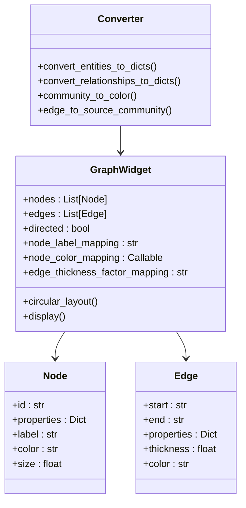
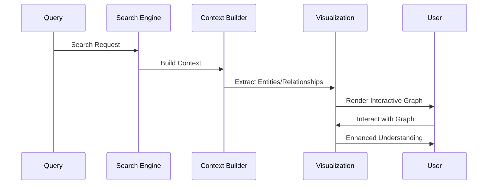

# Community-Contributed Notebooks

<cite>
**Referenced Files in This Document**
- [README.md](file://examples_notebooks/community_contrib/README.md)
- [graphrag_import_neo4j_cypher.ipynb](file://examples_notebooks/community_contrib/neo4j/graphrag_import_neo4j_cypher.ipynb)
- [graph-visualization.ipynb](file://examples_notebooks/community_contrib/yfiles-jupyter-graphs/graph-visualization.ipynb)
</cite>

## Table of Contents
1. [Introduction](#introduction)
2. [Project Structure](#project-structure)
3. [Neo4j Integration Notebook](#neo4j-integration-notebook)
4. [Graph Visualization Notebook](#graph-visualization-notebook)
5. [Prerequisites and Setup](#prerequisites-and-setup)
6. [Execution Guidance](#execution-guidance)
7. [Troubleshooting Guide](#troubleshooting-guide)
8. [Adaptation Guidelines](#adaptation-guidelines)
9. [Conclusion](#conclusion)

## Introduction

The GraphRAG community-contributed notebooks represent valuable extensions to the core GraphRAG framework, providing practical solutions for integrating GraphRAG-generated knowledge graphs with external systems and enhancing visualization capabilities. These notebooks demonstrate how the GraphRAG ecosystem can be extended beyond its core functionality to support debugging, analysis, and presentation workflows.

These community-developed resources showcase the flexibility and extensibility of GraphRAG, enabling users to leverage their generated knowledge graphs in various downstream applications. The notebooks serve as practical examples of how to integrate GraphRAG with popular graph databases and visualization tools, extending the platform's capabilities for real-world use cases.

**Section sources**
- [README.md](file://examples_notebooks/community_contrib/README.md#L1-L6)

## Project Structure

The community-contributed notebooks are organized within the `examples_notebooks/community_contrib/` directory, containing two primary extensions:



**Diagram sources**
- [README.md](file://examples_notebooks/community_contrib/README.md#L1-L6)
- [graphrag_import_neo4j_cypher.ipynb](file://examples_notebooks/community_contrib/neo4j/graphrag_import_neo4j_cypher.ipynb#L1-L50)
- [graph-visualization.ipynb](file://examples_notebooks/community_contrib/yfiles-jupyter-graphs/graph-visualization.ipynb#L1-L50)

**Section sources**
- [README.md](file://examples_notebooks/community_contrib/README.md#L1-L6)

## Neo4j Integration Notebook

The Neo4j integration notebook demonstrates how to export and import GraphRAG-generated knowledge graphs using Cypher queries, enabling seamless integration with Neo4j's powerful graph database capabilities.

### Purpose and Functionality

The Neo4j integration serves multiple critical purposes in the GraphRAG ecosystem:

- **Knowledge Graph Persistence**: Converts GraphRAG's internal parquet-based storage format into Neo4j's native graph format
- **Advanced Analytics**: Leverages Neo4j's sophisticated graph query capabilities for complex relationship analysis
- **Visualization Enhancement**: Provides access to Neo4j's enterprise-grade visualization tools
- **Integration Support**: Enables connection with existing Neo4j-based applications and ecosystems

### Architecture Overview



**Diagram sources**
- [graphrag_import_neo4j_cypher.ipynb](file://examples_notebooks/community_contrib\neo4j\graphrag_import_neo4j_cypher.ipynb#L1-L100)

### Core Components

#### Data Import Pipeline

The notebook implements a comprehensive data import pipeline that handles all GraphRAG output types:

| Component | Description | Data Type | Import Method |
|-----------|-------------|-----------|---------------|
| Documents | Source documents with metadata | `__Document__` nodes | Direct property mapping |
| Text Units | Chunked text segments | `__Chunk__` nodes | Text content + token counts |
| Entities | Extracted entities with types | `__Entity__` nodes | Named entity recognition |
| Relationships | Entity connections | `RELATED` relationships | Directional linking |
| Communities | Hierarchical groupings | `__Community__` nodes | Level-based organization |
| Community Reports | Summaries and findings | `Finding` nodes | Structured content |
| Covariates | Claims and assertions | `__Covariate__` nodes | Evidence linking |

#### Batch Processing Engine

The batch processing engine optimizes large-scale data imports through intelligent chunking:



**Diagram sources**
- [graphrag_import_neo4j_cypher.ipynb](file://examples_notebooks/community_contrib\neo4j\graphrag_import_neo4j_cypher.ipynb#L135-L160)

#### Cypher Query Patterns

The notebook employs sophisticated Cypher query patterns for idempotent operations:

- **MERGE Operations**: Ensures data integrity through upsert semantics
- **Constraint Management**: Implements uniqueness constraints for entity identification
- **Relationship Building**: Establishes directional connections with weighted edges
- **Property Mapping**: Transfers rich metadata while maintaining type safety

**Section sources**
- [graphrag_import_neo4j_cypher.ipynb](file://examples_notebooks/community_contrib\neo4j\graphrag_import_neo4j_cypher.ipynb#L1-L200)

## Graph Visualization Notebook

The yFiles for Jupyter notebook showcases interactive rendering of extracted entities and relationships using the yfiles-jupyter-graphs library, providing dynamic visualization capabilities for GraphRAG output analysis.

### Purpose and Functionality

The visualization notebook extends GraphRAG's analytical capabilities by:

- **Interactive Exploration**: Enables dynamic exploration of knowledge graphs through mouse-driven navigation
- **Multi-dimensional Visualization**: Supports various layout algorithms for optimal graph representation
- **Contextual Analysis**: Visualizes query result contexts for improved understanding
- **Customizable Styling**: Allows fine-tuning of visual properties for specific use cases

### Architecture Overview



**Diagram sources**
- [graph-visualization.ipynb](file://examples_notebooks/community_contrib\yfiles-jupyter-graphs\graph-visualization.ipynb#L140-L200)

### Core Visualization Features

#### Interactive Graph Rendering

The notebook provides real-time interactive graph visualization with:

- **Mouse Navigation**: Pan, zoom, and click-to-select functionality
- **Dynamic Layouts**: Automatic positioning algorithms for optimal readability
- **Property Inspection**: Hover-over tooltips displaying node and edge properties
- **Selection Highlighting**: Visual feedback for selected graph elements

#### Data-Driven Styling

Advanced styling capabilities enable meaningful visual representation:

| Property | Mapping Function | Purpose |
|----------|------------------|---------|
| Node Color | `community_to_color()` | Community-based coloring |
| Node Size | `node_scale_factor_mapping()` | Degree or importance scaling |
| Edge Thickness | `weight` property | Relationship strength indication |
| Node Labels | `node_label_mapping` | Entity name display |

#### Query Context Visualization

The notebook extends beyond static graph display by visualizing query result contexts:



**Diagram sources**
- [graph-visualization.ipynb](file://examples_notebooks/community_contrib\yfiles-jupyter-graphs\graph-visualization.ipynb#L440-L499)

**Section sources**
- [graph-visualization.ipynb](file://examples_notebooks/community_contrib\yfiles-jupyter-graphs\graph-visualization.ipynb#L1-L100)

## Prerequisites and Setup

### Neo4j Integration Requirements

#### Environment Setup

| Component | Requirement | Version | Purpose |
|-----------|-------------|---------|---------|
| Neo4j Instance | Database | 5.x+ | Graph storage and querying |
| Python Driver | neo4j | Latest | Database connectivity |
| Rust Extension | neo4j-rust-ext | Latest | Performance optimization |
| Pandas | pandas | 1.5+ | Data manipulation |

#### Installation Commands

```bash
# Install Neo4j Python driver with Rust extension
pip install --quiet pandas neo4j-rust-ext

# Verify installation
python -c "import neo4j; print('Neo4j driver installed')"
```

#### Neo4j Instance Configuration

**Cloud Deployment Options:**
- Neo4j Aura (managed cloud service)
- Cloud marketplace instances (AWS, Azure, GCP)
- Free tier available with limitations

**Local Installation:**
```bash
# Docker deployment
docker run -e NEO4J_AUTH=neo4j/password \
  -p 7687:7687 -p 7474:7474 \
  neo4j:latest
```

### yFiles Visualization Requirements

#### Library Dependencies

| Package | Version | Purpose |
|---------|---------|---------|
| yfiles-jupyter-graphs | Latest | Interactive graph visualization |
| pandas | 1.5+ | Data processing |
| tiktoken | Latest | Token counting |
| graphrag | Compatible | Core GraphRAG functionality |

#### Installation Process

```bash
# Install visualization library
pip install yfiles_jupyter_graphs --quiet

# Verify installation
python -c "from yfiles_jupyter_graphs import GraphWidget; print('yFiles installed')"
```

### Data Requirements

#### GraphRAG Output Directory Structure

```
output/
├── artifacts/
│   ├── documents.parquet
│   ├── text_units.parquet
│   ├── entities.parquet
│   ├── relationships.parquet
│   ├── communities.parquet
│   ├── community_reports.parquet
│   └── covariates.parquet
```

#### Environment Variables

```bash
# Required for local search functionality
export GRAPHRAG_API_KEY="your-api-key"
export GRAPHRAG_LLM_MODEL="gpt-4"
export GRAPHRAG_EMBEDDING_MODEL="text-embedding-ada-002"
```

**Section sources**
- [graphrag_import_neo4j_cypher.ipynb](file://examples_notebooks/community_contrib\neo4j\graphrag_import_neo4j_cypher.ipynb#L70-L120)
- [graph-visualization.ipynb](file://examples_notebooks/community_contrib\yfiles-jupyter-graphs\graph-visualization.ipynb#L20-L50)

## Execution Guidance

### Step-by-Step Neo4j Integration

#### Phase 1: Environment Preparation

1. **Verify GraphRAG Output**
   ```python
   # Confirm output directory structure
   import os
   output_dir = "PATH_TO_OUTPUT/artifacts"
   assert os.path.exists(output_dir), "Output directory not found"
   ```

2. **Configure Neo4j Connection**
   ```python
   # Update connection parameters
   NEO4J_URI = "neo4j://localhost"  # or cloud URI
   NEO4J_USERNAME = "neo4j"
   NEO4J_PASSWORD = "your_password"
   NEO4J_DATABASE = "neo4j"
   ```

3. **Initialize Driver**
   ```python
   from neo4j import GraphDatabase
   driver = GraphDatabase.driver(
       NEO4J_URI, 
       auth=(NEO4J_USERNAME, NEO4J_PASSWORD)
   )
   ```

#### Phase 2: Schema Creation

1. **Create Unique Constraints**
   ```python
   # Execute constraint creation statements
   statements = [
       "CREATE CONSTRAINT chunk_id IF NOT EXISTS FOR (c:__Chunk__) REQUIRE c.id IS UNIQUE",
       "CREATE CONSTRAINT document_id IF NOT EXISTS FOR (d:__Document__) REQUIRE d.id IS UNIQUE",
       # Additional constraints...
   ]
   
   for statement in statements:
       driver.execute_query(statement)
   ```

2. **Verify Schema Implementation**
   ```python
   # Check constraint creation
   result = driver.execute_query("SHOW CONSTRAINTS")
   print(f"Created {len(result.records)} constraints")
   ```

#### Phase 3: Data Import Process

1. **Import Documents**
   ```python
   # Load and import documents
   doc_df = pd.read_parquet(f"{GRAPHRAG_FOLDER}/documents.parquet")
   batched_import(document_statement, doc_df)
   ```

2. **Import Text Units**
   ```python
   # Process text units with relationships
   text_df = pd.read_parquet(f"{GRAPHRAG_FOLDER}/text_units.parquet")
   batched_import(text_statement, text_df)
   ```

3. **Import Entities and Relationships**
   ```python
   # Handle entities with embeddings
   entity_df = pd.read_parquet(f"{GRAPHRAG_FOLDER}/entities.parquet")
   batched_import(entity_statement, entity_df)
   
   # Process relationships
   rel_df = pd.read_parquet(f"{GRAPHRAG_FOLDER}/relationships.parquet")
   batched_import(rel_statement, rel_df)
   ```

4. **Import Communities and Reports**
   ```python
   # Community structure
   community_df = pd.read_parquet(f"{GRAPHRAG_FOLDER}/communities.parquet")
   batched_import(community_statement, community_df)
   
   # Community reports with findings
   report_df = pd.read_parquet(f"{GRAPHRAG_FOLDER}/community_reports.parquet")
   batched_import(report_statement, report_df)
   ```

#### Phase 4: Verification and Cleanup

1. **Validate Import Completion**
   ```python
   # Check node counts
   result = driver.execute_query("""
   MATCH (n)
   RETURN count(DISTINCT labels(n)) as label_count,
          count(n) as node_count
   """)
   print(f"Imported {result.records[0]['node_count']} nodes")
   ```

2. **Cleanup Old Data (Optional)**
   ```python
   # Clean database if needed
   cleanup_query = """
   MATCH (n)
   CALL { WITH n DETACH DELETE n } IN TRANSACTIONS OF 25000 ROWS;
   """
   driver.execute_query(cleanup_query)
   ```

### Step-by-Step Visualization Process

#### Phase 1: Data Preparation

1. **Load Graph Data**
   ```python
   # Read parquet files
   entity_df = pd.read_parquet(f"{INPUT_DIR}/{ENTITY_TABLE}.parquet")
   relationship_df = pd.read_parquet(f"{INPUT_DIR}/{RELATIONSHIP_TABLE}.parquet}")
   ```

2. **Convert to Visualization Format**
   ```python
   # Convert entities and relationships
   nodes = convert_entities_to_dicts(entity_df)
   edges = convert_relationships_to_dicts(relationship_df)
   ```

#### Phase 2: Graph Widget Configuration

1. **Initialize Visualization**
   ```python
   from yfiles_jupyter_graphs import GraphWidget
   
   w = GraphWidget()
   w.directed = True
   w.nodes = nodes
   w.edges = edges
   ```

2. **Configure Visual Properties**
   ```python
   # Set labeling and styling
   w.node_label_mapping = "title"
   w.node_color_mapping = lambda node: community_to_color(node["properties"]["community"])
   w.edge_thickness_factor_mapping = "weight"
   ```

3. **Apply Layout Algorithm**
   ```python
   # Choose appropriate layout
   w.circular_layout()  # or hierarchical, organic, etc.
   ```

#### Phase 3: Interactive Exploration

1. **Display Graph**
   ```python
   display(w)
   ```

2. **Query Context Visualization**
   ```python
   # Visualize search results
   async def visualize_search_results(query):
       result = await search_engine.search(query)
       show_graph(result)
   ```

**Section sources**
- [graphrag_import_neo4j_cypher.ipynb](file://examples_notebooks/community_contrib\neo4j\graphrag_import_neo4j_cypher.ipynb#L135-L200)
- [graph-visualization.ipynb](file://examples_notebooks/community_contrib\yfiles-jupyter-graphs\graph-visualization.ipynb#L140-L250)

## Troubleshooting Guide

### Common Neo4j Integration Issues

#### Connection Problems

**Issue**: Unable to connect to Neo4j instance
**Symptoms**: Authentication failures, connection timeouts
**Solutions**:
- Verify Neo4j instance is running and accessible
- Check firewall settings and port configurations
- Validate credentials and authentication method
- Test connectivity with Neo4j Browser or cypher-shell

**Code Debugging**:
```python
try:
    driver.verify_connectivity(timeout=10)
    print("Connection successful")
except Exception as e:
    print(f"Connection failed: {e}")
```

#### Memory and Performance Issues

**Issue**: Large dataset import failures
**Symptoms**: Out of memory errors, slow import performance
**Solutions**:
- Reduce batch size (default: 1000)
- Increase Neo4j heap memory allocation
- Enable Neo4j transaction batching
- Monitor system resources during import

**Optimization Settings**:
```python
# Adjust batch size for large datasets
def optimized_batched_import(statement, df, batch_size=500):
    # Implementation with memory monitoring
    pass
```

#### Data Integrity Problems

**Issue**: Duplicate nodes or relationships
**Symptoms**: Constraint violations, unexpected duplicates
**Solutions**:
- Verify MERGE operations are functioning correctly
- Check for data preprocessing issues
- Validate unique identifier generation
- Review Cypher query patterns

**Validation Query**:
```cypher
// Check for duplicate entities
MATCH (e:__Entity__)
WITH e.id AS id, COUNT(*) AS count
WHERE count > 1
RETURN id, count
ORDER BY count DESC
```

### Common Visualization Issues

#### Library Installation Problems

**Issue**: yfiles-jupyter-graphs import failures
**Symptoms**: ModuleNotFoundError, version conflicts
**Solutions**:
- Verify Python version compatibility (3.8+)
- Check Jupyter notebook kernel
- Reinstall with specific version constraints
- Clear pip cache and retry installation

**Installation Verification**:
```bash
# Check library installation
pip list | grep yfiles_jupyter_graphs

# Test import in Python
python -c "from yfiles_jupyter_graphs import GraphWidget; print('Import successful')"
```

#### Display Issues

**Issue**: Graph not rendering properly
**Symptoms**: Empty visualization, missing nodes/edges
**Solutions**:
- Verify data conversion functions
- Check node/edge property completeness
- Validate ID references between nodes and relationships
- Test with smaller datasets first

**Debugging Steps**:
```python
# Verify data conversion
print(f"Nodes: {len(nodes)}, Edges: {len(edges)}")
print(f"Sample node: {nodes[0]}")
print(f"Sample edge: {edges[0]}")
```

#### Performance Issues

**Issue**: Slow graph rendering with large datasets
**Symptoms**: Long loading times, browser freezing
**Solutions**:
- Implement sampling for large graphs
- Use hierarchical layouts for better performance
- Limit displayed nodes/edges
- Enable lazy loading for interactive exploration

**Performance Optimization**:
```python
# Sample large datasets
def sample_graph(nodes, edges, max_nodes=1000, max_edges=5000):
    if len(nodes) > max_nodes:
        nodes = nodes[:max_nodes]
    if len(edges) > max_edges:
        edges = edges[:max_edges]
    return nodes, edges
```

### General Troubleshooting Workflow

1. **Environment Validation**
   - Verify Python version and dependencies
   - Check Jupyter notebook configuration
   - Validate data file accessibility

2. **Incremental Testing**
   - Test individual components separately
   - Use small test datasets
   - Verify intermediate results

3. **Error Analysis**
   - Capture detailed error messages
   - Check system logs
   - Monitor resource usage

4. **Community Support**
   - Consult GitHub issues for known problems
   - Search Discord community forums
   - Review contribution guidelines for help requests

**Section sources**
- [graphrag_import_neo4j_cypher.ipynb](file://examples_notebooks/community_contrib\neo4j\graphrag_import_neo4j_cypher.ipynb#L100-L150)
- [graph-visualization.ipynb](file://examples_notebooks/community_contrib\yfiles-jupyter-graphs\graph-visualization.ipynb#L100-L150)

## Adaptation Guidelines

### Customizing Neo4j Integration

#### Data Model Extensions

**Adding New Node Types**:
```python
# Define new node type
new_node_statement = """
MERGE (n:NewNodeType {id: value.id})
SET n += value {.properties}
"""

# Add to import sequence
batched_import(new_node_statement, new_data_df)
```

**Custom Relationship Types**:
```python
# Infer relationship types from data
def infer_relationship_type(source_type, target_type):
    # Business logic for relationship type determination
    return f"{source_type}_TO_{target_type}"

# Modify relationship creation
rel_statement = """
MATCH (source:__Entity__ {name: value.source})
MATCH (target:__Entity__ {name: value.target})
MERGE (source)-[rel:{infer_relationship_type()} {id: value.id}]->(target)
"""
```

#### Performance Optimization

**Parallel Processing**:
```python
from concurrent.futures import ThreadPoolExecutor

def parallel_import(dataframes, statements):
    with ThreadPoolExecutor(max_workers=4) as executor:
        futures = []
        for df, stmt in zip(dataframes, statements):
            future = executor.submit(batched_import, stmt, df)
            futures.append(future)
        
        for future in futures:
            future.result()  # Wait for completion
```

**Memory Management**:
```python
import gc

def memory_efficient_import(dataframe, statement, batch_size=1000):
    total = len(dataframe)
    for start in range(0, total, batch_size):
        batch = dataframe.iloc[start:start + batch_size]
        batched_import(statement, batch)
        
        # Force garbage collection
        if start % (batch_size * 10) == 0:
            gc.collect()
```

### Customizing Visualization

#### Advanced Styling

**Color Schemes**:
```python
def create_custom_color_scheme(property_value):
    color_map = {
        'high': 'red',
        'medium': 'orange',
        'low': 'yellow',
        'critical': 'darkred'
    }
    return color_map.get(str(property_value).lower(), 'gray')

# Apply to visualization
w.node_color_mapping = lambda node: create_custom_color_scheme(
    node['properties']['priority']
)
```

**Layout Algorithms**:
```python
def apply_layout(graph_widget, layout_type='hierarchical'):
    if layout_type == 'hierarchical':
        graph_widget.hierarchical_layout()
    elif layout_type == 'circular':
        graph_widget.circular_layout()
    elif layout_type == 'organic':
        graph_widget.organic_layout()
```

#### Interactive Features

**Custom Tooltips**:
```python
def create_tooltip_formatter(node_properties):
    tooltip_template = """
    <b>{name}</b><br/>
    Type: {type}<br/>
    Community: {community}<br/>
    Rank: {rank}
    """
    return tooltip_template.format(**node_properties)

w.node_tooltip_mapping = lambda node: create_tooltip_formatter(
    node['properties']
)
```

**Event Handling**:
```python
def setup_interactive_events(widget):
    def on_node_click(event):
        node_id = event['node_id']
        # Fetch and display detailed information
        display_node_details(node_id)
    
    widget.on('node-click', on_node_click)
```

### Extending Functionality

#### Query Context Analysis

**Enhanced Search Integration**:
```python
async def enhanced_visualize_search(query, context_filter='all'):
    result = await search_engine.search(query)
    
    # Filter context based on criteria
    filtered_context = filter_context_by_criteria(
        result.context_data, 
        context_filter
    )
    
    # Visualize filtered context
    show_filtered_graph(filtered_context)
```

#### Export Capabilities

**Multiple Format Export**:
```python
def export_graph_data(graph_widget, format='cypher'):
    if format == 'cypher':
        return generate_cypher_script(graph_widget)
    elif format == 'graphml':
        return generate_graphml(graph_widget)
    elif format == 'gexf':
        return generate_gexf(graph_widget)
```

**Section sources**
- [graphrag_import_neo4j_cypher.ipynb](file://examples_notebooks/community_contrib\neo4j\graphrag_import_neo4j_cypher.ipynb#L800-L1000)
- [graph-visualization.ipynb](file://examples_notebooks/community_contrib\yfiles-jupyter-graphs\graph-visualization.ipynb#L400-L524)

## Conclusion

The community-contributed notebooks represent significant extensions to the GraphRAG ecosystem, demonstrating the platform's flexibility and extensibility for real-world applications. These notebooks provide practical solutions for integrating GraphRAG-generated knowledge graphs with external systems and enhancing visualization capabilities.

### Key Benefits

**Neo4j Integration Advantages**:
- Seamless migration from GraphRAG's internal storage to Neo4j's enterprise-grade graph database
- Access to advanced graph analytics and query capabilities
- Integration with existing Neo4j-based applications and ecosystems
- Scalable solution for production knowledge graph deployments

**Visualization Enhancement Benefits**:
- Interactive exploration of complex knowledge graphs through intuitive visual interfaces
- Dynamic styling and customization for specific use cases
- Query context visualization for improved analytical workflows
- Integration with Jupyter notebooks for reproducible research

### Future Considerations

**Development Roadmap**:
- Enhanced automation for notebook updates
- Expanded visualization options and layouts
- Improved error handling and validation
- Performance optimizations for large-scale deployments

**Community Contributions**:
- Continued development of community-contributed extensions
- Sharing of best practices and adaptation examples
- Collaboration on advanced visualization techniques
- Integration with emerging graph technologies

### Best Practices Summary

1. **Environment Management**: Maintain separate environments for different notebook types
2. **Data Validation**: Implement comprehensive data quality checks
3. **Performance Monitoring**: Track import/export performance metrics
4. **Documentation**: Maintain clear documentation for custom adaptations
5. **Testing**: Implement automated testing for critical workflows

These community-contributed notebooks serve as valuable resources for extending GraphRAG's capabilities beyond its core functionality, enabling users to leverage their generated knowledge graphs in diverse downstream applications and analytical workflows.