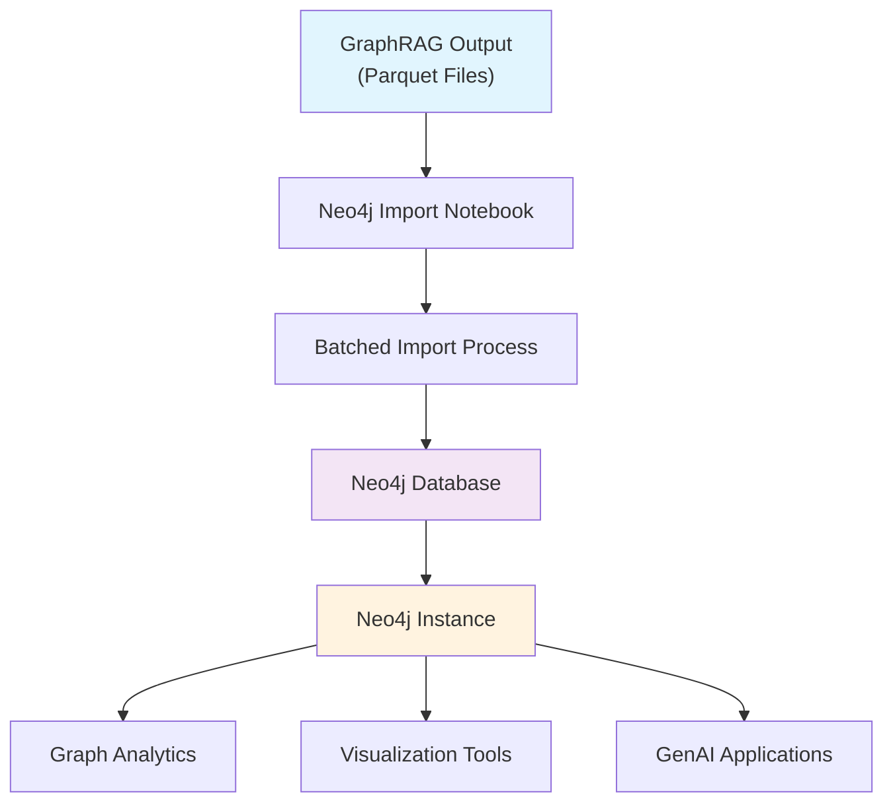
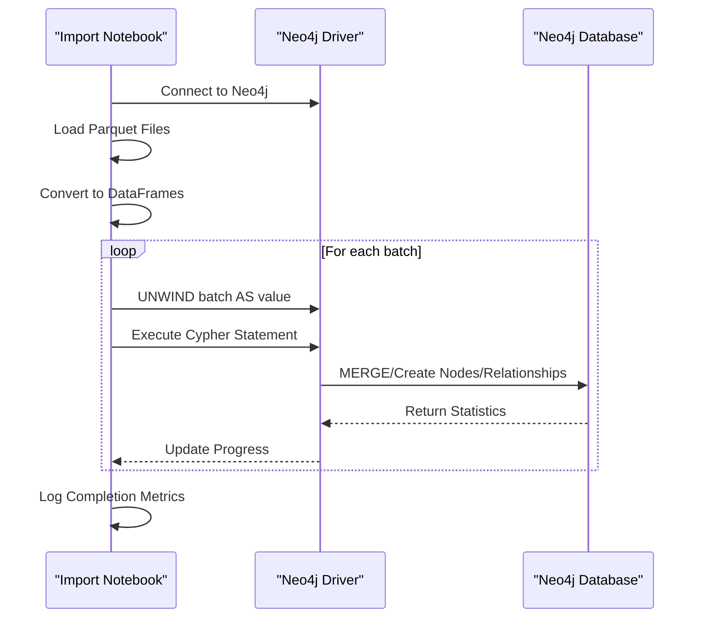
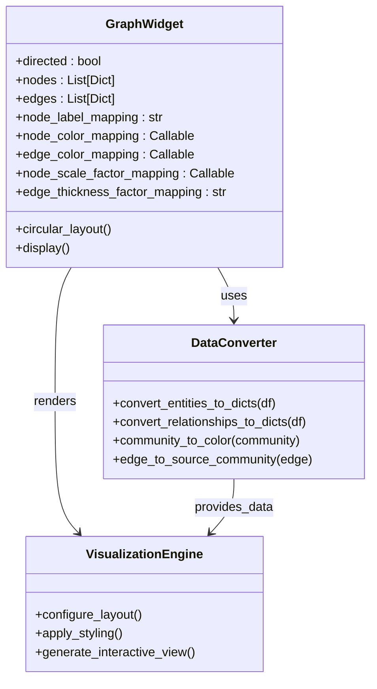
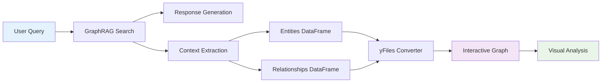
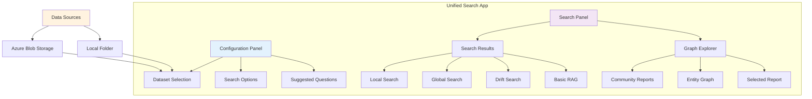
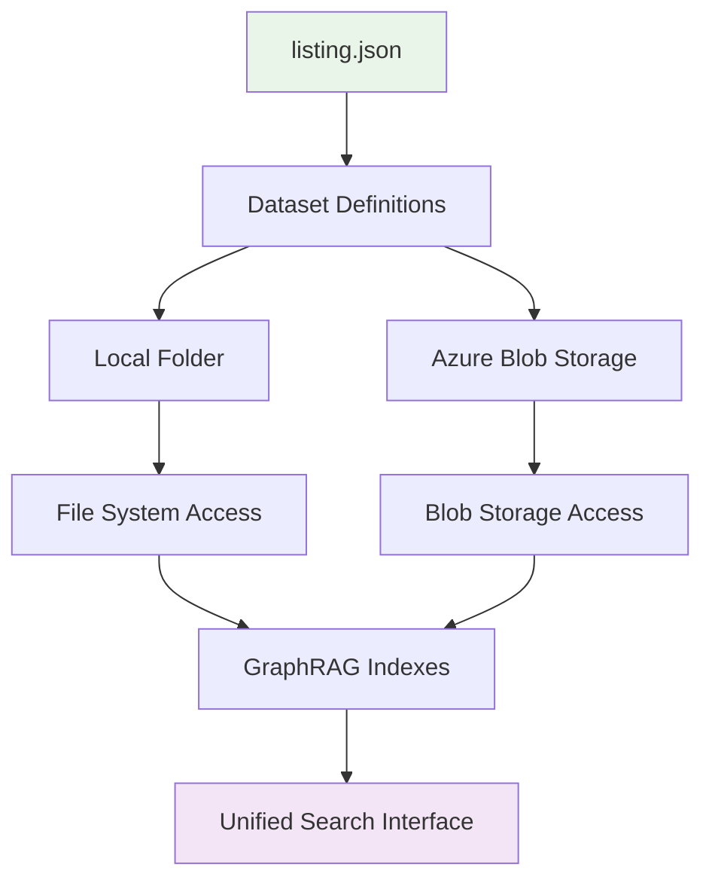
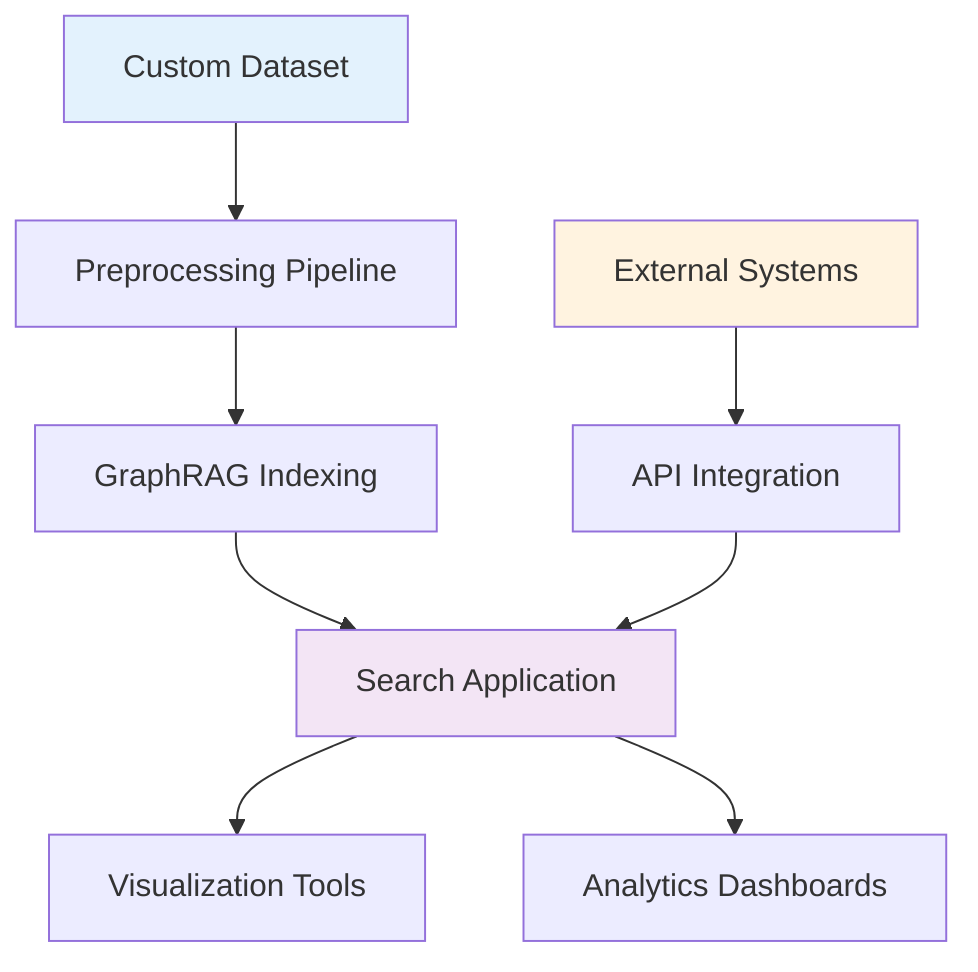
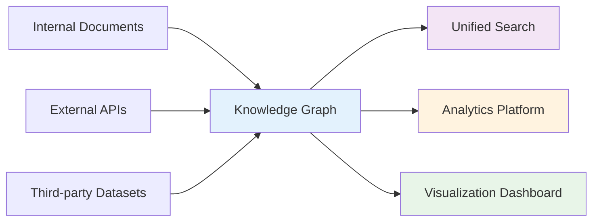

# Examples and Tutorials

<cite>
**Referenced Files in This Document**
- [examples_notebooks/community_contrib/README.md](file://examples_notebooks/community_contrib/README.md)
- [examples_notebooks/community_contrib/neo4j/graphrag_import_neo4j_cypher.ipynb](file://examples_notebooks/community_contrib/neo4j/graphrag_import_neo4j_cypher.ipynb)
- [examples_notebooks/community_contrib/yfiles-jupyter-graphs/graph-visualization.ipynb](file://examples_notebooks/community_contrib/yfiles-jupyter-graphs/graph-visualization.ipynb)
- [unified-search-app/README.md](file://unified-search-app/README.md)
- [unified-search-app/app/app_logic.py](file://unified-search-app/app/app_logic.py)
- [unified-search-app/app/data_config.py](file://unified-search-app/app/data_config.py)
- [graphrag/api/query.py](file://graphrag/api/query.py)
- [graphrag/api/index.py](file://graphrag/api/index.py)
- [docs/examples_notebooks/local_search.ipynb](file://docs/examples_notebooks/local_search.ipynb)
</cite>

## Table of Contents
1. [Introduction](#introduction)
2. [Community Contributed Notebooks](#community-contributed-notebooks)
3. [Neo4j Integration Tutorial](#neo4j-integration-tutorial)
4. [Graph Visualization with yFiles](#graph-visualization-with-yfiles)
5. [Unified Search Application](#unified-search-application)
6. [Practical Scenarios and Use Cases](#practical-scenarios-and-use-cases)
7. [Custom Dataset Adaptation](#custom-dataset-adaptation)
8. [Step-by-Step Tutorials](#step-by-step-tutorials)
9. [Best Practices and Troubleshooting](#best-practices-and-troubleshooting)
10. [Advanced Integration Patterns](#advanced-integration-patterns)

## Introduction

GraphRAG provides a comprehensive ecosystem of examples and tutorials designed to bridge the gap between theoretical knowledge and practical implementation. This section covers community-contributed notebooks, visualization tools, and the unified search application that demonstrate real-world GraphRAG applications across various domains including corporate documents, intelligence reports, and academic research.

The examples showcase how GraphRAG transforms unstructured data into actionable knowledge graphs, enabling sophisticated search and analysis capabilities through multiple integration approaches and visualization tools.

## Community Contributed Notebooks

The GraphRAG project maintains a collection of community-contributed notebooks that extend the core functionality with specialized integrations and visualization capabilities. These notebooks are provided as-is and may require adaptation for newer GraphRAG versions.

### Available Community Notebooks

The community-contributed examples include:

- **Neo4j Integration**: Import GraphRAG results into Neo4j for advanced graph analytics and visualization
- **yFiles Jupyter Graphs**: Interactive graph visualization using the yFiles library
- **Custom Integrations**: Various specialized use cases and extensions

**Section sources**
- [examples_notebooks/community_contrib/README.md](file://examples_notebooks/community_contrib/README.md#L1-L6)

## Neo4j Integration Tutorial

The Neo4j integration notebook demonstrates how to import GraphRAG indexing results into a Neo4j graph database, enabling advanced graph analytics, visualization, and integration with the broader Neo4j ecosystem.

### Architecture Overview

**Diagram sources**
- [examples_notebooks/community_contrib/neo4j/graphrag_import_neo4j_cypher.ipynb](file://examples_notebooks/community_contrib/neo4j/graphrag_import_neo4j_cypher.ipynb#L1-L50)

### Import Process Architecture

The import process follows a structured approach:

1. **Data Loading**: Read GraphRAG parquet files into Pandas dataframes
2. **Batched Processing**: Efficiently handle large datasets through batched imports
3. **Cypher Generation**: Convert data into Neo4j-compatible Cypher statements
4. **Constraint Creation**: Establish database constraints for data integrity
5. **Relationship Building**: Create connections between entities

### Key Features

- **Idempotent Operations**: Uses MERGE statements for safe repeated execution
- **Batch Processing**: Handles large datasets efficiently with configurable batch sizes
- **Constraint Management**: Creates appropriate indexes and constraints
- **Relationship Mapping**: Automatically builds entity relationships
- **Community Integration**: Supports community-based entity grouping

### Implementation Details

The batched import function provides efficient data transfer:

**Diagram sources**
- [examples_notebooks/community_contrib/neo4j/graphrag_import_neo4j_cypher.ipynb](file://examples_notebooks/community_contrib/neo4j/graphrag_import_neo4j_cypher.ipynb#L134-L160)

**Section sources**
- [examples_notebooks/community_contrib/neo4j/graphrag_import_neo4j_cypher.ipynb](file://examples_notebooks/community_contrib/neo4j/graphrag_import_neo4j_cypher.ipynb#L1-L200)

## Graph Visualization with yFiles

The yFiles integration provides interactive, customizable graph visualizations for GraphRAG knowledge graphs, enabling researchers and analysts to explore complex relationships visually.

### Visualization Architecture

**Diagram sources**
- [examples_notebooks/community_contrib/yfiles-jupyter-graphs/graph-visualization.ipynb](file://examples_notebooks/community_contrib/yfiles-jupyter-graphs/graph-visualization.ipynb#L130-L200)

### Interactive Visualization Features

The yFiles integration offers comprehensive visualization capabilities:

- **Dynamic Color Mapping**: Community-based coloring for visual distinction
- **Layout Options**: Multiple automatic layouts (Circular, Hierarchic, Organic, etc.)
- **Interactive Exploration**: Click and hover functionality for detailed information
- **Custom Styling**: Configurable node and edge appearance
- **Context Visualization**: Show query result contexts as separate graphs

### Query Result Visualization

The system can visualize the context data used to generate responses:

**Diagram sources**
- [examples_notebooks/community_contrib/yfiles-jupyter-graphs/graph-visualization.ipynb](file://examples_notebooks/community_contrib/yfiles-jupyter-graphs/graph-visualization.ipynb#L440-L500)

**Section sources**
- [examples_notebooks/community_contrib/yfiles-jupyter-graphs/graph-visualization.ipynb](file://examples_notebooks/community_contrib/yfiles-jupyter-graphs/graph-visualization.ipynb#L1-L524)

## Unified Search Application

The Unified Search application provides a comprehensive interface for comparing different GraphRAG search methodologies across multiple datasets, enabling researchers to evaluate and select optimal search strategies.

### Application Architecture

**Diagram sources**
- [unified-search-app/app/app_logic.py](file://unified-search-app/app/app_logic.py#L30-L60)
- [unified-search-app/app/data_config.py](file://unified-search-app/app/data_config.py#L1-L34)

### Supported Search Methods

The unified search supports four distinct search methodologies:

| Search Type | Description | Use Case | Strengths |
|-------------|-------------|----------|-----------|
| **Basic RAG** | Traditional retrieval-augmented generation | General knowledge queries | Fast, simple, broad coverage |
| **Local Search** | Entity-aware search with context | Specific entity-related questions | Precise, context-rich, entity-focused |
| **Global Search** | Community-based exploration | Broad topic exploration | Comprehensive, hierarchical, scalable |
| **Drift Search** | Dynamic exploration with feedback | Exploratory research | Adaptive, iterative, discovery-oriented |

### Data Source Configuration

The application supports flexible data source configurations:

**Diagram sources**
- [unified-search-app/README.md](file://unified-search-app/README.md#L27-L75)

### Application Features

- **Multi-Dataset Support**: Compare search results across different knowledge bases
- **Real-time Comparison**: Side-by-side comparison of search methodologies
- **Interactive Graph Explorer**: Navigate through extracted knowledge graphs
- **Question Suggestions**: Automated question generation for dataset exploration
- **Flexible Deployment**: Support for local and cloud-based data sources

**Section sources**
- [unified-search-app/README.md](file://unified-search-app/README.md#L1-L128)
- [unified-search-app/app/app_logic.py](file://unified-search-app/app/app_logic.py#L1-L369)

## Practical Scenarios and Use Cases

### Corporate Document Analysis

**Scenario**: Analyzing company financial reports and internal documentation

**Implementation Approach**:
1. **Indexing Phase**: Process annual reports, quarterly updates, and internal memos
2. **Search Strategy**: Use local search for specific financial metrics and global search for trend analysis
3. **Visualization**: Employ Neo4j integration for relationship mapping between departments and financial indicators

**Expected Outcomes**:
- Rapid identification of financial trends and anomalies
- Discovery of cross-departmental relationships and dependencies
- Enhanced decision-making through comprehensive context analysis

### Intelligence Report Investigation

**Scenario**: Investigating geopolitical events and their implications

**Implementation Approach**:
1. **Knowledge Graph Construction**: Build relationships between countries, organizations, and events
2. **Temporal Analysis**: Leverage graph structure for timeline-based investigations
3. **Cross-Reference Analysis**: Use entity relationships to identify hidden connections

**Expected Outcomes**:
- Comprehensive understanding of event networks and causal relationships
- Identification of emerging threats and opportunities
- Enhanced situational awareness through interconnected analysis

### Academic Research Enhancement

**Scenario**: Supporting literature review and research synthesis

**Implementation Approach**:
1. **Literature Integration**: Process academic papers, conference proceedings, and research notes
2. **Citation Network**: Build relationships between authors, institutions, and publications
3. **Topic Modeling**: Use community detection to identify research themes and gaps

**Expected Outcomes**:
- Accelerated literature review through intelligent organization
- Identification of research gaps and emerging trends
- Enhanced collaboration opportunities through network analysis

## Custom Dataset Adaptation

### Data Preparation Guidelines

To adapt GraphRAG examples to custom datasets:

1. **Data Format Standardization**: Ensure consistent data structure across documents
2. **Metadata Enrichment**: Add relevant metadata for improved search capabilities
3. **Domain-Specific Tuning**: Customize prompts and configurations for specific domains
4. **Quality Assurance**: Implement validation checks for data integrity

### Configuration Adaptation

Key configuration areas for customization:

| Component | Customization Options | Impact |
|-----------|----------------------|---------|
| **Embedding Models** | Domain-specific embeddings | Search precision |
| **Community Detection** | Threshold adjustments | Granularity control |
| **Prompt Templates** | Domain-specific prompts | Response quality |
| **Vector Stores** | Storage optimization | Performance scaling |

### Integration Patterns

Common integration patterns for custom datasets:

## Step-by-Step Tutorials

### Tutorial 1: Basic Local Search Implementation

**Objective**: Implement a simple local search application for a corporate document set

**Steps**:
1. **Setup Environment**: Install GraphRAG and dependencies
2. **Prepare Data**: Organize corporate documents in supported formats
3. **Configure Indexing**: Set up GraphRAG configuration for corporate domain
4. **Run Indexing**: Process documents into knowledge graph
5. **Implement Search**: Create local search interface
6. **Test Queries**: Validate search accuracy and relevance

**Expected Outcome**: Functional search application capable of answering domain-specific questions

### Tutorial 2: Neo4j Integration Setup

**Objective**: Integrate GraphRAG results with Neo4j for advanced analytics

**Steps**:
1. **Install Neo4j**: Set up Neo4j database instance
2. **Prepare Import Script**: Configure Neo4j import notebook
3. **Execute Import**: Transfer GraphRAG data to Neo4j
4. **Verify Schema**: Confirm successful data import
5. **Explore Analytics**: Run basic graph queries and analytics

**Expected Outcome**: Neo4j database populated with GraphRAG knowledge graph ready for advanced analysis

### Tutorial 3: Interactive Visualization Setup

**Objective**: Create interactive graph visualizations using yFiles

**Steps**:
1. **Install Dependencies**: Add yFiles visualization libraries
2. **Configure Visualization**: Set up graph rendering parameters
3. **Create Interactive Views**: Implement clickable graph elements
4. **Customize Styling**: Apply domain-specific visual themes
5. **Export Visualizations**: Generate shareable visualization outputs

**Expected Outcome**: Interactive graph visualizations for exploring knowledge graph structures

## Best Practices and Troubleshooting

### Performance Optimization

- **Batch Processing**: Use appropriate batch sizes for large datasets
- **Memory Management**: Monitor memory usage during indexing and search operations
- **Caching Strategies**: Implement caching for frequently accessed data
- **Parallel Processing**: Utilize multi-threading for computationally intensive tasks

### Common Issues and Solutions

| Issue | Symptoms | Solution |
|-------|----------|----------|
| **Slow Search Performance** | Long response times | Optimize vector store configuration |
| **Memory Exhaustion** | Out of memory errors | Reduce batch sizes or increase memory |
| **Poor Search Quality** | Irrelevant results | Tune prompts and thresholds |
| **Import Failures** | Data loading errors | Verify data format and structure |

### Monitoring and Maintenance

- **Logging Configuration**: Implement comprehensive logging for debugging
- **Performance Metrics**: Track response times and resource usage
- **Data Validation**: Regular verification of indexed data quality
- **System Updates**: Keep GraphRAG and dependencies updated

## Advanced Integration Patterns

### Multi-Source Knowledge Fusion

Combining data from multiple sources into a unified knowledge graph:

### Real-time Knowledge Updates

Implementing continuous learning and knowledge graph updates:

1. **Incremental Indexing**: Process new documents without re-indexing existing data
2. **Change Detection**: Identify modifications in existing documents
3. **Knowledge Propagation**: Update related entities and relationships
4. **Version Control**: Maintain historical knowledge graph versions

### Enterprise Deployment Patterns

- **Cloud-Native Architecture**: Deploy on cloud platforms with auto-scaling
- **Security Integration**: Implement role-based access control and data encryption
- **Monitoring and Alerting**: Comprehensive observability and alerting systems
- **Backup and Recovery**: Robust data protection and disaster recovery procedures

The GraphRAG examples and tutorials provide a solid foundation for implementing sophisticated knowledge graph applications across diverse domains and use cases. By following these patterns and adapting the examples to specific requirements, organizations can unlock powerful insights from their document collections and establish robust knowledge management systems.