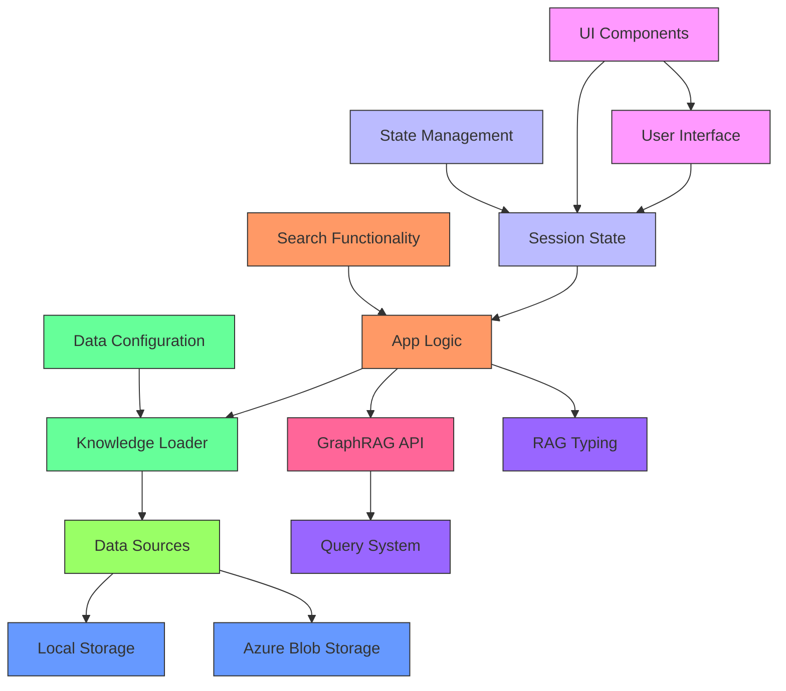
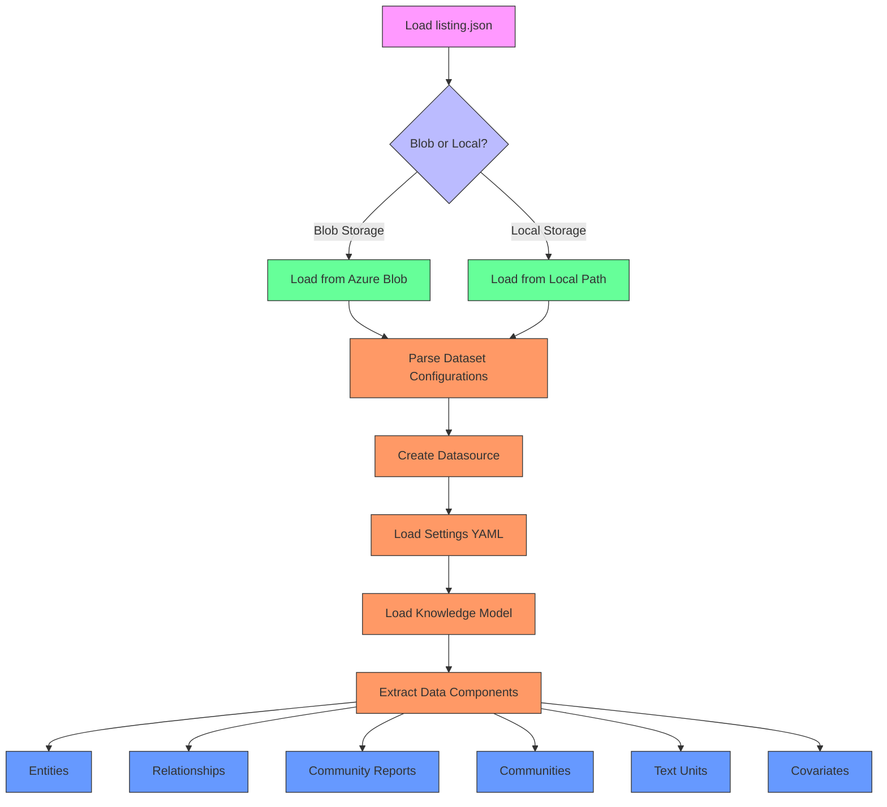
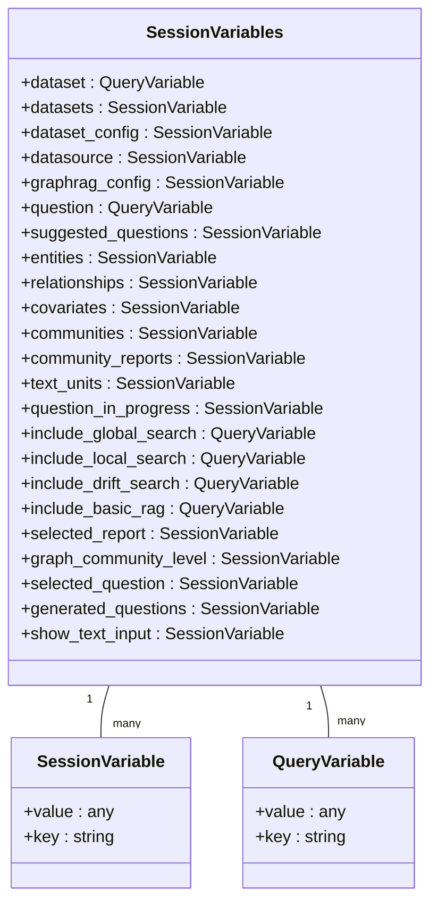
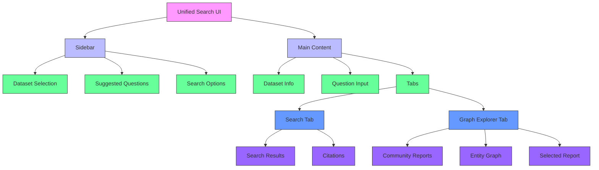
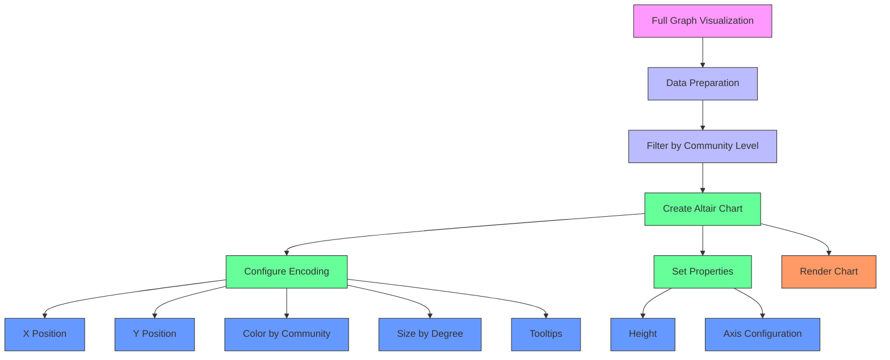
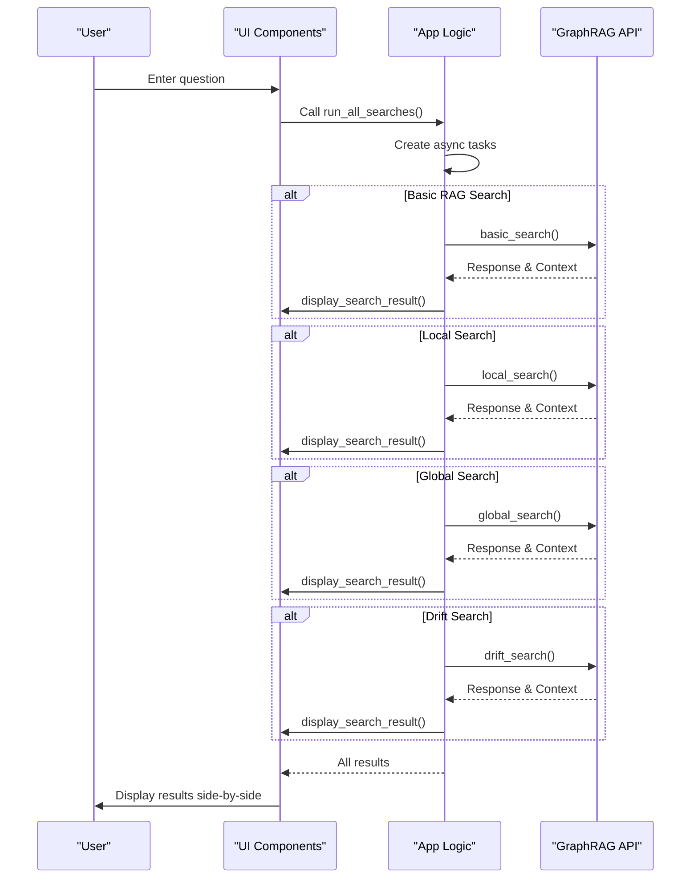
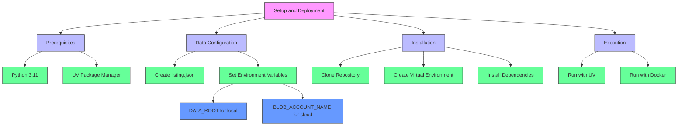
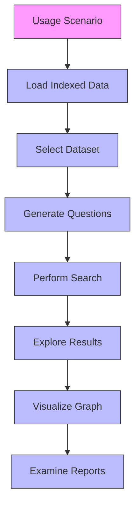
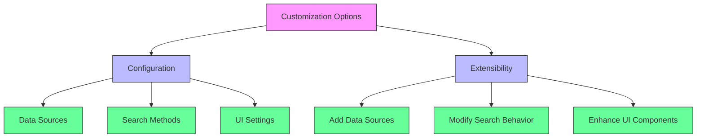

# Unified Search Application

<cite>
**Referenced Files in This Document**   
- [app_logic.py](file://unified-search-app/app/app_logic.py)
- [home_page.py](file://unified-search-app/app/home_page.py)
- [data_config.py](file://unified-search-app/app/data_config.py)
- [session_variables.py](file://unified-search-app/app/state/session_variables.py)
- [model.py](file://unified-search-app/app/knowledge_loader/model.py)
- [loader.py](file://unified-search-app/app/knowledge_loader/data_sources/loader.py)
- [sidebar.py](file://unified-search-app/app/ui/sidebar.py)
- [search.py](file://unified-search-app/app/ui/search.py)
- [full_graph.py](file://unified-search-app/app/ui/full_graph.py)
- [report_details.py](file://unified-search-app/app/ui/report_details.py)
- [questions_list.py](file://unified-search-app/app/ui/questions_list.py)
- [report_list.py](file://unified-search-app/app/ui/report_list.py)
- [Dockerfile](file://unified-search-app/Dockerfile)
- [pyproject.toml](file://unified-search-app/pyproject.toml)
</cite>

## Table of Contents
1. [Introduction](#introduction)
2. [Architecture Overview](#architecture-overview)
3. [Data Loading Pipeline](#data-loading-pipeline)
4. [Session State Management](#session-state-management)
5. [User Interface Components](#user-interface-components)
6. [Search Functionality](#search-functionality)
7. [Setup and Deployment](#setup-and-deployment)
8. [End-to-End Usage Scenarios](#end-to-end-usage-scenarios)
9. [Customization Options](#customization-options)
10. [Conclusion](#conclusion)

## Introduction

The Unified Search Application is a Streamlit-based web interface designed to interact with GraphRAG knowledge graphs, providing a comprehensive visualization and search platform for exploring indexed data. This application serves as a reference implementation for building custom frontends on top of GraphRAG APIs, demonstrating how to integrate various search methodologies and visualize complex knowledge graph structures.

The application enables users to perform both local and global searches across indexed datasets, explore community reports, and visualize the full entity graph. It supports multiple GraphRAG indexes through a directory listing mechanism and can access data from both local storage and Azure Blob Storage. The interface is designed to compare different search approaches, including basic RAG, local search, global search, and drift search, allowing users to evaluate the effectiveness of each method.

This document provides a detailed analysis of the application's architecture, data loading pipeline, session state management, and integration with GraphRAG's query system. It walks through the user interface components, setup instructions, and end-to-end usage scenarios, highlighting how this application serves as a powerful tool for exploring and understanding knowledge graphs generated by GraphRAG.

## Architecture Overview

The Unified Search Application follows a modular architecture with clear separation of concerns between data loading, state management, user interface components, and search functionality. The application is built on Streamlit, leveraging its reactive programming model to create an interactive web interface for exploring GraphRAG knowledge graphs.

**Diagram sources**
- [app_logic.py](file://unified-search-app/app/app_logic.py)
- [home_page.py](file://unified-search-app/app/home_page.py)
- [state/session_variables.py](file://unified-search-app/app/state/session_variables.py)
- [knowledge_loader/model.py](file://unified-search-app/app/knowledge_loader/model.py)
- [knowledge_loader/data_sources/loader.py](file://unified-search-app/app/knowledge_loader/data_sources/loader.py)

**Section sources**
- [app_logic.py](file://unified-search-app/app/app_logic.py)
- [home_page.py](file://unified-search-app/app/home_page.py)

## Data Loading Pipeline

The data loading pipeline in the Unified Search Application is designed to efficiently retrieve and prepare GraphRAG-indexed data for visualization and search. The pipeline begins with the loading of dataset configurations from a `listing.json` file, which contains metadata about available datasets including their keys, paths, names, descriptions, and community levels.

**Diagram sources**
- [knowledge_loader/data_sources/loader.py](file://unified-search-app/app/knowledge_loader/data_sources/loader.py)
- [knowledge_loader/model.py](file://unified-search-app/app/knowledge_loader/model.py)
- [data_config.py](file://unified-search-app/app/data_config.py)

**Section sources**
- [knowledge_loader/data_sources/loader.py](file://unified-search-app/app/knowledge_loader/data_sources/loader.py)
- [knowledge_loader/model.py](file://unified-search-app/app/knowledge_loader/model.py)
- [data_config.py](file://unified-search-app/app/data_config.py)

The pipeline is implemented through the `knowledge_loader` module, which contains specialized functions for loading different components of the knowledge graph. The `load_model` function orchestrates the loading process, retrieving entities, relationships, community reports, communities, text units, and covariates from the datasource. Each data component is loaded using cached functions with a default TTL of one week, ensuring efficient data retrieval across sessions.

The application supports both local and cloud-based data sources through the `create_datasource` function, which determines whether to use `LocalDatasource` or `BlobDatasource` based on environment variables. This flexible design allows users to store their datasets either locally or in Azure Blob Storage, making the application suitable for both development and production environments.

## Session State Management

The Unified Search Application implements a comprehensive session state management system using Streamlit's session state capabilities combined with custom session variable classes. The `SessionVariables` class serves as the central repository for all application state, containing properties for dataset selection, search configurations, loaded data components, and UI state.

**Diagram sources**
- [state/session_variables.py](file://unified-search-app/app/state/session_variables.py)
- [data_config.py](file://unified-search-app/app/data_config.py)

**Section sources**
- [state/session_variables.py](file://unified-search-app/app/state/session_variables.py)

The session state management system is designed to maintain consistency across user interactions while enabling efficient data caching and retrieval. The `SessionVariables` class is initialized in the `initialize` function, which sets up the initial application state and loads the default dataset. The class uses two types of variables: `SessionVariable` for internal state tracking and `QueryVariable` for state that can be manipulated through URL query parameters.

Key aspects of the session state management include:
- **Dataset Selection**: The `dataset` variable tracks the currently selected dataset, while `datasets` contains the list of all available datasets from the `listing.json` file.
- **Search Configuration**: Boolean variables like `include_global_search`, `include_local_search`, etc., control which search methods are enabled in the UI.
- **Loaded Data**: Variables such as `entities`, `relationships`, `community_reports`, and others store the knowledge graph components loaded from the selected dataset.
- **UI State**: Variables like `selected_question`, `generated_questions`, and `show_text_input` manage the state of UI components and user interactions.

The application leverages Streamlit's reactive model, where changes to session state variables trigger UI updates. For example, when a user selects a different dataset in the sidebar, the `update_dataset` function is called, which updates the session state and triggers a reload of the knowledge model for the new dataset.

## User Interface Components

The Unified Search Application features a rich set of user interface components designed to facilitate exploration and interaction with GraphRAG knowledge graphs. The interface is organized into two main panels: a configuration sidebar and a content area with multiple tabs for different functionalities.

**Diagram sources**
- [home_page.py](file://unified-search-app/app/home_page.py)
- [sidebar.py](file://unified-search-app/app/ui/sidebar.py)
- [search.py](file://unified-search-app/app/ui/search.py)
- [full_graph.py](file://unified-search-app/app/ui/full_graph.py)
- [report_details.py](file://unified-search-app/app/ui/report_details.py)
- [questions_list.py](file://unified-search-app/app/ui/questions_list.py)
- [report_list.py](file://unified-search-app/app/ui/report_list.py)

**Section sources**
- [home_page.py](file://unified-search-app/app/home_page.py)
- [sidebar.py](file://unified-search-app/app/ui/sidebar.py)

### Search Input

The search input component provides a text box where users can enter questions to query the knowledge graph. Located in the main content area, this component is implemented in the `home_page.py` file and uses Streamlit's `text_input` widget with a callback function to update the session state when the user types.

### Full Graph Visualization

The full graph visualization component displays the entity graph using Altair, a declarative visualization library. Implemented in `full_graph.py`, this component shows entities as circles colored by community and sized by degree, with tooltips displaying entity details. Users can filter the graph by community level using a dropdown in the UI.

**Diagram sources**
- [ui/full_graph.py](file://unified-search-app/app/ui/full_graph.py)

**Section sources**
- [ui/full_graph.py](file://unified-search-app/app/ui/full_graph.py)

### Report Details

The report details component displays the content of a selected community report, including its title, summary, priority rating, and key findings. Implemented in `report_details.py`, this component parses the JSON content of the report and formats it for display, with hyperlinks to related entities and relationships.

### Sidebar Navigation

The sidebar navigation component provides configuration options for the application, including dataset selection, number of suggested questions, and search method toggles. Implemented in `sidebar.py`, this component uses Streamlit's sidebar functionality to create a collapsible panel with various input widgets.

## Search Functionality

The Unified Search Application implements a comprehensive search system that supports multiple search methodologies, allowing users to compare results from different approaches. The search functionality is centered around the `app_logic.py` module, which contains asynchronous functions for executing various search types and managing their results.

**Diagram sources**
- [app_logic.py](file://unified-search-app/app/app_logic.py)
- [home_page.py](file://unified-search-app/app/home_page.py)
- [search.py](file://unified-search-app/app/ui/search.py)

**Section sources**
- [app_logic.py](file://unified-search-app/app/app_logic.py)

The application supports four main search types:
- **Basic RAG**: Retrieves fixed numbers of text chunks from raw documents
- **Local Search**: Uses graph index query results with relevant document text chunks
- **Global Search**: Leverages AI-generated network reports covering all input documents
- **Drift Search**: Includes community information in the search context

Each search type is implemented as an asynchronous function in `app_logic.py`, allowing multiple searches to be executed concurrently. The `run_all_searches` function creates a list of tasks based on the user's selected search options and uses `asyncio.gather` to execute them in parallel, improving overall performance.

Search results are displayed in separate columns based on the enabled search methods, with response text and citations shown for each. The application uses Streamlit's container system to organize the UI, with each search result having its own response placeholder and context container.

## Setup and Deployment

The Unified Search Application can be deployed either locally or via Docker, providing flexibility for different use cases and environments. The setup process involves configuring data sources, installing dependencies, and running the application.

**Diagram sources**
- [pyproject.toml](file://unified-search-app/pyproject.toml)
- [Dockerfile](file://unified-search-app/Dockerfile)
- [README.md](file://unified-search-app/README.md)

**Section sources**
- [pyproject.toml](file://unified-search-app/pyproject.toml)
- [Dockerfile](file://unified-search-app/Dockerfile)
- [README.md](file://unified-search-app/README.md)

### Local Setup

To run the application locally, users need Python 3.11 and the UV package manager. After cloning the GraphRAG repository, they should create a virtual environment and install dependencies using `uv sync`. The application is then started with `uv run poe start`, which launches the Streamlit server.

### Docker Deployment

For containerized deployment, the application includes a Dockerfile that uses the Microsoft Oryx Python 3.11 base image. The Docker build process installs UV, syncs dependencies, and sets up an entry point to run the application in production mode. The container exposes port 8501, allowing access to the Streamlit interface.

### Data Source Configuration

The application supports both local and Azure Blob Storage data sources. For local data, users set the `DATA_ROOT` environment variable to point to their dataset directory. For blob storage, they configure `BLOB_ACCOUNT_NAME` and optionally `BLOB_CONTAINER_NAME`. The data directory structure follows a specific format with a `listing.json` file and individual dataset folders containing configuration and output files.

## End-to-End Usage Scenarios

The Unified Search Application supports several end-to-end usage scenarios that demonstrate its capabilities for exploring and analyzing GraphRAG knowledge graphs. These scenarios illustrate the complete workflow from data loading to search and visualization.

**Diagram sources**
- [home_page.py](file://unified-search-app/app/home_page.py)
- [app_logic.py](file://unified-search-app/app/app_logic.py)
- [ui/search.py](file://unified-search-app/app/ui/search.py)
- [ui/full_graph.py](file://unified-search-app/app/ui/full_graph.py)
- [ui/report_list.py](file://unified-search-app/app/ui/report_list.py)
- [ui/report_details.py](file://unified-search-app/app/ui/report_details.py)

**Section sources**
- [home_page.py](file://unified-search-app/app/home_page.py)

### Loading Indexed Data

The first step in using the application is loading indexed data. Users create a `listing.json` file that references one or more GraphRAG indexes. When the application starts, it reads this file and populates the dataset dropdown in the sidebar. Selecting a dataset triggers the loading of its knowledge model, including entities, relationships, community reports, and other components.

### Performing Local and Global Searches

Users can perform searches using multiple methods simultaneously. By enabling different search options in the sidebar, they can compare results from basic RAG, local search, global search, and drift search. The application displays results side-by-side, allowing users to evaluate the strengths and weaknesses of each approach for their specific use case.

### Exploring Community Reports

The Graph Explorer tab provides access to community reports, which are AI-generated summaries of network communities within the knowledge graph. Users can browse the list of reports, select one to view its detailed content, and explore the entities and relationships cited in the report. This functionality enables deep exploration of the knowledge graph's structure and content.

## Customization Options

The Unified Search Application offers several customization options that allow users to adapt the interface to their specific needs. These options range from configuration settings to extensibility points for adding new functionality.

**Diagram sources**
- [data_config.py](file://unified-search-app/app/data_config.py)
- [app_logic.py](file://unified-search-app/app/app_logic.py)
- [knowledge_loader/data_sources/loader.py](file://unified-search-app/app/knowledge_loader/data_sources/loader.py)

**Section sources**
- [data_config.py](file://unified-search-app/app/data_config.py)

### Adding New Data Sources

The application's modular design makes it relatively straightforward to add support for new data sources. The `knowledge_loader/data_sources` directory contains the infrastructure for loading data from different storage systems, with `loader.py` providing the main interface. Developers can create new datasource classes that implement the same interface as `LocalDatasource` and `BlobDatasource` to support additional storage backends.

### Modifying Search Behavior

The search behavior can be customized by modifying the parameters passed to the GraphRAG API functions in `app_logic.py`. For example, users can adjust the response type, community level, or other search parameters to fine-tune the results. The application's use of the GraphRAG API as a dependency makes it easy to experiment with different search configurations and algorithms.

## Conclusion

The Unified Search Application provides a powerful and flexible interface for exploring GraphRAG knowledge graphs, serving as both a practical tool for users and a reference implementation for developers. Its modular architecture, comprehensive feature set, and support for multiple deployment options make it an excellent starting point for building custom frontends on top of GraphRAG APIs.

The application successfully demonstrates how to integrate various search methodologies, visualize complex knowledge graph structures, and manage application state in a Streamlit-based interface. Its support for both local and cloud-based data sources, along with its extensible design, enables a wide range of use cases from research and development to production deployments.

By providing side-by-side comparison of different search approaches, the application helps users understand the trade-offs between various retrieval methods and select the most appropriate one for their needs. The visualization capabilities, particularly the full graph view and community report exploration, offer valuable insights into the structure and content of knowledge graphs.

As a reference implementation, the Unified Search Application showcases best practices for building interactive interfaces on top of GraphRAG, including efficient data loading, responsive UI design, and seamless integration with the underlying query system. Developers can use this application as a foundation for creating specialized tools tailored to their specific domains and requirements.