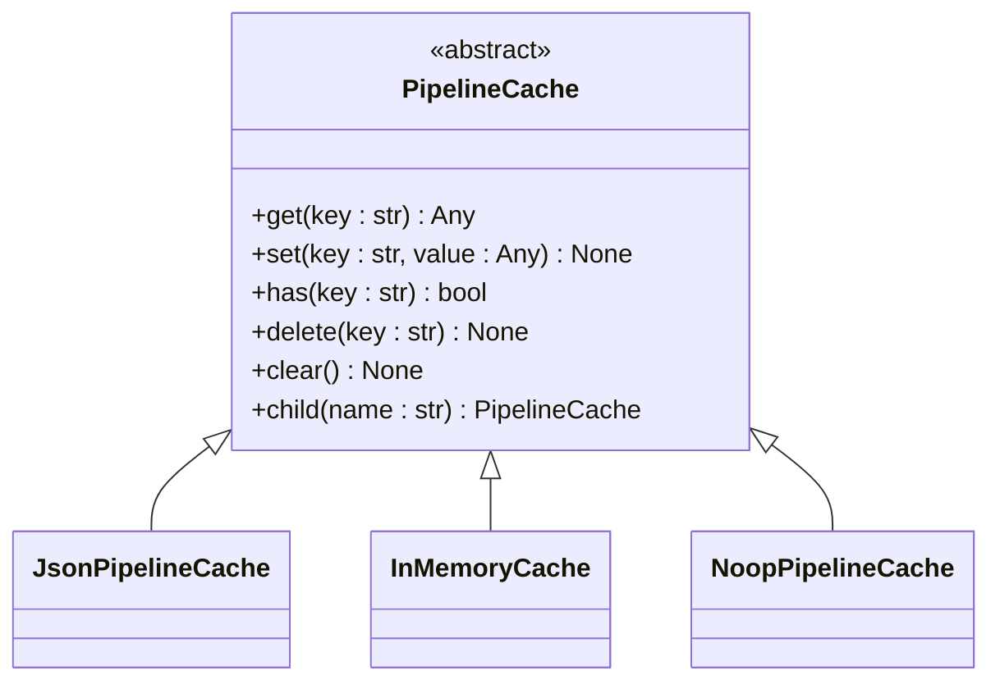
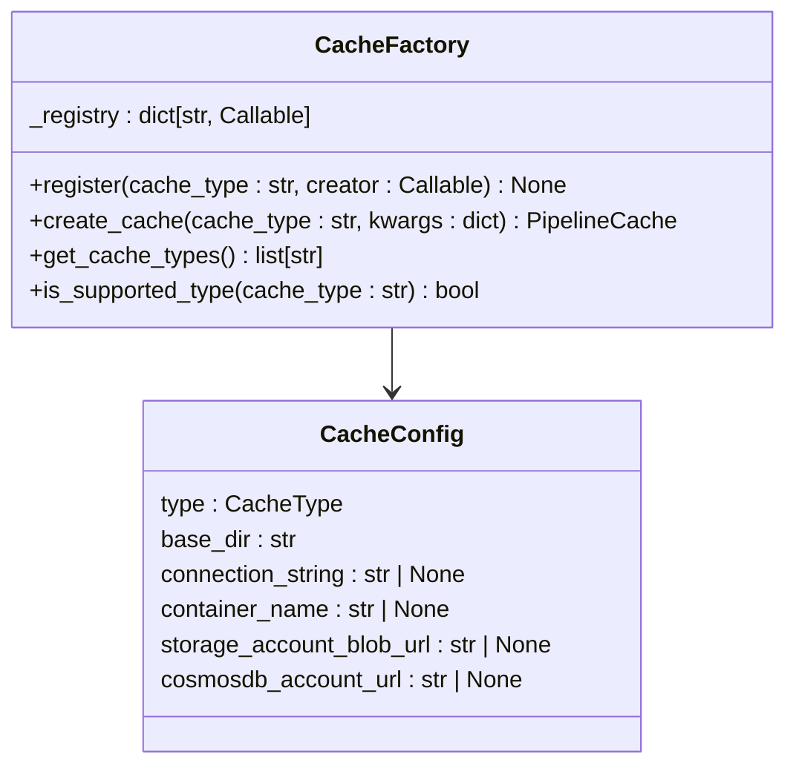
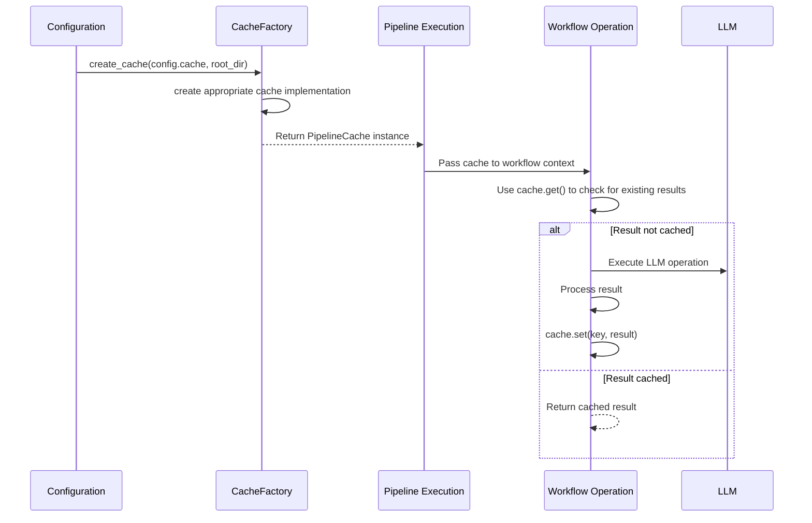

# Cache System

<cite>
**Referenced Files in This Document**   
- [pipeline_cache.py](file://graphrag/cache/pipeline_cache.py)
- [factory.py](file://graphrag/cache/factory.py)
- [json_pipeline_cache.py](file://graphrag/cache/json_pipeline_cache.py)
- [memory_pipeline_cache.py](file://graphrag/cache/memory_pipeline_cache.py)
- [noop_pipeline_cache.py](file://graphrag/cache/noop_pipeline_cache.py)
- [enums.py](file://graphrag/config/enums.py)
- [cache_config.py](file://graphrag/config/models/cache_config.py)
- [get_cache_key.py](file://graphrag/language_model/providers/litellm/get_cache_key.py)
- [run_pipeline.py](file://graphrag/index/run/run_pipeline.py)
- [api.py](file://graphrag/utils/api.py)
</cite>

## Table of Contents
1. [Introduction](#introduction)
2. [Core Interface](#core-interface)
3. [Factory Pattern and Configuration](#factory-pattern-and-configuration)
4. [Cache Implementations](#cache-implementations)
5. [Integration with Pipeline Execution](#integration-with-pipeline-execution)
6. [Cache Key Generation](#cache-key-generation)
7. [Performance Considerations](#performance-considerations)
8. [Common Issues and Best Practices](#common-issues-and-best-practices)

## Introduction

The Cache System in GraphRAG is designed to optimize performance by avoiding redundant LLM calls and data processing operations during both indexing and query execution. By caching intermediate results, the system significantly reduces computational overhead and execution time, particularly in scenarios where the same operations are performed repeatedly. The caching mechanism is pluggable through a factory pattern, allowing users to select from different backend implementations based on their requirements for persistence, performance, and scalability.

**Section sources**
- [pipeline_cache.py](file://graphrag/cache/pipeline_cache.py#L1-L68)
- [factory.py](file://graphrag/cache/factory.py#L1-L116)

## Core Interface

The foundation of the caching system is the `PipelineCache` abstract base class defined in `pipeline_cache.py`. This interface provides a standardized contract for all cache implementations, ensuring consistent behavior across different backends. The interface includes asynchronous methods for basic cache operations:

- `get(key: str)`: Retrieve a value by key
- `set(key: str, value: Any)`: Store a value with a given key
- `has(key: str)`: Check if a key exists in the cache
- `delete(key: str)`: Remove a specific key from the cache
- `clear()`: Remove all entries from the cache
- `child(name: str)`: Create a hierarchical sub-cache with a given name

This interface enables the system to treat all cache implementations uniformly, regardless of their underlying storage mechanism.



**Diagram sources **
- [pipeline_cache.py](file://graphrag/cache/pipeline_cache.py#L12-L68)

**Section sources**
- [pipeline_cache.py](file://graphrag/cache/pipeline_cache.py#L12-L68)

## Factory Pattern and Configuration

The Cache Factory pattern, implemented in `factory.py`, enables pluggable cache backends through a registry-based system. The `CacheFactory` class maintains a registry of cache creators that can be dynamically registered and instantiated based on configuration. This design allows for extensibility while maintaining a clean separation between cache interface and implementation.

The factory supports several built-in cache types defined in the `CacheType` enum:
- `file`: Persistent file-based caching
- `memory`: In-memory caching for current execution
- `none`: No-op caching to disable caching
- `blob`: Azure Blob Storage-based caching
- `cosmosdb`: CosmosDB-based caching

Configuration is handled through the `CacheConfig` model, which specifies parameters like cache type, base directory, and connection strings for external storage systems. The factory pattern allows users to register custom cache implementations by providing a creator function that returns a `PipelineCache` instance.



**Diagram sources **
- [factory.py](file://graphrag/cache/factory.py#L24-L116)
- [enums.py](file://graphrag/config/enums.py#L11-L23)
- [cache_config.py](file://graphrag/config/models/cache_config.py#L12-L39)

**Section sources**
- [factory.py](file://graphrag/cache/factory.py#L24-L116)
- [enums.py](file://graphrag/config/enums.py#L11-L23)
- [cache_config.py](file://graphrag/config/models/cache_config.py#L12-L39)

## Cache Implementations

### JsonPipelineCache

The `JsonPipelineCache` implementation provides persistent file-based caching by storing data in JSON format. It leverages the `PipelineStorage` abstraction to handle file operations, supporting various storage backends including local file system, Azure Blob Storage, and CosmosDB. The cache stores data as JSON objects with a "result" field containing the actual value and optional debug metadata. This implementation is ideal for scenarios requiring persistence across multiple runs, such as long-running indexing processes.

**Section sources**
- [json_pipeline_cache.py](file://graphrag/cache/json_pipeline_cache.py#L13-L66)

### MemoryPipelineCache

The `InMemoryCache` (also known as `MemoryPipelineCache`) provides high-performance caching within the current process execution. It stores data in a Python dictionary, making it extremely fast for read/write operations. The implementation includes a hierarchical naming system through the `child()` method, allowing for organized cache separation by workflow or operation type. This cache type is suitable for temporary caching needs where persistence is not required.

**Section sources**
- [memory_pipeline_cache.py](file://graphrag/cache/memory_pipeline_cache.py#L11-L79)

### NoOpPipelineCache

The `NoOpPipelineCache` implementation provides a no-operation cache that effectively disables caching. All operations are implemented as no-ops: `get()` always returns `None`, `has()` always returns `False`, and `set()` operations are ignored. This implementation is useful for testing scenarios or when caching is not desired, such as in memory-constrained environments or when debugging pipeline behavior.

**Section sources**
- [noop_pipeline_cache.py](file://graphrag/cache/noop_pipeline_cache.py#L11-L66)

## Integration with Pipeline Execution

The cache system is tightly integrated with the pipeline execution flow, particularly in the `run_pipeline` function in `run_pipeline.py`. During pipeline initialization, the cache is created based on configuration settings and passed to the execution context. The cache is then available to all workflow operations, allowing them to store and retrieve intermediate results.

The integration follows a hierarchical approach where child caches can be created for specific workflows or operations, providing namespace isolation and preventing key collisions. This is particularly important in complex pipelines with multiple parallel operations that might otherwise interfere with each other's cached data.



**Diagram sources **
- [run_pipeline.py](file://graphrag/index/run/run_pipeline.py#L29-L168)
- [api.py](file://graphrag/utils/api.py#L9-L25)

**Section sources**
- [run_pipeline.py](file://graphrag/index/run/run_pipeline.py#L29-L168)
- [api.py](file://graphrag/utils/api.py#L9-L25)

## Cache Key Generation

Cache key generation is a critical aspect of the caching system, ensuring that identical operations produce the same cache key while different operations produce distinct keys. The `get_cache_key.py` module in the language model providers implements a sophisticated key generation algorithm that considers multiple factors:

- Model configuration parameters (model name, temperature, max_tokens, etc.)
- Input content (messages or input text)
- Request parameters (functions, tools, response_format, etc.)
- A version identifier to handle breaking changes in cache format

The algorithm creates a dictionary of relevant parameters, converts it to a JSON string with sorted keys for consistency, and then generates a SHA-256 hash of the string. This approach ensures that semantically equivalent requests produce identical cache keys, maximizing cache hit rates while preventing collisions between different operations.

**Section sources**
- [get_cache_key.py](file://graphrag/language_model/providers/litellm/get_cache_key.py#L33-L141)

## Performance Considerations

The choice of cache implementation has significant performance implications:

- **JsonPipelineCache**: Provides persistence at the cost of I/O overhead. Best for long-running operations where results should survive process restarts. Performance depends on the underlying storage system (local disk vs. cloud storage).
- **MemoryPipelineCache**: Offers the highest performance with O(1) read/write operations but consumes RAM and does not persist across runs. Ideal for temporary caching within a single execution.
- **NoOpPipelineCache**: Eliminates all caching overhead but loses the benefits of cached results. Useful for benchmarking or when memory is severely constrained.

For optimal performance, consider using `MemoryPipelineCache` for operations within a single pipeline run and `JsonPipelineCache` with file storage for results that should persist across multiple runs. The hierarchical `child()` method can be used to organize cache entries by workflow, improving cache management and reducing key collision risks.

**Section sources**
- [json_pipeline_cache.py](file://graphrag/cache/json_pipeline_cache.py#L13-L66)
- [memory_pipeline_cache.py](file://graphrag/cache/memory_pipeline_cache.py#L11-L79)
- [noop_pipeline_cache.py](file://graphrag/cache/noop_pipeline_cache.py#L11-L66)

## Common Issues and Best Practices

### Cache Invalidation

Cache invalidation is handled automatically through the cache implementations' error handling. When a corrupted cache entry is detected (e.g., invalid JSON), the system automatically deletes the entry and treats it as a cache miss. For manual invalidation, use the `delete()` method or `clear()` for complete cache reset.

### Disk Space Management

When using file-based caching, monitor disk usage as cached data can accumulate over time. Implement periodic cleanup of old cache entries or use a bounded cache size if supported by the storage backend. The `clear()` method can be used to remove all cached data when needed.

### Thread Safety

The cache implementations are designed to be used in asynchronous contexts but may not be thread-safe across multiple processes. When running parallel pipeline executions, ensure each process uses a separate cache directory or consider using a shared cache backend like CosmosDB that handles concurrency at the database level.

### Configuration Example

To configure JSON caching via settings, specify the cache type and base directory in the configuration:

```yaml
cache:
  type: file
  base_dir: ./cache
```

### Custom Cache Registration

To register a custom cache implementation:

```python
def create_custom_cache(**kwargs) -> PipelineCache:
    # Create and return custom cache instance
    return CustomPipelineCache(**kwargs)

CacheFactory.register("custom", create_custom_cache)
```

Then configure the pipeline to use the custom cache type.

**Section sources**
- [factory.py](file://graphrag/cache/factory.py#L35-L44)
- [test_factory.py](file://tests/integration/cache/test_factory.py#L67-L89)