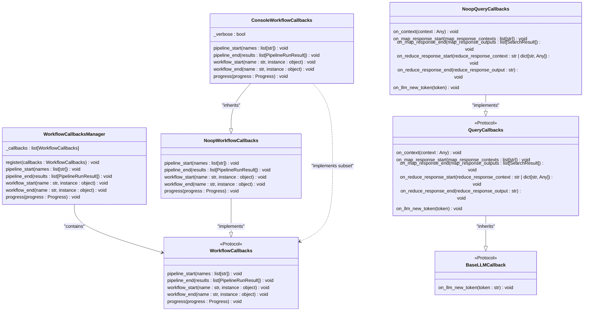
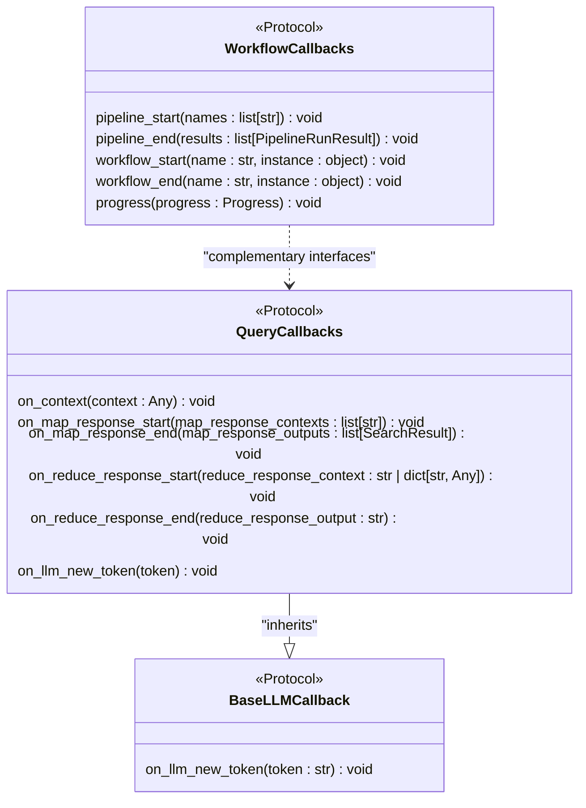
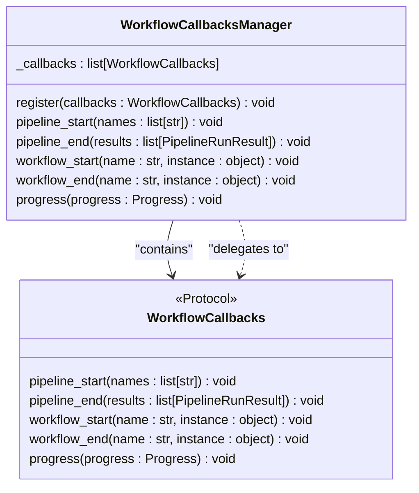
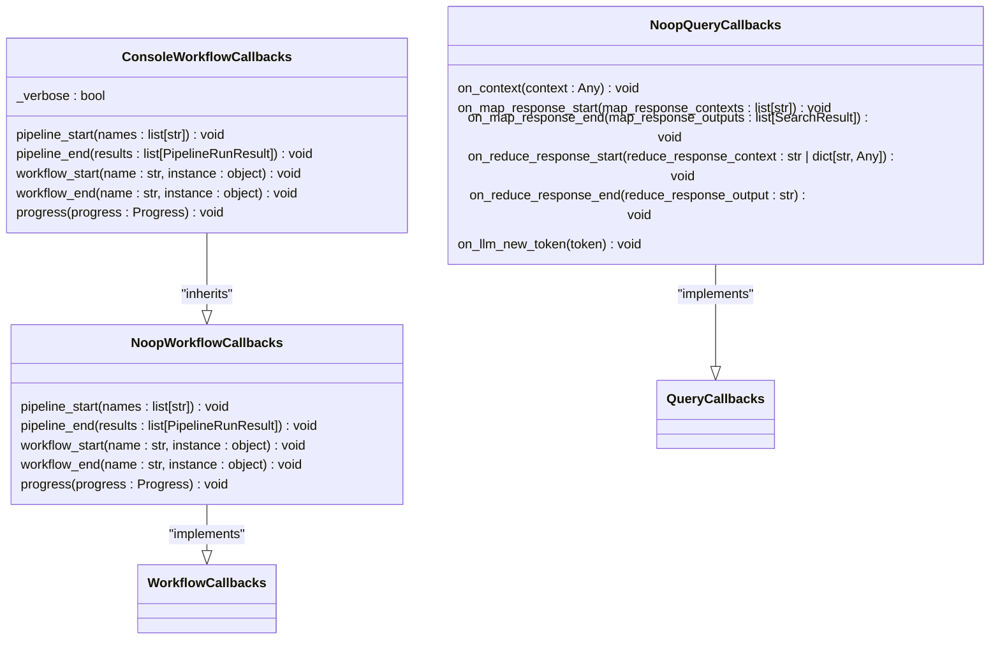
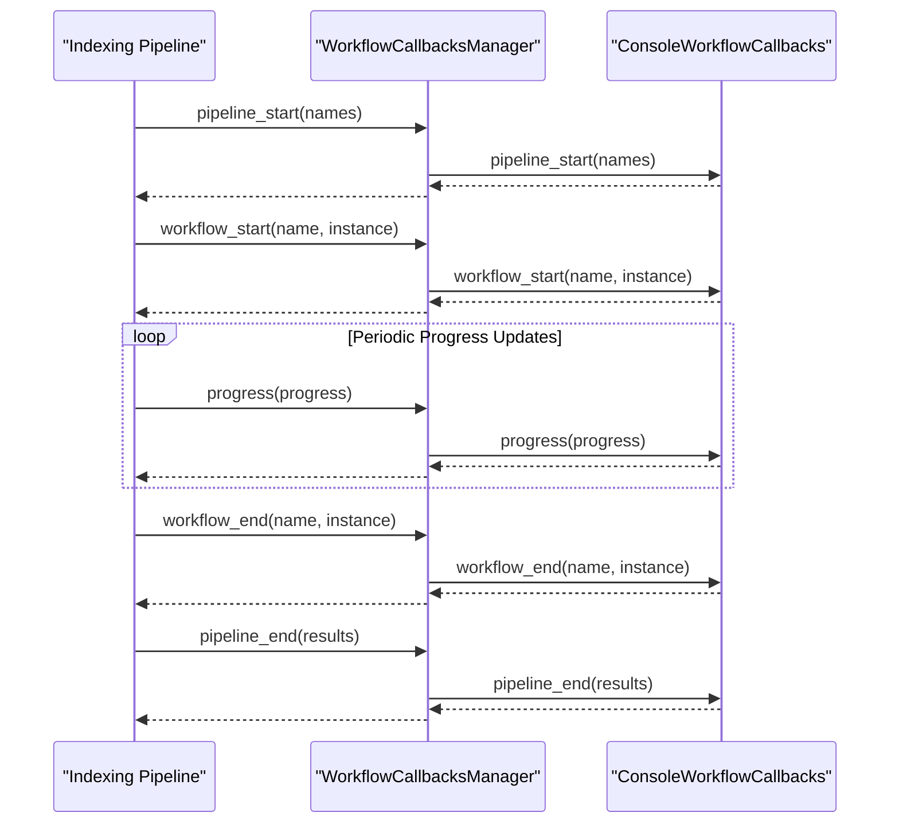
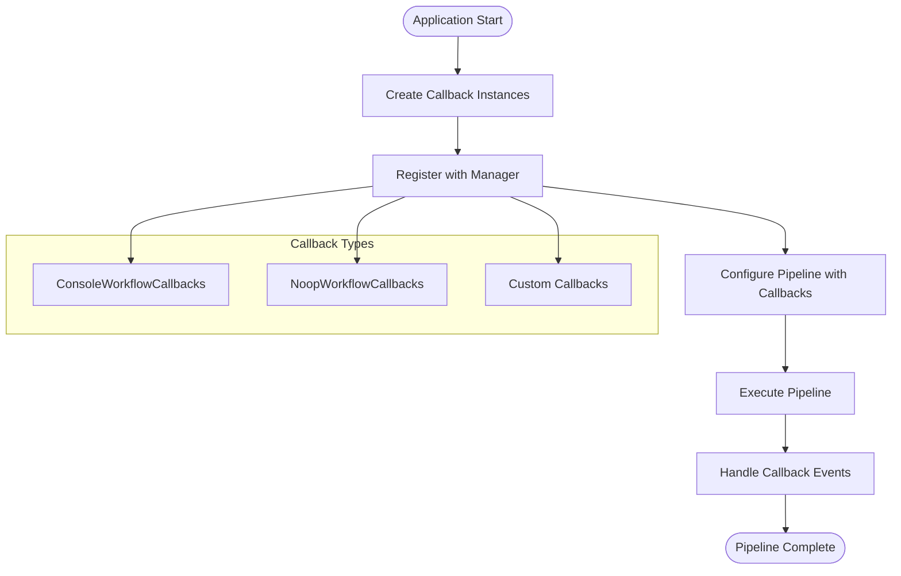

# Callback System

<cite>
**Referenced Files in This Document**   
- [workflow_callbacks.py](file://graphrag/callbacks/workflow_callbacks.py)
- [query_callbacks.py](file://graphrag/callbacks/query_callbacks.py)
- [workflow_callbacks_manager.py](file://graphrag/callbacks/workflow_callbacks_manager.py)
- [console_workflow_callbacks.py](file://graphrag/callbacks/console_workflow_callbacks.py)
- [noop_workflow_callbacks.py](file://graphrag/callbacks/noop_workflow_callbacks.py)
- [noop_query_callbacks.py](file://graphrag/callbacks/noop_query_callbacks.py)
- [llm_callbacks.py](file://graphrag/callbacks/llm_callbacks.py)
- [utils.py](file://graphrag/index/run/utils.py)
- [index.py](file://graphrag/cli/index.py)
</cite>

## Table of Contents
1. [Introduction](#introduction)
2. [Core Components](#core-components)
3. [Architecture Overview](#architecture-overview)
4. [Detailed Component Analysis](#detailed-component-analysis)
5. [Event Lifecycle](#event-lifecycle)
6. [Usage Examples](#usage-examples)
7. [Performance and Thread Safety](#performance-and-thread-safety)
8. [Best Practices](#best-practices)
9. [Conclusion](#conclusion)

## Introduction
The Callback System in GraphRAG provides a flexible mechanism for monitoring and extending the behavior of both indexing workflows and query execution. By implementing callback interfaces, users can gain observability into pipeline execution, integrate with external monitoring systems, and customize behavior at key execution points. The system is designed to be extensible while maintaining minimal performance overhead, with support for both workflow-level and query-level callbacks.

## Core Components
The callback system consists of abstract base classes, concrete implementations, and a manager class that orchestrates multiple callbacks. The design follows the Protocol pattern in Python, allowing for structural subtyping without requiring inheritance. This enables users to implement only the callback methods they need without being forced to implement unused methods.

**Section sources**
- [workflow_callbacks.py](file://graphrag/callbacks/workflow_callbacks.py#L12-L37)
- [query_callbacks.py](file://graphrag/callbacks/query_callbacks.py#L12-L33)
- [llm_callbacks.py](file://graphrag/callbacks/llm_callbacks.py#L9-L14)

## Architecture Overview
The callback architecture in GraphRAG follows a registry pattern where multiple callback handlers can be registered and invoked in sequence. The WorkflowCallbacksManager acts as a composite that delegates events to all registered callbacks, enabling multiple observers to react to the same events. This design supports both synchronous and asynchronous execution patterns while maintaining thread safety through careful design.

**Diagram sources **
- [workflow_callbacks.py](file://graphrag/callbacks/workflow_callbacks.py#L12-L37)
- [query_callbacks.py](file://graphrag/callbacks/query_callbacks.py#L12-L33)
- [workflow_callbacks_manager.py](file://graphrag/callbacks/workflow_callbacks_manager.py#L11-L52)
- [console_workflow_callbacks.py](file://graphrag/callbacks/console_workflow_callbacks.py#L13-L46)
- [noop_workflow_callbacks.py](file://graphrag/callbacks/noop_workflow_callbacks.py#L11-L27)
- [noop_query_callbacks.py](file://graphrag/callbacks/noop_query_callbacks.py#L12-L33)
- [llm_callbacks.py](file://graphrag/callbacks/llm_callbacks.py#L9-L14)

**Section sources**
- [workflow_callbacks.py](file://graphrag/callbacks/workflow_callbacks.py#L12-L37)
- [workflow_callbacks_manager.py](file://graphrag/callbacks/workflow_callbacks_manager.py#L11-L52)

## Detailed Component Analysis

### WorkflowCallbacks and QueryCallbacks Analysis
The callback system is divided into two main interfaces: WorkflowCallbacks for indexing workflows and QueryCallbacks for query execution. WorkflowCallbacks provides hooks into the pipeline lifecycle, including pipeline start/end, workflow start/end, and progress updates. QueryCallbacks focuses on the query execution process, with events for context construction, map/reduce operations, and LLM token generation. Both interfaces follow the Protocol pattern, allowing for structural subtyping and duck typing.

The BaseLLMCallback serves as a foundation for LLM-related callbacks, currently only defining the on_llm_new_token method. This hierarchical design allows for future extension while maintaining backward compatibility. The Protocol-based approach enables users to implement callbacks without requiring inheritance, promoting flexibility and reducing coupling.

**Diagram sources **
- [workflow_callbacks.py](file://graphrag/callbacks/workflow_callbacks.py#L12-L37)
- [query_callbacks.py](file://graphrag/callbacks/query_callbacks.py#L12-L33)
- [llm_callbacks.py](file://graphrag/callbacks/llm_callbacks.py#L9-L14)

**Section sources**
- [workflow_callbacks.py](file://graphrag/callbacks/workflow_callbacks.py#L12-L37)
- [query_callbacks.py](file://graphrag/callbacks/query_callbacks.py#L12-L33)
- [llm_callbacks.py](file://graphrag/callbacks/llm_callbacks.py#L9-L14)

### WorkflowCallbacksManager Analysis
The WorkflowCallbacksManager implements the Composite pattern, acting as a container for multiple callback handlers. It maintains a list of registered callbacks and invokes them in sequence when events occur. The manager checks for method existence using hasattr() before invoking callback methods, providing backward compatibility when new methods are added to the interface. This defensive programming approach ensures that callbacks implementing only a subset of the interface continue to work.

The registration process is straightforward: clients create callback instances and register them with the manager. During pipeline execution, the manager iterates through all registered callbacks and invokes the appropriate methods. This design supports multiple observers reacting to the same events, enabling scenarios like logging to both console and external monitoring systems simultaneously.

**Diagram sources **
- [workflow_callbacks_manager.py](file://graphrag/callbacks/workflow_callbacks_manager.py#L11-L52)
- [workflow_callbacks.py](file://graphrag/callbacks/workflow_callbacks.py#L12-L37)

**Section sources**
- [workflow_callbacks_manager.py](file://graphrag/callbacks/workflow_callbacks_manager.py#L11-L52)

### Built-in Callback Implementations Analysis
GraphRAG provides two built-in workflow callback implementations: ConsoleWorkflowCallbacks and NoopWorkflowCallbacks. ConsoleWorkflowCallbacks outputs progress information to the console, including workflow start/end messages and a progress bar. It supports verbose mode, which outputs additional information about completed workflows. NoopWorkflowCallbacks provides a null implementation that does nothing, serving as a default when no callbacks are specified.

For query execution, NoopQueryCallbacks provides a null implementation that ignores all events. These no-op implementations follow the Null Object pattern, eliminating the need for null checks throughout the codebase. The console implementation demonstrates how callbacks can be used for real-time monitoring, with progress updates showing completion percentage and workflow status.

**Diagram sources **
- [console_workflow_callbacks.py](file://graphrag/callbacks/console_workflow_callbacks.py#L13-L46)
- [noop_workflow_callbacks.py](file://graphrag/callbacks/noop_workflow_callbacks.py#L11-L27)
- [noop_query_callbacks.py](file://graphrag/callbacks/noop_query_callbacks.py#L12-L33)

**Section sources**
- [console_workflow_callbacks.py](file://graphrag/callbacks/console_workflow_callbacks.py#L13-L46)
- [noop_workflow_callbacks.py](file://graphrag/callbacks/noop_workflow_callbacks.py#L11-L27)
- [noop_query_callbacks.py](file://graphrag/callbacks/noop_query_callbacks.py#L12-L33)

## Event Lifecycle
The callback system follows a well-defined event lifecycle that mirrors the execution flow of indexing workflows and query processing. For indexing, the lifecycle begins with pipeline_start, followed by a series of workflow_start and workflow_end events for each workflow in the pipeline, and concludes with pipeline_end. Progress events are emitted periodically during workflow execution to provide real-time feedback.

During query execution, the lifecycle begins with on_context when query context is constructed, followed by on_map_response_start and on_map_response_end for map operations, and on_reduce_response_start and on_reduce_response_end for reduce operations. The on_llm_new_token event is emitted for each token generated by the LLM, enabling real-time streaming of responses.

**Diagram sources **
- [workflow_callbacks_manager.py](file://graphrag/callbacks/workflow_callbacks_manager.py#L24-L52)
- [workflow_callbacks.py](file://graphrag/callbacks/workflow_callbacks.py#L19-L37)
- [console_workflow_callbacks.py](file://graphrag/callbacks/console_workflow_callbacks.py#L21-L46)

**Section sources**
- [workflow_callbacks_manager.py](file://graphrag/callbacks/workflow_callbacks_manager.py#L24-L52)
- [workflow_callbacks.py](file://graphrag/callbacks/workflow_callbacks.py#L19-L37)

## Usage Examples
The callback system can be used programmatically by creating callback instances and registering them with the WorkflowCallbacksManager. In the CLI, callbacks are configured through command-line options, with the ConsoleWorkflowCallbacks being used by default when verbose mode is enabled. Custom callbacks can be implemented by creating classes that implement the required callback methods.

For configuration-based usage, callbacks can be specified in the GraphRAG configuration file, allowing for different callback configurations in different environments. This enables scenarios like using verbose console logging in development while using external monitoring callbacks in production. The system also supports multiple callbacks simultaneously, allowing for both console output and external monitoring integration.

**Diagram sources **
- [utils.py](file://graphrag/index/run/utils.py#L41-L48)
- [index.py](file://graphrag/cli/index.py#L146-L148)
- [workflow_callbacks_manager.py](file://graphrag/callbacks/workflow_callbacks_manager.py#L20-L22)

**Section sources**
- [utils.py](file://graphrag/index/run/utils.py#L41-L48)
- [index.py](file://graphrag/cli/index.py#L146-L148)

## Performance and Thread Safety
The callback system is designed with performance and thread safety in mind. The WorkflowCallbacksManager uses a simple list to store registered callbacks, with O(1) registration and O(n) event dispatch where n is the number of registered callbacks. The use of hasattr() checks before method invocation adds minimal overhead while providing backward compatibility.

For thread safety, the callback system relies on the fact that most callback operations are I/O bound (logging, network calls) rather than CPU bound. The manager does not use locks for callback invocation, assuming that individual callback implementations will handle their own thread safety if needed. This design choice reduces overhead for the common case while allowing callback implementations to add synchronization when necessary.

The system also minimizes performance impact by only invoking callback methods when they are implemented, avoiding unnecessary function calls. This is particularly important for high-frequency events like progress updates and token generation, where even small overheads can accumulate.

**Section sources**
- [workflow_callbacks_manager.py](file://graphrag/callbacks/workflow_callbacks_manager.py#L26-L52)
- [console_workflow_callbacks.py](file://graphrag/callbacks/console_workflow_callbacks.py#L40-L46)

## Best Practices
When implementing custom callbacks, it is recommended to keep callback methods lightweight and avoid blocking operations that could slow down pipeline execution. For external system integration, consider using asynchronous operations or queuing mechanisms to prevent pipeline delays. Error handling within callbacks should be robust, with appropriate logging and fallback behavior to prevent callback failures from affecting pipeline execution.

For production monitoring, combine multiple callback types to get comprehensive observability: use console callbacks for real-time monitoring, logging callbacks for persistent logs, and external monitoring callbacks for alerting and metrics collection. When implementing custom callbacks, follow the single responsibility principle by creating focused callbacks that handle specific concerns rather than monolithic callbacks that do everything.

Configuration management is also important: use different callback configurations for different environments, with verbose logging in development and more targeted monitoring in production. Consider the security implications of callback data, especially when integrating with external systems, and ensure that sensitive information is properly redacted or encrypted.

**Section sources**
- [console_workflow_callbacks.py](file://graphrag/callbacks/console_workflow_callbacks.py#L21-L46)
- [noop_workflow_callbacks.py](file://graphrag/callbacks/noop_workflow_callbacks.py#L14-L27)

## Conclusion
The Callback System in GraphRAG provides a powerful and flexible mechanism for monitoring and extending pipeline behavior. By implementing the WorkflowCallbacks and QueryCallbacks interfaces, users can gain deep observability into indexing and query execution while maintaining the ability to customize behavior at key execution points. The system's design emphasizes extensibility, performance, and ease of use, making it suitable for both development and production environments.

The combination of abstract base classes, concrete implementations, and the WorkflowCallbacksManager creates a robust foundation for callback-driven development. Whether using built-in callbacks for basic monitoring or implementing custom callbacks for integration with external systems, the callback system enables users to adapt GraphRAG to their specific needs while maintaining visibility into pipeline execution.