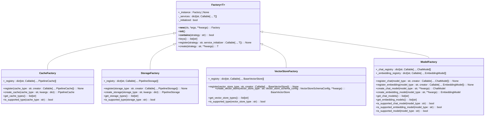
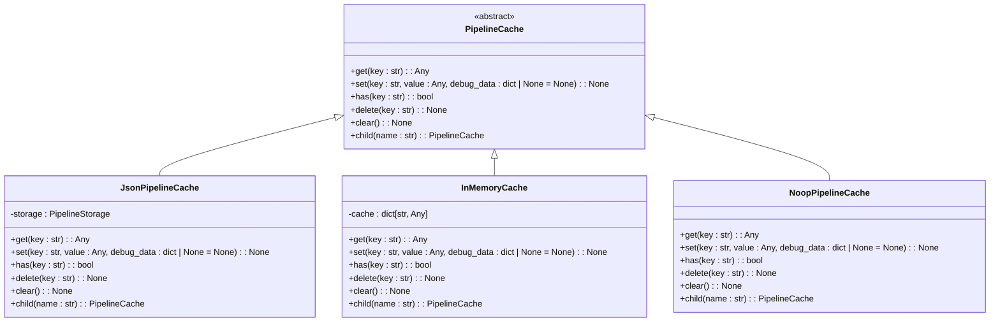
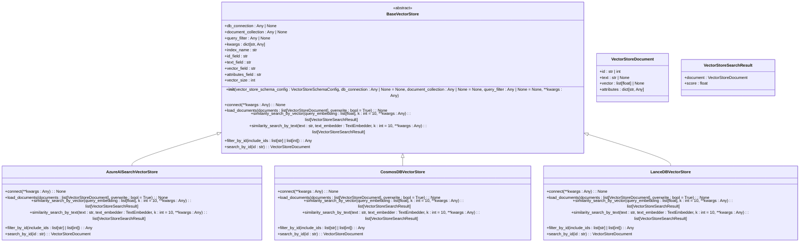
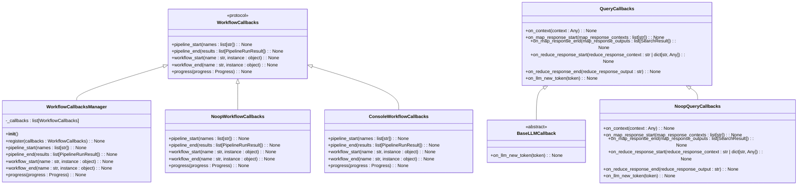

# Extensibility and Integration

<cite>
**Referenced Files in This Document**   
- [factory.py](file://graphrag/factory/factory.py)
- [cache/factory.py](file://graphrag/cache/factory.py)
- [storage/factory.py](file://graphrag/storage/factory.py)
- [vector_stores/factory.py](file://graphrag/vector_stores/factory.py)
- [language_model/factory.py](file://graphrag/language_model/factory.py)
- [callbacks/workflow_callbacks.py](file://graphrag/callbacks/workflow_callbacks.py)
- [callbacks/query_callbacks.py](file://graphrag/callbacks/query_callbacks.py)
- [callbacks/workflow_callbacks_manager.py](file://graphrag/callbacks/workflow_callbacks_manager.py)
- [cache/pipeline_cache.py](file://graphrag/cache/pipeline_cache.py)
- [storage/pipeline_storage.py](file://graphrag/storage/pipeline_storage.py)
- [vector_stores/base.py](file://graphrag/vector_stores/base.py)
- [language_model/protocol/base.py](file://graphrag/language_model/protocol/base.py)
- [language_model/providers/litellm/chat_model.py](file://graphrag/language_model/providers/litellm/chat_model.py)
- [language_model/providers/litellm/embedding_model.py](file://graphrag/language_model/providers/litellm/embedding_model.py)
- [index/workflows/factory.py](file://graphrag/index/workflows/factory.py)
</cite>

## Table of Contents
1. [Introduction](#introduction)
2. [Factory Pattern Architecture](#factory-pattern-architecture)
3. [Cache Extension Point](#cache-extension-point)
4. [Storage Extension Point](#storage-extension-point)
5. [Vector Store Extension Point](#vector-store-extension-point)
6. [LLM Provider Extension Point](#llm-provider-extension-point)
7. [Callback System](#callback-system)
8. [Azure Integration](#azure-integration)
9. [Open-Source Vector Database Integration](#open-source-vector-database-integration)
10. [LiteLLM Integration](#litellm-integration)
11. [Custom Implementation Examples](#custom-implementation-examples)
12. [Conclusion](#conclusion)

## Introduction

GraphRAG is designed with extensibility as a core principle, enabling users to customize and extend various components of the system to meet specific infrastructure, compliance, or performance requirements. The architecture leverages factory patterns and protocol-based interfaces to support pluggable components for caching, storage, vector stores, and LLM providers. This document details the extensibility mechanisms, extension points, and integration capabilities that allow advanced users to tailor GraphRAG to their specific needs.

**Section sources**
- [factory.py](file://graphrag/factory/factory.py#L1-L69)
- [cache/factory.py](file://graphrag/cache/factory.py#L1-L116)

## Factory Pattern Architecture

GraphRAG employs a factory pattern architecture to manage the creation and registration of pluggable components. The core `Factory` class in `graphrag.factory.factory` serves as the foundation for all extension points, providing a consistent interface for registering and creating instances of various components.

The factory implementation follows the singleton pattern, ensuring that only one instance of each factory exists throughout the application lifecycle. This allows for centralized management of component registrations and instances. The factory supports generic type parameters, enabling type-safe creation of component instances.

Each extension point in GraphRAG has its own specialized factory class that inherits from the base `Factory` class or implements a similar registration pattern. These factories maintain a registry of available implementations and provide methods to create instances based on configuration parameters.



**Diagram sources **
- [factory.py](file://graphrag/factory/factory.py#L13-L69)
- [cache/factory.py](file://graphrag/cache/factory.py#L24-L116)
- [storage/factory.py](file://graphrag/storage/factory.py#L22-L84)
- [vector_stores/factory.py](file://graphrag/vector_stores/factory.py#L24-L97)
- [language_model/factory.py](file://graphrag/language_model/factory.py#L23-L124)

**Section sources**
- [factory.py](file://graphrag/factory/factory.py#L1-L69)
- [cache/factory.py](file://graphrag/cache/factory.py#L1-L116)
- [storage/factory.py](file://graphrag/storage/factory.py#L1-L84)
- [vector_stores/factory.py](file://graphrag/vector_stores/factory.py#L1-L97)
- [language_model/factory.py](file://graphrag/language_model/factory.py#L1-L124)

## Cache Extension Point

The cache extension point in GraphRAG provides a flexible mechanism for managing cached data across different storage backends. The system defines a protocol-based interface for cache implementations through the `PipelineCache` abstract base class, which specifies the required methods for cache operations.

### Base Interface

The `PipelineCache` interface defines the following abstract methods that all cache implementations must implement:

- `get(key: str)`: Retrieve a value from the cache by key
- `set(key: str, value: Any, debug_data: dict | None = None)`: Store a value in the cache with the specified key
- `has(key: str)`: Check if a key exists in the cache
- `delete(key: str)`: Remove a key from the cache
- `clear()`: Remove all entries from the cache
- `child(name: str)`: Create a child cache with the specified name

### Available Implementations

GraphRAG provides several built-in cache implementations that can be registered and used through the `CacheFactory`:

- **File-based cache**: Stores cache data in JSON files on the local filesystem
- **Blob storage cache**: Uses Azure Blob Storage for distributed caching
- **CosmosDB cache**: Leverages Azure CosmosDB for scalable, globally distributed caching
- **Memory cache**: In-memory caching for high-performance scenarios
- **No-op cache**: A null implementation that doesn't actually cache data, useful for testing or when caching is not desired

### Registration of Custom Caches

Users can register custom cache implementations by creating a class that inherits from `PipelineCache` and implements all required methods. The custom implementation can then be registered with the `CacheFactory` using the `register` method:

```python
class CustomCache(PipelineCache):
    # Implementation of required methods
    pass

CacheFactory.register("custom", lambda **kwargs: CustomCache(**kwargs))
```

Once registered, the custom cache can be referenced by its registered name in the configuration, and the factory will create instances of the custom implementation when requested.



**Diagram sources **
- [cache/pipeline_cache.py](file://graphrag/cache/pipeline_cache.py#L12-L68)
- [cache/json_pipeline_cache.py](file://graphrag/cache/json_pipeline_cache.py)
- [cache/memory_pipeline_cache.py](file://graphrag/cache/memory_pipeline_cache.py)
- [cache/noop_pipeline_cache.py](file://graphrag/cache/noop_pipeline_cache.py)

**Section sources**
- [cache/pipeline_cache.py](file://graphrag/cache/pipeline_cache.py#L1-L68)
- [cache/factory.py](file://graphrag/cache/factory.py#L1-L116)

## Storage Extension Point

The storage extension point in GraphRAG enables flexible data persistence across various storage backends. The system defines a protocol-based interface for storage implementations through the `PipelineStorage` abstract base class, which specifies the required methods for storage operations.

### Base Interface

The `PipelineStorage` interface defines the following abstract methods that all storage implementations must implement:

- `find(file_pattern: re.Pattern[str], base_dir: str | None = None, file_filter: dict[str, Any] | None = None, max_count=-1)`: Find files in storage using a pattern and optional filters
- `get(key: str, as_bytes: bool | None = None, encoding: str | None = None)`: Retrieve data from storage by key
- `set(key: str, value: Any, encoding: str | None = None)`: Store data in storage with the specified key
- `has(key: str)`: Check if a key exists in storage
- `delete(key: str)`: Remove a key from storage
- `clear()`: Remove all entries from storage
- `child(name: str | None)`: Create a child storage instance
- `keys()`: List all keys in storage
- `get_creation_date(key: str)`: Get the creation date for a specific key

### Available Implementations

GraphRAG provides several built-in storage implementations that can be registered and used through the `StorageFactory`:

- **Blob storage**: Uses Azure Blob Storage for scalable, durable storage
- **CosmosDB storage**: Leverages Azure CosmosDB for globally distributed, low-latency storage
- **File storage**: Stores data in files on the local filesystem
- **Memory storage**: In-memory storage for high-performance scenarios during processing

### Registration of Custom Storage

Users can register custom storage implementations by creating a class that inherits from `PipelineStorage` and implements all required methods. The custom implementation can then be registered with the `StorageFactory` using the `register` method:

```python
class CustomStorage(PipelineStorage):
    # Implementation of required methods
    pass

StorageFactory.register("custom", CustomStorage)
```

Once registered, the custom storage can be referenced by its registered name in the configuration, and the factory will create instances of the custom implementation when requested.

```mermaid
classDiagram
class PipelineStorage {
<<abstract>>
+find(file_pattern : re.Pattern[str], base_dir : str | None = None, file_filter : dict[str, Any] | None = None, max_count=-1) : Iterator[tuple[str, dict[str, Any]]]
+get(key : str, as_bytes : bool | None = None, encoding : str | None = None) : Any
+set(key : str, value : Any, encoding : str | None = None) : None
+has(key : str) : bool
+delete(key : str) : None
+clear() : None
+child(name : str | None) : PipelineStorage
+keys() : list[str]
+get_creation_date(key : str) : str
}
class BlobPipelineStorage {
-connection_string : str
-container_name : str
+find(file_pattern : re.Pattern[str], base_dir : str | None = None, file_filter : dict[str, Any] | None = None, max_count=-1) : Iterator[tuple[str, dict[str, Any]]]
+get(key : str, as_bytes : bool | None = None, encoding : str | None = None) : Any
+set(key : str, value : Any, encoding : str | None = None) : None
+has(key : str) : bool
+delete(key : str) : None
+clear() : None
+child(name : str | None) : PipelineStorage
+keys() : list[str]
+get_creation_date(key : str) : str
}
class CosmosDBPipelineStorage {
-connection_string : str
-database_name : str
-container_name : str
+find(file_pattern : re.Pattern[str], base_dir : str | None = None, file_filter : dict[str, Any] | None = None, max_count=-1) : Iterator[tuple[str, dict[str, Any]]]
+get(key : str, as_bytes : bool | None = None, encoding : str | None = None) : Any
+set(key : str, value : Any, encoding : str | None = None) : None
+has(key : str) : bool
+delete(key : str) : None
+clear() : None
+child(name : str | None) : PipelineStorage
+keys() : list[str]
+get_creation_date(key : str) : str
}
class FilePipelineStorage {
-base_dir : str
+find(file_pattern : re.Pattern[str], base_dir : str | None = None, file_filter : dict[str, Any] | None = None, max_count=-1) : Iterator[tuple[str, dict[str, Any]]]
+get(key : str, as_bytes : bool | None = None, encoding : str | None = None) : Any
+set(key : str, value : Any, encoding : str | None = None) : None
+has(key : str) : bool
+delete(key : str) : None
+clear() : None
+child(name : str | None) : PipelineStorage
+keys() : list[str]
+get_creation_date(key : str) : str
}
class MemoryPipelineStorage {
-storage : dict[str, Any]
+find(file_pattern : re.Pattern[str], base_dir : str | None = None, file_filter : dict[str, Any] | None = None, max_count=-1) : Iterator[tuple[str, dict[str, Any]]]
+get(key : str, as_bytes : bool | None = None, encoding : str | None = None) : Any
+set(key : str, value : Any, encoding : str | None = None) : None
+has(key : str) : bool
+delete(key : str) : None
+clear() : None
+child(name : str | None) : PipelineStorage
+keys() : list[str]
+get_creation_date(key : str) : str
}
PipelineStorage <|-- BlobPipelineStorage
PipelineStorage <|-- CosmosDBPipelineStorage
PipelineStorage <|-- FilePipelineStorage
PipelineStorage <|-- MemoryPipelineStorage
```



**Diagram sources **
- [storage/pipeline_storage.py](file://graphrag/storage/pipeline_storage.py#L13-L100)
- [storage/blob_pipeline_storage.py](file://graphrag/storage/blob_pipeline_storage.py)
- [storage/cosmosdb_pipeline_storage.py](file://graphrag/storage/cosmosdb_pipeline_storage.py)
- [storage/file_pipeline_storage.py](file://graphrag/storage/file_pipeline_storage.py)
- [storage/memory_pipeline_storage.py](file://graphrag/storage/memory_pipeline_storage.py)

**Section sources**
- [storage/pipeline_storage.py](file://graphrag/storage/pipeline_storage.py#L1-L100)
- [storage/factory.py](file://graphrag/storage/factory.py#L1-L84)

## Vector Store Extension Point

The vector store extension point in GraphRAG provides a flexible mechanism for storing and retrieving vector embeddings. The system defines a protocol-based interface for vector store implementations through the `BaseVectorStore` abstract base class, which specifies the required methods for vector store operations.

### Base Interface

The `BaseVectorStore` interface defines the following abstract methods that all vector store implementations must implement:

- `connect(**kwargs: Any)`: Establish a connection to the vector store
- `load_documents(documents: list[VectorStoreDocument], overwrite: bool = True)`: Load documents into the vector store
- `similarity_search_by_vector(query_embedding: list[float], k: int = 10, **kwargs: Any)`: Perform approximate nearest neighbor search by vector
- `similarity_search_by_text(text: str, text_embedder: TextEmbedder, k: int = 10, **kwargs: Any)`: Perform approximate nearest neighbor search by text
- `filter_by_id(include_ids: list[str] | list[int])`: Build a query filter to filter documents by ID
- `search_by_id(id: str)`: Search for a document by ID

The interface also defines data classes for representing documents and search results:

- `VectorStoreDocument`: Represents a document stored in the vector store with an ID, text, vector, and attributes
- `VectorStoreSearchResult`: Represents a search result with a document and similarity score

### Available Implementations

GraphRAG provides several built-in vector store implementations that can be registered and used through the `VectorStoreFactory`:

- **Azure AI Search**: Integration with Azure's managed search service for vector search capabilities
- **CosmosDB**: Leverages Azure CosmosDB's vector search capabilities
- **LanceDB**: Open-source vector database with efficient storage and search capabilities

### Registration of Custom Vector Stores

Users can register custom vector store implementations by creating a class that inherits from `BaseVectorStore` and implements all required methods. The custom implementation can then be registered with the `VectorStoreFactory` using the `register` method:

```python
class CustomVectorStore(BaseVectorStore):
    def connect(self, **kwargs: Any) -> None:
        # Implementation
        pass
        
    def load_documents(self, documents: list[VectorStoreDocument], overwrite: bool = True) -> None:
        # Implementation
        pass
        
    # Other required methods...

VectorStoreFactory.register("custom", CustomVectorStore)
```

Once registered, the custom vector store can be referenced by its registered name in the configuration, and the factory will create instances of the custom implementation when requested.



**Diagram sources **
- [vector_stores/base.py](file://graphrag/vector_stores/base.py#L39-L91)
- [vector_stores/azure_ai_search.py](file://graphrag/vector_stores/azure_ai_search.py)
- [vector_stores/cosmosdb.py](file://graphrag/vector_stores/cosmosdb.py)
- [vector_stores/lancedb.py](file://graphrag/vector_stores/lancedb.py)

**Section sources**
- [vector_stores/base.py](file://graphrag/vector_stores/base.py#L1-L91)
- [vector_stores/factory.py](file://graphrag/vector_stores/factory.py#L1-L97)

## LLM Provider Extension Point

The LLM provider extension point in GraphRAG enables integration with various language model providers through a protocol-based interface. The system defines abstract protocols for chat and embedding models, allowing for pluggable LLM implementations.

### Base Interfaces

GraphRAG defines two primary protocols for LLM providers:

#### ChatModel Protocol

The `ChatModel` protocol defines the interface for chat-based language models:

- `achat(prompt: str, history: list | None = None, **kwargs: Any)`: Asynchronously generate a response for the given prompt and optional conversation history
- `achat_stream(prompt: str, history: list | None = None, **kwargs: Any)`: Asynchronously generate a response as a stream of tokens
- `chat(prompt: str, history: list | None = None, **kwargs: Any)`: Synchronously generate a response for the given prompt and optional conversation history
- `chat_stream(prompt: str, history: list | None = None, **kwargs: Any)`: Synchronously generate a response as a stream of tokens
- `config: LanguageModelConfig`: Configuration used to create the model instance

#### EmbeddingModel Protocol

The `EmbeddingModel` protocol defines the interface for embedding-based language models:

- `aembed_batch(text_list: list[str], **kwargs: Any)`: Asynchronously generate embeddings for a batch of text inputs
- `aembed(text: str, **kwargs: Any)`: Asynchronously generate an embedding for a single text input
- `embed_batch(text_list: list[str], **kwargs: Any)`: Synchronously generate embeddings for a batch of text inputs
- `embed(text: str, **kwargs: Any)`: Synchronously generate an embedding for a single text input
- `config: LanguageModelConfig`: Configuration used to create the model instance

### Available Implementations

GraphRAG provides several built-in LLM provider implementations through the `ModelFactory`:

- **Azure OpenAI Chat**: Integration with Azure OpenAI's chat models
- **OpenAI Chat**: Integration with OpenAI's chat models
- **Azure OpenAI Embedding**: Integration with Azure OpenAI's embedding models
- **OpenAI Embedding**: Integration with OpenAI's embedding models
- **LiteLLM**: Generic integration that supports multiple providers through the LiteLLM library

### Registration of Custom LLM Providers

Users can register custom LLM provider implementations by creating classes that implement the `ChatModel` and/or `EmbeddingModel` protocols. The custom implementations can then be registered with the `ModelFactory` using the appropriate registration methods:

```python
class CustomChatModel:
    def __init__(self, config: LanguageModelConfig):
        self.config = config
    
    async def achat(self, prompt: str, history: list | None = None, **kwargs: Any):
        # Implementation
        pass
        
    # Other required methods...

class CustomEmbeddingModel:
    def __init__(self, config: LanguageModelConfig):
        self.config = config
    
    async def aembed(self, text: str, **kwargs: Any):
        # Implementation
        pass
        
    # Other required methods...

ModelFactory.register_chat("custom-chat", lambda **kwargs: CustomChatModel(**kwargs))
ModelFactory.register_embedding("custom-embedding", lambda **kwargs: CustomEmbeddingModel(**kwargs))
```

Once registered, the custom LLM providers can be referenced by their registered names in the configuration, and the factory will create instances of the custom implementations when requested.

```mermaid
classDiagram
class ChatModel {
<<protocol>>
+config : LanguageModelConfig
+achat(prompt : str, history : list | None = None, **kwargs : Any) : ModelResponse
+achat_stream(prompt : str, history : list | None = None, **kwargs : Any) : AsyncGenerator[str, None]
+chat(prompt : str, history : list | None = None, **kwargs : Any) : ModelResponse
+chat_stream(prompt : str, history : list | None = None, **kwargs : Any) : Generator[str, None]
}
class EmbeddingModel {
<<protocol>>
+config : LanguageModelConfig
+aembed_batch(text_list : list[str], **kwargs : Any) : list[list[float]]
+aembed(text : str, **kwargs : Any) : list[float]
+embed_batch(text_list : list[str], **kwargs : Any) : list[list[float]]
+embed(text : str, **kwargs : Any) : list[float]
}
class LitellmChatModel {
-name : str
-config : LanguageModelConfig
-cache : PipelineCache | None
-completion : FixedModelCompletion
-acompletion : AFixedModelCompletion
+__init__(name : str, config : LanguageModelConfig, cache : PipelineCache | None = None, **kwargs : Any)
+achat(prompt : str, history : list | None = None, **kwargs : Any) : ModelResponse
+achat_stream(prompt : str, history : list | None = None, **kwargs : Any) : AsyncGenerator[str, None]
+chat(prompt : str, history : list | None = None, **kwargs : Any) : ModelResponse
+chat_stream(prompt : str, history : list | None = None, **kwargs : Any) : Generator[str, None]
+_get_kwargs(**kwargs : Any) : dict[str, Any]
}
class LitellmEmbeddingModel {
-name : str
-config : LanguageModelConfig
-cache : PipelineCache | None
-embedding : FixedModelEmbedding
-aembedding : AFixedModelEmbedding
+__init__(name : str, config : LanguageModelConfig, cache : PipelineCache | None = None, **kwargs : Any)
+aembed_batch(text_list : list[str], **kwargs : Any) : list[list[float]]
+aembed(text : str, **kwargs : Any) : list[float]
+embed_batch(text_list : list[str], **kwargs : Any) : list[list[float]]
+embed(text : str, **kwargs : Any) : list[float]
+_get_kwargs(**kwargs : Any) : dict[str, Any]
}
class AzureOpenAIChatFNLLM {
+achat(prompt : str, history : list | None = None, **kwargs : Any) : ModelResponse
+achat_stream(prompt : str, history : list | None = None, **kwargs : Any) : AsyncGenerator[str, None]
+chat(prompt : str, history : list | None = None, **kwargs : Any) : ModelResponse
+chat_stream(prompt : str, history : list | None = None, **kwargs : Any) : Generator[str, None]
}
class OpenAIChatFNLLM {
+achat(prompt : str, history : list | None = None, **kwargs : Any) : ModelResponse
+achat_stream(prompt : str, history : list | None = None, **kwargs : Any) : AsyncGenerator[str, None]
+chat(prompt : str, history : list | None = None, **kwargs : Any) : ModelResponse
+chat_stream(prompt : str, history : list | None = None, **kwargs : Any) : Generator[str, None]
}
class AzureOpenAIEmbeddingFNLLM {
+aembed_batch(text_list : list[str], **kwargs : Any) : list[list[float]]
+aembed(text : str, **kwargs : Any) : list[float]
+embed_batch(text_list : list[str], **kwargs : Any) : list[list[float]]
+embed(text : str, **kwargs : Any) : list[float]
}
class OpenAIEmbeddingFNLLM {
+aembed_batch(text_list : list[str], **kwargs : Any) : list[list[float]]
+aembed(text : str, **kwargs : Any) : list[float]
+embed_batch(text_list : list[str], **kwargs : Any) : list[list[float]]
+embed(text : str, **kwargs : Any) : list[float]
}
ChatModel <|-- LitellmChatModel
ChatModel <|-- AzureOpenAIChatFNLLM
ChatModel <|-- OpenAIChatFNLLM
EmbeddingModel <|-- LitellmEmbeddingModel
EmbeddingModel <|-- AzureOpenAIEmbeddingFNLLM
EmbeddingModel <|-- OpenAIEmbeddingFNLLM
```



**Diagram sources **
- [language_model/protocol/base.py](file://graphrag/language_model/protocol/base.py#L17-L167)
- [language_model/providers/litellm/chat_model.py](file://graphrag/language_model/providers/litellm/chat_model.py)
- [language_model/providers/litellm/embedding_model.py](file://graphrag/language_model/providers/litellm/embedding_model.py)
- [language_model/providers/fnllm/models.py](file://graphrag/language_model/providers/fnllm/models.py)

**Section sources**
- [language_model/protocol/base.py](file://graphrag/language_model/protocol/base.py#L1-L167)
- [language_model/factory.py](file://graphrag/language_model/factory.py#L1-L124)

## Callback System

GraphRAG provides a comprehensive callback system that allows users to hook into workflow and query execution for monitoring, logging, or custom processing. The system is designed with extensibility in mind, enabling users to implement custom callbacks that respond to various events throughout the pipeline execution.

### Workflow Callbacks

The workflow callback system allows users to monitor and respond to events during the indexing pipeline execution. The `WorkflowCallbacks` protocol defines the interface for workflow callbacks, including methods for:

- `pipeline_start(names: list[str])`: Called when the entire pipeline starts
- `pipeline_end(results: list[PipelineRunResult])`: Called when the entire pipeline ends
- `workflow_start(name: str, instance: object)`: Called when a specific workflow starts
- `workflow_end(name: str, instance: object)`: Called when a specific workflow ends
- `progress(progress: Progress)`: Called when progress occurs during pipeline execution

The `WorkflowCallbacksManager` class serves as a registry for workflow callbacks, allowing multiple callback instances to be registered and invoked in sequence. When an event occurs, the manager iterates through all registered callbacks and invokes the appropriate method if it exists on the callback instance.

### Query Callbacks

The query callback system allows users to monitor and respond to events during query execution. The `QueryCallbacks` class extends the `BaseLLMCallback` class and defines methods for:

- `on_context(context: Any)`: Called when context data is constructed for a query
- `on_map_response_start(map_response_contexts: list[str])`: Called at the start of a map operation
- `on_map_response_end(map_response_outputs: list[SearchResult])`: Called at the end of a map operation
- `on_reduce_response_start(reduce_response_context: str | dict[str, Any])`: Called at the start of a reduce operation
- `on_reduce_response_end(reduce_response_output: str)`: Called at the end of a reduce operation
- `on_llm_new_token(token)`: Called when a new token is generated by the LLM

### Implementation and Registration

Users can implement custom callbacks by creating classes that inherit from the appropriate base callback class or implement the callback protocol. Custom callbacks can then be registered with the system through configuration or programmatically.

For workflow callbacks, custom implementations can be registered with the `WorkflowCallbacksManager`:

```python
class CustomWorkflowCallbacks(WorkflowCallbacks):
    def pipeline_start(self, names: list[str]) -> None:
        # Custom logic when pipeline starts
        pass
        
    def pipeline_end(self, results: list[PipelineRunResult]) -> None:
        # Custom logic when pipeline ends
        pass
        
    # Other callback methods...

# Register the custom callbacks
callbacks_manager = WorkflowCallbacksManager()
callbacks_manager.register(CustomWorkflowCallbacks())
```

For query callbacks, custom implementations can be passed to the query execution system:

```python
class CustomQueryCallbacks(QueryCallbacks):
    def on_context(self, context: Any) -> None:
        # Custom logic when context is constructed
        pass
        
    def on_llm_new_token(self, token) -> None:
        # Custom logic when a new token is generated
        pass
        
    # Other callback methods...
```

The callback system enables advanced use cases such as real-time monitoring, custom logging, performance tracking, and integration with external systems.



**Diagram sources **
- [callbacks/workflow_callbacks.py](file://graphrag/callbacks/workflow_callbacks.py#L12-L38)
- [callbacks/workflow_callbacks_manager.py](file://graphrag/callbacks/workflow_callbacks_manager.py#L11-L53)
- [callbacks/query_callbacks.py](file://graphrag/callbacks/query_callbacks.py#L12-L34)
- [callbacks/llm_callbacks.py](file://graphrag/callbacks/llm_callbacks.py)

**Section sources**
- [callbacks/workflow_callbacks.py](file://graphrag/callbacks/workflow_callbacks.py#L1-L38)
- [callbacks/workflow_callbacks_manager.py](file://graphrag/callbacks/workflow_callbacks_manager.py#L1-L53)
- [callbacks/query_callbacks.py](file://graphrag/callbacks/query_callbacks.py#L1-L34)

## Azure Integration

GraphRAG provides deep integration with Azure services, leveraging Azure's cloud infrastructure for scalable and reliable operation. The system integrates with several Azure services for different aspects of the pipeline.

### Azure Blob Storage

GraphRAG uses Azure Blob Storage as a storage backend for persistent data storage. The `BlobPipelineStorage` class implements the `PipelineStorage` interface and provides integration with Azure Blob Storage. Users can configure the connection through connection strings or managed identity authentication.

The integration supports:
- Reading and writing pipeline artifacts
- Storing intermediate processing results
- Archiving completed pipeline outputs
- Distributed storage across multiple regions

### Azure CosmosDB

GraphRAG integrates with Azure CosmosDB for both storage and vector search capabilities. The system provides two integration points with CosmosDB:

1. **Storage**: The `CosmosDBPipelineStorage` class implements the `PipelineStorage` interface, allowing pipeline artifacts to be stored in CosmosDB containers.

2. **Vector Search**: The `CosmosDBVectorStore` class implements the `BaseVectorStore` interface, leveraging CosmosDB's vector search capabilities for efficient similarity search on embeddings.

The integration supports:
- Globally distributed data with low latency
- Automatic scaling based on workload
- Built-in high availability and disaster recovery
- Multiple API models (SQL, MongoDB, etc.)

### Azure AI Search

GraphRAG integrates with Azure AI Search for advanced vector search capabilities. The `AzureAISearchVectorStore` class implements the `BaseVectorStore` interface and provides integration with Azure AI Search. This integration enables:

- High-performance vector similarity search
- Hybrid search combining vector and keyword search
- Advanced filtering and faceting capabilities
- Scalable search infrastructure

### Azure Managed Identity

GraphRAG supports Azure Managed Identity for secure authentication to Azure services. The system can authenticate to Azure services using managed identities, eliminating the need to store credentials in configuration files. This is particularly useful for:

- Enhanced security by avoiding credential storage
- Simplified deployment in Azure environments
- Compliance with security best practices

The integration is configured through the `AuthType` enum and the `audience` parameter in the language model configuration.

## Open-Source Vector Database Integration

GraphRAG provides integration with open-source vector databases, enabling users to leverage community-driven solutions for vector storage and search. The primary open-source vector database integration is with LanceDB.

### LanceDB Integration

LanceDB is an open-source vector database that provides efficient storage and search capabilities for vector embeddings. GraphRAG's `LanceDBVectorStore` class implements the `BaseVectorStore` interface and provides integration with LanceDB.

Key features of the LanceDB integration include:

- **Efficient Storage**: LanceDB uses a columnar storage format optimized for vector data, providing efficient storage and retrieval.
- **Fast Search**: The integration supports approximate nearest neighbor search with configurable accuracy and performance trade-offs.
- **Local Development**: LanceDB can run locally, making it ideal for development and testing scenarios.
- **Open Source**: As an open-source solution, LanceDB allows for full transparency and customization.

The integration is configured through the `VectorStoreFactory` and can be specified in the configuration file:

```yaml
vector_store:
  type: LanceDB
  connection_args:
    uri: ./lancedb
    table_name: graphrag_vectors
```

### Benefits of Open-Source Integration

The integration with open-source vector databases provides several benefits:

- **Cost-Effective**: Open-source solutions can reduce infrastructure costs compared to managed services.
- **Data Control**: Users have full control over their data and infrastructure.
- **Customization**: Open-source solutions can be customized to meet specific requirements.
- **Community Support**: Access to community-driven improvements and support.

## LiteLLM Integration

GraphRAG integrates with LiteLLM, a library that provides a unified interface to multiple LLM providers. This integration enables GraphRAG to support a wide range of LLM providers through a single, consistent interface.

### LiteLLM Provider

The `LitellmChatModel` and `LitellmEmbeddingModel` classes implement the `ChatModel` and `EmbeddingModel` protocols respectively, using LiteLLM as the underlying implementation. This allows GraphRAG to support any LLM provider that is supported by LiteLLM.

Key features of the LiteLLM integration include:

- **Multiple Provider Support**: Support for OpenAI, Azure OpenAI, Anthropic, Cohere, and many other providers.
- **Unified Interface**: A consistent interface across different providers, reducing the complexity of supporting multiple LLMs.
- **Advanced Features**: Support for advanced features like streaming, function calling, and response formatting.
- **Rate Limiting and Retries**: Built-in support for rate limiting and retry logic to handle API limitations.

### Request Processing Pipeline

The LiteLLM integration implements a request processing pipeline that wraps the base LiteLLM functions with additional features:

1. **Rate Limiting**: The `with_rate_limiter` wrapper handles rate limiting based on the configured strategy.
2. **Retries**: The `with_retries` wrapper handles retry logic for failed requests.
3. **Caching**: The `with_cache` wrapper integrates with the GraphRAG caching system to cache LLM responses.
4. **Logging**: The `with_logging` wrapper adds logging for request and response data.

The pipeline composition order is: Logging(Cache(Retries(RateLimiter(ModelCompletion()))))

This layered approach ensures that features are applied in the correct order and that each layer can operate independently.

### Configuration

The LiteLLM integration is configured through the language model configuration, specifying the provider, model, and any provider-specific parameters:

```yaml
llm:
  type: Chat
  model: gpt-3.5-turbo
  model_provider: openai
  api_key: sk-...
  request_timeout: 30
  temperature: 0.7
  top_p: 1.0
  n: 1
  max_tokens: 4000
  presence_penalty: 0.0
  frequency_penalty: 0.0
```

When the `type` is set to "Chat" or "Embedding", the `ModelFactory` creates instances of `LitellmChatModel` or `LitellmEmbeddingModel` respectively, which use LiteLLM to communicate with the specified provider.

## Custom Implementation Examples

This section provides examples of implementing custom components for GraphRAG, demonstrating how to extend the system to meet specific requirements.

### Custom Cache Backend

To implement a custom cache backend, create a class that inherits from `PipelineCache` and implements all required methods:

```python
from graphrag.cache.pipeline_cache import PipelineCache
from typing import Any

class RedisCache(PipelineCache):
    def __init__(self, host: str = "localhost", port: int = 6379, db: int = 0):
        import redis
        self.redis_client = redis.Redis(host=host, port=port, db=db)
    
    async def get(self, key: str) -> Any:
        value = self.redis_client.get(key)
        return value.decode('utf-8') if value else None
    
    async def set(self, key: str, value: Any, debug_data: dict | None = None) -> None:
        self.redis_client.set(key, str(value))
    
    async def has(self, key: str) -> bool:
        return self.redis_client.exists(key) == 1
    
    async def delete(self, key: str) -> None:
        self.redis_client.delete(key)
    
    async def clear(self) -> None:
        self.redis_client.flushdb()
    
    def child(self, name: str) -> PipelineCache:
        # Create a namespaced cache
        return NamespacedRedisCache(self.redis_client, name)

class NamespacedRedisCache(PipelineCache):
    def __init__(self, redis_client, namespace: str):
        self.redis_client = redis_client
        self.namespace = namespace
    
    def _key(self, key: str) -> str:
        return f"{self.namespace}:{key}"
    
    # Implement all PipelineCache methods with namespacing
```

Register the custom cache with the `CacheFactory`:

```python
from graphrag.cache.factory import CacheFactory

def create_redis_cache(**kwargs) -> PipelineCache:
    return RedisCache(**kwargs)

CacheFactory.register("redis", create_redis_cache)
```

### Custom Storage Adapter

To implement a custom storage adapter, create a class that inherits from `PipelineStorage` and implements all required methods:

```python
from graphrag.storage.pipeline_storage import PipelineStorage
import boto3
from typing import Any, Iterator
import re
from datetime import datetime

class S3Storage(PipelineStorage):
    def __init__(self, bucket_name: str, aws_access_key_id: str = None, 
                 aws_secret_access_key: str = None, region_name: str = "us-east-1"):
        self.bucket_name = bucket_name
        self.s3_client = boto3.client(
            's3',
            aws_access_key_id=aws_access_key_id,
            aws_secret_access_key=aws_secret_access_key,
            region_name=region_name
        )
    
    def find(
        self,
        file_pattern: re.Pattern[str],
        base_dir: str | None = None,
        file_filter: dict[str, Any] | None = None,
        max_count=-1
    ) -> Iterator[tuple[str, dict[str, Any]]]:
        prefix = base_dir or ""
        paginator = self.s3_client.get_paginator('list_objects_v2')
        pages = paginator.paginate(Bucket=self.bucket_name, Prefix=prefix)
        
        count = 0
        for page in pages:
            if 'Contents' in page:
                for obj in page['Contents']:
                    key = obj['Key']
                    if file_pattern.match(key):
                        if file_filter is None or self._matches_filter(obj, file_filter):
                            yield (key, {
                                'size': obj['Size'],
                                'last_modified': obj['LastModified']
                            })
                            count += 1
                            if max_count > 0 and count >= max_count:
                                return
    
    async def get(
        self, key: str, as_bytes: bool | None = None, encoding: str | None = None
    ) -> Any:
        response = self.s3_client.get_object(Bucket=self.bucket_name, Key=key)
        body = response['Body'].read()
        
        if as_bytes:
            return body
        else:
            return body.decode(encoding or 'utf-8')
    
    async def set(self, key: str, value: Any, encoding: str | None = None) -> None:
        if isinstance(value, str):
            value = value.encode(encoding or 'utf-8')
        
        self.s3_client.put_object(Bucket=self.bucket_name, Key=key, Body=value)
    
    async def has(self, key: str) -> bool:
        try:
            self.s3_client.head_object(Bucket=self.bucket_name, Key=key)
            return True
        except:
            return False
    
    async def delete(self, key: str) -> None:
        self.s3_client.delete_object(Bucket=self.bucket_name, Key=key)
    
    async def clear(self) -> None:
        paginator = self.s3_client.get_paginator('list_objects_v2')
        pages = paginator.paginate(Bucket=self.bucket_name)
        
        for page in pages:
            if 'Contents' in page:
                objects = [{'Key': obj['Key']} for obj in page['Contents']]
                self.s3_client.delete_objects(Bucket=self.bucket_name, Delete={'Objects': objects})
    
    def child(self, name: str | None) -> "PipelineStorage":
        return S3Storage(
            bucket_name=self.bucket_name,
            aws_access_key_id=self.s3_client.meta.region_name,
            aws_secret_access_key=self.s3_client.meta.region_name,
            region_name=self.s3_client.meta.region_name
        )
    
    def keys(self) -> list[str]:
        keys = []
        paginator = self.s3_client.get_paginator('list_objects_v2')
        pages = paginator.paginate(Bucket=self.bucket_name)
        
        for page in pages:
            if 'Contents' in page:
                keys.extend([obj['Key'] for obj in page['Contents']])
        
        return keys
    
    async def get_creation_date(self, key: str) -> str:
        response = self.s3_client.head_object(Bucket=self.bucket_name, Key=key)
        return response['LastModified'].strftime("%Y-%m-%d %H:%M:%S %z")
    
    def _matches_filter(self, obj: dict, file_filter: dict[str, Any]) -> bool:
        # Implement filter logic
        return True
```

Register the custom storage with the `StorageFactory`:

```python
from graphrag.storage.factory import StorageFactory

def create_s3_storage(**kwargs) -> PipelineStorage:
    return S3Storage(**kwargs)

StorageFactory.register("s3", create_s3_storage)
```

These examples demonstrate how to extend GraphRAG with custom implementations for specific infrastructure requirements, such as using Redis for caching or Amazon S3 for storage.

**Section sources**
- [cache/pipeline_cache.py](file://graphrag/cache/pipeline_cache.py#L12-L68)
- [storage/pipeline_storage.py](file://graphrag/storage/pipeline_storage.py#L13-L100)

## Conclusion

GraphRAG's extensibility and integration architecture provides a robust foundation for customizing and extending the system to meet specific infrastructure, compliance, and performance requirements. The factory pattern and protocol-based interfaces enable pluggable components for caching, storage, vector stores, and LLM providers, allowing users to swap implementations based on their needs.

The callback system provides hooks into workflow and query execution, enabling monitoring, logging, and custom processing. Integration with Azure services, open-source vector databases, and various LLM APIs through LiteLLM ensures that GraphRAG can operate in diverse environments and leverage the best available technologies.

By following the patterns demonstrated in this documentation, advanced users can extend GraphRAG to meet specific requirements, whether that involves implementing custom cache backends, storage adapters, or integrating with additional services. The modular design and clear extension points make it possible to adapt GraphRAG to a wide range of use cases and deployment scenarios.