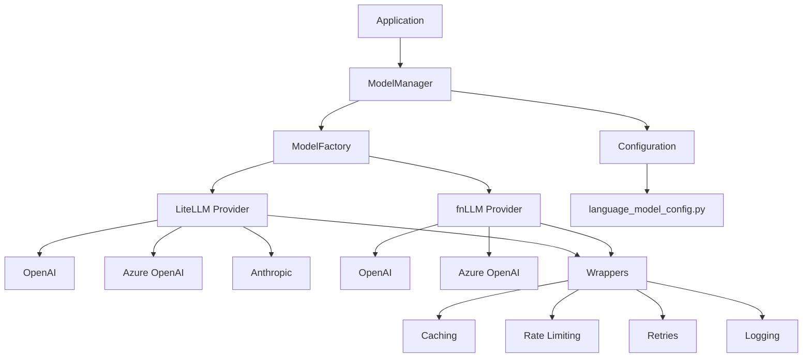
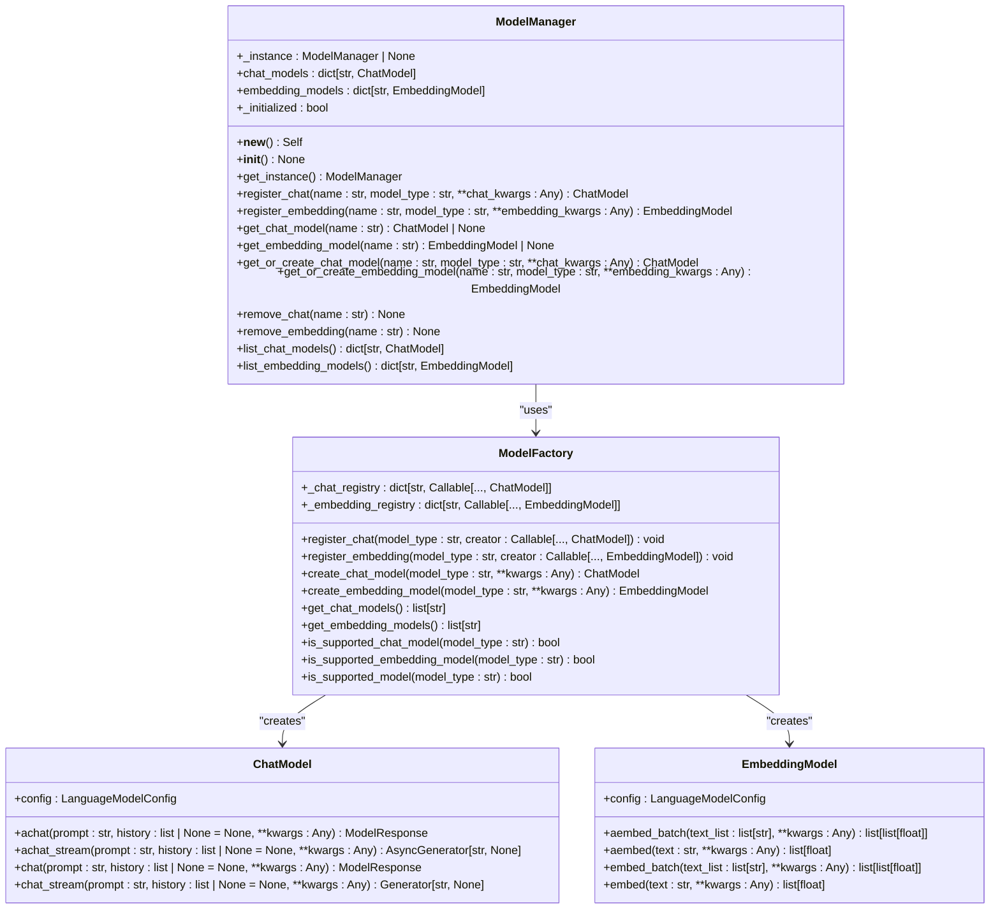
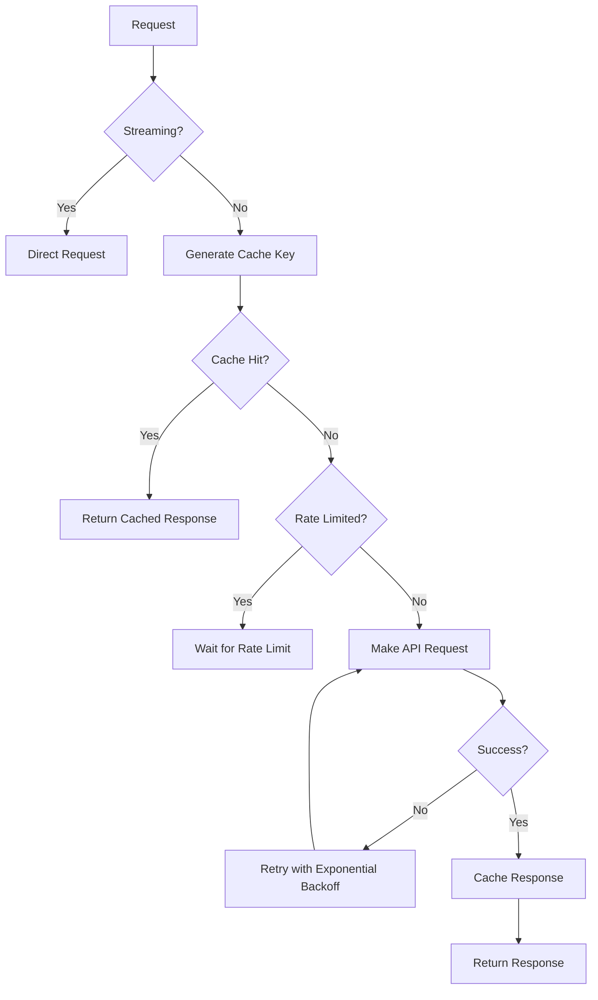
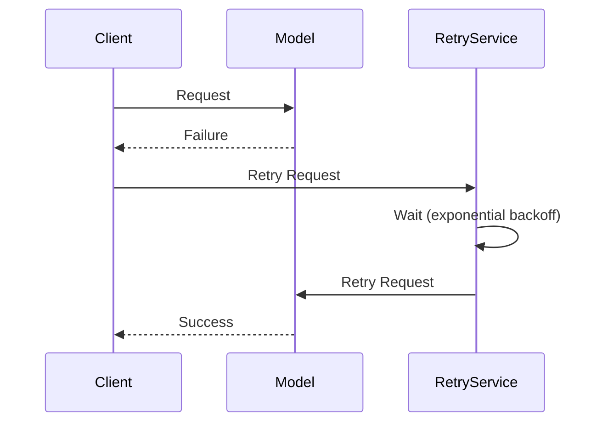

# Language Model Providers

<cite>
**Referenced Files in This Document**   
- [graphrag/language_model/factory.py](file://graphrag/language_model/factory.py)
- [graphrag/language_model/manager.py](file://graphrag/language_model/manager.py)
- [graphrag/language_model/protocol/base.py](file://graphrag/language_model/protocol/base.py)
- [graphrag/language_model/providers/litellm/chat_model.py](file://graphrag/language_model/providers/litellm/chat_model.py)
- [graphrag/language_model/providers/litellm/embedding_model.py](file://graphrag/language_model/providers/litellm/embedding_model.py)
- [graphrag/language_model/providers/litellm/request_wrappers/with_cache.py](file://graphrag/language_model/providers/litellm/request_wrappers/with_cache.py)
- [graphrag/language_model/providers/litellm/request_wrappers/with_rate_limiter.py](file://graphrag/language_model/providers/litellm/request_wrappers/with_rate_limiter.py)
- [graphrag/language_model/providers/litellm/request_wrappers/with_retries.py](file://graphrag/language_model/providers/litellm/request_wrappers/with_retries.py)
- [graphrag/language_model/providers/litellm/services/retry/exponential_retry.py](file://graphrag/language_model/providers/litellm/services/retry/exponential_retry.py)
- [graphrag/language_model/providers/fnllm/models.py](file://graphrag/language_model/providers/fnllm/models.py)
- [graphrag/config/models/language_model_config.py](file://graphrag/config/models/language_model_config.py)
- [graphrag/tokenizer/litellm_tokenizer.py](file://graphrag/tokenizer/litellm_tokenizer.py)
- [graphrag/config/enums.py](file://graphrag/config/enums.py)
</cite>

## Table of Contents
1. [Introduction](#introduction)
2. [Architecture Overview](#architecture-overview)
3. [Core Components](#core-components)
4. [Factory-Based Instantiation](#factory-based-instantiation)
5. [Request Flow and Wrappers](#request-flow-and-wrappers)
6. [Configuration and Security](#configuration-and-security)
7. [Advanced Features](#advanced-features)
8. [Error Resilience and Retry Mechanisms](#error-resilience-and-retry-mechanisms)
9. [Token Handling](#token-handling)
10. [Extending the System](#extending-the-system)
11. [Troubleshooting Guide](#troubleshooting-guide)

## Introduction

The GraphRAG system provides a flexible and robust framework for interacting with various Large Language Model (LLM) APIs through abstraction layers. This documentation explains how GraphRAG uses `LiteLLM` and `fnLLM` as abstraction layers to interface uniformly with different LLM providers such as OpenAI, Azure OpenAI, and Anthropic. The system is designed with factory-based instantiation, comprehensive error handling, rate limiting, caching, and other resilience mechanisms to ensure reliable and efficient LLM operations.

**Section sources**
- [graphrag/language_model/factory.py](file://graphrag/language_model/factory.py)
- [graphrag/language_model/manager.py](file://graphrag/language_model/manager.py)

## Architecture Overview

The Language Model Providers system in GraphRAG follows a layered architecture that separates concerns between configuration, abstraction, and execution. At its core, the system uses two main abstraction layers: `LiteLLM` and `fnLLM`, which provide uniform interfaces to various LLM APIs. The architecture includes factory patterns for model instantiation, a singleton manager for model instances, and a series of wrappers that add functionality like caching, rate limiting, and retry logic.

**Diagram sources **
- [graphrag/language_model/manager.py](file://graphrag/language_model/manager.py)
- [graphrag/language_model/factory.py](file://graphrag/language_model/factory.py)
- [graphrag/language_model/providers/litellm/chat_model.py](file://graphrag/language_model/providers/litellm/chat_model.py)
- [graphrag/language_model/providers/fnllm/models.py](file://graphrag/language_model/providers/fnllm/models.py)
- [graphrag/config/models/language_model_config.py](file://graphrag/config/models/language_model_config.py)

## Core Components

The Language Model Providers system consists of several core components that work together to provide a seamless interface to LLM APIs. The main components include the ModelFactory, ModelManager, and the protocol definitions for chat and embedding models. These components are designed to be extensible and support various LLM providers through a consistent interface.

The ModelFactory is responsible for creating instances of chat and embedding models based on the specified model type. It maintains registries for different model types and provides methods to create model instances. The ModelManager acts as a singleton that manages the lifecycle of model instances, allowing for registration, retrieval, and removal of models.

**Diagram sources **
- [graphrag/language_model/factory.py](file://graphrag/language_model/factory.py#L23-L124)
- [graphrag/language_model/manager.py](file://graphrag/language_model/manager.py#L22-L154)
- [graphrag/language_model/protocol/base.py](file://graphrag/language_model/protocol/base.py#L17-L167)

## Factory-Based Instantiation

The ModelFactory class implements the factory pattern to create instances of chat and embedding models. It maintains two registries: one for chat models and one for embedding models. These registries map model type strings to callable creators that can instantiate the corresponding model classes.

The factory provides methods to register new model types and create instances of registered models. When creating a model instance, the factory looks up the model type in the appropriate registry and calls the associated creator function with the provided keyword arguments. This design allows for easy extension of the system with new model types and providers.

The factory is pre-configured with default implementations for various model types, including OpenAI, Azure OpenAI, and generic LiteLLM models. These defaults are registered during module initialization, making them immediately available for use.

**Section sources**
- [graphrag/language_model/factory.py](file://graphrag/language_model/factory.py#L23-L124)

## Request Flow and Wrappers

The request flow in the Language Model Providers system is designed to be modular and extensible through a series of wrappers that add functionality to the base LLM requests. These wrappers are applied in a specific order to ensure consistent behavior and proper error handling.

The primary wrappers include:
- **Caching**: Stores responses to avoid redundant API calls
- **Rate Limiting**: Controls the rate of requests to prevent exceeding API limits
- **Retries**: Automatically retries failed requests with exponential backoff
- **Logging**: Records request and response information for debugging and monitoring

These wrappers are composed together to create a robust request pipeline that handles common issues like network failures, rate limits, and temporary service outages.

**Diagram sources **
- [graphrag/language_model/providers/litellm/chat_model.py](file://graphrag/language_model/providers/litellm/chat_model.py#L48-L187)
- [graphrag/language_model/providers/litellm/request_wrappers/with_cache.py](file://graphrag/language_model/providers/litellm/request_wrappers/with_cache.py#L22-L108)
- [graphrag/language_model/providers/litellm/request_wrappers/with_rate_limiter.py](file://graphrag/language_model/providers/litellm/request_wrappers/with_rate_limiter.py#L22-L98)
- [graphrag/language_model/providers/litellm/request_wrappers/with_retries.py](file://graphrag/language_model/providers/litellm/request_wrappers/with_retries.py#L20-L55)

## Configuration and Security

The Language Model Providers system uses a comprehensive configuration model to specify all parameters needed to connect to and use LLM APIs. The LanguageModelConfig class defines all configurable options, including API keys, endpoints, model names, and various operational parameters.

Security is a primary concern in the configuration system, with several features designed to protect sensitive information:
- API keys are validated and checked for proper usage
- Azure Managed Identity authentication is supported for secure access without API keys
- Configuration validation ensures that required parameters are present and correct
- Sensitive information is handled with care throughout the system

Configuration can be provided through environment variables, configuration files, or direct instantiation, allowing for flexible deployment in different environments.

**Section sources**
- [graphrag/config/models/language_model_config.py](file://graphrag/config/models/language_model_config.py#L25-L404)
- [graphrag/config/enums.py](file://graphrag/config/enums.py#L83-L110)

## Advanced Features

The Language Model Providers system supports several advanced features that enhance its functionality and flexibility:

### Streaming Responses
The system supports streaming responses from LLM APIs, allowing for real-time processing of generated content. Both synchronous and asynchronous streaming interfaces are provided, enabling applications to handle large responses efficiently without waiting for completion.

### Custom Headers
Custom headers can be included in API requests, allowing for additional metadata or authentication information to be sent with each request. This feature is particularly useful for providers that require specific headers for authentication or routing.

### Fallback Models
The system supports configuration of fallback models that can be used when the primary model is unavailable or fails. This feature enhances reliability by providing alternative options when the preferred model cannot be accessed.

### JSON Mode
For models that support it, the system can request responses in JSON format, ensuring structured output that can be easily parsed and processed by applications.

**Section sources**
- [graphrag/language_model/providers/litellm/chat_model.py](file://graphrag/language_model/providers/litellm/chat_model.py#L211-L415)
- [graphrag/language_model/providers/litellm/embedding_model.py](file://graphrag/language_model/providers/litellm/embedding_model.py#L175-L281)

## Error Resilience and Retry Mechanisms

The system implements comprehensive error resilience mechanisms to handle the various issues that can occur when interacting with LLM APIs. The primary mechanism is the retry system, which automatically retries failed requests with exponential backoff.

The retry system is configurable through the LanguageModelConfig class, allowing users to specify:
- The retry strategy to use (e.g., exponential backoff)
- The maximum number of retries
- The maximum wait time between retries

The exponential retry strategy implements a backoff algorithm that increases the delay between retries exponentially, with optional jitter to prevent thundering herd problems. This approach is effective for handling transient failures like network issues or temporary service outages.

**Diagram sources **
- [graphrag/language_model/providers/litellm/request_wrappers/with_retries.py](file://graphrag/language_model/providers/litellm/request_wrappers/with_retries.py#L20-L55)
- [graphrag/language_model/providers/litellm/services/retry/exponential_retry.py](file://graphrag/language_model/providers/litellm/services/retry/exponential_retry.py#L18-L84)

## Token Handling

Token handling in the Language Model Providers system is managed through the litellm_tokenizer module, which provides a consistent interface for tokenizing text across different LLM providers. The LitellmTokenizer class wraps the LiteLLM tokenization functionality, allowing for accurate token counting and text encoding/decoding.

The tokenizer is used in several contexts:
- Calculating token counts for rate limiting purposes
- Determining if text exceeds model limits
- Preparing text for input to LLMs
- Processing model outputs

The system automatically selects the appropriate tokenizer based on the configured model, ensuring accurate token counts that match the provider's expectations.

**Section sources**
- [graphrag/tokenizer/litellm_tokenizer.py](file://graphrag/tokenizer/litellm_tokenizer.py#L11-L48)
- [graphrag/language_model/providers/litellm/request_wrappers/with_rate_limiter.py](file://graphrag/language_model/providers/litellm/request_wrappers/with_rate_limiter.py#L8-L98)

## Extending the System

The Language Model Providers system is designed to be extensible, allowing users to add support for new LLM providers by implementing the base protocol. To add a new provider, users need to:

1. Create a new model class that implements the ChatModel or EmbeddingModel protocol
2. Register the new model type with the ModelFactory
3. Implement any necessary configuration and authentication logic

The protocol-based design ensures that new providers integrate seamlessly with the existing system, benefiting from all the built-in features like caching, rate limiting, and retry logic without additional implementation effort.

**Section sources**
- [graphrag/language_model/protocol/base.py](file://graphrag/language_model/protocol/base.py#L17-L167)
- [graphrag/language_model/factory.py](file://graphrag/language_model/factory.py#L23-L124)

## Troubleshooting Guide

This section provides guidance for troubleshooting common issues encountered when using the Language Model Providers system.

### Rate Limits
When encountering rate limit errors, consider the following:
- Check your API usage against the provider's rate limits
- Adjust the requests_per_minute and tokens_per_minute settings in the configuration
- Implement or adjust rate limiting strategy
- Consider upgrading your API plan for higher limits

### Model Not Found Errors
If you receive model not found errors:
- Verify the model name is correct and supported by the provider
- Check that the deployment name is correctly specified for Azure models
- Ensure the model provider is correctly configured
- Validate API key and authentication settings

### Malformed Responses
For malformed response issues:
- Check that the response format matches expectations
- Verify JSON mode is properly configured if using structured output
- Inspect the raw response for errors or unexpected content
- Ensure proper error handling in your application code

### Authentication Issues
For authentication problems:
- Verify API keys are correctly set and have appropriate permissions
- Check that Azure Managed Identity is properly configured if used
- Ensure the audience and scope are correctly specified
- Validate that the API base URL is correct for your region and provider

**Section sources**
- [graphrag/config/models/language_model_config.py](file://graphrag/config/models/language_model_config.py#L25-L404)
- [graphrag/language_model/providers/litellm/chat_model.py](file://graphrag/language_model/providers/litellm/chat_model.py#L48-L187)
- [graphrag/language_model/providers/fnllm/models.py](file://graphrag/language_model/providers/fnllm/models.py#L42-L444)