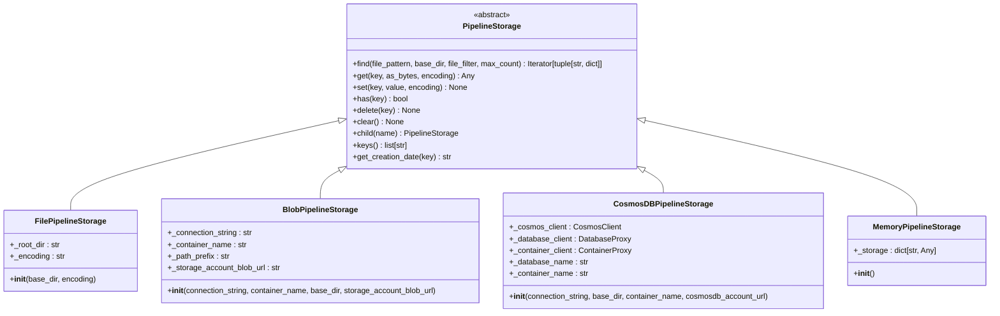
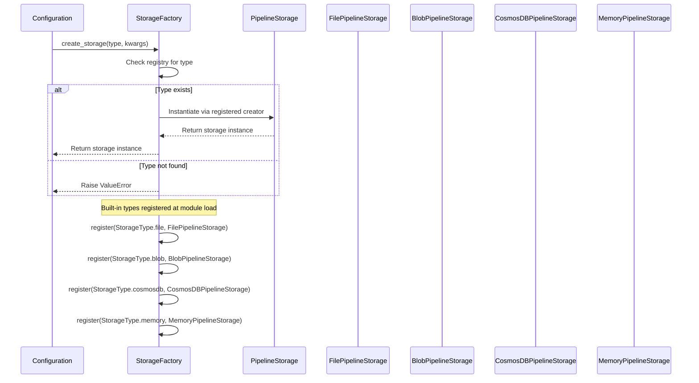
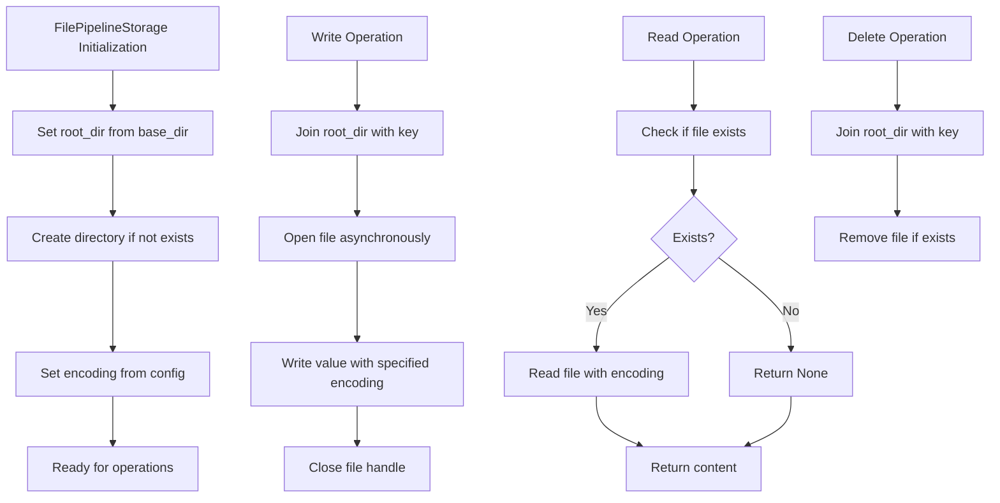
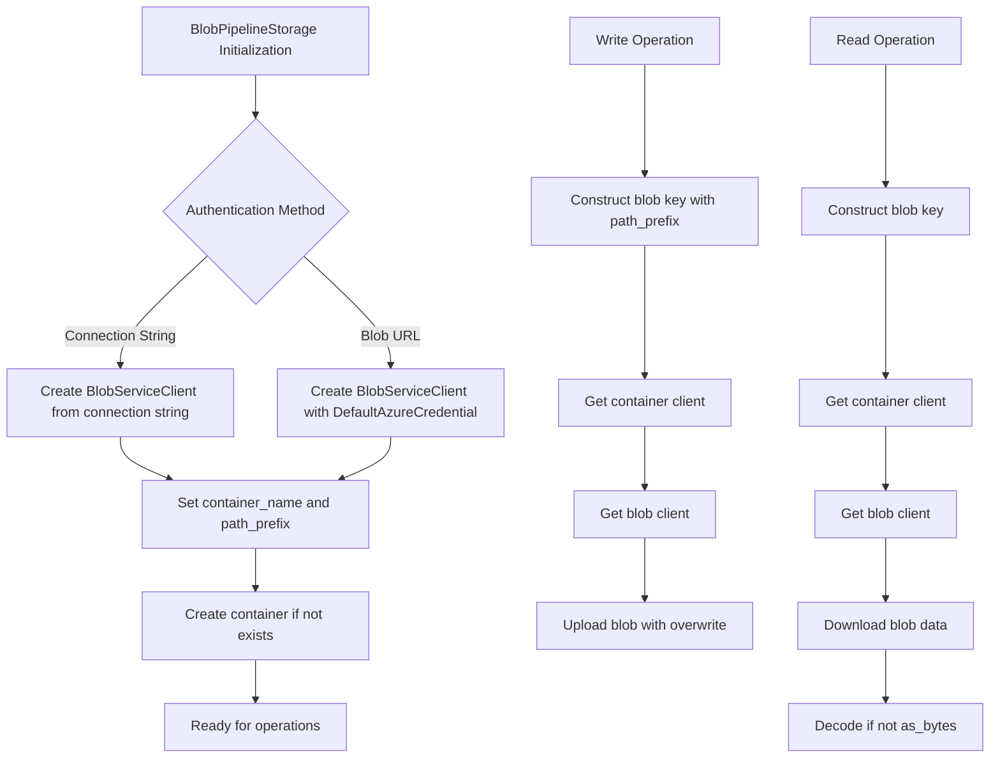
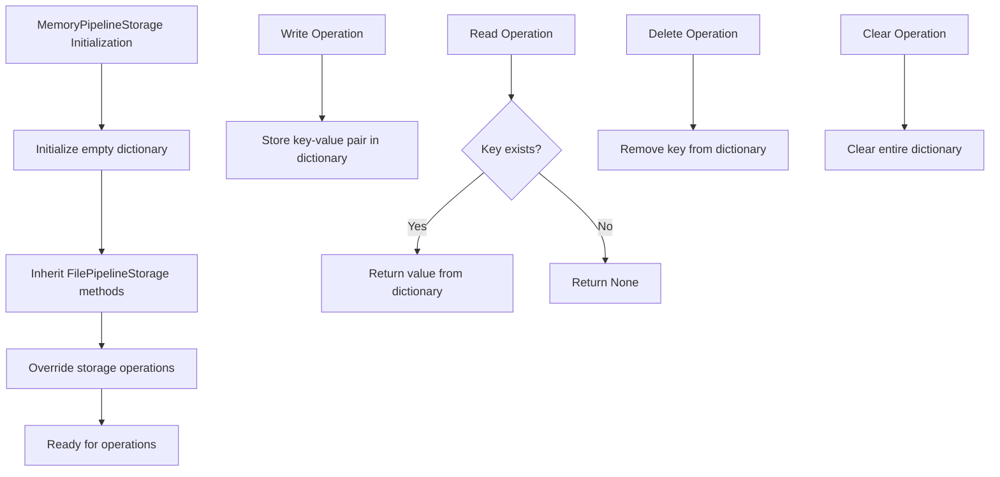
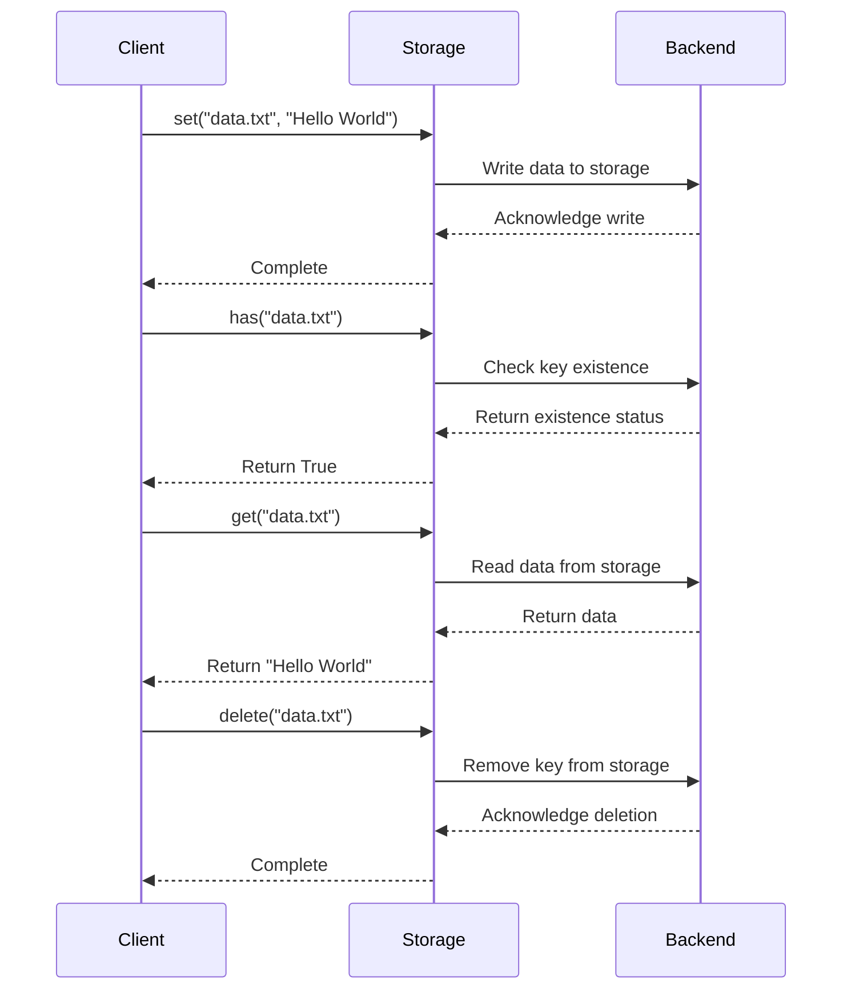

# Storage System

<cite>
**Referenced Files in This Document**   
- [pipeline_storage.py](file://graphrag/storage/pipeline_storage.py)
- [factory.py](file://graphrag/storage/factory.py)
- [file_pipeline_storage.py](file://graphrag/storage/file_pipeline_storage.py)
- [blob_pipeline_storage.py](file://graphrag/storage/blob_pipeline_storage.py)
- [cosmosdb_pipeline_storage.py](file://graphrag/storage/cosmosdb_pipeline_storage.py)
- [memory_pipeline_storage.py](file://graphrag/storage/memory_pipeline_storage.py)
- [storage_config.py](file://graphrag/config/models/storage_config.py)
- [test_factory.py](file://tests/integration/storage/test_factory.py)
- [test_file_pipeline_storage.py](file://tests/integration/storage/test_file_pipeline_storage.py)
- [test_blob_pipeline_storage.py](file://tests/integration/storage/test_blob_pipeline_storage.py)
- [test_cosmosdb_storage.py](file://tests/integration/storage/test_cosmosdb_storage.py)
- [storage.py](file://graphrag/utils/storage.py)
</cite>

## Table of Contents
1. [Introduction](#introduction)
2. [Storage Abstraction Layer](#storage-abstraction-layer)
3. [Storage Factory Pattern](#storage-factory-pattern)
4. [Storage Providers](#storage-providers)
   - [FilePipelineStorage](#filepipelinestorage)
   - [BlobPipelineStorage](#blobpipelinestorage)
   - [CosmosDBPipelineStorage](#cosmosdbpipelinestorage)
   - [MemoryPipelineStorage](#memorypipelinestorage)
5. [Interface Methods](#interface-methods)
6. [Configuration Examples](#configuration-examples)
7. [Use Cases and Scenarios](#use-cases-and-scenarios)
8. [Authentication Mechanisms](#authentication-mechanisms)
9. [Error Handling](#error-handling)
10. [Troubleshooting Guide](#troubleshooting-guide)

## Introduction

The GraphRAG storage system provides a flexible and extensible abstraction layer for managing data storage operations across multiple backend systems. This document details the architecture, implementation, and usage patterns of the storage system, focusing on the `PipelineStorage` base class, factory pattern, and various storage providers. The system supports multiple storage backends including local file system, Azure Blob Storage, Azure Cosmos DB, and in-memory storage, allowing users to choose the appropriate storage solution based on their requirements for persistence, scalability, and performance.

**Section sources**
- [pipeline_storage.py](file://graphrag/storage/pipeline_storage.py#L1-L100)

## Storage Abstraction Layer

The GraphRAG storage system is built around the `PipelineStorage` abstract base class, which defines a consistent interface for all storage operations. This abstraction allows the system to work with different storage backends without requiring changes to the core application logic. The `PipelineStorage` class implements the Abstract Base Class (ABC) pattern, ensuring that all concrete storage implementations provide the required methods.

The interface includes methods for basic CRUD operations (`get`, `set`, `has`, `delete`), file discovery (`find`), container management (`clear`), and metadata retrieval (`get_creation_date`). All I/O operations are implemented asynchronously to support non-blocking operations, which is essential for maintaining performance in data-intensive applications.



**Diagram sources**
- [pipeline_storage.py](file://graphrag/storage/pipeline_storage.py#L13-L94)
- [file_pipeline_storage.py](file://graphrag/storage/file_pipeline_storage.py#L27-L172)
- [blob_pipeline_storage.py](file://graphrag/storage/blob_pipeline_storage.py#L23-L366)
- [cosmosdb_pipeline_storage.py](file://graphrag/storage/cosmosdb_pipeline_storage.py#L29-L364)
- [memory_pipeline_storage.py](file://graphrag/storage/memory_pipeline_storage.py#L14-L79)

**Section sources**
- [pipeline_storage.py](file://graphrag/storage/pipeline_storage.py#L13-L94)

## Storage Factory Pattern

The storage system implements a factory pattern through the `StorageFactory` class, which provides a centralized mechanism for creating storage instances. This pattern enables dynamic instantiation of storage providers based on configuration, supporting both built-in and custom storage implementations.

The factory maintains a registry of storage types and their corresponding creators, allowing for easy extension of the system with new storage backends. The `register` method allows users to add custom storage implementations, while the `create_storage` method instantiates storage objects based on the specified type and configuration parameters.



**Diagram sources**
- [factory.py](file://graphrag/storage/factory.py#L22-L84)
- [test_factory.py](file://tests/integration/storage/test_factory.py#L65-L88)

**Section sources**
- [factory.py](file://graphrag/storage/factory.py#L22-L84)

## Storage Providers

### FilePipelineStorage

The `FilePipelineStorage` class provides local file system storage capabilities, making it ideal for development, testing, and scenarios where data persistence is required without cloud dependencies. It implements the `PipelineStorage` interface using Python's `aiofiles` library for asynchronous file operations.

Key features include:
- Support for hierarchical directory structures through the `child` method
- Automatic directory creation when initializing storage
- Cross-platform path handling using `pathlib.Path`
- File filtering and pattern matching in the `find` method
- Creation date retrieval with local timezone formatting

The storage root is defined by the `base_dir` parameter, and all operations are relative to this directory. The implementation handles both text and binary data through the `as_bytes` parameter in the `get` method.



**Diagram sources**
- [file_pipeline_storage.py](file://graphrag/storage/file_pipeline_storage.py#L27-L172)
- [test_file_pipeline_storage.py](file://tests/integration/storage/test_file_pipeline_storage.py#L17-L66)

**Section sources**
- [file_pipeline_storage.py](file://graphrag/storage/file_pipeline_storage.py#L27-L172)

### BlobPipelineStorage

The `BlobPipelineStorage` class provides integration with Azure Blob Storage, enabling scalable cloud-based storage for production environments. It uses the Azure SDK for Python to interact with blob containers, supporting both connection string and managed identity authentication methods.

Key features include:
- Support for Azure Blob Storage containers and path prefixes
- Container creation and management
- Integration with Azure Identity for managed identity authentication
- ABFS (Azure Blob File System) URL generation for direct access
- Specialized methods for DataFrame storage in JSON and Parquet formats

The implementation requires either a connection string or storage account blob URL for authentication. When using managed identities, the `DefaultAzureCredential` class handles authentication automatically in Azure environments. The storage organizes blobs within containers, with optional path prefixes to create logical hierarchies.



**Diagram sources**
- [blob_pipeline_storage.py](file://graphrag/storage/blob_pipeline_storage.py#L23-L366)
- [test_blob_pipeline_storage.py](file://tests/integration/storage/test_blob_pipeline_storage.py#L14-L116)

**Section sources**
- [blob_pipeline_storage.py](file://graphrag/storage/blob_pipeline_storage.py#L23-L366)

### CosmosDBPipelineStorage

The `CosmosDBPipelineStorage` class provides NoSQL document storage capabilities using Azure Cosmos DB, offering high availability, low latency, and automatic indexing. This storage provider is optimized for structured data and complex queries, making it suitable for production scenarios with demanding performance requirements.

Key features include:
- Document-based storage with JSON serialization
- Automatic database and container creation
- Partitioning strategy using document ID
- Support for complex queries with regex matching
- Integration with Azure Identity for managed identity authentication
- Special handling for Parquet files by deconstructing them into individual documents

The implementation stores data as JSON documents in Cosmos DB containers, with document IDs corresponding to storage keys. For Parquet files, the implementation deconstructs the file into individual documents, prefixing each document ID with the original filename. This approach enables efficient querying and retrieval of individual records without loading entire files.

```mermaid
flowchart TD
A[CosmosDBPipelineStorage Initialization] --> B{Authentication Method}
B --> |Connection String| C[Create CosmosClient from connection string]
B --> |Account URL| D[Create CosmosClient with DefaultAzureCredential]
C --> E[Set database_name and container_name]
D --> E
E --> F[Create database if not exists]
F --> G[Create container if not exists]
G --> H[Ready for operations]
I[Write Operation] --> J{Value Type}
J --> |Bytes (Parquet)| K[Read Parquet into DataFrame]
J --> |String (JSON)| L[Parse JSON into document]
K --> M[Convert DataFrame to JSON records]
M --> N[Create documents with prefixed IDs]
N --> O[Insert documents into container]
L --> P[Create document with key as ID]
P --> O
Q[Read Operation] --> R{as_bytes?}
R --> |Yes| S[Query documents with key prefix]
R --> |No| T[Read single document by key]
S --> U[Reconstruct DataFrame from documents]
U --> V[Convert to Parquet bytes]
T --> W[Return document body as JSON]
```

**Diagram sources**
- [cosmosdb_pipeline_storage.py](file://graphrag/storage/cosmosdb_pipeline_storage.py#L29-L364)
- [test_cosmosdb_storage.py](file://tests/integration/storage/test_cosmosdb_storage.py#L24-L134)

**Section sources**
- [cosmosdb_pipeline_storage.py](file://graphrag/storage/cosmosdb_pipeline_storage.py#L29-L364)

### MemoryPipelineStorage

The `MemoryPipelineStorage` class provides ephemeral in-memory storage, making it ideal for testing, temporary operations, and scenarios where data persistence is not required. It inherits from `FilePipelineStorage` but overrides the storage mechanism to use a Python dictionary instead of the file system.

Key features include:
- High-performance operations with O(1) access time
- Automatic inheritance of file storage interface
- Support for all standard storage operations
- Isolated storage instances for concurrent operations
- Minimal resource usage for temporary data

The implementation uses a dictionary (`_storage`) to store key-value pairs, with all operations performed in memory. This makes it significantly faster than disk-based storage but unsuitable for large datasets or persistent storage requirements. The `child` method creates independent storage instances, enabling isolated operations within the same process.



**Diagram sources**
- [memory_pipeline_storage.py](file://graphrag/storage/memory_pipeline_storage.py#L14-L79)
- [test_factory.py](file://tests/integration/storage/test_factory.py#L59-L63)

**Section sources**
- [memory_pipeline_storage.py](file://graphrag/storage/memory_pipeline_storage.py#L14-L79)

## Interface Methods

The `PipelineStorage` interface defines a comprehensive set of methods for storage operations, all implemented asynchronously to support non-blocking I/O. These methods provide a consistent API across all storage providers, enabling seamless switching between different backends.

### Core Methods

- **get(key, as_bytes, encoding)**: Retrieves the value associated with the specified key. The `as_bytes` parameter determines whether the data is returned as bytes or decoded text, while `encoding` specifies the text encoding (default: utf-8).

- **set(key, value, encoding)**: Stores the specified value under the given key. The method handles both text and binary data, with encoding applied for text data.

- **has(key)**: Checks whether a key exists in storage, returning a boolean result.

- **delete(key)**: Removes the specified key and its associated value from storage.

- **clear()**: Removes all data from storage. The behavior varies by implementation: file storage removes all files in the root directory, while cloud storage may delete entire containers or databases.

### Additional Methods

- **find(file_pattern, base_dir, file_filter, max_count)**: Searches for files matching the specified pattern and filters. Returns an iterator of tuples containing matching file paths and their regex groups.

- **child(name)**: Creates a child storage instance with a modified path or namespace, enabling hierarchical organization of data.

- **keys()**: Returns a list of all keys in storage. Note that this method is not implemented for blob and Cosmos DB storage due to scalability concerns.

- **get_creation_date(key)**: Retrieves the creation date of the specified key in a formatted string with local timezone information.



**Diagram sources**
- [pipeline_storage.py](file://graphrag/storage/pipeline_storage.py#L13-L94)
- [file_pipeline_storage.py](file://graphrag/storage/file_pipeline_storage.py#L87-L147)
- [blob_pipeline_storage.py](file://graphrag/storage/blob_pipeline_storage.py#L178-L270)
- [cosmosdb_pipeline_storage.py](file://graphrag/storage/cosmosdb_pipeline_storage.py#L205-L319)
- [memory_pipeline_storage.py](file://graphrag/storage/memory_pipeline_storage.py#L24-L67)

**Section sources**
- [pipeline_storage.py](file://graphrag/storage/pipeline_storage.py#L13-L94)

## Configuration Examples

The storage system can be configured through YAML files or programmatically using the `StorageConfig` class. The configuration specifies the storage type and provider-specific parameters.

### YAML Configuration

```yaml
storage:
  type: file
  base_dir: "./output"
  encoding: "utf-8"
```

```yaml
storage:
  type: blob
  connection_string: "DefaultEndpointsProtocol=https;AccountName=mystorage;AccountKey=mykey;EndpointSuffix=core.windows.net"
  container_name: "graphrag-data"
  base_dir: "pipeline-output"
  storage_account_blob_url: "https://mystorage.blob.core.windows.net"
```

```yaml
storage:
  type: cosmosdb
  connection_string: "AccountEndpoint=https://mycosmos.documents.azure.com:443/;AccountKey=mykey==;"
  base_dir: "graphrag-database"
  container_name: "pipeline-container"
  encoding: "utf-8"
```

```yaml
storage:
  type: memory
  # No additional configuration required for memory storage
```

### Programmatic Configuration

```python
from graphrag.config.models.storage_config import StorageConfig
from graphrag.storage.factory import StorageFactory

# File storage configuration
file_config = StorageConfig(
    type="file",
    base_dir="./output",
    encoding="utf-8"
)
file_storage = StorageFactory.create_storage(file_config.type, file_config.model_dump())

# Blob storage configuration
blob_config = StorageConfig(
    type="blob",
    connection_string="your_connection_string",
    container_name="your_container",
    base_dir="pipeline-output"
)
blob_storage = StorageFactory.create_storage(blob_config.type, blob_config.model_dump())
```

**Section sources**
- [storage_config.py](file://graphrag/config/models/storage_config.py#L14-L53)
- [breaking-changes.md](file://breaking-changes.md#L89-L96)

## Use Cases and Scenarios

### Development and Testing

For development and testing scenarios, `FilePipelineStorage` and `MemoryPipelineStorage` are recommended:

- **FilePipelineStorage**: Ideal for development as it provides persistent storage that can be easily inspected and debugged. The local file system allows developers to directly examine stored data and verify pipeline outputs.

- **MemoryPipelineStorage**: Perfect for unit testing and temporary operations where data persistence is not required. Its high performance makes it suitable for test suites that require rapid setup and teardown of storage state.

### Production Scenarios

For production deployments, cloud-based storage providers offer better scalability and reliability:

- **BlobPipelineStorage**: Recommended for large-scale data storage with moderate access patterns. Azure Blob Storage provides durable, highly available storage with cost-effective pricing for large datasets.

- **CosmosDBPipelineStorage**: Ideal for applications requiring low-latency access to structured data and complex querying capabilities. Cosmos DB's global distribution and automatic indexing make it suitable for high-performance production environments.

### Scalability Trade-offs

Each storage provider has different scalability characteristics:

- **FileStorage**: Limited by local disk capacity and I/O performance. Not suitable for distributed systems or high-concurrency scenarios.

- **MemoryStorage**: Limited by available RAM. Best for small datasets and temporary operations.

- **BlobStorage**: Highly scalable with virtually unlimited capacity. Performance scales with the number of blobs and access patterns.

- **CosmosDBStorage**: Automatically scales throughput and storage. Performance is consistent regardless of data volume due to Cosmos DB's partitioning and indexing.

**Section sources**
- [storage_config.py](file://graphrag/config/models/storage_config.py#L14-L53)
- [factory.py](file://graphrag/storage/factory.py#L79-L84)

## Authentication Mechanisms

The storage system supports multiple authentication mechanisms for cloud providers:

### Connection Strings

Both `BlobPipelineStorage` and `CosmosDBPipelineStorage` support connection string authentication, which includes all necessary credentials in a single string:

```python
# Azure Blob Storage connection string
connection_string = "DefaultEndpointsProtocol=https;AccountName=mystorage;AccountKey=mykey;EndpointSuffix=core.windows.net"

# Cosmos DB connection string
connection_string = "AccountEndpoint=https://mycosmos.documents.azure.com:443/;AccountKey=mykey==;"
```

### Managed Identities

For enhanced security in Azure environments, both providers support managed identity authentication using `DefaultAzureCredential`:

```python
# Blob storage with managed identity
storage = BlobPipelineStorage(
    storage_account_blob_url="https://mystorage.blob.core.windows.net",
    container_name="mycontainer"
)

# Cosmos DB with managed identity
storage = CosmosDBPipelineStorage(
    cosmosdb_account_url="https://mycosmos.documents.azure.com:443/",
    base_dir="mydatabase",
    container_name="mycontainer"
)
```

The `DefaultAzureCredential` class automatically handles authentication in various Azure environments, including Azure VMs, App Services, and local development with Azure CLI login.

**Section sources**
- [blob_pipeline_storage.py](file://graphrag/storage/blob_pipeline_storage.py#L34-L63)
- [cosmosdb_pipeline_storage.py](file://graphrag/storage/cosmosdb_pipeline_storage.py#L56-L67)

## Error Handling

The storage system implements comprehensive error handling to ensure robust operation in various scenarios:

### Exception Handling

Each storage provider wraps external API calls in try-except blocks to handle transient and permanent errors:

- **FileStorage**: Handles file system errors such as permission denied, disk full, and file not found.
- **BlobStorage**: Handles network timeouts, authentication failures, and service unavailability.
- **CosmosDBStorage**: Handles request rate limiting, partition key errors, and query failures.
- **MemoryStorage**: Minimal error handling required as operations are in-memory.

### Retry Logic

While the storage layer itself doesn't implement retry logic, it integrates with higher-level retry mechanisms in the application. For example, when using `DefaultAzureCredential`, authentication retries are handled automatically.

### Error Logging

All storage providers use Python's logging module to record errors and warnings:

```python
import logging
logger = logging.getLogger(__name__)

try:
    # Storage operation
    result = await storage.get("key")
except Exception as e:
    logger.warning("Error getting key %s: %s", key, str(e))
    return None
```

The logging provides visibility into storage operations and helps diagnose issues in production environments.

**Section sources**
- [blob_pipeline_storage.py](file://graphrag/storage/blob_pipeline_storage.py#L170-L177)
- [cosmosdb_pipeline_storage.py](file://graphrag/storage/cosmosdb_pipeline_storage.py#L200-L204)
- [file_pipeline_storage.py](file://graphrag/storage/file_pipeline_storage.py#L92-L99)

## Troubleshooting Guide

### Permission Errors

**Symptoms**: Authentication failures, access denied errors, or inability to create containers/databases.

**Solutions**:
- Verify connection strings or account URLs are correct
- Ensure managed identities have appropriate RBAC roles assigned
- Check firewall settings for Azure resources
- Validate that storage accounts and databases exist

### Network Timeouts

**Symptoms**: Slow operations, connection timeouts, or intermittent failures.

**Solutions**:
- Check network connectivity to Azure endpoints
- Implement retry logic at the application level
- Use connection pooling where available
- Consider regional proximity between application and storage

### Data Inconsistency

**Symptoms**: Missing data, stale reads, or unexpected behavior.

**Solutions**:
- Verify that `await` is used for all async storage operations
- Check that transactions are properly handled
- Ensure proper error handling and recovery
- Validate that storage instances are not being prematurely cleared

### Configuration Issues

**Symptoms**: Storage initialization failures or unexpected provider behavior.

**Solutions**:
- Verify that storage type in configuration matches available providers
- Check that required parameters are provided for the selected storage type
- Validate YAML syntax and indentation
- Ensure environment variables are properly set for connection strings

**Section sources**
- [blob_pipeline_storage.py](file://graphrag/storage/blob_pipeline_storage.py#L41-L43)
- [cosmosdb_pipeline_storage.py](file://graphrag/storage/cosmosdb_pipeline_storage.py#L52-L54)
- [file_pipeline_storage.py](file://graphrag/storage/file_pipeline_storage.py#L38-L39)