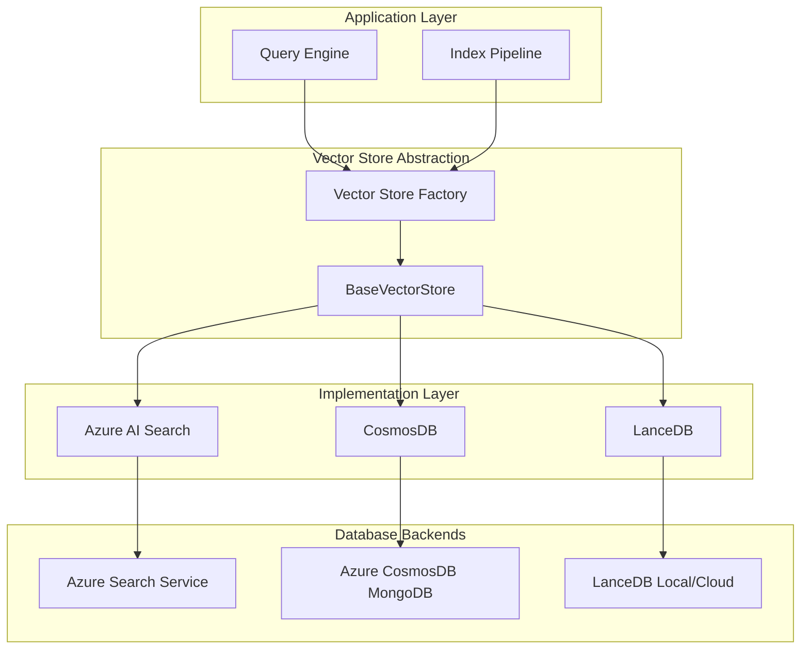
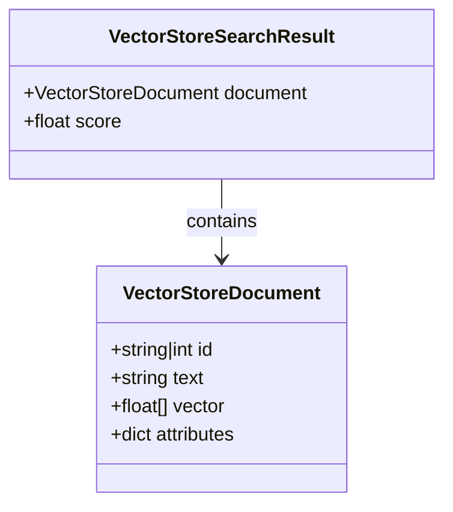
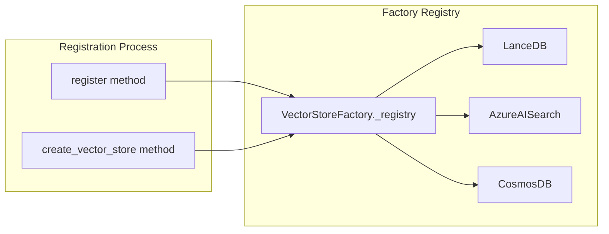
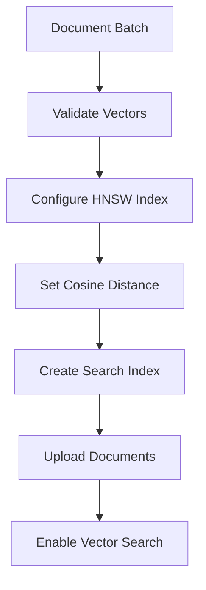
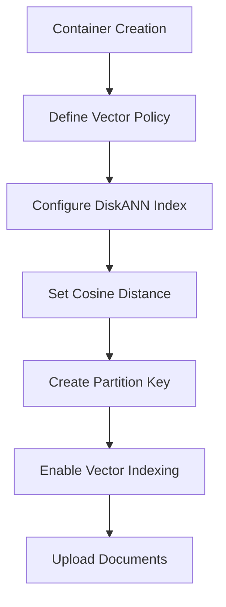
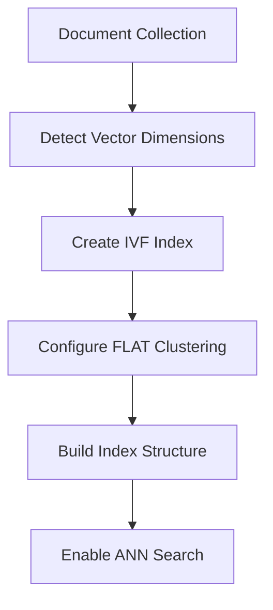
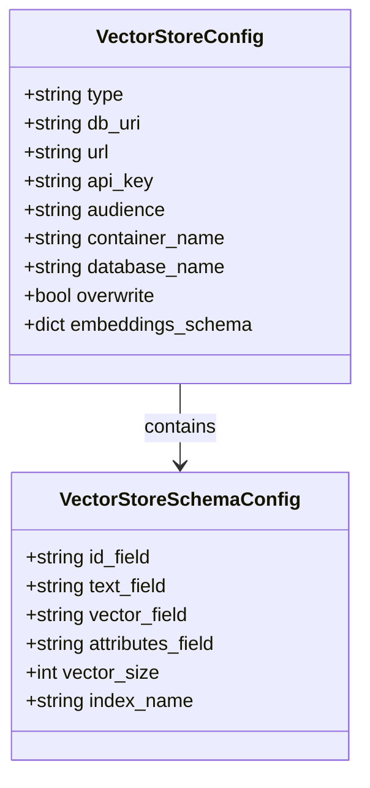
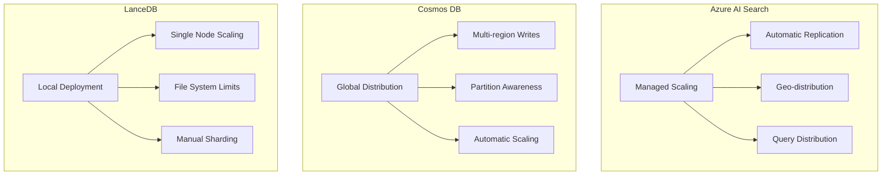
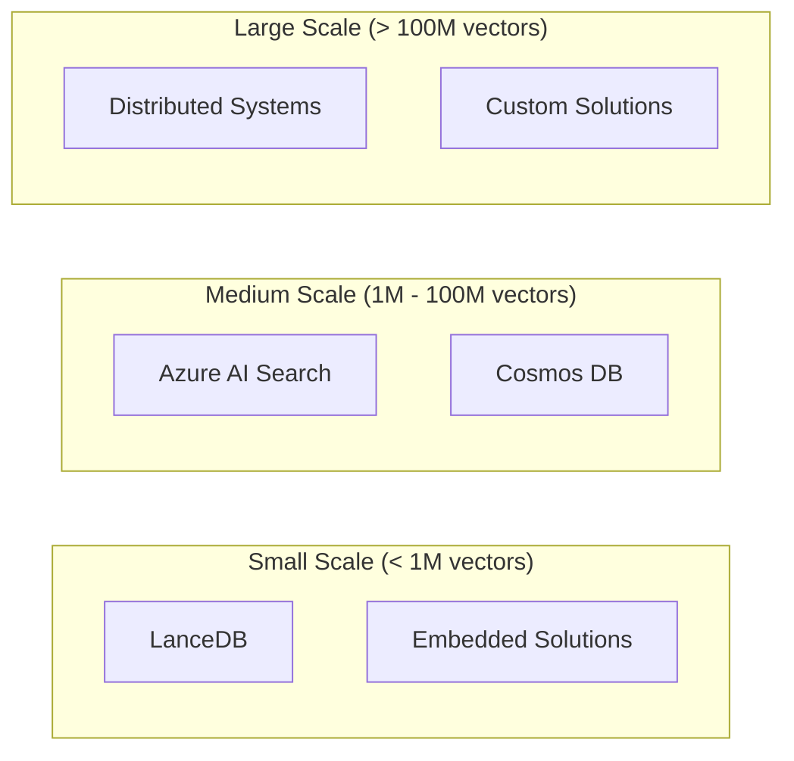
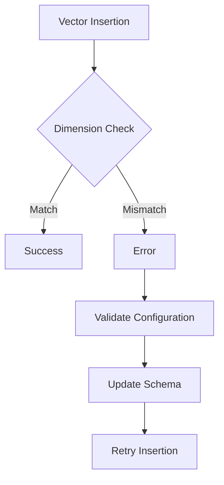

# Vector Stores

<cite>
**Referenced Files in This Document**
- [graphrag/vector_stores/__init__.py](file://graphrag/vector_stores/__init__.py)
- [graphrag/vector_stores/base.py](file://graphrag/vector_stores/base.py)
- [graphrag/vector_stores/factory.py](file://graphrag/vector_stores/factory.py)
- [graphrag/vector_stores/azure_ai_search.py](file://graphrag/vector_stores/azure_ai_search.py)
- [graphrag/vector_stores/cosmosdb.py](file://graphrag/vector_stores/cosmosdb.py)
- [graphrag/vector_stores/lancedb.py](file://graphrag/vector_stores/lancedb.py)
- [graphrag/config/models/vector_store_config.py](file://graphrag/config/models/vector_store_config.py)
- [graphrag/config/models/vector_store_schema_config.py](file://graphrag/config/models/vector_store_schema_config.py)
- [graphrag/config/enums.py](file://graphrag/config/enums.py)
- [tests/integration/vector_stores/test_azure_ai_search.py](file://tests/integration/vector_stores/test_azure_ai_search.py)
- [tests/integration/vector_stores/test_cosmosdb.py](file://tests/integration/vector_stores/test_cosmosdb.py)
- [tests/integration/vector_stores/test_lancedb.py](file://tests/integration/vector_stores/test_lancedb.py)
</cite>

## Table of Contents
1. [Introduction](#introduction)
2. [Architecture Overview](#architecture-overview)
3. [Base Vector Store Framework](#base-vector-store-framework)
4. [Factory Pattern Implementation](#factory-pattern-implementation)
5. [Supported Vector Store Implementations](#supported-vector-store-implementations)
6. [Configuration Management](#configuration-management)
7. [Performance Characteristics](#performance-characteristics)
8. [Deployment Considerations](#deployment-considerations)
9. [Common Pitfalls and Troubleshooting](#common-pitfalls-and-troubleshooting)
10. [Best Practices](#best-practices)

## Introduction

The GraphRAG vector stores integration layer provides a unified interface for semantic search over text embeddings within the GraphRAG pipeline. Vector stores serve as the backbone for knowledge retrieval, enabling efficient similarity search across document embeddings that capture semantic meaning rather than literal text matching.

Vector stores transform text embeddings into searchable indices that support approximate nearest neighbor (ANN) search, allowing the system to find semantically similar documents at scale. This capability is essential for GraphRAG's hybrid search approach, combining traditional keyword search with modern semantic search to deliver comprehensive knowledge discovery.

The vector stores framework supports multiple database backends through a pluggable architecture, enabling organizations to choose the most appropriate solution based on their infrastructure, compliance requirements, and performance needs. Whether deploying in cloud environments with managed services or on-premises with local databases, the framework provides consistent APIs while accommodating provider-specific optimizations.

## Architecture Overview

The vector stores architecture follows a layered design pattern that separates concerns between interface definition, implementation selection, and database-specific operations.



**Diagram sources**
- [graphrag/vector_stores/factory.py](file://graphrag/vector_stores/factory.py#L24-L97)
- [graphrag/vector_stores/base.py](file://graphrag/vector_stores/base.py#L39-L91)

The architecture enables seamless switching between vector store implementations while maintaining consistent behavior across different database systems. The factory pattern ensures that the correct implementation is instantiated based on configuration, while the base class defines the common interface that all implementations must support.

**Section sources**
- [graphrag/vector_stores/factory.py](file://graphrag/vector_stores/factory.py#L24-L97)
- [graphrag/vector_stores/base.py](file://graphrag/vector_stores/base.py#L39-L91)

## Base Vector Store Framework

The `BaseVectorStore` abstract class establishes the foundation for all vector store implementations, defining a comprehensive interface for document management and similarity search operations.

### Core Data Structures

The framework utilizes two primary data structures for representing vectorized content:



**Diagram sources**
- [graphrag/vector_stores/base.py](file://graphrag/vector_stores/base.py#L14-L37)

The `VectorStoreDocument` class encapsulates the fundamental unit of storage, containing:
- **ID**: Unique identifier for the document (string or integer)
- **Text**: Original textual content for retrieval and display
- **Vector**: Numerical representation of semantic meaning as floating-point array
- **Attributes**: Metadata dictionary for additional document properties

The `VectorStoreSearchResult` class pairs search results with their similarity scores, enabling ranking and filtering of search outcomes.

### Abstract Interface Methods

The base class defines seven essential methods that all implementations must provide:

| Method | Purpose | Parameters | Return Type |
|--------|---------|------------|-------------|
| `connect()` | Establish database connection | `**kwargs` | `None` |
| `load_documents()` | Bulk insert documents | `documents: List[VectorStoreDocument], overwrite: bool` | `None` |
| `similarity_search_by_vector()` | ANN search by embedding | `query_embedding: List[float], k: int` | `List[VectorStoreSearchResult]` |
| `similarity_search_by_text()` | ANN search by text query | `text: str, text_embedder: TextEmbedder, k: int` | `List[VectorStoreSearchResult]` |
| `filter_by_id()` | Build ID-based filter | `include_ids: List[str \| int]` | `Any` |
| `search_by_id()` | Exact ID lookup | `id: str` | `VectorStoreDocument` |

Each method is designed to support specific use cases within the GraphRAG pipeline, from initial indexing to interactive querying and incremental updates.

**Section sources**
- [graphrag/vector_stores/base.py](file://graphrag/vector_stores/base.py#L14-L91)

## Factory Pattern Implementation

The Vector Store Factory implements the factory pattern to enable dynamic selection and instantiation of vector store implementations based on configuration parameters.

### Registration System

The factory maintains a registry of available vector store types, automatically populated with built-in implementations:



**Diagram sources**
- [graphrag/vector_stores/factory.py](file://graphrag/vector_stores/factory.py#L33-L97)

### Dynamic Instantiation

The factory provides type-safe instantiation through the `create_vector_store` method, which validates the requested type against registered implementations and passes configuration parameters to the constructor:

```python
# Example instantiation pattern
vector_store = VectorStoreFactory.create_vector_store(
    vector_store_type="azure_ai_search",
    vector_store_schema_config=schema_config,
    url="https://search-service.search.windows.net",
    api_key="your-api-key"
)
```

The factory ensures that only supported vector store types can be instantiated, preventing runtime errors from invalid configurations.

### Extensibility

The factory pattern supports custom vector store implementations through registration:

```python
# Custom implementation registration
VectorStoreFactory.register("custom_store", CustomVectorStore)
```

This extensibility allows organizations to integrate proprietary or specialized vector store solutions while maintaining compatibility with the GraphRAG ecosystem.

**Section sources**
- [graphrag/vector_stores/factory.py](file://graphrag/vector_stores/factory.py#L24-L97)

## Supported Vector Store Implementations

GraphRAG supports three primary vector store implementations, each optimized for different deployment scenarios and requirements.

### Azure AI Search

Azure AI Search provides a fully managed vector search service with enterprise-grade reliability and scalability.

#### Setup Requirements

| Parameter | Description | Required | Default |
|-----------|-------------|----------|---------|
| `url` | Search service endpoint | Yes | None |
| `api_key` | Authentication key | No | Azure Managed Identity |
| `audience` | Token audience for authentication | No | Cognitive Services |
| `vector_search_profile_name` | Profile identifier | No | "vectorSearchProfile" |

#### Configuration Schema

Azure AI Search supports flexible field mapping through the schema configuration:

| Field | Default | Purpose |
|-------|---------|---------|
| `id_field` | "id" | Primary key column |
| `text_field` | "text" | Content column |
| `vector_field` | "vector" | Embedding column |
| `attributes_field` | "attributes" | Metadata column |

#### Indexing Strategy

Azure AI Search employs HNSW (Hierarchical Navigable Small World) algorithm with cosine similarity for optimal performance:



**Diagram sources**
- [graphrag/vector_stores/azure_ai_search.py](file://graphrag/vector_stores/azure_ai_search.py#L80-L136)

#### Query Capabilities

Azure AI Search provides advanced query features including:
- **Hybrid Search**: Combine keyword and vector queries
- **Faceted Filtering**: Filter results by metadata categories
- **Scoring**: Return normalized similarity scores (0.333-1.000 range)
- **Cross-partition Queries**: Distribute load across partitions

**Section sources**
- [graphrag/vector_stores/azure_ai_search.py](file://graphrag/vector_stores/azure_ai_search.py#L36-L215)

### Azure Cosmos DB for MongoDB vCore

Cosmos DB offers a globally distributed, multi-model database with native vector search capabilities.

#### Setup Requirements

| Parameter | Description | Required | Default |
|-----------|-------------|----------|---------|
| `connection_string` | MongoDB connection string | No | None |
| `url` | Account endpoint | No | None |
| `database_name` | Target database | Yes | None |

#### Configuration Constraints

Cosmos DB enforces specific field naming requirements:
- **ID Field**: Must be named "id" (cannot be customized)
- **Field Names**: Must follow MongoDB identifier conventions
- **Vector Dimensions**: Configurable up to 2048 dimensions

#### Indexing Strategy

Cosmos DB uses DiskANN (Disk Approximate Nearest Neighbor) for high-performance vector search:



**Diagram sources**
- [graphrag/vector_stores/cosmosdb.py](file://graphrag/vector_stores/cosmosdb.py#L84-L135)

#### Query Implementation

Cosmos DB provides native vector distance calculations in production environments, falling back to local computation in emulator mode:

```python
# Production query with native distance calculation
query = "SELECT TOP {k} c.id, c.text, c.vector, c.attributes, VectorDistance(c.vector, @embedding) AS SimilarityScore FROM c ORDER BY VectorDistance(c.vector, @embedding)"
```

**Section sources**
- [graphrag/vector_stores/cosmosdb.py](file://graphrag/vector_stores/cosmosdb.py#L23-L286)

### LanceDB

LanceDB provides a lightweight, local-first vector database suitable for development, testing, and edge deployments.

#### Setup Requirements

| Parameter | Description | Required | Default |
|-----------|-------------|----------|---------|
| `db_uri` | Database file path or URI | Yes | None |

#### Configuration Options

LanceDB supports flexible schema configuration with automatic vector dimension detection:

| Field | Default | Purpose |
|-------|---------|---------|
| `id_field` | "id" | Primary key |
| `text_field` | "text" | Content storage |
| `vector_field` | "vector" | Embedding storage |
| `attributes_field` | "attributes" | Metadata storage |

#### Indexing Strategy

LanceDB employs IVF (Inverted File) indexing with FLAT clustering for balanced performance and accuracy:



**Diagram sources**
- [graphrag/vector_stores/lancedb.py](file://graphrag/vector_stores/lancedb.py#L38-L95)

#### Performance Optimizations

LanceDB provides several performance enhancements:
- **PyArrow Integration**: Efficient binary data handling
- **FixedSizeListArrays**: Optimized vector storage format
- **Pre-filtering**: Early result filtering for improved latency
- **Local Deployment**: Eliminates network overhead

**Section sources**
- [graphrag/vector_stores/lancedb.py](file://graphrag/vector_stores/lancedb.py#L21-L177)

## Configuration Management

Vector store configuration is managed through a hierarchical system that supports both global and embedding-specific settings.

### Global Configuration

The `VectorStoreConfig` class manages top-level vector store parameters:



**Diagram sources**
- [graphrag/config/models/vector_store_config.py](file://graphrag/config/models/vector_store_config.py#L14-L112)
- [graphrag/config/models/vector_store_schema_config.py](file://graphrag/config/models/vector_store_schema_config.py#L20-L67)

### Embedding-Specific Configuration

Different embedding models may require distinct vector store configurations for optimal performance:

| Configuration Aspect | Purpose | Example Scenarios |
|---------------------|---------|-------------------|
| Vector Dimensions | Match embedding model output | OpenAI: 1536, Cohere: 768 |
| Field Mappings | Optimize for model naming | Model-specific prefixes |
| Index Names | Separate embedding types | "entities", "relationships", "claims" |
| Vector Sizes | Prevent dimension mismatches | Automatic detection with validation |

### Validation Rules

The configuration system enforces several validation rules:

1. **Type Consistency**: `db_uri` only applies to LanceDB
2. **URL Requirements**: Azure AI Search and Cosmos DB require URLs
3. **Field Safety**: Cosmos DB requires valid MongoDB identifiers
4. **Dimension Matching**: Vector sizes must match embedding outputs

**Section sources**
- [graphrag/config/models/vector_store_config.py](file://graphrag/config/models/vector_store_config.py#L14-L112)
- [graphrag/config/models/vector_store_schema_config.py](file://graphrag/config/models/vector_store_schema_config.py#L20-L67)

## Performance Characteristics

Understanding the performance characteristics of each vector store implementation is crucial for selecting the appropriate solution for specific use cases.

### Latency Profiles

| Vector Store | Typical Latency | Factors Affecting Performance |
|--------------|----------------|-------------------------------|
| Azure AI Search | 50-200ms | Network latency, query complexity |
| Cosmos DB | 100-300ms | Partition distribution, cross-partition queries |
| LanceDB | 10-50ms | Local storage, index optimization |

### Scalability Considerations



### Cost Implications

| Vector Store | Cost Factors | Optimization Strategies |
|--------------|--------------|------------------------|
| Azure AI Search | Query units, storage GB, vector count | Batch queries, optimize index size |
| Cosmos DB | Request units, storage GB, throughput | Partition key design, TTL policies |
| LanceDB | Storage costs, compute resources | Compression, periodic cleanup |

### Throughput Characteristics

Each vector store exhibits different throughput characteristics:

- **Azure AI Search**: High concurrent query throughput with rate limiting
- **Cosmos DB**: Balanced read/write throughput with provisioned capacity
- **LanceDB**: Limited by local I/O and memory constraints

## Deployment Considerations

Selecting the appropriate vector store depends on several deployment factors and organizational requirements.

### Cloud vs. Local Deployment

| Deployment Type | Benefits | Considerations |
|----------------|----------|---------------|
| Cloud Managed | Zero maintenance, auto-scaling, global availability | Higher costs, vendor lock-in |
| On-Premises | Full control, lower costs, compliance | Maintenance overhead, scaling limits |
| Hybrid | Best of both worlds | Complexity, synchronization challenges |

### Data Size Considerations



### Compliance and Security

Different vector stores offer varying levels of compliance and security features:

| Security Feature | Azure AI Search | Cosmos DB | LanceDB |
|------------------|-----------------|-----------|---------|
| Encryption at Rest | Yes | Yes | Yes |
| Network Isolation | Private Endpoints | Virtual Networks | Local Control |
| Access Control | RBAC | Role-based Access | OS-level Permissions |
| Audit Logging | Comprehensive | Detailed | Basic |

### Migration Strategies

When migrating between vector stores, consider:

1. **Data Export/Import**: Schema conversion and vector validation
2. **Performance Testing**: Benchmark new implementation against existing
3. **Gradual Rollout**: Phase migration to minimize risk
4. **Fallback Planning**: Maintain old system during transition

## Common Pitfalls and Troubleshooting

Understanding common issues helps prevent problems and resolve them quickly when they occur.

### Schema Mismatches

**Problem**: Vector dimensions don't match embedding model output
**Solution**: Verify vector size configuration matches embedding model

**Problem**: Field names conflict with reserved keywords
**Solution**: Use schema configuration to customize field mappings

### Authentication Failures

**Problem**: Invalid API keys or missing permissions
**Solution**: Verify credentials and check service principal permissions

**Problem**: Network connectivity issues
**Solution**: Test network connectivity and firewall rules

### Vector Dimension Errors



### Performance Issues

Common performance problems and solutions:

| Issue | Symptoms | Solution |
|-------|----------|----------|
| Slow Queries | High latency, timeouts | Optimize index, reduce K value |
| Memory Issues | Out of memory errors | Reduce batch size, increase partitions |
| Network Problems | Connection timeouts | Check connectivity, adjust retry policies |

### Error Handling Patterns

The vector store implementations provide robust error handling:

```python
# Example error handling pattern
try:
    results = vector_store.similarity_search_by_vector(query_embedding, k=10)
except Exception as e:
    # Log error and implement fallback
    logger.error(f"Vector search failed: {e}")
    results = fallback_search(query_text)
```

**Section sources**
- [tests/integration/vector_stores/test_azure_ai_search.py](file://tests/integration/vector_stores/test_azure_ai_search.py#L163-L174)
- [tests/integration/vector_stores/test_cosmosdb.py](file://tests/integration/vector_stores/test_cosmosdb.py#L55-L60)

## Best Practices

Following established best practices ensures optimal performance and reliability of vector store implementations.

### Configuration Best Practices

1. **Consistent Naming**: Use descriptive field names that match your data model
2. **Dimension Validation**: Always validate vector dimensions match embedding models
3. **Index Naming**: Use meaningful index names for easier management
4. **Environment Separation**: Maintain separate configurations for dev/staging/prod

### Performance Optimization

1. **Batch Operations**: Group document inserts for better throughput
2. **Appropriate K Values**: Choose K values based on your use case requirements
3. **Filter Early**: Apply filters before similarity search when possible
4. **Connection Pooling**: Reuse connections for multiple operations

### Monitoring and Maintenance

1. **Health Checks**: Implement regular health monitoring for vector stores
2. **Index Statistics**: Monitor index size and query performance metrics
3. **Capacity Planning**: Track growth and plan for scaling needs
4. **Backup Strategies**: Implement regular backups for production deployments

### Security Considerations

1. **Principle of Least Privilege**: Grant minimal necessary permissions
2. **Network Security**: Use private endpoints and VPNs when possible
3. **Data Classification**: Separate sensitive and non-sensitive data appropriately
4. **Audit Trails**: Enable comprehensive logging for compliance requirements

### Development Workflow

1. **Testing Strategy**: Use test containers for local development
2. **Configuration Management**: Version control all configuration files
3. **Integration Testing**: Test vector store operations in CI/CD pipelines
4. **Documentation**: Maintain up-to-date documentation for custom implementations

The vector stores integration layer provides a robust foundation for semantic search in GraphRAG applications. By understanding the strengths and limitations of each implementation and following established best practices, organizations can deploy scalable, reliable vector search solutions that meet their specific requirements.