# Callbacks and Lifecycle Events

<cite>
**Referenced Files in This Document**
- [graphrag/callbacks/__init__.py](file://graphrag/callbacks/__init__.py)
- [graphrag/callbacks/workflow_callbacks.py](file://graphrag/callbacks/workflow_callbacks.py)
- [graphrag/callbacks/workflow_callbacks_manager.py](file://graphrag/callbacks/workflow_callbacks_manager.py)
- [graphrag/callbacks/console_workflow_callbacks.py](file://graphrag/callbacks/console_workflow_callbacks.py)
- [graphrag/callbacks/noop_workflow_callbacks.py](file://graphrag/callbacks/noop_workflow_callbacks.py)
- [graphrag/callbacks/query_callbacks.py](file://graphrag/callbacks/query_callbacks.py)
- [graphrag/callbacks/llm_callbacks.py](file://graphrag/callbacks/llm_callbacks.py)
- [graphrag/callbacks/noop_query_callbacks.py](file://graphrag/callbacks/noop_query_callbacks.py)
- [graphrag/api/index.py](file://graphrag/api/index.py)
- [graphrag/index/run/utils.py](file://graphrag/index/run/utils.py)
- [graphrag/index/run/run_pipeline.py](file://graphrag/index/run/run_pipeline.py)
- [graphrag/cli/index.py](file://graphrag/cli/index.py)
</cite>

## Table of Contents
1. [Introduction](#introduction)
2. [System Architecture](#system-architecture)
3. [Core Callback Interfaces](#core-callback-interfaces)
4. [Callback Chain Management](#callback-chain-management)
5. [Lifecycle Event Types](#lifecycle-event-types)
6. [Built-in Callback Implementations](#built-in-callback-implementations)
7. [Integration with Pipeline Execution](#integration-with-pipeline-execution)
8. [Custom Callback Development](#custom-callback-development)
9. [Error Handling and Observability](#error-handling-and-observability)
10. [Best Practices and Patterns](#best-practices-and-patterns)
11. [Troubleshooting Guide](#troubleshooting-guide)
12. [Conclusion](#conclusion)

## Introduction

The GraphRAG system provides a sophisticated callback and lifecycle events framework that enables developers to monitor, observe, and integrate with the pipeline execution process. This system allows for real-time monitoring, custom logging, metrics collection, and integration with external systems during the indexing and query operations.

The callback system is built around a protocol-based architecture that provides flexibility while maintaining type safety. It supports multiple callback implementations that can be chained together, enabling complex monitoring and integration scenarios without tightly coupling business logic to the core pipeline execution.

## System Architecture

The callback system follows a hierarchical architecture with clear separation of concerns:

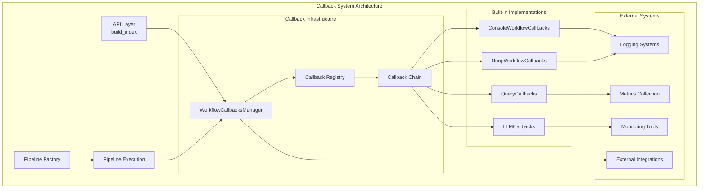

**Diagram sources**
- [graphrag/callbacks/workflow_callbacks_manager.py](file://graphrag/callbacks/workflow_callbacks_manager.py#L11-L52)
- [graphrag/api/index.py](file://graphrag/api/index.py#L29-L101)

**Section sources**
- [graphrag/callbacks/__init__.py](file://graphrag/callbacks/__init__.py#L1-L5)
- [graphrag/callbacks/workflow_callbacks.py](file://graphrag/callbacks/workflow_callbacks.py#L1-L38)

## Core Callback Interfaces

### WorkflowCallbacks Protocol

The `WorkflowCallbacks` interface defines the contract for all workflow lifecycle events:

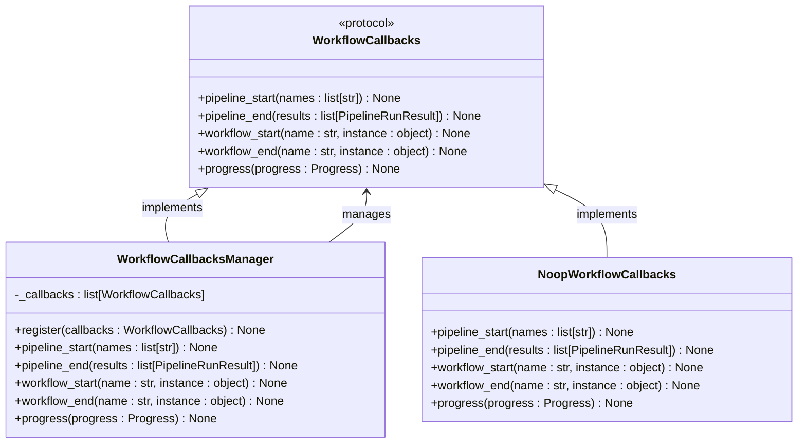

**Diagram sources**
- [graphrag/callbacks/workflow_callbacks.py](file://graphrag/callbacks/workflow_callbacks.py#L12-L37)
- [graphrag/callbacks/workflow_callbacks_manager.py](file://graphrag/callbacks/workflow_callbacks_manager.py#L11-L52)
- [graphrag/callbacks/noop_workflow_callbacks.py](file://graphrag/callbacks/noop_workflow_callbacks.py#L11-L27)

### QueryCallbacks Interface

For query operations, the system provides specialized callbacks:

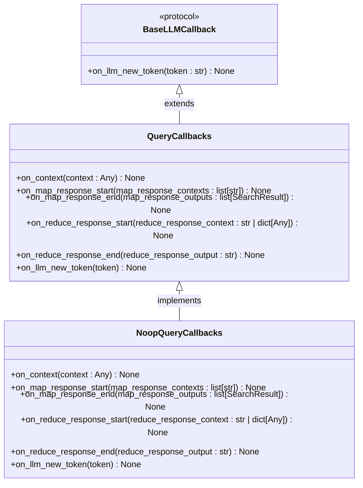

**Diagram sources**
- [graphrag/callbacks/llm_callbacks.py](file://graphrag/callbacks/llm_callbacks.py#L9-L14)
- [graphrag/callbacks/query_callbacks.py](file://graphrag/callbacks/query_callbacks.py#L12-L33)
- [graphrag/callbacks/noop_query_callbacks.py](file://graphrag/callbacks/noop_query_callbacks.py#L12-L33)

**Section sources**
- [graphrag/callbacks/workflow_callbacks.py](file://graphrag/callbacks/workflow_callbacks.py#L12-L37)
- [graphrag/callbacks/query_callbacks.py](file://graphrag/callbacks/query_callbacks.py#L12-L33)
- [graphrag/callbacks/llm_callbacks.py](file://graphrag/callbacks/llm_callbacks.py#L9-L14)

## Callback Chain Management

### WorkflowCallbacksManager Implementation

The `WorkflowCallbacksManager` serves as the central orchestrator for managing multiple callbacks:

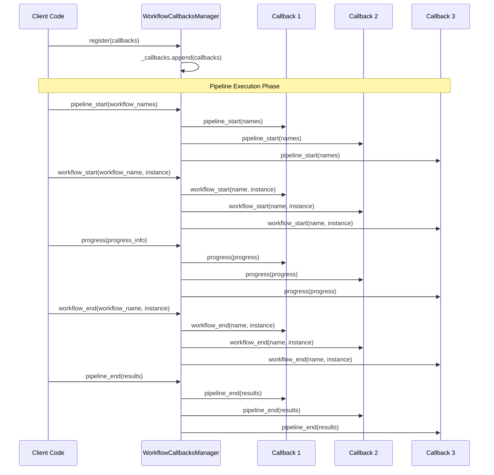

**Diagram sources**
- [graphrag/callbacks/workflow_callbacks_manager.py](file://graphrag/callbacks/workflow_callbacks_manager.py#L20-L52)

### create_callback_chain Function

The system provides a utility function to create callback chains:

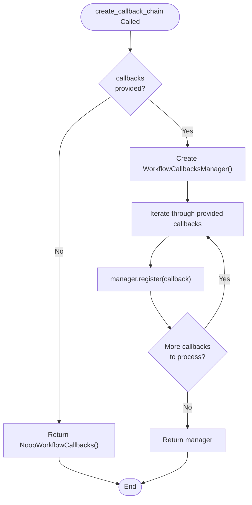

**Diagram sources**
- [graphrag/index/run/utils.py](file://graphrag/index/run/utils.py#L41-L48)

**Section sources**
- [graphrag/callbacks/workflow_callbacks_manager.py](file://graphrag/callbacks/workflow_callbacks_manager.py#L11-L52)
- [graphrag/index/run/utils.py](file://graphrag/index/run/utils.py#L41-L48)

## Lifecycle Event Types

### Pipeline Lifecycle Events

The system provides four primary lifecycle events:

| Event Type | Method | Purpose | Parameters |
|------------|--------|---------|------------|
| Pipeline Start | `pipeline_start(names: list[str])` | Signals beginning of entire pipeline execution | List of workflow names |
| Pipeline End | `pipeline_end(results: list[PipelineRunResult])` | Signals completion of entire pipeline execution | List of execution results |
| Workflow Start | `workflow_start(name: str, instance: object)` | Signals individual workflow execution start | Workflow name and instance |
| Workflow End | `workflow_end(name: str, instance: object)` | Signals individual workflow execution end | Workflow name and instance |

### Progress Events

The `progress` event provides real-time progress updates:

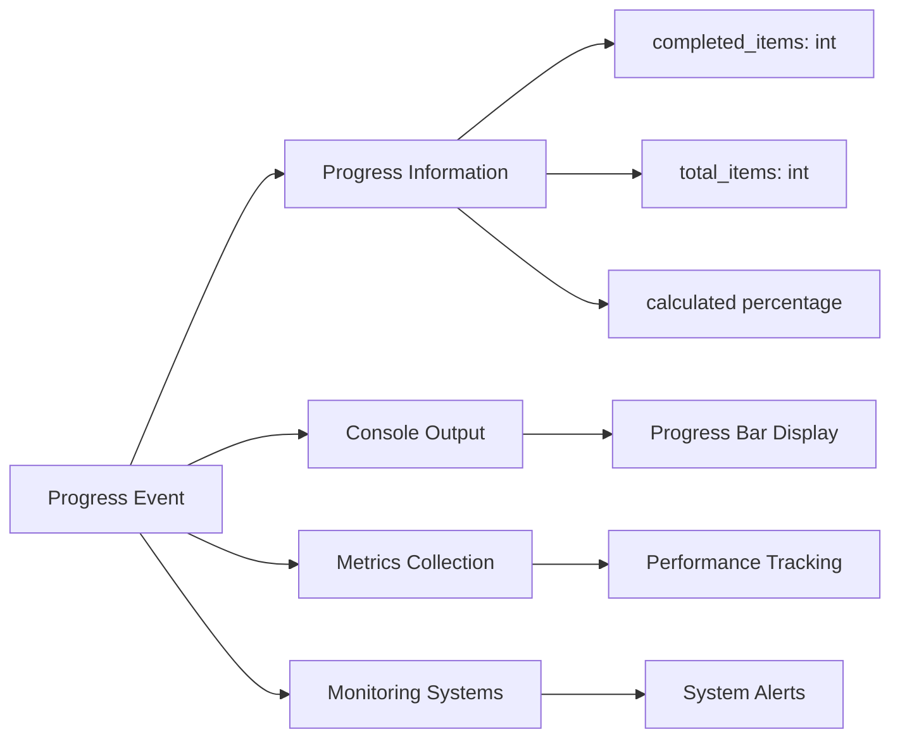

**Diagram sources**
- [graphrag/callbacks/console_workflow_callbacks.py](file://graphrag/callbacks/console_workflow_callbacks.py#L40-L46)

**Section sources**
- [graphrag/callbacks/workflow_callbacks.py](file://graphrag/callbacks/workflow_callbacks.py#L19-L36)

## Built-in Callback Implementations

### ConsoleWorkflowCallbacks

Provides real-time console logging during pipeline execution:

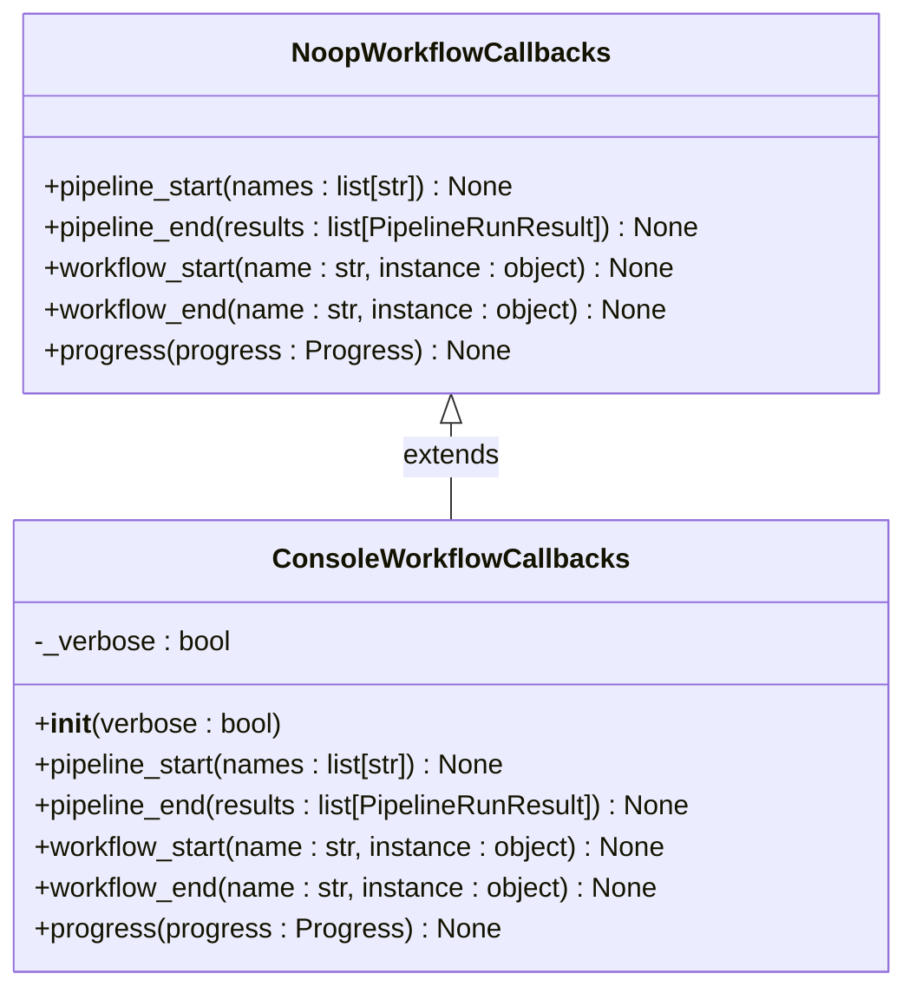

**Diagram sources**
- [graphrag/callbacks/console_workflow_callbacks.py](file://graphrag/callbacks/console_workflow_callbacks.py#L13-L46)
- [graphrag/callbacks/noop_workflow_callbacks.py](file://graphrag/callbacks/noop_workflow_callbacks.py#L11-L27)

### NoopWorkflowCallbacks

Provides null implementation for when callbacks are not needed:

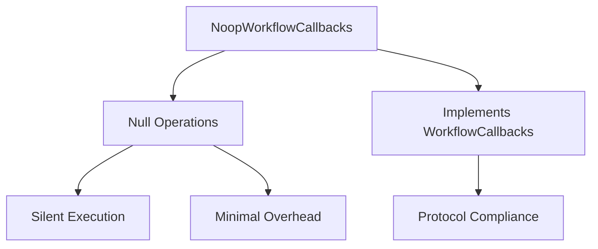

**Diagram sources**
- [graphrag/callbacks/noop_workflow_callbacks.py](file://graphrag/callbacks/noop_workflow_callbacks.py#L11-L27)

**Section sources**
- [graphrag/callbacks/console_workflow_callbacks.py](file://graphrag/callbacks/console_workflow_callbacks.py#L13-L46)
- [graphrag/callbacks/noop_workflow_callbacks.py](file://graphrag/callbacks/noop_workflow_callbacks.py#L11-L27)

## Integration with Pipeline Execution

### API Layer Integration

The callback system integrates seamlessly with the main API:

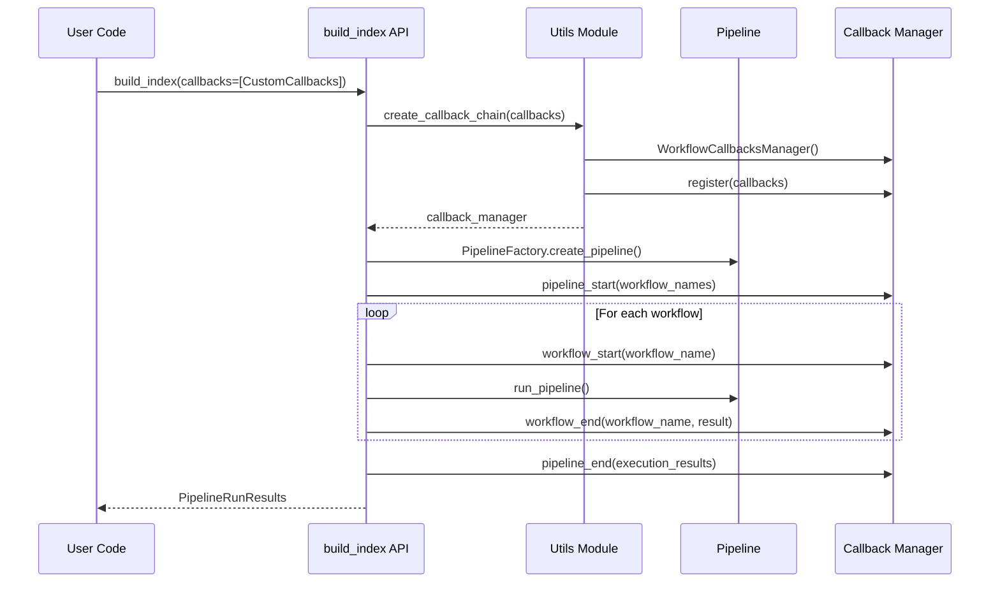

**Diagram sources**
- [graphrag/api/index.py](file://graphrag/api/index.py#L63-L95)
- [graphrag/index/run/utils.py](file://graphrag/index/run/utils.py#L41-L48)

### Pipeline Execution Flow

During pipeline execution, callbacks are invoked at strategic points:

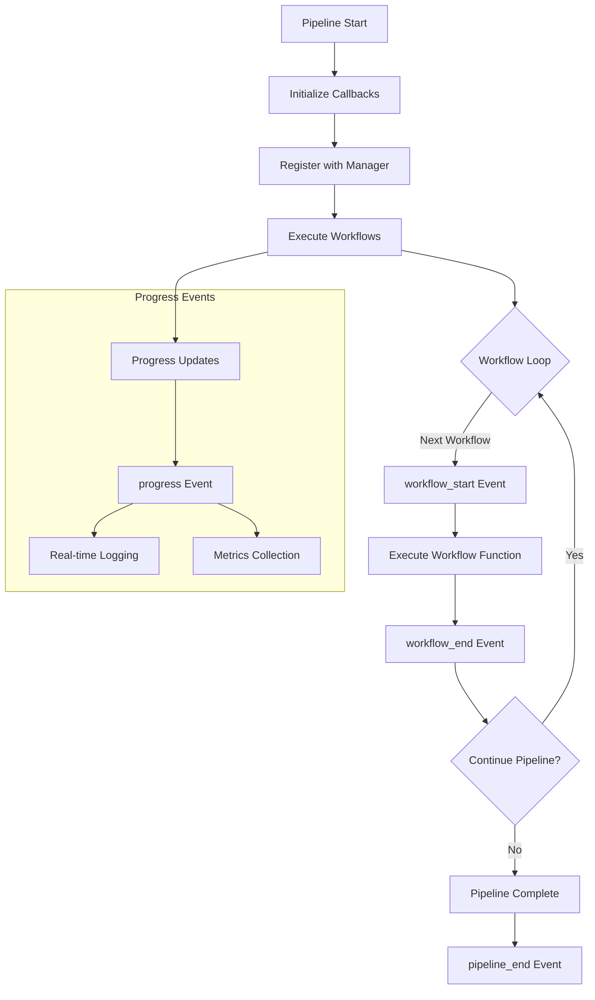

**Diagram sources**
- [graphrag/index/run/run_pipeline.py](file://graphrag/index/run/run_pipeline.py#L104-L139)

**Section sources**
- [graphrag/api/index.py](file://graphrag/api/index.py#L63-L95)
- [graphrag/index/run/run_pipeline.py](file://graphrag/index/run/run_pipeline.py#L104-L139)

## Custom Callback Development

### Creating Custom Workflow Callbacks

Developers can implement custom callbacks by extending the base protocols:

```python
# Example custom callback implementation pattern
class CustomMetricsCallback(WorkflowCallbacks):
    def __init__(self):
        self.metrics = {}
    
    def pipeline_start(self, names: list[str]) -> None:
        self.metrics['pipeline_start'] = time.time()
        print(f"Pipeline starting with workflows: {', '.join(names)}")
    
    def workflow_start(self, name: str, instance: object) -> None:
        self.metrics[f'{name}_start'] = time.time()
        print(f"Starting workflow: {name}")
    
    def workflow_end(self, name: str, instance: object) -> None:
        start_time = self.metrics.get(f'{name}_start', time.time())
        duration = time.time() - start_time
        self.metrics[f'{name}_duration'] = duration
        print(f"Workflow {name} completed in {duration:.2f}s")
    
    def pipeline_end(self, results: list[PipelineRunResult]) -> None:
        total_time = time.time() - self.metrics['pipeline_start']
        print(f"Pipeline completed in {total_time:.2f}s")
        self._send_metrics_to_external_system()
    
    def progress(self, progress: Progress) -> None:
        # Custom progress handling
        pass
```

### Query-Specific Callbacks

For query operations, developers can implement specialized callbacks:

```python
class QueryAnalyticsCallback(QueryCallbacks):
    def __init__(self):
        self.query_stats = {}
    
    def on_context(self, context: Any) -> None:
        # Track context building metrics
        self.query_stats['context_build_time'] = time.time()
    
    def on_map_response_start(self, map_response_contexts: list[str]) -> None:
        self.query_stats['map_start'] = time.time()
    
    def on_map_response_end(self, map_response_outputs: list[SearchResult]) -> None:
        map_time = time.time() - self.query_stats['map_start']
        self.query_stats['map_duration'] = map_time
        # Send map phase metrics
    
    def on_reduce_response_start(self, reduce_response_context: str | dict[Any]) -> None:
        self.query_stats['reduce_start'] = time.time()
    
    def on_reduce_response_end(self, reduce_response_output: str) -> None:
        reduce_time = time.time() - self.query_stats['reduce_start']
        self.query_stats['reduce_duration'] = reduce_time
        # Send reduce phase metrics
```

### Integration Patterns

Common integration patterns for custom callbacks:

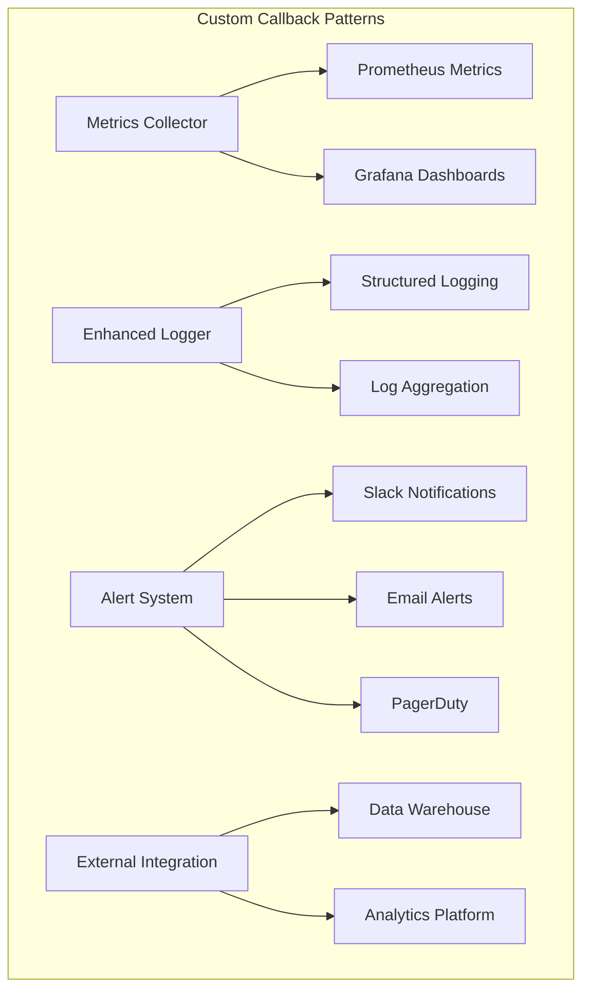

## Error Handling and Observability

### Error Propagation in Callbacks

The callback system handles errors gracefully to prevent pipeline failures:

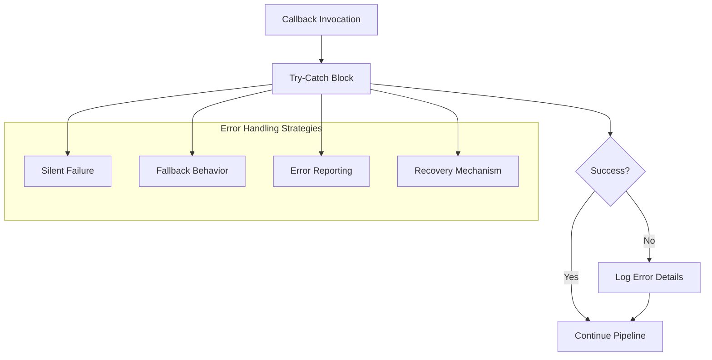

### Observability Features

The callback system provides comprehensive observability:

| Feature | Description | Implementation |
|---------|-------------|----------------|
| Execution Tracing | Track workflow execution flow | `workflow_start/end` events |
| Performance Monitoring | Measure execution times | Timestamp-based metrics |
| Progress Tracking | Real-time progress updates | `progress` events |
| Error Detection | Capture and report errors | Exception handling in callbacks |
| Metrics Collection | Aggregate performance data | Custom metrics callbacks |
| Logging Integration | Structured logging support | Console and external log systems |

**Section sources**
- [graphrag/callbacks/workflow_callbacks_manager.py](file://graphrag/callbacks/workflow_callbacks_manager.py#L26-L52)

## Best Practices and Patterns

### Callback Registration Pattern

```python
# Recommended pattern for callback registration
def create_custom_callbacks(verbose: bool = False) -> WorkflowCallbacks:
    callbacks = [
        ConsoleWorkflowCallbacks(verbose=verbose),
        CustomMetricsCallback(),
        ErrorReportingCallback(),
        ExternalIntegrationCallback()
    ]
    return create_callback_chain(callbacks)
```

### Performance Considerations

1. **Minimize Callback Overhead**: Keep callback logic lightweight
2. **Asynchronous Processing**: Use async callbacks for I/O operations
3. **Batch Processing**: Group related operations in single callbacks
4. **Resource Management**: Properly dispose of resources in callback cleanup

### Testing Callbacks

```python
# Testing pattern for custom callbacks
class TestCallback(unittest.TestCase):
    def setUp(self):
        self.callback = CustomMetricsCallback()
        self.test_results = []
    
    def test_pipeline_events(self):
        # Test pipeline lifecycle events
        self.callback.pipeline_start(['workflow1', 'workflow2'])
        self.assertIn('pipeline_start', self.callback.metrics)
        
        self.callback.workflow_start('workflow1', None)
        self.assertIn('workflow1_start', self.callback.metrics)
        
        self.callback.workflow_end('workflow1', {'result': 'success'})
        self.assertIn('workflow1_duration', self.callback.metrics)
    
    def test_progress_events(self):
        # Test progress tracking
        progress = Progress(completed_items=5, total_items=10)
        self.callback.progress(progress)
        # Verify progress handling logic
```

## Troubleshooting Guide

### Common Issues and Solutions

| Issue | Symptoms | Solution |
|-------|----------|----------|
| Callback Not Invoked | Expected callback methods not called | Verify callback registration and manager setup |
| Performance Degradation | Slow pipeline execution | Profile callback overhead and optimize logic |
| Memory Leaks | Increasing memory usage | Check for resource leaks in callback implementations |
| Error Propagation | Pipeline fails unexpectedly | Add proper error handling in callback methods |
| Missing Progress Updates | No progress indication | Verify progress event emission in pipeline |

### Debugging Callbacks

```python
# Debugging pattern for callback development
class DebugCallback(WorkflowCallbacks):
    def __init__(self):
        self.call_count = {}
    
    def __getattr__(self, name):
        def wrapper(*args, **kwargs):
            self.call_count[name] = self.call_count.get(name, 0) + 1
            print(f"Callback {name} called ({self.call_count[name]} times)")
            return getattr(super(), name)(*args, **kwargs)
        return wrapper
```

### Monitoring Callback Health

```python
# Health monitoring pattern
class HealthMonitoringCallback(WorkflowCallbacks):
    def __init__(self):
        self.health_checks = []
    
    def pipeline_start(self, names: list[str]) -> None:
        start_time = time.time()
        super().pipeline_start(names)
        self.health_checks.append({
            'event': 'pipeline_start',
            'duration': time.time() - start_time,
            'timestamp': time.time()
        })
    
    def check_health(self) -> dict:
        return {
            'total_calls': sum(self.call_count.values()),
            'average_duration': sum(check['duration'] for check in self.health_checks) / len(self.health_checks),
            'recent_events': self.health_checks[-10:]  # Last 10 events
        }
```

## Conclusion

The GraphRAG callback and lifecycle events system provides a robust foundation for monitoring, observability, and integration within the pipeline execution framework. Through its protocol-based architecture, developers can easily extend the system with custom monitoring solutions, metrics collection, and external integrations without modifying core pipeline logic.

Key benefits of the system include:

- **Flexibility**: Protocol-based design allows for easy extension
- **Type Safety**: Strong typing ensures reliable callback implementations
- **Performance**: Efficient callback chaining with minimal overhead
- **Observability**: Comprehensive lifecycle event coverage
- **Integration**: Seamless integration with external monitoring and analytics systems

The system's design enables developers to build sophisticated monitoring and observability solutions while maintaining clean separation of concerns and preserving pipeline performance. Whether implementing simple logging, complex metrics collection, or deep integration with external systems, the callback framework provides the necessary infrastructure and patterns for success.