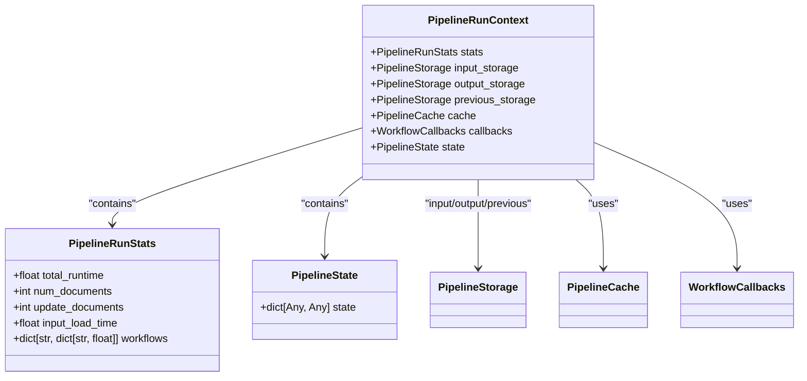
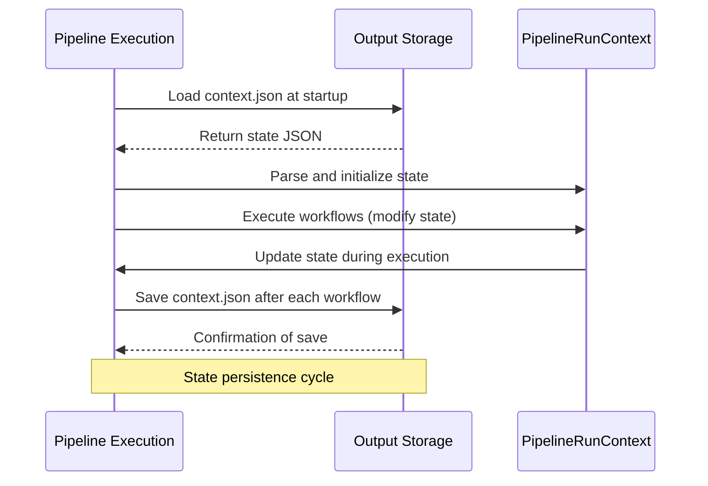
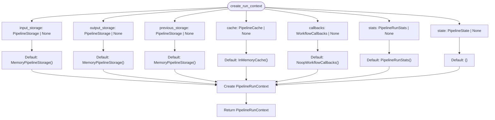
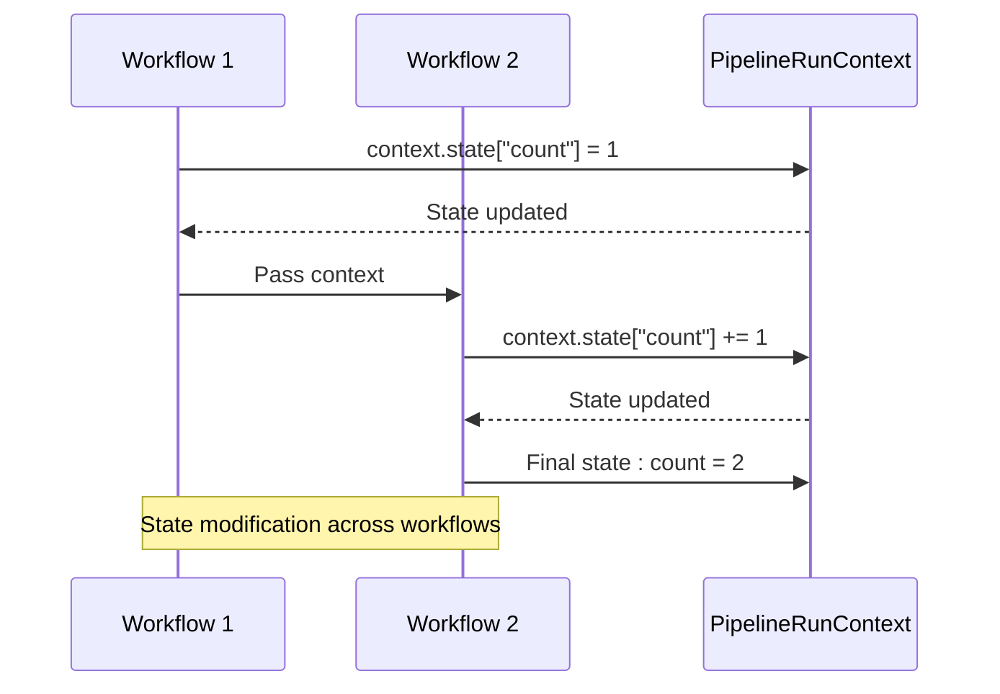
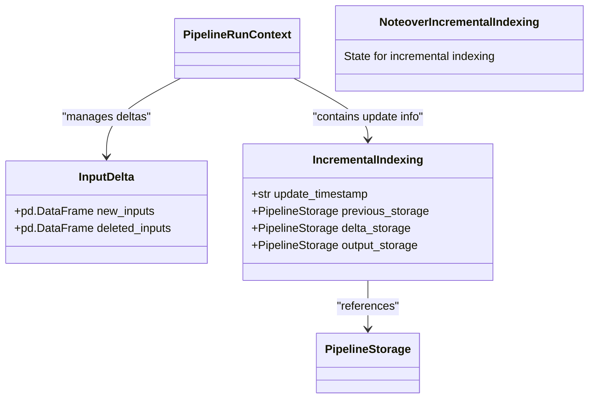

# Execution Context and State Management

<cite>
**Referenced Files in This Document**   
- [PipelineRunContext.py](file://graphrag/index/typing/context.py)
- [run_pipeline.py](file://graphrag/index/run/run_pipeline.py)
- [utils.py](file://graphrag/index/run/utils.py)
- [test_pipeline_state.py](file://tests/verbs/test_pipeline_state.py)
- [state.py](file://graphrag/index/typing/state.py)
- [stats.py](file://graphrag/index/typing/stats.py)
- [incremental_index.py](file://graphrag/index/update/incremental_index.py)
</cite>

## Table of Contents
1. [Introduction](#introduction)
2. [PipelineRunContext Object Structure](#pipelineruncontext-object-structure)
3. [State Persistence Mechanism](#state-persistence-mechanism)
4. [Context Initialization with create_run_context()](#context-initialization-with-create_run_context)
5. [State Management in Workflows](#state-management-in-workflows)
6. [Additional Context Injection](#additional-context-injection)
7. [Incremental Indexing and State](#incremental-indexing-and-state)
8. [Best Practices for State-Aware Workflows](#best-practices-for-state-aware-workflows)
9. [Troubleshooting Context Issues](#troubleshooting-context-issues)

## Introduction
The Execution Context and State Management system in GraphRAG provides a comprehensive framework for maintaining state across pipeline runs. This system enables workflows to share data, maintain stateful operations, and support incremental indexing capabilities. The core of this system is the PipelineRunContext object, which carries all necessary components for workflow execution and state persistence.

**Section sources**
- [PipelineRunContext.py](file://graphrag/index/typing/context.py#L1-L32)

## PipelineRunContext Object Structure
The PipelineRunContext object serves as the central container for all execution context information during pipeline runs. It provides a unified interface for workflows to access storage, cache, callbacks, statistics, and mutable state.



**Diagram sources**
- [PipelineRunContext.py](file://graphrag/index/typing/context.py#L17-L32)
- [stats.py](file://graphrag/index/typing/stats.py#L9-L26)
- [state.py](file://graphrag/index/typing/state.py#L8)

**Section sources**
- [PipelineRunContext.py](file://graphrag/index/typing/context.py#L17-L32)

## State Persistence Mechanism
The state management system automatically handles state persistence across pipeline runs by loading from and saving to context.json. This mechanism ensures that stateful operations can maintain continuity between executions.



**Diagram sources**
- [run_pipeline.py](file://graphrag/index/run/run_pipeline.py#L44-L46)
- [run_pipeline.py](file://graphrag/index/run/run_pipeline.py#L142-L158)

**Section sources**
- [run_pipeline.py](file://graphrag/index/run/run_pipeline.py#L44-L46)
- [run_pipeline.py](file://graphrag/index/run/run_pipeline.py#L142-L158)

## Context Initialization with create_run_context()
The create_run_context() utility function initializes a PipelineRunContext with appropriate storage, cache, and callback handlers. This function provides default values for all components, making it easy to create a functional context with minimal configuration.



**Diagram sources**
- [utils.py](file://graphrag/index/run/utils.py#L20-L38)

**Section sources**
- [utils.py](file://graphrag/index/run/utils.py#L20-L38)

## State Management in Workflows
Workflows can read from and modify the shared state through the PipelineRunContext.state property. The test_pipeline_state.py file provides clear examples of how state can be shared and modified across multiple workflows.



**Diagram sources**
- [test_pipeline_state.py](file://tests/verbs/test_pipeline_state.py#L15-L27)

**Section sources**
- [test_pipeline_state.py](file://tests/verbs/test_pipeline_state.py#L15-L54)

## Additional Context Injection
The system supports injecting additional context into the pipeline through the additional_context parameter. This injected context is accessible under the 'additional_context' key in the state object, allowing external data to be passed into the pipeline execution.

```mermaid
flowchart LR
A[API Call] --> B[build_index]
B --> C{additional_context provided?}
C --> |Yes| D[Set additional_context in state]
C --> |No| E[Continue without additional_context]
D --> F[Workflows access via state['additional_context']]
E --> G[Workflows execute normally]
style D fill:#f9f,stroke:#333
style F fill:#f9f,stroke:#333
```

**Diagram sources**
- [run_pipeline.py](file://graphrag/index/run/run_pipeline.py#L48-L49)
- [run_pipeline.py](file://graphrag/index/run/run_pipeline.py#L148-L155)

**Section sources**
- [run_pipeline.py](file://graphrag/index/run/run_pipeline.py#L48-L49)
- [api/index.py](file://graphrag/api/index.py#L34-L35)

## Incremental Indexing and State
The state management system plays a crucial role in incremental indexing by storing the update_timestamp and managing storage paths. During incremental runs, the system creates timestamped storage locations and maintains references to previous and delta storage.



**Diagram sources**
- [run_pipeline.py](file://graphrag/index/run/run_pipeline.py#L56-L62)
- [incremental_index.py](file://graphrag/index/update/incremental_index.py#L18-L32)

**Section sources**
- [run_pipeline.py](file://graphrag/index/run/run_pipeline.py#L51-L63)
- [incremental_index.py](file://graphrag/index/update/incremental_index.py#L18-L84)

## Best Practices for State-Aware Workflows
When developing state-aware workflows, follow these best practices to ensure reliable and maintainable code:

1. **Use descriptive keys**: Choose clear, consistent keys for state properties
2. **Initialize state safely**: Check for existence before accessing nested properties
3. **Document state usage**: Clearly document which state properties your workflow uses
4. **Handle missing state**: Implement fallback behavior when expected state is not present
5. **Minimize state size**: Store only essential data in the state to improve performance

**Section sources**
- [test_pipeline_state.py](file://tests/verbs/test_pipeline_state.py#L49)
- [run_pipeline.py](file://graphrag/index/run/run_pipeline.py#L148-L155)

## Troubleshooting Context Issues
Common issues with context propagation and their solutions:

1. **State not persisting**: Ensure _dump_json() is called appropriately
2. **Missing additional_context**: Verify the additional_context parameter is passed to build_index()
3. **State corruption**: Check for concurrent modifications in asynchronous workflows
4. **Performance issues**: Monitor the size of stored state in context.json
5. **Incremental indexing failures**: Verify update_timestamp and storage paths are correctly set

**Section sources**
- [run_pipeline.py](file://graphrag/index/run/run_pipeline.py#L142-L158)
- [test_pipeline_state.py](file://tests/verbs/test_pipeline_state.py#L30-L54)