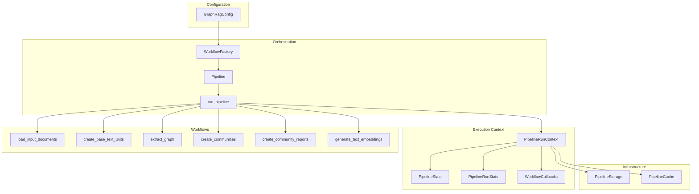
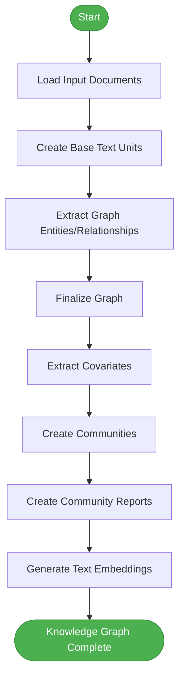
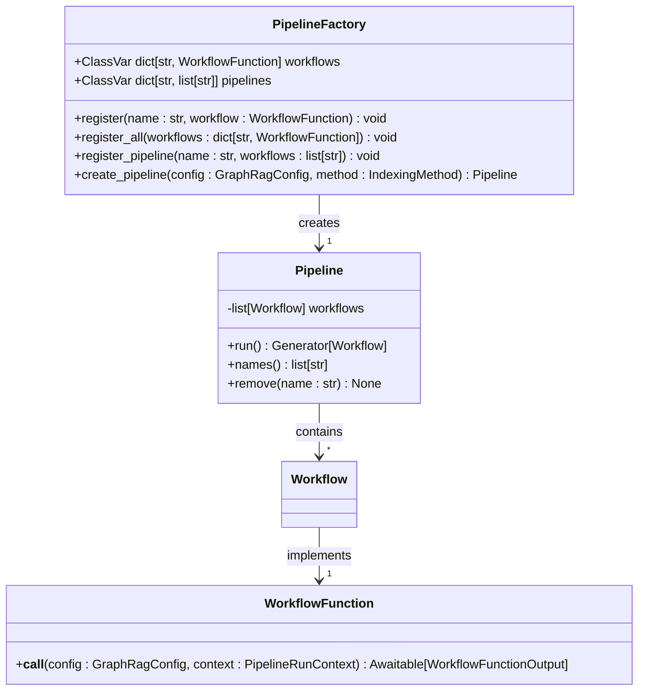
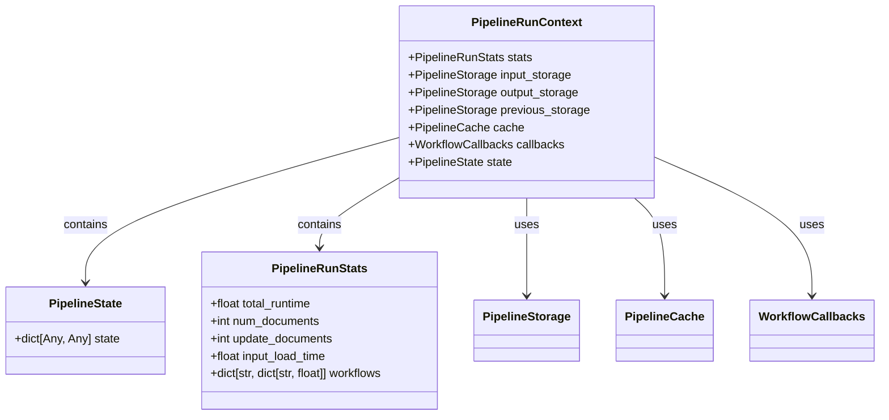
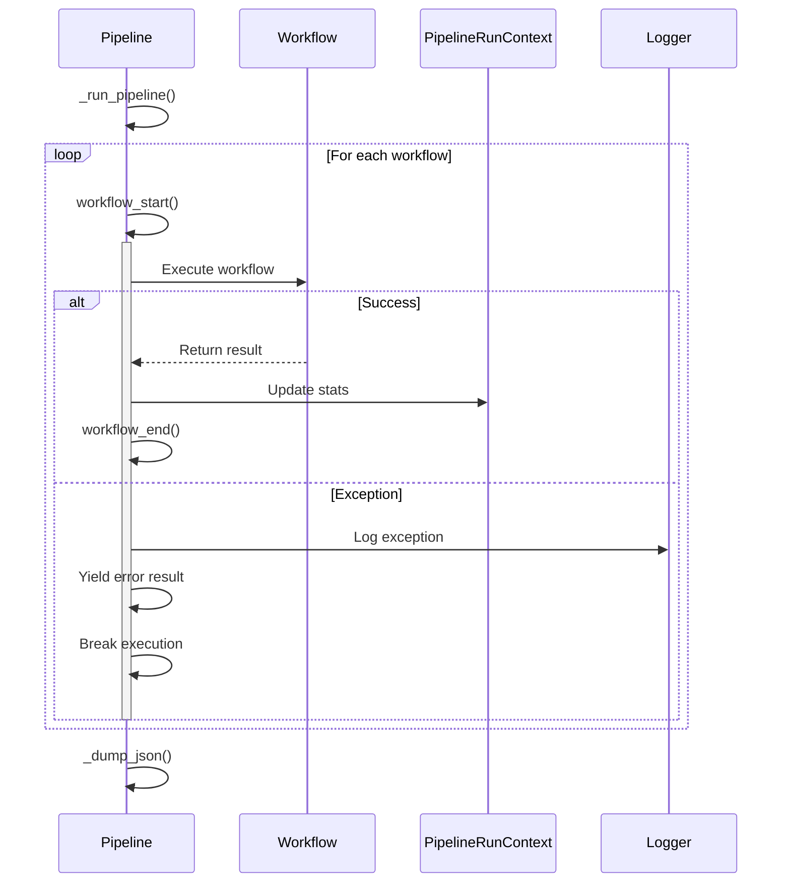
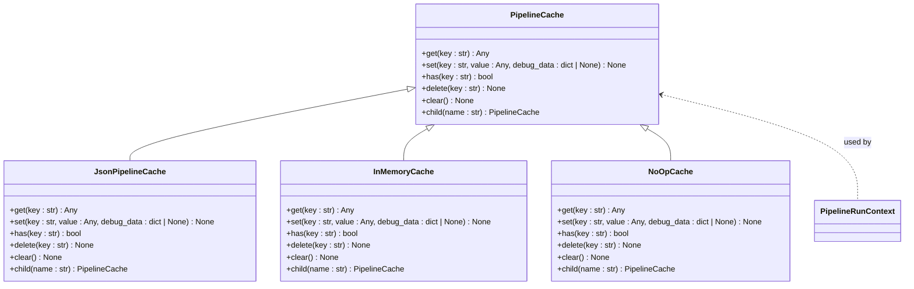
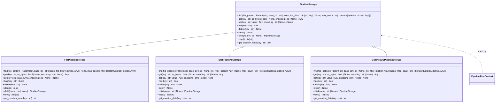
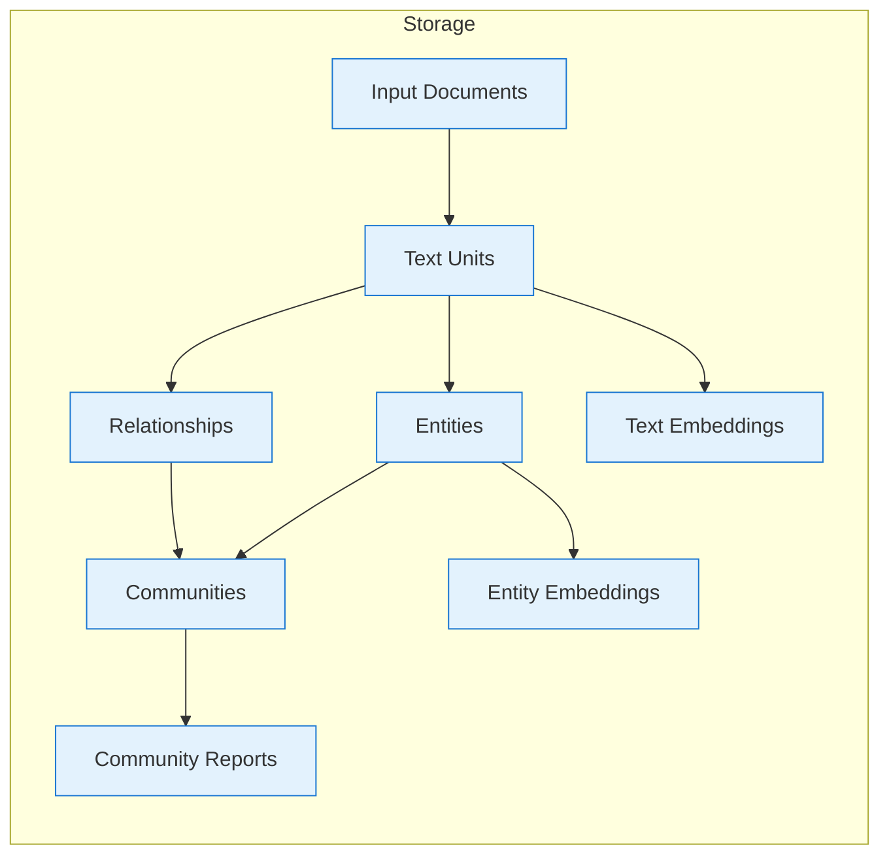
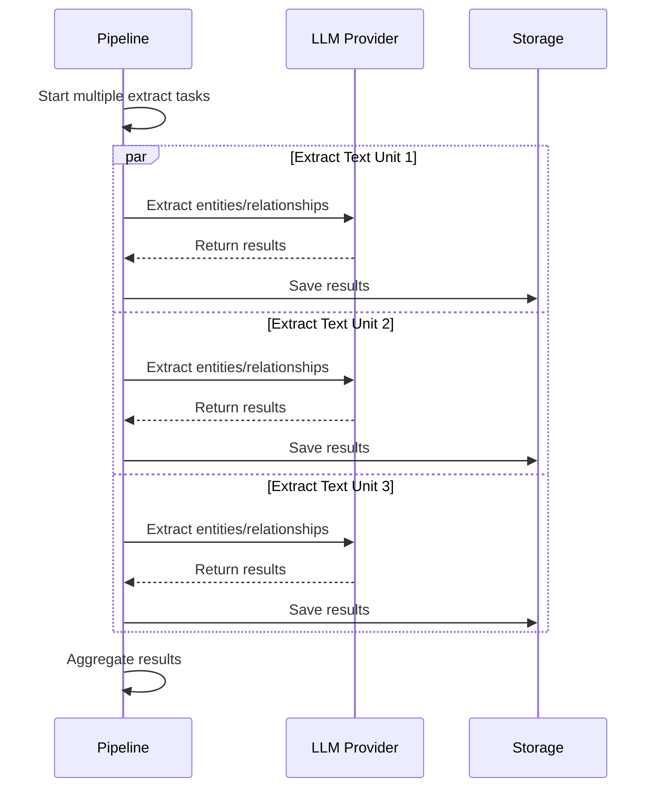
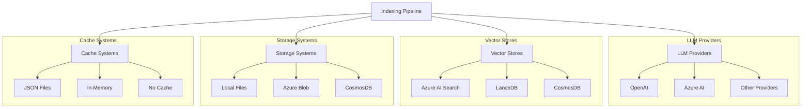

# Indexing Pipeline Architecture

<cite>
**Referenced Files in This Document**   
- [run_pipeline.py](file://graphrag/index/run/run_pipeline.py)
- [factory.py](file://graphrag/index/workflows/factory.py)
- [pipeline.py](file://graphrag/index/typing/pipeline.py)
- [context.py](file://graphrag/index/typing/context.py)
- [workflow.py](file://graphrag/index/typing/workflow.py)
- [state.py](file://graphrag/index/typing/state.py)
- [stats.py](file://graphrag/index/typing/stats.py)
- [pipeline_cache.py](file://graphrag/cache/pipeline_cache.py)
- [pipeline_storage.py](file://graphrag/storage/pipeline_storage.py)
- [load_input_documents.py](file://graphrag/index/workflows/load_input_documents.py)
- [create_base_text_units.py](file://graphrag/index/workflows/create_base_text_units.py)
- [extract_graph.py](file://graphrag/index/workflows/extract_graph.py)
- [create_communities.py](file://graphrag/index/workflows/create_communities.py)
- [workflow_callbacks.py](file://graphrag/callbacks/workflow_callbacks.py)
</cite>

## Table of Contents
1. [Introduction](#introduction)
2. [High-Level Architecture](#high-level-architecture)
3. [Phased Execution Model](#phased-execution-model)
4. [WorkflowFactory and Pipeline Construction](#workflowfactory-and-pipeline-construction)
5. [State Management and Context](#state-management-and-context)
6. [Error Handling and Reliability](#error-handling-and-reliability)
7. [Caching Mechanisms](#caching-mechanisms)
8. [Storage System](#storage-system)
9. [Data Flow and Intermediate Artifacts](#data-flow-and-intermediate-artifacts)
10. [Scalability and Async Execution](#scalability-and-async-execution)
11. [Integration Points](#integration-points)
12. [Conclusion](#conclusion)

## Introduction
The Indexing Pipeline is a modular, configuration-driven workflow engine designed to transform unstructured text into a structured knowledge graph. This document provides a comprehensive architectural overview of the system, focusing on its core components, execution model, and reliability mechanisms. The pipeline orchestrates discrete operations such as input loading, text chunking, entity extraction, community detection, and graph summarization based on configuration parameters. This architecture enables flexible, scalable processing of documents into a knowledge graph that can be queried and analyzed.

## High-Level Architecture

The Indexing Pipeline follows a modular, layered architecture that separates concerns between workflow orchestration, data processing, state management, and storage. The system is designed as a configuration-driven workflow engine that processes unstructured text into a knowledge graph through a series of discrete, composable operations.

**Diagram sources**
- [run_pipeline.py](file://graphrag/index/run/run_pipeline.py#L29-L168)
- [factory.py](file://graphrag/index/workflows/factory.py#L17-L98)
- [context.py](file://graphrag/index/typing/context.py#L17-L33)

**Section sources**
- [run_pipeline.py](file://graphrag/index/run/run_pipeline.py#L1-L168)
- [factory.py](file://graphrag/index/workflows/factory.py#L1-L98)

## Phased Execution Model

The Indexing Pipeline implements a phased execution model where discrete operations are executed sequentially based on the configured workflow. Each phase represents a specific transformation step in the journey from raw text to knowledge graph. The pipeline processes documents through several key phases:

1. **Input Loading**: Documents are loaded from various sources (CSV, JSON, text files) and parsed into a standardized format
2. **Text Chunking**: Documents are split into manageable text units based on configurable size and overlap parameters
3. **Entity and Relationship Extraction**: Natural language processing techniques extract entities and relationships from text units
4. **Graph Construction**: Extracted entities and relationships are organized into a graph structure
5. **Community Detection**: Graph clustering algorithms identify communities within the graph
6. **Community Reporting**: Summarization techniques generate descriptive reports for each community
7. **Embedding Generation**: Text embeddings are created for semantic search and similarity analysis

**Diagram sources**
- [load_input_documents.py](file://graphrag/index/workflows/load_input_documents.py#L21-L37)
- [create_base_text_units.py](file://graphrag/index/workflows/create_base_text_units.py#L25-L51)
- [extract_graph.py](file://graphrag/index/workflows/extract_graph.py#L28-L79)
- [create_communities.py](file://graphrag/index/workflows/create_communities.py#L25-L52)

**Section sources**
- [create_base_text_units.py](file://graphrag/index/workflows/create_base_text_units.py#L1-L164)
- [extract_graph.py](file://graphrag/index/workflows/extract_graph.py#L1-L165)
- [create_communities.py](file://graphrag/index/workflows/create_communities.py#L1-L157)

## WorkflowFactory and Pipeline Construction

The WorkflowFactory class is central to the pipeline's dynamic construction capabilities, enabling the creation of execution graphs based on configuration. This factory pattern allows for flexible pipeline composition by registering workflows and assembling them into executable pipelines.

The PipelineFactory maintains two key registries:
- **Workflows**: A dictionary mapping workflow names to their implementation functions
- **Pipelines**: A dictionary mapping pipeline methods (e.g., Standard, Fast) to ordered lists of workflow names

When creating a pipeline, the factory consults the configuration to determine which workflow sequence to instantiate. The system supports different indexing methods (Standard, Fast, Update) with corresponding workflow sequences optimized for different use cases.

**Diagram sources**
- [factory.py](file://graphrag/index/workflows/factory.py#L17-L98)
- [pipeline.py](file://graphrag/index/typing/pipeline.py#L11-L28)
- [workflow.py](file://graphrag/index/typing/workflow.py#L14-L29)

**Section sources**
- [factory.py](file://graphrag/index/workflows/factory.py#L1-L98)
- [pipeline.py](file://graphrag/index/typing/pipeline.py#L1-L28)

## State Management and Context

The Indexing Pipeline employs a comprehensive state management system that maintains execution context throughout the pipeline's lifecycle. The PipelineRunContext class serves as the central repository for all runtime state, providing workflows with access to essential services and shared data.

The context contains several key components:
- **Storage**: Input, output, and previous storage instances for data persistence
- **Cache**: PipelineCache instance for LLM response caching
- **Callbacks**: WorkflowCallbacks for monitoring execution progress
- **State**: Arbitrary property bag for runtime state and pre-computes
- **Stats**: PipelineRunStats for performance monitoring and metrics

State persistence is achieved through JSON serialization of the context state, which is saved to storage at key points during execution. This enables resumable operations and provides a complete record of the pipeline's execution state.

**Diagram sources**
- [context.py](file://graphrag/index/typing/context.py#L17-L33)
- [state.py](file://graphrag/index/typing/state.py#L8)
- [stats.py](file://graphrag/index/typing/stats.py#L9-L26)

**Section sources**
- [context.py](file://graphrag/index/typing/context.py#L1-L33)
- [state.py](file://graphrag/index/typing/state.py#L1-L9)
- [stats.py](file://graphrag/index/typing/stats.py#L1-L26)

## Error Handling and Reliability

The Indexing Pipeline implements robust error handling mechanisms to ensure reliable execution and graceful recovery from failures. The system employs a comprehensive approach to error management that includes exception handling, validation, and monitoring.

The pipeline execution is wrapped in try-catch blocks that capture exceptions and yield appropriate PipelineRunResult objects with error information. Each workflow function returns a WorkflowFunctionOutput that includes a stop flag, allowing workflows to signal when continuation could cause unstable failures.

Validation is performed at multiple levels, including data validation (e.g., ensuring extracted entities exist) and configuration validation. The system also provides detailed logging through the standard Python logging module, with structured log messages that include workflow names and execution status.

**Diagram sources**
- [run_pipeline.py](file://graphrag/index/run/run_pipeline.py#L104-L140)
- [extract_graph.py](file://graphrag/index/workflows/extract_graph.py#L162-L165)
- [workflow_callbacks.py](file://graphrag/callbacks/workflow_callbacks.py#L12-L38)

**Section sources**
- [run_pipeline.py](file://graphrag/index/run/run_pipeline.py#L1-L168)
- [extract_graph.py](file://graphrag/index/workflows/extract_graph.py#L1-L165)
- [workflow_callbacks.py](file://graphrag/callbacks/workflow_callbacks.py#L1-L38)

## Caching Mechanisms

The Indexing Pipeline incorporates a sophisticated caching system to improve performance and reduce redundant operations, particularly for expensive LLM calls. The caching architecture is built around the PipelineCache abstract base class, which defines a standard interface for cache operations.

The system supports multiple cache implementations:
- **JSON Cache**: Persistent caching to JSON files
- **Memory Cache**: In-memory caching for temporary storage
- **No-op Cache**: A null implementation for cases where caching is disabled

Cache operations include get, set, has, delete, and clear methods, providing a complete interface for cache management. The cache is integrated throughout the pipeline, particularly in workflows that involve LLM calls, such as entity extraction and description summarization.

**Diagram sources**
- [pipeline_cache.py](file://graphrag/cache/pipeline_cache.py#L12-L68)
- [json_pipeline_cache.py](file://graphrag/cache/json_pipeline_cache.py)
- [memory_pipeline_cache.py](file://graphrag/cache/memory_pipeline_cache.py)
- [noop_pipeline_cache.py](file://graphrag/cache/noop_pipeline_cache.py)

**Section sources**
- [pipeline_cache.py](file://graphrag/cache/pipeline_cache.py#L1-L68)

## Storage System

The Indexing Pipeline utilizes a flexible storage abstraction that supports multiple storage backends while providing a consistent interface for data persistence. The storage system is built around the PipelineStorage abstract base class, which defines operations for data storage and retrieval.

Key storage capabilities include:
- **File Operations**: Get, set, delete, and clear operations for key-value storage
- **Pattern Matching**: Find operations with regular expression patterns
- **Metadata Access**: Retrieval of creation dates for stored items
- **Hierarchical Structure**: Child storage instances for organizing data

The system supports various storage implementations:
- **File Storage**: Local file system storage
- **Blob Storage**: Cloud blob storage (e.g., Azure Blob Storage)
- **CosmosDB Storage**: NoSQL database storage
- **Memory Storage**: In-memory storage for testing

This abstraction allows the pipeline to work with different storage backends without changing the core logic, enabling deployment in various environments from local development to cloud production.

**Diagram sources**
- [pipeline_storage.py](file://graphrag/storage/pipeline_storage.py#L13-L100)
- [file_pipeline_storage.py](file://graphrag/storage/file_pipeline_storage.py)
- [blob_pipeline_storage.py](file://graphrag/storage/blob_pipeline_storage.py)
- [cosmosdb_pipeline_storage.py](file://graphrag/storage/cosmosdb_pipeline_storage.py)

**Section sources**
- [pipeline_storage.py](file://graphrag/storage/pipeline_storage.py#L1-L100)

## Data Flow and Intermediate Artifacts

The Indexing Pipeline processes documents through a series of transformations, with each workflow generating intermediate artifacts that serve as input for subsequent workflows. This data flow architecture ensures that each processing step builds upon the results of previous steps, creating a coherent progression from raw text to knowledge graph.

The primary data flow follows this sequence:
1. **Documents**: Raw input documents are loaded and stored as a DataFrame
2. **Text Units**: Documents are chunked into smaller text units with metadata
3. **Entities and Relationships**: NLP extraction identifies entities and their relationships
4. **Communities**: Graph clustering algorithms group related entities into communities
5. **Community Reports**: Summarization generates descriptive reports for each community
6. **Embeddings**: Text embeddings are created for semantic search capabilities

Each intermediate artifact is stored in the output storage, allowing for inspection, debugging, and incremental updates. The system also supports snapshotting of raw extraction results for transparency and analysis.

**Diagram sources**
- [load_input_documents.py](file://graphrag/index/workflows/load_input_documents.py#L21-L37)
- [create_base_text_units.py](file://graphrag/index/workflows/create_base_text_units.py#L25-L51)
- [extract_graph.py](file://graphrag/index/workflows/extract_graph.py#L28-L79)
- [create_communities.py](file://graphrag/index/workflows/create_communities.py#L25-L52)

**Section sources**
- [load_input_documents.py](file://graphrag/index/workflows/load_input_documents.py#L1-L44)
- [create_base_text_units.py](file://graphrag/index/workflows/create_base_text_units.py#L1-L164)
- [extract_graph.py](file://graphrag/index/workflows/extract_graph.py#L1-L165)
- [create_communities.py](file://graphrag/index/workflows/create_communities.py#L1-L157)

## Scalability and Async Execution

The Indexing Pipeline is designed with scalability in mind, incorporating asynchronous execution patterns to maximize throughput and resource utilization. The system leverages Python's async/await features to enable concurrent processing of documents and parallel execution of independent operations.

Key scalability features include:
- **Async Workflows**: All workflow functions are implemented as coroutines, allowing for non-blocking execution
- **Concurrent Requests**: LLM calls are executed with configurable concurrency limits
- **Async Modes**: Support for different asynchronous execution patterns (AsyncIO, Threading)
- **Parallel Processing**: Independent operations can be executed concurrently

The pipeline configuration allows tuning of concurrency parameters, such as concurrent_requests for LLM calls, enabling optimization for different hardware and API rate limits. This asynchronous architecture ensures that I/O-bound operations (like network calls to LLMs) do not block the execution of other pipeline stages.

**Diagram sources**
- [extract_graph.py](file://graphrag/index/workflows/extract_graph.py#L55-L56)
- [run_pipeline.py](file://graphrag/index/run/run_pipeline.py#L117-L126)
- [config/enums.py](file://graphrag/config/enums.py#AsyncType)

**Section sources**
- [extract_graph.py](file://graphrag/index/workflows/extract_graph.py#L1-L165)
- [run_pipeline.py](file://graphrag/index/run/run_pipeline.py#L1-L168)

## Integration Points

The Indexing Pipeline integrates with various external systems and services to provide a comprehensive knowledge graph construction solution. These integration points enable the pipeline to leverage specialized capabilities for specific tasks.

Key integration points include:
- **LLM Providers**: Integration with language model providers (via litellm) for entity extraction, summarization, and other NLP tasks
- **Vector Stores**: Connection to vector databases (Azure AI Search, LanceDB, CosmosDB) for semantic search capabilities
- **Storage Systems**: Support for multiple storage backends (local files, blob storage, CosmosDB)
- **Caching Systems**: Integration with various cache implementations for performance optimization

The system uses a factory pattern for these integrations, allowing for easy configuration and replacement of components. This modular design enables the pipeline to work with different providers and services without changing the core logic.

**Diagram sources**
- [language_model/providers/litellm/chat_model.py](file://graphrag/language_model/providers/litellm/chat_model.py)
- [vector_stores/factory.py](file://graphrag/vector_stores/factory.py)
- [storage/factory.py](file://graphrag/storage/factory.py)
- [cache/factory.py](file://graphrag/cache/factory.py)

**Section sources**
- [language_model/factory.py](file://graphrag/language_model/factory.py)
- [vector_stores/factory.py](file://graphrag/vector_stores/factory.py)
- [storage/factory.py](file://graphrag/storage/factory.py)
- [cache/factory.py](file://graphrag/cache/factory.py)

## Conclusion
The Indexing Pipeline architecture represents a sophisticated, modular system for transforming unstructured text into a structured knowledge graph. By implementing a configuration-driven workflow engine with discrete, composable operations, the system provides flexibility and extensibility for various use cases. The phased execution model ensures a logical progression from raw documents to a rich knowledge graph with communities, reports, and embeddings.

Key architectural strengths include the dynamic pipeline construction via WorkflowFactory, comprehensive state management, robust error handling, and sophisticated caching mechanisms. The system's asynchronous design enables scalability and efficient resource utilization, while its integration points with LLMs, vector stores, and various storage systems provide a comprehensive solution for knowledge graph construction.

This architecture enables both standard and incremental indexing, supports multiple configuration profiles (Standard, Fast), and provides detailed monitoring and metrics through its callback and statistics system. The result is a powerful, reliable, and scalable pipeline for creating knowledge graphs from unstructured text sources.