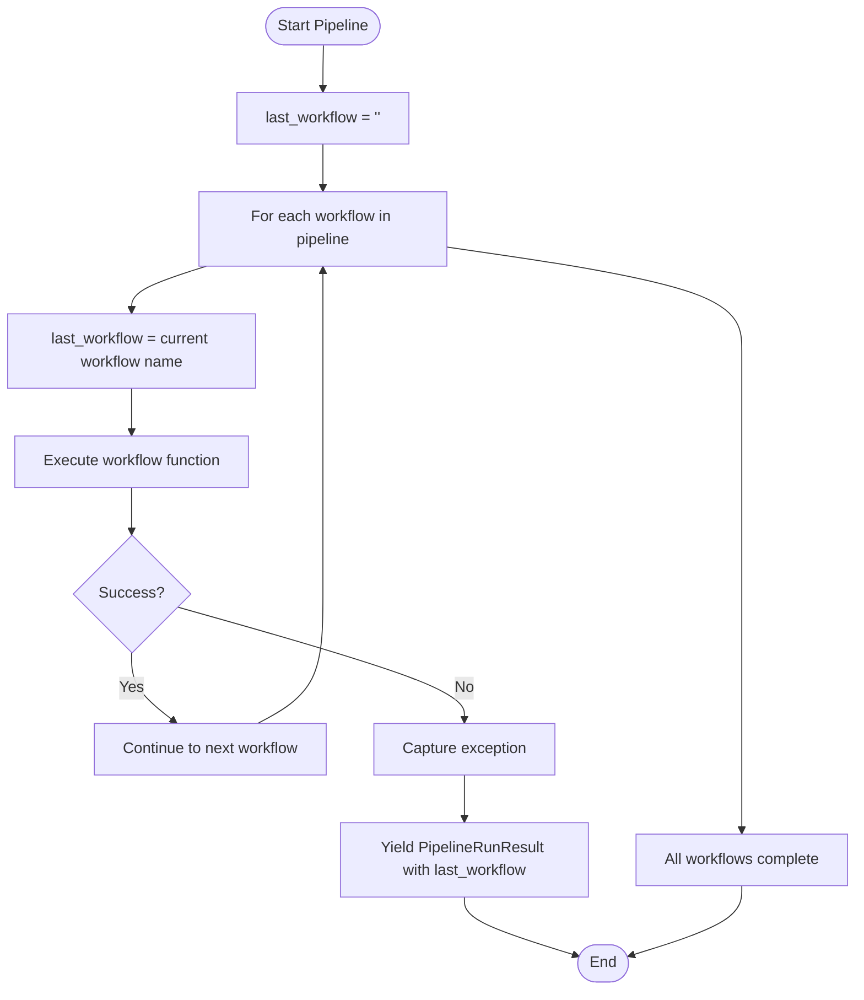
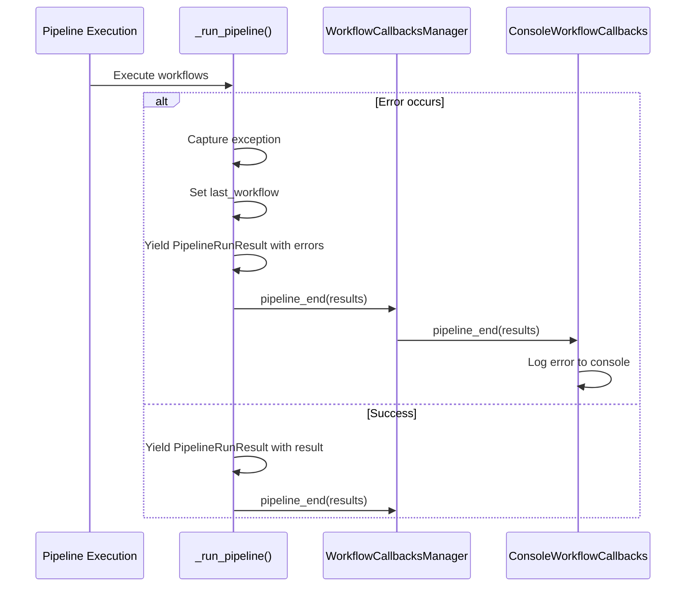

# Error Handling

<cite>
**Referenced Files in This Document**   
- [run_pipeline.py](file://graphrag/index/run/run_pipeline.py)
- [pipeline_run_result.py](file://graphrag/index/typing/pipeline_run_result.py)
- [workflow_callbacks.py](file://graphrag/callbacks/workflow_callbacks.py)
- [console_workflow_callbacks.py](file://graphrag/callbacks/console_workflow_callbacks.py)
- [index.py](file://graphrag/cli/index.py)
- [api.py](file://graphrag/api/index.py)
- [stats.py](file://graphrag/index/typing/stats.py)
</cite>

## Table of Contents
1. [Error Handling Mechanism in _run_pipeline()](#error-handling-mechanism-in-_run_pipeline)
2. [PipelineRunResult Structure](#pipelinerunresult-structure)
3. [Error Attribution with last_workflow](#error-attribution-with-last_workflow)
4. [Callback Error Handling](#callback-error-handling)
5. [Error Propagation to CLI](#error-propagation-to-cli)
6. [Error Recovery Best Practices](#error-recovery-best-practices)
7. [Logging Strategies](#logging-strategies)
8. [Interpreting Error Information in stats.json](#interpreting-error-information-in-stats.json)
9. [Debugging Pipeline Failures](#debugging-pipeline-failures)

## Error Handling Mechanism in _run_pipeline()

The error handling mechanism in the `_run_pipeline()` function is implemented through a comprehensive try-except block that captures any exceptions occurring during pipeline execution. The function processes workflows sequentially, and when an exception occurs, it ensures proper error capture and reporting.

The mechanism works as follows:
- The function initializes with a try-except block that wraps the entire pipeline execution
- Each workflow is executed within the try block, with the `last_workflow` variable tracking the currently executing workflow
- If an exception occurs during any workflow execution, the except block captures it and yields a `PipelineRunResult` with the error information
- The error is logged with the specific workflow name for proper attribution
- The pipeline gracefully terminates after yielding the error result

This approach ensures that even when exceptions occur, the system can provide meaningful error information rather than failing silently or crashing unexpectedly.

**Section sources**
- [run_pipeline.py](file://graphrag/index/run/run_pipeline.py#L104-L139)

## PipelineRunResult Structure

The `PipelineRunResult` class is a dataclass that encapsulates the outcome of each workflow execution, whether successful or failed. It provides a standardized structure for conveying results and errors throughout the system.

The structure includes the following key components:

| Field | Type | Description |
|-------|------|-------------|
| workflow | str | The name of the workflow that was executed |
| result | Any \| None | The result of the workflow function, or None if an error occurred |
| state | PipelineState | The ongoing pipeline context state object |
| errors | list[BaseException] \| None | List of exceptions that occurred during execution, or None if successful |

The `PipelineRunResult` serves as the primary mechanism for communicating workflow outcomes, allowing subsequent components to determine whether a workflow completed successfully or encountered errors. When a workflow completes successfully, the `errors` field is set to `None` and the `result` field contains the workflow's output. When an error occurs, the `result` field is set to `None` and the `errors` field contains the captured exception(s).

**Section sources**
- [pipeline_run_result.py](file://graphrag/index/typing/pipeline_run_result.py#L12-L22)

## Error Attribution with last_workflow

The `last_workflow` variable plays a critical role in ensuring proper error attribution when exceptions occur during pipeline execution. This variable is initialized to "<startup>" and is updated before each workflow execution to contain the name of the current workflow.



**Diagram sources**
- [run_pipeline.py](file://graphrag/index/run/run_pipeline.py#L111-L118)

**Section sources**
- [run_pipeline.py](file://graphrag/index/run/run_pipeline.py#L111-L139)

This mechanism ensures that when an exception occurs, the system can accurately report which workflow was executing at the time of failure. Without this variable, it would be difficult to determine which specific workflow caused the error, especially in complex pipelines with many sequential operations. The `last_workflow` variable is particularly important because it captures the workflow name immediately before execution, ensuring that even if the workflow fails during initialization, the correct workflow is attributed to the error.

## Callback Error Handling

The callback system in GraphRag provides a flexible mechanism for handling error events through the `workflow_error` method (implemented as `pipeline_end` in the callback interface). The system uses a callback manager that can register multiple callback implementations, allowing different components to respond to pipeline events.

The callback hierarchy is structured as follows:
- `WorkflowCallbacks` - Protocol defining the callback interface
- `NoopWorkflowCallbacks` - Base implementation that provides empty methods
- `ConsoleWorkflowCallbacks` - Concrete implementation that outputs to console
- `WorkflowCallbacksManager` - Registry that manages multiple callbacks

When errors occur, the callback system processes them in the following sequence:
1. The `pipeline_end` method is called with the list of `PipelineRunResult` objects
2. Each registered callback receives the results and can process errors accordingly
3. The `ConsoleWorkflowCallbacks` implementation logs error messages to the console
4. Custom callbacks can implement additional error handling logic



**Diagram sources**
- [workflow_callbacks.py](file://graphrag/callbacks/workflow_callbacks.py#L12-L37)
- [console_workflow_callbacks.py](file://graphrag/callbacks/console_workflow_callbacks.py#L13-L47)
- [workflow_callbacks_manager.py](file://graphrag/callbacks/workflow_callbacks_manager.py#L11-L52)

**Section sources**
- [workflow_callbacks.py](file://graphrag/callbacks/workflow_callbacks.py#L12-L37)
- [console_workflow_callbacks.py](file://graphrag/callbacks/console_workflow_callbacks.py#L13-L47)

## Error Propagation to CLI

Errors are propagated from the pipeline execution layer to the CLI, where they affect the final exit code of the application. This propagation ensures that external systems and scripts can detect when pipeline execution has failed.

The error propagation flow is as follows:
1. The CLI calls `api.build_index()` with appropriate configuration and callbacks
2. The API layer collects all `PipelineRunResult` objects from the pipeline execution
3. After pipeline completion, the CLI checks if any results contain errors
4. If errors are detected, the application exits with code 1; otherwise, it exits with code 0

```python
# Simplified representation of the error propagation in cli/index.py
outputs = asyncio.run(
    api.build_index(
        config=config,
        callbacks=[ConsoleWorkflowCallbacks(verbose=verbose)],
        verbose=verbose,
    )
)
encountered_errors = any(
    output.errors and len(output.errors) > 0 for output in outputs
)
sys.exit(1 if encountered_errors else 0)
```

This approach provides a clear signal to external systems about the success or failure of the pipeline execution. The exit code convention follows standard Unix practices, where 0 indicates success and non-zero values indicate various types of failures.

**Section sources**
- [index.py](file://graphrag/cli/index.py#L134-L161)

## Error Recovery Best Practices

When dealing with pipeline failures, several best practices should be followed to ensure robust error recovery:

### State Preservation
- The pipeline maintains state in the `context.state` object, which persists across workflow executions
- Even when errors occur, the current state is included in the `PipelineRunResult`, allowing for potential recovery
- Critical state information should be written to persistent storage at key points

### Incremental Processing
- For large datasets, consider using the update/index functionality to process data in smaller batches
- This reduces the impact of failures and allows for resuming from the last successful point
- The `update_timestamp` in the state can help identify the last successful run

### Idempotent Operations
- Design workflows to be idempotent when possible, allowing safe re-execution
- Use unique identifiers and check for existing outputs before processing
- This enables safe retry mechanisms without duplicating work

### Graceful Degradation
- Implement fallback mechanisms for critical operations
- When a non-critical workflow fails, consider whether the pipeline can continue
- Use the `result.stop` flag to indicate when pipeline execution should halt

## Logging Strategies

The GraphRag system employs a multi-layered logging strategy to provide comprehensive error information:

### Structured Logging
- Errors are captured in the `PipelineRunResult` objects with full exception information
- The `stats.json` file contains timing information for each workflow
- Context state is preserved for debugging purposes

### Console Output
- The `ConsoleWorkflowCallbacks` provides real-time feedback during execution
- Progress indicators show the current status of long-running operations
- Error messages are clearly displayed when they occur

### Persistent Storage
- The `context.json` file preserves the pipeline state between executions
- The `stats.json` file contains performance metrics and workflow timing
- Individual workflow outputs are stored in the output storage location

### Log Levels
- INFO level for workflow start and completion messages
- ERROR level for actual exceptions and failures
- DEBUG level for detailed result information
- EXCEPTION level for full stack traces when available

## Interpreting Error Information in stats.json

The `stats.json` file provides valuable information for diagnosing pipeline failures. When errors occur, this file contains timing data and workflow execution information that can help identify the source of problems.

Key elements in `stats.json` include:

| Field | Description |
|-------|-------------|
| total_runtime | Total time for pipeline execution |
| workflows | Dictionary containing timing information for each workflow |
| num_documents | Number of documents processed |
| input_load_time | Time taken to load input data |

When analyzing `stats.json` for errors:
1. Check if all expected workflows are present in the `workflows` dictionary
2. Examine the timing of each workflow - unusually long execution times may indicate problems
3. Verify that `num_documents` matches expectations
4. Compare `total_runtime` against expected performance metrics

The absence of certain workflows in the `stats.json` file can indicate where the pipeline failed, as subsequent workflows would not be recorded. Additionally,异常ly high execution times for specific workflows may suggest performance issues or partial failures.

**Section sources**
- [stats.py](file://graphrag/index/typing/stats.py#L9-L26)
- [run_pipeline.py](file://graphrag/index/run/run_pipeline.py#L142-L158)
- [test_fixtures.py](file://tests/smoke/test_fixtures.py#L150-L180)

## Debugging Pipeline Failures

Effective debugging of pipeline failures involves a systematic approach leveraging the available error handling mechanisms:

### Step 1: Check CLI Output
- Examine the console output for error messages
- Note which workflow was executing when the error occurred
- Look for any stack traces or exception details

### Step 2: Analyze stats.json
- Verify which workflows completed successfully
- Check timing information for any anomalies
- Confirm the number of documents processed matches expectations

### Step 3: Examine context.json
- Review the pipeline state at the time of failure
- Check for any intermediate results that might indicate partial success
- Look for configuration values that might have contributed to the failure

### Step 4: Review Individual Workflow Outputs
- Check the output storage for any partial results
- Validate the format and content of generated files
- Compare against expected schemas and data structures

### Step 5: Reproduce with Verbose Logging
- Run the pipeline with verbose logging enabled
- Use the `ConsoleWorkflowCallbacks` with verbose=True
- This provides additional detail about the execution flow

### Common Debugging Scenarios
- **Missing workflows in stats.json**: Indicates the pipeline failed before reaching those workflows
- **Empty output files**: Suggests a workflow completed but failed to write results
- **Partial document processing**: May indicate issues with input parsing or filtering
- **Unexpectedly long execution times**: Could point to performance bottlenecks or infinite loops

By following this systematic approach and leveraging the comprehensive error handling system, developers can effectively diagnose and resolve pipeline failures.

**Section sources**
- [run_pipeline.py](file://graphrag/index/run/run_pipeline.py#L104-L158)
- [pipeline_run_result.py](file://graphrag/index/typing/pipeline_run_result.py#L12-L22)
- [stats.py](file://graphrag/index/typing/stats.py#L9-L26)