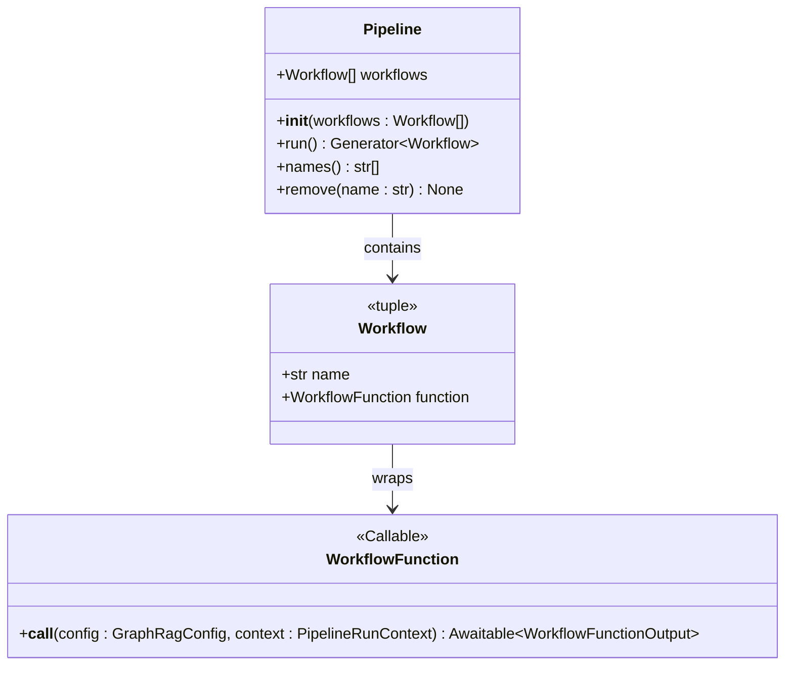
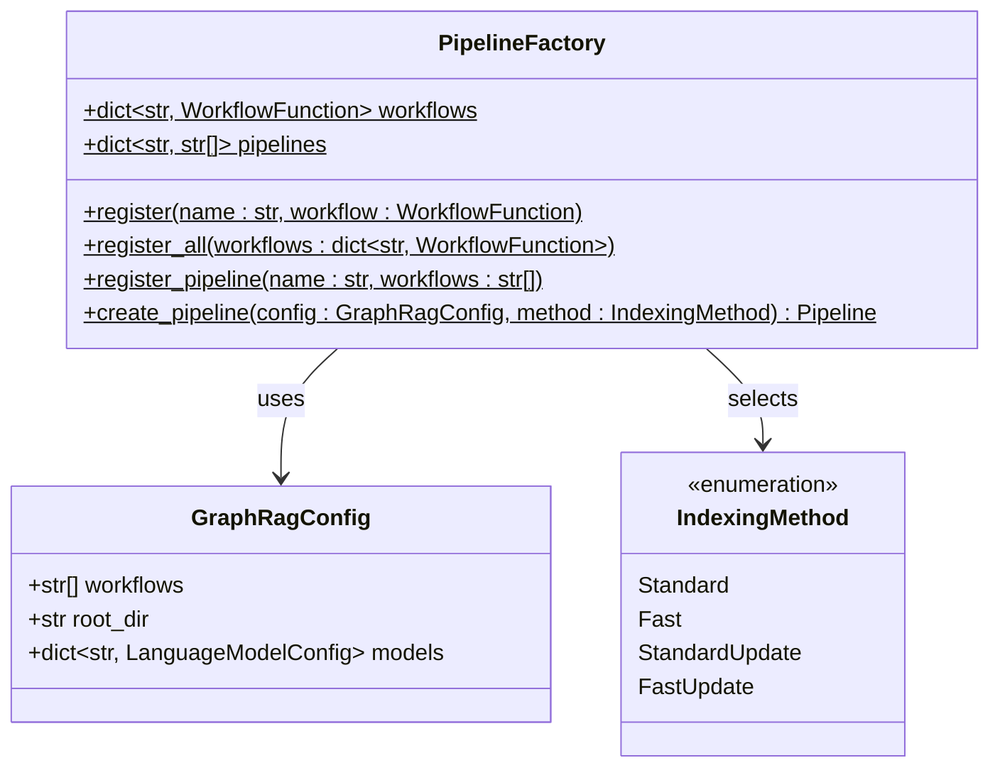
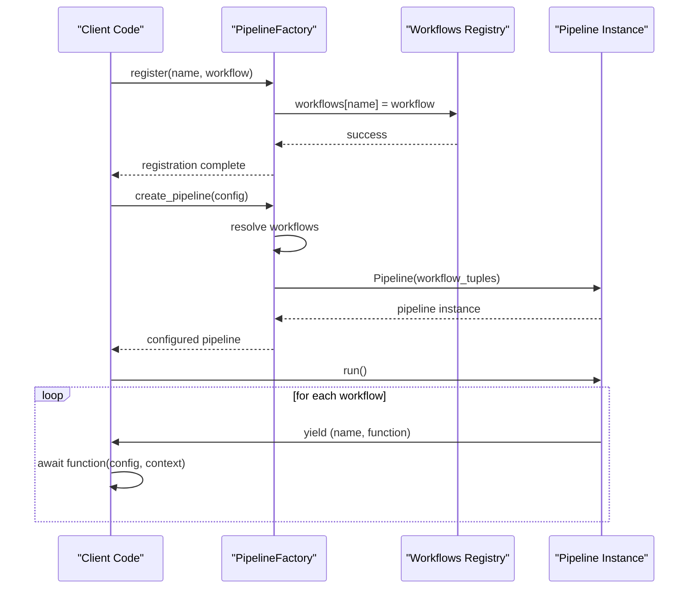
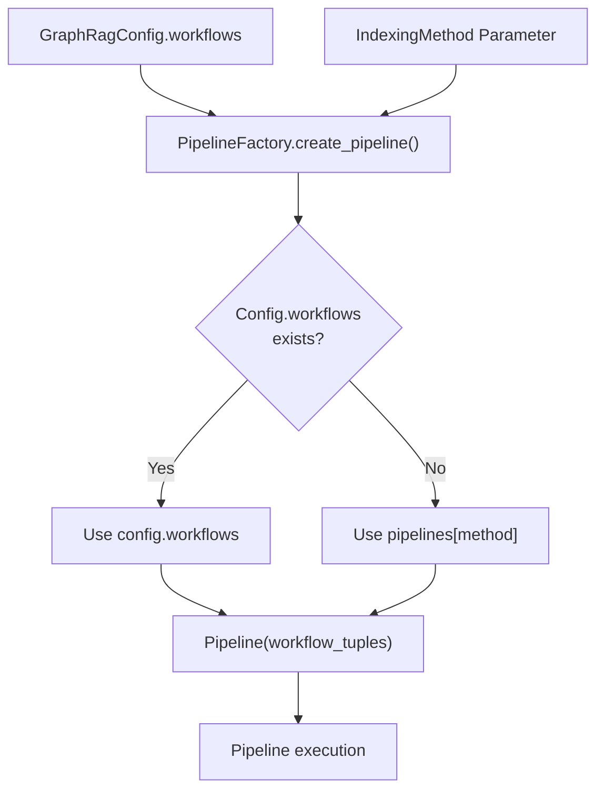
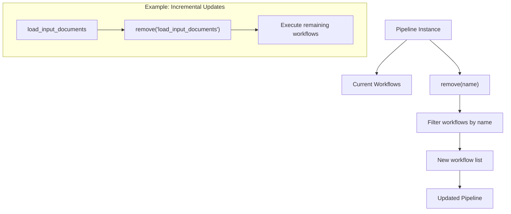
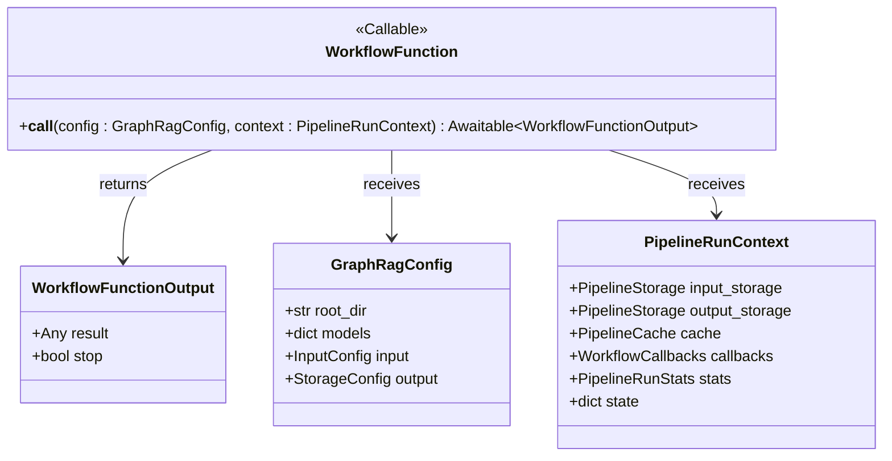
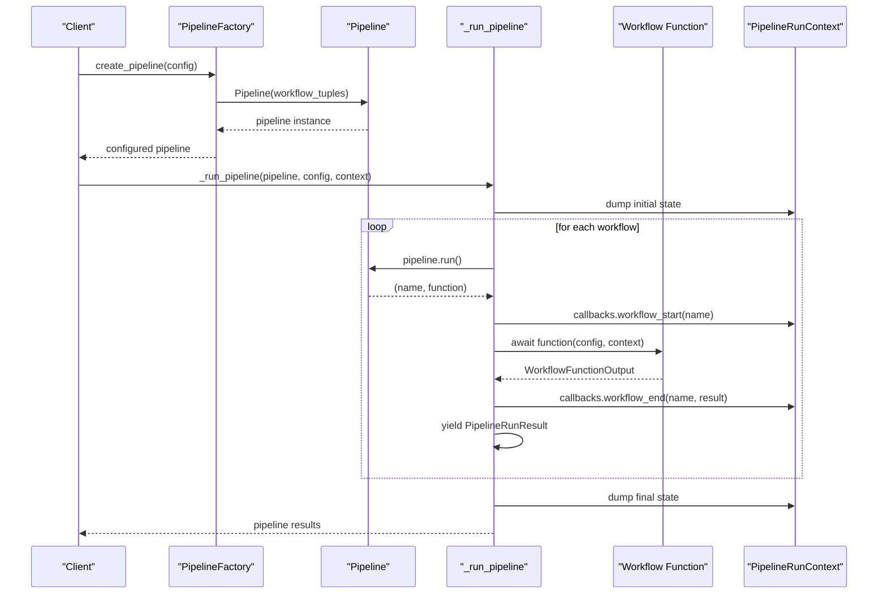

# Pipeline Creation

<cite>
**Referenced Files in This Document**
- [graphrag/index/workflows/factory.py](file://graphrag/index/workflows/factory.py)
- [graphrag/index/typing/pipeline.py](file://graphrag/index/typing/pipeline.py)
- [graphrag/index/typing/workflow.py](file://graphrag/index/typing/workflow.py)
- [graphrag/config/models/graph_rag_config.py](file://graphrag/config/models/graph_rag_config.py)
- [tests/verbs/test_pipeline_state.py](file://tests/verbs/test_pipeline_state.py)
- [graphrag/index/run/run_pipeline.py](file://graphrag/index/run/run_pipeline.py)
- [graphrag/index/workflows/create_base_text_units.py](file://graphrag/index/workflows/create_base_text_units.py)
- [graphrag/index/workflows/load_input_documents.py](file://graphrag/index/workflows/load_input_documents.py)
- [graphrag/index/workflows/__init__.py](file://graphrag/index/workflows/__init__.py)
</cite>

## Table of Contents
1. [Introduction](#introduction)
2. [Pipeline Class Architecture](#pipeline-class-architecture)
3. [PipelineFactory Pattern](#pipelinefactory-pattern)
4. [Workflow Registration Mechanism](#workflow-registration-mechanism)
5. [Configuration-Driven Pipeline Construction](#configuration-driven-pipeline-construction)
6. [Dynamic Workflow Modification](#dynamic-workflow-modification)
7. [Asynchronous Workflow Functions](#asynchronous-workflow-functions)
8. [Pipeline Execution Flow](#pipeline-execution-flow)
9. [Testing and Examples](#testing-and-examples)
10. [Best Practices](#best-practices)

## Introduction

The Pipeline Creation sub-component serves as the core orchestrator for GraphRAG's indexing and processing workflows. It provides a flexible, extensible framework for defining, registering, and executing complex data processing pipelines through a factory pattern implementation. The system enables dynamic workflow composition based on configuration-driven selections while maintaining type safety and asynchronous execution capabilities.

The pipeline architecture consists of three primary components: the Pipeline class that encapsulates workflow sequences, the PipelineFactory that manages workflow registration and pipeline construction, and the GraphRagConfig that drives workflow selection through configuration parameters. This design enables both built-in workflow sets and custom workflow extensions while maintaining clean separation of concerns.

## Pipeline Class Architecture

The Pipeline class serves as the fundamental container for workflow sequences, implementing a simple yet powerful design pattern for workflow orchestration.

**Diagram sources**
- [graphrag/index/typing/pipeline.py](file://graphrag/index/typing/pipeline.py#L11-L27)
- [graphrag/index/typing/workflow.py](file://graphrag/index/typing/workflow.py#L24-L29)

### Core Pipeline Features

The Pipeline class provides essential functionality for workflow management:

- **Initialization with Workflow Tuples**: Pipelines accept lists of `(name, function)` tuples representing named workflow functions
- **Generator-Based Execution**: The `run()` method returns a generator yielding workflow tuples for sequential execution
- **Name Retrieval**: The `names()` method extracts workflow names for monitoring and debugging
- **Dynamic Removal**: The `remove()` method enables runtime modification of pipeline composition

**Section sources**
- [graphrag/index/typing/pipeline.py](file://graphrag/index/typing/pipeline.py#L11-L27)

## PipelineFactory Pattern

The PipelineFactory implements a sophisticated factory pattern that manages workflow registration and pipeline construction through class-level dictionaries and methods.

**Diagram sources**
- [graphrag/index/workflows/factory.py](file://graphrag/index/workflows/factory.py#L17-L48)
- [graphrag/config/models/graph_rag_config.py](file://graphrag/config/models/graph_rag_config.py#L248-L252)

### Factory Methods and Capabilities

The PipelineFactory provides several key methods for pipeline management:

- **Single Workflow Registration**: The `register()` method adds individual workflow functions to the factory's registry
- **Bulk Registration**: The `register_all()` method accepts dictionaries of workflow functions for batch registration
- **Pipeline Definition**: The `register_pipeline()` method defines complete pipeline compositions
- **Pipeline Creation**: The `create_pipeline()` method constructs pipelines based on configuration and method parameters

**Section sources**
- [graphrag/index/workflows/factory.py](file://graphrag/index/workflows/factory.py#L24-L48)

## Workflow Registration Mechanism

The workflow registration mechanism enables both built-in and custom workflow integration through a centralized factory system.

**Diagram sources**
- [graphrag/index/workflows/factory.py](file://graphrag/index/workflows/factory.py#L24-L48)
- [tests/verbs/test_pipeline_state.py](file://tests/verbs/test_pipeline_state.py#L31-L54)

### Built-in Workflow Registration

The system automatically registers all built-in workflows during module initialization:

**Section sources**
- [graphrag/index/workflows/__init__.py](file://graphrag/index/workflows/__init__.py#L76-L100)

### Custom Workflow Registration

Custom workflows can be registered using the factory's registration methods:

**Section sources**
- [tests/verbs/test_pipeline_state.py](file://tests/verbs/test_pipeline_state.py#L31-L54)

## Configuration-Driven Pipeline Construction

The GraphRagConfig plays a central role in pipeline construction by providing configuration-driven workflow selection and customization.

**Diagram sources**
- [graphrag/index/workflows/factory.py](file://graphrag/index/workflows/factory.py#L40-L48)
- [graphrag/config/models/graph_rag_config.py](file://graphrag/config/models/graph_rag_config.py#L248-L252)

### Pipeline Definitions

The factory includes predefined pipeline configurations for different indexing methods:

**Section sources**
- [graphrag/index/workflows/factory.py](file://graphrag/index/workflows/factory.py#L52-L97)

### Configuration Override Behavior

The pipeline creation process follows a specific precedence order:
1. **Explicit Workflow List**: If `config.workflows` is specified, it takes precedence over all other configurations
2. **Method-Based Selection**: Otherwise, the factory looks up the pipeline associated with the specified indexing method
3. **Default Behavior**: Falls back to empty workflow list if neither is available

**Section sources**
- [graphrag/index/workflows/factory.py](file://graphrag/index/workflows/factory.py#L46-L47)

## Dynamic Workflow Modification

The Pipeline class provides runtime modification capabilities through the `remove()` method, enabling incremental updates and adaptive pipeline composition.

**Diagram sources**
- [graphrag/index/typing/pipeline.py](file://graphrag/index/typing/pipeline.py#L25-L27)
- [graphrag/index/run/run_pipeline.py](file://graphrag/index/run/run_pipeline.py#L69-L86)

### Incremental Update Patterns

The system demonstrates dynamic workflow modification during incremental updates:

**Section sources**
- [graphrag/index/run/run_pipeline.py](file://graphrag/index/run/run_pipeline.py#L69-L86)

### State Preservation During Modifications

The pipeline modification process maintains state integrity while removing specific workflows:

**Section sources**
- [tests/verbs/test_pipeline_state.py](file://tests/verbs/test_pipeline_state.py#L45-L54)

## Asynchronous Workflow Functions

All workflows in the system are implemented as asynchronous functions with standardized signatures and return patterns.

**Diagram sources**
- [graphrag/index/typing/workflow.py](file://graphrag/index/typing/workflow.py#L24-L29)
- [graphrag/index/workflows/create_base_text_units.py](file://graphrag/index/workflows/create_base_text_units.py#L25-L50)

### Workflow Function Signature

Each workflow function follows a consistent asynchronous signature pattern:

**Section sources**
- [graphrag/index/typing/workflow.py](file://graphrag/index/typing/workflow.py#L24-L29)

### Return Value Structure

Workflow functions return `WorkflowFunctionOutput` objects containing:
- **Result Data**: The primary output of the workflow function
- **Stop Flag**: Indicates whether subsequent workflows should be executed

**Section sources**
- [graphrag/index/typing/workflow.py](file://graphrag/index/typing/workflow.py#L14-L22)

### Example Workflow Implementation

The system includes numerous workflow examples demonstrating various patterns:

**Section sources**
- [graphrag/index/workflows/create_base_text_units.py](file://graphrag/index/workflows/create_base_text_units.py#L25-L50)
- [graphrag/index/workflows/load_input_documents.py](file://graphrag/index/workflows/load_input_documents.py#L21-L37)

## Pipeline Execution Flow

The pipeline execution system orchestrates workflow execution with comprehensive monitoring, error handling, and state management.

**Diagram sources**
- [graphrag/index/run/run_pipeline.py](file://graphrag/index/run/run_pipeline.py#L104-L139)
- [graphrag/index/workflows/factory.py](file://graphrag/index/workflows/factory.py#L40-L48)

### Execution Monitoring and Logging

The execution system provides comprehensive monitoring capabilities:

**Section sources**
- [graphrag/index/run/run_pipeline.py](file://graphrag/index/run/run_pipeline.py#L117-L139)

### Error Handling and Recovery

The pipeline execution includes robust error handling mechanisms:

**Section sources**
- [graphrag/index/run/run_pipeline.py](file://graphrag/index/run/run_pipeline.py#L135-L139)

## Testing and Examples

The system includes comprehensive testing that demonstrates pipeline creation and workflow execution patterns.

### Basic Pipeline State Management

The test suite demonstrates fundamental pipeline state management capabilities:

**Section sources**
- [tests/verbs/test_pipeline_state.py](file://tests/verbs/test_pipeline_state.py#L38-L54)

### Custom Workflow Registration Tests

The tests showcase custom workflow registration and execution:

**Section sources**
- [tests/verbs/test_pipeline_state.py](file://tests/verbs/test_pipeline_state.py#L31-L54)

### Pipeline Composition Examples

The system provides multiple examples of pipeline composition patterns:

**Section sources**
- [graphrag/index/workflows/factory.py](file://graphrag/index/workflows/factory.py#L52-L97)

## Best Practices

### Workflow Design Guidelines

When designing custom workflows, follow these established patterns:

1. **Async Function Signatures**: Always use the standard `(config: GraphRagConfig, context: PipelineRunContext) -> Awaitable[WorkflowFunctionOutput]` signature
2. **State Management**: Utilize the context state dictionary for inter-workflow communication
3. **Error Handling**: Return appropriate error information through the WorkflowFunctionOutput structure
4. **Resource Cleanup**: Implement proper cleanup in workflow functions

### Pipeline Construction Patterns

For optimal pipeline construction:

1. **Configuration-Driven Selection**: Prefer using GraphRagConfig.workflows for explicit control
2. **Method-Based Selection**: Use IndexingMethod parameters for standard workflow sets
3. **Dynamic Modification**: Leverage the remove() method for incremental updates
4. **State Preservation**: Ensure state integrity during pipeline modifications

### Registration Strategies

Effective workflow registration follows these patterns:

1. **Bulk Registration**: Use `register_all()` for registering multiple workflows
2. **Pipeline Definitions**: Define complete pipeline compositions for reuse
3. **Naming Conventions**: Use descriptive, consistent naming for workflows and pipelines
4. **Documentation**: Document custom workflows with clear purpose and interface descriptions