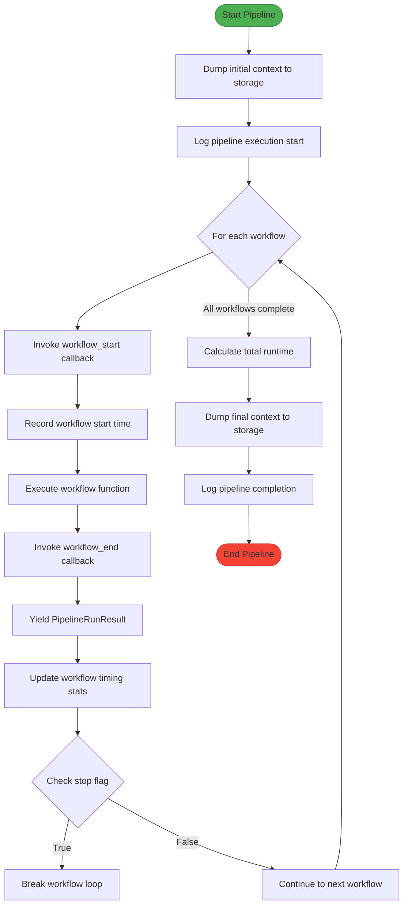
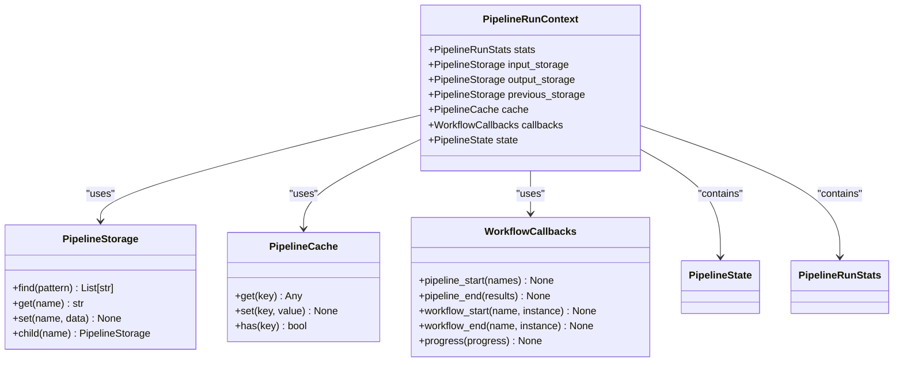
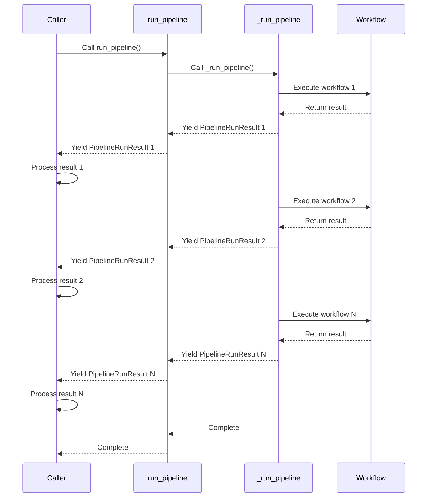
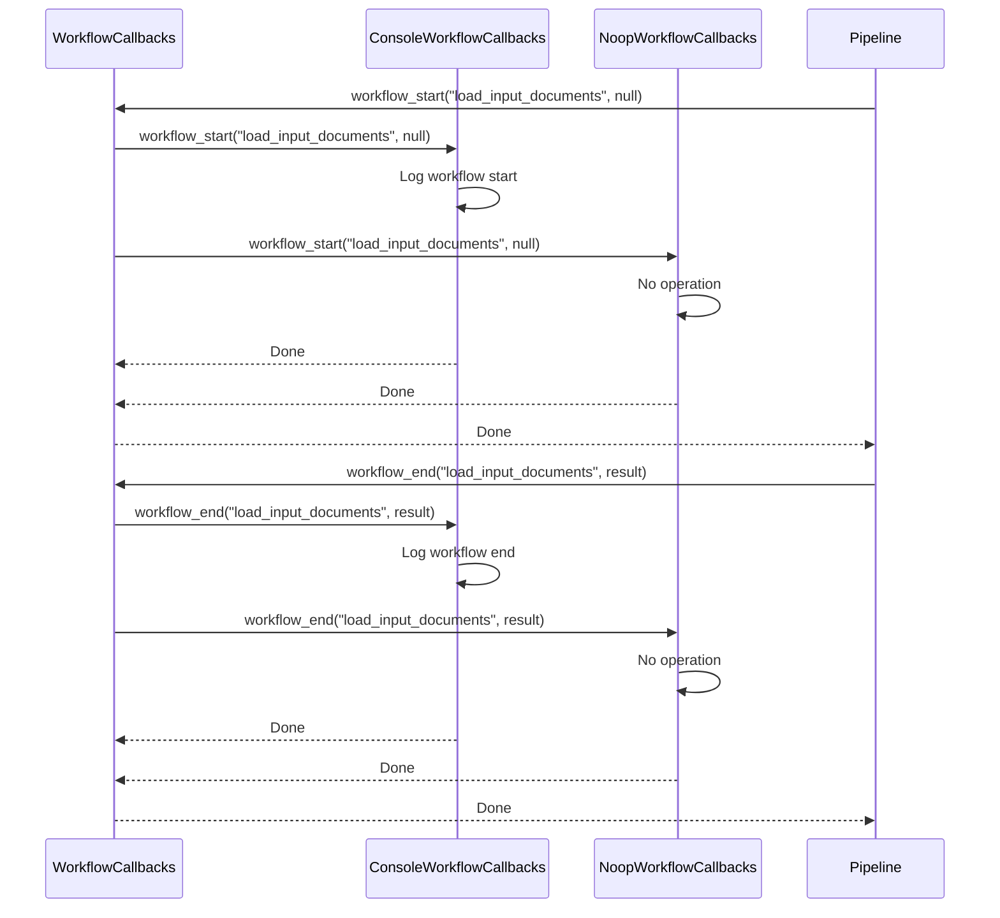
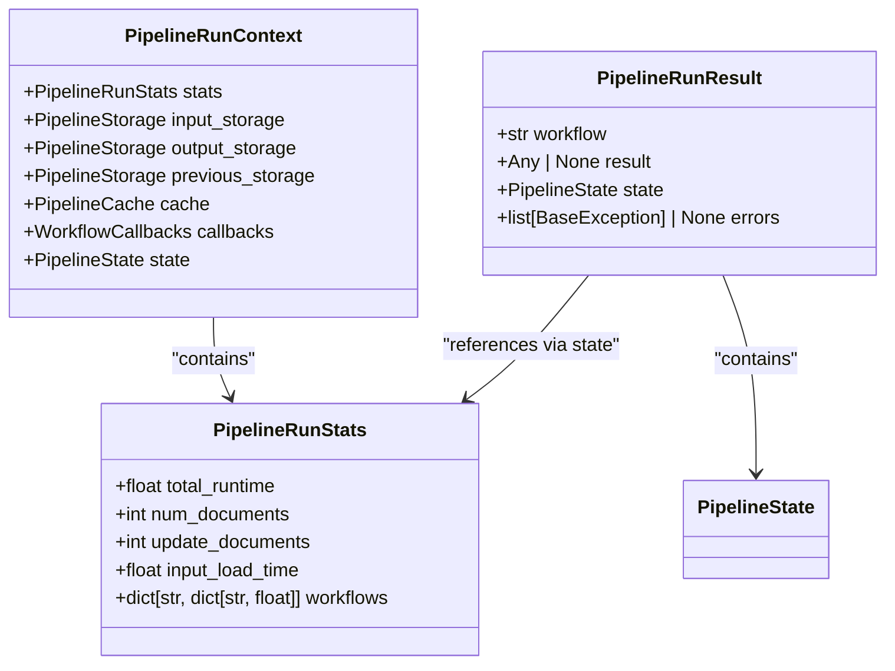
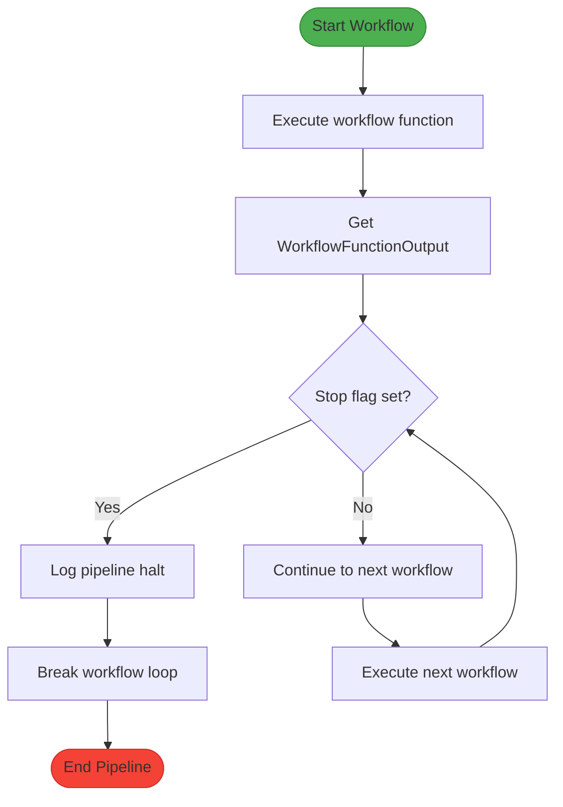
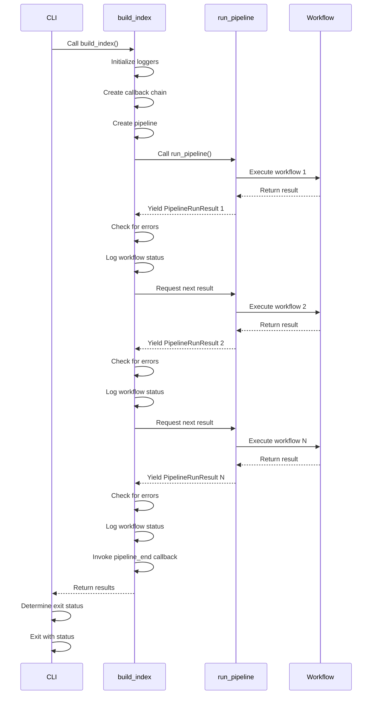

# Pipeline Execution

<cite>
**Referenced Files in This Document**   
- [run_pipeline.py](file://graphrag/index/run/run_pipeline.py)
- [pipeline_run_result.py](file://graphrag/index/typing/pipeline_run_result.py)
- [workflow.py](file://graphrag/index/typing/workflow.py)
- [context.py](file://graphrag/index/typing/context.py)
- [stats.py](file://graphrag/index/typing/stats.py)
- [utils.py](file://graphrag/index/run/utils.py)
- [load_input_documents.py](file://graphrag/index/workflows/load_input_documents.py)
- [extract_graph.py](file://graphrag/index/workflows/extract_graph.py)
- [prune_graph.py](file://graphrag/index/workflows/prune_graph.py)
- [load_update_documents.py](file://graphrag/index/workflows/load_update_documents.py)
- [workflow_callbacks.py](file://graphrag/callbacks/workflow_callbacks.py)
- [index.py](file://graphrag/api/index.py)
- [main.py](file://graphrag/cli/main.py)
</cite>

## Table of Contents
1. [Pipeline Execution Overview](#pipeline-execution-overview)
2. [Execution Flow in _run_pipeline()](#execution-flow-in-_run_pipeline)
3. [Execution Environment Setup](#execution-environment-setup)
4. [Async Generator Pattern](#async-generator-pattern)
5. [Callback Invocation](#callback-invocation)
6. [Stats Accumulation](#stats-accumulation)
7. [Stop Flag Significance](#stop-flag-significance)
8. [CLI Integration Examples](#cli-integration-examples)
9. [Conclusion](#conclusion)

## Pipeline Execution Overview

The pipeline execution system in GraphRAG orchestrates the processing of documents through a series of workflows to create a knowledge graph index. The core execution is managed by the `run_pipeline()` function, which coordinates the invocation of workflow functions with appropriate configuration and context. The system captures timing information, errors, and state changes throughout the execution process, providing comprehensive monitoring and debugging capabilities.

**Section sources**
- [run_pipeline.py](file://graphrag/index/run/run_pipeline.py#L29-L168)

## Execution Flow in _run_pipeline()

The `_run_pipeline()` function implements the core execution logic for the GraphRAG indexing pipeline. It processes workflows sequentially, invoking each workflow function with the provided configuration and context. The execution flow begins with dumping the initial context state to storage, then iterates through each workflow in the pipeline.

For each workflow, the system first invokes the `workflow_start` callback to signal the beginning of the workflow execution. It then records the start time and invokes the workflow function asynchronously. After the workflow completes, the `workflow_end` callback is invoked, and a `PipelineRunResult` is yielded with the workflow name, result, current state, and any errors.

The execution flow includes error handling through a try-except block that captures any exceptions during workflow execution. If an error occurs, a `PipelineRunResult` with the error information is yielded. After all workflows complete (or if an error occurs), the total runtime is calculated and stored in the stats object, and the final context state is dumped to storage.

**Diagram sources **
- [run_pipeline.py](file://graphrag/index/run/run_pipeline.py#L104-L139)

**Section sources**
- [run_pipeline.py](file://graphrag/index/run/run_pipeline.py#L104-L139)

## Execution Environment Setup

The `run_pipeline()` function sets up the execution environment by creating storage and cache instances from the provided configuration. This setup occurs at the beginning of the function and establishes the infrastructure needed for the pipeline execution.

The function creates three key components: input storage, output storage, and cache. The input storage is created from the input storage configuration and is used to access input documents. The output storage is created from the output configuration and serves as the long-term storage for pipeline outputs. The cache is created from the cache configuration and is used for storing and retrieving previous LLM responses to avoid redundant processing.

For update runs, additional storage instances are created to manage the incremental indexing process. This includes a delta storage for the new subset index and a previous storage for backing up the previous output. The function also loads the existing state from the output storage, allowing workflows to be stateful and maintain context between runs.

**Diagram sources **
- [run_pipeline.py](file://graphrag/index/run/run_pipeline.py#L29-L102)
- [context.py](file://graphrag/index/typing/context.py#L16-L33)

**Section sources**
- [run_pipeline.py](file://graphrag/index/run/run_pipeline.py#L29-L102)

## Async Generator Pattern

The pipeline execution system uses an async generator pattern to yield `PipelineRunResult` objects for each completed workflow. This pattern allows the caller to process results as they become available, rather than waiting for the entire pipeline to complete.

The `run_pipeline()` function returns an `AsyncIterable[PipelineRunResult]`, enabling asynchronous iteration over the results. As each workflow completes, a `PipelineRunResult` is yielded containing the workflow name, result, current state, and any errors. This approach provides several benefits:

1. **Memory efficiency**: Results are processed incrementally rather than storing all results in memory
2. **Real-time monitoring**: Callers can monitor progress and respond to results immediately
3. **Error handling**: Errors can be detected and handled as they occur
4. **Flexibility**: Callers can choose to process all results or stop processing based on intermediate results

The async generator pattern is implemented in the `run_pipeline()` function, which delegates to the `_run_pipeline()` function and yields each result as it is produced. This allows the pipeline execution to be both efficient and responsive.

**Diagram sources **
- [run_pipeline.py](file://graphrag/index/run/run_pipeline.py#L29-L168)
- [pipeline_run_result.py](file://graphrag/index/typing/pipeline_run_result.py#L12-L23)

**Section sources**
- [run_pipeline.py](file://graphrag/index/run/run_pipeline.py#L29-L168)

## Callback Invocation

The pipeline execution system invokes callbacks at key points during workflow execution, providing hooks for monitoring and logging. The system uses the `WorkflowCallbacks` protocol to define the callback interface, allowing for flexible implementation of monitoring and logging functionality.

At the start of each workflow, the `workflow_start` callback is invoked with the workflow name and instance. This callback is used to signal the beginning of workflow execution and can be used for logging or progress tracking. At the end of each workflow, the `workflow_end` callback is invoked with the workflow name and result. This callback is used to signal the completion of workflow execution and can be used for logging or cleanup operations.

The callback system is designed to be extensible, allowing multiple callback implementations to be registered and invoked. The `WorkflowCallbacksManager` class implements the `WorkflowCallbacks` protocol and can register multiple callback instances, invoking them in sequence. This allows for multiple monitoring and logging systems to be used simultaneously.

**Diagram sources **
- [workflow_callbacks.py](file://graphrag/callbacks/workflow_callbacks.py#L12-L37)
- [run_pipeline.py](file://graphrag/index/run/run_pipeline.py#L119-L122)

**Section sources**
- [workflow_callbacks.py](file://graphrag/callbacks/workflow_callbacks.py#L12-L37)
- [run_pipeline.py](file://graphrag/index/run/run_pipeline.py#L119-L122)

## Stats Accumulation

The pipeline execution system accumulates statistics throughout the execution process, providing detailed timing and performance information. The `PipelineRunStats` class contains fields for tracking various metrics, including total runtime, number of documents, input load time, and workflow execution times.

Timing information is captured at multiple levels. The total runtime is calculated as the difference between the start time of the pipeline and the completion time. For each workflow, the execution time is calculated as the difference between the start and end times of the workflow. These timing metrics are stored in the `workflows` dictionary of the stats object, with each workflow name as a key and its execution time as the value.

The stats accumulation occurs in the `_run_pipeline()` function, where the start time is recorded before executing each workflow, and the elapsed time is stored in the stats object after the workflow completes. The total runtime is calculated and stored after all workflows complete. This statistical information is periodically dumped to storage in JSON format, allowing for post-execution analysis and monitoring.

**Diagram sources **
- [stats.py](file://graphrag/index/typing/stats.py#L9-L26)
- [context.py](file://graphrag/index/typing/context.py#L16-L33)
- [pipeline_run_result.py](file://graphrag/index/typing/pipeline_run_result.py#L12-L23)

**Section sources**
- [stats.py](file://graphrag/index/typing/stats.py#L9-L26)
- [run_pipeline.py](file://graphrag/index/run/run_pipeline.py#L126-L131)

## Stop Flag Significance

The stop flag in `WorkflowFunctionOutput` plays a crucial role in controlling pipeline execution flow. When a workflow sets the `stop` flag to `True`, it signals that the pipeline should halt execution after the current workflow completes. This mechanism allows workflows to terminate the pipeline when continuation could cause unstable failures or when certain conditions are met.

The stop flag is particularly useful in scenarios where a workflow detects an error condition that makes further processing invalid or when a workflow determines that subsequent steps are unnecessary. For example, the `load_update_documents` workflow uses the stop flag when input documents are provided directly to the pipeline, as this bypasses the need for subsequent document loading workflows.

The stop flag is checked after each workflow completes in the `_run_pipeline()` function. If the flag is set, a log message is generated indicating that the pipeline is halting at the workflow's request, and the workflow loop is broken. This ensures that no further workflows are executed, preventing potential errors or inconsistent states.

**Diagram sources **
- [workflow.py](file://graphrag/index/typing/workflow.py#L14-L28)
- [run_pipeline.py](file://graphrag/index/run/run_pipeline.py#L127-L129)

**Section sources**
- [workflow.py](file://graphrag/index/typing/workflow.py#L14-L28)
- [run_pipeline.py](file://graphrag/index/run/run_pipeline.py#L127-L129)
- [load_update_documents.py](file://graphrag/index/workflows/load_update_documents.py#L37)

## CLI Integration Examples

The pipeline execution system is integrated with the CLI through the `build_index()` function in the API module. This integration demonstrates how the pipeline is executed in real-world scenarios, providing a practical example of the execution flow.

When the `index` command is invoked through the CLI, the `build_index()` function is called with the appropriate configuration and parameters. The function initializes loggers, creates a callback chain from the provided callbacks (or uses a no-op implementation if none are provided), and creates the pipeline using the `PipelineFactory`. It then invokes the `run_pipeline()` function and processes the results as they are yielded.

The CLI integration includes error handling that checks each `PipelineRunResult` for errors and logs appropriate messages. After all workflows complete, the `pipeline_end` callback is invoked with the list of all results, allowing for final processing or reporting. The CLI then exits with a status code indicating success or failure based on whether any errors occurred during execution.

**Diagram sources **
- [index.py](file://graphrag/api/index.py#L29-L96)
- [main.py](file://graphrag/cli/main.py#L119-L204)
- [run_pipeline.py](file://graphrag/index/run/run_pipeline.py#L29-L168)

**Section sources**
- [index.py](file://graphrag/api/index.py#L29-L96)
- [main.py](file://graphrag/cli/main.py#L119-L204)

## Conclusion

The pipeline execution system in GraphRAG provides a robust framework for processing documents through a series of workflows to create a knowledge graph index. The system's design emphasizes flexibility, monitoring, and error handling, making it suitable for complex indexing tasks.

Key features of the execution system include the async generator pattern for efficient result processing, comprehensive callback mechanisms for monitoring and logging, detailed statistics accumulation for performance analysis, and the stop flag mechanism for controlled pipeline termination. The integration with the CLI demonstrates how these features work together in real-world scenarios, providing a practical example of the system's capabilities.

The execution environment setup ensures that workflows have access to the necessary storage and cache instances, while the state management allows for persistent context between runs. This comprehensive approach to pipeline execution enables reliable and efficient creation of knowledge graph indexes, with detailed monitoring and error handling throughout the process.

**Section sources**
- [run_pipeline.py](file://graphrag/index/run/run_pipeline.py#L29-L168)
- [api/index.py](file://graphrag/api/index.py#L29-L96)
- [cli/main.py](file://graphrag/cli/main.py#L119-L204)