# Pipeline Orchestration System Architecture

<cite>
**Referenced Files in This Document**
- [pipeline.py](file://graphrag/index/typing/pipeline.py)
- [run_pipeline.py](file://graphrag/index/run/run_pipeline.py)
- [workflow.py](file://graphrag/index/typing/workflow.py)
- [context.py](file://graphrag/index/typing/context.py)
- [state.py](file://graphrag/index/typing/state.py)
- [stats.py](file://graphrag/index/typing/stats.py)
- [pipeline_run_result.py](file://graphrag/index/typing/pipeline_run_result.py)
- [factory.py](file://graphrag/index/workflows/factory.py)
- [incremental_index.py](file://graphrag/index/update/incremental_index.py)
- [load_input_documents.py](file://graphrag/index/workflows/load_input_documents.py)
- [create_base_text_units.py](file://graphrag/index/workflows/create_base_text_units.py)
- [update_communities.py](file://graphrag/index/workflows/update_communities.py)
- [update_final_documents.py](file://graphrag/index/workflows/update_final_documents.py)
- [update_community_reports.py](file://graphrag/index/workflows/update_community_reports.py)
</cite>

## Table of Contents
1. [Introduction](#introduction)
2. [System Architecture Overview](#system-architecture-overview)
3. [Core Pipeline Components](#core-pipeline-components)
4. [Execution Engine](#execution-engine)
5. [Incremental Indexing System](#incremental-indexing-system)
6. [State Management](#state-management)
7. [Error Handling Mechanism](#error-handling-mechanism)
8. [Workflow Factory Pattern](#workflow-factory-pattern)
9. [Storage and Persistence](#storage-and-persistence)
10. [Performance Monitoring](#performance-monitoring)
11. [Stop Signal Handling](#stop-signal-handling)
12. [Practical Examples](#practical-examples)
13. [Best Practices](#best-practices)

## Introduction

The Pipeline Orchestration system in GraphRAG provides a sophisticated framework for managing complex data processing workflows. At its core, the system encapsulates sequences of workflow functions that transform input data through multiple stages, maintaining state persistence, handling incremental updates, and providing comprehensive monitoring and error recovery capabilities.

The pipeline serves as the central orchestrator for the entire indexing process, managing the execution flow of various specialized workflows while ensuring data consistency, performance tracking, and graceful error handling throughout the processing lifecycle.

## System Architecture Overview

The Pipeline Orchestration system follows a layered architecture with clear separation of concerns:

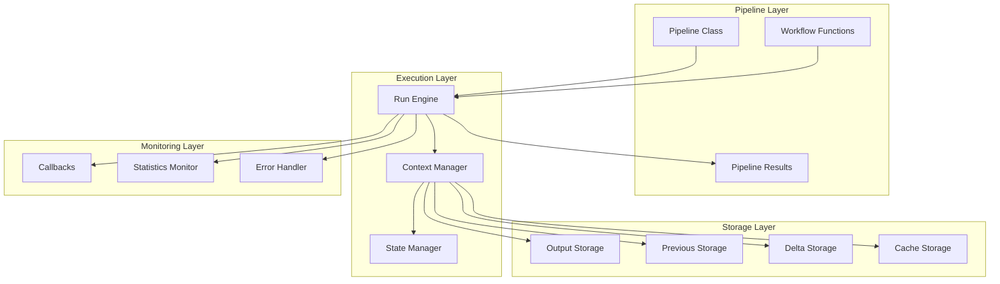

**Diagram sources**
- [pipeline.py](file://graphrag/index/typing/pipeline.py#L11-L27)
- [run_pipeline.py](file://graphrag/index/run/run_pipeline.py#L104-L139)
- [context.py](file://graphrag/index/typing/context.py#L16-L33)

## Core Pipeline Components

### Pipeline Class

The [`Pipeline`](file://graphrag/index/typing/pipeline.py#L11-L27) class serves as the primary orchestrator, encapsulating a sequence of workflow functions:

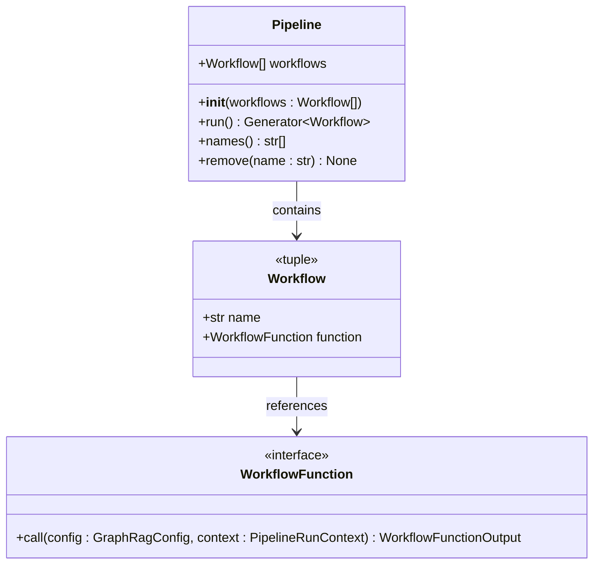

**Diagram sources**
- [pipeline.py](file://graphrag/index/typing/pipeline.py#L11-L27)
- [workflow.py](file://graphrag/index/typing/workflow.py#L24-L28)

The Pipeline class provides three essential methods:
- **run()**: Returns a generator over the pipeline workflows
- **names()**: Retrieves workflow names for monitoring and debugging
- **remove()**: Dynamically removes workflows from the execution sequence

**Section sources**
- [pipeline.py](file://graphrag/index/typing/pipeline.py#L11-L27)

### Workflow Function Structure

Each workflow function follows a standardized signature and return pattern:

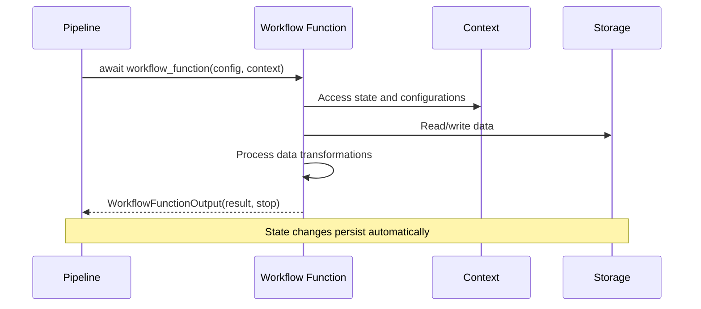

**Diagram sources**
- [workflow.py](file://graphrag/index/typing/workflow.py#L14-L22)
- [run_pipeline.py](file://graphrag/index/run/run_pipeline.py#L117-L122)

**Section sources**
- [workflow.py](file://graphrag/index/typing/workflow.py#L14-L29)

## Execution Engine

### Pipeline Execution Flow

The `_run_pipeline()` function implements the core execution engine that manages workflow invocation and state coordination:

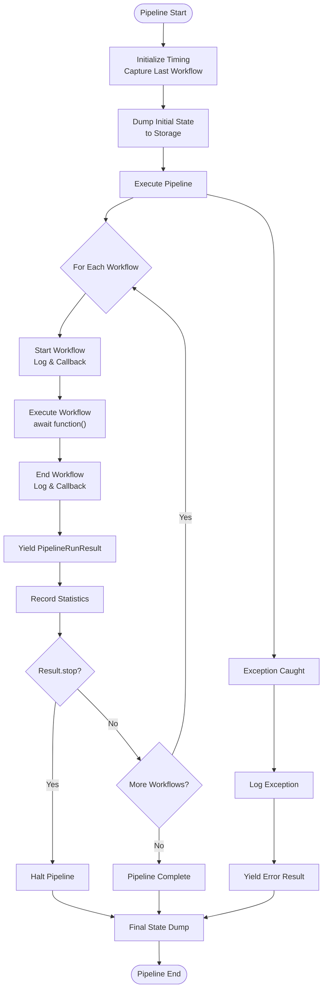

**Diagram sources**
- [run_pipeline.py](file://graphrag/index/run/run_pipeline.py#L104-L139)

The execution engine provides several key capabilities:

1. **Timing Management**: Tracks individual workflow execution times and total pipeline runtime
2. **State Persistence**: Automatically saves context state after each workflow completion
3. **Callback Integration**: Coordinates with monitoring and logging systems
4. **Graceful Degradation**: Continues execution when possible after recoverable errors

**Section sources**
- [run_pipeline.py](file://graphrag/index/run/run_pipeline.py#L104-L139)

### Context Management

The [`PipelineRunContext`](file://graphrag/index/typing/context.py#L16-L33) provides comprehensive runtime environment:

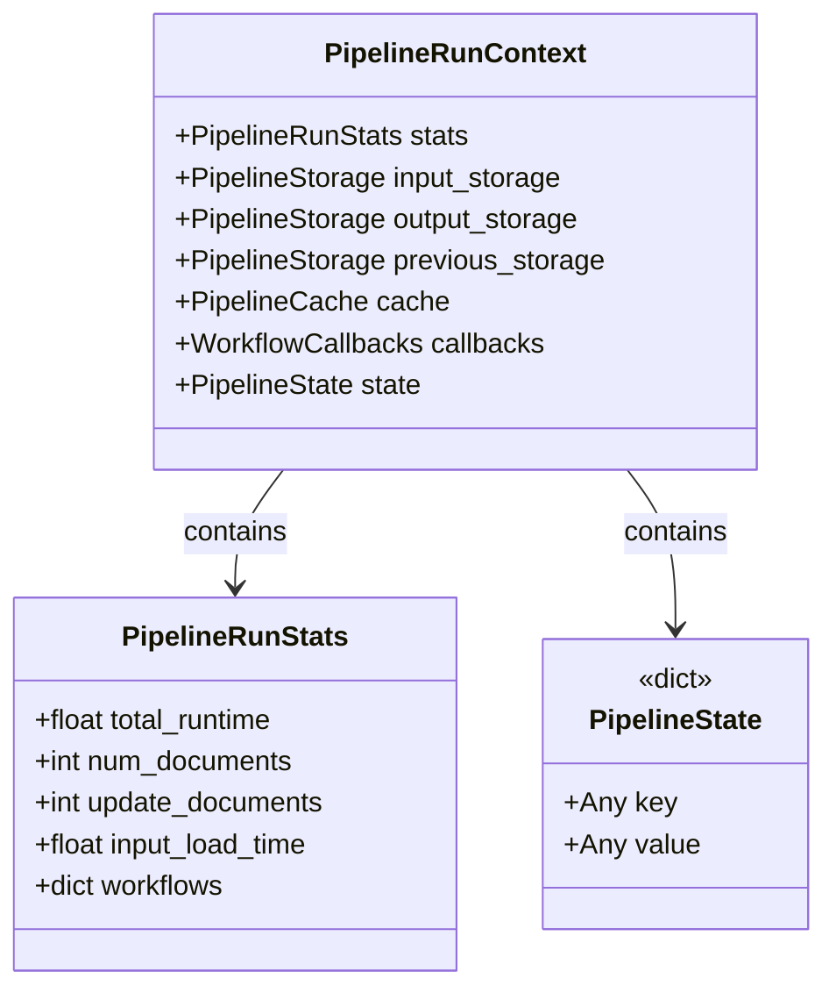

**Diagram sources**
- [context.py](file://graphrag/index/typing/context.py#L16-L33)
- [stats.py](file://graphrag/index/typing/stats.py#L9-L26)
- [state.py](file://graphrag/index/typing/state.py#L8-L8)

**Section sources**
- [context.py](file://graphrag/index/typing/context.py#L16-L33)
- [stats.py](file://graphrag/index/typing/stats.py#L9-L26)

## Incremental Indexing System

### Storage Path Management

The system manages three distinct storage locations for incremental updates:

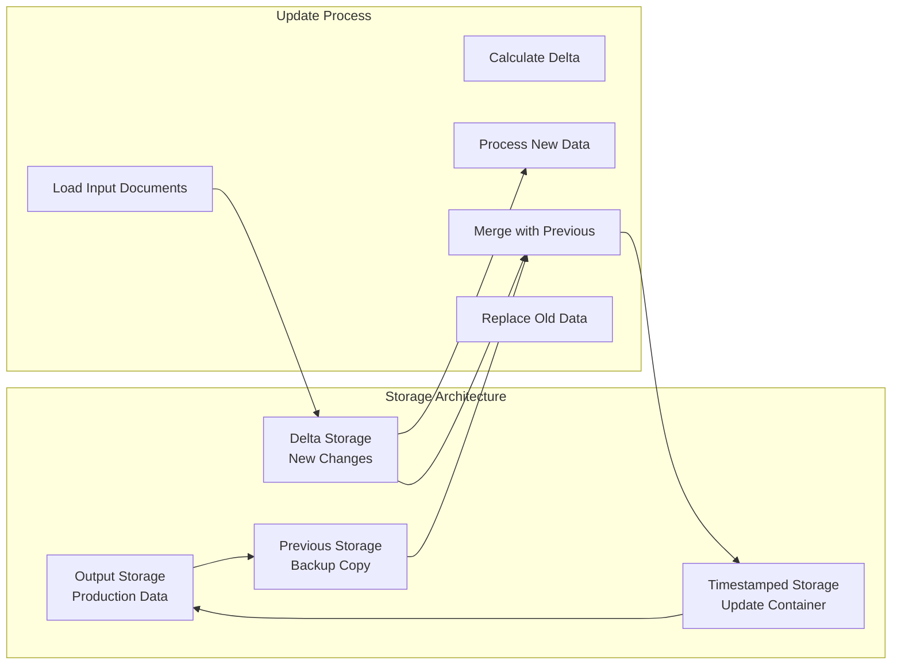

**Diagram sources**
- [run_pipeline.py](file://graphrag/index/run/run_pipeline.py#L54-L62)
- [incremental_index.py](file://graphrag/index/update/incremental_index.py#L34-L84)

### Delta Calculation Process

The incremental indexing system calculates differences between current and previous datasets:

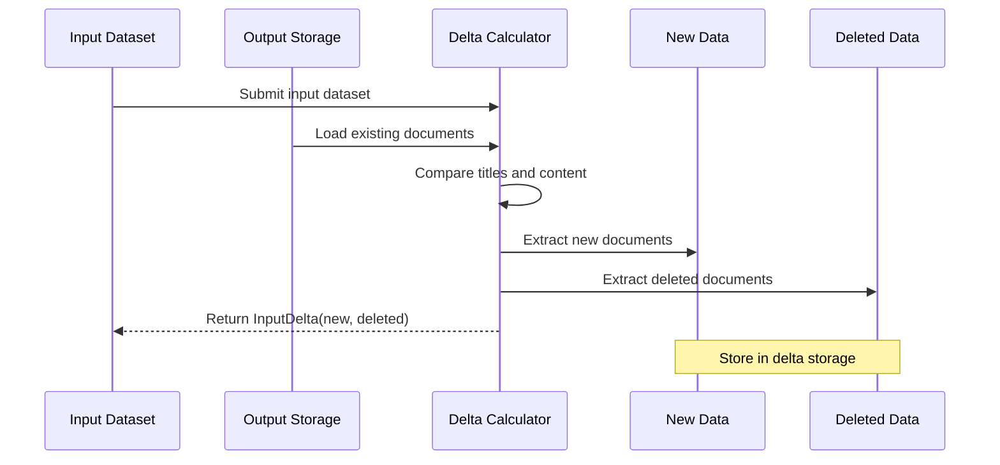

**Diagram sources**
- [incremental_index.py](file://graphrag/index/update/incremental_index.py#L34-L63)

**Section sources**
- [run_pipeline.py](file://graphrag/index/run/run_pipeline.py#L54-L62)
- [incremental_index.py](file://graphrag/index/update/incremental_index.py#L34-L84)

## State Management

### State Persistence Mechanism

The system maintains persistent state across pipeline executions through automatic JSON serialization:

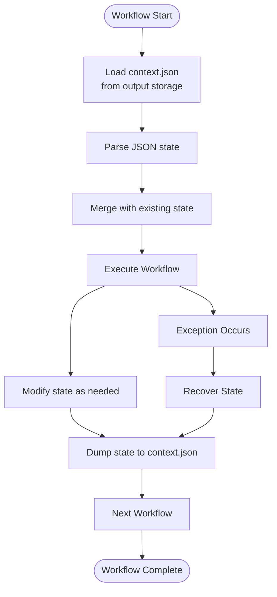

**Diagram sources**
- [run_pipeline.py](file://graphrag/index/run/run_pipeline.py#L142-L157)

### State Structure and Usage

The [`PipelineState`](file://graphrag/index/typing/state.py#L8-L8) is implemented as a flexible dictionary that can store:

- **Runtime Variables**: Temporary data shared between workflows
- **Persistent Computations**: Pre-computed values for reuse
- **Experimental Features**: Feature flags and experimental settings
- **Update Metadata**: Information about incremental updates

**Section sources**
- [state.py](file://graphrag/index/typing/state.py#L8-L8)
- [run_pipeline.py](file://graphrag/index/run/run_pipeline.py#L142-L157)

## Error Handling Mechanism

### Exception Capture and Reporting

The pipeline implements comprehensive error handling that captures exceptions and provides detailed error reporting:

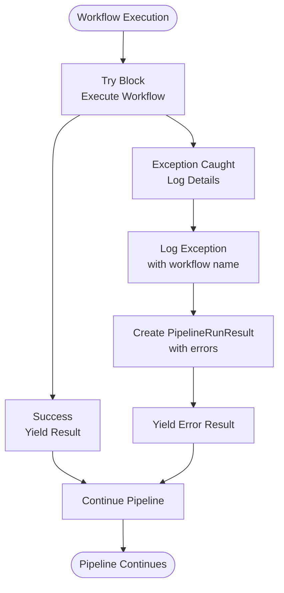

**Diagram sources**
- [run_pipeline.py](file://graphrag/index/run/run_pipeline.py#L135-L139)

### Error Result Structure

Each error condition produces a [`PipelineRunResult`](file://graphrag/index/typing/pipeline_run_result.py#L11-L21) containing:

- **Workflow Name**: Identifies the failing workflow
- **Null Result**: Indicates failure state
- **Current State**: Preserves partial progress
- **Error List**: Contains exception details for debugging

**Section sources**
- [run_pipeline.py](file://graphrag/index/run/run_pipeline.py#L135-L139)
- [pipeline_run_result.py](file://graphrag/index/typing/pipeline_run_result.py#L11-L21)

## Workflow Factory Pattern

### Pipeline Factory Architecture

The [`PipelineFactory`](file://graphrag/index/workflows/factory.py#L17-L98) implements a factory pattern for creating different pipeline configurations:

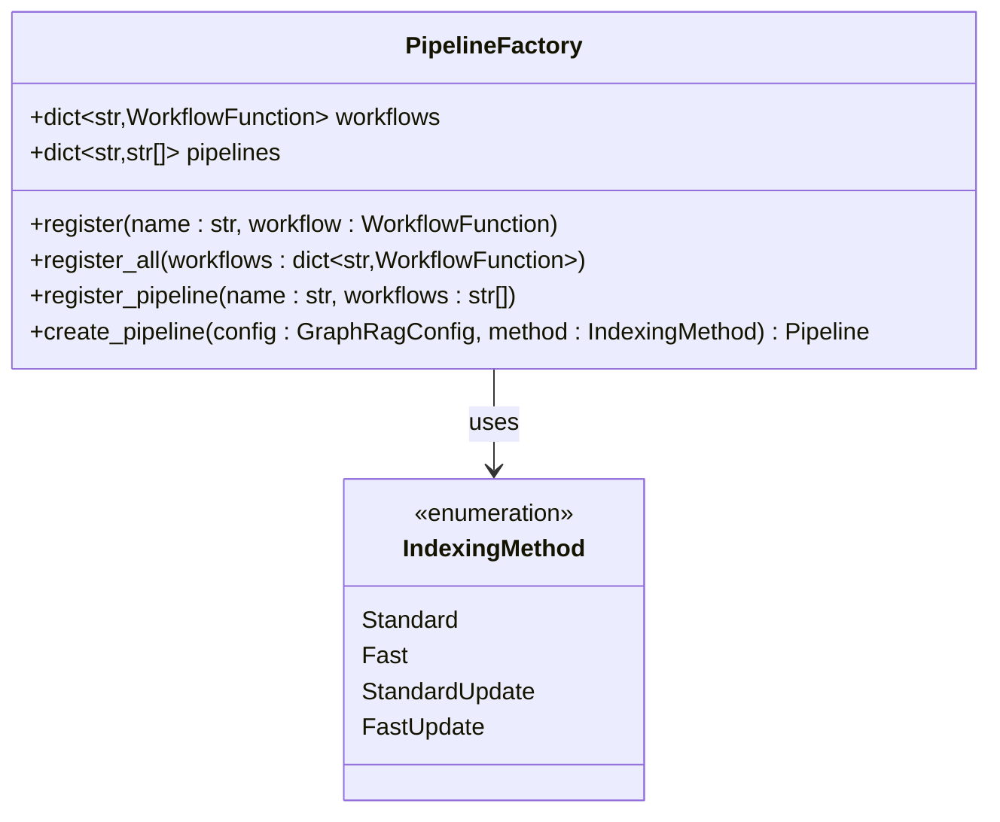

**Diagram sources**
- [factory.py](file://graphrag/index/workflows/factory.py#L17-L98)

### Built-in Pipeline Configurations

The factory provides four predefined pipeline configurations:

| Method | Description | Workflows |
|--------|-------------|-----------|
| Standard | Full processing pipeline | 9 standard workflows |
| Fast | Optimized processing | 9 fast workflows |
| StandardUpdate | Incremental updates | Load + 9 standard + 8 update workflows |
| FastUpdate | Fast incremental updates | Load + 9 fast + 8 update workflows |

**Section sources**
- [factory.py](file://graphrag/index/workflows/factory.py#L52-L98)

## Storage and Persistence

### Storage Interface Abstraction

The system provides a unified storage interface supporting multiple backends:

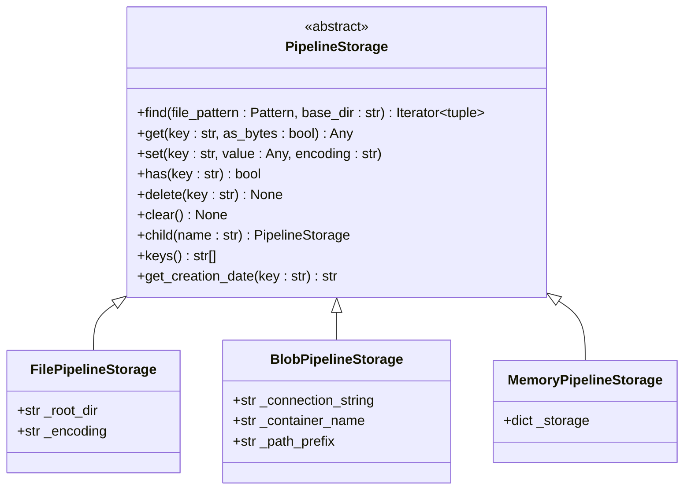

**Diagram sources**
- [pipeline_storage.py](file://graphrag/storage/pipeline_storage.py#L12-L91)

### Storage Path Organization

During incremental updates, the system organizes storage in a hierarchical structure:

```
update_timestamp/
├── delta/           # New/modified data
├── previous/        # Backup of old data
└── merged/          # Final merged result
```

**Section sources**
- [run_pipeline.py](file://graphrag/index/run/run_pipeline.py#L56-L62)

## Performance Monitoring

### Statistics Collection

The system tracks comprehensive performance metrics:

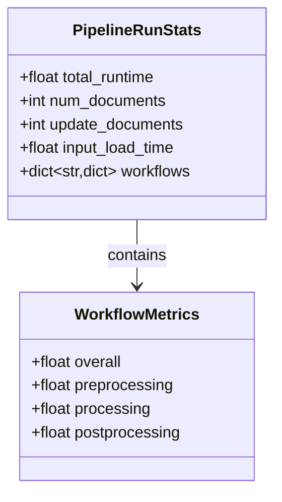

**Diagram sources**
- [stats.py](file://graphrag/index/typing/stats.py#L9-L26)

### Metrics Tracking

Each workflow execution records:
- **Overall Runtime**: Total time spent in the workflow
- **Individual Steps**: Breakdown of preprocessing, processing, and postprocessing
- **Document Counts**: Number of processed documents
- **Memory Usage**: Peak memory consumption (via callbacks)

**Section sources**
- [stats.py](file://graphrag/index/typing/stats.py#L9-L26)
- [run_pipeline.py](file://graphrag/index/run/run_pipeline.py#L126-L126)

## Stop Signal Handling

### Graceful Pipeline Termination

Workflows can request early termination by setting the `stop` flag in their return value:

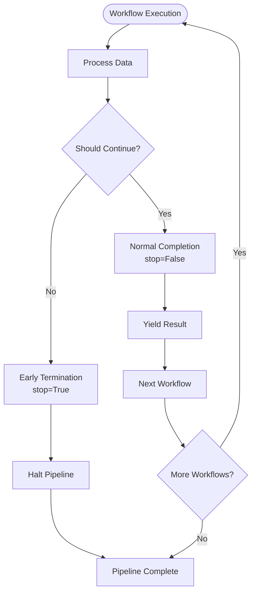

**Diagram sources**
- [workflow.py](file://graphrag/index/typing/workflow.py#L20-L21)
- [run_pipeline.py](file://graphrag/index/run/run_pipeline.py#L127-L129)

### Stop Signal Propagation

When a workflow sets `stop=True`, the pipeline immediately terminates execution and yields the current state, allowing for:

- **Partial Success Recovery**: Resume from the last successful workflow
- **Resource Cleanup**: Proper cleanup of partially processed data
- **Error Isolation**: Prevent cascade failures in dependent workflows

**Section sources**
- [workflow.py](file://graphrag/index/typing/workflow.py#L20-L21)
- [run_pipeline.py](file://graphrag/index/run/run_pipeline.py#L127-L129)

## Practical Examples

### Basic Pipeline Execution

Here's how a typical pipeline executes through multiple workflows:

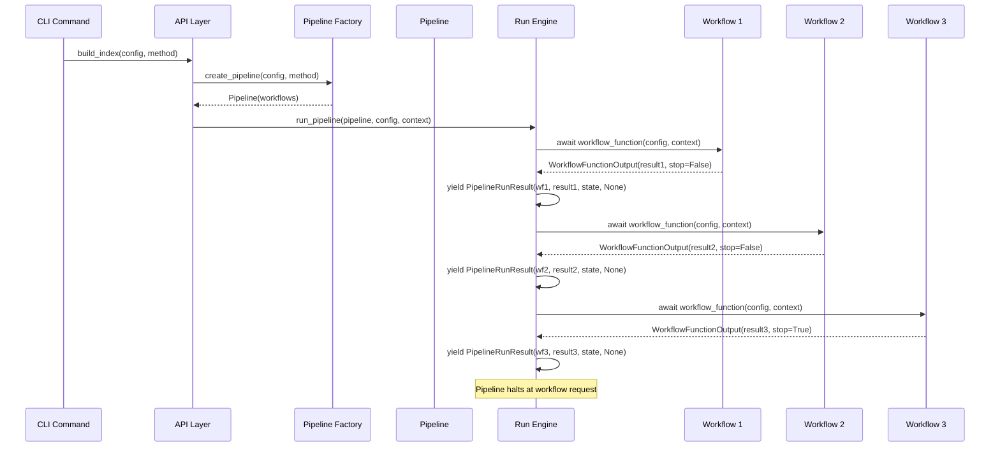

**Diagram sources**
- [run_pipeline.py](file://graphrag/index/run/run_pipeline.py#L96-L102)
- [factory.py](file://graphrag/index/workflows/factory.py#L40-L48)

### Incremental Update Example

During incremental updates, the system manages three separate storage paths:

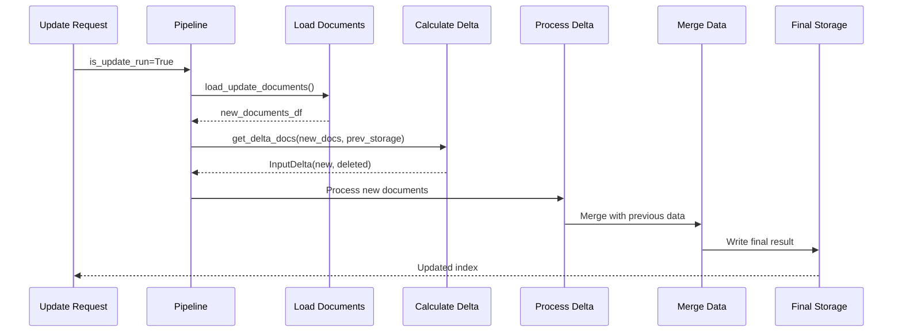

**Diagram sources**
- [run_pipeline.py](file://graphrag/index/run/run_pipeline.py#L51-L62)
- [incremental_index.py](file://graphrag/index/update/incremental_index.py#L34-L63)

**Section sources**
- [run_pipeline.py](file://graphrag/index/run/run_pipeline.py#L96-L102)
- [incremental_index.py](file://graphrag/index/update/incremental_index.py#L34-L84)

## Best Practices

### Workflow Design Guidelines

1. **State Management**: Use the context state for sharing data between workflows
2. **Error Handling**: Implement proper exception handling and consider setting `stop=True` for unrecoverable errors
3. **Storage Patterns**: Always write outputs to the appropriate storage location
4. **Performance Monitoring**: Record timing information for optimization
5. **Incremental Compatibility**: Design workflows to handle both fresh and incremental data

### Pipeline Configuration

1. **Method Selection**: Choose appropriate pipeline methods based on performance requirements
2. **Workflow Ordering**: Arrange workflows in logical dependency order
3. **Resource Management**: Consider memory and computational requirements
4. **Monitoring Integration**: Enable callbacks for production monitoring

### State Persistence

1. **Atomic Updates**: Make state changes atomic to prevent corruption
2. **Version Compatibility**: Handle state schema evolution gracefully
3. **Cleanup Procedures**: Implement proper cleanup for failed executions
4. **Debugging Support**: Include diagnostic information in state dumps

The Pipeline Orchestration system provides a robust foundation for complex data processing workflows, offering flexibility, reliability, and comprehensive monitoring capabilities essential for production-grade graph processing applications.