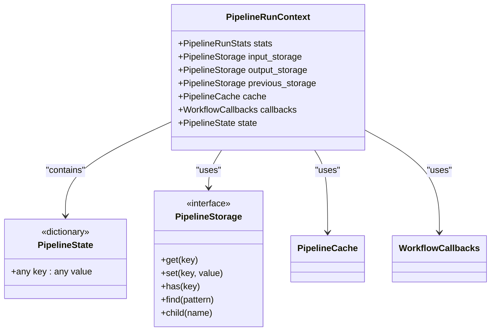
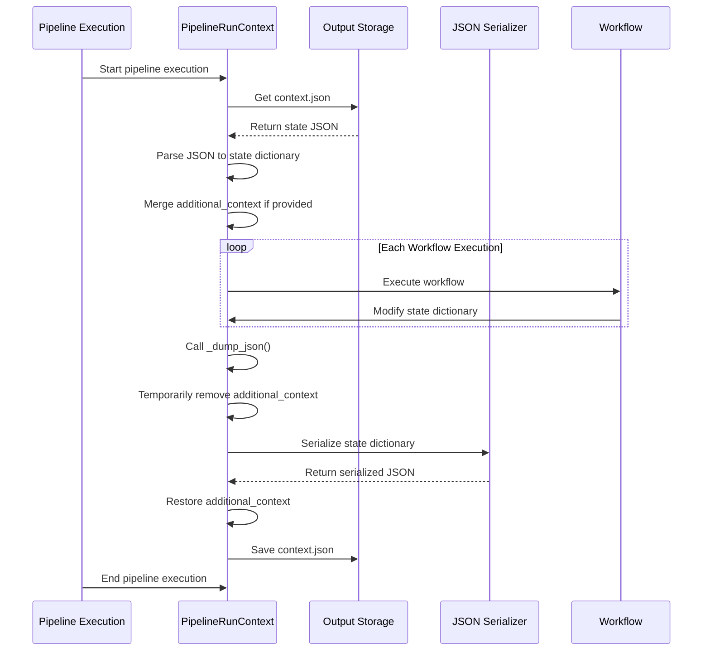
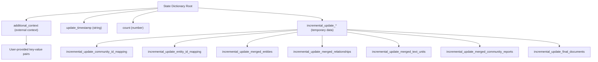
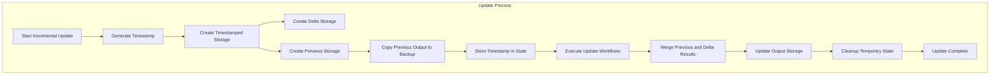
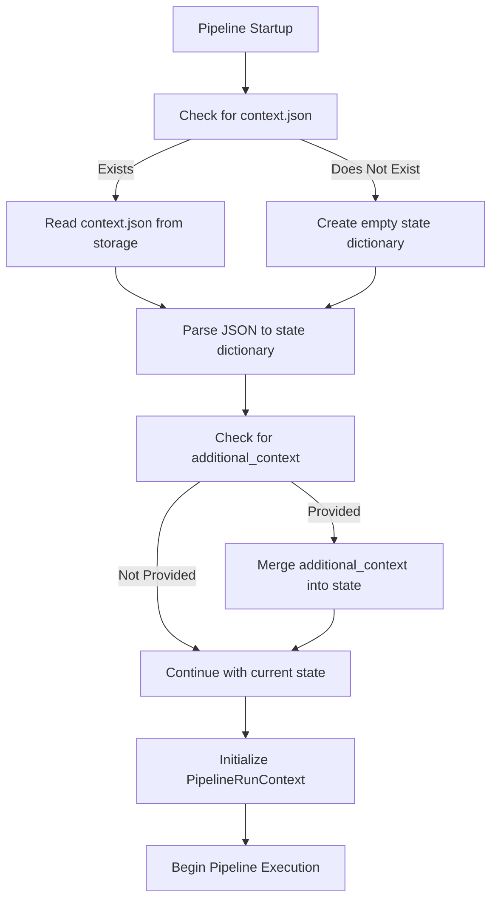
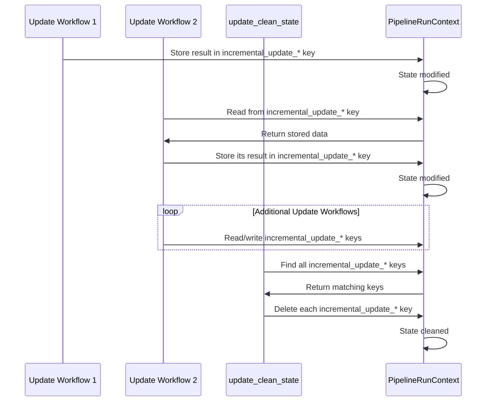
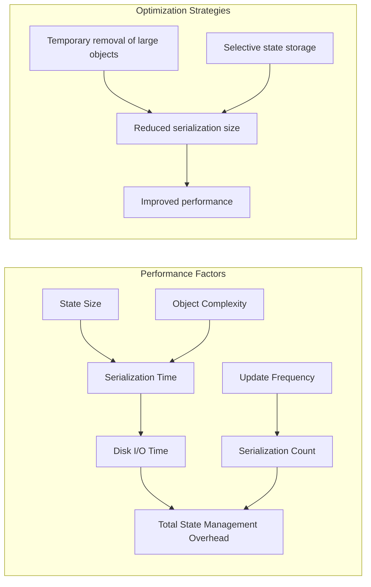
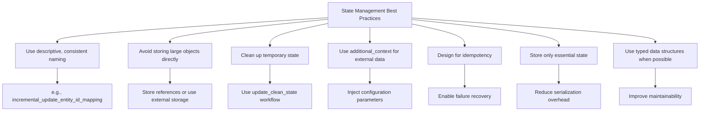
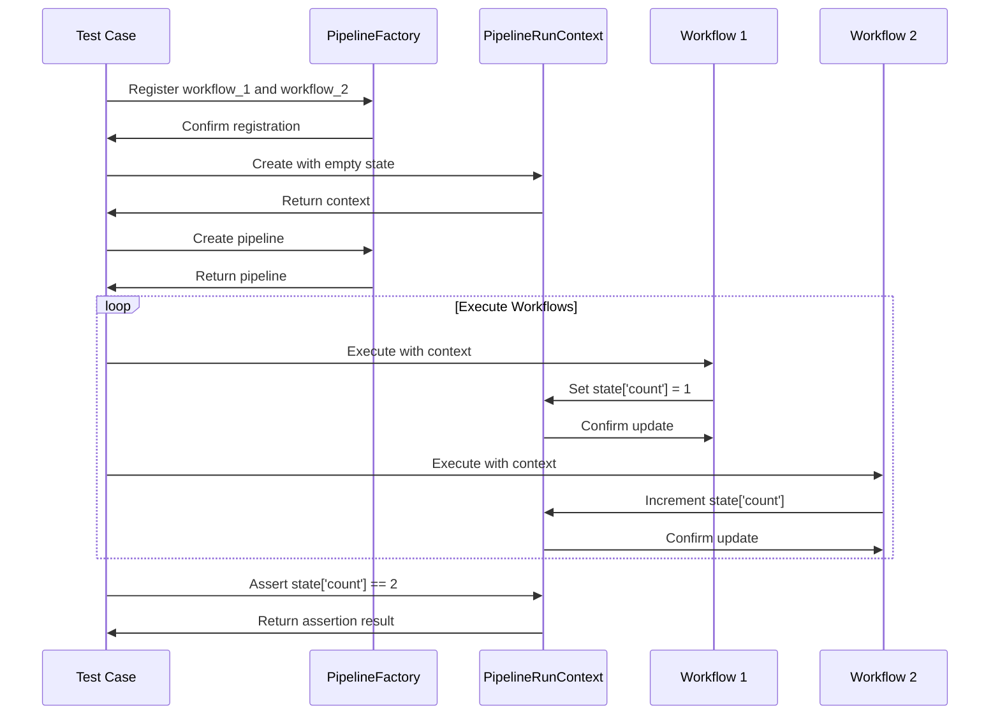

# State Management

<cite>
**Referenced Files in This Document**   
- [run_pipeline.py](file://graphrag/index/run/run_pipeline.py)
- [context.py](file://graphrag/index/typing/context.py)
- [state.py](file://graphrag/index/typing/state.py)
- [utils.py](file://graphrag/index/run/utils.py)
- [test_pipeline_state.py](file://tests/verbs/test_pipeline_state.py)
- [update_clean_state.py](file://graphrag/index/workflows/update_clean_state.py)
</cite>

## Table of Contents
1. [Introduction](#introduction)
2. [State Management Architecture](#state-management-architecture)
3. [PipelineRunContext State Persistence](#pipelineruncontext-state-persistence)
4. [State Dictionary Structure](#state-dictionary-structure)
5. [Incremental Indexing Mechanism](#incremental-indexing-mechanism)
6. [State Loading and Initialization](#state-loading-and-initialization)
7. [State Management in Incremental Updates](#state-management-in-incremental-updates)
8. [Performance Implications](#performance-implications)
9. [Best Practices](#best-practices)
10. [Test Examples](#test-examples)

## Introduction
The GraphRAG framework implements a comprehensive state management system that enables workflows to maintain and share state across pipeline executions. This system is centered around the PipelineRunContext object, which provides a persistent state dictionary that can be modified by workflows and serialized to disk. The state management system supports both full indexing runs and incremental updates, with mechanisms for preserving previous state, managing temporary state during updates, and ensuring clean state transitions. This documentation details the architecture and implementation of the state management system, including how state is persisted, loaded, and shared between workflows.

## State Management Architecture

**Diagram sources**
- [context.py](file://graphrag/index/typing/context.py#L17-L33)

**Section sources**
- [context.py](file://graphrag/index/typing/context.py#L17-L33)
- [state.py](file://graphrag/index/typing/state.py#L8)

## PipelineRunContext State Persistence

The PipelineRunContext maintains state across workflow executions through the `_dump_json()` function, which serializes the state dictionary to `context.json` in the output storage. This function is called at both the beginning and end of the pipeline execution to ensure state is persisted even if the pipeline fails. The state persistence mechanism temporarily removes the `additional_context` key during serialization to prevent potential memory issues with large objects, then restores it after serialization is complete.

**Diagram sources**
- [run_pipeline.py](file://graphrag/index/run/run_pipeline.py#L142-L158)

**Section sources**
- [run_pipeline.py](file://graphrag/index/run/run_pipeline.py#L142-L158)

## State Dictionary Structure

The state dictionary in PipelineRunContext is an arbitrary key-value store that allows workflows to share data and maintain state across executions. The structure is completely flexible, allowing any JSON-serializable data to be stored. Common patterns include using the `additional_context` key for externally provided context and prefixing incremental update state with `incremental_update_` to organize temporary state data.

**Diagram sources**
- [run_pipeline.py](file://graphrag/index/run/run_pipeline.py#L45-L50)
- [update_clean_state.py](file://graphrag/index/workflows/update_clean_state.py#L21-L25)
- [test_pipeline_state.py](file://tests/verbs/test_pipeline_state.py#L18-L25)

**Section sources**
- [run_pipeline.py](file://graphrag/index/run/run_pipeline.py#L45-L50)
- [update_clean_state.py](file://graphrag/index/workflows/update_clean_state.py#L21-L25)

## Incremental Indexing Mechanism

The incremental indexing mechanism manages three storage locations: previous, delta, and output. When an incremental update is initiated, the current output is copied to a backup location (previous), the new index subset is stored in the delta location, and after merging, the combined result is written to the output location. The update timestamp is stored in the state dictionary to coordinate this process across workflows.

**Diagram sources**
- [run_pipeline.py](file://graphrag/index/run/run_pipeline.py#L51-L64)

**Section sources**
- [run_pipeline.py](file://graphrag/index/run/run_pipeline.py#L51-L64)

## State Loading and Initialization

At pipeline startup, the state is loaded from `context.json` in the output storage. If the file exists, it is parsed into the state dictionary; otherwise, an empty dictionary is used. The `additional_context` parameter allows external context to be injected into the state, which is merged with the existing state under the `additional_context` key. This mechanism enables external systems to provide configuration or data that can influence workflow behavior.

**Diagram sources**
- [run_pipeline.py](file://graphrag/index/run/run_pipeline.py#L44-L50)

**Section sources**
- [run_pipeline.py](file://graphrag/index/run/run_pipeline.py#L44-L50)

## State Management in Incremental Updates

During incremental updates, the state dictionary is used to coordinate data flow between workflows. Special keys prefixed with `incremental_update_` are used to store intermediate results that need to be shared between update workflows. After the update is complete, the `update_clean_state` workflow removes all keys with this prefix to clean up temporary state. This pattern ensures that temporary state does not persist beyond the update cycle.

**Diagram sources**
- [update_clean_state.py](file://graphrag/index/workflows/update_clean_state.py#L15-L31)
- [run_pipeline.py](file://graphrag/index/run/run_pipeline.py#L64)

**Section sources**
- [update_clean_state.py](file://graphrag/index/workflows/update_clean_state.py#L15-L31)
- [run_pipeline.py](file://graphrag/index/run/run_pipeline.py#L64)

## Performance Implications

The state serialization process has performance implications that scale with the size of the state dictionary. Large state objects require more time to serialize to JSON and write to storage, which can become a bottleneck in the pipeline. The temporary removal of `additional_context` during serialization is a performance optimization to prevent issues with very large objects. Frequent state serialization at the beginning and end of the pipeline ensures durability but adds overhead that should be considered when designing workflows that modify large state objects.

**Diagram sources**
- [run_pipeline.py](file://graphrag/index/run/run_pipeline.py#L148-L155)

**Section sources**
- [run_pipeline.py](file://graphrag/index/run/run_pipeline.py#L148-L155)

## Best Practices

When managing state in GraphRAG pipelines, several best practices should be followed to ensure efficient and reliable operation. These include using descriptive keys with consistent naming conventions, avoiding storage of large objects directly in the state dictionary, cleaning up temporary state after use, and leveraging the `additional_context` mechanism for external configuration. Workflows should also be designed to be idempotent where possible, as state persistence enables recovery from failures and continuation of interrupted pipelines.

**Section sources**
- [run_pipeline.py](file://graphrag/index/run/run_pipeline.py#L148-L155)
- [update_clean_state.py](file://graphrag/index/workflows/update_clean_state.py#L21-L29)

## Test Examples

The test suite includes examples that demonstrate state persistence and modification across workflows. These tests verify that state changes made by one workflow are visible to subsequent workflows, that existing state can be initialized when creating the pipeline context, and that the state dictionary can store arbitrary data types. The tests use a simple counter pattern to validate that state modifications are properly persisted and shared between workflows.

**Diagram sources**
- [test_pipeline_state.py](file://tests/verbs/test_pipeline_state.py#L15-L41)

**Section sources**
- [test_pipeline_state.py](file://tests/verbs/test_pipeline_state.py#L15-L41)