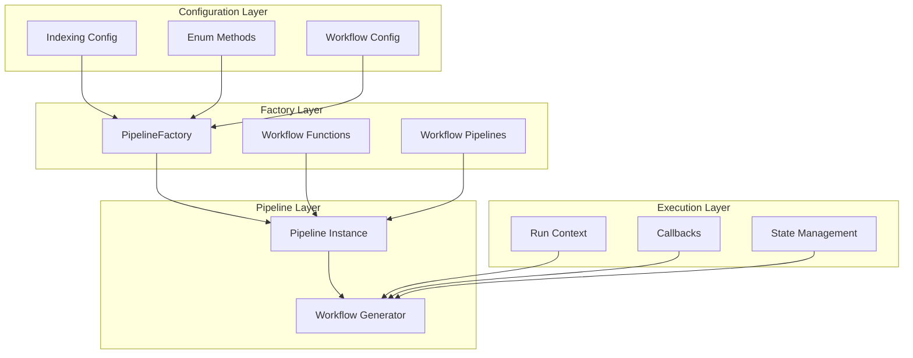
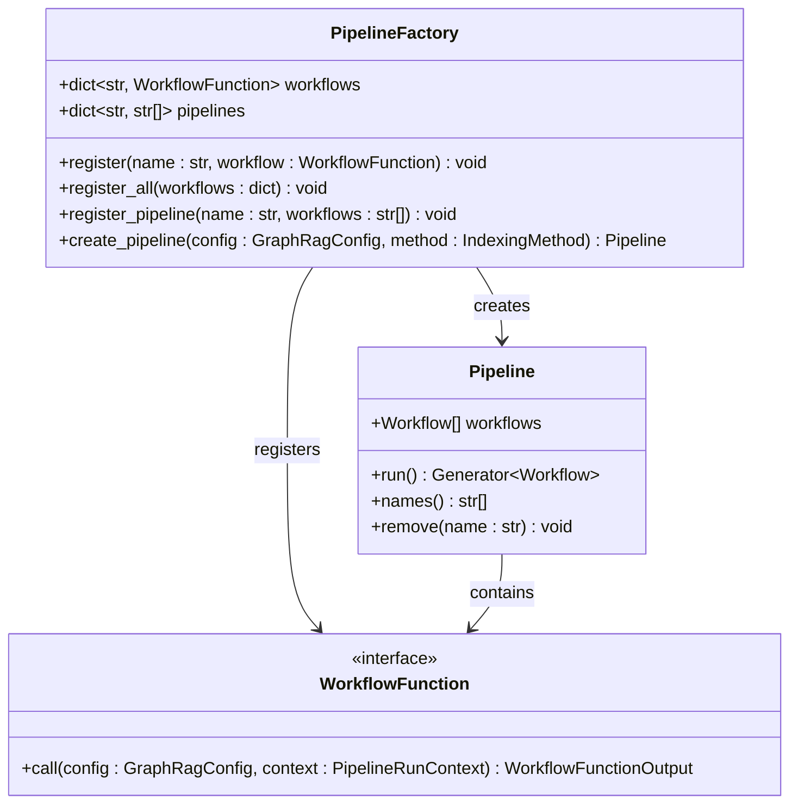
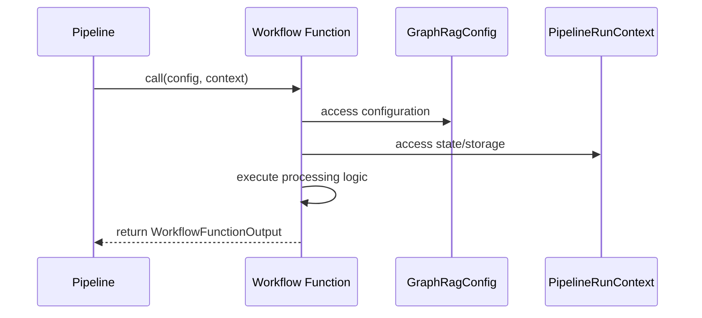
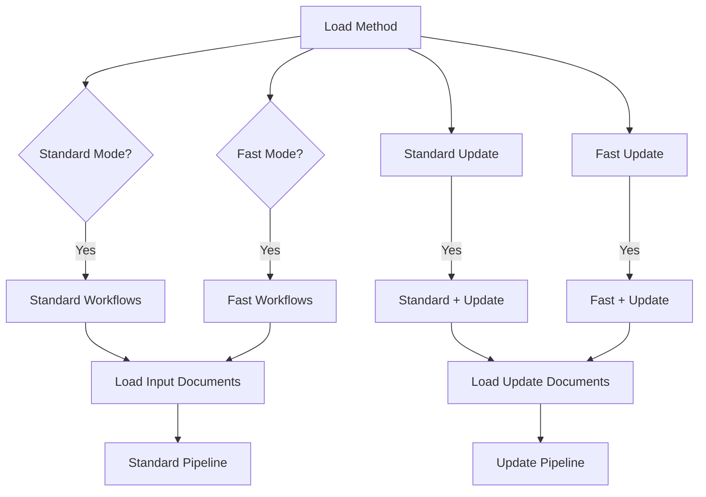
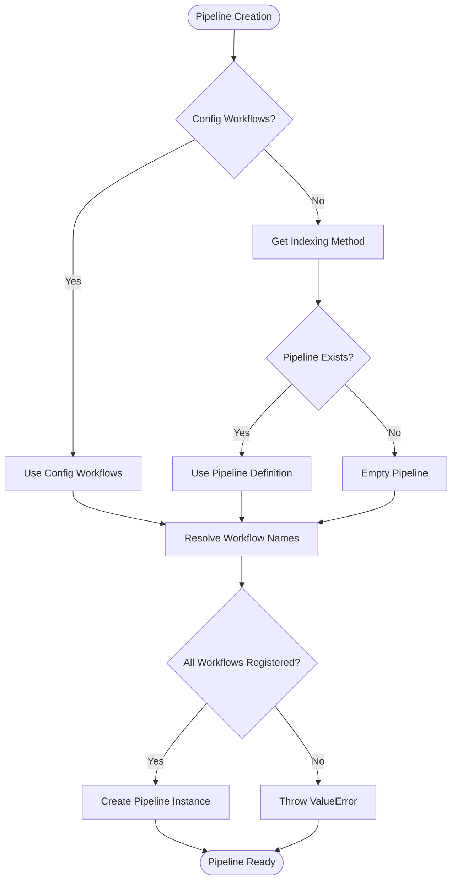
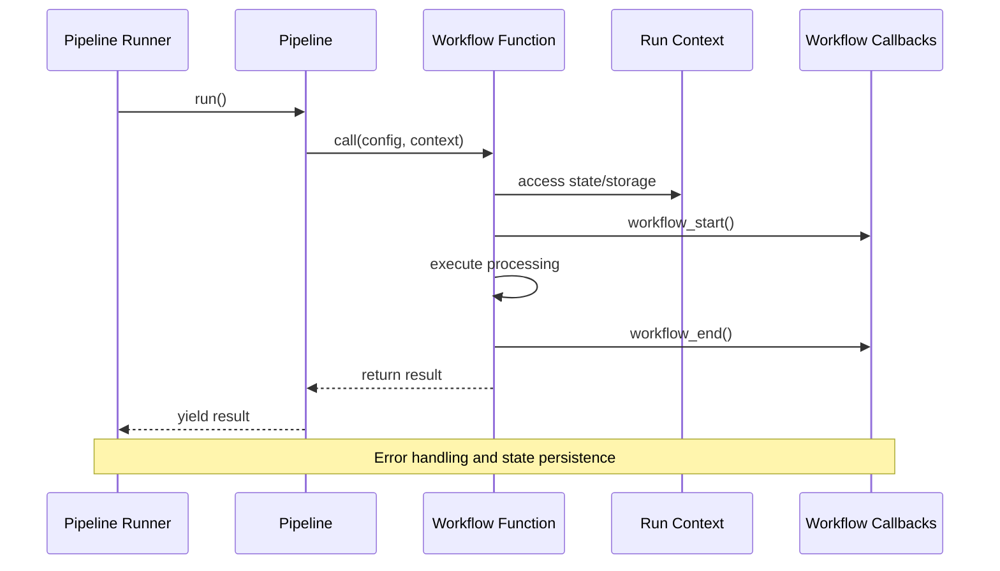

# Workflow Management

<cite>
**Referenced Files in This Document**
- [graphrag/factory/factory.py](file://graphrag/factory/factory.py)
- [graphrag/index/workflows/factory.py](file://graphrag/index/workflows/factory.py)
- [graphrag/index/typing/workflow.py](file://graphrag/index/typing/workflow.py)
- [graphrag/index/typing/pipeline.py](file://graphrag/index/typing/pipeline.py)
- [graphrag/index/run/run_pipeline.py](file://graphrag/index/run/run_pipeline.py)
- [graphrag/index/workflows/load_input_documents.py](file://graphrag/index/workflows/load_input_documents.py)
- [graphrag/index/workflows/load_update_documents.py](file://graphrag/index/workflows/load_update_documents.py)
- [graphrag/config/enums.py](file://graphrag/config/enums.py)
- [graphrag/index/workflows/create_base_text_units.py](file://graphrag/index/workflows/create_base_text_units.py)
- [graphrag/index/workflows/extract_graph.py](file://graphrag/index/workflows/extract_graph.py)
- [tests/verbs/test_pipeline_state.py](file://tests/verbs/test_pipeline_state.py)
</cite>

## Table of Contents
1. [Introduction](#introduction)
2. [Architecture Overview](#architecture-overview)
3. [PipelineFactory Pattern](#pipelinefactory-pattern)
4. [Workflow Registration System](#workflow-registration-system)
5. [Predefined Workflow Sequences](#predefined-workflow-sequences)
6. [Pipeline Construction](#pipeline-construction)
7. [Custom Workflow Integration](#custom-workflow-integration)
8. [Execution Flow](#execution-flow)
9. [Common Issues and Troubleshooting](#common-issues-and-troubleshooting)
10. [Advanced Usage Patterns](#advanced-usage-patterns)

## Introduction

The Workflow Management system in GraphRAG utilizes the PipelineFactory pattern to enable dynamic pipeline construction based on configuration or indexing method. This system provides a flexible framework for orchestrating complex data processing workflows through a standardized interface that supports multiple execution modes and custom workflow extensions.

The factory pattern implementation allows for runtime configuration of workflow sequences while maintaining type safety and providing clear separation between workflow definition and execution orchestration. This design enables users to customize processing pipelines according to their specific requirements while leveraging pre-built workflow components.

## Architecture Overview

The Workflow Management system consists of several interconnected components that work together to provide flexible pipeline orchestration:



**Diagram sources**
- [graphrag/index/workflows/factory.py](file://graphrag/index/workflows/factory.py#L17-L98)
- [graphrag/index/typing/pipeline.py](file://graphrag/index/typing/pipeline.py#L11-L27)
- [graphrag/index/run/run_pipeline.py](file://graphrag/index/run/run_pipeline.py#L29-L168)

## PipelineFactory Pattern

The PipelineFactory serves as the central orchestrator for workflow management, implementing the factory pattern to dynamically construct pipelines based on configuration parameters.

### Core Factory Implementation

The factory maintains two primary registries: one for individual workflow functions and another for predefined pipeline configurations. This dual-layer approach enables both granular workflow composition and higher-level pipeline abstraction.



**Diagram sources**
- [graphrag/index/workflows/factory.py](file://graphrag/index/workflows/factory.py#L17-L48)
- [graphrag/index/typing/workflow.py](file://graphrag/index/typing/workflow.py#L24-L29)
- [graphrag/index/typing/pipeline.py](file://graphrag/index/typing/pipeline.py#L11-L27)

### Factory Methods and Capabilities

The PipelineFactory provides several key methods for workflow management:

- **Registration Methods**: [`register()`](file://graphrag/index/workflows/factory.py#L24-L26), [`register_all()`](file://graphrag/index/workflows/factory.py#L29-L33) - Add custom workflow functions to the registry
- **Pipeline Registration**: [`register_pipeline()`](file://graphrag/index/workflows/factory.py#L35-L37) - Define complete workflow sequences
- **Pipeline Creation**: [`create_pipeline()`](file://graphrag/index/workflows/factory.py#L40-L47) - Construct Pipeline instances from registered components

**Section sources**
- [graphrag/index/workflows/factory.py](file://graphrag/index/workflows/factory.py#L17-L48)

## Workflow Registration System

The workflow registration system enables dynamic addition of custom workflow functions and predefined pipeline configurations. This system supports both individual workflow registration and bulk registration of multiple workflows.

### Individual Workflow Registration

Custom workflows can be registered individually using the [`register()`](file://graphrag/index/workflows/factory.py#L24-L26) method. Each workflow must conform to the [`WorkflowFunction`](file://graphrag/index/typing/workflow.py#L24-L29) signature, accepting configuration and context parameters and returning a [`WorkflowFunctionOutput`](file://graphrag/index/typing/workflow.py#L14-L22).

### Bulk Workflow Registration

Multiple workflows can be registered simultaneously using [`register_all()`](file://graphrag/index/workflows/factory.py#L29-L33), which accepts a dictionary mapping workflow names to workflow functions. This method provides convenience for registering groups of related workflows.

### Workflow Function Signature

All workflow functions must follow a standardized signature that ensures consistent integration with the pipeline execution system:



**Diagram sources**
- [graphrag/index/typing/workflow.py](file://graphrag/index/typing/workflow.py#L24-L29)
- [graphrag/index/run/run_pipeline.py](file://graphrag/index/run/run_pipeline.py#L117-L122)

**Section sources**
- [graphrag/index/workflows/factory.py](file://graphrag/index/workflows/factory.py#L24-L33)
- [graphrag/index/typing/workflow.py](file://graphrag/index/typing/workflow.py#L14-L29)

## Predefined Workflow Sequences

The system includes three predefined workflow sequences that correspond to different indexing methodologies, each optimized for specific use cases and performance characteristics.

### Standard Workflows

The [`_standard_workflows`](file://graphrag/index/workflows/factory.py#L52-L61) sequence represents the traditional GraphRAG processing pipeline, performing comprehensive graph construction and summarization using language model capabilities for all extraction and summarization tasks.

### Fast Workflows

The [`_fast_workflows`](file://graphrag/index/workflows/factory.py#L63-L72) sequence optimizes processing speed by using Natural Language Processing (NLP) techniques for graph construction while reserving language model summarization for quality enhancement. This approach reduces computational overhead while maintaining reasonable output quality.

### Update Workflows

The [`_update_workflows`](file://graphrag/index/workflows/factory.py#L74-L82) sequence handles incremental updates to existing indices, focusing on processing only changed or new data while preserving existing graph structure and relationships.

### Pipeline Combinations

The factory automatically combines loader workflows with the appropriate workflow sequences:



**Diagram sources**
- [graphrag/index/workflows/factory.py](file://graphrag/index/workflows/factory.py#L84-L97)
- [graphrag/index/workflows/load_input_documents.py](file://graphrag/index/workflows/load_input_documents.py#L21-L36)
- [graphrag/index/workflows/load_update_documents.py](file://graphrag/index/workflows/load_update_documents.py#L22-L42)

**Section sources**
- [graphrag/index/workflows/factory.py](file://graphrag/index/workflows/factory.py#L51-L97)

## Pipeline Construction

The pipeline construction process involves several stages that transform configuration parameters into executable workflow sequences through the [`create_pipeline()`](file://graphrag/index/workflows/factory.py#L40-L47) method.

### Configuration-Based Pipeline Selection

The pipeline creation process prioritizes user-specified workflows from the configuration, falling back to predefined pipeline definitions based on the indexing method. This approach allows for both flexibility and consistency in pipeline construction.

### Workflow Resolution Process



**Diagram sources**
- [graphrag/index/workflows/factory.py](file://graphrag/index/workflows/factory.py#L40-L47)

### Pipeline Instance Creation

The resulting Pipeline instance contains tuples of workflow names and their corresponding workflow functions, enabling lazy evaluation and efficient memory usage during execution.

**Section sources**
- [graphrag/index/workflows/factory.py](file://graphrag/index/workflows/factory.py#L40-L47)

## Custom Workflow Integration

The system provides multiple pathways for integrating custom workflows into the pipeline execution framework, supporting both simple additions and complex workflow modifications.

### Basic Custom Workflow Registration

Custom workflows can be registered using the [`register()`](file://graphrag/index/workflows/factory.py#L24-L26) method, allowing immediate availability in pipeline construction:

```python
# Example workflow registration pattern
PipelineFactory.register("custom_workflow", custom_workflow_function)
```

### Advanced Pipeline Modification

The Pipeline class provides runtime modification capabilities through the [`remove()`](file://graphrag/index/typing/pipeline.py#L25-L27) method, enabling dynamic pipeline composition based on runtime conditions.

### Workflow State Management

Custom workflows can leverage the PipelineRunContext for state persistence and inter-workflow communication, supporting complex data flow patterns and conditional processing logic.

**Section sources**
- [graphrag/index/workflows/factory.py](file://graphrag/index/workflows/factory.py#L24-L33)
- [graphrag/index/typing/pipeline.py](file://graphrag/index/typing/pipeline.py#L25-L27)
- [tests/verbs/test_pipeline_state.py](file://tests/verbs/test_pipeline_state.py#L44-L54)

## Execution Flow

The workflow execution follows a structured pattern that ensures consistent processing, error handling, and state management across all pipeline operations.

### Pipeline Execution Sequence



**Diagram sources**
- [graphrag/index/run/run_pipeline.py](file://graphrag/index/run/run_pipeline.py#L117-L122)
- [graphrag/index/typing/pipeline.py](file://graphrag/index/typing/pipeline.py#L17-L19)

### Error Handling and Recovery

The execution system implements comprehensive error handling that captures exceptions during workflow execution and provides detailed error reporting through the PipelineRunResult structure.

### State Persistence

Workflow state is maintained throughout the execution process, enabling workflows to share data and coordinate processing across the pipeline lifecycle.

**Section sources**
- [graphrag/index/run/run_pipeline.py](file://graphrag/index/run/run_pipeline.py#L104-L140)

## Common Issues and Troubleshooting

Understanding common issues and their solutions helps users effectively utilize the workflow management system and avoid potential pitfalls during customization and deployment.

### Missing Workflow Registrations

**Problem**: Attempting to use a workflow that hasn't been registered with the PipelineFactory results in a ValueError indicating the strategy is not registered.

**Solution**: Ensure all custom workflows are properly registered using [`PipelineFactory.register()`](file://graphrag/index/workflows/factory.py#L24-L26) before attempting to use them in pipeline construction.

### Configuration Mismatches

**Problem**: Using incompatible workflow configurations or mismatched indexing methods can lead to unexpected behavior or processing failures.

**Solution**: Verify that workflow configurations align with the chosen indexing method and that all required parameters are properly configured in the GraphRagConfig object.

### State Management Issues

**Problem**: Workflows failing to persist state or encountering state corruption during execution.

**Solution**: Ensure proper state initialization and avoid concurrent modifications to shared state objects. Use the context.state dictionary for persistent data storage.

### Performance Bottlenecks

**Problem**: Slow pipeline execution due to inefficient workflow implementations or resource contention.

**Solution**: Profile individual workflow functions and optimize data processing logic. Consider workflow parallelization and resource allocation strategies.

## Advanced Usage Patterns

The workflow management system supports sophisticated usage patterns that enable complex data processing scenarios and custom pipeline compositions.

### Conditional Workflow Execution

Workflows can implement conditional logic based on configuration parameters or runtime state, enabling adaptive processing pipelines that respond to varying input characteristics.

### Dynamic Pipeline Composition

Runtime pipeline modification allows for adaptive processing strategies that can adjust workflow sequences based on intermediate processing results or external conditions.

### Multi-Stage Processing

Complex workflows can be decomposed into multiple stages, with intermediate results stored and accessed by subsequent workflow phases, enabling sophisticated data transformation pipelines.

### Integration with External Systems

The workflow system can integrate with external processing systems through custom workflow implementations that handle specialized data sources, processing engines, or output destinations.

### Monitoring and Observability

The callback system provides comprehensive monitoring capabilities, enabling real-time tracking of workflow execution, performance metrics collection, and debugging support.

**Section sources**
- [graphrag/index/run/run_pipeline.py](file://graphrag/index/run/run_pipeline.py#L117-L122)
- [tests/verbs/test_pipeline_state.py](file://tests/verbs/test_pipeline_state.py#L38-L54)