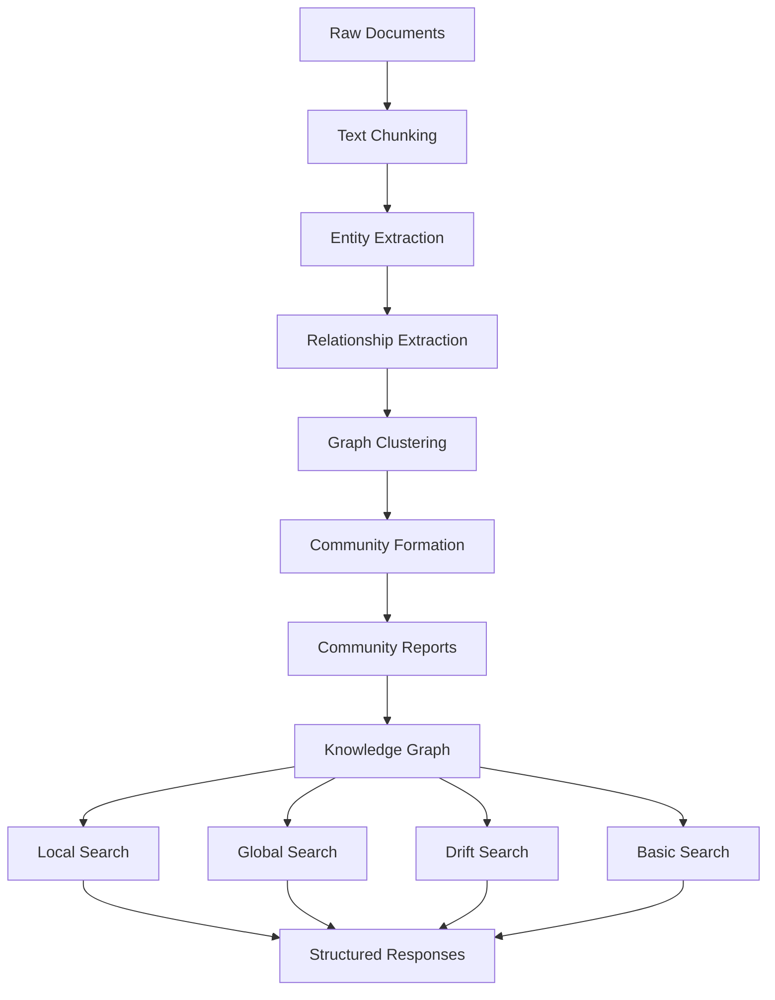
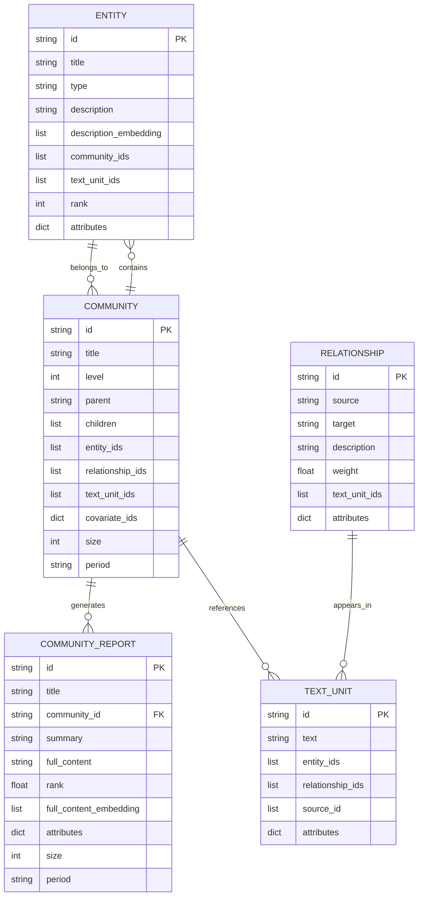
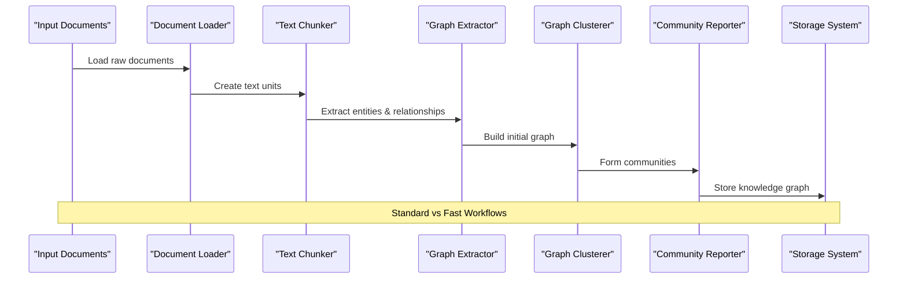
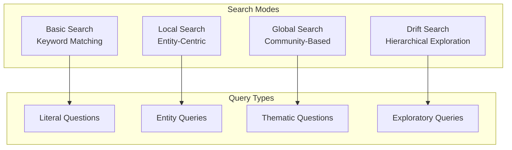

# Introduction to GraphRAG

<cite>
**Referenced Files in This Document**
- [README.md](file://README.md)
- [RAI_TRANSPARENCY.md](file://RAI_TRANSPARENCY.md)
- [graphrag/__init__.py](file://graphrag/__init__.py)
- [graphrag/data_model/community.py](file://graphrag/data_model/community.py)
- [graphrag/data_model/entity.py](file://graphrag/data_model/entity.py)
- [graphrag/data_model/community_report.py](file://graphrag/data_model/community_report.py)
- [graphrag/config/models/graph_rag_config.py](file://graphrag/config/models/graph_rag_config.py)
- [graphrag/query/structured_search/base.py](file://graphrag/query/structured_search/base.py)
- [graphrag/index/workflows/factory.py](file://graphrag/index/workflows/factory.py)
- [graphrag/index/workflows/extract_graph.py](file://graphrag/index/workflows/extract_graph.py)
- [graphrag/index/workflows/create_communities.py](file://graphrag/index/workflows/create_communities.py)
- [graphrag/query/structured_search/drift_search/search.py](file://graphrag/query/structured_search/drift_search/search.py)
- [unified-search-app/app/home_page.py](file://unified-search-app/app/home_page.py)
</cite>

## Table of Contents
1. [What is GraphRAG?](#what-is-graphrag)
2. [Core Concept and Purpose](#core-concept-and-purpose)
3. [Architectural Vision](#architectural-vision)
4. [Knowledge Graph Construction](#knowledge-graph-construction)
5. [Search Capabilities](#search-capabilities)
6. [Real-World Applications](#real-world-applications)
7. [Responsible AI Considerations](#responsible-ai-considerations)
8. [Getting Started](#getting-started)

## What is GraphRAG?

GraphRAG (Graph-based Retrieval-Augmented Generation) is an innovative AI system that transforms unstructured text into structured knowledge through the power of Large Language Models (LLMs). It creates interconnected networks of entities, relationships, and communities to enable sophisticated reasoning and discovery over private, narrative datasets.

Unlike traditional keyword or vector-based search systems, GraphRAG builds comprehensive knowledge graphs that capture the semantic relationships between concepts, allowing for nuanced understanding and cross-document reasoning that transcends simple text matching.

**Section sources**
- [README.md](file://README.md#L24-L26)
- [RAI_TRANSPARENCY.md](file://RAI_TRANSPARENCY.md#L3-L6)

## Core Concept and Purpose

### Fundamental Problem Solved

GraphRAG addresses the challenge of extracting meaningful insights from large volumes of unstructured text where information is distributed across multiple documents and interconnected in complex ways. Traditional search methods struggle with:

- **Cross-document reasoning**: Finding information that spans multiple documents
- **Abstract thematic understanding**: Identifying overarching themes and patterns
- **Complex relationship discovery**: Uncovering implicit connections between concepts
- **Noise and misinformation**: Filtering through irrelevant or contradictory information

### Primary Use Case

GraphRAG is designed to enable **complex reasoning and discovery** over private, narrative datasets through knowledge graph construction. Its primary use case involves scenarios where:

- Information required for insights spans many documents
- Data contains noise, misinformation, or conflicting perspectives
- Questions are abstract or thematic rather than literal
- Domain expertise is needed to interpret and validate findings

### Key Benefits

**Thematic Insight Generation**: GraphRAG excels at identifying and synthesizing themes across disparate documents, providing comprehensive overviews of complex topics.

**Cross-Document Reasoning**: By building interconnected knowledge graphs, the system can connect information that exists across multiple sources, revealing patterns and relationships that would be invisible to traditional search.

**Enhanced Search Beyond Keywords**: The system moves beyond simple keyword matching to understand semantic meaning, context, and relationships between concepts.

**Structured Search Capabilities**: Results are presented in organized, hierarchical structures that reflect the natural organization of knowledge.

**Section sources**
- [RAI_TRANSPARENCY.md](file://RAI_TRANSPARENCY.md#L7-L10)

## Architectural Vision

### System Architecture Overview

GraphRAG follows a pipeline-based architecture that transforms raw documents into structured knowledge through multiple stages of processing:

**Diagram sources**
- [graphrag/index/workflows/factory.py](file://graphrag/index/workflows/factory.py#L51-L97)
- [graphrag/config/models/graph_rag_config.py](file://graphrag/config/models/graph_rag_config.py#L1-L50)

### Transformation Pipeline

The system transforms raw documents through a series of orchestrated workflows:

1. **Text Unit Creation**: Documents are broken into manageable chunks
2. **Entity Recognition**: Key entities (people, organizations, concepts) are identified
3. **Relationship Discovery**: Connections between entities are extracted
4. **Graph Construction**: Entities and relationships form a connected graph
5. **Community Detection**: Related entities are clustered into meaningful groups
6. **Report Generation**: Hierarchical summaries are created for each community

### Data Models

The system operates on several core data models that represent different aspects of the knowledge graph:

**Diagram sources**
- [graphrag/data_model/entity.py](file://graphrag/data_model/entity.py#L12-L70)
- [graphrag/data_model/community.py](file://graphrag/data_model/community.py#L12-L80)
- [graphrag/data_model/community_report.py](file://graphrag/data_model/community_report.py#L12-L68)

**Section sources**
- [graphrag/data_model/entity.py](file://graphrag/data_model/entity.py#L1-L70)
- [graphrag/data_model/community.py](file://graphrag/data_model/community.py#L1-L80)
- [graphrag/data_model/community_report.py](file://graphrag/data_model/community_report.py#L1-L68)

## Knowledge Graph Construction

### Workflow Architecture

The knowledge graph construction follows a standardized pipeline with configurable workflows:

**Diagram sources**
- [graphrag/index/workflows/factory.py](file://graphrag/index/workflows/factory.py#L51-L97)
- [graphrag/index/run/run_pipeline.py](file://graphrag/index/run/run_pipeline.py#L96-L139)

### Entity and Relationship Extraction

The system uses LLM-powered extraction to identify and connect key concepts:

- **Entity Types**: Automatically identifies and categorizes entities (persons, organizations, locations, concepts)
- **Relationship Patterns**: Discovers how entities relate to each other
- **Contextual Understanding**: Captures the nature and strength of relationships
- **Temporal Information**: Tracks when entities and relationships appear

### Community Formation

Entities are grouped into meaningful communities based on their relationships:

- **Hierarchical Clustering**: Creates multi-level community structures
- **Semantic Similarity**: Groups related entities together
- **Boundary Definition**: Establishes clear boundaries between communities
- **Parent-Child Relationships**: Maintains hierarchical organization

**Section sources**
- [graphrag/index/workflows/extract_graph.py](file://graphrag/index/workflows/extract_graph.py#L1-L79)
- [graphrag/index/workflows/create_communities.py](file://graphrag/index/workflows/create_communities.py#L1-L157)

## Search Capabilities

### Multi-Modal Search Architecture

GraphRAG provides four distinct search modes, each optimized for different types of queries:

**Diagram sources**
- [graphrag/query/structured_search/base.py](file://graphrag/query/structured_search/base.py#L1-L93)
- [unified-search-app/app/home_page.py](file://unified-search-app/app/home_page.py#L152-L175)

### Search Mode Descriptions

**Basic Search**: Traditional keyword-based search using vector similarity, ideal for straightforward information retrieval.

**Local Search**: Entity-centric search that focuses on specific entities and their immediate context, perfect for detailed inquiries about particular subjects.

**Global Search**: Community-based search that considers broader thematic relationships across the entire knowledge graph, excellent for understanding overarching topics.

**Drift Search**: Advanced hierarchical exploration that combines multiple search strategies to provide comprehensive answers to complex, multi-faceted questions.

### Contextual Response Generation

Each search mode provides structured context that enables LLMs to generate well-referenced, grounded responses:

- **Citation Tracking**: Every assertion is linked to specific source documents
- **Confidence Scoring**: Responses include confidence indicators for reliability assessment
- **Multi-source Integration**: Combines information from multiple relevant sources
- **Provenance Tracing**: Maintains clear lineage from original documents to final responses

**Section sources**
- [graphrag/query/structured_search/base.py](file://graphrag/query/structured_search/base.py#L27-L93)
- [graphrag/query/structured_search/drift_search/search.py](file://graphrag/query/structured_search/drift_search/search.py#L148-L187)

## Real-World Applications

### Critical Information Discovery

GraphRAG excels in scenarios requiring deep analytical capabilities:

- **Investigative Journalism**: Connecting disparate pieces of information across news articles and reports
- **Scientific Research**: Synthesizing findings across academic papers and research documents
- **Corporate Intelligence**: Analyzing market trends and competitor activities across multiple data sources
- **Legal Research**: Understanding complex legal precedents and case relationships

### Domain-Specific Analysis

The system adapts to various domains through customizable entity recognition and relationship extraction:

- **Healthcare**: Medical literature analysis and treatment pathway discovery
- **Finance**: Market analysis and risk assessment across regulatory documents
- **Technology**: Patent analysis and innovation trend identification
- **Government**: Policy analysis and intelligence gathering

### Thematic Understanding

Beyond individual facts, GraphRAG provides comprehensive thematic insights:

- **Trend Analysis**: Identifying emerging patterns and shifts in discourse
- **Sentiment Analysis**: Understanding emotional and attitudinal trends across time
- **Concept Evolution**: Tracking how ideas develop and change over time
- **Network Analysis**: Understanding influence patterns and relationship dynamics

## Responsible AI Considerations

### Intended Use Cases

GraphRAG is designed for specific, high-stakes applications where:

- **Critical Insights Are Required**: Decisions based on the system's output have significant consequences
- **Domain Expertise Is Available**: Human experts can validate and interpret results
- **Complex Reasoning Is Needed**: Simple keyword search cannot provide adequate answers
- **Privacy Is Protected**: Data remains within controlled, private environments

### Limitations and Mitigation Strategies

**Indexing Complexity**: The system requires substantial computational resources for initial indexing. Best practices include:

- Testing with small representative datasets before large-scale operations
- Properly configuring entity types for domain-specific content
- Monitoring resource usage during processing

**Quality Dependencies**: Effective results depend on careful prompt engineering and configuration. Users should:

- Fine-tune prompts according to documentation guidelines
- Validate results through domain expert review
- Implement proper attribution and citation practices

**Hallucination Risk**: As with all LLM-based systems, there's potential for incorrect information generation. Mitigation includes:

- Verifying claims against source documents
- Implementing human review processes
- Using multiple search modes for cross-validation

### Evaluation Metrics

The system has been evaluated across several key dimensions:

- **Accuracy**: Manual inspection against gold standards
- **Transparency**: Automated answer coverage and human review
- **Robustness**: Resistance to prompt injection attacks
- **Hallucination Rates**: Claim coverage and adversarial testing

**Section sources**
- [RAI_TRANSPARENCY.md](file://RAI_TRANSPARENCY.md#L11-L41)

## Getting Started

### System Requirements

GraphRAG operates as a Python package with flexible deployment options:

- **Python Environment**: Compatible with standard Python distributions
- **Memory Requirements**: Scales with dataset size and complexity
- **Storage Needs**: Depends on indexing depth and retention requirements
- **Compute Resources**: Configurable based on throughput needs

### Configuration Approach

The system uses YAML-based configuration files that define:

- **Model Settings**: LLM and embedding model specifications
- **Processing Parameters**: Chunk sizes, clustering thresholds, and extraction settings
- **Storage Options**: Local file systems, cloud storage, or vector databases
- **Search Behavior**: Query processing and response formatting preferences

### Development Workflow

1. **Initialize Configuration**: Set up project-specific parameters
2. **Load Documents**: Import your private dataset
3. **Run Indexing**: Process documents into knowledge graph
4. **Configure Search**: Set up appropriate search modes
5. **Query System**: Explore insights through various search interfaces
6. **Validate Results**: Review and refine outputs with domain expertise

### Integration Options

GraphRAG provides multiple integration approaches:

- **Command Line Interface**: Simple setup and operation
- **Python API**: Programmatic access for custom applications
- **Web Interface**: Interactive exploration through web applications
- **Custom Integrations**: Extensible architecture for specialized use cases

**Section sources**
- [README.md](file://README.md#L28-L32)
- [graphrag/config/models/graph_rag_config.py](file://graphrag/config/models/graph_rag_config.py#L1-L417)