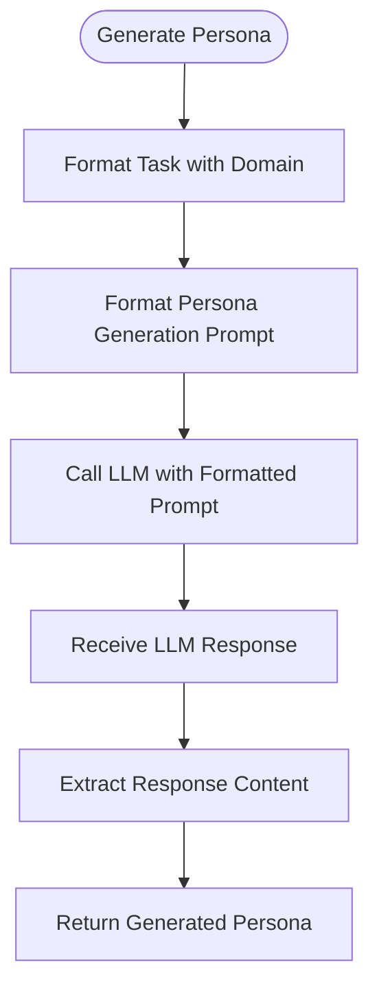

# Prompt Tuning

<cite>
**Referenced Files in This Document**   
- [prompt_tune.py](file://graphrag/api/prompt_tune.py)
- [cli/prompt_tune.py](file://graphrag/cli/prompt_tune.py)
- [prompt_tune/generator/domain.py](file://graphrag/prompt_tune/generator/domain.py)
- [prompt_tune/generator/persona.py](file://graphrag/prompt_tune/generator/persona.py)
- [prompt_tune/generator/entity_types.py](file://graphrag/prompt_tune/generator/entity_types.py)
- [prompt_tune/generator/entity_relationship.py](file://graphrag/prompt_tune/generator/entity_relationship.py)
- [prompt_tune/generator/extract_graph_prompt.py](file://graphrag/prompt_tune/generator/extract_graph_prompt.py)
- [prompt_tune/generator/community_reporter_role.py](file://graphrag/prompt_tune/generator/community_reporter_role.py)
- [prompt_tune/generator/community_report_rating.py](file://graphrag/prompt_tune/generator/community_report_rating.py)
- [prompt_tune/generator/community_report_summarization.py](file://graphrag/prompt_tune/generator/community_report_summarization.py)
- [prompt_tune/template/extract_graph.py](file://graphrag/prompt_tune/template/extract_graph.py)
- [prompt_tune/template/community_report_summarization.py](file://graphrag/prompt_tune/template/community_report_summarization.py)
- [prompt_tune/prompt/domain.py](file://graphrag/prompt_tune/prompt/domain.py)
- [prompt_tune/prompt/persona.py](file://graphrag/prompt_tune/prompt/persona.py)
- [prompt_tune/prompt/entity_types.py](file://graphrag/prompt_tune/prompt/entity_types.py)
- [prompt_tune/prompt/entity_relationship.py](file://graphrag/prompt_tune/prompt/entity_relationship.py)
- [prompt_tune/prompt/community_reporter_role.py](file://graphrag/prompt_tune/prompt/community_reporter_role.py)
- [prompt_tune/prompt/community_report_rating.py](file://graphrag/prompt_tune/prompt/community_report_rating.py)
- [prompt_tune/defaults.py](file://graphrag/prompt_tune/defaults.py)
- [prompt_tune/types.py](file://graphrag/prompt_tune/types.py)
</cite>

## Table of Contents
1. [Introduction](#introduction)
2. [Why Default Prompts May Not Work Well](#why-default-prompts-may-not-work-well)
3. [Automated Prompt Tuning with graphrag prompt-tune](#automated-prompt-tuning-with-graphrag-prompt-tune)
4. [Components That Can Be Tuned](#components-that-can-be-tuned)
   - [Entity Types](#entity-types)
   - [Relationship Descriptions](#relationship-descriptions)
   - [Community Reporter Roles](#community-reporter-roles)
   - [Domain-Specific Language](#domain-specific-language)
   - [Persona](#persona)
5. [Manual Prompt Tuning Approach](#manual-prompt-tuning-approach)
6. [How LLMs Generate and Evaluate Prompt Variants](#how-llms-generate-and-evaluate-prompt-variants)
7. [Best Practices for Evaluating Tuning Results](#best-practices-for-evaluating-tuning-results)
8. [Integrating Tuned Prompts into Configuration](#integrating-tuned-prompts-into-configuration)
9. [Conclusion](#conclusion)

## Introduction

Prompt Tuning in GraphRAG is a critical process for optimizing the system's performance for specific domains by adapting extraction and summarization prompts to the characteristics of the input data. The system provides both automated and manual approaches to prompt tuning, allowing users to significantly improve the quality of their knowledge graphs by tailoring the system to their specific data characteristics. This document explains the rationale behind prompt tuning, the components that can be tuned, and best practices for implementing and evaluating tuned prompts.

**Section sources**
- [prompt_tune.py](file://graphrag/api/prompt_tune.py#L4-L203)
- [cli/prompt_tune.py](file://graphrag/cli/prompt_tune.py#L4-L118)

## Why Default Prompts May Not Work Well

Default prompts in GraphRAG may not work well out-of-the-box because they are designed as general-purpose templates that lack domain-specific context and language patterns. When processing specialized data such as scientific literature, legal documents, or technical specifications, generic prompts often fail to capture the nuanced entity types, relationships, and terminology that are critical for accurate knowledge graph construction. The default prompts use broad entity type definitions and relationship descriptions that may not align with the specific semantics of the input data, leading to incomplete or inaccurate extractions. Additionally, the language style and domain-specific jargon in specialized documents require tailored prompts that can interpret and extract information in context, which generic prompts cannot provide.

**Section sources**
- [prompt_tune.py](file://graphrag/api/prompt_tune.py#L55-L203)
- [prompt_tune/generator/domain.py](file://graphrag/prompt_tune/generator/domain.py#L10-L28)
- [prompt_tune/generator/persona.py](file://graphrag/prompt_tune/generator/persona.py#L11-L28)

## Automated Prompt Tuning with graphrag prompt-tune

The automated prompt tuning process in GraphRAG is accessible through the `graphrag prompt-tune` command-line interface and API. This process analyzes input documents to generate optimized prompts for entity extraction, entity summarization, and community summarization. The system automatically detects the domain, language, and key characteristics of the input data, then uses LLMs to generate appropriate entity types, relationship examples, and contextual prompts. The tuning process begins by chunking documents and selecting representative samples based on the specified selection method (random, top, all, or auto). It then creates a language model instance to generate domain-specific components, including entity types, relationship examples, and community reporter roles. The final output consists of three optimized prompts that are specifically tailored to the input data's characteristics.

**Diagram sources**
- [prompt_tune.py](file://graphrag/api/prompt_tune.py#L55-L203)
- [cli/prompt_tune.py](file://graphrag/cli/prompt_tune.py#L25-L118)

**Section sources**
- [prompt_tune.py](file://graphrag/api/prompt_tune.py#L55-L203)
- [cli/prompt_tune.py](file://graphrag/cli/prompt_tune.py#L25-L118)
- [prompt_tune/types.py](file://graphrag/prompt_tune/types.py#L9-L20)

## Components That Can Be Tuned

### Entity Types

The entity types component in GraphRAG can be tuned to reflect the specific categories relevant to the input data domain. The system can automatically discover entity types by analyzing sample documents and identifying the most relevant categories for the given context. This process uses a specialized prompt that instructs the LLM to identify entity types that are relevant to the user's task while avoiding general or redundant categories. The generated entity types are then incorporated into the entity extraction prompt, ensuring that the system focuses on the most important entities for the specific domain. Users can also manually specify entity types if they have domain expertise that can guide the extraction process.

**Diagram sources**
- [prompt_tune/generator/entity_types.py](file://graphrag/prompt_tune/generator/entity_types.py#L22-L60)
- [prompt_tune/prompt/entity_types.py](file://graphrag/prompt_tune/prompt/entity_types.py#L6-L90)

**Section sources**
- [prompt_tune/generator/entity_types.py](file://graphrag/prompt_tune/generator/entity_types.py#L22-L60)
- [prompt_tune/prompt/entity_types.py](file://graphrag/prompt_tune/prompt/entity_types.py#L6-L90)

### Relationship Descriptions

Relationship descriptions can be tuned by generating domain-specific examples of entity relationships from the input data. The system creates relationship examples by identifying pairs of related entities and extracting information about their connection, including a description of the relationship and a strength score. These examples are then incorporated into the entity extraction prompt as guidance for the LLM, helping it understand the types of relationships that are relevant in the specific domain. The relationship generation process can work with or without predefined entity types, allowing flexibility in how relationships are identified and described. The system limits the number of examples to ensure prompt efficiency while maintaining sufficient context for accurate extraction.

**Diagram sources**
- [prompt_tune/generator/entity_relationship.py](file://graphrag/prompt_tune/generator/entity_relationship.py#L18-L66)
- [prompt_tune/prompt/entity_relationship.py](file://graphrag/prompt_tune/prompt/entity_relationship.py#L6-L356)

**Section sources**
- [prompt_tune/generator/entity_relationship.py](file://graphrag/prompt_tune/generator/entity_relationship.py#L18-L66)
- [prompt_tune/prompt/entity_relationship.py](file://graphrag/prompt_tune/prompt/entity_relationship.py#L6-L356)

### Community Reporter Roles

The community reporter role component can be tuned to create a specialized persona for community summarization that reflects the domain and context of the input data. The system generates a community reporter role by analyzing the domain, persona, and sample documents to create a role definition that will be tasked with community analysis. This role definition is incorporated into the community summarization prompt, guiding the LLM to produce summaries that are relevant to the specific domain and use case. The generated role typically includes information about the type of analysis to perform, the target audience for the report, and the key aspects to focus on when summarizing community information.

**Diagram sources**
- [prompt_tune/generator/community_reporter_role.py](file://graphrag/prompt_tune/generator/community_reporter_role.py#L12-L35)
- [prompt_tune/prompt/community_reporter_role.py](file://graphrag/prompt_tune/prompt/community_reporter_role.py#L6-L20)

**Section sources**
- [prompt_tune/generator/community_reporter_role.py](file://graphrag/prompt_tune/generator/community_reporter_role.py#L12-L35)
- [prompt_tune/prompt/community_reporter_role.py](file://graphrag/prompt_tune/prompt/community_reporter_role.py#L6-L20)

### Domain-Specific Language

Domain-specific language can be tuned through automatic language detection and incorporation of domain terminology into the prompts. The system detects the language of the input documents and ensures that all prompts and outputs are generated in the appropriate language. Additionally, the system identifies domain-specific terminology and concepts that should be preserved in the knowledge graph. This ensures that technical terms, jargon, and specialized vocabulary are correctly extracted and represented in the final output. The language detection process analyzes sample documents to determine the primary language, which is then used to configure the prompts for consistent language output.

**Diagram sources**
- [prompt_tune/generator/language.py](file://graphrag/prompt_tune/generator/language.py#L10-L28)
- [prompt_tune/prompt/language.py](file://graphrag/prompt_tune/prompt/language.py)

**Section sources**
- [prompt_tune/generator/language.py](file://graphrag/prompt_tune/generator/language.py#L10-L28)

### Persona

The persona component can be tuned to create an expert profile that guides the LLM in performing the knowledge graph construction tasks. The system generates a persona by analyzing the domain and creating a description of an expert who could help solve the problem. This persona is incorporated into the prompts as a system message, establishing the role and expertise of the LLM during the extraction and summarization processes. The generated persona typically includes information about the expert's skills, relevant abilities, and specific tasks they are adept at helping with. This helps focus the LLM's responses and ensures that the extractions and summaries are performed from the perspective of a domain expert.

**Diagram sources**
- [prompt_tune/generator/persona.py](file://graphrag/prompt_tune/generator/persona.py#L11-L28)
- [prompt_tune/prompt/persona.py](file://graphrag/prompt_tune/prompt/persona.py#L6-L14)

**Section sources**
- [prompt_tune/generator/persona.py](file://graphrag/prompt_tune/generator/persona.py#L11-L28)
- [prompt_tune/prompt/persona.py](file://graphrag/prompt_tune/prompt/persona.py#L6-L14)

## Manual Prompt Tuning Approach

In addition to automated prompt tuning, GraphRAG supports manual tuning approaches that allow users to directly modify and customize prompts based on their domain expertise. This approach involves editing the prompt templates directly or creating new templates that reflect the specific requirements of the use case. Users can modify the entity types, relationship descriptions, community reporter roles, and other components by editing the corresponding prompt files in the `graphrag/prompt_tune/prompt/` directory. The manual approach provides complete control over the prompt content and allows for fine-grained adjustments that may not be possible through automated tuning. This is particularly useful when users have specific requirements or constraints that need to be incorporated into the prompts.

**Section sources**
- [prompt_tune/prompt/domain.py](file://graphrag/prompt_tune/prompt/domain.py)
- [prompt_tune/prompt/persona.py](file://graphrag/prompt_tune/prompt/persona.py)
- [prompt_tune/prompt/entity_types.py](file://graphrag/prompt_tune/prompt/entity_types.py)
- [prompt_tune/prompt/entity_relationship.py](file://graphrag/prompt_tune/prompt/entity_relationship.py)
- [prompt_tune/prompt/community_reporter_role.py](file://graphrag/prompt_tune/prompt/community_reporter_role.py)
- [prompt_tune/prompt/community_report_rating.py](file://graphrag/prompt_tune/prompt/community_report_rating.py)

## How LLMs Generate and Evaluate Prompt Variants

The GraphRAG system uses LLMs to generate and evaluate prompt variants through a multi-step process that analyzes input data and creates optimized prompts. The system first creates a language model instance specifically for prompt tuning, which is then used to analyze sample documents and generate domain-specific components. For each component (domain, language, persona, entity types, relationships, etc.), the system formats a specialized prompt that instructs the LLM to generate the required output based on the input data. The LLM responses are then processed and incorporated into the final prompts for entity extraction, entity summarization, and community summarization. The system evaluates the quality of generated components through the coherence and relevance of the LLM responses, ensuring that the final prompts are well-suited to the input data characteristics.

**Diagram sources**
- [prompt_tune.py](file://graphrag/api/prompt_tune.py#L55-L203)
- [cli/prompt_tune.py](file://graphrag/cli/prompt_tune.py#L25-L118)

**Section sources**
- [prompt_tune.py](file://graphrag/api/prompt_tune.py#L55-L203)
- [cli/prompt_tune.py](file://graphrag/cli/prompt_tune.py#L25-L118)

## Best Practices for Evaluating Tuning Results

When evaluating prompt tuning results, it is important to assess both the quality of the generated prompts and the performance of the knowledge graph construction process. Key evaluation metrics include the relevance and completeness of extracted entities, the accuracy of identified relationships, and the coherence of community summaries. Users should compare the results of tuned prompts against the default prompts to measure improvement in extraction quality. It is also recommended to test the tuned prompts on a representative sample of documents before applying them to the entire dataset. Additionally, users should verify that the generated entity types and relationships align with domain expectations and that the community summaries provide meaningful insights about the data. Regular evaluation and iteration on the tuning process can lead to continuous improvement in knowledge graph quality.

**Section sources**
- [prompt_tune.py](file://graphrag/api/prompt_tune.py#L55-L203)
- [prompt_tune/defaults.py](file://graphrag/prompt_tune/defaults.py#L10-L21)

## Integrating Tuned Prompts into Configuration

Integrating tuned prompts into the GraphRAG configuration involves replacing the default prompts with the optimized versions generated through the tuning process. The system outputs three prompt files: extract_graph.txt, entity_summarization.txt, and community_report_graph.txt, which should be placed in the appropriate configuration directory. Users can specify the path to these custom prompts in the GraphRAG configuration file, ensuring that the indexing pipeline uses the tuned prompts instead of the defaults. It is important to maintain the correct file structure and naming conventions when integrating custom prompts. After integration, users should validate that the system is using the custom prompts by checking the log output during the indexing process. This ensures that the knowledge graph construction benefits from the domain-specific optimizations provided by the tuned prompts.

**Section sources**
- [prompt_tune/generator/extract_graph_prompt.py](file://graphrag/prompt_tune/generator/extract_graph_prompt.py#L21-L110)
- [prompt_tune/generator/entity_summarization_prompt.py](file://graphrag/prompt_tune/generator/entity_summarization_prompt.py)
- [prompt_tune/generator/community_report_summarization.py](file://graphrag/prompt_tune/generator/community_report_summarization.py#L15-L51)

## Conclusion

Prompt tuning is a powerful capability in GraphRAG that enables users to significantly improve the quality of their knowledge graphs by adapting the system to their specific data domains. By tuning components such as entity types, relationship descriptions, community reporter roles, domain-specific language, and persona, users can create optimized prompts that extract more accurate and relevant information from their documents. The system provides both automated and manual tuning approaches, allowing flexibility in how prompts are customized. The automated `graphrag prompt-tune` command simplifies the tuning process by analyzing input data and generating optimized prompts, while manual tuning provides complete control for users with specific requirements. By following best practices for evaluating tuning results and properly integrating tuned prompts into the configuration, users can achieve substantial improvements in knowledge graph quality and relevance.