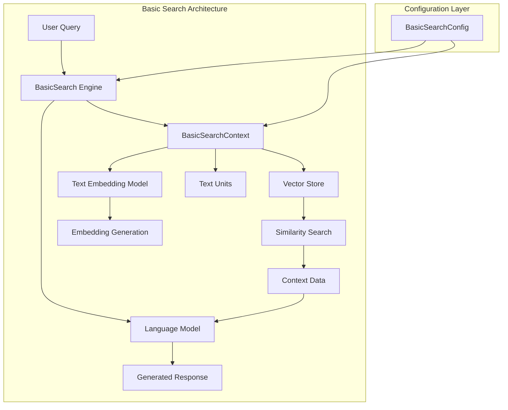
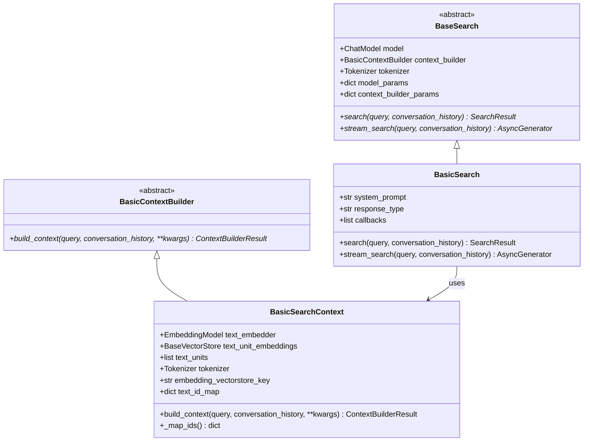
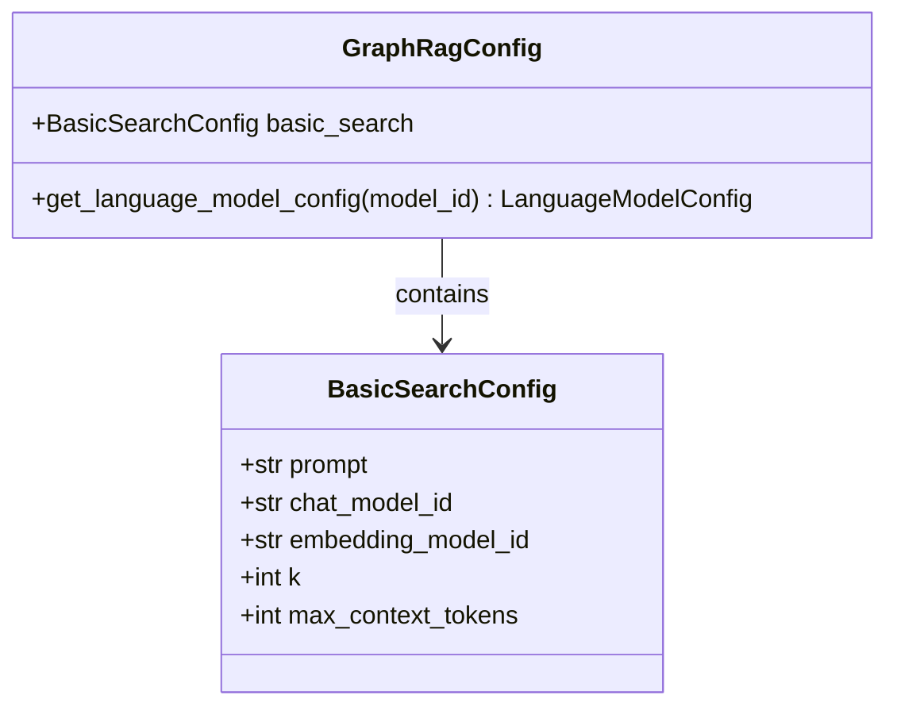
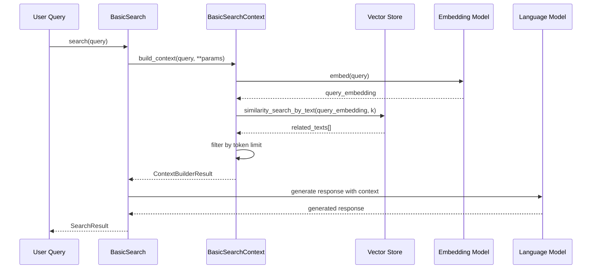
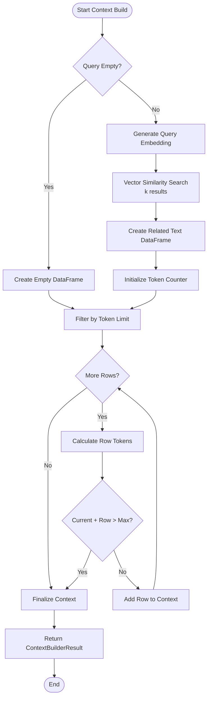
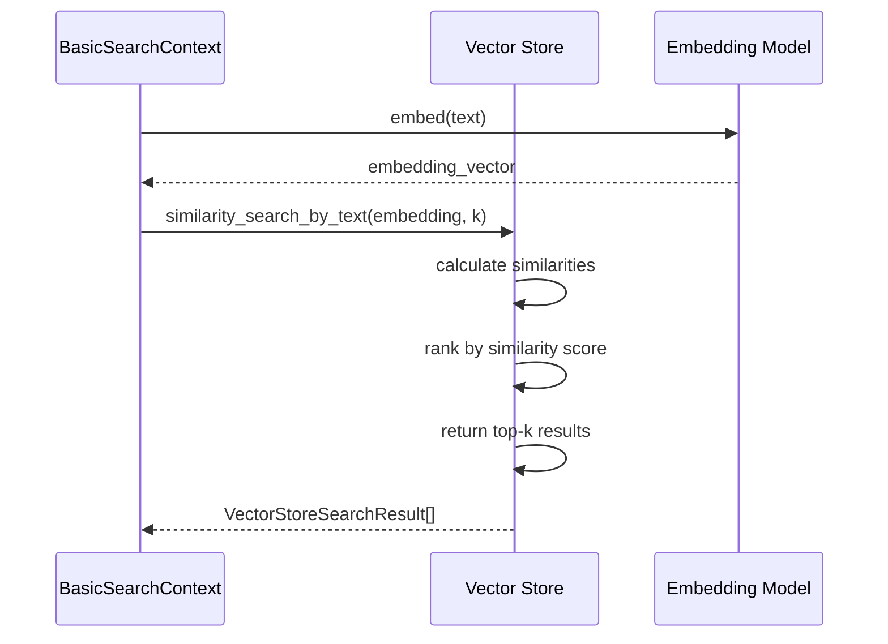

# Basic Search

<cite>
**Referenced Files in This Document**
- [basic_search_config.py](file://graphrag/config/models/basic_search_config.py)
- [search.py](file://graphrag/query/structured_search/basic_search/search.py)
- [basic_context.py](file://graphrag/query/structured_search/basic_search/basic_context.py)
- [base.py](file://graphrag/query/structured_search/base.py)
- [builders.py](file://graphrag/query/context_builder/builders.py)
- [basic_search_system_prompt.py](file://graphrag/prompts/query/basic_search_system_prompt.py)
- [factory.py](file://graphrag/query/factory.py)
- [query.py](file://graphrag/api/query.py)
- [api.py](file://graphrag/utils/api.py)
- [azure_ai_search.py](file://graphrag/vector_stores/azure_ai_search.py)
- [lancedb.py](file://graphrag/vector_stores/lancedb.py)
- [cosmosdb.py](file://graphrag/vector_stores/cosmosdb.py)
</cite>

## Table of Contents
1. [Introduction](#introduction)
2. [Architecture Overview](#architecture-overview)
3. [Core Components](#core-components)
4. [Domain Model](#domain-model)
5. [Implementation Details](#implementation-details)
6. [Vector Similarity Search](#vector-similarity-search)
7. [Context Building Process](#context-building-process)
8. [Configuration Parameters](#configuration-parameters)
9. [Usage Examples](#usage-examples)
10. [Common Issues and Solutions](#common-issues-and-solutions)
11. [Performance Considerations](#performance-considerations)
12. [Troubleshooting Guide](#troubleshooting-guide)

## Introduction

The Basic Search sub-feature in GraphRAG provides a straightforward vector similarity search capability designed for simple queries over text units. It implements a Retrieval-Augmented Generation (RAG) approach that performs vector-based similarity search to retrieve relevant text chunks and generates responses using Large Language Models (LLMs).

Basic Search is particularly suitable for scenarios where:
- Users need quick, simple answers to straightforward questions
- The dataset consists primarily of raw text units without complex relationships
- Performance and simplicity are prioritized over sophisticated reasoning capabilities
- Minimal context building is required for effective search results

The implementation follows a two-stage process: first, vector similarity search retrieves relevant text units, then an LLM generates a response using the retrieved context.

## Architecture Overview

The Basic Search system follows a modular architecture with clear separation of concerns:



**Diagram sources**
- [search.py](file://graphrag/query/structured_search/basic_search/search.py#L27-L51)
- [basic_context.py](file://graphrag/query/structured_search/basic_search/basic_context.py#L25-L41)
- [basic_search_config.py](file://graphrag/config/models/basic_search_config.py#L11-L34)

## Core Components

### BasicSearch Class

The `BasicSearch` class serves as the main orchestrator for the basic search functionality. It inherits from `BaseSearch` and provides the core search and streaming search capabilities.



**Diagram sources**
- [base.py](file://graphrag/query/structured_search/base.py#L55-L93)
- [search.py](file://graphrag/query/structured_search/basic_search/search.py#L27-L51)
- [builders.py](file://graphrag/query/context_builder/builders.py#L65-L75)
- [basic_context.py](file://graphrag/query/structured_search/basic_search/basic_context.py#L25-L41)

**Section sources**
- [search.py](file://graphrag/query/structured_search/basic_search/search.py#L27-L161)
- [base.py](file://graphrag/query/structured_search/base.py#L55-L93)

### BasicSearchContext Builder

The `BasicSearchContext` class implements the context building logic for basic search queries. It handles vector similarity search and context construction with token limit management.

**Section sources**
- [basic_context.py](file://graphrag/query/structured_search/basic_search/basic_context.py#L25-L114)

## Domain Model

### Key Parameters

The Basic Search domain model defines several crucial parameters that control search behavior:

| Parameter | Type | Description | Default Value |
|-----------|------|-------------|---------------|
| `k` | int | Number of text units to retrieve for context | 10 |
| `max_context_tokens` | int | Maximum tokens for context window | 12,000 |
| `embedding_vectorstore_key` | str | Key field for vector store indexing | "id" |
| `response_type` | str | Desired response format | "multiple paragraphs" |

### Configuration Structure



**Diagram sources**
- [basic_search_config.py](file://graphrag/config/models/basic_search_config.py#L11-L34)

**Section sources**
- [basic_search_config.py](file://graphrag/config/models/basic_search_config.py#L11-L34)

## Implementation Details

### Search Execution Flow

The basic search process follows a structured execution flow:



**Diagram sources**
- [search.py](file://graphrag/query/structured_search/basic_search/search.py#L52-L112)
- [basic_context.py](file://graphrag/query/structured_search/basic_search/basic_context.py#L43-L104)

### Context Building Algorithm

The context building process implements a greedy algorithm that maximizes context utilization while respecting token limits:



**Diagram sources**
- [basic_context.py](file://graphrag/query/structured_search/basic_search/basic_context.py#L43-L104)

**Section sources**
- [basic_context.py](file://graphrag/query/structured_search/basic_search/basic_context.py#L43-L104)

## Vector Similarity Search

### Implementation Across Vector Stores

The Basic Search system supports multiple vector store implementations, each with optimized similarity search capabilities:

#### Azure AI Search
- Uses semantic search with vector embeddings
- Supports hybrid text-vector queries
- Implements cosine similarity scoring

#### LanceDB
- Leverages ANN (Approximate Nearest Neighbor) algorithms
- Provides efficient vector indexing
- Calculates distances for similarity scoring

#### Cosmos DB
- Implements custom cosine similarity calculation
- Handles vector operations locally
- Supports batch similarity computation

**Section sources**
- [azure_ai_search.py](file://graphrag/vector_stores/azure_ai_search.py#L195-L214)
- [lancedb.py](file://graphrag/vector_stores/lancedb.py#L133-L176)
- [cosmosdb.py](file://graphrag/vector_stores/cosmosdb.py#L210-L241)

### Similarity Search Process



**Diagram sources**
- [basic_context.py](file://graphrag/query/structured_search/basic_search/basic_context.py#L56-L60)
- [api.py](file://graphrag/utils/api.py#L86-L94)

## Context Building Process

### Token Management Strategy

The context builder implements intelligent token management to optimize context utilization:

1. **Initial Token Calculation**: Accounts for column headers and delimiters
2. **Greedy Addition**: Adds text chunks until token limit is reached
3. **Graceful Degradation**: Stops at the last valid context state when limits are exceeded
4. **Result Formatting**: Converts filtered data to CSV format with proper escaping

### Context Construction Steps

| Step | Operation | Purpose |
|------|-----------|---------|
| 1 | Embed query text | Generate query representation |
| 2 | Vector similarity search | Retrieve k most relevant text units |
| 3 | Filter by token limit | Respect context window constraints |
| 4 | Format as CSV | Prepare context for LLM consumption |
| 5 | Map IDs | Convert internal IDs to human-readable format |

**Section sources**
- [basic_context.py](file://graphrag/query/structured_search/basic_search/basic_context.py#L56-L104)

## Configuration Parameters

### Essential Configuration Options

The Basic Search system exposes several configuration parameters through `BasicSearchConfig`:

#### Core Parameters
- **`k`**: Controls the number of text units retrieved for context
- **`max_context_tokens`**: Limits the total context size to prevent token overflow
- **`chat_model_id`**: Specifies the LLM model for response generation
- **`embedding_model_id`**: Determines the embedding model for text processing

#### Advanced Parameters
- **`prompt`**: Custom system prompt for response generation
- **`response_type`**: Controls the format and style of generated responses

### Factory Configuration

The factory method demonstrates proper configuration setup:

```python
# Example configuration setup from factory.py
bs_config = config.basic_search
return BasicSearch(
    model=chat_model,
    context_builder=BasicSearchContext(
        text_embedder=embedding_model,
        text_unit_embeddings=text_unit_embeddings,
        text_units=text_units,
        tokenizer=tokenizer,
    ),
    context_builder_params={
        "embedding_vectorstore_key": "id",
        "k": bs_config.k,
        "max_context_tokens": bs_config.max_context_tokens,
    },
)
```

**Section sources**
- [factory.py](file://graphrag/query/factory.py#L285-L303)
- [basic_search_config.py](file://graphrag/config/models/basic_search_config.py#L26-L33)

## Usage Examples

### Basic Search Engine Creation

Creating a Basic Search engine involves configuring the necessary components:

```python
# From factory.py - Basic Search engine instantiation
def get_basic_search_engine(
    text_units: list[TextUnit],
    text_unit_embeddings: BaseVectorStore,
    config: GraphRagConfig,
    system_prompt: str | None = None,
    response_type: str = "multiple paragraphs",
    callbacks: list[QueryCallbacks] | None = None,
) -> BasicSearch:
```

### API Integration

The Basic Search API provides both synchronous and asynchronous interfaces:

```python
# From query.py - Streaming search interface
async def basic_search(
    config: GraphRagConfig,
    text_units: pd.DataFrame,
    query: str,
    callbacks: list[QueryCallbacks] | None = None,
    verbose: bool = False,
) -> tuple[str | dict, str | list[pd.DataFrame] | dict[str, pd.DataFrame]]:
```

### CLI Usage

Command-line interface for basic search operations:

```python
# From query.py - CLI search execution
def run_basic_search(
    config_filepath: Path | None,
    data_dir: Path | None,
    root_dir: Path,
    streaming: bool,
    query: str,
    verbose: bool,
):
```

**Section sources**
- [factory.py](file://graphrag/query/factory.py#L250-L303)
- [query.py](file://graphrag/api/query.py#L1057-L1067)
- [query.py](file://graphrag/cli/query.py#L389-L436)

## Common Issues and Solutions

### Relevance Scoring Issues

**Problem**: Low-quality search results despite having relevant content in the vector store.

**Causes**:
- Inappropriate embedding model for the text domain
- Insufficient training data for the embedding model
- Mismatch between query semantics and stored text semantics

**Solutions**:
1. Verify embedding model alignment with text domain
2. Consider fine-tuning embeddings for specific content
3. Implement query preprocessing for better semantic matching

### Token Limit Exceeded

**Problem**: Context window overflow causing incomplete context.

**Causes**:
- `max_context_tokens` set too low for complex queries
- Individual text units exceed token budget
- Too many text units selected with `k` parameter

**Solutions**:
1. Increase `max_context_tokens` appropriately
2. Reduce `k` parameter for simpler queries
3. Implement smarter context filtering
4. Use text compression techniques

### Performance Bottlenecks

**Problem**: Slow search response times.

**Causes**:
- Large vector stores without proper indexing
- Inefficient similarity search algorithms
- Network latency in distributed vector stores

**Solutions**:
1. Optimize vector store indexing
2. Implement caching for frequently accessed embeddings
3. Use approximate nearest neighbor algorithms
4. Consider vector store clustering

### Memory Management

**Problem**: High memory usage during context building.

**Causes**:
- Large text units loaded into memory
- Inefficient DataFrame operations
- Memory leaks in context building

**Solutions**:
1. Stream text unit processing
2. Implement lazy loading for large datasets
3. Use memory-efficient data structures
4. Monitor and limit concurrent operations

## Performance Considerations

### Vector Store Optimization

Different vector stores offer varying performance characteristics:

| Vector Store | Strengths | Considerations |
|--------------|-----------|----------------|
| Azure AI Search | Hybrid search, semantic ranking | Cost, vendor lock-in |
| LanceDB | Local deployment, fast ANN | Disk space, scalability |
| Cosmos DB | Scalable, flexible schema | CPU-intensive similarity |

### Embedding Model Selection

Choose embedding models based on:
- **Accuracy vs Speed**: More accurate models may be slower
- **Domain Fit**: Specialized models perform better on specific content
- **Resource Constraints**: Consider computational requirements

### Caching Strategies

Implement caching at multiple levels:
1. **Embedding Cache**: Store computed embeddings
2. **Similarity Cache**: Cache search results
3. **Context Cache**: Store frequently used contexts

## Troubleshooting Guide

### Debugging Search Quality

1. **Verify Embeddings**: Check if query and text unit embeddings are semantically aligned
2. **Inspect Similarity Scores**: Review vector store similarity scores for anomalies
3. **Test with Known Queries**: Use controlled queries to validate system behavior
4. **Monitor Token Usage**: Ensure context fits within token limits

### Configuration Validation

Common configuration issues:
- **Invalid Model IDs**: Verify model configurations in language model settings
- **Missing Parameters**: Ensure all required parameters are configured
- **Token Limit Conflicts**: Check for conflicting token limit settings

### Runtime Monitoring

Key metrics to monitor:
- **Search Latency**: Time from query to response
- **Token Utilization**: Percentage of context window used
- **Similarity Distribution**: Range and distribution of similarity scores
- **Error Rates**: Frequency of failed searches

**Section sources**
- [search.py](file://graphrag/query/structured_search/basic_search/search.py#L113-L127)
- [basic_context.py](file://graphrag/query/structured_search/basic_search/basic_context.py#L85-L87)

## Conclusion

The Basic Search sub-feature provides a robust, scalable solution for simple vector similarity search over text units. Its straightforward implementation makes it ideal for applications requiring quick, reliable search capabilities without the complexity of advanced reasoning systems.

Key strengths include:
- **Simplicity**: Clear, understandable implementation
- **Flexibility**: Support for multiple vector stores and embedding models
- **Performance**: Optimized for speed and efficiency
- **Scalability**: Designed to handle large datasets

The system's modular architecture enables easy customization and extension while maintaining reliability and performance. By understanding the domain model, configuration parameters, and implementation details, developers can effectively leverage Basic Search for their specific use cases.