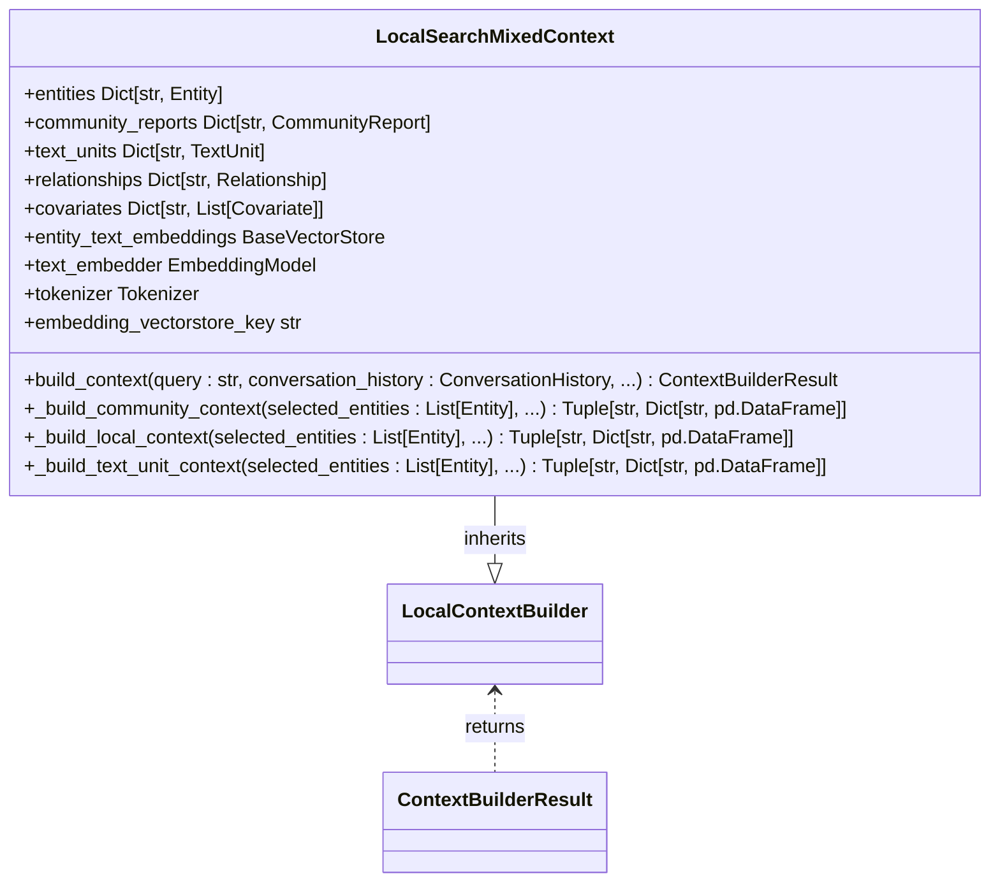
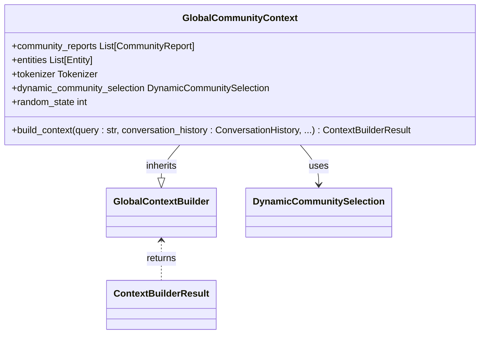
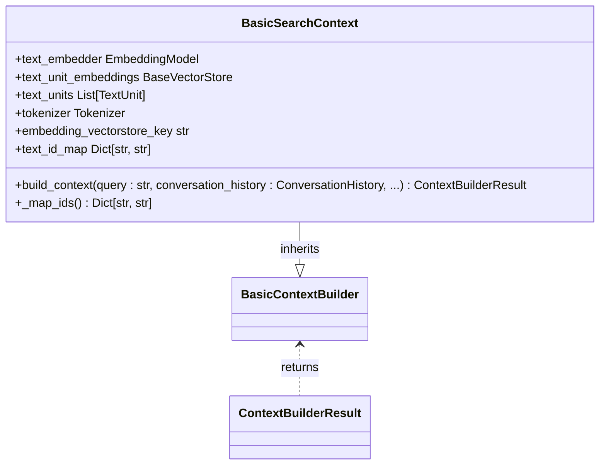
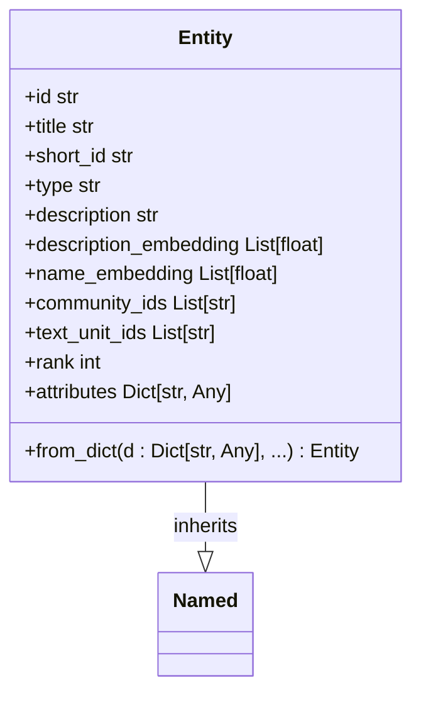
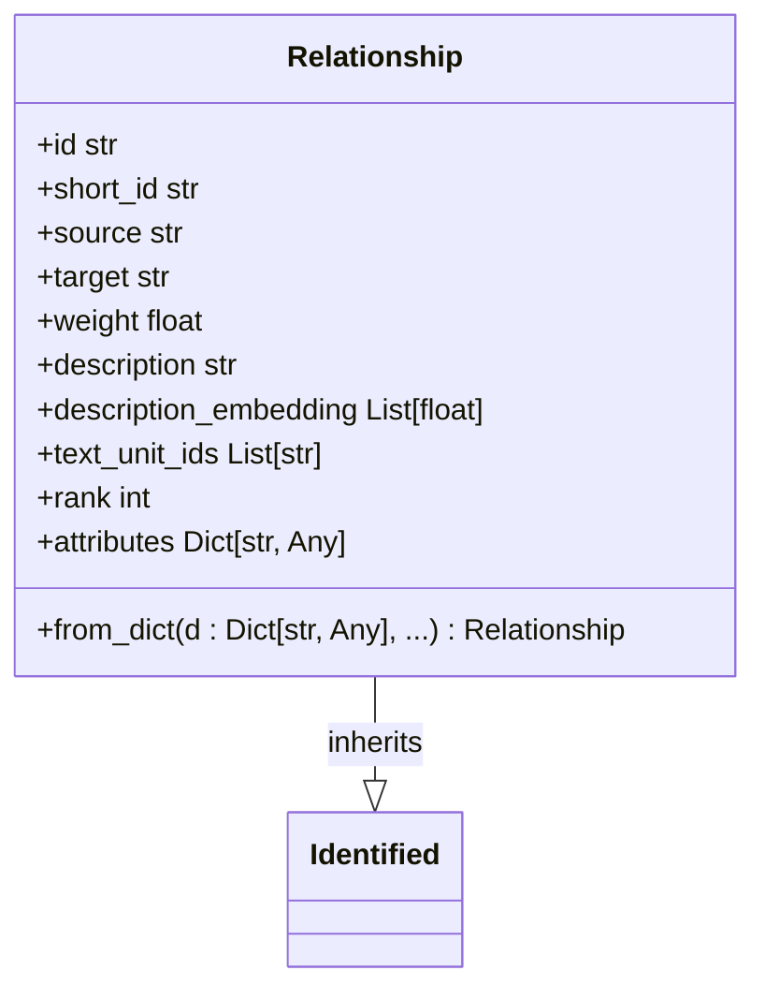
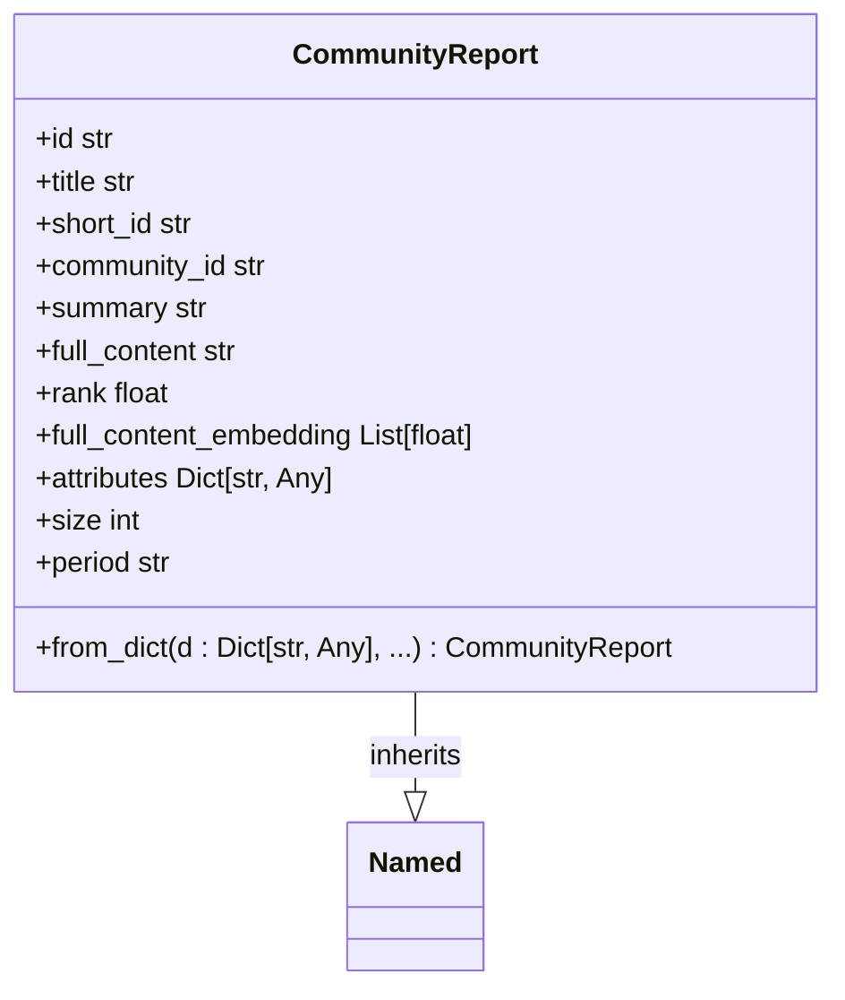
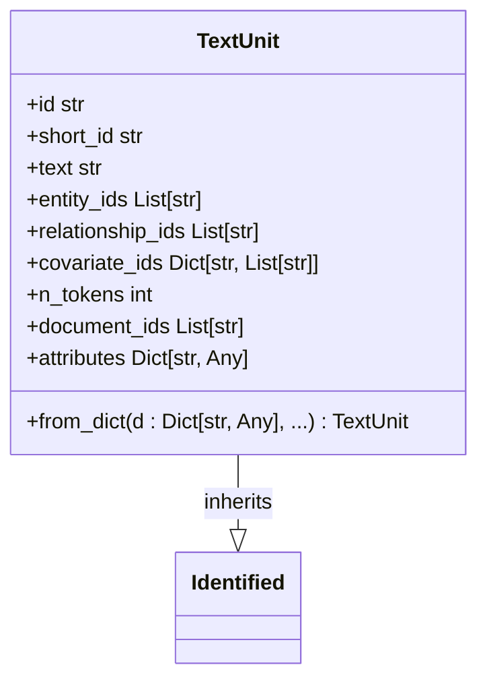
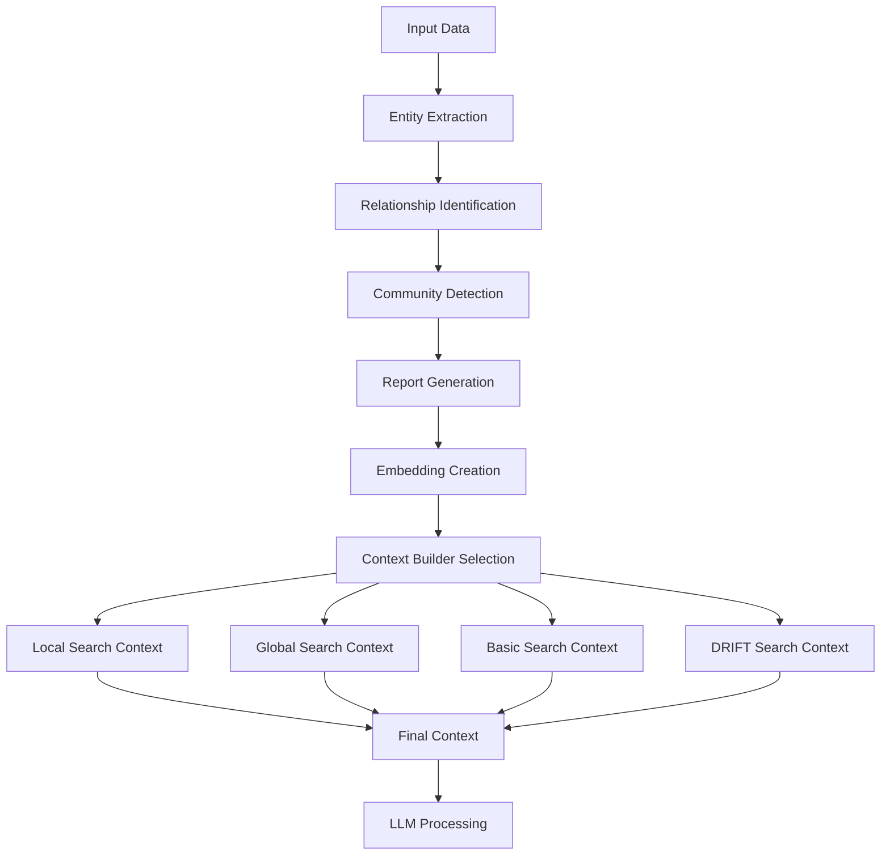
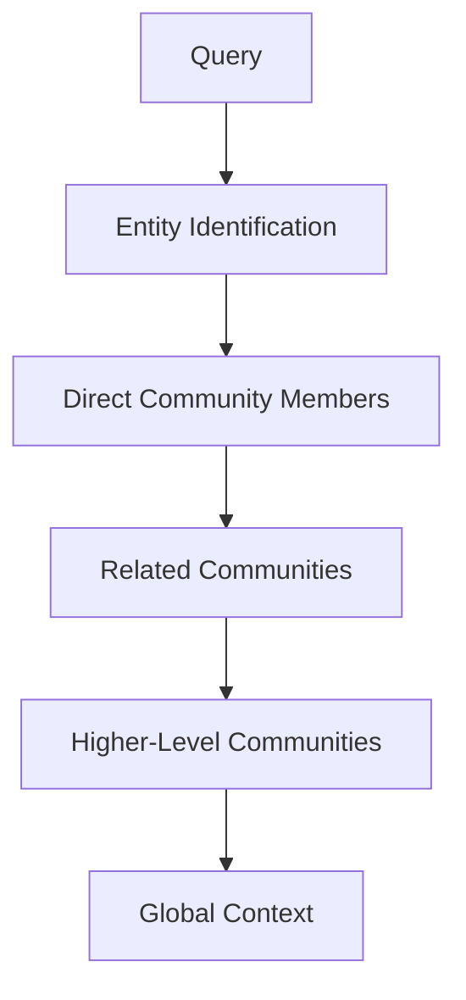
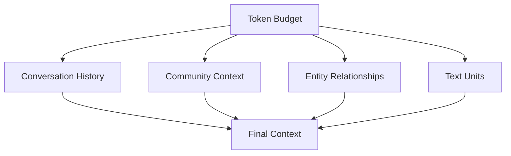

# Context Building

<cite>
**Referenced Files in This Document**   
- [builders.py](file://graphrag/query/context_builder/builders.py)
- [community_context.py](file://graphrag/query/context_builder/community_context.py)
- [local_context.py](file://graphrag/query/context_builder/local_context.py)
- [mixed_context.py](file://graphrag/query/structured_search/local_search/mixed_context.py)
- [community_context.py](file://graphrag/query/structured_search/global_search/community_context.py)
- [basic_context.py](file://graphrag/query/structured_search/basic_search/basic_context.py)
- [drift_context.py](file://graphrag/query/structured_search/drift_search/drift_context.py)
- [entity.py](file://graphrag/data_model/entity.py)
- [relationship.py](file://graphrag/data_model/relationship.py)
- [community_report.py](file://graphrag/data_model/community_report.py)
- [text_unit.py](file://graphrag/data_model/text_unit.py)
- [get_tokenizer.py](file://graphrag/tokenizer/get_tokenizer.py)
</cite>

## Table of Contents
1. [Introduction](#introduction)
2. [Core Context Builders](#core-context-builders)
3. [Data Models](#data-models)
4. [Context Construction Process](#context-construction-process)
5. [Data Access Patterns](#data-access-patterns)
6. [Performance Considerations](#performance-considerations)
7. [Security Considerations](#security-considerations)
8. [Conclusion](#conclusion)

## Introduction

The GraphRAG Context Building system is a sophisticated framework designed to extract and structure information from various data sources to create optimized query contexts for LLM processing. This system leverages multiple context builders that work with entities, relationships, community reports, and text units to provide relevant and structured information based on the query type and context requirements.

The context building process is fundamental to the GraphRAG architecture, as it determines how information is retrieved, filtered, and presented to the language model. Different context builders serve specific purposes and use different strategies to extract and prioritize information, ensuring that the LLM receives the most relevant data within token limitations.

This documentation provides a comprehensive overview of the context building system, detailing the various context builders, their data models, construction processes, and optimization strategies.

**Section sources**
- [builders.py](file://graphrag/query/context_builder/builders.py#L1-L76)

## Core Context Builders

The GraphRAG system implements several specialized context builders, each designed for specific query patterns and information retrieval needs. These builders inherit from abstract base classes that define the interface for context construction.

### LocalSearchMixedContext

The `LocalSearchMixedContext` builder combines community reports with entity-relationship-covariate tables and text units to create a comprehensive local search context. It uses configurable proportions to balance different data types within the context window.

Key features:
- Combines community reports, entity relationships, and text units
- Uses configurable proportions (community_prop, text_unit_prop) to balance data types
- Implements entity-to-query mapping through embedding similarity
- Supports conversation history integration
- Filters entities based on inclusion/exclusion lists

The builder follows a sequential construction process: first processing conversation history, then community context, local context (entities and relationships), and finally text unit context, all while respecting token limits.



**Diagram sources **
- [mixed_context.py](file://graphrag/query/structured_search/local_search/mixed_context.py#L49-L494)

**Section sources**
- [mixed_context.py](file://graphrag/query/structured_search/local_search/mixed_context.py#L49-L494)

### GlobalCommunityContext

The `GlobalCommunityContext` builder is designed for global search operations, focusing on community reports as the primary information source. It supports dynamic community selection, allowing the system to identify the most relevant communities for a given query.

Key features:
- Processes community reports as primary context data
- Supports dynamic community selection using LLM-based ranking
- Handles conversation history integration
- Implements community weighting based on entity relationships
- Supports batched context generation for large datasets

The builder can operate in two modes: static (using all available community reports) or dynamic (selecting communities based on query relevance). In dynamic mode, it uses an LLM to evaluate community relevance, tracking token usage and API calls for performance monitoring.



**Diagram sources **
- [community_context.py](file://graphrag/query/structured_search/global_search/community_context.py#L25-L145)

**Section sources**
- [community_context.py](file://graphrag/query/structured_search/global_search/community_context.py#L25-L145)

### BasicSearchContext

The `BasicSearchContext` builder implements a simple text-based retrieval system that finds relevant text units based on semantic similarity to the query. This builder is designed for straightforward information retrieval without complex graph-based reasoning.

Key features:
- Uses vector similarity search to find relevant text units
- Implements token-aware context construction to prevent overflow
- Supports configurable result limits (k parameter)
- Maps text unit IDs to human-readable short IDs
- Provides simple CSV-formatted context output

The builder performs a similarity search on text unit embeddings, ranks results, and incrementally adds them to the context until reaching the token limit. This approach ensures that the most relevant information is prioritized while maintaining strict token budget adherence.



**Diagram sources **
- [basic_context.py](file://graphrag/query/structured_search/basic_search/basic_context.py#L24-L114)

**Section sources**
- [basic_context.py](file://graphrag/query/structured_search/basic_search/basic_context.py#L24-L114)

### DRIFTSearchContextBuilder

The `DRIFTSearchContextBuilder` implements a sophisticated search strategy that combines embedding-based retrieval with iterative refinement. This builder is designed for complex queries that require deep exploration of community reports.

Key features:
- Uses embedding similarity to identify relevant community reports
- Implements vectorized cosine similarity computation for efficiency
- Validates embedding compatibility between queries and documents
- Returns top-k most similar community reports
- Tracks token usage for performance monitoring

The builder converts community reports to a DataFrame, computes similarity scores between the query embedding and report embeddings, and returns the most relevant reports. This approach enables efficient retrieval from large collections of community reports while maintaining high relevance.

```mermaid
classDiagram
class DRIFTSearchContextBuilder {
+model ChatModel
+text_embedder EmbeddingModel
+entities List[Entity]
+entity_text_embeddings BaseVectorStore
+text_units List[TextUnit]
+reports List[CommunityReport]
+relationships List[Relationship]
+covariates Dict[str, List[Covariate]]
+tokenizer Tokenizer
+embedding_vectorstore_key str
+config DRIFTSearchConfig
+local_system_prompt str
+reduce_system_prompt str
+response_type str
+local_mixed_context LocalSearchMixedContext
+build_context(query : str, ...) Tuple[pd.DataFrame, Dict[str, int]]
+init_local_context_builder() LocalSearchMixedContext
+convert_reports_to_df(reports : List[CommunityReport]) pd.DataFrame
+check_query_doc_encodings(query_embedding : Any, embedding : Any) bool
}
DRIFTSearchContextBuilder --|> DRIFTContextBuilder : inherits
DRIFTContextBuilder <.. pd.DataFrame : returns
DRIFTContextBuilder <.. Dict[str, int] : returns
```

**Diagram sources **
- [drift_context.py](file://graphrag/query/structured_search/drift_search/drift_context.py#L36-L228)

**Section sources**
- [drift_context.py](file://graphrag/query/structured_search/drift_search/drift_context.py#L36-L228)

## Data Models

The context building system relies on several core data models that represent the fundamental entities and relationships in the knowledge graph. These models define the structure of the data used in context construction.

### Entity Model

The `Entity` class represents a named entity in the knowledge graph with various attributes and relationships.



**Fields:**
- **id**: Unique identifier for the entity
- **title**: Human-readable name of the entity
- **short_id**: Human-readable short identifier
- **type**: Categorical type of the entity
- **description**: Textual description of the entity
- **description_embedding**: Semantic embedding of the description
- **name_embedding**: Semantic embedding of the name
- **community_ids**: List of community IDs the entity belongs to
- **text_unit_ids**: List of text units where the entity appears
- **rank**: Importance ranking (higher = more important)
- **attributes**: Additional metadata as key-value pairs

**Section sources**
- [entity.py](file://graphrag/data_model/entity.py#L1-L70)

### Relationship Model

The `Relationship` class represents connections between entities in the knowledge graph.



**Fields:**
- **source**: Name of the source entity
- **target**: Name of the target entity
- **weight**: Strength of the relationship
- **description**: Textual description of the relationship
- **description_embedding**: Semantic embedding of the description
- **text_unit_ids**: List of text units where the relationship appears
- **rank**: Importance ranking
- **attributes**: Additional metadata

**Section sources**
- [relationship.py](file://graphrag/data_model/relationship.py#L1-L66)

### CommunityReport Model

The `CommunityReport` class contains summarized information about a community of related entities.



**Fields:**
- **community_id**: Identifier for the associated community
- **summary**: Concise summary of the community
- **full_content**: Detailed content of the community report
- **rank**: Importance ranking
- **full_content_embedding**: Semantic embedding of the full content
- **size**: Number of text units in the report
- **period**: Temporal period covered by the report

**Section sources**
- [community_report.py](file://graphrag/data_model/community_report.py#L1-L68)

### TextUnit Model

The `TextUnit` class represents a chunk of text with associated entities and relationships.



**Fields:**
- **text**: The actual text content
- **entity_ids**: List of entity IDs mentioned in the text
- **relationship_ids**: List of relationship IDs mentioned in the text
- **covariate_ids**: Dictionary of covariate type to ID lists
- **n_tokens**: Number of tokens in the text
- **document_ids**: List of document IDs containing this text unit

**Section sources**
- [text_unit.py](file://graphrag/data_model/text_unit.py#L1-L63)

## Context Construction Process

The context construction process follows a systematic approach to extract, filter, and structure information for LLM processing. Each context builder implements a specific strategy based on its purpose and data sources.

### Data Flow Architecture

The context building system follows a layered architecture where data flows from raw inputs through various processing stages to produce the final context.



**Diagram sources **
- [builders.py](file://graphrag/query/context_builder/builders.py#L1-L76)
- [mixed_context.py](file://graphrag/query/structured_search/local_search/mixed_context.py#L49-L494)

### Entity-to-Query Mapping

The local search context builders use a sophisticated entity-to-query mapping process to identify relevant entities:

1. The query is embedded using the text embedder
2. Similarity search is performed against entity text embeddings
3. Top-k entities are selected based on similarity scores
4. Entities are filtered based on inclusion/exclusion criteria
5. Selected entities are used as the basis for further context construction

This process ensures that the context is centered around entities most relevant to the query, providing a focused and coherent information set for the LLM.

### Community Context Construction

The community context construction process involves several steps:

1. **Entity Matching**: Identify communities associated with selected entities
2. **Weight Calculation**: Compute community weights based on entity relationships
3. **Ranking**: Sort communities by match count and rank
4. **Context Generation**: Format community reports with appropriate metadata
5. **Token Management**: Split context into batches if necessary to fit token limits

The process uses a sliding window approach to add community reports until reaching the token limit, ensuring optimal use of the available context space.

### Relationship Filtering Strategy

The relationship filtering strategy prioritizes connections based on multiple criteria:

1. **In-Network Relationships**: Connections between selected entities are prioritized
2. **Out-of-Network Relationships**: Connections to external entities are considered next
3. **Mutual Relationships**: External entities connected to multiple selected entities are prioritized
4. **Rank-Based Sorting**: Relationships are sorted by rank and other attributes

This hierarchical approach ensures that the most relevant and interconnected relationships are included in the context.

**Section sources**
- [local_context.py](file://graphrag/query/context_builder/local_context.py#L1-L358)
- [community_context.py](file://graphrag/query/context_builder/community_context.py#L1-L265)

## Data Access Patterns

The context building system implements several optimized data access patterns to efficiently retrieve and process information.

### Hierarchical Community Selection

The system uses a hierarchical approach to community selection, starting from specific entities and expanding to broader communities:



This pattern ensures that the most specific and relevant communities are considered first, with broader contexts added as needed.

### Progressive Context Enrichment

The context builders implement a progressive enrichment strategy, adding information in order of relevance:

1. **Primary Context**: Directly relevant entities and communities
2. **Secondary Context**: Related relationships and covariates
3. **Tertiary Context**: Supporting text units and evidence
4. **Historical Context**: Conversation history and previous interactions

This approach maximizes the information density of the context window by prioritizing the most valuable information.

### Token-Aware Data Retrieval

All context builders implement token-aware data retrieval to prevent context overflow:

```python
# Pseudocode for token-aware retrieval
current_tokens = 0
for item in candidate_items:
    item_tokens = tokenizer.count_tokens(item)
    if current_tokens + item_tokens > max_context_tokens:
        break
    add_item_to_context(item)
    current_tokens += item_tokens
```

This pattern ensures that the context stays within token limits while maximizing information content.

**Section sources**
- [mixed_context.py](file://graphrag/query/structured_search/local_search/mixed_context.py#L49-L494)
- [basic_context.py](file://graphrag/query/structured_search/basic_search/basic_context.py#L24-L114)

## Performance Considerations

The context building system incorporates several performance optimization strategies to ensure efficient operation and optimal LLM performance.

### Token Usage Optimization

The system implements comprehensive token usage optimization through:

- **Precise Token Counting**: Using accurate tokenizer implementations to measure context size
- **Proportional Allocation**: Distributing token budget across different context components
- **Early Termination**: Stopping context construction when limits are reached
- **Batch Processing**: Handling large datasets in manageable chunks

The `get_tokenizer` function provides access to appropriate tokenizer implementations based on the language model configuration, ensuring accurate token counting across different models.



**Diagram sources **
- [get_tokenizer.py](file://graphrag/tokenizer/get_tokenizer.py#L1-L42)

### Caching Strategies

The system employs multiple caching strategies to improve performance:

- **Vector Store Caching**: Caching embedding vectors for frequently accessed entities
- **Context Caching**: Storing previously constructed contexts for similar queries
- **Tokenizer Caching**: Caching tokenizer instances to avoid initialization overhead
- **LLM Response Caching**: Caching LLM responses for identical or similar prompts

These caching mechanisms reduce redundant computations and improve response times, particularly for repeated or similar queries.

### Rate Limiting and Throttling

The system implements rate limiting to manage LLM API usage:

- **Token Per Minute (TPM) Limits**: Enforcing token usage limits over time
- **Request Queuing**: Managing requests when limits are exceeded
- **Priority Handling**: Prioritizing critical operations during high load
- **Graceful Degradation**: Maintaining functionality when rate limits are reached

The rate limiting system allows requests that exceed TPM limits if they are within the model's context window, ensuring that important queries can still be processed.

**Section sources**
- [get_tokenizer.py](file://graphrag/tokenizer/get_tokenizer.py#L1-L42)
- [static_rate_limiter.py](file://graphrag/language_model/providers/litellm/services/rate_limiter/static_rate_limiter.py#L91-L114)

## Security Considerations

The context building system incorporates several security measures to protect sensitive information.

### Data Filtering and Redaction

The system implements data filtering mechanisms to prevent sensitive information exposure:

- **Entity Filtering**: Allowing inclusion/exclusion of specific entities
- **Attribute Masking**: Redacting sensitive attributes from context output
- **Content Filtering**: Removing or anonymizing sensitive text content
- **Access Control**: Restricting access to certain data based on user permissions

These measures ensure that only appropriate information is included in the context, protecting privacy and complying with data protection regulations.

### Secure Data Handling

The system follows secure data handling practices:

- **In-Memory Processing**: Keeping sensitive data in memory rather than persistent storage
- **Encryption**: Encrypting data at rest and in transit
- **Audit Logging**: Tracking access to sensitive information
- **Data Minimization**: Including only necessary information in context

These practices help maintain the confidentiality and integrity of the data processed by the system.

**Section sources**
- [mixed_context.py](file://graphrag/query/structured_search/local_search/mixed_context.py#L49-L494)
- [local_context.py](file://graphrag/query/context_builder/local_context.py#L1-L358)

## Conclusion

The GraphRAG Context Building system provides a comprehensive framework for extracting and structuring information from knowledge graphs for LLM processing. Through specialized context builders, well-defined data models, and optimized construction processes, the system delivers relevant, structured information within token constraints.

The system's modular design allows for different search strategies (local, global, basic, DRIFT) to be applied based on the query requirements. Each context builder implements specific patterns for information retrieval, filtering, and prioritization, ensuring optimal performance and relevance.

Key strengths of the system include:
- Flexible context construction with multiple builder types
- Efficient token usage optimization
- Hierarchical data access patterns
- Comprehensive performance optimizations
- Security-conscious data handling

Developers can leverage this system to create sophisticated query interfaces that provide LLMs with precisely structured context, enabling more accurate and relevant responses. The extensible architecture allows for customization and enhancement to meet specific application requirements.