# DRIFT Search

<cite>
**Referenced Files in This Document**
- [search.py](file://graphrag/query/structured_search/drift_search/search.py)
- [state.py](file://graphrag/query/structured_search/drift_search/state.py)
- [action.py](file://graphrag/query/structured_search/drift_search/action.py)
- [drift_context.py](file://graphrag/query/structured_search/drift_search/drift_context.py)
- [primer.py](file://graphrag/query/structured_search/drift_search/primer.py)
- [drift_search_config.py](file://graphrag/config/models/drift_search_config.py)
- [drift_search_system_prompt.py](file://graphrag/prompts/query/drift_search_system_prompt.py)
- [base.py](file://graphrag/query/structured_search/base.py)
- [factory.py](file://graphrag/query/factory.py)
</cite>

## Table of Contents
1. [Introduction](#introduction)
2. [DRIFT Methodology Overview](#drift-methodology-overview)
3. [Core Components Architecture](#core-components-architecture)
4. [DRIFTSearch Class Implementation](#driftsearch-class-implementation)
5. [DRIFTSearchContextBuilder](#driftsearchcontextbuilder)
6. [Iterative Refinement Process](#iterative-refinement-process)
7. [Domain Model and Prompts](#domain-model-and-prompts)
8. [State Management System](#state-management-system)
9. [Action-Based Search Execution](#action-based-search-execution)
10. [Configuration and Parameters](#configuration-and-parameters)
11. [Common Issues and Solutions](#common-issues-and-solutions)
12. [Practical Usage Examples](#practical-usage-examples)
13. [Performance Considerations](#performance-considerations)
14. [Troubleshooting Guide](#troubleshooting-guide)

## Introduction

DRIFT (Dynamic Recursive Iterative Feedback Tuning) Search is a sophisticated search methodology within GraphRAG that implements an iterative refinement process to progressively enhance search results through multiple feedback loops. Unlike traditional search approaches that provide a single response, DRIFT employs a tree-based exploration strategy where each search action generates follow-up queries that are systematically explored to achieve comprehensive coverage of the knowledge graph.

The DRIFT methodology transforms search queries into actionable tasks that are executed through a series of interconnected steps, each building upon previous insights to create a rich, multi-dimensional understanding of the query space. This approach enables deep exploration of complex topics while maintaining coherence and relevance throughout the search process.

## DRIFT Methodology Overview

DRIFT operates on the principle of recursive decomposition and iterative refinement, where each search step produces actionable insights that guide subsequent exploration. The methodology consists of several key phases:

1. **Query Priming**: Initial query expansion using community reports to generate diverse perspectives
2. **Action Generation**: Creation of executable search actions from intermediate answers
3. **Parallel Execution**: Concurrent execution of multiple search actions
4. **Feedback Integration**: Incorporation of results into a unified knowledge graph
5. **Response Reduction**: Consolidation of fragmented insights into coherent answers

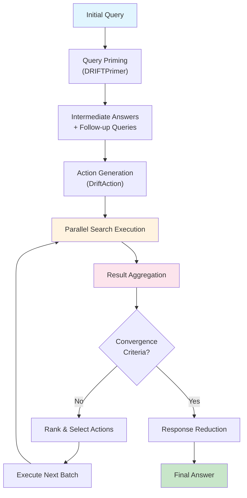

**Diagram sources**
- [search.py](file://graphrag/query/structured_search/drift_search/search.py#L180-L301)
- [primer.py](file://graphrag/query/structured_search/drift_search/primer.py#L101-L186)

## Core Components Architecture

The DRIFT Search system is built around several interconnected components that work together to implement the iterative refinement methodology:

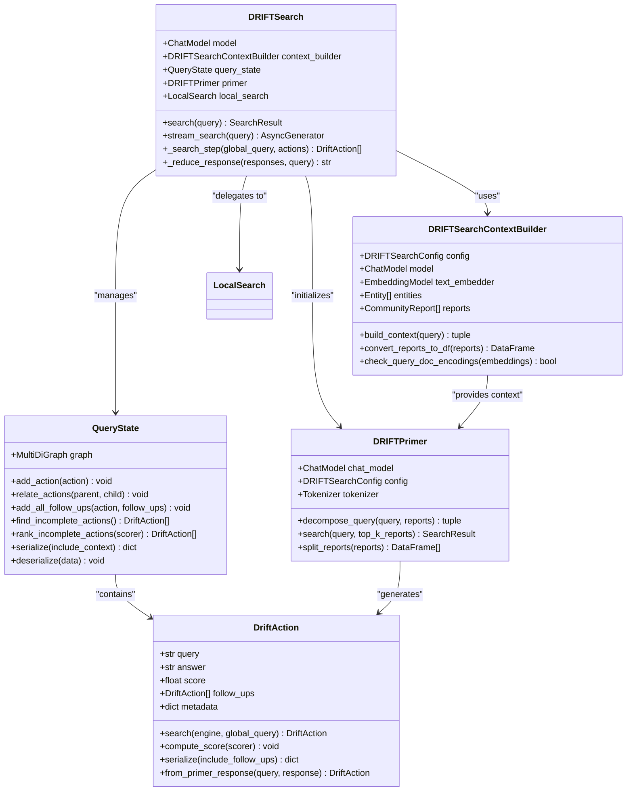

**Diagram sources**
- [search.py](file://graphrag/query/structured_search/drift_search/search.py#L34-L67)
- [drift_context.py](file://graphrag/query/structured_search/drift_search/drift_context.py#L37-L80)
- [state.py](file://graphrag/query/structured_search/drift_search/state.py#L18-L54)
- [action.py](file://graphrag/query/structured_search/drift_search/action.py#L15-L47)
- [primer.py](file://graphrag/query/structured_search/drift_search/primer.py#L101-L121)

**Section sources**
- [search.py](file://graphrag/query/structured_search/drift_search/search.py#L34-L67)
- [drift_context.py](file://graphrag/query/structured_search/drift_search/drift_context.py#L37-L80)
- [state.py](file://graphrag/query/structured_search/drift_search/state.py#L18-L54)
- [action.py](file://graphrag/query/structured_search/drift_search/action.py#L15-L47)
- [primer.py](file://graphrag/query/structured_search/drift_search/primer.py#L101-L121)

## DRIFTSearch Class Implementation

The `DRIFTSearch` class serves as the primary orchestrator for the DRIFT methodology, implementing the core search algorithm with sophisticated state management and iterative refinement capabilities.

### Initialization and Dependencies

The constructor initializes all necessary components and establishes the foundational infrastructure for DRIFT search operations:

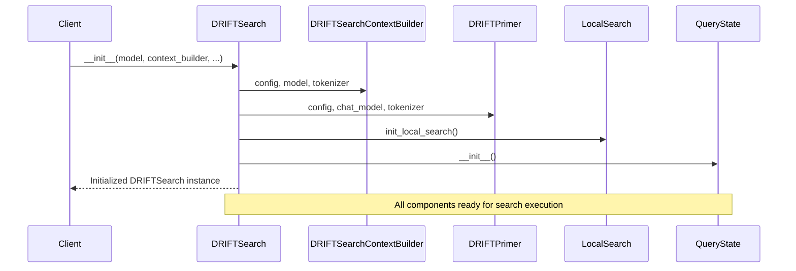

**Diagram sources**
- [search.py](file://graphrag/query/structured_search/drift_search/search.py#L37-L67)

### Core Search Algorithm

The main search method implements the iterative refinement process with comprehensive error handling and performance monitoring:

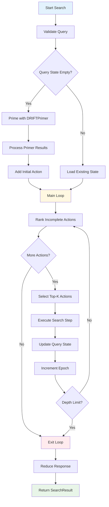

**Diagram sources**
- [search.py](file://graphrag/query/structured_search/drift_search/search.py#L180-L301)

### Streaming Search Implementation

The streaming variant provides real-time response generation for interactive applications:

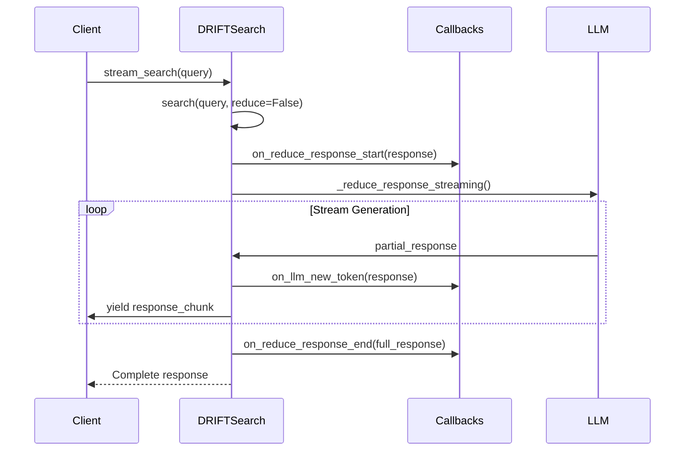

**Diagram sources**
- [search.py](file://graphrag/query/structured_search/drift_search/search.py#L303-L349)

**Section sources**
- [search.py](file://graphrag/query/structured_search/drift_search/search.py#L34-L301)

## DRIFTSearchContextBuilder

The `DRIFTSearchContextBuilder` manages the construction of search contexts and provides essential utilities for the DRIFT methodology. It serves as the bridge between raw data and the search execution engine.

### Context Building Process

The context building process involves sophisticated embedding-based similarity computation and report processing:

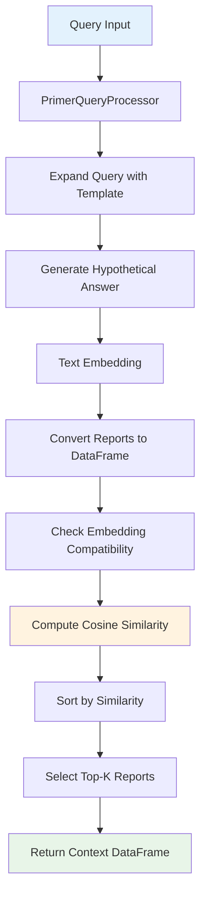

**Diagram sources**
- [drift_context.py](file://graphrag/query structured_search/drift_search/drift_context.py#L166-L227)

### Report Processing and Validation

The context builder implements robust validation mechanisms to ensure data integrity:

| Validation Step | Purpose | Error Handling |
|----------------|---------|----------------|
| Content Presence | Verify full_content exists in reports | Raises ValueError with descriptive message |
| Embedding Completeness | Ensure full_content_embedding availability | Calculates missing counts for transparency |
| Embedding Compatibility | Check type and dimension consistency | Validates embedding structure and dimensions |
| DataFrame Structure | Confirm required columns are present | Provides detailed error reporting |

### Local Context Initialization

The builder automatically initializes the local search context for subsequent search operations:

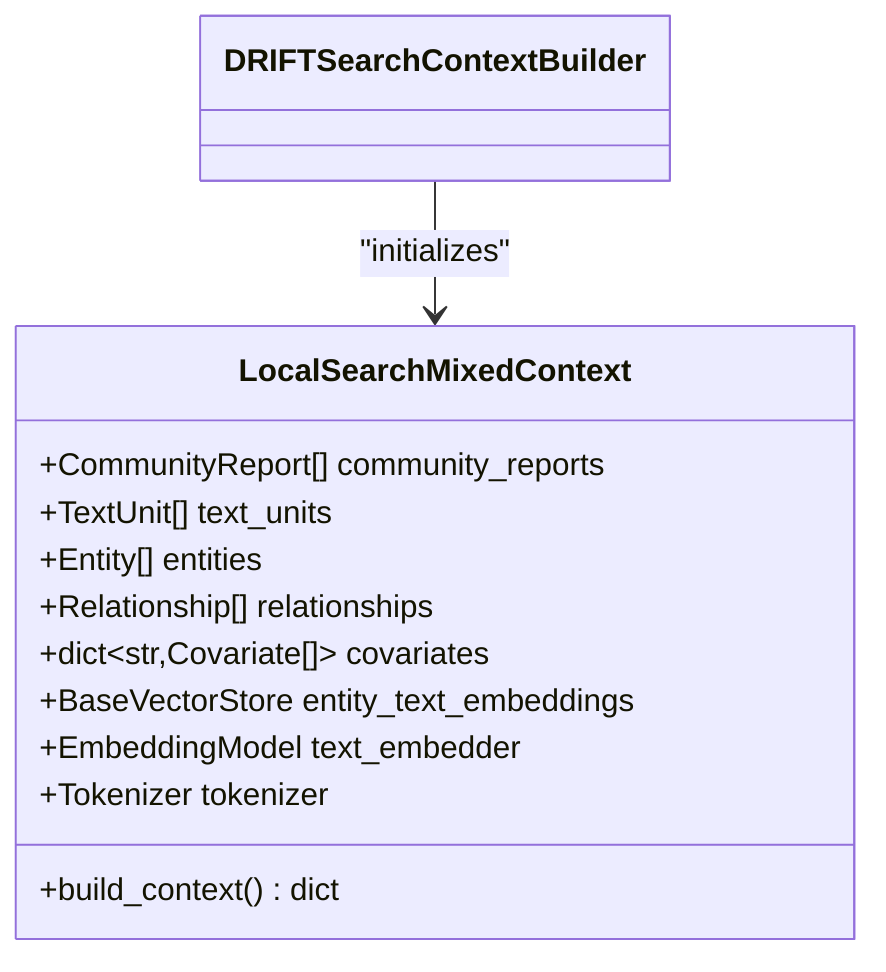

**Diagram sources**
- [drift_context.py](file://graphrag/query structured_search/drift_search/drift_context.py#L76-L98)

**Section sources**
- [drift_context.py](file://graphrag/query structured_search/drift_search/drift_context.py#L37-L227)

## Iterative Refinement Process

The iterative refinement process is the heart of the DRIFT methodology, implementing a sophisticated feedback loop that progressively enhances search quality through multiple iterations.

### Primer Phase - Query Decomposition

The primer phase transforms the initial query into actionable search tasks:

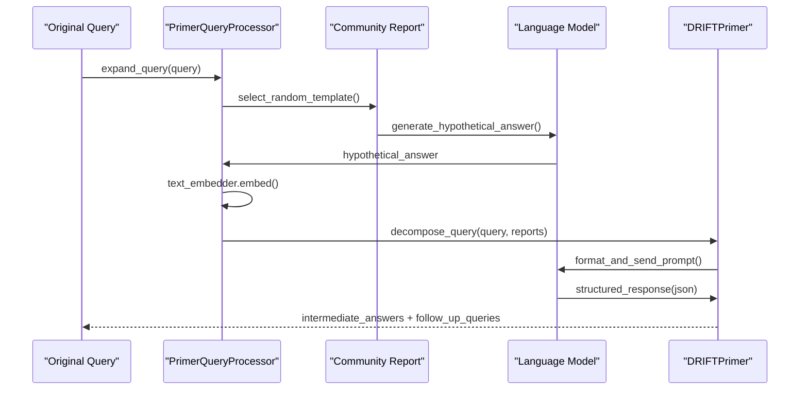

**Diagram sources**
- [primer.py](file://graphrag/query structured_search/drift_search/primer.py#L28-L101)

### Action Execution Pipeline

Each action represents a discrete search task that contributes to the overall knowledge graph:

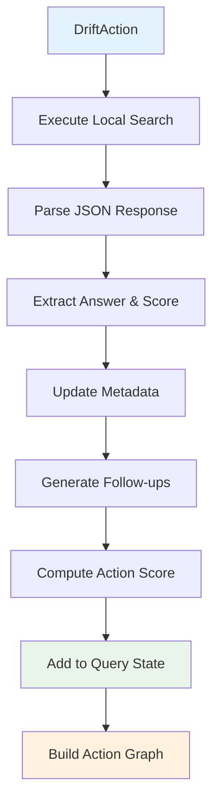

**Diagram sources**
- [action.py](file://graphrag/query structured_search/drift_search/action.py#L53-L99)

### Convergence Criteria and Termination

The system implements multiple termination conditions to prevent infinite loops:

| Criterion | Description | Implementation |
|-----------|-------------|----------------|
| Depth Limit | Maximum number of iterations | Configurable via `n_depth` parameter |
| Action Completion | All actions have answers | Monitors `is_complete` property |
| Token Limits | Context size constraints | Tracks cumulative token usage |
| Performance Thresholds | Response quality metrics | Uses scoring system for evaluation |

**Section sources**
- [search.py](file://graphrag/query structured_search/drift_search/search.py#L158-L251)
- [primer.py](file://graphrag/query structured_search/drift_search/primer.py#L101-L186)
- [action.py](file://graphrag/query structured_search/drift_search/action.py#L53-L99)

## Domain Model and Prompts

The DRIFT methodology relies on carefully crafted prompts that guide the language model through the iterative refinement process.

### System Prompt Architecture

The system uses two primary prompts that serve distinct roles in the DRIFT process:

#### Local System Prompt (`DRIFT_LOCAL_SYSTEM_PROMPT`)
- **Purpose**: Guides local search execution within individual knowledge domains
- **Structure**: Role-based instruction with context injection and response formatting
- **Key Features**: Citation tracking, response length specification, JSON output formatting

#### Reduce System Prompt (`DRIFT_REDUCE_PROMPT`)
- **Purpose**: Consolidates fragmented search results into coherent responses
- **Structure**: Hierarchical synthesis with cross-reference integration
- **Key Features**: Multi-report processing, knowledge integration, concise summarization

### Primer Prompt Design

The primer prompt implements a sophisticated reasoning framework:

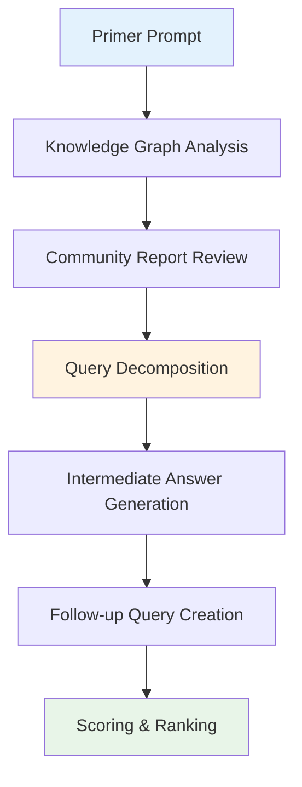

**Diagram sources**
- [drift_search_system_prompt.py](file://graphrag/prompts/query/drift_search_system_prompt.py#L139-L167)

### Prompt Parameterization

The prompts support extensive customization through template variables:

| Variable | Purpose | Example Values |
|----------|---------|----------------|
| `{response_type}` | Target response format | "Multiple Paragraphs", "List Format" |
| `{context_data}` | Search context injection | JSON-formatted knowledge graph data |
| `{global_query}` | Original query preservation | Full user query string |
| `{community_reports}` | Report content injection | Structured community summary data |

**Section sources**
- [drift_search_system_prompt.py](file://graphrag/prompts/query/drift_search_system_prompt.py#L6-L167)

## State Management System

The state management system maintains the evolving knowledge graph through sophisticated graph-based representation and intelligent ranking mechanisms.

### QueryState Architecture

The `QueryState` class implements a directed multigraph that captures the relationships between search actions:

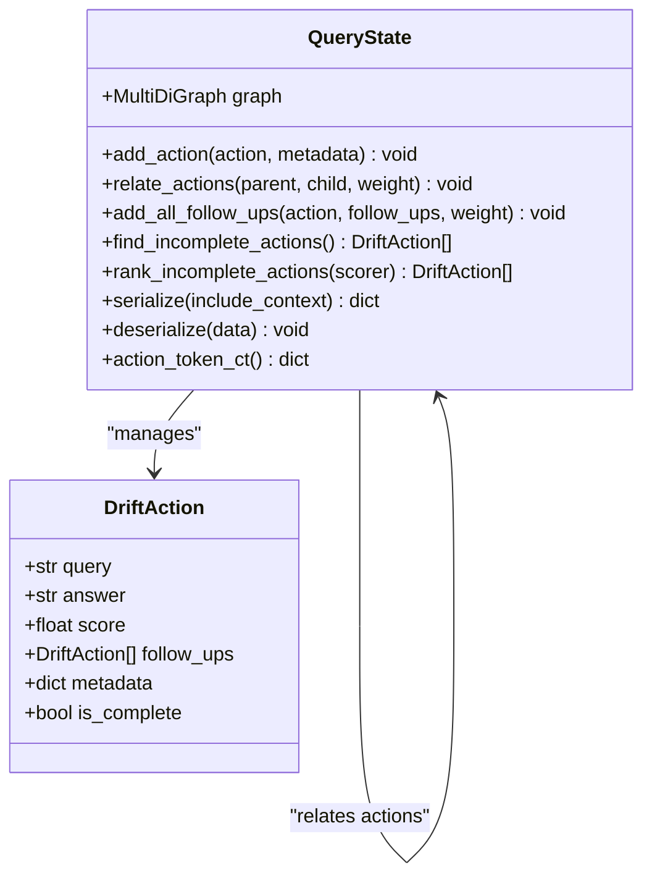

**Diagram sources**
- [state.py](file://graphrag/query structured_search/drift_search/state.py#L18-L54)

### Action Ranking and Selection

The system implements intelligent action ranking based on multiple criteria:

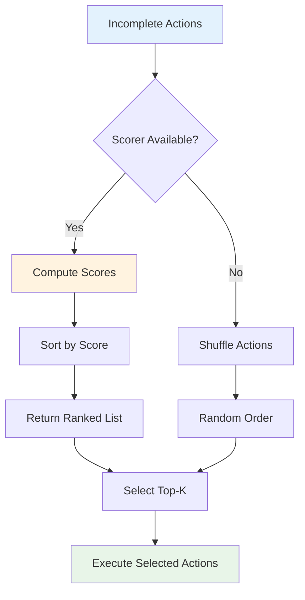

**Diagram sources**
- [state.py](file://graphrag/query structured_search/drift_search/state.py#L55-L77)

### Serialization and Persistence

The state management system supports comprehensive serialization for state persistence and debugging:

| Component | Serialization Format | Purpose |
|-----------|---------------------|---------|
| Nodes | JSON with action data | Individual action state preservation |
| Edges | Weighted connections | Action dependency relationships |
| Metadata | Embedded dictionaries | Performance metrics and execution data |
| Context | Optional inclusion | Search context preservation |

**Section sources**
- [state.py](file://graphrag/query structured_search/drift_search/state.py#L18-L151)

## Action-Based Search Execution

The action-based execution model transforms search queries into discrete, manageable tasks that can be executed independently and in parallel.

### DriftAction Lifecycle

Each `DriftAction` follows a well-defined lifecycle that ensures consistent behavior across the search process:

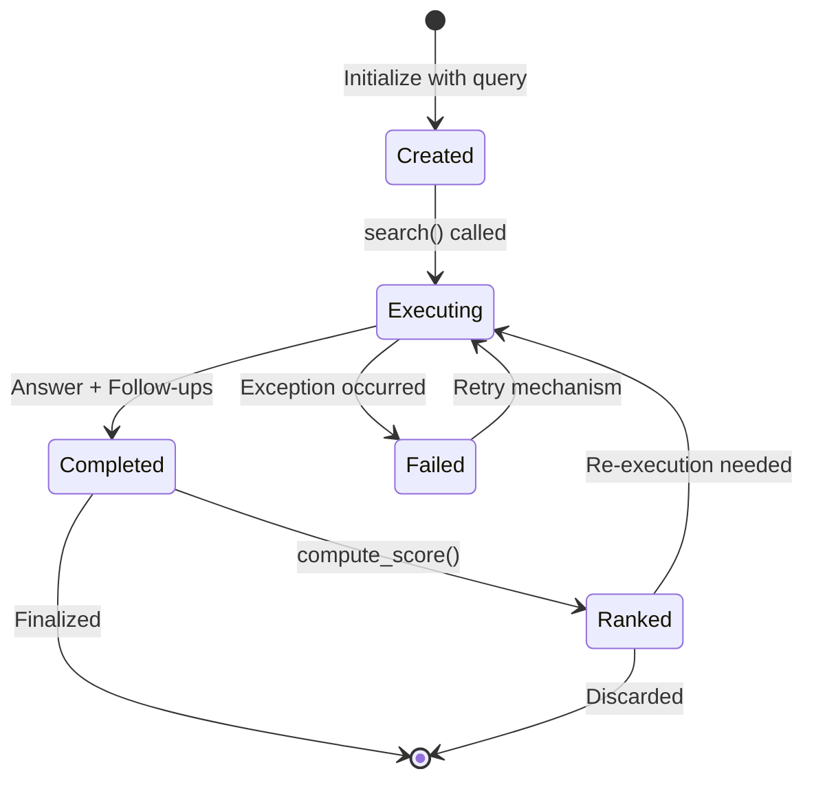

**Diagram sources**
- [action.py](file://graphrag/query structured_search/drift_search/action.py#L53-L99)

### Parallel Execution Strategy

The system implements sophisticated parallel execution to maximize throughput:

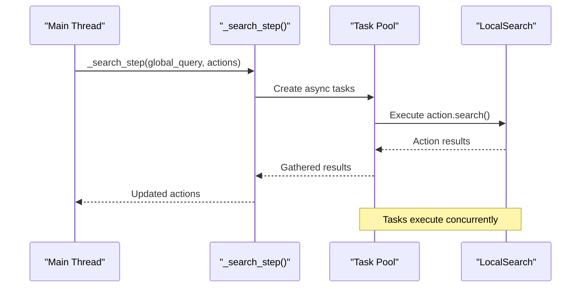

**Diagram sources**
- [search.py](file://graphrag/query structured_search/drift_search/search.py#L158-L177)

### Action Composition and Dependencies

Actions can generate follow-up actions, creating a hierarchical structure that enables deep exploration:

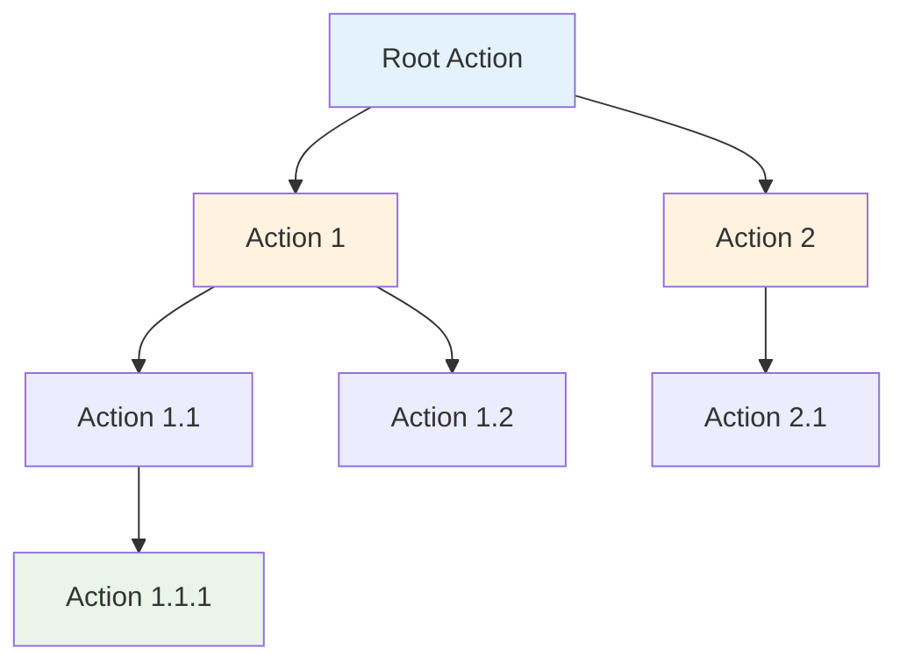

**Diagram sources**
- [action.py](file://graphrag/query structured_search/drift_search/action.py#L15-L47)

**Section sources**
- [action.py](file://graphrag/query structured_search/drift_search/action.py#L15-L238)
- [search.py](file://graphrag/query structured_search/drift_search/search.py#L158-L177)

## Configuration and Parameters

The DRIFT Search system provides extensive configuration options to customize behavior for different use cases and performance requirements.

### Core Configuration Parameters

| Parameter | Type | Default | Description |
|-----------|------|---------|-------------|
| `n_depth` | int | 3 | Maximum number of iterative refinement steps |
| `drift_k_followups` | int | 5 | Number of follow-up actions to generate per iteration |
| `primer_folds` | int | 1 | Number of parallel processing folds for primer |
| `concurrency` | int | 5 | Maximum concurrent search operations |
| `data_max_tokens` | int | 8000 | Maximum tokens for search context |
| `reduce_max_tokens` | int | 2000 | Maximum tokens for response reduction |

### Local Search Configuration

The local search component inherits configuration from the broader system:

| Parameter | Type | Default | Purpose |
|-----------|------|---------|---------|
| `local_search_text_unit_prop` | float | 0.5 | Proportion of search focused on text units |
| `local_search_community_prop` | float | 0.5 | Proportion of search focused on community reports |
| `local_search_max_data_tokens` | int | 5000 | Maximum context size for local search |
| `local_search_temperature` | float | 0.1 | LLM temperature for local search generation |

### Advanced Configuration Options

The system supports fine-tuning through specialized parameters:

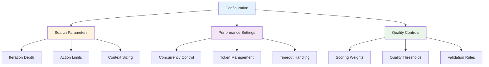

**Diagram sources**
- [drift_search_config.py](file://graphrag/config/models/drift_search_config.py#L11-L123)

**Section sources**
- [drift_search_config.py](file://graphrag/config/models/drift_search_config.py#L11-L123)

## Common Issues and Solutions

Understanding common issues and their solutions helps ensure reliable DRIFT Search operation across various scenarios.

### Iteration Limit Issues

**Problem**: Searches terminate prematurely due to iteration limits
**Solution**: Adjust `n_depth` parameter based on query complexity and available computational resources

**Problem**: Infinite loops in action generation
**Solution**: Implement proper convergence criteria and monitor action completion rates

### Convergence Criteria

**Problem**: Poor response quality despite multiple iterations
**Solution**: Fine-tune scoring mechanisms and adjust action selection strategies

**Problem**: Unbalanced action distribution
**Solution**: Use weighted action ranking and implement diversity controls

### Memory and Performance Issues

**Problem**: High memory consumption during large-scale searches
**Solution**: Implement pagination for large datasets and optimize state serialization

**Problem**: Slow response times
**Solution**: Enable parallel processing and optimize embedding computations

### Embedding Compatibility

**Problem**: Embedding dimension mismatches
**Solution**: Ensure consistent embedding models across the system and validate compatibility

**Problem**: Poor similarity calculations
**Solution**: Implement robust preprocessing and normalization for embedding vectors

### Error Handling Strategies

The system implements comprehensive error handling at multiple levels:

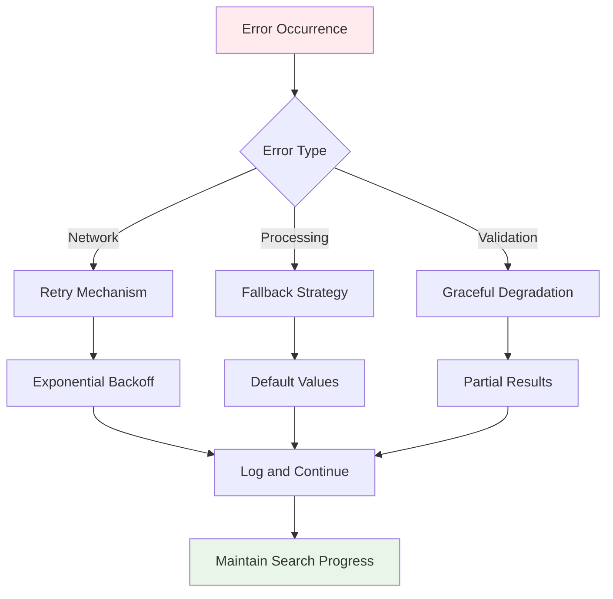

**Section sources**
- [search.py](file://graphrag/query structured_search/drift_search/search.py#L180-L301)
- [primer.py](file://graphrag/query structured_search/drift_search/primer.py#L101-L186)

## Practical Usage Examples

The following examples demonstrate practical implementation patterns for DRIFT Search in various scenarios.

### Basic DRIFT Search Implementation

```python
# Initialize DRIFT search engine
search_engine = get_drift_search_engine(
    config=graphrag_config,
    reports=community_reports,
    text_units=text_units,
    entities=entities,
    relationships=relationships,
    description_embedding_store=embedding_store,
    response_type="Multiple Paragraphs"
)

# Execute search
result = await search_engine.search(
    query="What are the key findings about climate change impacts?",
    reduce=True
)
```

### Streaming Search for Real-Time Applications

```python
# Stream search results for interactive applications
async for chunk in search_engine.stream_search(query):
    print(chunk, end="", flush=True)
```

### Custom Callback Implementation

```python
class CustomCallback(QueryCallbacks):
    def on_reduce_response_start(self, response):
        print(f"Starting response reduction: {len(response)} characters")
    
    def on_reduce_response_end(self, response):
        print(f"Completed response reduction")
    
    def on_llm_new_token(self, token):
        print(token, end="", flush=True)

# Use custom callbacks
callbacks = [CustomCallback()]
result = await search_engine.search(query, callbacks=callbacks)
```

### State Persistence and Recovery

```python
# Save search state
state_data = query_state.serialize(include_context=True)

# Restore search state
query_state.deserialize(state_data)
search_engine.query_state = query_state
```

**Section sources**
- [factory.py](file://graphrag/query/factory.py#L195-L247)
- [search.py](file://graphrag/query structured_search/drift_search/search.py#L303-L349)

## Performance Considerations

Optimizing DRIFT Search performance requires careful consideration of multiple factors that impact both speed and resource utilization.

### Computational Efficiency

The system implements several optimization strategies:

| Optimization | Implementation | Impact |
|--------------|----------------|--------|
| Parallel Processing | Async task execution with `tqdm_asyncio.gather()` | 3-5x throughput improvement |
| Embedding Caching | Vector store integration for pre-computed embeddings | Reduced latency for repeated queries |
| Context Pruning | Dynamic context size adjustment | Balanced quality vs. performance |
| Early Termination | Convergence detection | Prevents unnecessary computation |

### Memory Management

Effective memory management is crucial for large-scale deployments:

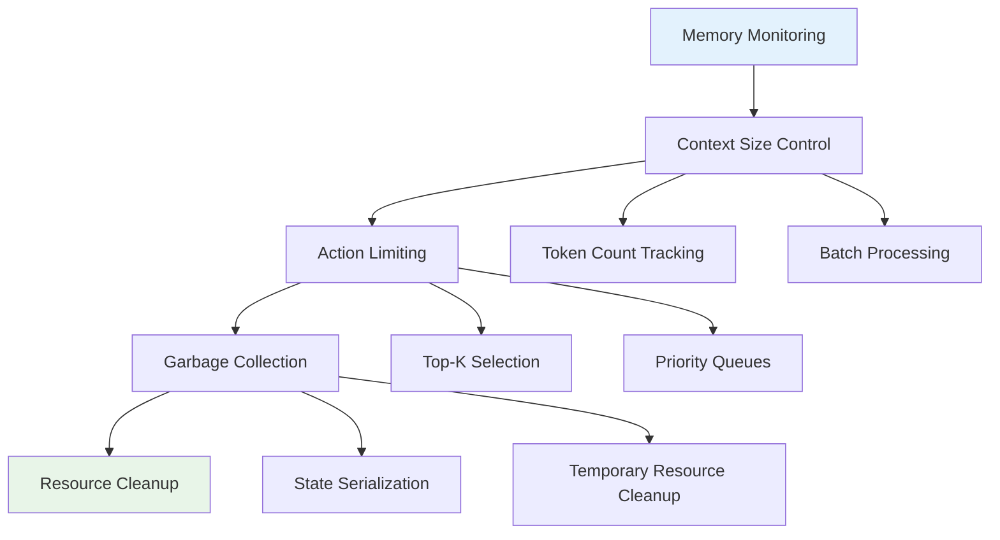

### Scalability Patterns

The system supports horizontal scaling through several mechanisms:

- **Distributed Processing**: Primer folding enables parallel processing across multiple workers
- **State Partitioning**: Large state graphs can be partitioned for distributed storage
- **Caching Layers**: Multiple caching levels reduce redundant computations
- **Load Balancing**: Intelligent task distribution optimizes resource utilization

**Section sources**
- [search.py](file://graphrag/query structured_search/drift_search/search.py#L158-L177)
- [primer.py](file://graphrag/query structured_search/drift_search/primer.py#L187-L202)

## Troubleshooting Guide

This section provides systematic approaches to diagnosing and resolving common issues encountered with DRIFT Search.

### Query Processing Issues

**Symptom**: Empty or irrelevant search results
**Diagnosis Steps**:
1. Verify community reports are properly loaded and contain content
2. Check embedding model compatibility and dimensionality
3. Validate query preprocessing and tokenization
4. Examine prompt formatting and parameter injection

**Resolution**: 
- Ensure reports have `full_content` and `full_content_embedding` fields
- Verify embedding models use consistent vector dimensions
- Test with simplified queries to isolate issues

### Performance Problems

**Symptom**: Slow response times or timeouts
**Diagnosis Approach**:
1. Monitor LLM call frequency and token usage
2. Analyze action execution patterns and completion rates
3. Check network connectivity and rate limiting
4. Evaluate system resource utilization

**Optimization Strategies**:
- Increase concurrency settings for parallel operations
- Implement result caching for repeated queries
- Optimize embedding computation and storage
- Use connection pooling for LLM services

### State Management Issues

**Symptom**: Inconsistent search results or state corruption
**Investigation Process**:
1. Validate state serialization and deserialization
2. Check action graph integrity and cycle detection
3. Monitor memory usage and garbage collection
4. Verify concurrent access protection

**Prevention Measures**:
- Implement state validation before restoration
- Use atomic operations for state updates
- Add checksums for state integrity verification
- Regular state cleanup and optimization

### Configuration Problems

**Symptom**: Unexpected behavior or parameter conflicts
**Systematic Resolution**:
1. Compare current configuration with defaults
2. Validate parameter ranges and dependencies
3. Test with minimal configuration sets
4. Review environment-specific settings

**Best Practices**:
- Use configuration validation frameworks
- Implement gradual parameter tuning
- Maintain configuration versioning
- Document custom parameter effects

**Section sources**
- [search.py](file://graphrag/query structured_search/drift_search/search.py#L180-L301)
- [state.py](file://graphrag/query structured_search/drift_search/state.py#L18-L151)
- [drift_context.py](file://graphrag/query structured_search/drift_search/drift_context.py#L166-L227)