# Global Search

<cite>
**Referenced Files in This Document**
- [search.py](file://graphrag/query/structured_search/global_search/search.py)
- [community_context.py](file://graphrag/query/structured_search/global_search/community_context.py)
- [dynamic_community_selection.py](file://graphrag/query/context_builder/dynamic_community_selection.py)
- [base.py](file://graphrag/query/structured_search/base.py)
- [builders.py](file://graphrag/query/context_builder/builders.py)
- [global_search_map_system_prompt.py](file://graphrag/prompts/query/global_search_map_system_prompt.py)
- [global_search_reduce_system_prompt.py](file://graphrag/prompts/query/global_search_reduce_system_prompt.py)
- [global_search_knowledge_system_prompt.py](file://graphrag/prompts/query/global_search_knowledge_system_prompt.py)
- [rate_relevancy.py](file://graphrag/query/context_builder/rate_relevancy.py)
- [rate_prompt.py](file://graphrag/query/context_builder/rate_prompt.py)
- [global_search_config.py](file://graphrag/config/models/global_search_config.py)
- [query.py](file://graphrag/api/query.py)
- [factory.py](file://graphrag/query/factory.py)
</cite>

## Table of Contents
1. [Introduction](#introduction)
2. [Architecture Overview](#architecture-overview)
3. [Core Components](#core-components)
4. [Map-Reduce Pattern Implementation](#map-reduce-pattern-implementation)
5. [Dynamic Community Selection](#dynamic-community-selection)
6. [Domain Model and Prompts](#domain-model-and-prompts)
7. [Handling Large Context Sizes](#handling-large-context-sizes)
8. [Concurrent Request Management](#concurrent-request-management)
9. [Common Issues and Solutions](#common-issues-and-solutions)
10. [Practical Examples](#practical-examples)
11. [Performance Considerations](#performance-considerations)
12. [Troubleshooting Guide](#troubleshooting-guide)

## Introduction

The Global Search sub-feature in GraphRAG provides a sophisticated approach to querying large-scale knowledge graphs through a map-reduce pattern. Unlike traditional search methods that scan entire datasets linearly, Global Search intelligently partitions the knowledge graph into manageable chunks, processes them in parallel, and synthesizes comprehensive answers from multiple perspectives.

This implementation enables efficient querying of massive knowledge graphs by leveraging community detection algorithms and hierarchical reasoning patterns. The system dynamically selects relevant communities based on query semantics, processes each community independently, and combines results through intelligent aggregation mechanisms.

## Architecture Overview

The Global Search architecture follows a three-tier design pattern that separates concerns between context building, search processing, and result synthesis:


**Diagram sources**
- [search.py](file://graphrag/query/structured_search/global_search/search.py#L48-L207)
- [community_context.py](file://graphrag/query/structured_search/global_search/community_context.py#L26-L145)
- [dynamic_community_selection.py](file://graphrag/query/context_builder/dynamic_community_selection.py#L23-L172)

**Section sources**
- [search.py](file://graphrag/query/structured_search/global_search/search.py#L48-L207)
- [community_context.py](file://graphrag/query/structured_search/global_search/community_context.py#L26-L145)

## Core Components

### GlobalSearch Class

The `GlobalSearch` class serves as the main orchestrator for global search operations, inheriting from the `BaseSearch` abstract class. It implements the core search logic with support for both synchronous and streaming responses.

Key features include:
- **Parallel Processing**: Executes map operations concurrently using semaphores
- **Context Management**: Builds and manages search contexts through specialized builders
- **Response Formatting**: Supports JSON and streaming response formats
- **Token Management**: Tracks and limits token usage across all operations

The class maintains several critical parameters:
- `map_system_prompt`: Template for individual community analysis
- `reduce_system_prompt`: Template for result synthesis
- `general_knowledge_inclusion_prompt`: Optional prompt for incorporating external knowledge
- `max_data_tokens`: Maximum tokens for combined context data
- `concurrent_coroutines`: Maximum concurrent LLM calls

### GlobalCommunityContext Builder

The `GlobalCommunityContext` builder extends the `GlobalContextBuilder` interface to create search contexts specifically optimized for global search scenarios. It handles:

- **Dynamic Community Selection**: Intelligent filtering of relevant communities
- **Conversation History Integration**: Incorporates previous query history
- **Context Chunking**: Splits large contexts into manageable pieces
- **Token Limiting**: Ensures contexts fit within model constraints

### BaseSearch Infrastructure

The `BaseSearch` class provides the foundational framework with abstract methods for search implementation. It defines the common interface for all search types and establishes the contract for:

- `search()`: Standard search operation returning complete results
- `stream_search()`: Streaming search operation for real-time responses
- `SearchResult`: Standardized result format with metadata

**Section sources**
- [search.py](file://graphrag/query/structured_search/global_search/search.py#L48-L207)
- [community_context.py](file://graphrag/query/structured_search/global_search/community_context.py#L26-L145)
- [base.py](file://graphrag/query/structured_search/base.py#L55-L93)

## Map-Reduce Pattern Implementation

The Global Search implementation employs a sophisticated map-reduce pattern designed to handle large-scale knowledge graphs efficiently. This approach divides the search problem into manageable sub-problems that can be processed in parallel.

### Map Phase Architecture


**Diagram sources**
- [search.py](file://graphrag/query/structured_search/global_search/search.py#L149-L182)
- [community_context.py](file://graphrag/query/structured_search/global_search/community_context.py#L55-L144)

The map phase operates as follows:

1. **Context Preparation**: The GlobalCommunityContext builds search contexts from relevant communities
2. **Parallel Processing**: Each community report is processed independently using asyncio.gather()
3. **Individual Analysis**: LLM generates insights and scores for each community
4. **Result Collection**: All individual responses are collected and prepared for reduction

### Reduce Phase Architecture


**Diagram sources**
- [search.py](file://graphrag/query/structured_search/global_search/search.py#L296-L413)

The reduce phase performs intelligent synthesis of map phase results:

1. **Aggregation**: Combines all individual insights into a unified dataset
2. **Scoring**: Filters and ranks responses by relevance scores
3. **Token Management**: Ensures synthesized context fits within token limits
4. **Synthesis**: Uses LLM to create coherent, comprehensive answers

### Response Format and Scoring

The map phase produces structured responses with confidence scoring:

```json
{
    "points": [
        {
            "description": "Comprehensive description of insight [Data: Reports (1, 2, 3)]",
            "score": 85
        },
        {
            "description": "Additional relevant information [Data: Reports (4, 5)]",
            "score": 72
        }
    ]
}
```

The reduce phase consolidates these scores, prioritizing higher-scoring insights while maintaining contextual coherence.

**Section sources**
- [search.py](file://graphrag/query/structured_search/global_search/search.py#L149-L413)
- [global_search_map_system_prompt.py](file://graphrag/prompts/query/global_search_map_system_prompt.py#L6-L86)

## Dynamic Community Selection

Dynamic Community Selection (DCS) is a sophisticated algorithm that intelligently filters relevant communities based on query semantics, significantly reducing computational overhead for large knowledge graphs.

### Algorithm Architecture

```mermaid
graph TD
Query[User Query] --> DCS[DynamicCommunitySelection]
DCS --> Level0[Level 0 Communities]
Level0 --> Rating[Rate Relevance]
Rating --> Threshold{Score ≥ Threshold?}
Threshold --> |Yes| AddParent[Add to Relevant Set]
Threshold --> |No| Skip[Skip Community]
AddParent --> Children[Find Children]
Children --> NextLevel[Next Level]
NextLevel --> MoreCommunities{More Communities?}
MoreCommunities --> |Yes| Rating
MoreCommunities --> |No| FinalSet[Final Community Set]
Skip --> FinalSet
```



**Diagram sources**
- [dynamic_community_selection.py](file://graphrag/query/context_builder/dynamic_community_selection.py#L70-L171)

### Configuration Parameters

The DCS algorithm supports extensive customization through several key parameters:

| Parameter | Type | Default | Description |
|-----------|------|---------|-------------|
| `dynamic_search_threshold` | int | 1 | Minimum relevance score for community inclusion |
| `dynamic_search_max_level` | int | 2 | Maximum hierarchy level to traverse |
| `dynamic_search_keep_parent` | bool | False | Whether to include parent communities |
| `dynamic_search_num_repeats` | int | 1 | Number of rating repetitions for stability |
| `dynamic_search_use_summary` | bool | False | Use community summaries vs full content |

### Hierarchical Processing

The algorithm processes communities hierarchically, starting from root communities and traversing down levels:

1. **Level 0**: Root communities are rated first
2. **Relevance Filtering**: Communities meeting the threshold are selected
3. **Children Discovery**: Relevant communities trigger exploration of their children
4. **Parent Management**: Parent communities can be automatically included or excluded
5. **Fallback Mechanism**: If no communities meet thresholds, the algorithm falls back to lower levels

### Rate Relevancy System

The `rate_relevancy` function provides robust relevance scoring:


**Diagram sources**
- [rate_relevancy.py](file://graphrag/query/context_builder/rate_relevancy.py#L21-L78)

The rating process includes:
- **Semantic Analysis**: Evaluates query-community alignment
- **Confidence Scoring**: Provides numerical relevance scores
- **Stability Measures**: Multiple evaluations for consistent results
- **Token Tracking**: Monitors computational costs

**Section sources**
- [dynamic_community_selection.py](file://graphrag/query/context_builder/dynamic_community_selection.py#L23-L172)
- [rate_relevancy.py](file://graphrag/query/context_builder/rate_relevancy.py#L21-L78)
- [rate_prompt.py](file://graphrag/query/context_builder/rate_prompt.py#L6-L24)

## Domain Model and Prompts

The Global Search system relies on carefully crafted prompts that guide LLM behavior for both map and reduce phases. These prompts define the roles, goals, and output formats expected from the language model.

### Map System Prompt

The map prompt instructs the LLM to analyze individual community reports and extract relevant insights:

**Key Features:**
- **Structured Output**: JSON format with specific field requirements
- **Scoring Guidelines**: Importance scores from 0-100
- **Citation Requirements**: Data references with report IDs
- **Word Limits**: Configurable response length constraints

**Template Structure:**
```
---Role---
You are a helpful assistant responding to questions about data in the tables provided.

---Goal---
Generate a response consisting of a list of key points...

Each key point should have:
- Description: Comprehensive description with citations
- Importance Score: Integer score between 0-100

Response format:
{
    "points": [
        {"description": "Description [Data: Reports (ids)]", "score": score_value}
    ]
}
```

### Reduce System Prompt

The reduce prompt guides the LLM in synthesizing multiple perspectives into a cohesive answer:

**Key Features:**
- **Perspective Aggregation**: Combines insights from multiple analysts
- **Hierarchical Ranking**: Processes insights by descending importance
- **Context Preservation**: Maintains data references and citations
- **Format Flexibility**: Adapts to different response types

**Template Structure:**
```
---Role---
You are a helpful assistant responding to questions about a dataset...

---Goal---
Generate a response of the target length and format...

Note that the analysts' reports provided below are ranked in the descending order of importance.

---Analyst Reports---
{report_data}

---Target response length and format---
{response_type}
```

### General Knowledge Integration

The system supports optional integration of external knowledge through the `allow_general_knowledge` parameter:

**Features:**
- **Verification Tags**: Explicit annotation of external knowledge
- **Balanced Synthesis**: Weighs internal and external information
- **Hallucination Mitigation**: Reduces false information risk
- **Flexible Application**: Can be enabled/disabled per query

**Section sources**
- [global_search_map_system_prompt.py](file://graphrag/prompts/query/global_search_map_system_prompt.py#L6-L86)
- [global_search_reduce_system_prompt.py](file://graphrag/prompts/query/global_search_reduce_system_prompt.py#L6-L86)
- [global_search_knowledge_system_prompt.py](file://graphrag/prompts/query/global_search_knowledge_system_prompt.py#L6-L10)

## Handling Large Context Sizes

Managing large context sizes is crucial for Global Search performance and reliability. The system implements multiple strategies to handle varying context lengths efficiently.

### Token Management Strategies


**Diagram sources**
- [search.py](file://graphrag/query/structured_search/global_search/search.py#L351-L370)

### Context Size Management

The system employs several techniques to manage context sizes:

1. **Progressive Truncation**: Prioritizes high-score insights during truncation
2. **Token Budgeting**: Allocates tokens across map and reduce phases
3. **Batch Processing**: Splits large contexts into manageable chunks
4. **Memory Optimization**: Releases unused context data promptly

### Configuration Parameters

| Parameter | Purpose | Typical Values |
|-----------|---------|----------------|
| `max_context_tokens` | Total context limit | 8000-32000 |
| `data_max_tokens` | Map phase context limit | 4000-16000 |
| `map_max_length` | Individual response limit | 500-2000 words |
| `reduce_max_length` | Final response limit | 1000-4000 words |

### Memory Management

The implementation includes sophisticated memory management:

- **Lazy Loading**: Loads community data on-demand
- **Context Caching**: Reuses computed contexts when possible
- **Garbage Collection**: Frees memory from processed contexts
- **Resource Monitoring**: Tracks memory usage across operations

**Section sources**
- [search.py](file://graphrag/query/structured_search/global_search/search.py#L351-L370)
- [global_search_config.py](file://graphrag/config/models/global_search_config.py#L30-L45)

## Concurrent Request Management

Global Search handles concurrent requests through a multi-layered concurrency control system that prevents resource exhaustion while maximizing throughput.

### Semaphore-Based Concurrency Control


**Diagram sources**
- [search.py](file://graphrag/query/structured_search/global_search/search.py#L97-L121)
- [dynamic_community_selection.py](file://graphrag/query/context_builder/dynamic_community_selection.py#L52-L53)

### Concurrency Configuration

The system provides fine-grained control over concurrency:

| Parameter | Default Value | Purpose |
|-----------|---------------|---------|
| `concurrent_coroutines` | 32 | Maximum parallel map operations |
| `concurrent_coroutines` | 8 | Maximum parallel community ratings |
| `semaphore` | Asyncio Semaphore | Controls LLM call concurrency |

### Request Throttling

The implementation includes automatic throttling mechanisms:

1. **Adaptive Throttling**: Adjusts concurrency based on response times
2. **Resource Monitoring**: Tracks CPU and memory usage
3. **Backpressure Handling**: Slows processing when resources are constrained
4. **Priority Queuing**: Handles high-priority requests first

### Error Recovery

Robust error handling ensures system stability:

- **Graceful Degradation**: Continues processing with reduced concurrency
- **Retry Logic**: Automatic retry for transient failures
- **Circuit Breakers**: Prevents cascade failures
- **Fallback Responses**: Provides canned responses when processing fails

**Section sources**
- [search.py](file://graphrag/query/structured_search/global_search/search.py#L97-L121)
- [dynamic_community_selection.py](file://graphrag/query/context_builder/dynamic_community_selection.py#L52-L53)

## Common Issues and Solutions

### Issue: Large Context Size Exceeds Model Limits

**Symptoms:**
- Token limit exceeded errors
- Slow response times
- Memory allocation failures

**Solutions:**
1. **Adjust Token Limits**: Reduce `max_context_tokens` and `data_max_tokens`
2. **Enable Truncation**: Configure progressive truncation strategies
3. **Increase Batch Size**: Process fewer communities per batch
4. **Optimize Prompts**: Shorten system prompts where possible

### Issue: Poor Quality Results from Low-Scoring Communities

**Symptoms:**
- Irrelevant or low-quality answers
- Inconsistent response quality
- Missing important information

**Solutions:**
1. **Adjust Threshold**: Increase `dynamic_search_threshold` value
2. **Improve Ratings**: Increase `num_repeats` for more stable ratings
3. **Use Summaries**: Enable `use_summary` for faster processing
4. **Review Prompts**: Enhance rating prompt specificity

### Issue: High Latency in Community Selection

**Symptoms:**
- Long delays in result generation
- Timeout errors
- Poor user experience

**Solutions:**
1. **Reduce Parallelism**: Lower `concurrent_coroutines` value
2. **Optimize LLM Calls**: Use faster models for community selection
3. **Cache Results**: Implement caching for frequently accessed communities
4. **Pre-filter**: Apply simpler filters before detailed rating

### Issue: Memory Exhaustion During Processing

**Symptoms:**
- Out of memory errors
- System slowdowns
- Process termination

**Solutions:**
1. **Reduce Batch Size**: Process fewer communities simultaneously
2. **Enable Streaming**: Use streaming mode for large responses
3. **Optimize Data Structures**: Use more memory-efficient data formats
4. **Increase System Resources**: Allocate more memory to the process

### Issue: Inconsistent Response Quality

**Symptoms:**
- Varying response quality across similar queries
- Unreliable community selection
- Inconsistent scoring

**Solutions:**
1. **Increase Stability**: Raise `num_repeats` for community ratings
2. **Improve Prompts**: Refine rating and analysis prompts
3. **Use Consistent Models**: Ensure consistent model versions
4. **Add Validation**: Implement response validation checks

## Practical Examples

### Example 1: Basic Global Search Query

```python
# Initialize search engine
search_engine = get_global_search_engine(
    config=config,
    reports=community_reports,
    entities=entities,
    communities=communities,
    response_type="multiple paragraphs",
    dynamic_community_selection=True
)

# Execute search
result = await search_engine.search(
    query="What are the main findings about climate change impacts?",
    conversation_history=None
)
```

**Expected Outcome:**
- Intelligent community selection based on query semantics
- Parallel processing of relevant communities
- Coherent synthesis of findings across multiple perspectives
- Citations linking insights to specific community reports

### Example 2: Streaming Global Search

```python
# Stream search for real-time feedback
async for chunk in search_engine.stream_search(
    query="Analyze recent trends in artificial intelligence"
):
    print(chunk, end="", flush=True)
```

**Expected Outcome:**
- Progressive response generation
- Immediate feedback on processing stages
- Real-time user engagement
- Efficient resource utilization

### Example 3: Dynamic Community Selection Tuning

```python
# Configure aggressive community selection
search_engine = get_global_search_engine(
    config=config,
    reports=community_reports,
    entities=entities,
    communities=communities,
    dynamic_community_selection=True,
    map_system_prompt=custom_map_prompt,
    reduce_system_prompt=custom_reduce_prompt,
    callbacks=[progress_callback]
)
```

**Expected Outcome:**
- Fine-tuned community selection parameters
- Customized prompt templates for domain-specific queries
- Progress monitoring and callback integration
- Enhanced result quality for specialized domains

**Section sources**
- [factory.py](file://graphrag/query/factory.py#L111-L142)
- [query.py](file://graphrag/api/query.py#L155-L192)

## Performance Considerations

### Optimization Strategies

1. **Parallel Processing**: Leverage asyncio for concurrent community processing
2. **Intelligent Caching**: Cache frequently accessed community data
3. **Token Optimization**: Minimize token usage through prompt engineering
4. **Resource Pooling**: Share LLM instances across requests

### Performance Metrics

| Metric | Target Range | Monitoring Method |
|--------|--------------|-------------------|
| Query Latency | < 30 seconds | Response time tracking |
| Throughput | > 10 queries/minute | Request rate monitoring |
| Memory Usage | < 2GB peak | Resource monitoring |
| Token Efficiency | > 80% utilization | Token counting |

### Scalability Patterns

The Global Search implementation supports horizontal scaling through:

- **Load Balancing**: Distribute queries across multiple instances
- **Queue Processing**: Use message queues for request buffering
- **Model Scaling**: Deploy multiple LLM instances
- **Storage Optimization**: Use efficient data storage formats

## Troubleshooting Guide

### Diagnostic Steps

1. **Check Logs**: Review application logs for error messages
2. **Monitor Resources**: Track CPU, memory, and network usage
3. **Validate Configuration**: Ensure proper parameter settings
4. **Test Connectivity**: Verify LLM service availability

### Common Error Messages

| Error | Cause | Solution |
|-------|-------|----------|
| "Token limit exceeded" | Context too large | Reduce token limits or enable truncation |
| "Timeout error" | LLM unresponsive | Increase timeout or reduce concurrency |
| "Memory exhausted" | Too many concurrent requests | Reduce batch size or increase memory |
| "Invalid response format" | LLM output malformed | Check prompt formatting |

### Performance Debugging

For performance issues:

1. **Profile Execution**: Use profiling tools to identify bottlenecks
2. **Monitor LLM Costs**: Track token usage and costs
3. **Analyze Patterns**: Look for recurring performance issues
4. **Optimize Queries**: Refine query formulation for better efficiency

**Section sources**
- [search.py](file://graphrag/query/structured_search/global_search/search.py#L244-L264)
- [dynamic_community_selection.py](file://graphrag/query/context_builder/dynamic_community_selection.py#L158-L169)